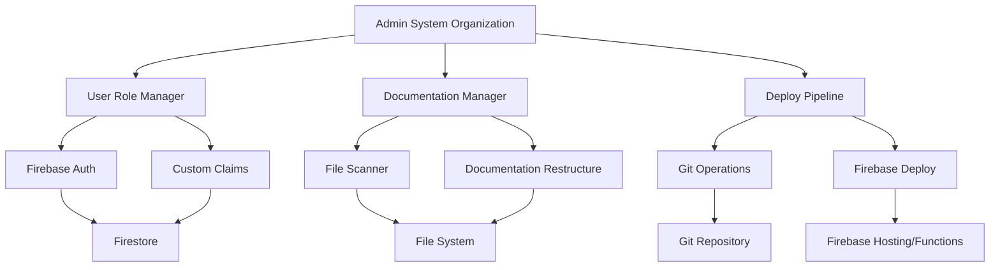

# Design Document

## Overview

The Admin System Organization feature implements a comprehensive solution for administrative user management, documentation centralization, and automated deployment workflows. The system integrates with the existing Firebase-based architecture to provide secure admin role management, maintains project cleanliness through documentation organization, and ensures seamless deployment processes.

## Architecture

The solution follows a three-tier architecture:

1. **Administrative Layer**: Firebase Functions for user role management and custom claims
2. **Organization Layer**: Node.js scripts for file management and documentation restructuring  
3. **Deployment Layer**: Automated CI/CD pipeline integrating Git and Firebase deployment



## Components and Interfaces

### 1. User Role Manager

**Location**: `functions/src/admin/userRoleManager.ts`

**Responsibilities**:
- Validate and assign administrator custom claims
- Verify user authentication and permissions
- Handle role-based access control

**Key Methods**:
```typescript
interface UserRoleManager {
  setAdminRole(uid: string): Promise<void>
  verifyAdminRole(uid: string): Promise<boolean>
  initializeDefaultAdmin(): Promise<void>
}
```

### 2. Documentation Manager

**Location**: `scripts/documentationManager.js`

**Responsibilities**:
- Scan project for .md files
- Create centralized documentation structure
- Move files while preserving references
- Update internal links and references

**Key Methods**:
```javascript
interface DocumentationManager {
  scanForMarkdownFiles(): Promise<string[]>
  createDocumentationStructure(): Promise<void>
  moveFilesToDocumentation(files: string[]): Promise<void>
  updateFileReferences(oldPath: string, newPath: string): Promise<void>
}
```

### 3. Deploy Pipeline

**Location**: `scripts/deployPipeline.js`

**Responsibilities**:
- Automate Git commits for changes
- Execute Firebase deployment
- Handle rollback on deployment failures
- Generate deployment logs

**Key Methods**:
```javascript
interface DeployPipeline {
  commitChanges(message: string): Promise<void>
  deployToFirebase(): Promise<void>
  rollbackOnFailure(): Promise<void>
  validateEnvironment(): Promise<boolean>
}
```

## Data Models

### Admin User Configuration
```typescript
interface AdminUserConfig {
  uid: string
  email: string
  customClaims: {
    admin: boolean
    role: 'administrator'
    permissions: string[]
  }
  createdAt: Date
  lastLogin?: Date
}
```

### Documentation Structure
```typescript
interface DocumentationStructure {
  baseDir: string
  categories: {
    setup: string[]
    deployment: string[]
    migration: string[]
    admin: string[]
    general: string[]
  }
  movedFiles: {
    originalPath: string
    newPath: string
    references: string[]
  }[]
}
```

### Deployment Configuration
```typescript
interface DeploymentConfig {
  gitRepository: string
  firebaseProject: string
  deploymentTargets: ('hosting' | 'functions' | 'firestore')[]
  environmentVariables: Record<string, string>
  rollbackStrategy: 'automatic' | 'manual'
}
```

## Error Handling

### User Role Management Errors
- **InvalidUserError**: When specified UID doesn't exist
- **PermissionError**: When current user lacks admin privileges
- **FirebaseAuthError**: When Firebase Authentication service fails

### Documentation Management Errors
- **FileNotFoundError**: When .md files cannot be located
- **FileSystemError**: When file operations fail
- **ReferenceUpdateError**: When internal links cannot be updated

### Deployment Pipeline Errors
- **GitOperationError**: When Git commands fail
- **DeploymentError**: When Firebase deployment fails
- **EnvironmentError**: When required environment variables are missing
- **RollbackError**: When automatic rollback fails

## Testing Strategy

### Unit Tests
- User role assignment and verification logic
- File scanning and moving operations
- Git and Firebase deployment commands
- Error handling for each component

### Integration Tests
- End-to-end admin user setup process
- Complete documentation reorganization workflow
- Full deployment pipeline execution
- Cross-component error propagation

### System Tests
- Verify admin access in production environment
- Validate documentation structure after reorganization
- Confirm successful deployment and rollback procedures
- Performance testing for large documentation sets

## Security Considerations

### Authentication & Authorization
- Admin role verification before sensitive operations
- Secure custom claims management
- Environment variable protection for sensitive data

### File System Security
- Validation of file paths to prevent directory traversal
- Backup creation before file operations
- Atomic operations for file movements

### Deployment Security
- Secure Git credential management
- Firebase service account key protection
- Deployment environment isolation