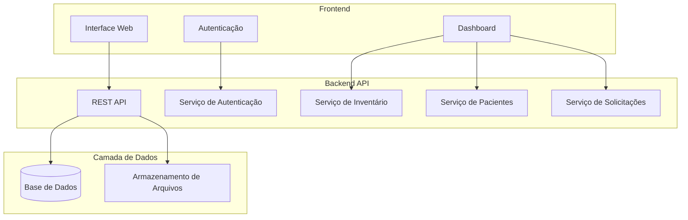
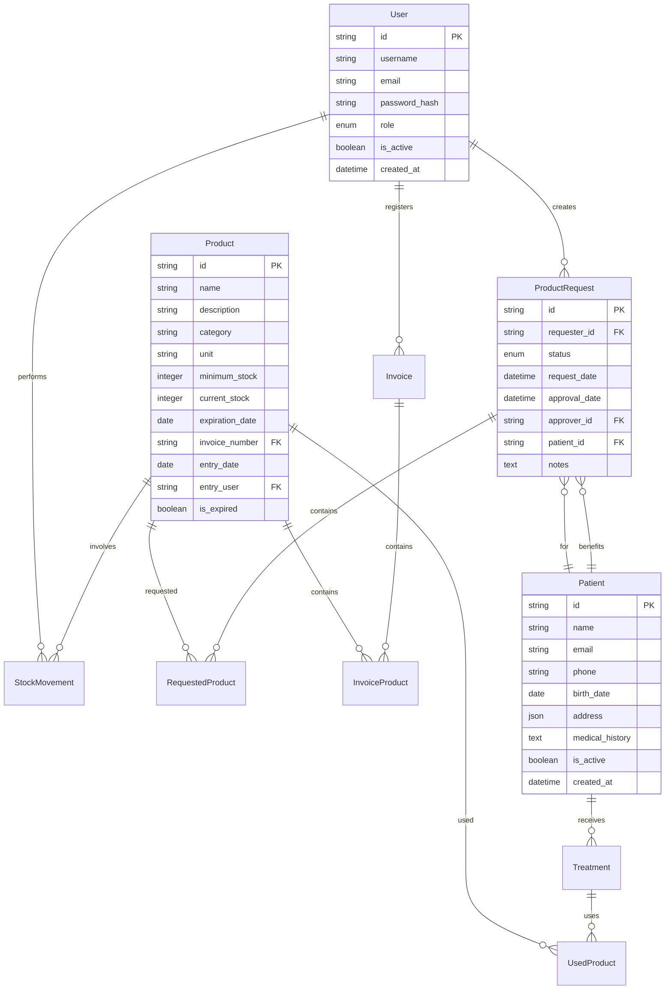

# Documento de Design - Sistema de Gestão de Inventário para Clínicas de Harmonização

## Visão Geral

O sistema será desenvolvido como uma aplicação web moderna com arquitetura em camadas, utilizando tecnologias web padrão para garantir escalabilidade, manutenibilidade e facilidade de uso. A solução priorizará a experiência do usuário com interface intuitiva e responsiva, adequada para uso em diferentes dispositivos dentro do ambiente clínico.

## Arquitetura

### Arquitetura Geral do Sistema



### Stack Tecnológica

**Frontend:**
- HTML5, CSS3, JavaScript (ES6+)
- Framework: React.js ou Vue.js para componentes reutilizáveis
- CSS Framework: Bootstrap ou Tailwind CSS para design responsivo
- Gerenciamento de Estado: Context API ou Vuex

**Backend:**
- Node.js com Express.js ou Python com FastAPI
- Autenticação: JWT (JSON Web Tokens)
- Validação: Joi ou Yup para validação de dados
- Middleware para logging e tratamento de erros

**Base de Dados:**
- PostgreSQL ou MySQL para dados relacionais
- Estrutura normalizada para garantir integridade referencial

## Componentes e Interfaces

### 1. Módulo de Autenticação e Autorização

**Componentes:**
- `AuthController`: Gerencia login, logout e validação de tokens
- `UserService`: Operações CRUD para usuários
- `PermissionMiddleware`: Controla acesso baseado em roles

**Interfaces:**
```typescript
interface User {
  id: string;
  username: string;
  email: string;
  role: UserRole;
  isActive: boolean;
  createdAt: Date;
}

enum UserRole {
  ADMIN = 'admin',
  DOCTOR = 'doctor',
  RECEPTIONIST = 'receptionist',
  MANAGER = 'manager'
}
```

### 2. Módulo de Gestão de Inventário

**Componentes:**
- `ProductController`: Operações CRUD para produtos
- `InventoryService`: Lógica de negócio para controle de estoque
- `ExpirationService`: Monitoramento de datas de validade
- `AlertService`: Sistema de alertas e notificações

**Interfaces:**
```typescript
interface Product {
  id: string;
  name: string;
  description: string;
  category: string;
  unit: string;
  minimumStock: number;
  currentStock: number;
  expirationDate: Date;
  invoiceNumber: string;
  entryDate: Date;
  entryUser: string;
  isExpired: boolean;
}

interface StockMovement {
  id: string;
  productId: string;
  movementType: MovementType;
  quantity: number;
  date: Date;
  userId: string;
  patientId?: string;
  requestId?: string;
  notes?: string;
}

enum MovementType {
  ENTRY = 'entry',
  EXIT = 'exit',
  ADJUSTMENT = 'adjustment'
}
```

### 3. Módulo de Notas Fiscais

**Componentes:**
- `InvoiceController`: Gerenciamento de notas fiscais
- `InvoiceService`: Validação e processamento de notas fiscais

**Interfaces:**
```typescript
interface Invoice {
  id: string;
  number: string;
  supplier: string;
  issueDate: Date;
  receiptDate: Date;
  totalValue: number;
  products: InvoiceProduct[];
  userId: string;
}

interface InvoiceProduct {
  productId: string;
  quantity: number;
  unitPrice: number;
  expirationDate: Date;
}
```

### 4. Módulo de Solicitações

**Componentes:**
- `RequestController`: Gerenciamento de solicitações
- `RequestService`: Processamento e aprovação de solicitações
- `ApprovalWorkflow`: Fluxo de aprovação configurável

**Interfaces:**
```typescript
interface ProductRequest {
  id: string;
  requesterId: string;
  products: RequestedProduct[];
  status: RequestStatus;
  requestDate: Date;
  approvalDate?: Date;
  approverId?: string;
  patientId?: string;
  notes?: string;
}

interface RequestedProduct {
  productId: string;
  quantity: number;
  reason: string;
}

enum RequestStatus {
  PENDING = 'pending',
  APPROVED = 'approved',
  REJECTED = 'rejected',
  FULFILLED = 'fulfilled'
}
```

### 5. Módulo de Gestão de Pacientes

**Componentes:**
- `PatientController`: Operações CRUD para pacientes
- `PatientService`: Lógica de negócio para gestão de pacientes
- `TreatmentService`: Associação de produtos a tratamentos

**Interfaces:**
```typescript
interface Patient {
  id: string;
  name: string;
  email: string;
  phone: string;
  birthDate: Date;
  address: Address;
  medicalHistory?: string;
  isActive: boolean;
  createdAt: Date;
}

interface Treatment {
  id: string;
  patientId: string;
  date: Date;
  procedure: string;
  doctorId: string;
  productsUsed: UsedProduct[];
  notes?: string;
}

interface UsedProduct {
  productId: string;
  quantity: number;
  batchNumber?: string;
}
```

## Modelos de Dados

### Diagrama de Entidade-Relacionamento



## Tratamento de Erros

### Estratégia de Tratamento de Erros

1. **Validação de Entrada:**
   - Validação no frontend para feedback imediato
   - Validação no backend para segurança
   - Mensagens de erro claras e específicas

2. **Erros de Negócio:**
   - Códigos de erro padronizados
   - Logging detalhado para auditoria
   - Rollback automático em transações

3. **Erros de Sistema:**
   - Tratamento gracioso de falhas de conexão
   - Retry automático para operações críticas
   - Notificação de administradores para erros críticos

### Códigos de Erro Padronizados

```typescript
enum ErrorCode {
  // Autenticação
  INVALID_CREDENTIALS = 'AUTH_001',
  TOKEN_EXPIRED = 'AUTH_002',
  INSUFFICIENT_PERMISSIONS = 'AUTH_003',
  
  // Inventário
  PRODUCT_NOT_FOUND = 'INV_001',
  INSUFFICIENT_STOCK = 'INV_002',
  PRODUCT_EXPIRED = 'INV_003',
  INVALID_EXPIRATION_DATE = 'INV_004',
  
  // Solicitações
  REQUEST_NOT_FOUND = 'REQ_001',
  REQUEST_ALREADY_PROCESSED = 'REQ_002',
  INVALID_REQUEST_STATUS = 'REQ_003',
  
  // Notas Fiscais
  DUPLICATE_INVOICE_NUMBER = 'INV_001',
  INVALID_INVOICE_FORMAT = 'INV_002'
}
```

## Estratégia de Testes

### Pirâmide de Testes

1. **Testes Unitários (70%):**
   - Testes para todas as funções de negócio
   - Cobertura mínima de 80%
   - Mocks para dependências externas

2. **Testes de Integração (20%):**
   - Testes de API endpoints
   - Testes de integração com base de dados
   - Testes de fluxos de trabalho completos

3. **Testes End-to-End (10%):**
   - Testes de cenários críticos de usuário
   - Testes de interface de usuário
   - Testes de performance básicos

### Ferramentas de Teste

- **Frontend:** Jest + React Testing Library ou Vue Test Utils
- **Backend:** Jest + Supertest para APIs
- **E2E:** Cypress ou Playwright
- **Base de Dados:** Testcontainers para testes isolados

## Segurança

### Medidas de Segurança Implementadas

1. **Autenticação e Autorização:**
   - JWT com refresh tokens
   - Controle de acesso baseado em roles (RBAC)
   - Sessões com timeout automático

2. **Proteção de Dados:**
   - Criptografia de senhas com bcrypt
   - Validação e sanitização de inputs
   - Proteção contra SQL injection

3. **Comunicação:**
   - HTTPS obrigatório em produção
   - CORS configurado adequadamente
   - Rate limiting para APIs

4. **Auditoria:**
   - Log de todas as operações críticas
   - Rastreamento de alterações de dados
   - Backup automático de dados

## Performance e Escalabilidade

### Otimizações de Performance

1. **Frontend:**
   - Lazy loading de componentes
   - Paginação para listas grandes
   - Cache de dados frequentemente acessados

2. **Backend:**
   - Indexação adequada na base de dados
   - Connection pooling
   - Cache de consultas frequentes

3. **Base de Dados:**
   - Índices otimizados para consultas comuns
   - Particionamento de tabelas grandes
   - Arquivamento de dados históricos

### Considerações de Escalabilidade

- Arquitetura preparada para microserviços futuros
- Separação clara entre camadas
- APIs RESTful stateless
- Possibilidade de load balancing horizontal