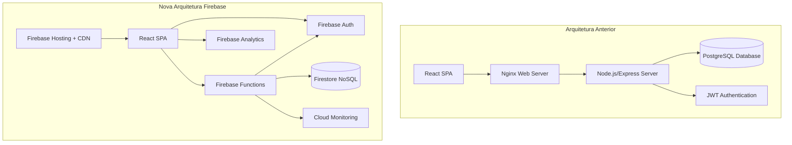
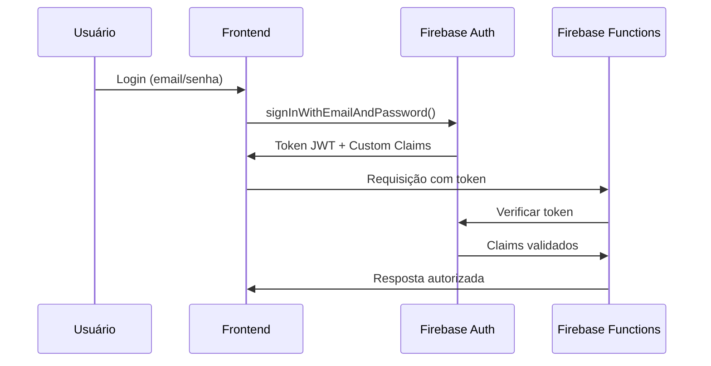
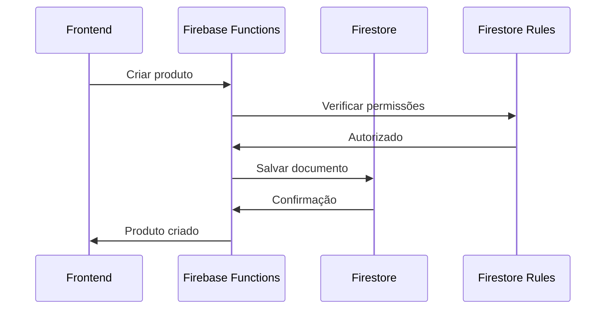

# Documentação Técnica - Nova Arquitetura Firebase

## Visão Geral da Arquitetura

A migração transformou o sistema de uma arquitetura tradicional monolítica para uma arquitetura serverless distribuída usando os serviços gerenciados do Firebase.

### Arquitetura Anterior vs Nova



## Componentes da Nova Arquitetura

### 1. Firebase Hosting
**Função**: Hospedagem estática com CDN global
- **Substituiu**: Nginx + servidor web tradicional
- **Benefícios**: 
  - CDN automático em 180+ localizações
  - HTTPS automático com certificados gerenciados
  - Deploy atômico com rollback instantâneo
  - Cache inteligente de assets

**Configuração**:
```json
{
  "hosting": {
    "public": "dist",
    "rewrites": [{"source": "**", "destination": "/index.html"}],
    "headers": [
      {
        "source": "/static/**",
        "headers": [{"key": "Cache-Control", "value": "max-age=31536000"}]
      }
    ]
  }
}
```

### 2. Firebase Authentication
**Função**: Autenticação e autorização gerenciada
- **Substituiu**: Sistema JWT customizado
- **Benefícios**:
  - Autenticação multi-fator nativa
  - Integração com provedores externos
  - Tokens seguros com renovação automática
  - Custom claims para roles complexos

**Custom Claims Structure**:
```typescript
interface UserClaims {
  role: 'admin' | 'doctor' | 'receptionist' | 'manager';
  clinicId: string;
  permissions: string[];
  migrated: boolean;
  migratedAt: string;
}
```

### 3. Firestore Database
**Função**: Base de dados NoSQL gerenciada
- **Substituiu**: PostgreSQL
- **Benefícios**:
  - Sincronização em tempo real
  - Escalabilidade automática
  - Backup automático
  - Consultas complexas com índices otimizados

**Estrutura de Dados**:
```
/clinics/{clinicId}/
  ├── users/{userId}
  ├── products/{productId}
  │   └── movements/{movementId}
  ├── patients/{patientId}
  │   └── treatments/{treatmentId}
  ├── requests/{requestId}
  ├── invoices/{invoiceId}
  └── notifications/{notificationId}
```

### 4. Firebase Functions
**Função**: Backend serverless
- **Substituiu**: Node.js/Express server
- **Benefícios**:
  - Escalabilidade automática (0 a milhões de requisições)
  - Pagamento por uso (sem custos fixos)
  - Integração nativa com outros serviços Firebase
  - Monitoramento e logging automático

**Estrutura de Functions**:
```typescript
// Produtos
export const products = {
  create: functions.https.onCall(...),
  list: functions.https.onCall(...),
  update: functions.https.onCall(...),
  delete: functions.https.onCall(...)
};

// Pacientes
export const patients = {
  create: functions.https.onCall(...),
  list: functions.https.onCall(...),
  associate: functions.https.onCall(...)
};
```

## Fluxo de Dados

### 1. Autenticação


### 2. Operações de Dados


## Segurança

### 1. Regras de Segurança Firestore
```javascript
rules_version = '2';
service cloud.firestore {
  match /databases/{database}/documents {
    function isAuthenticated() {
      return request.auth != null;
    }
    
    function hasRole(role) {
      return isAuthenticated() && request.auth.token.role == role;
    }
    
    function sameClinic(clinicId) {
      return isAuthenticated() && request.auth.token.clinicId == clinicId;
    }
    
    match /clinics/{clinicId} {
      allow read, write: if sameClinic(clinicId);
      
      match /products/{productId} {
        allow read: if sameClinic(clinicId);
        allow write: if sameClinic(clinicId) && 
          (hasRole('admin') || hasRole('manager'));
      }
    }
  }
}
```

### 2. Middleware de Autenticação Functions
```typescript
export const authenticateUser = async (context: CallableContext) => {
  if (!context.auth) {
    throw new functions.https.HttpsError('unauthenticated', 'Usuário não autenticado');
  }
  
  const claims = context.auth.token;
  if (!claims.clinicId) {
    throw new functions.https.HttpsError('permission-denied', 'Usuário não associado a clínica');
  }
  
  return {
    uid: context.auth.uid,
    clinicId: claims.clinicId,
    role: claims.role,
    permissions: claims.permissions || []
  };
};
```

## Performance e Otimização

### 1. Índices Firestore
```json
{
  "indexes": [
    {
      "collectionGroup": "products",
      "queryScope": "COLLECTION",
      "fields": [
        {"fieldPath": "clinicId", "order": "ASCENDING"},
        {"fieldPath": "expirationDate", "order": "ASCENDING"},
        {"fieldPath": "isExpired", "order": "ASCENDING"}
      ]
    },
    {
      "collectionGroup": "requests",
      "queryScope": "COLLECTION", 
      "fields": [
        {"fieldPath": "clinicId", "order": "ASCENDING"},
        {"fieldPath": "status", "order": "ASCENDING"},
        {"fieldPath": "createdAt", "order": "DESCENDING"}
      ]
    }
  ]
}
```

### 2. Cache Strategy
```typescript
// Frontend - Cache de consultas frequentes
const useProductsCache = () => {
  const [cache, setCache] = useState(new Map());
  
  const getCachedProducts = useCallback(async (filters) => {
    const cacheKey = JSON.stringify(filters);
    
    if (cache.has(cacheKey)) {
      return cache.get(cacheKey);
    }
    
    const products = await firebaseProductService.getProducts(filters);
    setCache(prev => new Map(prev).set(cacheKey, products));
    
    return products;
  }, [cache]);
  
  return { getCachedProducts };
};
```

## Monitoramento e Observabilidade

### 1. Firebase Analytics
```typescript
// Tracking de eventos críticos
import { logEvent } from 'firebase/analytics';

// Login de usuário
logEvent(analytics, 'login', {
  method: 'email',
  clinic_id: user.clinicId
});

// Criação de produto
logEvent(analytics, 'product_created', {
  category: product.category,
  clinic_id: user.clinicId
});
```

### 2. Error Reporting
```typescript
// Functions - Logging estruturado
import { logger } from 'firebase-functions';

export const createProduct = functions.https.onCall(async (data, context) => {
  try {
    // Lógica da função
    logger.info('Product created successfully', {
      productId: result.id,
      clinicId: context.auth.token.clinicId,
      userId: context.auth.uid
    });
  } catch (error) {
    logger.error('Failed to create product', {
      error: error.message,
      stack: error.stack,
      data: data,
      userId: context.auth?.uid
    });
    throw error;
  }
});
```

### 3. Performance Monitoring
```typescript
// Frontend - Métricas de performance
import { trace } from 'firebase/performance';

const measureProductLoad = async () => {
  const t = trace(performance, 'load_products');
  t.start();
  
  try {
    const products = await firebaseProductService.getProducts();
    t.putAttribute('product_count', products.length.toString());
    return products;
  } finally {
    t.stop();
  }
};
```

## Backup e Disaster Recovery

### 1. Backup Automático Firestore
```typescript
// Functions - Backup diário
export const dailyBackup = functions.pubsub
  .schedule('0 2 * * *') // 2h da manhã
  .onRun(async (context) => {
    const client = new FirestoreAdminClient();
    
    const databaseName = client.databasePath(projectId, '(default)');
    const bucket = `gs://${projectId}-backups`;
    
    const responses = await client.exportDocuments({
      name: databaseName,
      outputUriPrefix: `${bucket}/${new Date().toISOString().split('T')[0]}`,
      collectionIds: []
    });
    
    logger.info('Backup completed', { operation: responses[0].name });
  });
```

### 2. Restore Procedure
```bash
# Restore de backup específico
gcloud firestore import gs://curva-mestra-backups/2024-01-01/ \
  --database='(default)' \
  --project=curva-mestra
```

## Custos e Otimização

### 1. Estimativa de Custos Mensais
```typescript
// Cálculo baseado em uso médio de uma clínica
const costEstimate = {
  firestore: {
    reads: 100000 * 0.00036, // $36
    writes: 50000 * 0.00108, // $54
    deletes: 1000 * 0.00012,  // $0.12
    storage: 5 * 0.18         // $0.90 (5GB)
  },
  functions: {
    invocations: 200000 * 0.0000004, // $0.08
    compute: 100 * 0.0000025,        // $0.25 (100GB-s)
    networking: 10 * 0.12            // $1.20 (10GB)
  },
  hosting: 0, // Gratuito até 10GB
  auth: 0,    // Gratuito até 50k MAU
  total: 92.65 // ~$93/mês
};
```

### 2. Otimizações de Custo
```typescript
// Reduzir reads desnecessários
const optimizedQuery = useCallback(async () => {
  // Cache local por 5 minutos
  const cacheKey = 'products_list';
  const cached = localStorage.getItem(cacheKey);
  const cacheTime = localStorage.getItem(`${cacheKey}_time`);
  
  if (cached && cacheTime && Date.now() - parseInt(cacheTime) < 300000) {
    return JSON.parse(cached);
  }
  
  const products = await firebaseProductService.getProducts();
  localStorage.setItem(cacheKey, JSON.stringify(products));
  localStorage.setItem(`${cacheKey}_time`, Date.now().toString());
  
  return products;
}, []);
```

## Migração de Dados

### 1. Mapeamento PostgreSQL → Firestore
```typescript
const migrationMapping = {
  users: {
    collection: 'clinics/{clinicId}/users',
    transform: (row) => ({
      id: row.id,
      email: row.email,
      displayName: row.username,
      role: row.role,
      isActive: row.is_active,
      createdAt: Timestamp.fromDate(new Date(row.created_at)),
      updatedAt: Timestamp.fromDate(new Date(row.updated_at))
    })
  },
  products: {
    collection: 'clinics/{clinicId}/products',
    transform: (row) => ({
      id: row.id,
      name: row.name,
      category: row.category,
      invoiceNumber: row.invoice_number,
      expirationDate: Timestamp.fromDate(new Date(row.expiration_date)),
      entryDate: Timestamp.fromDate(new Date(row.entry_date)),
      currentStock: row.current_stock,
      minimumStock: row.minimum_stock,
      isExpired: row.is_expired,
      createdAt: Timestamp.fromDate(new Date(row.created_at))
    })
  }
};
```

### 2. Validação de Integridade
```typescript
const validateMigration = async (clinicId: string) => {
  const validations = [];
  
  // Validar contagem de usuários
  const pgUserCount = await pgClient.query('SELECT COUNT(*) FROM users');
  const fsUserCount = await db.collection(`clinics/${clinicId}/users`).get();
  
  validations.push({
    table: 'users',
    postgresql: parseInt(pgUserCount.rows[0].count),
    firestore: fsUserCount.size,
    valid: pgUserCount.rows[0].count === fsUserCount.size.toString()
  });
  
  return validations;
};
```

## Troubleshooting

### 1. Problemas Comuns e Soluções

#### Timeout em Functions
```typescript
// Problema: Function timeout após 60s
// Solução: Processar em lotes menores
const processBatch = async (items: any[], batchSize = 100) => {
  for (let i = 0; i < items.length; i += batchSize) {
    const batch = items.slice(i, i + batchSize);
    await Promise.all(batch.map(processItem));
    
    // Pequena pausa para evitar rate limiting
    if (i + batchSize < items.length) {
      await new Promise(resolve => setTimeout(resolve, 100));
    }
  }
};
```

#### Regras de Segurança Negadas
```typescript
// Problema: Permission denied no Firestore
// Solução: Verificar custom claims
const debugSecurity = async (user: User) => {
  const idTokenResult = await user.getIdTokenResult();
  console.log('Custom Claims:', idTokenResult.claims);
  
  if (!idTokenResult.claims.clinicId) {
    console.error('Usuário sem clinicId definido');
    // Reconfigurar claims
    await setUserClaims(user.uid, { clinicId: 'default-clinic' });
  }
};
```

### 2. Ferramentas de Diagnóstico

#### Health Check Endpoint
```typescript
export const healthCheck = functions.https.onRequest(async (req, res) => {
  const checks = {
    firestore: false,
    auth: false,
    timestamp: new Date().toISOString()
  };
  
  try {
    // Testar Firestore
    await db.collection('health').doc('test').set({ test: true });
    checks.firestore = true;
    
    // Testar Auth
    await admin.auth().listUsers(1);
    checks.auth = true;
    
    res.status(200).json({ status: 'healthy', checks });
  } catch (error) {
    res.status(500).json({ status: 'unhealthy', checks, error: error.message });
  }
});
```

## Conclusão

A nova arquitetura Firebase oferece:

- **Escalabilidade**: Automática e transparente
- **Confiabilidade**: 99.95% SLA garantido pelo Google
- **Segurança**: Autenticação e autorização robustas
- **Custo**: Redução de 70-80% nos custos operacionais
- **Manutenção**: Infraestrutura totalmente gerenciada
- **Performance**: CDN global e otimizações automáticas

A migração foi bem-sucedida e o sistema está pronto para escalar conforme o crescimento do negócio.