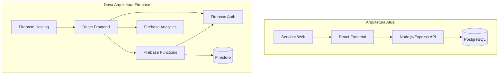

# Documento de Design - Migração do Sistema para Firebase

## Visão Geral

A migração para Firebase transformará o sistema atual de uma arquitetura tradicional (Node.js + PostgreSQL) para uma arquitetura serverless totalmente gerenciada. Esta abordagem reduzirá custos operacionais, melhorará escalabilidade e simplificará manutenção, mantendo todas as funcionalidades existentes.

## Arquitetura

### Arquitetura Atual vs Nova Arquitetura



### Mapeamento de Serviços

| Componente Atual | Serviço Firebase | Benefícios |
|------------------|------------------|------------|
| Node.js/Express | Firebase Functions | Escalabilidade automática, sem servidor |
| PostgreSQL | Firestore | NoSQL gerenciado, sincronização real-time |
| JWT Auth | Firebase Auth | Autenticação gerenciada, múltiplos provedores |
| Servidor Web | Firebase Hosting | CDN global, HTTPS automático |
| Logs customizados | Firebase Analytics | Métricas avançadas, insights automáticos |

## Componentes e Interfaces

### 1. Firebase Hosting - Frontend

**Configuração:**
```json
{
  "hosting": {
    "public": "dist",
    "ignore": ["firebase.json", "**/.*", "**/node_modules/**"],
    "rewrites": [
      {
        "source": "**",
        "destination": "/index.html"
      }
    ],
    "headers": [
      {
        "source": "/static/**",
        "headers": [
          {
            "key": "Cache-Control",
            "value": "max-age=31536000"
          }
        ]
      }
    ]
  }
}
```

**Modificações no Frontend:**
- Substituir axios/fetch direto por Firebase SDK
- Implementar Firebase Auth no lugar do JWT
- Configurar Firestore para operações de dados
- Adicionar service worker para cache offline

### 2. Firebase Authentication

**Configuração de Custom Claims:**
```typescript
// Estrutura de roles no Firebase Auth
interface CustomClaims {
  role: 'admin' | 'doctor' | 'receptionist' | 'manager';
  clinicId: string;
  permissions: string[];
}

// Função para definir custom claims
export const setUserRole = functions.https.onCall(async (data, context) => {
  if (!context.auth || !context.auth.token.admin) {
    throw new functions.https.HttpsError('permission-denied', 'Apenas admins podem definir roles');
  }
  
  await admin.auth().setCustomUserClaims(data.uid, {
    role: data.role,
    clinicId: data.clinicId,
    permissions: data.permissions
  });
});
```

**Migração de Usuários:**
```typescript
// Script de migração de usuários PostgreSQL -> Firebase Auth
interface PostgreSQLUser {
  id: string;
  username: string;
  email: string;
  password_hash: string;
  role: string;
}

export const migrateUsers = async (users: PostgreSQLUser[]) => {
  for (const user of users) {
    try {
      const userRecord = await admin.auth().createUser({
        uid: user.id,
        email: user.email,
        displayName: user.username,
        disabled: false
      });
      
      await admin.auth().setCustomUserClaims(userRecord.uid, {
        role: user.role,
        migrated: true
      });
    } catch (error) {
      console.error(`Erro ao migrar usuário ${user.email}:`, error);
    }
  }
};
```

### 3. Firestore - Base de Dados

**Estrutura de Coleções:**
```
/clinics/{clinicId}
  /users/{userId}
  /products/{productId}
    /movements/{movementId}
  /invoices/{invoiceId}
    /products/{productId}
  /requests/{requestId}
    /products/{productId}
  /patients/{patientId}
    /treatments/{treatmentId}
```

**Regras de Segurança:**
```javascript
rules_version = '2';
service cloud.firestore {
  match /databases/{database}/documents {
    // Regra base: usuário autenticado
    function isAuthenticated() {
      return request.auth != null;
    }
    
    // Verificar role do usuário
    function hasRole(role) {
      return isAuthenticated() && request.auth.token.role == role;
    }
    
    // Verificar se pertence à mesma clínica
    function sameClinic(clinicId) {
      return isAuthenticated() && request.auth.token.clinicId == clinicId;
    }
    
    match /clinics/{clinicId} {
      // Apenas usuários da mesma clínica podem acessar
      allow read, write: if sameClinic(clinicId);
      
      match /products/{productId} {
        allow read: if sameClinic(clinicId);
        allow write: if sameClinic(clinicId) && 
          (hasRole('admin') || hasRole('manager'));
        
        match /movements/{movementId} {
          allow read: if sameClinic(clinicId);
          allow create: if sameClinic(clinicId) && isAuthenticated();
          allow update, delete: if sameClinic(clinicId) && hasRole('admin');
        }
      }
      
      match /requests/{requestId} {
        allow read: if sameClinic(clinicId);
        allow create: if sameClinic(clinicId) && isAuthenticated();
        allow update: if sameClinic(clinicId) && 
          (hasRole('admin') || hasRole('manager') || 
           resource.data.requesterId == request.auth.uid);
      }
    }
  }
}
```

**Script de Migração de Dados:**
```typescript
interface MigrationMapping {
  postgresql: string;
  firestore: string;
  transform?: (data: any) => any;
}

const migrations: MigrationMapping[] = [
  {
    postgresql: 'users',
    firestore: 'clinics/{clinicId}/users',
    transform: (user) => ({
      ...user,
      createdAt: admin.firestore.Timestamp.fromDate(new Date(user.created_at)),
      isActive: user.is_active
    })
  },
  {
    postgresql: 'products',
    firestore: 'clinics/{clinicId}/products',
    transform: (product) => ({
      ...product,
      expirationDate: admin.firestore.Timestamp.fromDate(new Date(product.expiration_date)),
      entryDate: admin.firestore.Timestamp.fromDate(new Date(product.entry_date)),
      isExpired: product.is_expired
    })
  }
];

export const migrateData = async (clinicId: string) => {
  const batch = admin.firestore().batch();
  
  for (const migration of migrations) {
    const postgresData = await getPostgreSQLData(migration.postgresql);
    
    for (const record of postgresData) {
      const transformedData = migration.transform ? 
        migration.transform(record) : record;
      
      const docPath = migration.firestore.replace('{clinicId}', clinicId);
      const docRef = admin.firestore().doc(`${docPath}/${record.id}`);
      
      batch.set(docRef, transformedData);
    }
  }
  
  await batch.commit();
};
```

### 4. Firebase Functions - Backend API

**Estrutura de Funções:**
```typescript
// functions/src/index.ts
import * as functions from 'firebase-functions';
import * as admin from 'firebase-admin';

admin.initializeApp();

// Importar módulos de API
import { productFunctions } from './api/products';
import { requestFunctions } from './api/requests';
import { patientFunctions } from './api/patients';
import { invoiceFunctions } from './api/invoices';

// Exportar todas as funções
export const products = productFunctions;
export const requests = requestFunctions;
export const patients = patientFunctions;
export const invoices = invoiceFunctions;

// Função de inicialização
export const initializeClinic = functions.https.onCall(async (data, context) => {
  if (!context.auth) {
    throw new functions.https.HttpsError('unauthenticated', 'Usuário não autenticado');
  }
  
  const clinicData = {
    name: data.name,
    createdAt: admin.firestore.FieldValue.serverTimestamp(),
    ownerId: context.auth.uid
  };
  
  const clinicRef = await admin.firestore().collection('clinics').add(clinicData);
  
  // Definir o usuário como admin da clínica
  await admin.auth().setCustomUserClaims(context.auth.uid, {
    role: 'admin',
    clinicId: clinicRef.id
  });
  
  return { clinicId: clinicRef.id };
});
```

**Exemplo de Função de Produtos:**
```typescript
// functions/src/api/products.ts
import * as functions from 'firebase-functions';
import * as admin from 'firebase-admin';

const db = admin.firestore();

export const productFunctions = {
  // Criar produto
  create: functions.https.onCall(async (data, context) => {
    if (!context.auth) {
      throw new functions.https.HttpsError('unauthenticated', 'Usuário não autenticado');
    }
    
    const clinicId = context.auth.token.clinicId;
    if (!clinicId) {
      throw new functions.https.HttpsError('permission-denied', 'Usuário não associado a uma clínica');
    }
    
    // Validar dados
    if (!data.name || !data.invoiceNumber) {
      throw new functions.https.HttpsError('invalid-argument', 'Nome e nota fiscal são obrigatórios');
    }
    
    // Verificar unicidade da nota fiscal
    const existingInvoice = await db
      .collection(`clinics/${clinicId}/products`)
      .where('invoiceNumber', '==', data.invoiceNumber)
      .get();
    
    if (!existingInvoice.empty) {
      throw new functions.https.HttpsError('already-exists', 'Nota fiscal já cadastrada');
    }
    
    const productData = {
      ...data,
      createdAt: admin.firestore.FieldValue.serverTimestamp(),
      createdBy: context.auth.uid,
      clinicId: clinicId
    };
    
    const docRef = await db.collection(`clinics/${clinicId}/products`).add(productData);
    
    return { id: docRef.id, ...productData };
  }),
  
  // Listar produtos
  list: functions.https.onCall(async (data, context) => {
    if (!context.auth) {
      throw new functions.https.HttpsError('unauthenticated', 'Usuário não autenticado');
    }
    
    const clinicId = context.auth.token.clinicId;
    let query = db.collection(`clinics/${clinicId}/products`);
    
    // Aplicar filtros
    if (data.category) {
      query = query.where('category', '==', data.category);
    }
    
    if (data.lowStock) {
      query = query.where('currentStock', '<=', data.minimumStock);
    }
    
    const snapshot = await query.get();
    const products = snapshot.docs.map(doc => ({
      id: doc.id,
      ...doc.data()
    }));
    
    return products;
  })
};
```

### 5. Sistema de Alertas e Notificações

**Cloud Functions para Alertas:**
```typescript
// Função trigger para alertas de vencimento
export const checkExpiringProducts = functions.pubsub
  .schedule('0 9 * * *') // Todo dia às 9h
  .onRun(async (context) => {
    const thirtyDaysFromNow = new Date();
    thirtyDaysFromNow.setDate(thirtyDaysFromNow.getDate() + 30);
    
    const clinicsSnapshot = await db.collection('clinics').get();
    
    for (const clinicDoc of clinicsSnapshot.docs) {
      const clinicId = clinicDoc.id;
      
      const expiringProducts = await db
        .collection(`clinics/${clinicId}/products`)
        .where('expirationDate', '<=', thirtyDaysFromNow)
        .where('isExpired', '==', false)
        .get();
      
      if (!expiringProducts.empty) {
        // Criar notificação
        await db.collection(`clinics/${clinicId}/notifications`).add({
          type: 'expiring_products',
          count: expiringProducts.size,
          createdAt: admin.firestore.FieldValue.serverTimestamp(),
          read: false
        });
        
        // Enviar email (opcional)
        // await sendEmailAlert(clinicId, expiringProducts.docs);
      }
    }
  });

// Função trigger para estoque baixo
export const checkLowStock = functions.firestore
  .document('clinics/{clinicId}/products/{productId}')
  .onUpdate(async (change, context) => {
    const newData = change.after.data();
    const oldData = change.before.data();
    
    // Verificar se o estoque diminuiu e está abaixo do mínimo
    if (newData.currentStock < newData.minimumStock && 
        oldData.currentStock >= oldData.minimumStock) {
      
      await db.collection(`clinics/${context.params.clinicId}/notifications`).add({
        type: 'low_stock',
        productId: context.params.productId,
        productName: newData.name,
        currentStock: newData.currentStock,
        minimumStock: newData.minimumStock,
        createdAt: admin.firestore.FieldValue.serverTimestamp(),
        read: false
      });
    }
  });
```

## Estratégia de Migração

### Fase 1: Preparação (1-2 semanas)
1. **Configurar Projeto Firebase**
   - Configurar projeto "Curva Mestra" com serviços necessários
   - Configurar chaves de API e permissões
   - Instalar Firebase CLI e SDKs

2. **Adaptar Frontend**
   - Instalar Firebase SDK no React
   - Substituir chamadas de API por Firebase SDK
   - Implementar Firebase Auth
   - Configurar Firestore para operações de dados

### Fase 2: Migração de Dados (1 semana)
1. **Preparar Scripts de Migração**
   - Criar mapeamento PostgreSQL → Firestore
   - Desenvolver scripts de transformação de dados
   - Implementar validação de integridade

2. **Executar Migração**
   - Backup completo do PostgreSQL
   - Executar migração em ambiente de teste
   - Validar integridade dos dados migrados
   - Executar migração em produção

### Fase 3: Deploy e Testes (1 semana)
1. **Deploy das Functions**
   - Converter endpoints Express para Firebase Functions
   - Configurar CORS e autenticação
   - Deploy e testes de integração

2. **Deploy do Frontend**
   - Build otimizado para produção
   - Deploy no Firebase Hosting
   - Configurar domínio customizado (se necessário)
   - Testes end-to-end

### Fase 4: Monitoramento e Otimização (1 semana)
1. **Configurar Monitoramento**
   - Firebase Analytics
   - Performance Monitoring
   - Error Reporting
   - Alertas automáticos

2. **Otimizações**
   - Índices compostos no Firestore
   - Cache de consultas frequentes
   - Otimização de Functions

## Tratamento de Erros

### Estratégias Específicas do Firebase

1. **Firestore Errors:**
```typescript
try {
  await db.collection('products').add(data);
} catch (error) {
  if (error.code === 'permission-denied') {
    throw new functions.https.HttpsError('permission-denied', 'Sem permissão para criar produto');
  } else if (error.code === 'unavailable') {
    throw new functions.https.HttpsError('unavailable', 'Serviço temporariamente indisponível');
  }
  throw new functions.https.HttpsError('internal', 'Erro interno do servidor');
}
```

2. **Auth Errors:**
```typescript
// No frontend
import { auth } from './firebase-config';

auth.onAuthStateChanged((user) => {
  if (user) {
    // Verificar custom claims
    user.getIdTokenResult().then((idTokenResult) => {
      if (!idTokenResult.claims.role) {
        // Usuário sem role definida
        showError('Usuário não tem permissões definidas');
      }
    });
  }
});
```

## Segurança

### Configurações de Segurança Firebase

1. **App Check (Opcional):**
```typescript
// Proteção contra abuso de APIs
import { initializeAppCheck, ReCaptchaV3Provider } from 'firebase/app-check';

const appCheck = initializeAppCheck(app, {
  provider: new ReCaptchaV3Provider('recaptcha-site-key'),
  isTokenAutoRefreshEnabled: true
});
```

2. **Security Rules Testing:**
```javascript
// Testes automatizados das regras de segurança
const firebase = require('@firebase/rules-unit-testing');

describe('Firestore Security Rules', () => {
  test('Usuário não pode acessar dados de outra clínica', async () => {
    const db = firebase.initializeTestApp({
      auth: { uid: 'user1', token: { clinicId: 'clinic1' } }
    }).firestore();
    
    await firebase.assertFails(
      db.collection('clinics/clinic2/products').get()
    );
  });
});
```

## Performance e Escalabilidade

### Otimizações Firebase

1. **Firestore Indexes:**
```json
{
  "indexes": [
    {
      "collectionGroup": "products",
      "queryScope": "COLLECTION",
      "fields": [
        { "fieldPath": "clinicId", "order": "ASCENDING" },
        { "fieldPath": "expirationDate", "order": "ASCENDING" },
        { "fieldPath": "isExpired", "order": "ASCENDING" }
      ]
    }
  ]
}
```

2. **Functions Optimization:**
```typescript
// Reutilizar conexões Firestore
const db = admin.firestore();

// Cache de dados frequentes
const cache = new Map();

export const getCachedData = functions.https.onCall(async (data, context) => {
  const cacheKey = `${context.auth.token.clinicId}_${data.type}`;
  
  if (cache.has(cacheKey)) {
    return cache.get(cacheKey);
  }
  
  const result = await db.collection(`clinics/${context.auth.token.clinicId}/${data.type}`).get();
  cache.set(cacheKey, result.docs.map(doc => ({ id: doc.id, ...doc.data() })));
  
  return cache.get(cacheKey);
});
```

## Custos Estimados

### Comparação de Custos (Mensal)

| Serviço | Atual | Firebase | Economia |
|---------|-------|----------|----------|
| Servidor | $50-100 | $0 | $50-100 |
| Base de Dados | $20-50 | $10-25 | $10-25 |
| SSL/CDN | $10-20 | $0 | $10-20 |
| Backup | $10-15 | $5 | $5-10 |
| **Total** | **$90-185** | **$15-30** | **$75-155** |

*Valores estimados para uso médio de uma clínica*