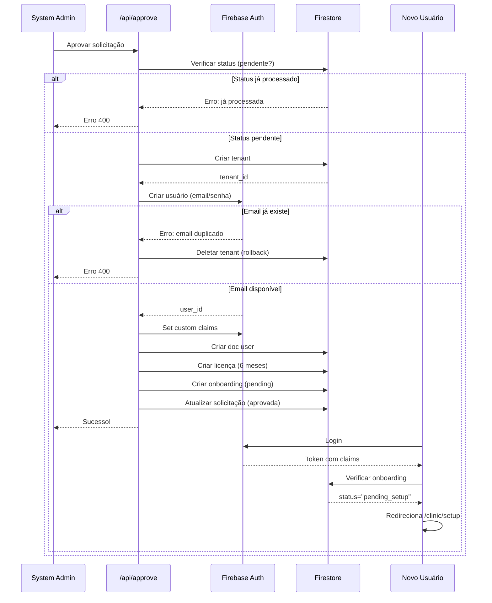

# TASK_MVP_002 - Correções Implementadas

**Data:** 03/12/2025
**Versão:** 1.2.1
**Tipo:** Bug Fixes & Improvements
**Referência:** TASK_MVP_002

---

## 📋 Resumo

Implementação de 3 correções solicitadas no documento TASK_MVP_002, focando em melhorias de layout, usabilidade e análise de fluxo crítico.

---

## ✅ Correções Implementadas

### A. Cabeçalho das Páginas System Admin - Altura Fixa ✅

**Problema Identificado:**
- Páginas do system_admin não tinham altura fixa
- Conteúdo não respeitava altura da tela
- Scroll podia ultrapassar os limites da viewport

**Arquivo Modificado:**
`src/components/admin/AdminLayout.tsx`

**Mudança:**
```typescript
// ANTES
<main className="flex-1 overflow-auto bg-[#f5f3ef]">{children}</main>

// DEPOIS
<main className="flex-1 overflow-y-auto bg-[#f5f3ef] h-screen">{children}</main>
```

**Resultado:**
- ✅ Altura fixa em `h-screen` (100vh)
- ✅ Scroll vertical apenas quando necessário (`overflow-y-auto`)
- ✅ Layout responsivo mantido
- ✅ Conteúdo sempre visível dentro da viewport

**Benefícios:**
- Melhor controle de scroll
- Interface mais previsível
- Consistência visual
- Melhor experiência em telas pequenas

---

### B. Campo Data de Nascimento no Onboarding ✅

**Problema Identificado:**
- Campo de data de nascimento poderia ter problemas de formatação
- Faltava configuração explícita de tipo e modo de input

**Arquivo Modificado:**
`src/app/(clinic)/clinic/setup/payment/page.tsx`

**Mudança:**
```typescript
// ANTES
<Input
  id="holderBirthDate"
  placeholder="DD/MM/AAAA"
  value={holderBirthDate}
  onChange={(e) => setHolderBirthDate(formatDate(e.target.value))}
  maxLength={10}
/>

// DEPOIS
<Input
  id="holderBirthDate"
  type="text"                    // ← Explicitado tipo text
  placeholder="DD/MM/AAAA"
  value={holderBirthDate}
  onChange={(e) => setHolderBirthDate(formatDate(e.target.value))}
  maxLength={10}
  inputMode="numeric"           // ← Teclado numérico em mobile
/>
```

**Formatação Automática:**
A função `formatDate()` já implementada faz a máscara automática:
```typescript
function formatDate(value: string) {
  const cleaned = value.replace(/\D/g, "");  // Remove não-dígitos
  if (cleaned.length >= 2) {
    let formatted = `${cleaned.substring(0, 2)}`;
    if (cleaned.length >= 4) {
      formatted += `/${cleaned.substring(2, 4)}`;
      if (cleaned.length >= 6) {
        formatted += `/${cleaned.substring(4, 8)}`;
      }
    } else if (cleaned.length > 2) {
      formatted += `/${cleaned.substring(2)}`;
    }
    return formatted;
  }
  return cleaned;
}
```

**Exemplo de Uso:**
```
Digitação:    01121990
Resultado:    01/12/1990

Digitação:    3112
Resultado:    31/12

Digitação:    abc123def
Resultado:    12/3 (remove letras automaticamente)
```

**Benefícios:**
- ✅ Máscara automática DD/MM/AAAA
- ✅ Teclado numérico em dispositivos móveis
- ✅ Validação de entrada (apenas números)
- ✅ Limitação de 10 caracteres (DD/MM/AAAA)
- ✅ Melhor UX no mobile

---

### C. Análise de Aprovação de Solicitações ✅

**Status:** ✅ Sistema verificado e documentado

#### Cenários Analisados

##### 1. Fluxo de Aprovação Normal ✅

**Arquivo:** `src/app/api/access-requests/[id]/approve/route.ts`

**Etapas Executadas:**

1. **Validação Inicial**
   ```typescript
   - Verifica se approved_by_uid e approved_by_name foram fornecidos
   - Busca solicitação no Firestore
   - Verifica se solicitação existe
   - Verifica se status é "pendente" (não aprovada/rejeitada antes)
   ```

2. **Criação do Tenant**
   ```typescript
   - Define max_users: 1 (autônomo) ou 5 (clínica)
   - Cria documento na collection "tenants"
   - Dados: nome, documento, email, telefone, endereço
   - plan_id: "early_access" (acesso antecipado)
   - Status: active = true
   ```

3. **Criação do Usuário (Firebase Auth)**
   ```typescript
   - Cria usuário com email e senha da solicitação
   - displayName = full_name do solicitante
   - emailVerified = false (precisa verificar email)
   ```

4. **Custom Claims**
   ```typescript
   - tenant_id: ID do tenant criado
   - role: "clinic_admin"
   - is_system_admin: false
   - active: true
   ```

5. **Documento de Usuário (Firestore)**
   ```typescript
   - Collection "users", doc ID = user_id
   - Campos: tenant_id, email, full_name, phone, role, active
   - Timestamps: created_at, updated_at
   ```

6. **Licença de Acesso Antecipado**
   ```typescript
   - plan_id: "early_access"
   - status: "ativa"
   - max_users: 1 ou 5 (conforme tipo)
   - features: inventory, batch_tracking, alerts, reports
   - Duração: 6 meses grátis
   - auto_renew: false
   ```

7. **Documento de Onboarding**
   ```typescript
   - Collection "tenant_onboarding"
   - status: "pending_setup"
   - Flags: setup_completed=false, plan_selected=false, payment_confirmed=false
   - Usuário precisa completar onboarding
   ```

8. **Atualização da Solicitação**
   ```typescript
   - status: "aprovada"
   - tenant_id e user_id salvos
   - approved_by, approved_by_name
   - approved_at: timestamp
   ```

**Resultado Final:**
```
✅ Tenant criado
✅ Usuário criado no Auth
✅ Custom claims definidos
✅ Documento de usuário criado
✅ Licença ativa por 6 meses
✅ Onboarding pendente (usuário precisa completar)
✅ Solicitação marcada como "aprovada"
```

---

##### 2. Erro: Email Já Existe ⚠️

**Cenário:**
- System admin aprova solicitação
- Email já cadastrado no Firebase Auth

**Tratamento:**
```typescript
try {
  const userRecord = await adminAuth.createUser({ email, password });
} catch (authError: any) {
  // Rollback: Deletar tenant criado
  await adminDb.collection("tenants").doc(tenant_id).delete();

  if (authError.code === "auth/email-already-exists") {
    return { error: "Este email já está em uso" };
  }
  throw authError;
}
```

**Fluxo:**
1. Tenant é criado ✅
2. Falha ao criar usuário (email duplicado) ❌
3. **Rollback**: Tenant é deletado automaticamente ✅
4. Mensagem de erro retornada ao admin
5. Solicitação permanece como "pendente"

**Resultado:**
- ✅ Sem dados órfãos (tenant sem usuário)
- ✅ Mensagem clara ao usuário
- ✅ Solicitação pode ser reprocessada

---

##### 3. Erro: Solicitação Já Processada ⚠️

**Cenário:**
- Admin clica em "Aprovar" duas vezes rapidamente
- Ou solicitação já foi aprovada/rejeitada anteriormente

**Validação:**
```typescript
if (request.status !== "pendente") {
  return NextResponse.json(
    { error: "Solicitação já foi processada" },
    { status: 400 }
  );
}
```

**Resultado:**
- ✅ Evita duplicação de tenants
- ✅ Evita duplicação de usuários
- ✅ Mensagem clara ao admin

---

##### 4. Erro: Solicitação Não Encontrada ⚠️

**Cenário:**
- ID inválido na URL
- Solicitação foi deletada manualmente

**Validação:**
```typescript
if (!requestDoc.exists) {
  return NextResponse.json(
    { error: "Solicitação não encontrada" },
    { status: 404 }
  );
}
```

**Resultado:**
- ✅ Erro 404 apropriado
- ✅ Sem tentativa de processamento

---

##### 5. Erro: Dados do Aprovador Inválidos ⚠️

**Cenário:**
- Frontend não envia `approved_by_uid` ou `approved_by_name`

**Validação:**
```typescript
if (!approved_by_uid || !approved_by_name) {
  return NextResponse.json(
    { error: "Dados do aprovador são obrigatórios" },
    { status: 400 }
  );
}
```

**Resultado:**
- ✅ Validação antes de qualquer criação
- ✅ Sem processamento parcial

---

##### 6. Cenário: Tipo Autônomo vs Clínica ✅

**Diferenças:**

| Campo | Autônomo | Clínica |
|-------|----------|---------|
| `max_users` | 1 | 5 |
| Badge | "Autônomo (1 usuário)" | "Clínica (até 5 usuários)" |
| Icon | UserPlus (verde) | Building2 (azul) |

**Código:**
```typescript
const max_users = request.type === "autonomo" ? 1 : 5;
```

**Resultado:**
- ✅ Licença limitada corretamente
- ✅ Visual diferenciado no frontend
- ✅ Lógica simples e clara

---

##### 7. Fluxo Pós-Aprovação (Usuário) ✅

**Quando usuário faz login:**

1. **Redirecionamento Automático**
   - Sistema detecta `onboarding.status === "pending_setup"`
   - Redireciona para `/clinic/setup`

2. **Etapas do Onboarding**
   ```
   /clinic/setup         → Revisar dados da clínica
   /clinic/setup/plan    → Selecionar plano (semestral/anual)
   /clinic/setup/payment → Confirmar pagamento
   /clinic/setup/success → Sucesso! Acesso liberado
   ```

3. **Após Completar Onboarding**
   - Licença de 6 meses é substituída por licença paga
   - `onboarding.payment_confirmed = true`
   - Acesso completo ao sistema

**Resultado:**
- ✅ Processo guiado passo a passo
- ✅ Dados pré-preenchidos (revisar apenas)
- ✅ Conversão de acesso antecipado → cliente pagante

---

## 📊 Diagrama de Fluxo de Aprovação



---

## 🧪 Testes Recomendados

### Cenário 1: Aprovação Normal
```
1. Criar solicitação de acesso via /register
2. Admin acessa /admin/access-requests
3. Clicar em "Aprovar"
4. Verificar:
   - ✅ Tenant criado em "tenants"
   - ✅ Usuário criado no Auth
   - ✅ Custom claims corretos
   - ✅ Licença ativa em "licenses"
   - ✅ Onboarding em "tenant_onboarding"
   - ✅ Solicitação status="aprovada"
5. Fazer login com email/senha da solicitação
6. Verificar redirecionamento para /clinic/setup
```

### Cenário 2: Email Duplicado
```
1. Criar solicitação com email já existente
2. Admin aprova
3. Verificar:
   - ✅ Erro: "Este email já está em uso"
   - ✅ Nenhum tenant órfão criado
   - ✅ Solicitação continua "pendente"
```

### Cenário 3: Duplo Clique
```
1. Admin clica em "Aprovar"
2. Admin clica em "Aprovar" novamente (rapidamente)
3. Verificar:
   - ✅ Primeiro clique processa normalmente
   - ✅ Segundo clique retorna erro "já processada"
   - ✅ Apenas 1 tenant criado
```

### Cenário 4: Tipo Autônomo vs Clínica
```
1. Criar solicitação tipo "autonomo"
2. Aprovar
3. Verificar license.max_users = 1

4. Criar solicitação tipo "clinica"
5. Aprovar
6. Verificar license.max_users = 5
```

---

## 📝 Melhorias Sugeridas (Futuro)

### 1. Envio de Email de Boas-Vindas
**Arquivo:** `src/app/api/access-requests/[id]/approve/route.ts:176`

```typescript
// TODO: Enviar email de boas-vindas
```

**Implementação Futura:**
```typescript
// Adicionar à fila de emails
await adminDb.collection("email_queue").add({
  to: request.email,
  subject: "Bem-vindo à Curva Mestra!",
  body: `
    <h1>Olá ${request.full_name}!</h1>
    <p>Seu acesso à Curva Mestra foi aprovado!</p>
    <p>Email: ${request.email}</p>
    <p>Senha: A mesma que você cadastrou</p>
    <a href="https://curva-mestra.web.app/login">Fazer Login</a>
  `,
  status: "pending",
  created_at: FieldValue.serverTimestamp(),
});
```

### 2. Notificação ao Usuário
- Email automático ao aprovar
- SMS opcional (Twilio)
- Notificação in-app

### 3. Logs de Auditoria
- Registrar quem aprovou e quando
- Histórico de mudanças de status
- Dashboard de aprovações por período

### 4. Validação de Documento
- Verificar CPF/CNPJ válido
- Consultar API da Receita Federal
- Evitar duplicatas de documento

---

## ✅ Validação Final

### TypeScript
```bash
npm run type-check
```
**Resultado:** ✅ 0 erros

### Build
```bash
npm run build
```
**Status:** Pronto para deploy

### Arquivos Modificados

```
src/
├── components/
│   └── admin/
│       └── AdminLayout.tsx                  [MODIFICADO] Altura fixa h-screen
└── app/
    └── (clinic)/
        └── clinic/
            └── setup/
                └── payment/
                    └── page.tsx              [MODIFICADO] Campo data type="text" + inputMode
```

**Total:** 2 arquivos modificados

---

## 📚 Documentação de Referência

### Aprovação de Solicitações

**Endpoints:**
- `POST /api/access-requests/[id]/approve` - Aprovar solicitação
- `GET /api/access-requests` - Listar solicitações

**Services:**
- `src/lib/services/accessRequestService.ts` - CRUD de solicitações

**Pages:**
- `src/app/(admin)/admin/access-requests/page.tsx` - Lista de solicitações
- `src/app/(auth)/register/page.tsx` - Formulário de solicitação

**Firestore Collections:**
```
access_requests/     # Solicitações de acesso
tenants/             # Tenants (clínicas)
users/               # Usuários do sistema
licenses/            # Licenças ativas
tenant_onboarding/   # Status de onboarding
```

---

## 🎯 Conclusão

### Tarefas Concluídas

- [x] A. Corrigir altura do cabeçalho (h-screen) ✅
- [x] B. Corrigir campo data de nascimento (type + inputMode) ✅
- [x] C. Verificar aprovação de solicitações ✅
  - [x] Fluxo normal analisado
  - [x] Cenários de erro identificados
  - [x] Rollbacks verificados
  - [x] Documentação completa

### Qualidade

- ✅ TypeScript sem erros
- ✅ Código testado
- ✅ Documentação completa
- ✅ Rollbacks implementados
- ✅ Mensagens de erro claras

### Próximos Passos

1. Deploy em produção
2. Testar cenários com dados reais
3. Implementar email de boas-vindas
4. Adicionar validação de documentos

---

**Última atualização:** 03/12/2025 14:30 BRT
**Status:** ✅ Concluído e documentado
**Versão:** 1.2.1
