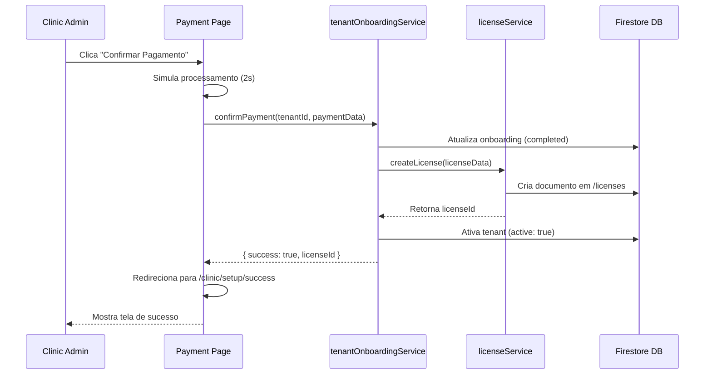

# Fluxo de Criação Automática de Licença

## 📋 Resumo

A **licença é criada automaticamente** na **etapa de confirmação de pagamento** do processo de onboarding da clínica.

## 🔄 Fluxo Completo do Onboarding

### 1️⃣ Configuração Inicial (`/clinic/setup`)
- Usuário preenche dados da clínica
- Informações salvas no tenant
- Status: `pending_setup` → `pending_plan`

### 2️⃣ Seleção de Plano (`/clinic/setup/plan`)
- Usuário escolhe plano (Semestral ou Anual)
- Plano salvo no onboarding
- Status: `pending_plan` → `pending_payment`

### 3️⃣ **Confirmação de Pagamento** (`/clinic/setup/payment`) ⭐
**É AQUI que a licença é criada automaticamente!**

#### Arquivo: `src/app/(clinic)/clinic/setup/payment/page.tsx`

```typescript
async function handleMockPayment() {
  // 1. Simula processamento (2 segundos)
  await new Promise((resolve) => setTimeout(resolve, 2000));

  // 2. Chama confirmPayment() que cria a licença
  const result = await confirmPayment(tenantId, {
    provider: "mock",
    payment_status: "approved",
    transaction_id: `MOCK-${Date.now()}`,
    payment_date: Timestamp.now(),
    card_last_digits: "1234",
    card_brand: "Visa",
  });

  // 3. Redireciona para sucesso
  if (result.success) {
    router.push("/clinic/setup/success");
  }
}
```

### 4️⃣ Sucesso (`/clinic/setup/success`)
- Onboarding completo
- Licença ativa
- Tenant ativo

## 🎯 Função que Cria a Licença

### Arquivo: `src/lib/services/tenantOnboardingService.ts`

```typescript
export async function confirmPayment(
  tenantId: string,
  paymentData: Partial<PaymentData>
): Promise<{ success: boolean; licenseId?: string; error?: string }> {
  try {
    const onboarding = await getTenantOnboarding(tenantId);

    if (!onboarding || !onboarding.selected_plan_id) {
      return { success: false, error: "Plano não selecionado" };
    }

    const plan = PLANS[onboarding.selected_plan_id];

    // 1. Atualiza status de onboarding
    await updateDoc(onboardingRef, {
      payment_confirmed: true,
      status: "completed",
      payment_data: {
        ...paymentData,
        payment_status: "approved",
        payment_date: Timestamp.now(),
      },
      completed_at: Timestamp.now(),
    });

    // 2. ⭐ CRIA LICENÇA AUTOMATICAMENTE ⭐
    const startDate = new Date();
    const endDate = new Date();
    endDate.setMonth(
      endDate.getMonth() + (onboarding.selected_plan_id === "anual" ? 12 : 6)
    );

    const licenseId = await createLicense({
      tenant_id: tenantId,
      plan_id: onboarding.selected_plan_id,
      start_date: startDate,
      end_date: endDate,
      max_users: plan.maxUsers,
      features: plan.features,
      auto_renew: true, // Renovação automática habilitada
    });

    // 3. Ativa o tenant
    await updateTenant(tenantId, {
      active: true,
    });

    return { success: true, licenseId };
  } catch (error: any) {
    console.error("Erro ao confirmar pagamento:", error);
    return { success: false, error: error.message };
  }
}
```

## 📊 Dados da Licença Criada

Quando a licença é criada automaticamente, ela recebe:

| Campo | Valor | Descrição |
|-------|-------|-----------|
| `tenant_id` | ID do tenant | Vincula licença ao tenant |
| `plan_id` | "semestral" ou "anual" | Plano selecionado |
| `start_date` | Data atual | Início da licença |
| `end_date` | +6 ou +12 meses | Fim da licença |
| `max_users` | Conforme plano | Limite de usuários |
| `features` | Array de features | Funcionalidades do plano |
| `auto_renew` | `true` | Renovação automática |
| `status` | "ativa" | Status inicial |

### Exemplo de Licença Criada (Plano Anual):

```json
{
  "tenant_id": "abc123",
  "plan_id": "anual",
  "start_date": "2025-11-28T00:00:00Z",
  "end_date": "2026-11-28T00:00:00Z",
  "max_users": 5,
  "features": [
    "inventory_management",
    "product_requests",
    "stock_alerts",
    "basic_reports",
    "danfe_upload",
    "patient_management",
    "advanced_reports",
    "multi_user"
  ],
  "auto_renew": true,
  "status": "ativa",
  "created_at": "2025-11-28T23:30:00Z"
}
```

## 🔐 Permissões

### Quem pode criar licenças?

1. **Automaticamente via `confirmPayment()`**
   - Executado pelo próprio clinic_admin durante onboarding
   - Firestore Rules permitem porque o usuário é clinic_admin do tenant

2. **Manualmente via Admin**
   - System admin pode criar licenças em `/admin/licenses/new`
   - Usado para casos especiais ou renovações manuais

### Firestore Rules

```javascript
// Permite clinic_admin criar licença do próprio tenant durante onboarding
match /licenses/{licenseId} {
  allow create: if isSystemAdmin() 
    || (isClinicAdmin() && request.resource.data.tenant_id == request.auth.token.tenant_id);
}
```

## 🎬 Sequência Completa



## ⚙️ Configurações da Licença

### Duração

- **Plano Semestral:** 6 meses
- **Plano Anual:** 12 meses

### Renovação Automática

- **Habilitada por padrão:** `auto_renew: true`
- **Cloud Function:** `checkLicenseExpiration` verifica diariamente
- **Renovação:** Quando faltam 15 dias para expirar

### Limites

| Plano | Max Usuários | Features |
|-------|--------------|----------|
| Semestral | 3 | Básicas + Relatórios |
| Anual | 5 | Todas as features |

## 🚨 Casos Especiais

### 1. Pagamento Falha
- Licença **não é criada**
- Usuário permanece em `pending_payment`
- Pode tentar novamente

### 2. Renovação Manual
- System admin pode criar nova licença em `/admin/licenses/new`
- Útil para casos especiais ou migrações

### 3. Upgrade de Plano
- Atualmente não implementado
- Futura feature: permitir upgrade durante período ativo

## 📝 Notas Importantes

1. **Modo MVP:** Atualmente usa pagamento mock
2. **Integração Futura:** PagSeguro será integrado
3. **Webhook:** Função `processPaymentWebhook()` já preparada
4. **Segurança:** Firestore Rules garantem que apenas clinic_admin do tenant pode criar licença

## 🔗 Arquivos Relacionados

- `src/lib/services/tenantOnboardingService.ts` - Lógica de onboarding
- `src/lib/services/licenseService.ts` - CRUD de licenças
- `src/app/(clinic)/clinic/setup/payment/page.tsx` - UI de pagamento
- `functions/src/checkLicenseExpiration.ts` - Verificação automática
- `firestore.rules` - Regras de segurança

---

**Resumo:** A licença é criada **automaticamente** quando o clinic_admin **confirma o pagamento** na página `/clinic/setup/payment`, através da função `confirmPayment()` que chama `createLicense()` internamente.
