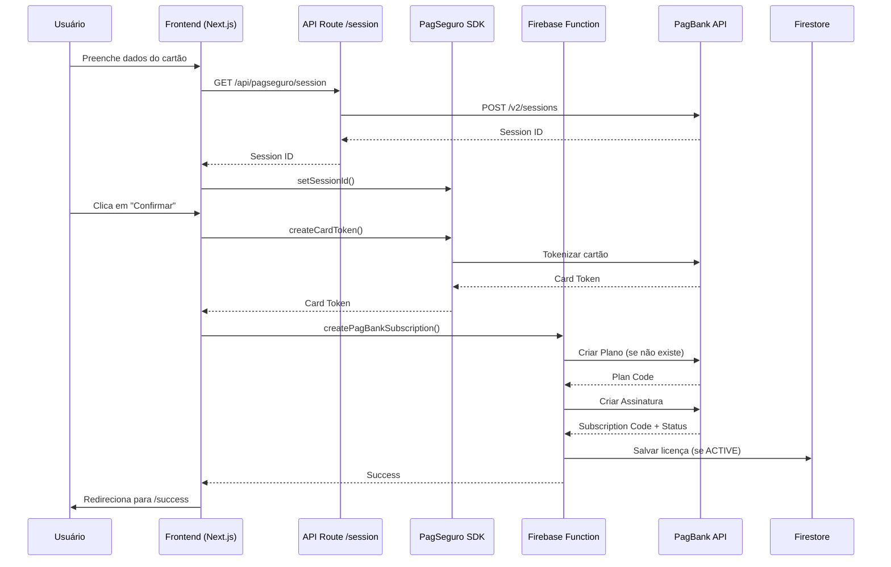

# Integração PagBank/PagSeguro - Guia Completo

## ✅ Status da Implementação

**CONCLUÍDO** - Todos os arquivos criados e configurados para ambiente Sandbox

### Arquivos Criados

#### Backend (Firebase Functions)
- ✅ `functions/src/types/pagbank.ts` - Tipos TypeScript
- ✅ `functions/src/lib/pagbankClient.ts` - Cliente da API PagBank
- ✅ `functions/src/createPagBankSubscription.ts` - Function para criar assinaturas
- ✅ `functions/src/pagbankWebhook.ts` - Function para receber webhooks
- ✅ `functions/src/index.ts` - Exportações atualizadas

#### Frontend
- ✅ `src/app/api/pagseguro/session/route.ts` - API route para criar sessão
- ✅ `src/app/(clinic)/clinic/setup/payment/page.tsx` - Página de pagamento com formulário completo

#### Configuração
- ✅ `.env.local` - Variáveis de ambiente
- ✅ Firebase Secrets configurados (PAGBANK_TOKEN e PAGBANK_EMAIL)

---

## 🧪 Como Testar Localmente

### 1. Iniciar o Servidor de Desenvolvimento

```bash
# Terminal 1: Next.js
npm run dev

# Terminal 2: Firebase Emulators (se quiser testar functions localmente)
firebase emulators:start
```

### 2. Acessar a Página de Pagamento

1. Faça login no sistema como `clinic_admin`
2. Vá até o fluxo de onboarding: `/clinic/setup`
3. Complete as etapas até chegar em `/clinic/setup/payment`

### 3. Usar Cartões de Teste do PagSeguro

#### Cartão APROVADO (Visa)
```
Número: 4111 1111 1111 1111
Titular: TESTE APROVADO
Validade: 12/30 (qualquer data futura)
CVV: 123
CPF: 22222222222
Data Nascimento: 01/01/1990
Telefone: (11) 99999-9999
```

#### Cartão RECUSADO (Mastercard)
```
Número: 5555 5555 5555 5555
Titular: TESTE RECUSADO
Validade: 12/30
CVV: 123
CPF: 22222222222
Data Nascimento: 01/01/1990
Telefone: (11) 99999-9999
```

#### Outros Cartões de Teste

| Bandeira | Número | Resultado |
|----------|--------|-----------|
| Visa | 4111111111111111 | Aprovado |
| Mastercard | 5555555555554444 | Aprovado |
| Elo | 6362970000457013 | Aprovado |
| Amex | 376411112222331 | Aprovado |
| Hipercard | 6062825624254001 | Aprovado |

**Importante**: No sandbox, qualquer CVV e data de validade futura funcionam.

---

## 🔍 Fluxo de Pagamento



---

## 📊 Monitoramento e Debug

### Logs do Frontend
Abra o Console do navegador (F12) e procure por:
- `[PagSeguro] Inicializando...`
- `[PagSeguro] Session configurada: XXX`
- `[PagSeguro] Token criado: XXX`
- `[Firebase] Criando assinatura...`

### Logs do Backend (Functions)
```bash
# Ver logs em tempo real
firebase functions:log --only createPagBankSubscription

# Ou no console do Firebase
https://console.firebase.google.com/project/curva-mestra/functions/logs
```

### Estrutura de Dados no Firestore

#### Tenant (atualizado após pagamento)
```javascript
{
  id: "tenant_abc123",
  name: "Clínica Exemplo",
  pagbank_plan_id: "PLAN_CODE_FROM_PAGBANK",
  pagbank_subscription_code: "SUBSCRIPTION_CODE",
  payment_status: "ACTIVE" | "PENDING" | "CANCELLED",
  payment_date: Timestamp,
  // ... outros campos
}
```

#### License (criada se pagamento aprovado)
```javascript
{
  id: "auto_generated",
  tenant_id: "tenant_abc123",
  plan_id: "semestral" | "anual",
  max_users: 5,
  features: [...],
  start_date: Timestamp,
  end_date: Timestamp,
  status: "ativa",
  auto_renew: true,
  pagbank_subscription_code: "SUBSCRIPTION_CODE",
  created_at: Timestamp,
  updated_at: Timestamp
}
```

---

## 🚨 Possíveis Erros e Soluções

### 1. "Erro ao inicializar sistema de pagamento"

**Causa**: SDK do PagSeguro não carregou ou credenciais inválidas

**Solução**:
```bash
# Verificar se .env.local está configurado
cat .env.local | grep PAGBANK

# Recarregar a página
# Verificar console do navegador
```

### 2. "Cartão inválido"

**Causa**: Número de cartão não reconhecido pelo PagSeguro

**Solução**: Use os cartões de teste listados acima

### 3. "Falha ao criar sessão"

**Causa**: Token ou e-mail do PagBank incorretos

**Solução**:
```bash
# Verificar credenciais
firebase functions:secrets:access PAGBANK_TOKEN
firebase functions:secrets:access PAGBANK_EMAIL

# Reconfigurar se necessário
echo "SEU_TOKEN" | firebase functions:secrets:set PAGBANK_TOKEN
echo "SEU_EMAIL" | firebase functions:secrets:set PAGBANK_EMAIL
```

### 4. "Internal error" na Function

**Causa**: Erro na lógica da function

**Solução**:
```bash
# Ver logs detalhados
firebase functions:log --only createPagBankSubscription

# Verificar collection payment_errors no Firestore
```

---

## 🔐 Webhooks (Produção)

### Configurar URL do Webhook

1. Acesse: https://pagseguro.uol.com.br/
2. Vá em **Integrações → Notificações de transação**
3. Adicione a URL: `https://curva-mestra.web.app/pagbankWebhook`
4. Selecione eventos:
   - `Assinatura criada`
   - `Assinatura cancelada`
   - `Pagamento aprovado`
   - `Pagamento cancelado`

### Testar Webhook Localmente

```bash
# Usar ngrok para expor localhost
ngrok http 5001

# Configurar URL no PagSeguro (sandbox)
https://XXXXXX.ngrok.io/curva-mestra/southamerica-east1/pagbankWebhook
```

---

## 📝 Próximos Passos

### Para Produção

1. **Solicitar Liberação PagBank**
   - Entrar em contato com suporte
   - Solicitar ativação de Pagamentos Recorrentes
   - Aguardar aprovação (1-3 dias úteis)

2. **Obter Token de Produção**
   ```bash
   # Acessar: https://acesso.pagseguro.uol.com.br/
   # Menu: Venda online → Integrações → Gerar Token

   # Configurar no Firebase
   echo "TOKEN_PRODUCAO" | firebase functions:secrets:set PAGBANK_TOKEN_PROD
   ```

3. **Alterar URLs para Produção**
   - Frontend: Trocar SDK de `sandbox` para produção
   - Backend: Alterar `isProduction` para `true`

4. **Testar em Staging**
   - Deploy em preview channel
   - Testar com cartão real (valor baixo)
   - Verificar webhooks

5. **Deploy Final**
   ```bash
   firebase deploy --only functions,hosting
   ```

---

## 📚 Documentação de Referência

- [PagBank API Docs](https://developer.pagbank.com.br/docs/apis-pagbank)
- [Pagamentos Recorrentes](https://developer.pagbank.com.br/docs/pagamentos-recorrentes)
- [Cartões de Teste](https://developer.pagbank.com.br/docs/testando-sua-integracao)
- [Webhooks](https://developer.pagbank.com.br/docs/webhooks)

---

## ✅ Checklist de Implementação

- [x] Tipos TypeScript criados
- [x] Cliente PagBank API implementado
- [x] Function de criação de assinatura
- [x] Function de webhook
- [x] API route de sessão
- [x] Página de pagamento com formulário
- [x] Variáveis de ambiente configuradas
- [x] Secrets do Firebase configurados
- [x] Build das functions compilado
- [ ] Teste end-to-end com cartão de teste
- [ ] Configurar webhook URL
- [ ] Solicitar liberação produção
- [ ] Deploy em produção

---

**Desenvolvido em**: 01/12/2025
**Ambiente**: Sandbox PagSeguro
**Status**: Pronto para testes
