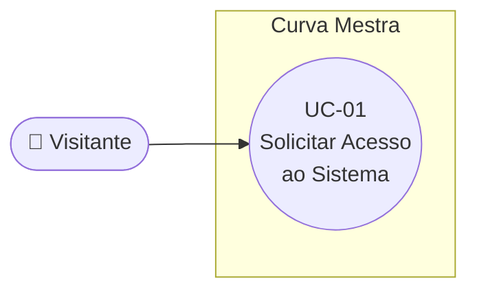

# UC-01: Solicitar Acesso ao Sistema

**Projeto:** Curva Mestra
**Data de Criação:** 13/07/2026
**Autor:** Guilherme Scandelari (via uml-use-case-writer)
**Status:** Aprovado
**Módulo/Contexto:** Autenticação / Aquisição de Clientes
**Versão:** 1.1.1

> Um visitante (futura clínica ou profissional autônomo) preenche o formulário de registro para solicitar acesso à plataforma Curva Mestra. A solicitação fica pendente até ser analisada por um System Admin (ver UC-02 e UC-03) — não há auto-aprovação.

---

## 1. Diagrama UML (Mermaid)

---

## 2. Atores

### 2.1 Ator Primário
**Visitante** — pessoa não autenticada que deseja usar a plataforma, em nome de uma clínica (CNPJ) ou como profissional autônomo (CPF). Se a solicitação for aprovada (UC-02), este visitante se torna `clinic_admin` do tenant criado.

### 2.2 Atores Secundários / Sistemas Externos
Nenhum. Toda a validação e persistência ocorre dentro do próprio sistema Curva Mestra (frontend + API route + Firestore).

---

## 3. Pré-condições
- O visitante não possui sessão Firebase Auth ativa (ver Fluxo Alternativo 7a).
- O visitante possui um CPF ou CNPJ válido e dados de contato para preencher o formulário.

---

## 4. Pós-condições

### 4.1 Sucesso (Garantias de Sucesso)
- Um documento é criado na coleção `access_requests` com `status: "pendente"`.
- A senha informada é armazenada com hash bcrypt (10 salt rounds) — nunca em texto plano.
- O e-mail é normalizado para lowercase e o documento (CPF/CNPJ) é armazenado sem formatação.
- O visitante é redirecionado para `/login` após 3 segundos, aguardando aprovação.

### 4.2 Falha (Garantias Mínimas)
- Nenhuma solicitação é criada na coleção `access_requests`.
- O formulário permanece preenchido (exceto os campos de senha, limpos por segurança) exibindo o erro específico.

---

## 5. Gatilho (Trigger)
O visitante acessa a rota pública `/register` com a intenção de solicitar acesso à plataforma.

---

## 6. Fluxo Principal (Basic Flow)

1. Visitante acessa `/register`.
2. Sistema verifica que não há sessão ativa e exibe o formulário de registro.
3. Visitante seleciona o tipo de conta: "Clínica / Empresa" (CNPJ) ou "Profissional Autônomo" (CPF).
4. Sistema ajusta máscara, placeholder e labels do campo de documento e do campo "nome do negócio" conforme o tipo selecionado.
5. Visitante preenche: documento, nome completo, email, telefone, nome da clínica/profissional, senha e confirmação de senha.
6. Visitante clica em "Solicitar Acesso".
7. Sistema valida os campos no frontend (documento com dígitos verificadores, nome ≥ 3 caracteres, email contém "@", telefone com 10-11 dígitos, senha ≥ 6 caracteres, confirmação igual à senha).
8. Sistema envia os dados para `POST /api/access-requests`.
9. API revalida todos os campos no backend (dupla validação).
10. API converte o email para lowercase e remove a formatação do documento.
11. API gera hash bcrypt da senha (10 salt rounds).
12. API cria o documento na coleção `access_requests` com `status: "pendente"`.
13. API retorna sucesso com o ID do documento criado.
14. Sistema exibe mensagem de sucesso: "Solicitação enviada com sucesso! Nossa equipe irá analisar em breve."
15. Sistema aguarda 3 segundos e redireciona para `/login`.
16. Caso de uso é concluído com sucesso.

---

## 7. Fluxos Alternativos

### 7a. Usuário já autenticado acessa /register (a partir do passo 1)
1. Sistema detecta sessão ativa via `useAuth()`.
2. Sistema redireciona automaticamente para `/dashboard`, sem exibir o formulário.
3. Caso de uso é encerrado.

### 7b. Troca de tipo de conta durante o preenchimento (a partir do passo 3)
1. Visitante já havia começado a preencher o campo de documento.
2. Visitante seleciona o outro tipo de conta.
3. Sistema limpa apenas o campo de documento e ajusta máscara/placeholder/labels para o novo tipo.
4. Os demais campos já preenchidos são mantidos.
5. Retorna ao passo 5 do fluxo principal.

---

## 8. Fluxos de Exceção

### 8a. Falha de validação no frontend (a partir do passo 7)
1. Um ou mais campos são inválidos: documento com dígitos verificadores incorretos, nome com menos de 3 caracteres, email sem "@", telefone fora do intervalo de 10-11 dígitos, senha com menos de 6 caracteres, ou senha e confirmação diferentes.
2. Sistema exibe um alerta vermelho com a mensagem específica (ex.: "CNPJ inválido. Verifique os dígitos verificadores.").
3. A requisição não é enviada à API.
4. Campos são mantidos preenchidos, exceto senha e confirmação.
5. Caso de uso retorna ao passo 5.

### 8b. Falha de validação no backend (a partir do passo 9)
1. API detecta campo obrigatório ausente, ou `type`/`document_type` fora dos valores aceitos.
2. API retorna erro 400 com mensagem específica.
3. Sistema exibe o erro em alerta vermelho.
4. Caso de uso retorna ao passo 5.

### 8c. Erro no servidor (a partir do passo 12)
1. Firestore está indisponível ou ocorre erro inesperado ao criar o documento.
2. API retorna erro 500.
3. Sistema exibe: "Erro ao enviar solicitação".
4. Dados do formulário são mantidos (exceto senha/confirmação).
5. Caso de uso retorna ao passo 5.

---

## 9. Regras de Negócio Relacionadas

| ID | Regra | Justificativa |
|----|-------|----------------|
| RN-01 | Toda solicitação nasce com `status: "pendente"` — não existe auto-aprovação. | Controle de qualidade e prevenção de fraudes; toda entrada passa por análise humana (UC-02/UC-03). |
| RN-02 | Limite de usuários é definido pelo tipo de documento: CNPJ → até 5 usuários; CPF → 1 usuário. Aplicado somente na aprovação (UC-02). | Modelo de negócio baseado no porte da operação (clínica vs. profissional autônomo). |
| RN-03 | CPF/CNPJ são validados com algoritmo de dígitos verificadores, no frontend e no backend. | Garantir documentos reais e evitar erros de digitação. |
| RN-04 | A senha informada é armazenada com hash bcrypt (10 salt rounds), nunca em texto plano. **Nota:** essa senha **não é utilizada** para criar o usuário no Firebase Auth em UC-02 — a aprovação gera uma senha temporária aleatória própria e o visitante define a senha definitiva através de um link de redefinição de senha enviado por e-mail (ver UC-02, RN-03). O campo é mantido nesta solicitação apenas como dado de cadastro. | Boa prática de segurança — a senha nunca precisa ser reconstituída em texto plano após o registro, e apenas o titular do e-mail define a senha final de acesso. |
| RN-05 | O email é armazenado em lowercase. | Evitar duplicidade por diferença de caixa (ex.: `User@Email.com` vs `user@email.com`). |
| RN-06 | O documento (CPF/CNPJ) é armazenado apenas com números, sem formatação. | Facilita buscas e comparações no banco de dados. |

---

## 10. Requisitos Especiais / Não Funcionais

| ID | Descrição | Categoria |
|----|-----------|-----------|
| RNF-01 | Nenhum `tenant_id` existe neste momento — a solicitação é pré-tenant. O tenant só é criado na aprovação (UC-02). | Multi-tenant |
| RNF-02 | Dupla validação (frontend + backend); senha nunca trafega nem é armazenada em texto plano. | Segurança |
| RNF-03 | Máscaras de documento e telefone aplicadas em tempo real durante a digitação. | Usabilidade |

---

## 11. Frequência de Uso
Ocasional — ocorre a cada novo interessado (clínica ou profissional autônomo) na plataforma. É um evento de aquisição, não uma ação de uso recorrente do sistema.

---

## 12. Casos de Uso Relacionados
- **UC-02 (Aprovar Solicitação de Acesso)** e **UC-03 (Rejeitar Solicitação de Acesso)** dependem de uma solicitação criada por este caso de uso. Não há relação formal `<<include>>`/`<<extend>>` — trata-se de uma dependência sequencial: a solicitação pendente criada aqui é pré-condição de UC-02 e UC-03.

---

## 13. Referências
- `src/app/(auth)/register/page.tsx`
- `src/app/api/access-requests/route.ts`
- `src/lib/utils/documentValidation.ts`
- `src/lib/validations/serverValidations.ts`
- `src/types/index.ts` (interface `AccessRequest`)
- `project_doc/auth/register-page-documentation.md`

---

## 14. Perguntas em Aberto / Decisões Pendentes
Nenhuma pendência aberta no momento quanto ao escopo deste UC. O usuário confirmou que os tipos de conta (Clínica/Autônomo) devem ser tratados como variação de dado dentro deste mesmo UC, sem fluxo alternativo dedicado.

---

## 15. Histórico de Versões

| Versão | Data | Autor | O que mudou |
|--------|------|-------|--------------|
| 1.0 | 13/07/2026 | Guilherme Scandelari | Versão inicial, mapeada a partir do código atual e de `project_doc/auth/register-page-documentation.md` |
| 1.1 | 13/07/2026 | Guilherme Scandelari | Registrada a remoção definitiva do fluxo `/activate` (código de 8 dígitos) do código-fonte (PR #178, branch `chore/remove-obsolete-activate-flow`) — deixou de ser "fora de escopo" e passou a ser "não existe mais"; documentado o único caminho de onboarding válido hoje (registro → aprovação em UC-02 → definição de senha via link → login). Corrigida a RN-04: confirmado, por leitura do código (`approve/route.ts`), que a senha da solicitação não é usada para criar o usuário Auth em UC-02 (mecanismo real: senha temporária + link de redefinição). |
| 1.1.1 | 13/07/2026 | Guilherme Scandelari | Correção estrutural: removida da seção 14 a menção detalhada à remoção do fluxo `/activate` — não se tratava de uma pergunta em aberto nem de uma decisão pendente, e sim de um fato já consumado (PR #178 mergeado), incompatível com o propósito da seção 14. O registro do fato permanece de forma enxuta apenas no Histórico de Versões (linha v1.1, acima). Nenhum conteúdo factual novo foi adicionado nesta revisão. |
