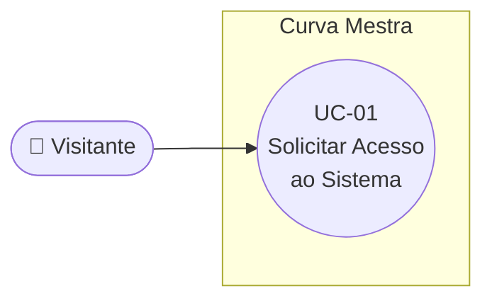

# UC-01: Solicitar Acesso ao Sistema

**Projeto:** Curva Mestra
**Data de Criação:** 13/07/2026
**Autor:** Guilherme Scandelari (via uml-use-case-writer)
**Status:** Aprovado
**Módulo/Contexto:** Autenticação / Aquisição de Clientes
**Versão:** 2.1.1

> Um visitante (especialista HOF que opera uma clínica, ou consultor comercial Rennova) preenche o formulário de registro para solicitar acesso à plataforma Curva Mestra, informando seu perfil, dados de contato e domínio de atuação — sem definir senha nesta etapa. A solicitação fica pendente até ser analisada por um System Admin (ver UC-02 e UC-03); a senha de acesso só é definida depois da aprovação, via link de redefinição enviado por e-mail (UC-02).

---

## 1. Diagrama UML (Mermaid)

```mermaid
flowchart LR
    Visitante([👤 Visitante])

    subgraph Sistema["Curva Mestra"]
        UC01(("UC-01\nSolicitar Acesso\nao Sistema"))
    end

    Visitante --> UC01
```

---

## 2. Atores

### 2.1 Ator Primário
**Visitante** — pessoa não autenticada que deseja usar a plataforma, se identificando com um dos dois perfis (`role`) suportados pelo formulário: **"especialista"** (profissional/clínica que opera com produtos Rennova em procedimentos de harmonização) ou **"consultor"** (consultor comercial Rennova, atua por região/carteira). Se a solicitação for aprovada (UC-02), este visitante se torna `clinic_admin` do tenant criado — o `role` informado aqui é usado em UC-02 (RN-02) para decidir o limite de usuários do tenant (consultor → 1 usuário; especialista → 5 usuários).

### 2.2 Atores Secundários / Sistemas Externos
Nenhum. Toda a validação e persistência ocorre dentro do próprio sistema Curva Mestra (frontend + API route + Firestore).

---

## 3. Pré-condições
- O visitante não possui sessão Firebase Auth ativa (ver Fluxo Alternativo 7a).
- O visitante sabe seu nome completo (nome e sobrenome), um número de identificação profissional (CRM/CRO para especialista, ID Rennova para consultor), e-mail, telefone/WhatsApp, e o nome da própria clínica (especialista) ou da região/carteira que atende (consultor).
- Não é necessário possuir CPF/CNPJ nem definir uma senha neste momento — nenhum dos dois é mais coletado nesta etapa (ver Histórico de Versões, v2.0).

---

## 4. Pós-condições

### 4.1 Sucesso (Garantias de Sucesso)
- Um documento é criado na coleção `access_requests` com `status: "pendente"`, contendo `role`, o campo legado `type` (derivado de `role`), `full_name`, `email` (lowercase e trim), `phone`, `council_number`, `business_name` e, apenas quando `role === "especialista"`, `consultant_reference` e `volume` (opcionais).
- Nenhuma senha é solicitada, validada ou armazenada nesta etapa — a definição de senha ocorre somente após a aprovação (UC-02), via link de redefinição enviado por e-mail.
- **[CORRIGIDO — commit `1254abb`]** Não é criada uma segunda solicitação pendente para o mesmo e-mail — se já existir uma, a API bloqueia a criação (ver RN-09).
- Visitante vê a mensagem de sucesso "Solicitação enviada com sucesso!" e os campos de texto do formulário são limpos (a seleção de perfil e de volume mantêm o último valor escolhido, pois não fazem parte do estado que é resetado).
- Após 4 segundos, o visitante é redirecionado para `/login`.

### 4.2 Falha (Garantias Mínimas)
- Nenhuma solicitação é criada na coleção `access_requests`.
- O formulário permanece preenchido, exibindo o erro específico (não há campos de senha a limpar, pois não existem nesta versão do formulário).

---

## 5. Gatilho (Trigger)
O visitante acessa a rota pública `/register` com a intenção de solicitar acesso à plataforma.

---

## 6. Fluxo Principal (Basic Flow)

1. Visitante acessa `/register`.
2. Sistema verifica que não há sessão ativa (via `useAuth()`) e exibe o formulário "Solicitar Acesso", com a descrição "Distribuição fechada — cada pedido é avaliado em até 2 dias úteis".
3. Visitante seleciona o perfil (`role`): "Especialista HOF" (Operação clínica) — pré-selecionado por padrão — ou "Consultor Rennova" (Acesso comercial).
4. Sistema ajusta dinamicamente os rótulos e placeholders dos campos "CRM/CRO/ID Rennova" e "Nome da clínica/Região-carteira" conforme o perfil selecionado, e exibe (somente para especialista) os campos "Consultor Rennova de referência" e "Volume de procedimentos por mês".
5. Visitante preenche: nome completo, número de identificação profissional (CRM/CRO ou ID Rennova), e-mail profissional, telefone/WhatsApp, e nome da clínica ou região/carteira.
6. (Somente se `role === "especialista"`) Visitante opcionalmente informa o consultor Rennova de referência e seleciona o volume mensal de procedimentos entre 4 opções fixas ("Até 30", "30–80", "80–150", "150+"), com "30–80" pré-selecionado por padrão.
7. Visitante clica em "Solicitar acesso à Curva Mestra →".
8. Sistema valida os campos no frontend: nome completo, e-mail e telefone usando as mesmas funções compartilhadas do backend (`validateFullName`, `validateEmail`, `validatePhone`, de `@/lib/validations/serverValidations` — **[CORRIGIDO, commit `1254abb`]**, ver RN-04/RN-05/RN-06); número de conselho/ID Rennova (mínimo 3 caracteres, checagem local, sem função compartilhada — ver RN-07) e nome da clínica/região (mínimo 3 caracteres, checagem local — ver RN-07).
9. Sistema envia os dados para `POST /api/access-requests`, incluindo `consultant_reference` e `volume` apenas quando `role === "especialista"`.
10. API verifica a presença de todos os campos obrigatórios (`role`, `full_name`, `email`, `phone`, `council_number`, `business_name`).
11. API valida que `role` é `"especialista"` ou `"consultor"`.
12. API valida `full_name` (deve conter nome e sobrenome, 3-100 caracteres, apenas letras/espaços/acentos/hífen), `email` (regex RFC 5322 simplificada, domínio com pelo menos um ponto, até 254 caracteres) e `phone` (10 ou 11 dígitos, DDD entre 11 e 99, não pode ter todos os dígitos iguais).
13. API converte o e-mail para lowercase e remove espaços (trim), guardando o resultado em `normalizedEmail`.
14. **[CORRIGIDO, commit `1254abb`]** API consulta, via **Admin SDK** (`adminDb`, de `@/lib/firebase-admin`), a coleção `access_requests` filtrando por `email == normalizedEmail` e `status == "pendente"`; se já existir alguma solicitação pendente com esse e-mail, a API retorna erro 409 e nenhum documento é criado (ver Fluxo de Exceção 8d, novo, e RN-09).
15. API deriva o campo legado `type` (`"clinica"` para especialista, `"autonomo"` para consultor).
16. API cria o documento na coleção `access_requests` com `status: "pendente"`, gravando `normalizedEmail` no campo `email`.
17. API retorna sucesso com o `id` do documento criado e a mensagem "Solicitação enviada com sucesso!".
18. Sistema exibe a mensagem de sucesso e limpa os campos de texto do formulário.
19. Sistema aguarda 4 segundos e redireciona para `/login`.
20. Caso de uso é concluído com sucesso.

---

## 7. Fluxos Alternativos

### 7a. Usuário já autenticado acessa /register (a partir do passo 1)
1. Sistema detecta sessão ativa via `useAuth()`.
2. Sistema redireciona automaticamente para `/dashboard`, sem exibir o formulário.
3. Caso de uso é encerrado.

### 7b. Troca de perfil durante o preenchimento (a partir do passo 3)
1. Visitante já havia preenchido campos do formulário, possivelmente incluindo os campos exclusivos de especialista (consultor de referência, volume).
2. Visitante seleciona o outro perfil.
3. Sistema ajusta rótulos/placeholders dos campos compartilhados e oculta os campos exclusivos de especialista (caso o visitante mude para "consultor") — os valores já digitados nos campos compartilhados (nome, conselho, email, telefone, nome do negócio) são mantidos; os campos exclusivos de especialista deixam de ser enviados no `POST` (mesmo que ainda tenham valor no estado interno da tela).
4. Retorna ao passo 5 do fluxo principal.

---

## 8. Fluxos de Exceção

### 8a. Falha de validação no frontend (a partir do passo 8)
1. Um ou mais campos são reprovados: nome completo, e-mail ou telefone reprovados pelas mesmas funções compartilhadas do backend (`validateFullName`, `validateEmail`, `validatePhone` — **[CORRIGIDO, commit `1254abb`]**, ver RN-04/RN-05/RN-06), número de conselho/ID Rennova com menos de 3 caracteres, ou nome da clínica/região com menos de 3 caracteres.
2. Sistema exibe um alerta vermelho com a mensagem específica retornada pela função de validação correspondente (ex.: "Nome completo deve conter nome e sobrenome") ou uma mensagem fixa para os campos sem função compartilhada (ex.: "Nome da clínica é obrigatório" ou "Região / carteira é obrigatória", conforme o perfil selecionado).
3. A requisição não é enviada à API.
4. Campos permanecem preenchidos.
5. Caso de uso retorna ao passo 5.

### 8b. Falha de validação no backend (a partir dos passos 10-12)
1. API detecta campo obrigatório ausente (retorna o rótulo específico do campo faltante), `role` fora dos valores aceitos, ou falha na validação de `full_name`, `email` ou `phone`. **[CORRIGIDO, commit `1254abb`]** Como o frontend passou a usar exatamente as mesmas funções compartilhadas para esses três campos (RN-04/RN-05/RN-06), este caminho deixou de ser alcançável por eles através de uma submissão normal via UI; permanece como defesa em profundidade e cobre chamadas diretas à API fora do formulário.
2. API retorna erro 400 com a mensagem específica.
3. Sistema exibe o erro em alerta vermelho.
4. Caso de uso retorna ao passo 5.

### 8c. Erro no servidor (a partir do passo 16)
1. Firestore está indisponível ou ocorre erro inesperado ao criar o documento.
2. API retorna erro 500 com `{ error: string }`.
3. Sistema exibe o erro retornado ou "Erro ao processar solicitação".
4. Caso de uso retorna ao passo 5.

### 8d. [CORRIGIDO — commit `1254abb`] Solicitação pendente já existe para o mesmo e-mail (a partir do passo 14)
1. API encontra, via Admin SDK, uma solicitação em `access_requests` com o mesmo `email` (normalizado) e `status: "pendente"`.
2. API retorna erro 409 com `{ error: "Já existe uma solicitação pendente para este e-mail" }`; nenhum documento é criado.
3. Sistema exibe o erro retornado em alerta vermelho.
4. Caso de uso retorna ao passo 5.

**Comportamento anterior (histórico, antes da correção):** não havia nenhuma checagem de duplicidade — o mesmo e-mail podia gerar múltiplas solicitações com `status: "pendente"` simultâneas (ver RN-09).

---

## 9. Regras de Negócio Relacionadas

| ID | Regra | Justificativa |
|----|-------|----------------|
| RN-01 | Toda solicitação nasce com `status: "pendente"` — não existe auto-aprovação. | Controle de qualidade e prevenção de fraudes; toda entrada passa por análise humana (UC-02/UC-03). |
| RN-02 | O perfil (`role`) é obrigatoriamente `"especialista"` ou `"consultor"` — determina os rótulos dinâmicos da tela (CRM/CRO vs. ID Rennova; Nome da clínica vs. Região/carteira) e, na aprovação (UC-02, RN-02), o limite de usuários do tenant (consultor → 1 usuário; especialista → 5 usuários). | Modelo de negócio com dois perfis distintos de acesso ao ecossistema Rennova (operação clínica vs. atuação comercial). |
| RN-03 | O sistema não coleta CPF/CNPJ nem senha nesta etapa — mudança confirmada em relação a uma versão anterior deste formulário (ver Histórico de Versões, v2.0). A senha de acesso só é definida após a aprovação da solicitação (UC-02), através de um link de redefinição de senha enviado por e-mail. | Simplifica o formulário de entrada e adia a criação de credenciais para o momento em que a conta já foi de fato aprovada. |
| RN-04 | **[CORRIGIDO — commit `1254abb`]** `full_name` deve conter nome e sobrenome (mínimo 2 palavras), entre 3 e 100 caracteres, usando apenas letras, espaços, acentos e hífen — validado por `validateFullName` (`@/lib/validations/serverValidations`), agora chamada tanto pelo backend quanto pelo frontend (`register/page.tsx`, que passou a importar e usar diretamente essa função em vez de uma checagem local de `length >= 3`). | A divergência entre a validação de frontend (antes mais permissiva) e a de backend (mais rigorosa) foi eliminada — um nome de uma única palavra agora é rejeitado já na tela, antes de qualquer chamada à API (comportamento anterior descrito no histórico do Fluxo de Exceção 8b). |
| RN-05 | **[CORRIGIDO — commit `1254abb`]** `email` é normalizado para lowercase e trim antes de ser salvo (reaproveitando a mesma variável `normalizedEmail` usada também na checagem de duplicidade, RN-09); a validação (regex RFC 5322 simplificada, domínio obrigatoriamente com um ponto, até 254 caracteres) é feita por `validateEmail` (`@/lib/validations/serverValidations`), agora chamada tanto pelo backend quanto pelo frontend — que deixou de aceitar qualquer valor contendo apenas "@". | Evita duplicidade por diferença de caixa e garante um formato de e-mail minimamente válido já na tela, antes da chamada à API — elimina a divergência frontend/backend antes documentada aqui e na RN-04. |
| RN-06 | **[CORRIGIDO — commit `1254abb`]** `phone` deve ter 10 ou 11 dígitos, DDD entre 11 e 99, e não pode ter todos os dígitos iguais — validado por `validatePhone` (`@/lib/validations/serverValidations`), agora chamada tanto pelo backend quanto pelo frontend, que deixou de aceitar qualquer valor com 10+ dígitos sem checar DDD ou dígitos repetidos. | Elimina a divergência frontend/backend das RN-04/RN-05 — a validação completa agora ocorre já na tela, antes de qualquer chamada à API. |
| RN-07 | `council_number` (CRM/CRO ou ID Rennova) e `business_name` (nome da clínica ou região/carteira) são obrigatórios, mas o backend só verifica a presença desses campos — nenhuma validação de formato ou tamanho mínimo além da checagem de 3 caracteres feita no frontend. Não afetados pela correção do commit `1254abb` (RN-04 a RN-06), que tratou apenas `full_name`, `email` e `phone`. | Não há regra de negócio de formato definida no código atual para esses dois campos (ex.: nenhum padrão de CRM/CRO é validado). |
| RN-08 | `consultant_reference` e `volume` só são exibidos e enviados quando `role === "especialista"`; ambos são opcionais e não têm nenhuma validação no backend — inclusive `volume` não é validado contra a lista de opções fixas exibidas na tela (a API aceita qualquer string nesse campo). | Dados complementares de qualificação comercial, exclusivos do perfil especialista; sem validação de backend implementada atualmente. |
| RN-09 | **[CORRIGIDO — commit `1254abb`]** Antes, não havia nenhuma checagem de duplicidade de solicitação pendente para o mesmo e-mail — um mesmo e-mail podia gerar múltiplas solicitações pendentes simultâneas. Agora, antes do `addDoc`, `POST /api/access-requests` consulta a coleção `access_requests` via **Admin SDK** (`adminDb`, de `@/lib/firebase-admin`) — não o client SDK usado no restante da rota — filtrando por `email == normalizedEmail` e `status == "pendente"`; se encontrar alguma, retorna 409 com `{ error: "Já existe uma solicitação pendente para este e-mail" }` e não cria o documento. O uso do Admin SDK é necessário porque a regra do Firestore restringe leitura de `access_requests` a `system_admin`, e esta rota é pública/não-autenticada. | Prevenção de solicitações duplicadas para o mesmo e-mail, mantendo a rota funcional mesmo sendo pública (o Admin SDK bypassa a regra de leitura restrita a `system_admin`). Uma verificação equivalente já existia apenas em uma função de serviço (`accessRequestService.createAccessRequest`), que não é chamada por nenhuma tela — código morto (ver seção 14). |
| RN-10 | **[Achado crítico, confirmado em UC-35]** O formulário `/register` e a API `POST /api/access-requests` não verificam, em nenhum momento, o campo `registration_enabled` do documento `system_settings/global` (tela "Configurações do Sistema", UC-35). Ou seja, desligar "Permitir novos registros" naquela tela administrativa não impede, hoje, nenhum visitante de acessar `/register` nem de submeter uma solicitação de acesso — apesar da própria tela de configurações descrever esse campo como controle de bloqueio de novos registros. | Confirmado por leitura completa de `register/page.tsx` e `api/access-requests/route.ts` (nenhuma referência a `registration_enabled` ou a `system_settings`) e por busca exaustiva no código-fonte, documentada em UC-35 (RN-05). |

---

## 10. Requisitos Especiais / Não Funcionais

| ID | Descrição | Categoria |
|----|-----------|-----------|
| RNF-01 | Nenhum `tenant_id` existe neste momento — a solicitação é pré-tenant; não há nenhuma tentativa de vincular a solicitação a um tenant já existente nesta versão do fluxo (ver seção 14 sobre a função de serviço não utilizada que fazia esse tipo de vínculo). O tenant só é criado na aprovação (UC-02). | Multi-tenant |
| RNF-02 | **[CORRIGIDO — commit `1254abb`]** A validação client-side deixou de ser mais simples que a validação server-side para `full_name`, `email` e `phone` — ambas agora usam exatamente as mesmas funções compartilhadas (`validateFullName`, `validateEmail`, `validatePhone`, ver RN-04 a RN-06). A dupla validação (frontend + backend) permanece, mas agora é simétrica para esses três campos; `council_number` e `business_name` continuam com validação apenas de presença no backend e um mínimo de 3 caracteres no frontend, sem função compartilhada (RN-07). | Segurança / Usabilidade |
| RNF-03 | Máscara de telefone aplicada em tempo real durante a digitação. | Usabilidade |

---

## 11. Frequência de Uso
Ocasional — ocorre a cada novo interessado (especialista HOF ou consultor Rennova) na plataforma. É um evento de aquisição, não uma ação de uso recorrente do sistema.

---

## 12. Casos de Uso Relacionados
- **UC-02 (Aprovar Solicitação de Acesso)** e **UC-03 (Rejeitar Solicitação de Acesso)** dependem de uma solicitação criada por este caso de uso. Não há relação formal `<<include>>`/`<<extend>>` — trata-se de uma dependência sequencial: a solicitação pendente criada aqui é pré-condição de UC-02 e UC-03. O `role` definido neste UC alimenta diretamente a regra de limite de usuários aplicada em UC-02 (RN-02).
- **UC-35 (Editar Configurações Globais do Sistema)** — a tela administrativa daquele UC expõe um switch "Permitir novos registros" (`registration_enabled`) que, por sua descrição, sugere controlar o acesso a este UC-01. **Não há, hoje, uma relação funcional real entre os dois**: este fluxo não verifica `registration_enabled` em nenhum momento (RN-10) — a relação existe apenas como intenção de produto ainda não implementada. Ver também, na seção 14, o achado não verificado sobre a leitura de `system_settings/global` feita por esta mesma rota via client SDK.

---

## 13. Referências
- `src/app/(auth)/register/page.tsx`
- `src/app/api/access-requests/route.ts`
- `src/lib/validations/serverValidations.ts` (funções usadas tanto pelo backend quanto, desde o commit `1254abb`, pelo frontend — `register/page.tsx` — deste fluxo: `validateFullName`, `validateEmail`, `validatePhone`; as demais funções do arquivo, ex. `validateCPF`, `validateCNPJ`, `validatePassword`, `validateCEP`, não são usadas por este UC)
- `src/lib/firebase-admin.ts` (`adminDb`, usado desde o commit `1254abb` na checagem de duplicidade de solicitação pendente, RN-09, e, desde o commit `66689fe`, também na leitura de `system_settings/global` — gate de `registration_enabled`, RN-10 — que antes usava o client SDK e era negada por permissão nesta rota pública; ver seção 14, item UC-01-Q1)
- `src/types/index.ts` (interface `AccessRequest`, tipos `AccessRequestRole`, `AccessRequestType`, `AccessRequestStatus`)
- `project_doc/auth/register-page-documentation.md` — **desatualizado** (descreve a versão anterior do formulário, com CPF/CNPJ e senha; ver seção 14)

---

## 14. Perguntas em Aberto / Decisões Pendentes

**[Pendência para próxima rodada, confirmada pelo usuário]** UC-02 (Aprovar Solicitação de Acesso) referencia, em suas pré/pós-condições e no código de `approve/route.ts`, os campos `document_type` e `address` da solicitação (`document_type: request.document_type ?? 'cnpj'`, `document_number: request.document_number ?? ''`) — mas o formulário atual de `/register` (este UC) não coleta mais nenhum desses campos. Na prática, todo tenant criado hoje via aprovação recebe `document_type: "cnpj"` (fallback fixo do código) e `document_number: ""` (vazio), independentemente do perfil real do solicitante (especialista ou consultor). UC-02 precisará de uma revisão própria para refletir essa realidade — não foi reescrito nesta rodada, por decisão explícita do usuário (fica para uma próxima rodada dedicada a UC-02).

**[Registrado para conhecimento, fora do escopo deste UC]** `project_doc/auth/register-page-documentation.md` (datado de 07/02/2026) descreve a versão anterior do formulário (CPF/CNPJ + senha) e está desatualizado desde o commit `6402647` ("unify access request form — remove password, align /register with landing", 29/05/2026). Não foi corrigido nesta rodada.

**[Registrado para conhecimento — relevante para UC-05, pausado]** A função `accessRequestService.createAccessRequest()` (que faria correspondência por CPF/CNPJ com um tenant existente, checaria vagas disponíveis e duplicidade de solicitação pendente) é código morto — não é chamada por nenhuma página hoje. Isso é relevante para o UC-05 (Aprovar Solicitação de Acesso pela Própria Clínica), atualmente pausado até esta revisão de UC-01 ser concluída.

**[RN-10, decisão de produto pendente]** `registration_enabled` (tela de Configurações do Sistema, UC-35) não bloqueia, hoje, o acesso a este fluxo — decisão pendente sobre se essa checagem deveria ser implementada em `register/page.tsx`/`POST /api/access-requests`, ou se o campo deveria ser removido da tela de configurações caso a intenção de bloqueio seja descartada.

**[UC-01-Q1 — RESOLVIDO — commit `66689fe`]** Achado registrado na v2.1 deste documento (durante a investigação da correção de RN-09, commit `1254abb`): `POST /api/access-requests` (linha ~50, já antes daquelas mudanças) fazia uma leitura `getDoc(doc(db, 'system_settings', 'global'))` usando o **client SDK** do Firebase, nesta mesma rota pública/não-autenticada. A regra do Firestore para `system_settings` exige `isAuthenticated()` (`request.auth != null && request.auth.token.active == true`), que nega leitura para qualquer visitante não autenticado — derrubando toda a função no `catch` e retornando 500 para qualquer tentativa de enviar uma solicitação de acesso. Essa checagem havia sido adicionada em um commit anterior desta mesma sessão de trabalho (`66c75fa`, batch de UC-21/UC-28/UC-35, Alta severidade) para implementar o gate de `registration_enabled` (RN-10). **Correção:** commit `66689fe` migrou a leitura para o **Admin SDK** (`adminDb.doc('system_settings/global').get()`, de `@/lib/firebase-admin`), que bypassa as regras de segurança — mesmo padrão já usado no fix de RN-09 nesta mesma rota. **Validação:** confirmada por **análise estática de alta confiança** das regras do Firestore, e não por teste em emulador (indisponível neste ambiente de trabalho) — a semântica de `isAuthenticated()` é inequívoca (nega qualquer requisição sem `request.auth`), sem ambiguidade de interpretação que justificasse a necessidade de um teste em runtime para confirmar a causa raiz ou a correção. Ver `src/app/api/access-requests/route.ts` (linhas 48-59) e Referências (seção 13).

Nenhuma pendência aberta quanto à modelagem dos dois perfis em si: o usuário confirmou que "especialista" e "consultor" devem ser tratados como variação de dado dentro deste mesmo UC, sem fluxo alternativo dedicado — mesmo padrão adotado na versão anterior deste documento para os antigos tipos de conta (CNPJ/CPF).

---

## 15. Histórico de Versões

| Versão | Data | Autor | O que mudou |
|--------|------|-------|--------------|
| 1.0 | 13/07/2026 | Guilherme Scandelari | Versão inicial, mapeada a partir do código atual e de `project_doc/auth/register-page-documentation.md` |
| 1.1 | 13/07/2026 | Guilherme Scandelari | Registrada a remoção definitiva do fluxo `/activate` (código de 8 dígitos) do código-fonte (PR #178, branch `chore/remove-obsolete-activate-flow`) — deixou de ser "fora de escopo" e passou a ser "não existe mais"; documentado o único caminho de onboarding válido hoje (registro → aprovação em UC-02 → definição de senha via link → login). Corrigida a RN-04: confirmado, por leitura do código (`approve/route.ts`), que a senha da solicitação não é usada para criar o usuário Auth em UC-02 (mecanismo real: senha temporária + link de redefinição). |
| 1.1.1 | 13/07/2026 | Guilherme Scandelari | Correção estrutural: removida da seção 14 a menção detalhada à remoção do fluxo `/activate` — não se tratava de uma pergunta em aberto nem de uma decisão pendente, e sim de um fato já consumado (PR #178 mergeado), incompatível com o propósito da seção 14. O registro do fato permanece de forma enxuta apenas no Histórico de Versões (linha v1.1, acima). Nenhum conteúdo factual novo foi adicionado nesta revisão. |
| 2.0 | 13/07/2026 | Guilherme Scandelari | **Reescrita completa** do documento após confirmar, por leitura direta de `register/page.tsx` e `api/access-requests/route.ts`, que o formulário real mudou radicalmente desde a versão anterior — commit `6402647` ("unify access request form — remove password, align /register with landing", 29/05/2026), anterior à própria data de criação registrada deste UC. O formulário não coleta mais CPF/CNPJ nem senha; passou a coletar um `role` ("especialista"/"consultor"), `full_name`, `council_number`, `email`, `phone`, `business_name` e, opcionalmente para especialistas, `consultant_reference`/`volume`. Todas as seções foram reescritas: Atores (perfil ao invés de tipo de documento), Pré/Pós-condições, Fluxo Principal, Fluxos Alternativos/Exceção, e Regras de Negócio (RN-01 a RN-09, incluindo divergências reais confirmadas entre validação de frontend e de backend). Registradas em Perguntas em Aberto as pendências de revisão de UC-02 (uso de `document_type`/`address` que hoje vêm sempre em fallback/vazio) e do UC-05 (pausado até esta correção). |
| 2.0.1 | 15/07/2026 | Guilherme Scandelari | Correção pontual: adicionada RN-10 e nota em "Casos de Uso Relacionados" documentando o achado crítico confirmado em UC-35 (Editar Configurações Globais do Sistema) — o campo `registration_enabled` daquela tela administrativa não é verificado por este fluxo, apesar de sua descrição sugerir esse controle. Nenhuma mudança de escopo ou reestruturação; apenas referência cruzada a um achado já investigado e documentado em UC-35. |
| 2.1 | 06/08/2026 | Guilherme Scandelari (via uml-use-case-writer) | **Correção de bugs (commit `1254abb`)**: (1) RN-09 corrigida — `POST /api/access-requests` passou a checar, via Admin SDK, se já existe uma solicitação `pendente` para o mesmo e-mail antes de criar uma nova, retornando 409 em caso positivo (novo Fluxo de Exceção 8d; Fluxo Principal ganhou o passo 14); (2) RN-04, RN-05 e RN-06 corrigidas — `register/page.tsx` passou a importar e usar as mesmas funções compartilhadas do backend (`validateFullName`, `validateEmail`, `validatePhone`), eliminando a divergência entre validação de frontend (antes mais permissiva) e backend; RNF-02 atualizada de acordo. Fluxo Principal (passo 8), Fluxos de Exceção 8a/8b e Referências (seção 13) atualizados. Adicionado, na seção 14, um novo achado não verificado (descoberto durante a investigação de RN-09): a mesma rota `POST /api/access-requests` lê `system_settings/global` via client SDK, o que pode estar sendo bloqueado pela regra do Firestore para visitantes não autenticados — não confirmado em runtime, registrado para investigação dedicada. |
| 2.1.1 | 06/08/2026 | Guilherme Scandelari (via uml-use-case-writer) | Correção pontual: item **UC-01-Q1** (seção 14) atualizado de "não verificado, Aberto" para **[RESOLVIDO — commit `66689fe`]** — a leitura de `system_settings/global` em `POST /api/access-requests` foi migrada do client SDK para o Admin SDK (`adminDb.doc('system_settings/global').get()`), eliminando o bloqueio por permissão que a regra `isAuthenticated()` do Firestore impunha a essa rota pública/não-autenticada. Validação feita por análise estática das regras do Firestore (semântica inequívoca de `isAuthenticated()`), não por teste em emulador (indisponível no ambiente de trabalho). Referência a `firebase-admin.ts` (seção 13) atualizada para refletir esse segundo uso do `adminDb` nesta rota. Nenhuma mudança de escopo ou reestruturação. |

