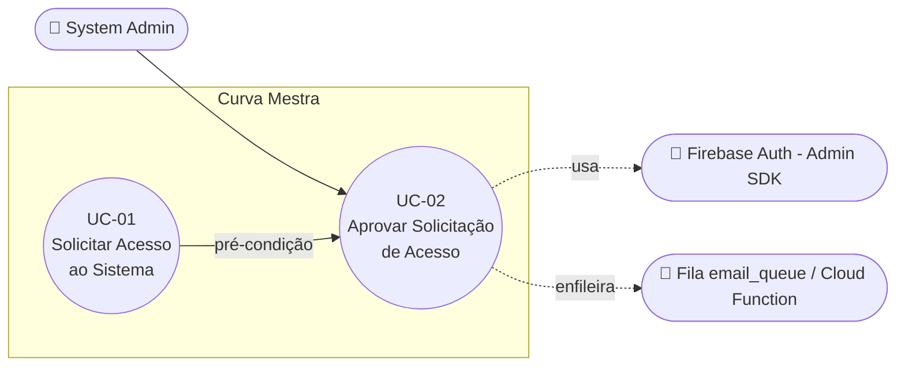

# UC-02: Aprovar Solicitação de Acesso

**Projeto:** Curva Mestra
**Data de Criação:** 13/07/2026
**Autor:** Guilherme Scandelari (via uml-use-case-writer)
**Status:** Aprovado
**Módulo/Contexto:** Administração do Sistema
**Versão:** 1.1

> O System Admin aprova uma solicitação de acesso pendente (criada em UC-01), disparando a criação em cadeia de tenant e usuário, e o envio de um e-mail de boas-vindas com link de redefinição de senha.

---

## 1. Diagrama UML (Mermaid)

---

## 2. Atores

### 2.1 Ator Primário
**System Admin** — administrador global da plataforma Curva Mestra, identificado pela custom claim `is_system_admin: true`.

### 2.2 Atores Secundários / Sistemas Externos
- **Firebase Auth (Admin SDK):** usado para criar o usuário, definir os custom claims e gerar o link de redefinição de senha — só pode ser acionado server-side.
- **Fila `email_queue` / Cloud Function:** recebe o e-mail de boas-vindas (com o link de redefinição de senha) para envio assíncrono.

---

## 3. Pré-condições
- Admin autenticado, com `user` e `claims` carregados e `is_system_admin === true`.
- Existe ao menos uma solicitação com `status: "pendente"` (criada via UC-01).

---

## 4. Pós-condições

### 4.1 Sucesso (Garantias de Sucesso)
- 3 documentos criados: `tenant`, usuário no Firebase Auth (com senha temporária aleatória e `emailVerified: false`) e usuário no Firestore (`users`). Não é criada licença (`licenses`) nem documento de onboarding (`tenant_onboarding`) — ver Histórico de Versões, v1.1.
- Custom claims do novo usuário definidos: `tenant_id`, `role: "clinic_admin"`, `active: true`.
- Um link de redefinição de senha é gerado via `adminAuth.generatePasswordResetLink` e incluído no e-mail de boas-vindas adicionado à fila `email_queue` (`type: "welcome_approval"`).
- Solicitação atualizada para `status: "aprovada"`, com `approved_by`, `approved_by_name`, `approved_at` preenchidos.
- Solicitação desaparece da listagem de pendentes.

### 4.2 Falha (Garantias Mínimas)
- Se a criação do usuário Auth (ou uma etapa até a atualização do status da solicitação) falhar, o `tenant` já criado é revertido (deletado) — não fica um tenant órfão.
- A solicitação permanece com `status: "pendente"`.
- Um toast de erro é exibido ao admin.

---

## 5. Gatilho (Trigger)
O System Admin clica em "Aprovar" na linha de uma solicitação pendente, na tela `/admin/access-requests`.

---

## 6. Fluxo Principal (Basic Flow)

1. Admin acessa `/admin/access-requests` (rota restrita a `system_admin`).
2. Sistema carrega as solicitações com `status: "pendente"`, ordenadas por `created_at` decrescente.
3. Sistema exibe cards de contagem (total pendentes, clínicas, autônomos) e a tabela de solicitações.
4. Admin clica em "Aprovar" na linha de uma solicitação.
5. Sistema desabilita os botões daquela linha (`processingId`) e envia `POST /api/access-requests/{id}/approve` com `{ approved_by_uid, approved_by_name }`.
6. API busca a solicitação e valida que o `status` é `"pendente"`.
7. API cria o documento `tenant` no Firestore.
8. API gera uma senha temporária aleatória (`generateTempPassword()`, via `crypto.randomBytes(24)`, CSPRNG) e cria o usuário no Firebase Auth com essa senha temporária e `emailVerified: false` — a senha informada na solicitação original (UC-01) **não é utilizada**.
9. API define os custom claims (`tenant_id`, `role: "clinic_admin"`, `active: true`) no novo usuário.
10. API cria o documento `user` no Firestore.
11. API atualiza a solicitação: `status: "aprovada"`, `approved_by`, `approved_by_name`, `approved_at`.
12. API gera um link de redefinição de senha via `adminAuth.generatePasswordResetLink(request.email)`; se a geração falhar, usa como fallback a URL padrão de login (`https://curvamestra.com.br/login`), sem interromper a aprovação.
13. API monta o e-mail de boas-vindas com o link de redefinição de senha e adiciona um documento à fila `email_queue` (`type: "welcome_approval"`).
14. API retorna sucesso com `{ tenant_id, user_id, email, business_name }`.
15. Sistema exibe toast de sucesso: "Solicitação aprovada!" / "Tenant e usuário criados com sucesso. Email: {email}".
16. Sistema recarrega a lista de solicitações pendentes (a solicitação aprovada não aparece mais).
17. Caso de uso é concluído com sucesso.

---

## 7. Fluxos Alternativos

### 7a. Nenhuma solicitação pendente (a partir do passo 2)
1. Sistema exibe o estado vazio: ícone de sucesso, "Nenhuma solicitação pendente", "Todas as solicitações foram processadas".
2. Caso de uso é encerrado sem ação disponível.

---

## 8. Fluxos de Exceção

### 8a. Email já existe no Firebase Auth (a partir do passo 8)
1. Firebase Auth retorna `auth/email-already-exists`.
2. API reverte (deleta) o `tenant` criado no passo 7.
3. API retorna erro: "Este email já está em uso".
4. Sistema exibe toast destructive; a solicitação permanece `"pendente"`.

### 8b. Solicitação já processada (a partir do passo 6)
1. API detecta que o `status` não é mais `"pendente"` (já foi aprovada ou rejeitada por outra ação concorrente).
2. API retorna erro 400.
3. Sistema exibe toast destructive.

### 8c. Erro genérico da API/servidor (a partir dos passos 5-14)
1. Qualquer etapa da cadeia de criação falha de forma inesperada.
2. API retorna `{ error: string }` com status 400/404/500.
3. Sistema exibe toast destructive com a mensagem retornada.
4. A solicitação permanece `"pendente"`.

---

## 9. Regras de Negócio Relacionadas

| ID | Regra | Justificativa |
|----|-------|----------------|
| RN-01 | A aprovação é feita via API route server-side, pois requer o Firebase Admin SDK para criar o usuário Auth, definir custom claims e gerar o link de redefinição de senha — operações que não podem ser feitas client-side. | Segurança e integridade dos custom claims. |
| RN-02 | `max_users` é definido pelo tipo de conta da solicitação: autônomo = 1, clínica = 5 (regra herdada de UC-01, aplicada nesta etapa). | Modelo de negócio baseado no porte da operação. |
| RN-03 | A aprovação nunca reutiliza a senha informada na solicitação (UC-01) para criar o usuário no Firebase Auth. É gerada uma senha temporária aleatória (`generateTempPassword()`, CSPRNG via `crypto.randomBytes(24)`), e o próprio usuário define sua senha definitiva através de um link de redefinição de senha (`adminAuth.generatePasswordResetLink`), enviado por e-mail via fila `email_queue`. | Reduz a superfície de exposição da senha (nunca precisa ser reconstituída em texto plano) e garante que apenas o titular do e-mail define a senha final de acesso. |
| RN-04 | A aprovação é atômica parcial: se a criação do usuário Auth, a definição dos custom claims, a criação do documento `user` ou a atualização do `status` da solicitação falharem, o tenant já criado é revertido (deletado). Falhas na geração do link de redefinição de senha ou no envio do e-mail de boas-vindas são tratadas localmente (try/catch) e não revertem a aprovação nem impedem sua conclusão. | Evita tenants órfãos por falha na etapa crítica de criação do usuário, sem depender do sucesso de etapas não críticas (link de redefinição, e-mail). |
| RN-05 | O e-mail de boas-vindas — contendo o link de redefinição de senha — é assíncrono, via fila `email_queue`; falha no envio (ou na geração do link, que tem fallback) não impede a aprovação. | Evita timeout na requisição de aprovação. |

---

## 10. Requisitos Especiais / Não Funcionais

| ID | Descrição | Categoria |
|----|-----------|-----------|
| RNF-01 | Acesso restrito pelo Admin Layout (`is_system_admin`). ⚠️ A requisição de aprovação não usa Bearer token — depende apenas do controle client-side do layout. | Segurança |
| RNF-02 | O `tenant_id` é criado nesta operação (não existe antes); o documento `user` subsequente é vinculado a este `tenant_id`. | Multi-tenant |
| RNF-03 | A aprovação é sequencial (cria os documentos em série no backend); a listagem não tem paginação nem cache. | Performance |

---

## 11. Frequência de Uso
Ocasional — conforme o volume de novas solicitações de clínicas/autônomos recebidas via UC-01.

---

## 12. Casos de Uso Relacionados
- **UC-01 (Solicitar Acesso ao Sistema)** é pré-condição — só existe algo para aprovar depois que UC-01 cria a solicitação.
- **UC-03 (Rejeitar Solicitação de Acesso)** é a alternativa mutuamente exclusiva sobre a mesma solicitação pendente: mesmo ator, mesmo ponto de decisão, resultado oposto.

---

## 13. Referências
- `src/app/(admin)/admin/access-requests/page.tsx`
- `src/app/api/access-requests/[id]/approve/route.ts`
- `src/lib/services/accessRequestService.ts`
- `src/types/index.ts` (interface `AccessRequest`)
- `project_doc/admin/access-requests-documentation.md` (contém nota de divergência apontando trechos desatualizados — ver seção 14)

---

## 14. Perguntas em Aberto / Decisões Pendentes
⚠️ A ausência de Bearer token na rota de aprovação continua sendo um risco conhecido, presente no código-fonte e na documentação de engenharia reversa (`project_doc/admin/access-requests-documentation.md`). Não foi confirmado pelo usuário como escopo de correção neste UC — permanece registrado aqui apenas como comportamento atual (*as-is*).

**[Resolvido em v1.1]** A pendência anterior sobre rollback parcial de licença/onboarding deixou de se aplicar: confirmou-se, por leitura direta do código-fonte (`approve/route.ts`), que a criação de `licenses` (plano `early_access`) e de `tenant_onboarding` **não existe** na implementação atual. O Fluxo Principal, as Pós-condições e as Regras de Negócio deste documento foram corrigidos para refletir isso. `project_doc/admin/access-requests-documentation.md` recebeu uma nota de divergência apontando as seções desatualizadas, mas não foi reescrito por completo nesta rodada — recomenda-se revisão futura daquele arquivo.

---

## 15. Histórico de Versões

| Versão | Data | Autor | O que mudou |
|--------|------|-------|--------------|
| 1.0 | 13/07/2026 | Guilherme Scandelari | Versão inicial, mapeada a partir do código atual e de `project_doc/admin/access-requests-documentation.md` |
| 1.1 | 13/07/2026 | Guilherme Scandelari | Corrigidos Fluxo Principal (passos 6, 8 e 11-13), Pós-condições (4.1), Regras de Negócio (RN-01, RN-03 a RN-05) e Requisitos Não Funcionais (RNF-02), a partir da leitura direta de `approve/route.ts`: (1) a aprovação gera uma senha temporária aleatória e um link de redefinição de senha via `adminAuth.generatePasswordResetLink` — a senha da solicitação original nunca é usada; (2) a criação de `licenses` (`early_access`) e `tenant_onboarding`, antes documentada, não existe mais na implementação atual — removida a referência a esses dois documentos do fluxo, das pós-condições e da antiga RN-03 (licença). Removida a exceção 8b (obsoleta — o código não valida mais a presença do campo `password` na solicitação) e renumeradas as exceções subsequentes. Removida a pré-condição sobre o campo `password` da solicitação, já que não é mais verificada nesta etapa. Removida da lista de Referências a menção às interfaces `License`/`TenantOnboarding` (não utilizadas neste fluxo). |
