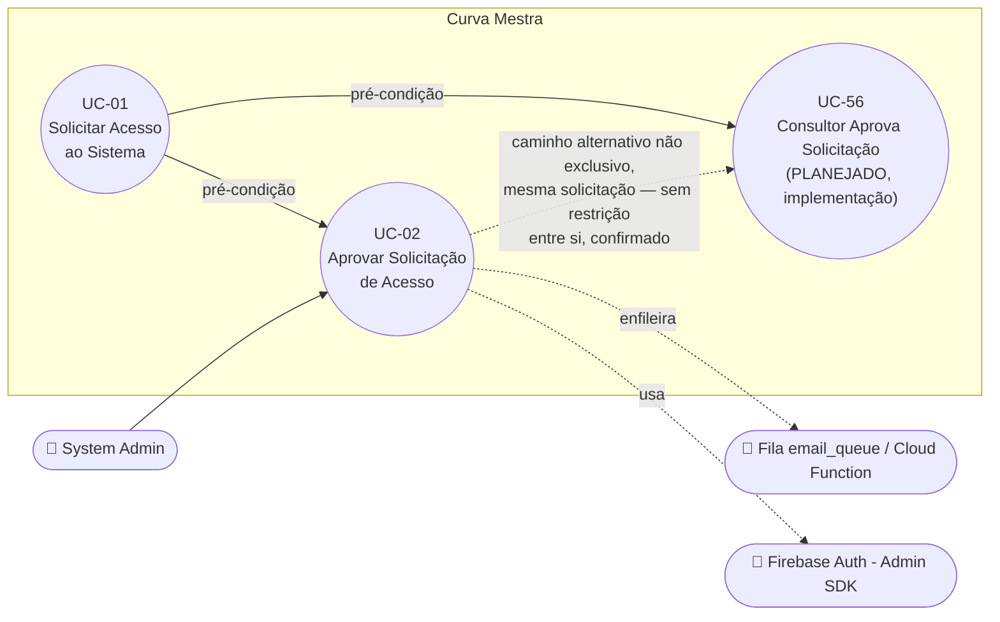

# UC-02: Aprovar Solicitação de Acesso

**Projeto:** Curva Mestra
**Data de Criação:** 13/07/2026
**Autor:** Guilherme Scandelari (via uml-use-case-writer)
**Status:** Aprovado
**Módulo/Contexto:** Administração do Sistema
**Versão:** 2.3.2

> O System Admin aprova uma solicitação de acesso pendente (criada em UC-01), disparando a criação em cadeia de tenant e usuário, e o envio de um e-mail de boas-vindas com link de redefinição de senha. **Atualização (v2.3 — confirmada pelo PO):** este UC continua descrevendo exclusivamente o caminho de aprovação pelo **System Admin**, sem nenhuma mudança de comportamento ou de código. O PO confirmou explicitamente que o System Admin mantém poder de aprovar **qualquer** solicitação, a qualquer momento, **mesmo dentro da janela de exclusividade de 2 dias corridos (48h) de um consultor específico** (UC-56) — não fica sujeito a essa janela. Um segundo caminho de aprovação, pelo **Consultor Rennova**, é especificado em **UC-56** (já "Aprovado", ainda não implementado) — os dois caminhos coexistem sem conflito: qualquer um dos dois que agir primeiro resolve a solicitação. **[v2.3.2]** A janela de exclusividade de UC-56 é de **2 dias corridos (48h) a partir de `created_at`, sem exclusão de fim de semana/feriado** — "2 dias úteis" é apenas o texto exibido ao visitante na tela de registro (UC-01, `register/page.tsx`), copy de interface que inspirou o valor numérico, mas não é a regra de cálculo real (ver UC-56/RN-02 para a distinção completa).

---

## 1. Diagrama UML (Mermaid)

```mermaid
flowchart LR
    Admin([👤 System Admin])
    FirebaseAuth([🔧 Firebase Auth - Admin SDK])
    EmailQueue([🔧 Fila email_queue / Cloud Function])

    subgraph Sistema["Curva Mestra"]
        UC01(("UC-01\nSolicitar Acesso\nao Sistema"))
        UC02(("UC-02\nAprovar Solicitação\nde Acesso"))
        UC56(("UC-56\nConsultor Aprova Solicitação\n(PLANEJADO, implementação)"))
    end

    Admin --> UC02
    UC02 -.->|usa| FirebaseAuth
    UC02 -.->|enfileira| EmailQueue
    UC01 -->|pré-condição| UC02
    UC01 -->|pré-condição| UC56
    UC02 -.->|caminho alternativo não exclusivo,\nmesma solicitação — sem restrição\nentre si, confirmado| UC56
```

---

## 2. Atores

### 2.1 Ator Primário
**System Admin** — administrador global da plataforma Curva Mestra, identificado pela custom claim `is_system_admin: true`.

### 2.2 Atores Secundários / Sistemas Externos
- **Firebase Auth (Admin SDK):** usado para verificar o token do próprio admin autenticado (`adminAuth.verifyIdToken`, desde o commit `33c5ef3` — ver RNF-01), criar o usuário, definir os custom claims e gerar o link de redefinição de senha — só pode ser acionado server-side.
- **Fila `email_queue` / Cloud Function:** recebe o e-mail de boas-vindas (com o link de redefinição de senha) para envio assíncrono.

---

## 3. Pré-condições
- Admin autenticado, com `user` e `claims` carregados e `is_system_admin === true`.
- Existe ao menos uma solicitação com `status: "pendente"` (criada via UC-01, v2.0), contendo `role` (`"especialista"` ou `"consultor"`), `full_name`, `email`, `phone`, `business_name`. **Nenhum documento (CPF/CNPJ) nem endereço é pré-condição** — o formulário de UC-01 não coleta mais nenhum dos dois (ver seção 14).
- A implementação atual **não verifica**, em nenhum ponto, se a solicitação está vinculada a um código de consultor (`consultant_id`, campo planejado em UC-01 v2.2) nem se existe alguma janela de exclusividade de aprovação em favor de um consultor específico — e **isso é intencional e definitivo**, não uma lacuna a corrigir: o PO confirmou que este caminho (System Admin) nunca fica sujeito à janela de exclusividade de 2 dias corridos (48h) de UC-56 (RN-06, confirmada). Este fluxo aprova qualquer solicitação `"pendente"` sem nenhuma checagem adicional, inclusive quando UC-56 estiver implementado.

---

## 4. Pós-condições

### 4.1 Sucesso (Garantias de Sucesso)
- 3 documentos criados: `tenant`, usuário no Firebase Auth (com senha temporária aleatória e `emailVerified: false`) e usuário no Firestore (`users`). Não é criada licença (`licenses`) nem documento de onboarding (`tenant_onboarding`) — ver Histórico de Versões, v1.1.
- O tenant criado recebe `document_type: "cnpj"` e `document_number: ""` como **valores fixos de fallback do código** (`request.document_type ?? 'cnpj'`, `request.document_number ?? ''`) — não refletem necessariamente o perfil real do solicitante, já que UC-01 (v2.0) não coleta mais documento algum. O campo `address` do tenant **não é incluído** no documento (é omitido por completo, não apenas deixado vazio), pelo mesmo motivo — ver pendência na seção 14.
- Custom claims do novo usuário definidos: `tenant_id`, `role: "clinic_admin"`, `active: true`.
- Um link de redefinição de senha é gerado via `adminAuth.generatePasswordResetLink` e incluído no e-mail de boas-vindas adicionado à fila `email_queue` (`type: "welcome_approval"`).
- Solicitação atualizada para `status: "aprovada"`, com `approved_by`, `approved_by_name`, `approved_at` preenchidos. Desde o commit `33c5ef3`, `approved_by` e `approved_by_name` vêm do token verificado do admin (`decodedToken.uid` / `decodedToken.name || decodedToken.email || 'System Admin'`), não mais do corpo da requisição (ver RNF-01).
- Solicitação desaparece da listagem de pendentes.

### 4.2 Falha (Garantias Mínimas)
- Se a criação do usuário Auth (ou uma etapa até a atualização do status da solicitação) falhar, o `tenant` já criado é revertido (deletado) — não fica um tenant órfão.
- A solicitação permanece com `status: "pendente"`.
- Um toast de erro é exibido ao admin.
- Se a requisição não estiver autenticada (sem Bearer token) ou o chamador não for `system_admin`, nenhuma operação é executada — nem o `tenant` chega a ser criado (ver Fluxos de Exceção 8a).

---

## 5. Gatilho (Trigger)
O System Admin clica em "Aprovar" na linha de uma solicitação pendente, na tela `/admin/access-requests`.

---

## 6. Fluxo Principal (Basic Flow)

1. Admin acessa `/admin/access-requests` (rota restrita a `system_admin`).
2. Sistema carrega as solicitações com `status: "pendente"`, ordenadas por `created_at` decrescente.
3. Sistema exibe cards de contagem (total pendentes, clínicas, autônomos — derivados do campo legado `type`) e a tabela de solicitações, mostrando `role`/`council_number` de cada uma (ex.: "ID Rennova" para consultor, "Conselho" para especialista).
4. Admin clica em "Aprovar" na linha de uma solicitação.
5. Sistema desabilita os botões daquela linha (`processingId`), obtém o ID token do admin autenticado via `user.getIdToken()`, e envia `POST /api/access-requests/{id}/approve` com o header `Authorization: Bearer {token}` — sem corpo na requisição. (Desde o commit `33c5ef3`, 19/07/2026; antes disso, o corpo continha `{ approved_by_uid, approved_by_name }`, enviados livremente pelo client, sem qualquer verificação — ver RNF-01.)
6. API extrai o token do header `Authorization: Bearer`, verifica via `adminAuth.verifyIdToken(token)` e confirma `decodedToken.is_system_admin === true` — retorna 401 se o header estiver ausente/mal formado, ou 403 se o token for válido mas o usuário não for `system_admin` (RNF-01). `approved_by_uid` passa a ser `decodedToken.uid` e `approved_by_name` passa a ser `decodedToken.name || decodedToken.email || 'System Admin'`.
7. API busca a solicitação e valida que o `status` é `"pendente"`.
8. API cria o documento `tenant` no Firestore com `document_type: request.document_type ?? "cnpj"` e `document_number: request.document_number ?? ""` (fallbacks fixos — a solicitação de UC-01 não coleta mais esses dois campos); o campo `address` só seria incluído se `request.address` existisse, o que não ocorre com o formulário atual de UC-01 — portanto o tenant é sempre criado sem endereço.
9. API gera uma senha temporária aleatória (`generateTempPassword()`, via `crypto.randomBytes(24)`, CSPRNG) e cria o usuário no Firebase Auth com essa senha temporária e `emailVerified: false` — a senha informada na solicitação original (UC-01) **não é utilizada**.
10. API define os custom claims (`tenant_id`, `role: "clinic_admin"`, `active: true`) no novo usuário.
11. API cria o documento `user` no Firestore.
12. API atualiza a solicitação: `status: "aprovada"`, `approved_by` (= `decodedToken.uid`), `approved_by_name` (= `decodedToken.name || decodedToken.email || 'System Admin'`), `approved_at`.
13. API gera um link de redefinição de senha via `adminAuth.generatePasswordResetLink(request.email)`; se a geração falhar, usa como fallback a URL padrão de login (`https://curvamestra.com.br/login`), sem interromper a aprovação.
14. API monta o e-mail de boas-vindas com o link de redefinição de senha e adiciona um documento à fila `email_queue` (`type: "welcome_approval"`).
15. API retorna sucesso com `{ tenant_id, user_id, email, business_name }`.
16. Sistema exibe toast de sucesso: "Solicitação aprovada!" / "Tenant e usuário criados com sucesso. Email: {email}".
17. Sistema recarrega a lista de solicitações pendentes (a solicitação aprovada não aparece mais).
18. Caso de uso é concluído com sucesso.

---

## 7. Fluxos Alternativos

### 7a. Nenhuma solicitação pendente (a partir do passo 2)
1. Sistema exibe o estado vazio: ícone de sucesso, "Nenhuma solicitação pendente", "Todas as solicitações foram processadas".
2. Caso de uso é encerrado sem ação disponível.

---

## 8. Fluxos de Exceção

### 8a. Token ausente ou usuário não é system_admin (a partir do passo 6)
1. O header `Authorization: Bearer` está ausente ou mal formado → API retorna 401 (`{ error: "Não autorizado" }`), sem ler nem processar a solicitação.
2. Ou o token é válido, mas `decodedToken.is_system_admin !== true` → API retorna 403 (`{ error: "Apenas administradores do sistema podem aprovar solicitações" }`).
3. Sistema exibe toast destructive; nenhuma operação de criação de `tenant`/usuário é executada; a solicitação permanece `"pendente"`.

### 8b. Email já existe no Firebase Auth (a partir do passo 9)
1. Firebase Auth retorna `auth/email-already-exists`.
2. API reverte (deleta) o `tenant` criado no passo 8.
3. API retorna erro: "Este email já está em uso".
4. Sistema exibe toast destructive; a solicitação permanece `"pendente"`.

### 8c. Solicitação já processada (a partir do passo 7)
1. API detecta que o `status` não é mais `"pendente"` (já foi aprovada ou rejeitada por outra ação concorrente — inclusive, quando UC-56 for implementado, por um consultor, que pode ter agido primeiro).
2. API retorna erro 400.
3. Sistema exibe toast destructive.

### 8d. Erro genérico da API/servidor (a partir dos passos 6-15)
1. Qualquer etapa da cadeia de verificação/criação falha de forma inesperada.
2. API retorna `{ error: string }` com status 400/401/403/404/500.
3. Sistema exibe toast destructive com a mensagem retornada.
4. A solicitação permanece `"pendente"`.

---

## 9. Regras de Negócio Relacionadas

| ID | Regra | Justificativa |
|----|-------|----------------|
| RN-01 | A aprovação é feita via API route server-side, pois requer o Firebase Admin SDK para verificar o token do chamador, criar o usuário Auth, definir custom claims e gerar o link de redefinição de senha — operações que não podem ser feitas client-side. Desde o commit `33c5ef3` (19/07/2026), a rota também verifica a autenticação do próprio chamador (Bearer token + `is_system_admin`) antes de executar qualquer operação — corrigindo uma vulnerabilidade em que a rota podia ser chamada sem nenhuma autenticação (ver RNF-01). Esta rota (`.../approve`) é exclusiva do System Admin; não existe, hoje, nenhuma verificação alternativa que aceite um consultor como aprovador (esse segundo caminho é uma rota própria, especificada em UC-56). | Segurança e integridade dos custom claims. |
| RN-02 | `max_users` é definido com base no `role` da solicitação (UC-01, v2.0): `role === "consultor"` → 1 usuário; caso contrário (`"especialista"`) → 5 usuários. O código também confere o campo legado `type === "autonomo"`, mas hoje ele é sempre derivado do próprio `role` em UC-01, portanto redundante nesta checagem. | Modelo de negócio baseado no porte da operação (consultoria individual vs. operação clínica). Confirmado por leitura direta do código que esta regra continua funcionando corretamente após a mudança de schema de UC-01 (CNPJ/CPF → role). |
| RN-03 | A aprovação nunca reutiliza a senha informada na solicitação (UC-01) para criar o usuário no Firebase Auth. É gerada uma senha temporária aleatória (`generateTempPassword()`, CSPRNG via `crypto.randomBytes(24)`), e o próprio usuário define sua senha definitiva através de um link de redefinição de senha (`adminAuth.generatePasswordResetLink`), enviado por e-mail via fila `email_queue`. | Reduz a superfície de exposição da senha (nunca precisa ser reconstituída em texto plano) e garante que apenas o titular do e-mail define a senha final de acesso. |
| RN-04 | A aprovação é atômica parcial: se a criação do usuário Auth, a definição dos custom claims, a criação do documento `user` ou a atualização do `status` da solicitação falharem, o tenant já criado é revertido (deletado). Falhas na geração do link de redefinição de senha ou no envio do e-mail de boas-vindas são tratadas localmente (try/catch) e não revertem a aprovação nem impedem sua conclusão. A verificação de autenticação/autorização (RN-01) acontece antes de qualquer criação, portanto uma falha nela nunca deixa tenant órfão. | Evita tenants órfãos por falha na etapa crítica de criação do usuário, sem depender do sucesso de etapas não críticas (link de redefinição, e-mail). |
| RN-05 | O e-mail de boas-vindas — contendo o link de redefinição de senha — é assíncrono, via fila `email_queue`; falha no envio (ou na geração do link, que tem fallback) não impede a aprovação. | Evita timeout na requisição de aprovação. |
| RN-06 | **[CONFIRMADO PELO PO — v2.3]** Esta rota (`/api/access-requests/{id}/approve`) aprova qualquer solicitação `"pendente"` que um `system_admin` autenticado submeta, sem nenhuma checagem de vínculo a consultor ou de janela de exclusividade — e isso é comportamento definitivo, não um gap a corrigir. O PO confirmou explicitamente: "System Admin mantém poder de aprovar QUALQUER solicitação a qualquer momento, inclusive dentro da janela de exclusividade de 2 dias corridos (48h) de um consultor específico (...) não fica sujeito à janela de exclusividade." O código atual já implementa esse comportamento sem nenhuma alteração necessária. | Preserva o System Admin como supervisor último, capaz de resolver qualquer solicitação independentemente das regras de exclusividade entre consultores de UC-56 — decisão de produto confirmada, não mais uma suposição em aberto. |

---

## 10. Requisitos Especiais / Não Funcionais

| ID | Descrição | Categoria |
|----|-----------|-----------|
| RNF-01 | **[CORRIGIDO em 19/07/2026 — commit `33c5ef3`]** Acesso restrito tanto pelo Admin Layout (client-side, `is_system_admin`) quanto, agora, pela própria API route (server-side): `POST /api/access-requests/[id]/approve` passou a exigir o header `Authorization: Bearer {idToken}`, verificado via `adminAuth.verifyIdToken`, retornando 401 se o header estiver ausente/inválido e 403 se `decodedToken.is_system_admin !== true`. Antes da correção, a rota **não tinha nenhuma verificação de autenticação**: qualquer requisição HTTP, mesmo não autenticada, podia chamá-la diretamente (bastando conhecer/adivinhar um `requestId`) e criar um `tenant` + usuário `clinic_admin` reais; além disso, `approved_by_uid`/`approved_by_name` vinham do corpo da requisição, totalmente controlados pelo client, permitindo também forjar a autoria da aprovação. `approved_by_uid`/`approved_by_name` agora vêm do token verificado, não mais do corpo. | Segurança |
| RNF-02 | O `tenant_id` é criado nesta operação (não existe antes); o documento `user` subsequente é vinculado a este `tenant_id`. | Multi-tenant |
| RNF-03 | A aprovação é sequencial (cria os documentos em série no backend); a listagem não tem paginação nem cache. | Performance |
| RNF-04 | **[PLANEJADO]** Caso UC-56 venha a reaproveitar a cadeia de criação tenant+usuário+claims+e-mail descrita neste UC (RN-03 a RN-05), a recomendação de implementação é extrair essa lógica para uma função compartilhada, chamada tanto pela rota de aprovação do System Admin quanto pela nova rota de aprovação do Consultor — evitando duplicar a lógica crítica de criação de tenant em dois lugares. Esta é uma recomendação de design, não uma decisão de produto. | Manutenibilidade |

---

## 11. Frequência de Uso
Ocasional — conforme o volume de novas solicitações de especialistas/consultores recebidas via UC-01.

---

## 12. Casos de Uso Relacionados
- **UC-01 (Solicitar Acesso ao Sistema)** é pré-condição — só existe algo para aprovar depois que UC-01 cria a solicitação. O `role` definido em UC-01 (v2.0) alimenta diretamente a RN-02 deste UC (limite de usuários).
- **UC-03 (Rejeitar Solicitação de Acesso)** é a alternativa mutuamente exclusiva sobre a mesma solicitação pendente: mesmo ator, mesmo ponto de decisão, resultado oposto. A rota de API irmã (`.../reject`) recebeu a mesma correção de segurança (commit `33c5ef3`) — ver UC-03, RNF-04.
- **UC-56 (Consultor Aprova Solicitação de Acesso Vinculada ao Seu Código)** — segundo caminho de decisão sobre a mesma solicitação, por um ator diferente (Consultor Rennova), com regras de autorização próprias (vínculo de código + janela de 2 dias corridos/48h, ou qualquer consultor desde o início quando não há vínculo). Este UC (aprovação pelo System Admin) continua existindo sem alteração e **sem nenhuma restrição em relação a UC-56** — confirmado pelo PO (RN-06): os dois caminhos coexistem livremente sobre a mesma solicitação, sem que um bloqueie o outro; a única regra de exclusividade (2 dias corridos) é **entre consultores**, nunca contra o System Admin.

---

## 13. Referências
- `src/app/(admin)/admin/access-requests/page.tsx`
- `src/app/api/access-requests/[id]/approve/route.ts`
- `src/lib/services/accessRequestService.ts`
- `src/types/index.ts` (interface `AccessRequest`, tipos `Tenant`)
- `src/app/(auth)/register/page.tsx` — fonte do texto "até 2 dias úteis" exibido ao visitante, que inspirou (mas não define) o valor numérico do prazo de exclusividade de UC-56; o cálculo real daquele UC é em dias corridos (48h), não dias úteis — ver UC-56/RN-02.
- `project_doc/admin/access-requests-documentation.md` (contém nota de divergência apontando trechos desatualizados — ver seção 14)

---

## 14. Perguntas em Aberto / Decisões Pendentes

**[RESOLVIDO em v2.3 — confirmado pelo PO]** A pendência de produto registrada na v2.2 sobre se o System Admin permanece irrestrito mesmo durante a janela de exclusividade de UC-56 (2 dias corridos/48h, valor final confirmado na v2.3.2 — ver abaixo) foi respondida: **sim, sempre pode aprovar**, sem nenhuma sujeição à janela de exclusividade entre consultores. RN-06 atualizada de "planejado/pendente" para "confirmado"; nenhuma alteração de código é necessária, já que o comportamento atual já é exatamente esse.

**[Resolvido em v2.1 — commit `33c5ef3`, 19/07/2026]** A ausência de Bearer token na rota de aprovação, antes registrada aqui como risco conhecido (presente no código-fonte e na documentação de engenharia reversa `project_doc/admin/access-requests-documentation.md`), foi corrigida: `POST /api/access-requests/[id]/approve` agora exige `Authorization: Bearer {idToken}`, verificado via `adminAuth.verifyIdToken`, com checagem de `decodedToken.is_system_admin` (401 se token ausente/inválido, 403 se não for `system_admin`). Ver RNF-01 e RN-01 atualizados, e Histórico de Versões (v2.1).

**[Resolvido em v1.1]** A pendência anterior sobre rollback parcial de licença/onboarding deixou de se aplicar: confirmou-se, por leitura direta do código-fonte (`approve/route.ts`), que a criação de `licenses` (plano `early_access`) e de `tenant_onboarding` **não existe** na implementação atual. O Fluxo Principal, as Pós-condições e as Regras de Negócio deste documento foram corrigidos para refletir isso. `project_doc/admin/access-requests-documentation.md` recebeu uma nota de divergência apontando as seções desatualizadas, mas não foi reescrito por completo nesta rodada — recomenda-se revisão futura daquele arquivo.

**[Pendência real confirmada em v2.0 — sem decisão de produto documentada por trás]** Investigado `admin/access-requests/page.tsx` por completo: **não existe nenhum formulário** nessa tela para o System Admin preencher documento (CPF/CNPJ) ou endereço manualmente durante a aprovação — a tela é apenas lista de solicitações + botões "Aprovar"/"Rejeitar". Como a solicitação de UC-01 (v2.0) também não coleta mais nenhum dos dois campos, `document_type: request.document_type ?? "cnpj"` e `document_number: request.document_number ?? ""` em `approve/route.ts` funcionam hoje como **fallbacks fixos de código**, sem nenhuma fonte real de dado por trás — todo tenant criado recebe `document_type: "cnpj"`, mesmo quando o solicitante era um `consultor` (perfil que nunca corresponderia a uma clínica com CNPJ). O campo `address` do tenant é simplesmente omitido (nunca preenchido). Isso não parece ser uma decisão de produto deliberada, e sim um resquício de código anterior à mudança do formulário de registro (commit `6402647`, ver UC-01 v2.0) que nunca foi limpo. **Não foi confirmado pelo usuário** qual das opções é a intenção correta: (a) manter como está (fallback fixo, sem impacto funcional relevante hoje); (b) adicionar um formulário na própria tela de aprovação para o admin preencher documento/endereço manualmente; (c) remover `document_type`/`document_number`/`address` do modelo de `Tenant`, já que não têm mais uma fonte de dado real; ou (d) reintroduzir a coleta desses dados em UC-01. Registrado aqui como pendência aberta, sem solução assumida.

---

## 15. Histórico de Versões

| Versão | Data | Autor | O que mudou |
|--------|------|-------|--------------|
| 1.0 | 13/07/2026 | Guilherme Scandelari | Versão inicial, mapeada a partir do código atual e de `project_doc/admin/access-requests-documentation.md` |
| 1.1 | 13/07/2026 | Guilherme Scandelari | Corrigidos Fluxo Principal (passos 6, 8 e 11-13), Pós-condições (4.1), Regras de Negócio (RN-01, RN-03 a RN-05) e Requisitos Não Funcionais (RNF-02), a partir da leitura direta de `approve/route.ts`: (1) a aprovação gera uma senha temporária aleatória e um link de redefinição de senha via `adminAuth.generatePasswordResetLink` — a senha da solicitação original nunca é usada; (2) a criação de `licenses` (`early_access`) e `tenant_onboarding`, antes documentada, não existe mais na implementação atual. Removida a referência a esses dois documentos do fluxo, das pós-condições e da antiga RN-03 (licença). Removida a exceção 8b (obsoleta — o código não valida mais a presença do campo `password` na solicitação) e renumeradas as exceções subsequentes. Removida a pré-condição sobre o campo `password` da solicitação, já que não é mais verificada nesta etapa. Removida da lista de Referências a menção às interfaces `License`/`TenantOnboarding` (não utilizadas neste fluxo). |
| 2.0 | 13/07/2026 | Guilherme Scandelari | **Revisão major** motivada pela reescrita de UC-01 (v2.0): (1) RN-02 reescrita para refletir que o limite de usuários é hoje decidido pelo `role` (`"especialista"`/`"consultor"`), não mais por tipo de documento CNPJ/CPF — confirmado que a regra continua funcionando corretamente no código; (2) Pré-condições, Pós-condições (4.1) e passo 7 do Fluxo Principal atualizados para documentar que `document_type`/`document_number` do tenant são hoje fallbacks fixos de código (`?? "cnpj"`, `?? ""`) e que `address` é sempre omitido, já que a solicitação de UC-01 não coleta mais nenhum dos três; (3) confirmado, por leitura de `admin/access-requests/page.tsx`, que não existe nenhum formulário de aprovação que colete esses dados manualmente — registrada como pendência real em nova entrada na seção 14, sem solução assumida. |
| 2.1 | 19/07/2026 | Guilherme Scandelari | **Correção de segurança** (commit `33c5ef3`): a rota `POST /api/access-requests/[id]/approve` não tinha nenhuma verificação de autenticação — qualquer requisição, mesmo não autenticada, podia criar `tenant` + usuário `clinic_admin`, e os campos `approved_by_uid`/`approved_by_name` vinham do corpo da requisição, controlados livremente pelo client (permitindo também forjar a autoria da aprovação). Corrigido exigindo `Authorization: Bearer {idToken}` + `adminAuth.verifyIdToken` + checagem de `is_system_admin` (401/403); `approved_by_uid`/`approved_by_name` agora vêm do token verificado. RNF-01 marcado como `[CORRIGIDO]`. Atualizados Fluxo Principal (passo 5 e novo passo 6 de verificação, renumeração subsequente até o passo 18), nova exceção 8a (token ausente/usuário não é system_admin, com renumeração das exceções seguintes), RN-01, RN-04, seção 2.2 (Firebase Auth Admin SDK também verifica o token), Pós-condições (4.1 e 4.2), Referências (removida menção às interfaces não usadas) e seção 14 (pendência anterior sobre ausência de Bearer token marcada como resolvida). |
| 2.2 | 08/10/2026 | Guilherme Scandelari (via uml-use-case-writer) | **Escopo clarificado, sem mudança de código.** Este UC passa a descrever explicitamente apenas o caminho de aprovação pelo System Admin — comportamento inalterado. Adicionada referência ao novo UC-56 (Consultor Aprova Solicitação de Acesso Vinculada ao Seu Código, planejado, ainda não implementado), que introduz um segundo caminho de aprovação sobre a mesma solicitação. Nova RN-06 registra que a rota atual não possui (e nunca teve) nenhuma checagem de vínculo a consultor ou de janela de exclusividade. Registrada na seção 14, como pendência de produto não resolvida, a dúvida sobre se o System Admin deve continuar podendo aprovar irrestritamente mesmo durante a futura janela de exclusividade de 15 dias de um consultor (UC-56) — ponto não confirmado literalmente pelo PO. Adicionada RNF-04 com recomendação de design (extrair a cadeia de criação tenant+usuário para função compartilhada, caso UC-56 seja implementado). Diagrama (seção 1), Pré-condições, Fluxo de Exceção 8c, RN-01 e seções 12/13 atualizados de acordo. |
| 2.3 | 08/10/2026 | Guilherme Scandelari (via uml-use-case-writer) | **Pendência de produto resolvida — confirmação do PO.** O System Admin mantém poder de aprovar qualquer solicitação a qualquer momento, inclusive dentro da janela de exclusividade de 15 dias de um consultor específico (UC-56) — não fica sujeito a essa janela. RN-06 atualizada de "planejado/pendente" para "confirmado"; nenhuma mudança de código necessária, já que o comportamento atual já corresponde à decisão confirmada. Pré-condições (item 3), Fluxo de Exceção 8c, seção 12 e seção 14 (item resolvido) atualizados de acordo. Diagrama (seção 1) ajustado para refletir a coexistência confirmada, sem restrição, entre este UC e UC-56. |
| 2.3.1 | 08/10/2026 | Guilherme Scandelari (via uml-use-case-writer) | **Correção pontual — alinhamento de SLA.** A janela de exclusividade de UC-56, referenciada neste documento (resumo, Pré-condições, RN-06, seção 12, seção 14), foi corrigida de "15 dias" para **"2 dias úteis"** — valor confirmado pelo PO para alinhar com o SLA que `register/page.tsx` (UC-01) já promete ao visitante em dois pontos da tela ("cada pedido é avaliado em até 2 dias úteis" / "Nossa equipe responderá em até 2 dias úteis"). Nenhuma mudança de escopo ou de comportamento do System Admin (RN-06 continua "irrestrito, sempre"); apenas o valor numérico do prazo referenciado de UC-56 foi corrigido. Nova referência adicionada à seção 13 (`register/page.tsx` como fonte do SLA). Entradas anteriores do Histórico de Versões (v2.2/v2.3, acima) mantidas inalteradas como registro histórico do que foi decidido em cada momento. |
| 2.3.2 | 08/10/2026 | Guilherme Scandelari (via uml-use-case-writer) | **Correção final de precisão — confirmada pelo PO.** O cálculo da janela de exclusividade de UC-56 é em **dias corridos (48h a partir de `created_at`), sem exclusão de fim de semana/feriado** — "2 dias úteis" permanece apenas como o texto exibido ao visitante na tela de registro (copy de interface, inalterada), não como regra de cálculo. Toda referência a "2 dias úteis" neste documento que descrevia a **janela/cálculo** foi corrigida para "2 dias corridos (48h)" (resumo, Pré-condições, RN-06, seção 12); a única menção que permanece como "2 dias úteis" é a citação literal do texto de `register/page.tsx` (seção 13, Referências), agora explicitamente rotulada como copy de UI, não como cálculo. Nenhuma mudança de escopo ou de comportamento do System Admin. Entradas anteriores do Histórico de Versões (v2.2 a v2.3.1, acima) mantidas inalteradas como registro histórico do que foi decidido em cada momento. |

