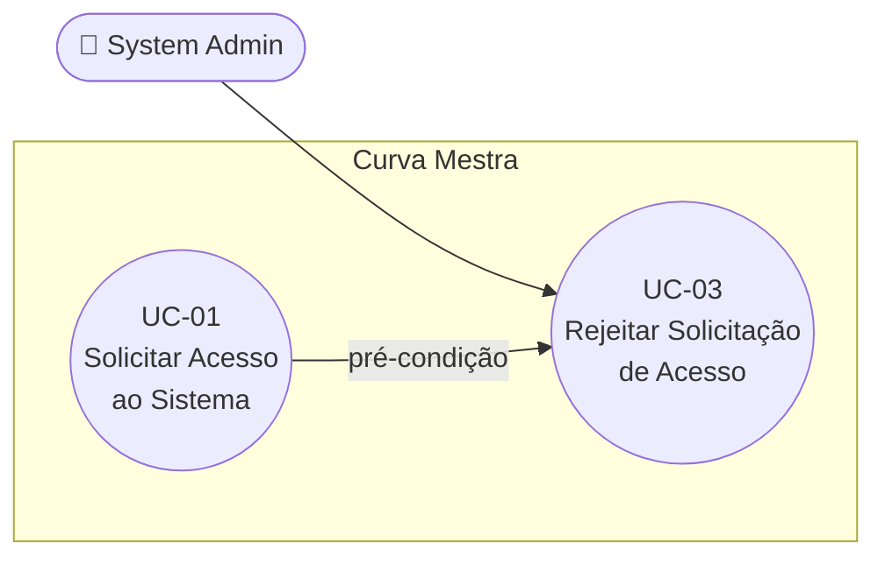

# UC-03: Rejeitar Solicitação de Acesso

**Projeto:** Curva Mestra
**Data de Criação:** 13/07/2026
**Autor:** Guilherme Scandelari (via uml-use-case-writer)
**Status:** Aprovado
**Módulo/Contexto:** Administração do Sistema
**Versão:** 1.0

> O System Admin rejeita uma solicitação de acesso pendente (criada em UC-01), registrando um motivo opcional. Diferente da aprovação (UC-02), a rejeição é feita inteiramente client-side, sem operações de Auth.

---

## 1. Diagrama UML (Mermaid)

---

## 2. Atores

### 2.1 Ator Primário
**System Admin** — administrador global da plataforma Curva Mestra, identificado pela custom claim `is_system_admin: true`.

### 2.2 Atores Secundários / Sistemas Externos
Nenhum. A rejeição é uma atualização direta no Firestore, sem envolver Firebase Auth ou serviços externos.

---

## 3. Pré-condições
- Admin autenticado, com `user` e `claims` carregados e `is_system_admin === true`.
- Existe uma solicitação com `status: "pendente"` (criada via UC-01).

---

## 4. Pós-condições

### 4.1 Sucesso (Garantias de Sucesso)
- O documento da solicitação é atualizado: `status: "rejeitada"`, `rejected_by`, `rejected_by_name`, `rejection_reason` (ou `"Não especificado"` se vazio), `rejected_at`, `updated_at`.
- A solicitação desaparece da listagem de pendentes.

### 4.2 Falha (Garantias Mínimas)
- O documento da solicitação permanece inalterado (mantém o status anterior).
- Um toast de erro é exibido ao admin.

---

## 5. Gatilho (Trigger)
O System Admin clica em "Rejeitar" na linha de uma solicitação pendente, na tela `/admin/access-requests`.

---

## 6. Fluxo Principal (Basic Flow)

1. Admin acessa `/admin/access-requests`.
2. Sistema exibe a tabela de solicitações pendentes.
3. Admin clica em "Rejeitar" na linha de uma solicitação.
4. Sistema abre um Dialog "Rejeitar Solicitação" com um campo de texto "Motivo da rejeição" (opcional).
5. Admin preenche o motivo (opcional).
6. Admin clica em "Confirmar Rejeição".
7. Sistema chama `rejectAccessRequest(id, { uid, name }, motivo)` do `accessRequestService`.
8. Service valida que a solicitação existe e está com `status: "pendente"`.
9. Service atualiza o documento no Firestore: `status: "rejeitada"`, `rejected_by`, `rejected_by_name`, `rejection_reason` (default `"Não especificado"` se vazio), `rejected_at`, `updated_at`.
10. Sistema exibe toast de sucesso: "Solicitação rejeitada — O solicitante será notificado".
11. Sistema fecha o dialog e recarrega a lista de solicitações pendentes.
12. Caso de uso é concluído com sucesso.

---

## 7. Fluxos Alternativos

### 7a. Admin não preenche motivo (a partir do passo 5)
1. Admin deixa o campo "Motivo da rejeição" em branco.
2. Sistema salva `rejection_reason` como `"Não especificado"` no passo 9.
3. Segue o fluxo normal a partir do passo 6.

### 7b. Admin cancela o dialog (a partir do passo 4)
1. Admin clica em "Cancelar".
2. Dialog fecha sem alterar a solicitação.
3. Caso de uso é encerrado sem efeito.

---

## 8. Fluxos de Exceção

### 8a. Solicitação já processada (a partir do passo 8)
1. Service detecta que o `status` não é mais `"pendente"` (já foi aprovada ou rejeitada por outra ação concorrente).
2. Service retorna `{ success: false, message: "Solicitação já foi processada" }`.
3. Sistema exibe toast destructive com a mensagem.
4. A solicitação mantém o status atual.

---

## 9. Regras de Negócio Relacionadas

| ID | Regra | Justificativa |
|----|-------|----------------|
| RN-01 | O motivo da rejeição é opcional; quando vazio, é salvo como `"Não especificado"`. | Permite rejeição rápida sem bloquear o admin por um campo obrigatório. |
| RN-02 | A rejeição é feita inteiramente client-side via `accessRequestService` (`updateDoc` direto no Firestore) — diferente da aprovação, não requer Firebase Admin SDK. | Operação simples que não envolve criação de usuário/Auth, dispensando o server-side. |

---

## 10. Requisitos Especiais / Não Funcionais

| ID | Descrição | Categoria |
|----|-----------|-----------|
| RNF-01 | Acesso restrito pelo Admin Layout (`is_system_admin`); regra do Firestore restringe escrita na coleção `access_requests` a `system_admin`. | Segurança |
| RNF-02 | Sem realtime listener — dados podem ficar desatualizados se múltiplos admins operam simultaneamente sobre a mesma solicitação. | Confiabilidade |

---

## 11. Frequência de Uso
Ocasional — conforme o volume de solicitações que não atendem aos critérios de aprovação.

---

## 12. Casos de Uso Relacionados
- **UC-01 (Solicitar Acesso ao Sistema)** é pré-condição — só existe algo para rejeitar depois que UC-01 cria a solicitação.
- **UC-02 (Aprovar Solicitação de Acesso)** é a alternativa mutuamente exclusiva sobre a mesma solicitação pendente: mesmo ator, mesmo ponto de decisão, resultado oposto.

---

## 13. Referências
- `src/app/(admin)/admin/access-requests/page.tsx`
- `src/lib/services/accessRequestService.ts` (`rejectAccessRequest`)
- `project_doc/admin/access-requests-documentation.md`

---

## 14. Perguntas em Aberto / Decisões Pendentes
Nenhuma.

---

## 15. Histórico de Versões

| Versão | Data | Autor | O que mudou |
|--------|------|-------|--------------|
| 1.0 | 13/07/2026 | Guilherme Scandelari | Versão inicial, mapeada a partir do código atual e de `project_doc/admin/access-requests-documentation.md` |
