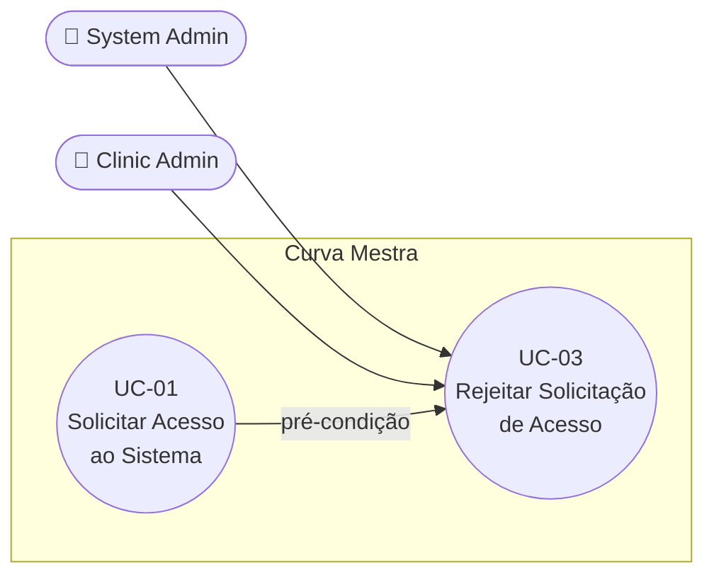

# UC-03: Rejeitar Solicitação de Acesso

**Projeto:** Curva Mestra
**Data de Criação:** 13/07/2026
**Autor:** Guilherme Scandelari (via uml-use-case-writer)
**Status:** Aprovado
**Módulo/Contexto:** Administração do Sistema
**Versão:** 1.2

> O System Admin (ou, para a própria clínica, o Clinic Admin) rejeita uma solicitação de acesso pendente (criada em UC-01), registrando um motivo opcional. Diferente da aprovação (UC-02), a rejeição é feita inteiramente client-side, sem operações de Auth.

---

## 1. Diagrama UML (Mermaid)

---

## 2. Atores

### 2.1 Ator Primário
**System Admin** — administrador global da plataforma Curva Mestra, identificado pela custom claim `is_system_admin: true`. Atua sobre qualquer solicitação pendente, de qualquer tenant, via `/admin/access-requests`.

### 2.2 Atores Secundários / Sistemas Externos
**Clinic Admin** — administrador de uma clínica específica (`role: "clinic_admin"`), que também pode rejeitar solicitações de acesso, através da tela `/clinic/access-requests`. Usa a mesma função `rejectAccessRequest()` e as mesmas Regras de Negócio deste UC (RN-01 a RN-03) — a diferença real está no escopo de visibilidade das solicitações (apenas as da própria clínica, ver RN-04) e na rota de acesso. Não há operação de Firebase Auth nem serviço externo envolvido em nenhuma das duas variantes.

---

## 3. Pré-condições
- Admin autenticado — `is_system_admin === true` (System Admin) ou `role === "clinic_admin"` com `claims.tenant_id` definido (Clinic Admin).
- Existe uma solicitação com `status: "pendente"` (criada via UC-01, v2.0). Não há pré-condição sobre CPF/CNPJ ou qualquer outro dado de documento — a função de rejeição não depende deles (ver RN-03).
- Quando o ator é `clinic_admin`: a claim `tenant_id` do admin define o escopo de solicitações visíveis (ver RN-04). Na prática, essa lista costuma estar vazia hoje — mesma causa-raiz confirmada em UC-05 (ver seção 14).

---

## 4. Pós-condições

### 4.1 Sucesso (Garantias de Sucesso)
- O documento da solicitação é atualizado: `status: "rejeitada"`, `rejected_by`, `rejected_by_name`, `rejection_reason` (ou `"Não especificado"` se vazio), `rejected_at`, `updated_at`.
- A solicitação desaparece da listagem de pendentes (da tela usada — `/admin/access-requests` ou `/clinic/access-requests`, conforme o ator).

### 4.2 Falha (Garantias Mínimas)
- O documento da solicitação permanece inalterado (mantém o status anterior).
- Um toast de erro é exibido ao admin.

---

## 5. Gatilho (Trigger)
O System Admin clica em "Rejeitar" na linha de uma solicitação pendente, na tela `/admin/access-requests`; ou o Clinic Admin faz o mesmo na tela `/clinic/access-requests`, restrita às solicitações da própria clínica.

---

## 6. Fluxo Principal (Basic Flow)

1. Admin (System Admin ou Clinic Admin) acessa, respectivamente, `/admin/access-requests` ou `/clinic/access-requests`.
2. Sistema exibe a tabela de solicitações pendentes — para o System Admin, todas as solicitações pendentes de qualquer tenant; para o Clinic Admin, somente as solicitações pendentes com `tenant_id` igual ao da própria clínica (RN-04), lista que, na prática, está normalmente vazia hoje (ver seção 14).
3. Admin clica em "Rejeitar" na linha de uma solicitação.
4. Sistema abre um Dialog "Rejeitar Solicitação" com um campo de texto "Motivo da rejeição" (opcional). Na tela do System Admin, o placeholder sugere exemplos como "CPF/CNPJ não cadastrado, limite de usuários atingido, etc." — um texto de exemplo desatualizado em relação ao schema atual de solicitações (UC-01, v2.0, não usa mais CPF/CNPJ), mas sem efeito funcional (ver seção 14). Na tela do Clinic Admin, o placeholder é diferente e mais genérico ("Ex: Perfil não compatível, dados incorretos, etc."), sem menção a CPF/CNPJ.
5. Admin preenche o motivo (opcional).
6. Admin clica em "Confirmar Rejeição".
7. Sistema chama `rejectAccessRequest(id, { uid, name }, motivo)` do `accessRequestService` — mesma função para ambos os atores.
8. Service valida que a solicitação existe e está com `status: "pendente"`.
9. Service atualiza o documento no Firestore: `status: "rejeitada"`, `rejected_by`, `rejected_by_name`, `rejection_reason` (default `"Não especificado"` se vazio), `rejected_at`, `updated_at`.
10. Sistema exibe toast de sucesso: "Solicitação rejeitada — O solicitante será notificado".
11. Sistema fecha o dialog e recarrega a lista de solicitações pendentes.
12. Caso de uso é concluído com sucesso.

---

## 7. Fluxos Alternativos

### 7a. Admin não preenche motivo (a partir do passo 5)
1. Admin deixa o campo "Motivo da rejeição" em branco.
2. Sistema salva `rejection_reason` como `"Não especificado"` no passo 9.
3. Segue o fluxo normal a partir do passo 6.

### 7b. Admin cancela o dialog (a partir do passo 4)
1. Admin clica em "Cancelar".
2. Dialog fecha sem alterar a solicitação.
3. Caso de uso é encerrado sem efeito.

---

## 8. Fluxos de Exceção

### 8a. Solicitação já processada (a partir do passo 8)
1. Service detecta que o `status` não é mais `"pendente"` (já foi aprovada ou rejeitada por outra ação concorrente).
2. Service retorna `{ success: false, message: "Solicitação já foi processada" }`.
3. Sistema exibe toast destructive com a mensagem.
4. A solicitação mantém o status atual.

---

## 9. Regras de Negócio Relacionadas

| ID | Regra | Justificativa |
|----|-------|----------------|
| RN-01 | O motivo da rejeição é opcional; quando vazio, é salvo como `"Não especificado"`. | Permite rejeição rápida sem bloquear o admin por um campo obrigatório. |
| RN-02 | A rejeição é feita inteiramente client-side via `accessRequestService` (`updateDoc` direto no Firestore) — diferente da aprovação, não requer Firebase Admin SDK. | Operação simples que não envolve criação de usuário/Auth, dispensando o server-side. |
| RN-03 | `rejectAccessRequest()` não depende de nenhum campo de documento (CPF/CNPJ) ou endereço da solicitação — atualiza apenas `status`, `rejected_by`, `rejected_by_name`, `rejection_reason`, `rejected_at`, `updated_at`. Confirmado por leitura direta do código que a mudança de schema do formulário de UC-01 (v2.0 — remoção de CPF/CNPJ/senha) **não afeta** esta função. | Este UC não tem a mesma pendência de dados desatualizados identificada em UC-02 (`document_type`/`address` em fallback) — a rejeição é agnóstica ao schema da solicitação. |
| RN-04 | A visibilidade de solicitações pendentes é escopada por `tenant_id` quando o ator é `clinic_admin`: `listAccessRequests({ status: "pendente", tenant_id })` filtra apenas solicitações do próprio tenant; o System Admin usa a mesma função sem o filtro de `tenant_id`, vendo todas as solicitações pendentes de qualquer clínica. | Isolamento multi-tenant: um `clinic_admin` não deve ver nem rejeitar solicitações de outras clínicas. |

---

## 10. Requisitos Especiais / Não Funcionais

| ID | Descrição | Categoria |
|----|-----------|-----------|
| RNF-01 | Acesso restrito pelo layout correspondente (`is_system_admin` para `/admin/access-requests`; `role === "clinic_admin"` para `/clinic/access-requests`); regra do Firestore restringe escrita na coleção `access_requests` conforme o role. | Segurança |
| RNF-02 | Sem realtime listener em nenhuma das duas telas — dados podem ficar desatualizados se múltiplos admins operam simultaneamente sobre a mesma solicitação. | Confiabilidade |
| RNF-03 | O filtro por `tenant_id` na consulta usada por `/clinic/access-requests` garante isolamento multi-tenant na visualização de solicitações pelo `clinic_admin` (RN-04). | Multi-tenant |

---

## 11. Frequência de Uso
Ocasional — conforme o volume de solicitações que não atendem aos critérios de aprovação. Para o `clinic_admin`, a frequência é hoje praticamente nula na prática, já que a lista de solicitações pendentes da própria clínica costuma estar sempre vazia (ver seção 14 e UC-05).

---

## 12. Casos de Uso Relacionados
- **UC-01 (Solicitar Acesso ao Sistema)** é pré-condição — só existe algo para rejeitar depois que UC-01 cria a solicitação.
- **UC-02 (Aprovar Solicitação de Acesso)** é a alternativa mutuamente exclusiva sobre a mesma solicitação pendente, para o ator System Admin: mesmo ator, mesmo ponto de decisão, resultado oposto.
- **UC-05 (Aprovar Solicitação de Acesso pela Própria Clínica, pausado)** compartilha a mesma tela (`/clinic/access-requests`) e a mesma causa-raiz de indisponibilidade prática (nenhuma solicitação pendente tem `tenant_id` de uma clínica existente hoje) — mas trata da aprovação, não da rejeição, pelo `clinic_admin`.

---

## 13. Referências
- `src/app/(admin)/admin/access-requests/page.tsx`
- `src/app/(clinic)/clinic/access-requests/page.tsx`
- `src/lib/services/accessRequestService.ts` (`rejectAccessRequest`, `listAccessRequests`)
- `project_doc/admin/access-requests-documentation.md`

---

## 14. Perguntas em Aberto / Decisões Pendentes

**[Observação confirmada, sem necessidade de correção funcional]** O placeholder do campo "Motivo da rejeição" na tela `/admin/access-requests` (`"Ex: CPF/CNPJ não cadastrado, limite de usuários atingido, etc."`) é um texto de exemplo desatualizado — referencia o schema antigo de solicitação (CPF/CNPJ), que não existe mais desde a reescrita de UC-01 (v2.0). Sem efeito funcional (é apenas um exemplo ilustrativo dentro de um campo de texto livre), mas vale corrigir a cópia em uma manutenção futura de UI. Não confirmado pelo usuário como prioridade de correção.

**[Confirmado — mesma causa-raiz do UC-05, pendência compartilhada]** A lista de solicitações pendentes vista pelo `clinic_admin` em `/clinic/access-requests` (usada tanto para aprovar quanto para rejeitar) está, na prática, normalmente vazia hoje: nenhuma tela viva do sistema cria uma `access_request` com `status: "pendente"` e `tenant_id` já apontando para uma clínica existente (a única função que faria essa correspondência por CNPJ, `accessRequestService.createAccessRequest()`, é código morto — não é chamada por nenhuma página). Ou seja, embora `rejectAccessRequest()` funcione corretamente (RN-03) e a checagem de escopo por `tenant_id` também (RN-04), o `clinic_admin` não tem, hoje, nenhuma solicitação real para rejeitar através desta tela na prática. Mesma causa-raiz documentada em UC-05 (pausado). Não foi confirmado pelo usuário se isso deve ser corrigido (reativando o match por documento, ou criando um novo mecanismo) — fica registrado aqui como pendência compartilhada com UC-05.

---

## 15. Histórico de Versões

| Versão | Data | Autor | O que mudou |
|--------|------|-------|--------------|
| 1.0 | 13/07/2026 | Guilherme Scandelari | Versão inicial, mapeada a partir do código atual e de `project_doc/admin/access-requests-documentation.md` |
| 1.1 | 13/07/2026 | Guilherme Scandelari | Revisão motivada pela reescrita de UC-01 (v2.0) e UC-02 (v2.0): confirmado, por releitura de `rejectAccessRequest()`, que esta função é agnóstica ao schema da solicitação (não usa CPF/CNPJ/endereço) — adicionada RN-03 documentando essa confirmação. Adicionada observação sobre o placeholder desatualizado do campo "Motivo da rejeição" (menciona CPF/CNPJ). Adicionada observação, a partir da leitura de `clinic/access-requests/page.tsx`, de que a rejeição pelo `clinic_admin` usa a mesma função e parece funcionar corretamente (diferente da aprovação pelo `clinic_admin`, quebrada — ver UC-05 pausado); registrada como achado relevante para um futuro UC-06, sem expandir o escopo deste documento. |
| 1.2 | 13/07/2026 | Guilherme Scandelari | **Expansão de escopo** (decisão do usuário): `clinic_admin` passou a ser documentado como ator secundário deste UC (não um UC-06 separado), já que usa a mesma função `rejectAccessRequest()` e as mesmas regras de negócio, diferindo apenas no escopo de visibilidade das solicitações. Adicionada RN-04 (visibilidade por `tenant_id`) e RNF-03 (isolamento multi-tenant); ajustados Atores, Pré-condições, Gatilho e Fluxo Principal (passos 1, 2 e 4) para diferenciar as duas rotas/atores. Adicionada UC-05 em Casos de Uso Relacionados. Substituída a antiga nota "não expande o escopo" da seção 14 por uma pendência compartilhada com UC-05: a lista de solicitações do `clinic_admin` está normalmente vazia na prática, pela mesma causa-raiz (nenhuma solicitação pendente tem `tenant_id` de clínica existente hoje). |
