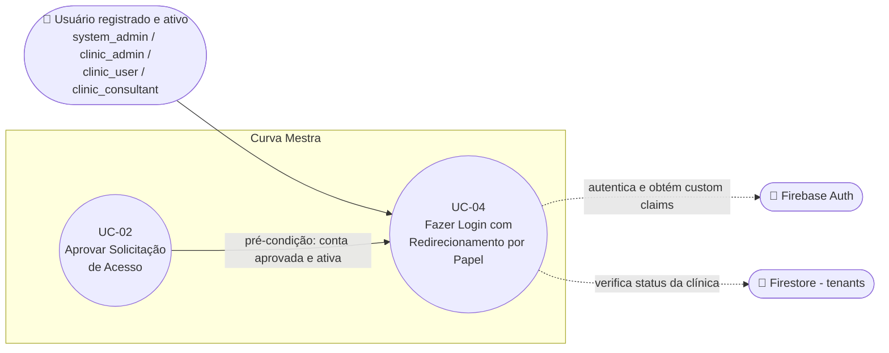

# UC-04: Fazer Login com Redirecionamento por Papel

**Projeto:** Curva Mestra
**Data de Criação:** 13/07/2026
**Autor:** Guilherme Scandelari (via uml-use-case-writer)
**Status:** Aprovado
**Módulo/Contexto:** Autenticação
**Versão:** 1.1.4

> Um usuário já cadastrado e aprovado (system_admin, clinic_admin, clinic_user ou clinic_consultant) autentica-se com email e senha e é redirecionado automaticamente para a área correta do sistema, passando antes por checagens de aprovação/ativação, troca de senha obrigatória e status da clínica.

---

## 1. Diagrama UML (Mermaid)

---

## 2. Atores

### 2.1 Ator Primário
**Usuário registrado e ativo no sistema** — qualquer um dos roles `system_admin`, `clinic_admin`, `clinic_user` ou `clinic_consultant`. O mecanismo de autenticação é idêntico para todos; o que varia é o redirecionamento pós-login e algumas checagens intermediárias, tratadas como variação dentro deste mesmo fluxo (mesmo padrão adotado em UC-01 para tipos de conta).

### 2.2 Atores Secundários / Sistemas Externos
- **Firebase Auth:** autentica email/senha (`signInWithEmailAndPassword`) e emite o ID token com os custom claims (`tenant_id`, `role`, `is_system_admin`, `active`, `requirePasswordChange`, etc.).
- **Firestore (coleção `tenants`):** consultado para verificar se a clínica do usuário está ativa antes de liberar o acesso.

---

## 3. Pré-condições
- O usuário possui uma conta já criada no Firebase Auth, com custom claims definidas (via UC-02 — aprovação de solicitação — ou por outro fluxo administrativo, ex.: cadastro de consultor).
- O usuário conhece seu e-mail e sua senha atual (definitiva ou temporária).
- Para `clinic_consultant`, o `tenant_id` da claim é tipicamente `null` (atuação multi-tenant via `authorized_tenants`), o que o exclui, na prática, da checagem de clínica ativa do passo 8.
- (Contextual) O usuário pode chegar a `/login` após um timeout de sessão por inatividade, mecanismo externo (`useSessionTimeout`, não mapeado como UC nesta documentação). **[Atualizado em v1.1.4]** Esse valor não é mais fixo em todos os casos: desde o commit `66c75fa`, `useSessionTimeout.ts` lê `system_settings/global.session_timeout_minutes` (tela de Configurações do Sistema, UC-35) uma vez por sessão, com fallback para 15 minutos caso o campo não exista ou seja inválido — ver RN-07, `[CORRIGIDO]`.

---

## 4. Pós-condições

### 4.1 Sucesso (Garantias de Sucesso)
- Existe uma sessão Firebase Auth ativa para o usuário, com o ID token forçado a refresh (`getIdToken(true)`) para refletir custom claims atualizadas.
- O usuário é redirecionado para exatamente um destino, de acordo com o estado de suas claims e do tenant: `/waiting-approval`, `/change-password`, a própria tela `/login` (com mensagem inline e sessão encerrada), `/clinic/my-clinic`, `/admin/dashboard`, `/clinic/dashboard`, `/consultant/dashboard` (diretamente, para `clinic_consultant` — corrigido no commit `53df743`, RN-08) ou `/dashboard` (destino residual, hoje sem nenhum role mapeado do sistema que efetivamente o alcance — ver Fluxo Alternativo 7b, nota histórica).

### 4.2 Falha (Garantias Mínimas)
- Nenhuma sessão útil é estabelecida; o usuário permanece na tela `/login`.
- Uma mensagem de erro traduzida para português é exibida abaixo do formulário.

---

## 5. Gatilho (Trigger)
O usuário acessa `/login` e submete o formulário com email e senha. (Variações de entrada nesta mesma tela — usuário já autenticado, ou chegada por timeout de sessão — são tratadas nos Fluxos Alternativos.)

---

## 6. Fluxo Principal (Basic Flow)

1. Usuário acessa `/login`.
2. Sistema exibe o formulário de login (campos de email e senha) e os links "Esqueceu a senha?" e "Registrar-se".
3. Usuário preenche email e senha e clica em "Entrar".
4. Sistema chama `signIn(email, password)`, que invoca `signInWithEmailAndPassword` do Firebase Auth.
5. Sistema força o refresh do ID token (`getIdToken(true)`) e obtém os custom claims atualizados (`getIdTokenResult()`).
6. Sistema verifica `claims.role` e `claims.active` — ambos presentes e verdadeiros (fluxo feliz).
7. Sistema verifica `claims.requirePasswordChange` — ausente ou `false` (fluxo feliz).
8. Sistema verifica se o usuário não é `system_admin` e possui `tenant_id`; nesse caso, lê o documento `tenants/{tenant_id}` no Firestore e confirma que `active !== false` (clínica ativa).
9. Sistema redireciona por role, via `redirectByRole` (`src/app/(auth)/login/page.tsx`, linhas 87-97): `is_system_admin` → `/admin/dashboard`; `role === "clinic_admin"` ou `role === "clinic_user"` → `/clinic/dashboard`; `role === "clinic_consultant"` → `/consultant/dashboard`, diretamente (corrigido no commit `53df743` — ver RN-08 e nota histórica no Fluxo Alternativo 7b); qualquer outro caso (fallback residual, sem role mapeado do sistema que o alcance hoje) → `/dashboard`.
10. Caso de uso é concluído com sucesso.

---

## 7. Fluxos Alternativos

### 7a. Usuário já autenticado acessa /login diretamente (a partir do passo 1)
1. Sistema detecta, via `useEffect` que observa `useAuth()`, que `isAuthenticated` e `claims` já estão disponíveis, sem que o usuário submeta o formulário.
2. Sistema verifica **apenas** `claims.requirePasswordChange`; se `true`, redireciona para `/change-password` e o caso de uso é encerrado.
3. Caso contrário, sistema redireciona diretamente por role (mesma lógica do passo 9), **sem repetir** as checagens de `role`/`active` (passo 6) nem a de clínica suspensa (passo 8) — este caminho específico (`/login`, usuário já autenticado) não foi alterado pela correção de `ProtectedRoute.tsx` (RN-09); permanece como comportamento as-is, sem gap de segurança relevante já que a checagem de `requirePasswordChange` já é feita aqui.
4. Caso de uso é encerrado.

### 7b. [Nota histórica — corrigido no commit `53df743`] Redirecionamento de `clinic_consultant`
1. **Até a correção**, o usuário com role `clinic_consultant` chegava primeiro a `/dashboard` — uma página originalmente de depuração/debug, não uma tela de destino final —, pois `redirectByRole` não possuía nenhum branch dedicado a esse role e o enviava para o `else` genérico. A página `/dashboard`, ao montar, verificava novamente `isAuthenticated` e `claims` via `useAuth()` e só então detectava `claims.role === "clinic_consultant"` e redirecionava para `/consultant/dashboard` — um salto duplo desnecessário, diferente do salto único aplicado aos demais roles.
2. **Corrigido:** `redirectByRole` (`src/app/(auth)/login/page.tsx`, linhas 87-97) passou a incluir um branch direto — `else if (claims.role === 'clinic_consultant') { router.push('/consultant/dashboard'); }`, inserido antes do `else` genérico — eliminando o salto via `/dashboard`. Desde então, o passo 9 do Fluxo Principal já entrega o `clinic_consultant` diretamente em `/consultant/dashboard`, no mesmo padrão de salto único usado pelos demais roles (ver RN-08).
3. Caso de uso é concluído com sucesso, sem mais nenhum salto adicional em relação aos demais roles.

### 7c. Alerta de sessão expirada por timeout (a partir do passo 1)
1. Usuário chega a `/login?timeout=true`, redirecionado por um mecanismo externo de timeout de inatividade (`useSessionTimeout`, que já efetuou `signOut` antes do redirecionamento — não mapeado como UC nesta documentação). **[Atualizado em v1.1.4]** O tempo de inatividade que dispara esse redirecionamento é, desde o commit `66c75fa`, configurável via `system_settings/global.session_timeout_minutes` (fallback de 15 minutos) — ver RN-07, `[CORRIGIDO]`.
2. Sistema exibe um alerta informativo acima do formulário: "Sua sessão expirou por inatividade. Por favor, faça login novamente."
3. Retorna ao passo 2 do Fluxo Principal (formulário exibido normalmente).

---

## 8. Fluxos de Exceção

### 8a. Credenciais inválidas ou erro do Firebase Auth (a partir do passo 4)
1. Firebase Auth retorna um erro (ex.: `wrong-password`, `invalid-credential`, `user-not-found`, `too-many-requests`, `network-request-failed`, `invalid-email`, ou outro código não mapeado).
2. Sistema traduz o erro para português (ver RN-06) e o exibe em destaque vermelho abaixo do formulário.
3. Nenhum redirecionamento ocorre; usuário permanece em `/login`.
4. Caso de uso retorna ao passo 3.

### 8b. Usuário sem role definida ou inativo (a partir do passo 6)
1. Sistema detecta `!claims.role || !claims.active`.
2. Sistema redireciona para `/waiting-approval` — a mesma tela usada tanto para quem aguarda a primeira aprovação (pós-UC-01) quanto para quem foi desativado posteriormente por um admin (ver nota na seção 14).
3. Caso de uso é encerrado, sem acesso liberado a nenhuma área do sistema.

### 8c. Senha temporária pendente de troca (a partir do passo 7)
1. Sistema detecta `claims.requirePasswordChange === true`.
2. Sistema redireciona para `/change-password`.
3. Caso de uso é encerrado nesta etapa — a troca de senha em si é fora do escopo deste UC.

### 8d. Clínica inativa/suspensa — role clinic_user (a partir do passo 8)
1. Sistema lê `tenants/{tenant_id}` e confirma que `active === false` (explicitamente falso; a ausência do campo é tratada como clínica ativa).
2. Como o role é `clinic_user`, o sistema efetua `signOut()` do usuário e exibe, na própria tela `/login`, o card "Sistema Indisponível", com a mensagem: "O sistema encontra-se indisponível no momento. Procure o administrador da clínica ou entre em contato com o suporte técnico Curva Mestra." e o e-mail `suporte@curvamestra.com.br`.
3. Usuário pode clicar em "Voltar ao login" para limpar o estado e tentar novamente (retorna ao passo 2 do Fluxo Principal).
4. Caso de uso é encerrado, sem acesso liberado.

### 8e. Clínica inativa/suspensa — role clinic_admin (a partir do passo 8)
1. Sistema lê `tenants/{tenant_id}` e confirma a mesma condição `active === false`.
2. Como o role é `clinic_admin`, o sistema redireciona para `/clinic/my-clinic` (sem `signOut`) — presumivelmente para que o próprio admin visualize/gerencie o status da clínica.
3. Caso de uso é encerrado, com o usuário redirecionado a uma tela de gestão específica, diferente do bloqueio total aplicado ao `clinic_user`.

---

## 9. Regras de Negócio Relacionadas

| ID | Regra | Justificativa |
|----|-------|----------------|
| RN-01 | A checagem de `role`/`active` (passo 6) tem prioridade sobre todas as demais — mesmo com credenciais corretas, a ausência de `role` ou `active: false` bloqueia o acesso a qualquer dashboard, redirecionando para `/waiting-approval`. | Garante que apenas contas plenamente aprovadas e ativadas por um admin (ver UC-02) acessem o sistema. |
| RN-02 | A checagem de `requirePasswordChange` (passo 7) tem prioridade sobre a checagem de clínica ativa/suspensa (passo 8) — um usuário com senha temporária pendente é sempre enviado para `/change-password` antes de qualquer verificação do status da clínica. | Impede o uso prolongado de uma senha temporária, mesmo que a clínica esteja com problemas de status. |
| RN-03 | A verificação de clínica ativa (passo 8) só ocorre para usuários com `tenant_id` definido e que não sejam `system_admin` — isso exclui tanto `system_admin` (sem `tenant_id`) quanto, na prática, `clinic_consultant` (cujo `tenant_id` costuma ser `null`, atuando sobre múltiplos tenants via `authorized_tenants`). | System Admin e consultores operam fora do contexto de uma única clínica. |
| RN-04 | O tratamento de clínica inativa é diferenciado por role: `clinic_user` é desconectado e bloqueado com mensagem informativa (sem acesso a nenhuma tela do sistema); `clinic_admin` é redirecionado para `/clinic/my-clinic`, mantendo acesso a uma tela específica. | Permite que o responsável pela clínica (`clinic_admin`) tenha visibilidade/ação sobre a própria suspensão, enquanto usuários comuns ficam bloqueados. |
| RN-05 | `requirePasswordChange` é uma custom claim distinta do link de redefinição de senha gerado na aprovação inicial (UC-02, RN-03). Ela é setada manualmente por um System Admin ao redefinir a senha de um usuário ou consultor já existente (`/api/users/{id}/set-password`, `/api/consultants/{id}/set-password`), não pelo fluxo de aprovação em si. | São dois mecanismos distintos de "senha temporária", com origens e telas de destino diferentes (link de redefinição do Firebase vs. tela própria `/change-password`) — importante não confundir os dois. |
| RN-06 | Mensagens de erro de autenticação são traduzidas para português a partir do código de erro do Firebase Auth (ver Fluxo de Exceção 8a), com fallback para a mensagem original do Firebase (ou uma mensagem genérica) quando o código não é reconhecido. | Usabilidade — evita expor mensagens técnicas em inglês ao usuário final. |
| RN-07 | **[CORRIGIDO — commit `66c75fa`, correção real feita em UC-35/RN-06]** Até a v1.1.3, o timeout de sessão por inatividade citado nas Pré-condições (`useSessionTimeout.ts`) usava uma constante fixa (`hardcoded`, 15 minutos) — não lia o campo `session_timeout_minutes` do documento `system_settings/global` (tela "Configurações do Sistema", UC-35), então alterar esse valor naquela tela não tinha nenhum efeito real. **Isso deixou de ser verdade:** o commit `66c75fa` alterou `src/hooks/useSessionTimeout.ts` para ler `system_settings/global.session_timeout_minutes` uma vez por sessão (via `useRef`, dentro do `useEffect` que roda quando `currentUser` muda, antes de iniciar o timer), com fallback para 15 minutos (`DEFAULT_SESSION_TIMEOUT_MINUTES`) caso o campo não exista ou não seja um número positivo. **Nota importante:** essa correção foi feita inteiramente do lado de UC-35 (RN-06 daquele documento, agora v2.0) — nenhum arquivo específico deste UC-04 foi alterado; este UC apenas cita o comportamento de `useSessionTimeout.ts` como uma pré-condição/fluxo alternativo (Pré-condições, Fluxo Alternativo 7c), então a atualização aqui é só de referência cruzada. **Limitação remanescente (ver UC-35, seção 14):** o valor é lido apenas uma vez por sessão — uma alteração feita pelo System Admin não afeta sessões já em andamento, só a próxima autenticação/carregamento do usuário. | Corrigido conforme diff de `src/hooks/useSessionTimeout.ts` no commit `66c75fa` (documentado em detalhe em `UC-35-editar-configuracoes-globais-do-sistema.md`, RN-06, `[CORRIGIDO]`) — `sessionTimeoutMinutesRef` substituindo a constante fixa, leitura de `system_settings/global.session_timeout_minutes` com fallback de 15 minutos. |
| RN-08 | **[Corrigido no commit `53df743` — UC-04-Q1]** `redirectByRole` (`src/app/(auth)/login/page.tsx`, linhas 87-97) passou a incluir um branch direto para `clinic_consultant` — `else if (claims.role === 'clinic_consultant') { router.push('/consultant/dashboard'); }`, inserido antes do `else` genérico — eliminando o salto duplo via `/dashboard` que existia antes (ver nota histórica no Fluxo Alternativo 7b). A lógica correta já existia em outro ponto do sistema (`ProtectedRoute.tsx`, função `redirectToDashboard()`, já com um branch direto `clinic_consultant` → `/consultant/dashboard` desde a v1.1 deste documento) — a correção apenas replicou esse mesmo branch em `redirectByRole`, eliminando a inconsistência entre os dois pontos de redirecionamento do sistema. | Confirmado por leitura literal de `redirectByRole` (`src/app/(auth)/login/page.tsx`, linhas 87-97) — novo branch `clinic_consultant` presente antes do `else` genérico. |
| RN-09 | **[CORRIGIDO no commit `f6e9161` — UC-04-Q3]** Antes: `ProtectedRoute.tsx` — componente que protege todas as rotas internas do app, fora de `/login` — não verificava `claims.requirePasswordChange` em nenhum momento; um usuário com uma sessão Firebase já ativa (token válido, sessão restaurada pelo app) que navegasse diretamente para qualquer página protegida, sem passar pelo formulário de login, não era forçado a trocar uma senha temporária pendente (bypass confirmado, ver histórico do gap na seção 14). Agora: o `useEffect` (`checkAccess`) de `ProtectedRoute.tsx` ganhou um novo bloco, logo após a checagem de `claims.active === false` — `if (user && claims && claims.requirePasswordChange === true) { router.push('/change-password'); return; }` — no mesmo padrão já usado para `active === false`; um guard espelhado (`if (claims.requirePasswordChange === true) { return null; }`) foi adicionado também na parte síncrona de renderização do componente. **Escopo desta correção, deliberadamente parcial:** a parte de "clínica suspensa" do mesmo achado original **não** foi tocada aqui — investigação prévia à implementação confirmou que `src/components/auth/SuspensionInterceptor.tsx` (montado em `src/app/(clinic)/layout.tsx`) já cobre esse caso para navegação direta às rotas de clínica, redirecionando para `/suspended/admin`, `/suspended/user` ou `/clinic/my-clinic` conforme o role e o tipo de bloqueio (`isSuspended`/`isInactive`, via `useTenantSuspension`) — ou seja, esse sub-achado não era, na prática, um gap real a corrigir, apenas não estava documentado como já coberto (ver seção 14). | Confirmado por leitura literal de `src/components/auth/ProtectedRoute.tsx` (novo bloco em `checkAccess` e guard de renderização espelhado) e de `src/components/auth/SuspensionInterceptor.tsx` (cobertura pré-existente de clínica suspensa/inativa para rotas de clínica). Commit `f6e9161` (`fix: tres itens de alta severidade (UC-32, UC-04, UC-39)`). |

---

## 10. Requisitos Especiais / Não Funcionais

| ID | Descrição | Categoria |
|----|-----------|-----------|
| RNF-01 | O ID token é sempre forçado a refresh (`getIdToken(true)`) tanto no login quanto no listener `onAuthStateChanged` de `useAuth`, garantindo que custom claims alteradas recentemente (ex.: aprovação, mudança de role) sejam refletidas já no primeiro carregamento pós-alteração. | Segurança |
| RNF-02 | O acesso a qualquer dashboard depende de `tenant_id` + `role` + `active` corretos nas custom claims, checados no fluxo de submissão do login. **[Mitigado no commit `f6e9161`, RN-09]** `ProtectedRoute.tsx` (que protege as páginas internas) agora repete a checagem de `requirePasswordChange` para uma sessão já autenticada navegando direto a qualquer rota protegida. A checagem de clínica suspensa, para rotas de clínica, é feita por um componente separado (`SuspensionInterceptor.tsx`), já ativo antes desta correção. O caminho "usuário já autenticado acessa /login" (Fluxo Alternativo 7a) permanece sem repetir a checagem de `role`/`active`, mas já verifica `requirePasswordChange` desde a v1.0 deste documento. | Multi-tenant / Segurança |
| RNF-03 | O e-mail de suporte (`suporte@curvamestra.com.br`) está fixo (hardcoded) na tela de clínica inativa exibida ao `clinic_user`. | Usabilidade |

---

## 11. Frequência de Uso
Muito alta — ocorre a cada sessão de uso do sistema, por qualquer usuário, potencialmente múltiplas vezes ao dia (incluindo retornos após timeout de sessão por inatividade).

---

## 12. Casos de Uso Relacionados
- **UC-02 (Aprovar Solicitação de Acesso)** é pré-condição indireta: só é possível fazer login com sucesso e liberar o acesso após a aprovação criar o usuário no Firebase Auth com claims válidas (`role`, `active`).
- **UC-35 (Editar Configurações Globais do Sistema)** — a tela administrativa daquele UC expõe um campo "Tempo de sessão (minutos)" (`session_timeout_minutes`) que controla o timeout de inatividade citado nas Pré-condições deste UC-04. **[Relação agora real, desde o commit `66c75fa`]** `useSessionTimeout.ts` passou a ler esse campo de `system_settings/global`, com fallback de 15 minutos — RN-07, `[CORRIGIDO]`. Antes (até a v1.1.3 deste documento e a v1.0 de UC-35), essa relação existia apenas como intenção de produto, sem nenhum efeito real; a atualização do código foi feita inteiramente em UC-35 (RN-06 daquele documento), este UC-04 apenas referencia o comportamento corrigido.
- Não há relação formal `<<include>>`/`<<extend>>` com um eventual UC de "Trocar Senha Obrigatória" ou "Expirar Sessão por Inatividade" — esses fluxos existem no código (`/change-password`, `useSessionTimeout`), mas ainda não foram mapeados como casos de uso formais nesta documentação (ver seção 14).
- `ProtectedRoute.tsx` e `SuspensionInterceptor.tsx` — embora não sejam o gatilho deste UC (que é especificamente a submissão do formulário `/login`), ambos os componentes reforçam, para navegação direta a rotas internas, checagens equivalentes às deste fluxo (`requirePasswordChange` e clínica suspensa, respectivamente) — ver RN-09 e RNF-02.

---

## 13. Referências
- `src/app/(auth)/login/page.tsx` (`redirectByRole`, linhas 87-97 — ver RN-08)
- `src/hooks/useAuth.ts`
- `src/app/(auth)/change-password/page.tsx`
- `src/app/(auth)/waiting-approval/page.tsx`
- `src/app/dashboard/page.tsx`
- `src/hooks/useSessionTimeout.ts` (RN-07, `[CORRIGIDO]` no commit `66c75fa` — passou a ler `system_settings/global.session_timeout_minutes`, com fallback de 15 minutos; alteração documentada em detalhe em `UC-35-editar-configuracoes-globais-do-sistema.md`)
- `src/components/auth/ProtectedRoute.tsx` (bloco de checagem de `requirePasswordChange` em `checkAccess`, adicionado no commit `f6e9161` — RN-09)
- `src/components/auth/SuspensionInterceptor.tsx` (cobertura pré-existente de clínica suspensa/inativa para rotas de clínica — RN-09)
- `src/types/index.ts` (interfaces `CustomClaims`, `UserRole`, `Tenant`, `SuspensionInfo`)
- `src/app/api/users/[id]/set-password/route.ts`, `src/app/api/consultants/[id]/set-password/route.ts` (origem da claim `requirePasswordChange`)
- Commit da correção: `53df743` (`fix: lote de correções de baixa severidade (UC-04, UC-08, UC-30, UC-37, UC-47)`) — adiciona o branch direto `clinic_consultant` → `/consultant/dashboard` em `redirectByRole` (RN-08)
- Commit da correção: `f6e9161` (`fix: tres itens de alta severidade (UC-32, UC-04, UC-39)`) — adiciona a checagem de `claims.requirePasswordChange` em `ProtectedRoute.tsx` (RN-09)
- Commit da correção: `66c75fa` (`fix: cinco itens de alta severidade (UC-21, UC-28, UC-35)`) — corrige `useSessionTimeout.ts` para ler `session_timeout_minutes` de `system_settings/global` (RN-07); alteração de código feita em UC-35, apenas referenciada aqui

---

## 14. Perguntas em Aberto / Decisões Pendentes

~~**[Gap confirmado — não confirmado como escopo de correção]** O redirecionamento por role em `/login` (`redirectByRole`) não possui um branch direto para `clinic_consultant`; esse role cai no `else` genérico e é enviado para `/dashboard` (uma página originalmente de depuração/debug), que só então o redireciona para `/consultant/dashboard`. Isso gera um salto duplo desnecessário especificamente para este role, diferente do salto único de `system_admin` e `clinic_admin`/`clinic_user`. **Achado adicional, confirmado por leitura de `src/components/auth/ProtectedRoute.tsx`:** a função `redirectToDashboard()` desse componente **já possui** um branch direto `clinic_consultant` → `/consultant/dashboard` — ou seja, a lógica correta de redirecionamento direto já existe em outro ponto do sistema, mas não foi replicada em `redirectByRole` no `/login`.~~ **[RESOLVIDO no commit `53df743` — UC-04-Q1]** `redirectByRole` passou a incluir o mesmo branch direto `clinic_consultant` → `/consultant/dashboard` (linhas 87-97), eliminando o salto duplo via `/dashboard`. Ver RN-08 e nota histórica no Fluxo Alternativo 7b.

**[As-is, sem proposta de correção]** A tela `/waiting-approval` é reaproveitada tanto para o cenário de "aguardando primeira aprovação" (pós-UC-01) quanto para "conta desativada posteriormente por um admin" — ambos exibem a mesma mensagem, que não reflete literalmente a segunda situação. Documentado como comportamento atual (Fluxo de Exceção 8b).

~~**[Gap confirmado de segurança/consistência]** Investigado `src/components/auth/ProtectedRoute.tsx` — componente que protege todas as rotas internas do app (fora de `/login`). Seu `useEffect` faz apenas estas checagens: (1) `!user` → `/login`; (2) `user && !claims` → `/waiting-approval`; (3) `claims.active === false` → `/waiting-approval`; (4) role fora de `allowedRoles` → `redirectToDashboard(role)`. **Ele não verifica `claims.requirePasswordChange` em nenhum momento, e não verifica o status da clínica (`tenants/{tenant_id}`) em nenhum momento.** Ou seja, as checagens de senha temporária pendente (passo 7 / RN-02) e de clínica suspensa (passo 8 / RN-03, RN-04) existem **apenas** no fluxo de submissão do formulário em `/login` (Fluxo Principal) — um usuário com uma sessão Firebase já ativa (token válido, sessão restaurada pelo app) que navegue diretamente para qualquer página protegida, sem passar pelo formulário de login, **não é bloqueado** por senha temporária pendente nem por clínica suspensa. Este é um gap real de segurança/consistência, confirmado por leitura direta do código (não mais uma hipótese não investigada). Não foi confirmado pelo usuário como escopo de correção nesta rodada de documentação; registrado aqui para avaliação e priorização futura.~~ **[PARCIALMENTE RESOLVIDO no commit `f6e9161` — UC-04-Q3]** A parte de `requirePasswordChange` do gap foi corrigida: `ProtectedRoute.tsx` agora redireciona para `/change-password` também para uma sessão já autenticada navegando direto a qualquer rota protegida (ver RN-09). **Constatação sobre a parte de "clínica suspensa" do mesmo achado, investigada antes da implementação:** ela não representava, na prática, um gap real — `src/components/auth/SuspensionInterceptor.tsx` (montado em `src/app/(clinic)/layout.tsx`) já intercepta a navegação direta a rotas de clínica quando `isSuspended`/`isInactive` (via `useTenantSuspension`), redirecionando para `/suspended/admin`, `/suspended/user` ou `/clinic/my-clinic` conforme o caso. Ou seja, o achado original combinava dois problemas em um único texto; apenas o de `requirePasswordChange` era de fato uma lacuna, e já foi corrigido.

~~**[RN-07, decisão de produto pendente]** O campo `session_timeout_minutes` (tela de Configurações do Sistema, UC-35) não é lido por `useSessionTimeout.ts` — decisão pendente sobre se essa leitura deveria ser implementada (tornando o timeout de sessão configurável de fato), ou se o campo deveria ser removido da tela de configurações caso o valor fixo de 15 minutos seja a decisão de produto definitiva.~~ **[RESOLVIDO — commit `66c75fa`, ver RN-07]** A leitura foi implementada: `useSessionTimeout.ts` agora consome `system_settings/global.session_timeout_minutes`, com fallback de 15 minutos. Decisão de produto que permanece em aberto, registrada em `UC-35-editar-configuracoes-globais-do-sistema.md` (seção 14): o valor só é lido uma vez por sessão, então uma alteração feita pelo System Admin não afeta sessões já em andamento — apenas a próxima autenticação/carregamento de cada usuário.

---

## 15. Histórico de Versões

| Versão | Data | Autor | O que mudou |
|--------|------|-------|--------------|
| 1.0 | 13/07/2026 | Guilherme Scandelari | Versão inicial, mapeada a partir da leitura direta de `login/page.tsx`, `useAuth.ts`, `change-password/page.tsx`, `waiting-approval/page.tsx`, `dashboard/page.tsx` e `useSessionTimeout.ts`. Corrigidas duas suposições do levantamento inicial que não se confirmaram no código: (1) não existem rotas `/suspended/admin` ou `/suspended/user` — documentado o comportamento real (mensagem inline + `signOut` para `clinic_user`; redirecionamento para `/clinic/my-clinic` para `clinic_admin`); (2) o redirecionamento de `clinic_consultant` não é direto — passa por `/dashboard` antes de chegar a `/consultant/dashboard` (sinalizado como possível gap na seção 14). |
| 1.1 | 13/07/2026 | Guilherme Scandelari | Investigado `src/components/auth/ProtectedRoute.tsx` (adicionado às Referências) para fechar a pendência sobre a assimetria de checagens entre o fluxo de submissão do login e o acesso direto a páginas protegidas. Confirmado: a pendência deixou de ser uma "observação de risco não investigado" e passou a ser um **gap real confirmado** — `ProtectedRoute.tsx` não verifica `requirePasswordChange` nem o status da clínica em nenhuma rota interna do app. Confirmado também que `ProtectedRoute.tsx` já possui um branch direto para `clinic_consultant` em `redirectToDashboard()` (diferente de `redirectByRole` do `/login`, que não tem esse branch) — mencionado na pendência sobre o salto duplo do consultor como uma inconsistência entre os dois pontos de redirecionamento do sistema. |
| 1.1.1 | 15/07/2026 | Guilherme Scandelari | Correção pontual: adicionada RN-07 e nota em "Casos de Uso Relacionados" documentando o achado crítico confirmado em UC-35 (Editar Configurações Globais do Sistema) — o campo `session_timeout_minutes` daquela tela administrativa não é lido por `useSessionTimeout.ts`, que usa um valor fixo de 15 minutos hardcoded. Atualizada também a nota contextual das Pré-condições. Nenhuma mudança de escopo ou reestruturação; apenas referência cruzada a um achado já investigado e documentado em UC-35. |
| 1.1.2 | 18/07/2026 | Guilherme Scandelari (via uml-use-case-writer) | Correção pontual (UC-04-Q1): o gap confirmado na v1.0/v1.1 — `redirectByRole` sem branch direto para `clinic_consultant`, causando um salto duplo via `/dashboard` — foi corrigido no commit `53df743`, que adicionou `else if (claims.role === 'clinic_consultant') { router.push('/consultant/dashboard'); }` antes do `else` genérico em `src/app/(auth)/login/page.tsx` (linhas 87-97). Adicionada RN-08 (Seção 9, marcada `[Corrigido]`), reescritos Pós-condição 4.1, passo 9 do Fluxo Principal e o Fluxo Alternativo 7b (agora nota histórica do bug corrigido), referência ao commit na Seção 13, e o primeiro item da Seção 14 marcado como `[RESOLVIDO]`. Demais gaps registrados na Seção 14 (ausência de checagens em `ProtectedRoute.tsx`, `session_timeout_minutes` não lido) permanecem inalterados, fora do escopo desta correção. |
| 1.1.3 | 20/07/2026 | Guilherme Scandelari (via uml-use-case-writer) | Correção pontual (UC-04-Q3), escopo parcial e deliberado: o gap confirmado na v1.1 — `ProtectedRoute.tsx` não verificava `claims.requirePasswordChange` para uma sessão já autenticada navegando direto a rotas protegidas — foi corrigido no commit `f6e9161`, que adicionou a checagem (e o guard de renderização espelhado) em `src/components/auth/ProtectedRoute.tsx`, mesmo padrão já usado para `claims.active === false`. A parte de "clínica suspensa" do mesmo achado original **não** foi corrigida nesta rodada porque, investigado antes da implementação, já estava coberta por `src/components/auth/SuspensionInterceptor.tsx` para rotas de clínica — não era, na prática, um gap real. Adicionada RN-09 (Seção 9, marcada `[CORRIGIDO]`, com o escopo parcial documentado), atualizados Fluxo Alternativo 7a (nota sobre o escopo da correção), RNF-02, Casos de Uso Relacionados (Seção 12), Referências (Seção 13, `ProtectedRoute.tsx` e `SuspensionInterceptor.tsx`) e o terceiro item da Seção 14 (marcado `[PARCIALMENTE RESOLVIDO]`, com a constatação sobre clínica suspensa documentada explicitamente). |
| 1.1.4 | 24/07/2026 | Guilherme Scandelari (via uml-use-case-writer) | Correção pontual, referência cruzada: o achado de RN-07 (timeout de sessão hardcoded, ignorando `session_timeout_minutes` de `system_settings/global`) deixou de ser válido — corrigido no commit `66c75fa`, que alterou `src/hooks/useSessionTimeout.ts` para ler esse campo uma vez por sessão, com fallback de 15 minutos (correção de código feita e documentada em detalhe em `UC-35-editar-configuracoes-globais-do-sistema.md`, RN-06, v2.0). RN-07 marcada como `[CORRIGIDO]` neste documento; atualizadas a nota contextual das Pré-condições, o Fluxo Alternativo 7c, a Seção 12 (relação com UC-35 agora real) e o item correspondente na Seção 14 (marcado `[RESOLVIDO]`). Nenhuma mudança de código foi feita neste UC — apenas a documentação de UC-04 foi atualizada para refletir a correção implementada em UC-35. |
