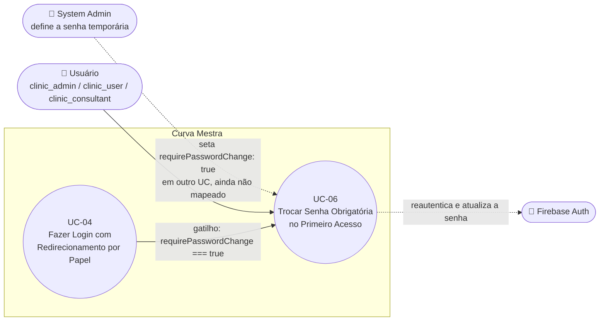

# UC-06: Trocar Senha Obrigatória no Primeiro Acesso

**Projeto:** Curva Mestra
**Data de Criação:** 13/07/2026
**Autor:** Guilherme Scandelari (via uml-use-case-writer)
**Status:** Aprovado
**Módulo/Contexto:** Autenticação
**Versão:** 1.4

> Um usuário (`clinic_admin`, `clinic_user` ou `clinic_consultant`) cuja senha foi definida por um terceiro — um System Admin redefinindo manualmente, ou o próprio sistema ao criar um novo consultor — é obrigado a trocá-la antes de acessar qualquer área do sistema, através da custom claim `requirePasswordChange`.

---

## 1. Diagrama UML (Mermaid)

---

## 2. Atores

### 2.1 Ator Primário
**Usuário** com `role` igual a `clinic_admin`, `clinic_user` ou `clinic_consultant`, cuja custom claim `requirePasswordChange` está `true`. `system_admin` nunca passa por este fluxo (ver RN-06) — o mecanismo equivalente para o próprio System Admin trocar a senha, por vontade própria e a qualquer momento (nunca forçado por claim), é o autoatendimento documentado em UC-38.

### 2.2 Atores Secundários / Sistemas Externos
- **Firebase Auth:** reautenticação (`reauthenticateWithCredential`) e atualização de senha (`updatePassword`), ambas client-side.
- **System Admin** não é ator direto deste UC — é quem origina a pré-condição (`requirePasswordChange: true`) em outro contexto (ver seção 12).

---

## 3. Pré-condições
- Usuário está autenticado (sessão Firebase Auth ativa) — chegou aqui via UC-04 (login) ou já estava autenticado ao acessar `/change-password` diretamente.
- `claims.requirePasswordChange === true`, setada por uma de duas origens confirmadas no código:
  - (a) um System Admin redefiniu manualmente a senha do usuário/consultor via `/api/users/{id}/set-password` ou `/api/consultants/{id}/set-password`, com a opção "Solicitar troca de senha no próximo login" marcada; ou
  - (b) o usuário é um consultor recém-criado (`POST /api/consultants`), que sempre nasce com `requirePasswordChange: true` (ver RN-04).
- O usuário sabe sua senha atual (temporária) — recebida por e-mail em texto plano (caso de consultor recém-criado, RN-04) ou informada manualmente pelo admin fora do sistema (caso de redefinição manual — a rota não envia e-mail, ver RN-05).

---

## 4. Pós-condições

### 4.1 Sucesso (Garantias de Sucesso)
- A senha do usuário no Firebase Auth é atualizada para o novo valor definido.
- A claim `requirePasswordChange` é **removida** dos custom claims do usuário (não apenas setada para `false` — a chave é excluída do objeto via desestruturação).
- O documento do usuário no Firestore (`users/{uid}`) é atualizado: `requirePasswordChange: false`, `passwordChangedAt`, `updated_at`.
- Usuário é redirecionado para o dashboard correspondente ao seu role.

### 4.2 Falha (Garantias Mínimas)
- Nenhuma alteração é feita na senha nem nas claims.
- Usuário permanece na tela `/change-password`, vendo o erro específico.

---

## 5. Gatilho (Trigger)
Login bem-sucedido (UC-04) com `claims.requirePasswordChange === true` — ou acesso direto à URL `/change-password` enquanto autenticado com essa claim.

---

## 6. Fluxo Principal (Basic Flow)

1. Usuário é redirecionado para `/change-password` (a partir de UC-04 — Fluxo de Exceção 8c, ou Fluxo Alternativo 7a de "usuário já autenticado").
2. Sistema verifica `isAuthenticated`; se não autenticado, redireciona para `/login` (ver Fluxo Alternativo 7a).
3. Sistema exibe o formulário "Trocar Senha", com o alerta "Você está usando uma senha temporária. Por segurança, defina uma nova senha." e três campos: "Senha Atual (Temporária)", "Nova Senha", "Confirmar Nova Senha".
4. Usuário preenche os três campos e clica em "Definir Nova Senha".
5. Sistema valida no frontend: nova senha com pelo menos 6 caracteres; nova senha igual à confirmação; nova senha diferente da senha atual.
6. Sistema reautentica o usuário no Firebase Auth usando e-mail + senha atual (`reauthenticateWithCredential` + `EmailAuthProvider.credential`) — necessário porque alterar a senha é uma operação sensível que exige reautenticação recente.
7. Sistema chama `updatePassword(user, newPassword)` do Firebase Auth (client-side), atualizando a senha imediatamente.
8. Sistema obtém um novo ID token do usuário e chama `POST /api/users/clear-password-change-flag` com Bearer token.
9. API remove a propriedade `requirePasswordChange` dos custom claims (via desestruturação — não seta `false`, remove a chave) e atualiza o Firestore (`users/{uid}`: `requirePasswordChange: false`, `passwordChangedAt`, `updated_at`).
10. Sistema redireciona por role: `is_system_admin` → `/admin/dashboard`; `role === "clinic_admin"` ou `"clinic_user"` → `/clinic/dashboard`; qualquer outro role (inclui `clinic_consultant`) → `/dashboard` (mesmo padrão de redirecionamento indireto para consultores já documentado em UC-04, Fluxo Alternativo 7b).
11. Caso de uso é concluído com sucesso.

---

## 7. Fluxos Alternativos

### 7a. Usuário não autenticado acessa /change-password diretamente (a partir do passo 2)
1. Sistema detecta `!isAuthenticated` (após `authLoading` resolver).
2. Sistema redireciona para `/login`.
3. Caso de uso é encerrado.

### 7b. Falha silenciosa ao limpar a flag no backend (a partir do passo 8)
1. `POST /api/users/clear-password-change-flag` retorna erro (`response.ok === false`).
2. Sistema apenas registra `console.error('Erro ao limpar flag de troca de senha')` — **não exibe nenhum erro ao usuário, não interrompe o fluxo**.
3. Sistema prossegue para o passo 10 (redirecionamento por role) normalmente, mesmo que a claim `requirePasswordChange` **não** tenha sido removida no backend.
4. Consequência: no próximo login (UC-04), o usuário seria redirecionado de volta para esta mesma tela, tendo que "trocar" uma senha que, na prática, já é a definitiva — ver seção 14.

---

## 8. Fluxos de Exceção

### 8a. Senha atual incorreta (a partir do passo 6)
1. Firebase Auth retorna `auth/wrong-password` ou `auth/invalid-credential` na reautenticação.
2. Sistema exibe: "Senha atual incorreta".
3. Caso de uso retorna ao passo 4.

### 8b. Nova senha muito fraca (a partir do passo 7)
1. Firebase Auth retorna `auth/weak-password`.
2. Sistema exibe: "A nova senha é muito fraca. Use pelo menos 6 caracteres".
3. Caso de uso retorna ao passo 4.

### 8c. Sessão antiga demais para trocar a senha (a partir do passo 6)
1. Firebase Auth retorna `auth/requires-recent-login` (a reautenticação do passo 6 deveria evitar isso na maioria dos casos, mas pode ocorrer em condições de corrida ou token expirado entre passos).
2. Sistema exibe: "Por segurança, faça login novamente antes de trocar a senha" e redireciona para `/login`.
3. Caso de uso é encerrado; `requirePasswordChange` permanece `true`, então o próximo login volta a cair neste UC.

### 8d. Falha de validação no frontend (a partir do passo 5)
1. Nova senha com menos de 6 caracteres, nova senha diferente da confirmação, ou nova senha igual à senha atual.
2. Sistema exibe a mensagem específica: "A senha deve ter pelo menos 6 caracteres", "As senhas não coincidem", ou "A nova senha deve ser diferente da senha atual".
3. A reautenticação não chega a ser tentada.
4. Caso de uso retorna ao passo 4.

### 8e. Erro genérico não mapeado (a partir dos passos 6-7)
1. Qualquer outro erro do Firebase Auth não coberto por 8a-8c.
2. Sistema exibe: "Erro ao trocar senha. Tente novamente."
3. Caso de uso retorna ao passo 4.

---

## 9. Regras de Negócio Relacionadas

| ID | Regra | Justificativa |
|----|-------|----------------|
| RN-01 | `requirePasswordChange` é uma custom claim booleana opcional; quando `true`, tanto o fluxo de submissão do login quanto o `useEffect` de "usuário já autenticado" em `/login` (UC-04) redirecionam para `/change-password` antes de qualquer outra checagem ou acesso ao sistema. | Garante que o usuário nunca acesse o sistema com uma senha definida por terceiros sem trocá-la primeiro. |
| RN-02 | A validação de força da nova senha nesta tela (função local, mínimo 6 caracteres) é mais simples que a `validatePassword` compartilhada em `serverValidations.ts` (que também exige pelo menos uma letra) — esta tela não usa a função compartilhada, tem sua própria validação inline, mais permissiva. | Divergência confirmada por leitura do código — mesmo padrão de inconsistência de validação já documentado em UC-01 (RN-04 a RN-06). |
| RN-03 | A troca de senha exige reautenticação (`reauthenticateWithCredential`) com a senha atual antes de chamar `updatePassword` — ambas operações client-side via Firebase SDK, sem endpoint de backend dedicado para a troca da senha em si (o backend só é usado para limpar a flag, passo 8-9). | Exigência do próprio Firebase Auth para operações sensíveis (alterar senha) — a sessão precisa estar "recente". |
| RN-04 | Quando um consultor é criado (`POST /api/consultants`), ele nasce com `requirePasswordChange: true` e recebe a senha temporária **em texto plano** por e-mail (fila `email_queue`), gerada por uma função local `generateTempPassword()` — 12 caracteres de um alfabeto sem caracteres ambíguos (sem `0`/`O`/`1`/`l`/`I`). | Mecanismo de onboarding específico para consultores — diferente do mecanismo de aprovação de UC-02 (que usa link de redefinição de senha do Firebase, nunca expõe a senha em texto). |
| RN-05 | Quando um System Admin redefine manualmente a senha de um usuário/consultor existente (`/api/users/{id}/set-password` ou `/api/consultants/{id}/set-password`) com "Solicitar troca de senha no próximo login" marcada, **nenhum e-mail é enviado automaticamente** — a própria tela de origem (`admin/users`/`admin/consultants/[id]`) indica que esse recurso é "para suporte quando o sistema de email falhar". O admin precisa comunicar a nova senha ao usuário por fora do sistema. Alternativamente, o admin pode usar UC-08 (enviar link de redefinição por e-mail), que não define a senha diretamente nem depende de `requirePasswordChange`. | Confirmado por leitura do código (a rota não enfileira e-mail) e do texto de ajuda da própria UI administrativa. |
| RN-06 | `system_admin` nunca passa por este fluxo — a rota `/api/users/{id}/set-password` recusa explicitamente (403) redefinir a senha de um usuário com `role: "system_admin"`. O mecanismo real e equivalente para o próprio System Admin trocar sua senha é o autoatendimento de UC-38 (`admin/profile/page.tsx`) — inteiramente self-service, nunca forçado por uma claim, com um mínimo de senha diferente (8 caracteres) e sem gravar `passwordChangedAt` no Firestore. | Restrição de segurança confirmada no código: administradores globais não têm sua senha redefinida por outro admin através deste mecanismo. |

---

## 10. Requisitos Especiais / Não Funcionais

| ID | Descrição | Categoria |
|----|-----------|-----------|
| RNF-01 | A chamada a `POST /api/users/clear-password-change-flag` falha silenciosamente do ponto de vista do usuário (apenas `console.error`) — ver Fluxo Alternativo 7b e pendência na seção 14. | Confiabilidade |
| RNF-02 | A troca de senha em si (reautenticação + `updatePassword`) é inteiramente client-side via Firebase SDK; apenas a limpeza da flag `requirePasswordChange` passa por um endpoint de backend (Admin SDK, necessário para alterar custom claims). | Segurança |

---

## 11. Frequência de Uso
Ocasional — ocorre a cada vez que um System Admin define/redefine manualmente uma senha com a opção de forçar troca marcada, ou a cada novo consultor criado. Não é uma ação recorrente do dia a dia de um usuário comum.

---

## 12. Casos de Uso Relacionados
- **UC-04 (Fazer Login com Redirecionamento por Papel)** é o gatilho principal deste UC — a checagem de `requirePasswordChange` em UC-04 (Fluxo de Exceção 8c) redireciona para cá.
- **UC-02 (Aprovar Solicitação de Acesso)** usa um mecanismo de definição de senha inicial **diferente** (link de redefinição de senha do Firebase, gerado por `generatePasswordResetLink`) — não aciona este UC-06.
- **UC-08 (System Admin Envia Link de Redefinição de Senha)** é o mecanismo irmão: mesma origem (System Admin, na mesma tela `admin/users`/`admin/consultants`), mas usando um link por e-mail com token customizado em vez de definir a senha diretamente. Os dois convergem apenas no ponto em que UC-08, ao ser concluído pelo usuário-alvo, também remove `requirePasswordChange` se estiver presente (ver UC-08, RN-06).
- **UC-30 (Definir Senha do Consultor Manualmente)** é a variante para consultores de "Definir Senha Manualmente", mapeada formalmente como UC próprio (rota `api/consultants/[id]/set-password`, mesma tela de UC-29) — uma das duas origens confirmadas da pré-condição deste UC-06 para consultores.
- **UC-37 (Definir Senha do Usuário Manualmente)** é a variante equivalente para usuários (`clinic_admin`/`clinic_user`, rota `api/users/[id]/set-password`, mesma tela de UC-36) — agora também mapeada formalmente, fechando a lacuna citada na v1.2 deste documento.
- **UC-28 (Cadastrar Consultor)** é a outra origem confirmada da pré-condição deste UC-06 (consultor recém-criado nasce com `requirePasswordChange: true`, RN-04).
- **UC-38 (Editar Perfil e Trocar Senha do System Admin)** é o mecanismo equivalente de autoatendimento, exclusivo para `system_admin` — o único role que nunca passa por este UC-06 (RN-06).

---

## 13. Referências
- `src/app/(auth)/change-password/page.tsx`
- `src/app/api/users/clear-password-change-flag/route.ts`
- `src/app/api/users/[id]/set-password/route.ts`
- `src/app/api/consultants/[id]/set-password/route.ts`
- `src/app/api/consultants/route.ts` (criação de consultor — origem alternativa de `requirePasswordChange: true`)
- `src/app/(admin)/admin/users/page.tsx` (UI que aciona `/api/users/{id}/set-password`)
- `src/types/index.ts` (`CustomClaims.requirePasswordChange`, `User.requirePasswordChange`)

---

## 14. Perguntas em Aberto / Decisões Pendentes

1. **[Confirmado, sem correção proposta]** A falha ao chamar `/api/users/clear-password-change-flag` (Fluxo Alternativo 7b) é silenciosa — o usuário troca a senha com sucesso no Firebase Auth, mas se essa chamada falhar, `requirePasswordChange` permanece `true` no backend, e ele será redirecionado de volta para esta mesma tela no próximo login, precisando "trocar" uma senha que, na prática, já é a definitiva (nesse segundo ciclo, "senha atual" e "nova senha" seriam iguais, o que é bloqueado pelo Fluxo de Exceção 8d — criando um impasse). Não confirmado pelo usuário se isso deve ser corrigido (ex.: exibir erro e impedir o redirecionamento se a chamada falhar).

2. **[Nota, não bloqueante]** Este UC documenta apenas os dois gatilhos confirmados por código (redefinição manual pelo admin; criação de consultor). A busca feita nesta sessão (grep por `requirePasswordChange` em todo `src/`) não encontrou mais nenhum ponto do sistema que sete essa claim.

3. **[Resolvido em v1.1]** O "mecanismo totalmente separado de redefinição de senha por token customizado", mencionado na v1.0 apenas para não confundir, foi investigado e mapeado como dois UCs distintos: **UC-07 (Recuperar Senha Esquecida)** — self-service, usa `sendPasswordResetEmail` nativo do Firebase, não tem nenhuma relação com `requirePasswordChange` nem com o token customizado — e **UC-08 (System Admin Envia Link de Redefinição de Senha)** — mecanismo de token customizado (`password_reset_tokens`), acionado pelo System Admin, que converge com este UC-06 apenas no ponto de também limpar `requirePasswordChange` ao ser concluído (UC-08, RN-06).

4. **[Resolvido em v1.3]** A variante de "Definir Senha Manualmente" para consultores foi mapeada como UC-30, e a variante equivalente para usuários (`clinic_admin`/`clinic_user`, rota `api/users/[id]/set-password`) foi mapeada como UC-37, no módulo "Admin — Gestão de Usuários".

5. **[Resolvido em v1.4]** O mecanismo equivalente de autoatendimento, exclusivo para `system_admin` (o único role que nunca passa por este UC-06), foi mapeado como UC-38.

---

## 15. Histórico de Versões

| Versão | Data | Autor | O que mudou |
|--------|------|-------|--------------|
| 1.0 | 13/07/2026 | Guilherme Scandelari | Versão inicial, mapeada a partir da leitura direta de `change-password/page.tsx`, `clear-password-change-flag/route.ts`, `users/[id]/set-password/route.ts`, `consultants/[id]/set-password/route.ts` e `consultants/route.ts` (origem do `requirePasswordChange` para consultores recém-criados). |
| 1.1 | 13/07/2026 | Guilherme Scandelari | Adicionada referência cruzada a UC-08 (System Admin Envia Link de Redefinição de Senha), mapeado nesta sessão como o mecanismo irmão de "Definir Senha Manualmente" — ambos acionados pelo System Admin na mesma tela, um definindo a senha diretamente (este UC), outro enviando um link por e-mail com token próprio (UC-08). Atualizada a pendência 3 da seção 14 de "fora do escopo" para "resolvido" (UC-07 e UC-08 já mapeados), e RN-05 ganhou uma nota mencionando UC-08 como alternativa. |
| 1.2 | 14/07/2026 | Guilherme Scandelari | Seção 12 atualizada: a bullet que citava "'Definir Senha Manualmente' (System Admin)" como UC ainda não mapeado formalmente foi substituída pela referência ao UC-30 (Definir Senha do Consultor Manualmente), recém-mapeado para a variante de consultores. Adicionada nota explícita de que a variante equivalente para usuários (`clinic_admin`/`clinic_user`) permanece sem UC formal. Adicionada referência a UC-28 como a outra origem confirmada da pré-condição deste UC. Nova pendência (item 4) registrada na seção 14 refletindo esse mapeamento parcial. |
| 1.3 | 15/07/2026 | Guilherme Scandelari | Seção 12 atualizada com a referência ao UC-37 (Definir Senha do Usuário Manualmente), recém-mapeado para a variante de usuários (`clinic_admin`/`clinic_user`) — fecha a pendência 4 registrada em v1.2. |
| 1.4 | 15/07/2026 | Guilherme Scandelari | Adicionada referência cruzada a UC-38 (Editar Perfil e Trocar Senha do System Admin), recém-mapeado — mecanismo equivalente de autoatendimento para o único role que nunca passa por este UC-06 (RN-06 atualizada, seção 2.1 e seção 12 atualizadas, pendência 5 registrada como resolvida). |
