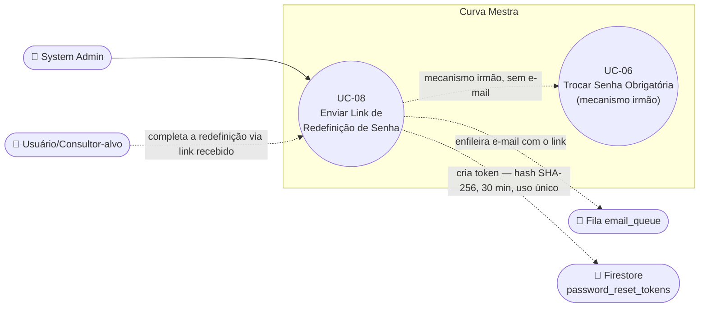

# UC-08: System Admin Envia Link de Redefinição de Senha

**Projeto:** Curva Mestra
**Data de Criação:** 13/07/2026
**Autor:** Guilherme Scandelari (via uml-use-case-writer)
**Status:** Aprovado
**Módulo/Contexto:** Administração do Sistema
**Versão:** 1.2

> Um System Admin, a partir da tela de gestão de usuários ou de consultores, aciona o envio de um e-mail com um link seguro de redefinição de senha para outra pessoa — usando um sistema de token **customizado e próprio do Curva Mestra** (não o mecanismo nativo do Firebase usado em UC-02/UC-07), com expiração de 30 minutos e uso único. É a terceira forma que um System Admin tem de ajudar alguém a recuperar acesso, ao lado de "Definir Senha Manualmente" (UC-06, sem e-mail, senha definida imediatamente).

---

## 1. Diagrama UML (Mermaid)

---

## 2. Atores

### 2.1 Ator Primário
**System Admin** (`is_system_admin === true`) — inicia o envio do link de redefinição para um usuário (`clinic_admin`/`clinic_user`) ou consultor (`clinic_consultant`).

### 2.2 Atores Secundários / Sistemas Externos
- **Usuário/Consultor-alvo** — recebe o e-mail e completa a redefinição de senha através do link, de forma self-service (essa segunda metade do fluxo é uma ação própria do alvo, não do System Admin).
- **Fila `email_queue`** — recebe o e-mail com o link de redefinição, para envio assíncrono.

---

## 3. Pré-condições
- System Admin autenticado, `is_system_admin === true`.
- Existe um usuário (`users/{uid}`, com `role !== "system_admin"` — ver RN-05) ou um consultor (com `user_id` vinculado a uma conta no Firebase Auth) cujo e-mail é conhecido.
- O usuário/consultor-alvo tem acesso ao próprio e-mail para completar o fluxo.

---

## 4. Pós-condições

### 4.1 Sucesso — Parte 1: System Admin aciona o envio
- Um documento é criado em `password_reset_tokens` (hash SHA-256 do token, `user_id`, `user_email`, `tenant_id` opcional, `expires_at` = agora + 30 minutos, `created_by` = uid do admin).
- Qualquer token pendente anterior do mesmo usuário é invalidado (`invalidated_at`).
- Um e-mail é enfileirado em `email_queue` (`type: "password_reset"`) contendo o link para `/reset-password/{token}`.
- O documento do usuário/consultor-alvo registra `passwordResetRequestedAt`/`passwordResetRequestedBy` (auditoria da solicitação mais recente).

### 4.1 Sucesso — Parte 2: Usuário-alvo completa a redefinição (eventual, self-service)
- A senha é atualizada no Firebase Auth via Admin SDK (`adminAuth.updateUser`).
- Se o usuário-alvo tivesse `requirePasswordChange: true` (UC-06), essa claim é removida (RN-06).
- O token é marcado como usado (`used_at`); quaisquer outros tokens pendentes do mesmo usuário são invalidados novamente.

### 4.2 Falha (Garantias Mínimas)
- Se o admin falhar em acionar o envio (usuário não encontrado, sem e-mail cadastrado, etc.): nenhum token/e-mail é criado.
- Se o usuário-alvo falhar em completar (token inválido/expirado/já usado): a senha permanece inalterada.

---

## 5. Gatilho (Trigger)
O System Admin clica no botão de redefinir senha na tela de edição de um usuário (`/admin/users`) ou de um consultor (`/admin/consultants/{id}`), e confirma o diálogo de confirmação.

---

## 6. Fluxo Principal (Basic Flow)

1. System Admin acessa a tela de edição de um usuário (`/admin/users`) ou de um consultor (`/admin/consultants/{id}`).
2. Admin clica no botão de redefinir senha (distinto do botão "Definir Senha Manualmente" de UC-06).
3. Sistema exibe um `confirm()` nativo do navegador: "Tem certeza que deseja redefinir a senha de {email}? Um email será enviado com um link seguro para o usuário definir uma nova senha."
4. Admin confirma.
5. Sistema chama `POST /api/users/{id}/reset-password` (ou `/api/consultants/{id}/reset-password`) com Bearer token do admin.
6. API verifica `is_system_admin`; para usuários (não consultores), verifica também que o alvo não é `system_admin` (RN-05).
7. API busca o usuário/consultor-alvo no Firestore e no Firebase Auth, obtendo o e-mail.
8. API invalida quaisquer tokens pendentes anteriores do mesmo `user_id` (`invalidateUserTokens`).
9. API gera um novo token (`crypto.randomBytes(32)`, 64 caracteres hex), calcula seu hash SHA-256, e cria um documento em `password_reset_tokens` com `expires_at` = agora + 30 minutos.
10. API monta o link (`{baseUrl}/reset-password/{token}`) e o e-mail HTML (template próprio, mencionando expiração de 30 minutos e uso único) e adiciona um documento à fila `email_queue` (`type: "password_reset"`).
11. API registra `passwordResetRequestedAt`/`passwordResetRequestedBy` no documento do usuário/consultor-alvo, para auditoria.
12. API retorna sucesso; sistema exibe confirmação com o e-mail para o qual foi enviado.
13. **(Continuação, pelo usuário-alvo)** Usuário-alvo recebe o e-mail e clica no link, chegando a `/reset-password/{token}`.
14. Sistema chama `GET /api/auth/validate-reset-token?token={token}` para validar o token sem consumi-lo, exibindo o e-mail mascarado (ex.: `j***o@dominio.com`) se válido.
15. Usuário-alvo preenche nova senha e confirmação (mínimo 6 caracteres) e submete.
16. Sistema chama `POST /api/auth/reset-password` com `{ token, new_password }`.
17. API consome o token (`consumeToken` — revalida e marca `used_at`), atualiza a senha no Firebase Auth via Admin SDK, remove `requirePasswordChange` das claims se presente (RN-06), atualiza o Firestore do usuário e invalida quaisquer outros tokens pendentes.
18. Sistema exibe "Senha Redefinida!" e redireciona para `/login` após 3 segundos.
19. Caso de uso é concluído com sucesso.

---

## 7. Fluxos Alternativos

### 7a. Admin cancela o confirm() nativo (a partir do passo 3)
1. Admin clica em "Cancelar" no diálogo nativo do navegador.
2. Nenhuma chamada é feita à API.
3. Caso de uso é encerrado sem efeito.

### 7b. Usuário-alvo acessa o link após já tê-lo usado (a partir do passo 13)
1. `validate-reset-token` detecta `used_at` preenchido.
2. Sistema exibe a tela "Link Inválido" com a mensagem "Este link já foi utilizado. Solicite um novo reset de senha." e orientação para contatar o administrador.
3. Caso de uso é encerrado sem efeito.

---

## 8. Fluxos de Exceção

### 8a. Alvo é system_admin (a partir do passo 6 — apenas em `/api/users/{id}/reset-password`)
1. API detecta `userData.role === "system_admin"`.
2. Retorna 403: "Não é permitido redefinir senha de administradores do sistema".
3. Sistema (`admin/users`) exibe um `alert()` com o erro.
4. Caso de uso é encerrado sem efeito.

### 8b. Usuário/consultor não encontrado (a partir do passo 7)
1. API não encontra o documento no Firestore, ou o usuário não existe no Firebase Auth (`auth/user-not-found`).
2. Retorna 404 com mensagem específica.
3. Sistema exibe um `alert()` com o erro.

### 8c. Consultor sem usuário de autenticação vinculado (a partir do passo 7 — apenas em `/api/consultants/{id}/reset-password`)
1. `consultantData.user_id` ausente.
2. Retorna 400: "Consultor não possui usuário de autenticação vinculado".

### 8d. Token expirado (a partir do passo 14 ou 16)
1. `expires_at` já passou (mais de 30 minutos desde a criação).
2. `validate-reset-token` ou `reset-password` retorna erro: "Este link expirou. Solicite um novo reset de senha."
3. Sistema exibe a tela "Link Inválido" (se detectado no passo 14) ou o erro no formulário (se detectado no passo 16 — condição de corrida, expira entre a validação e a submissão).
4. Caso de uso é encerrado; o admin precisaria gerar um novo link (voltando ao passo 2).

### 8e. Token inválido/inexistente (a partir do passo 14 ou 16)
1. O hash do token informado não corresponde a nenhum documento em `password_reset_tokens`.
2. Retorna: "Token inválido ou expirado".
3. Mesmo tratamento de 8d.

### 8f. Nova senha inválida (a partir do passo 15)
1. Menos de 6 caracteres, ou confirmação diferente da senha.
2. Sistema exibe o erro específico no próprio formulário: "A senha deve ter pelo menos 6 caracteres" / "As senhas não coincidem".
3. Caso de uso retorna ao passo 15.

---

## 9. Regras de Negócio Relacionadas

| ID | Regra | Justificativa |
|----|-------|----------------|
| RN-01 | O token é gerado com `crypto.randomBytes(32)` (256 bits de entropia, 64 caracteres hex) e armazenado apenas como hash SHA-256 no Firestore — o token bruto nunca é persistido, só existe no e-mail enviado e na URL acessada pelo usuário. | Boa prática de segurança — mesmo que o Firestore seja comprometido, os tokens brutos não são recuperáveis. |
| RN-02 | O token expira em exatamente 30 minutos após a criação e só pode ser usado uma única vez (`used_at`); criar um novo token para o mesmo usuário invalida automaticamente qualquer token anterior ainda pendente. | Reduz a janela de exposição de um link de redefinição de senha e evita múltiplos links simultâneos válidos para a mesma conta. |
| RN-03 | A coleção `password_reset_tokens` tem a regra de segurança do Firestore `allow read, write: if false` — só pode ser acessada via Admin SDK (server-side, API routes), nunca diretamente pelo cliente. | Confirmado em `firestore.rules` — os tokens nunca trafegam por consultas client-side. |
| RN-04 | Não há rate-limiting implementado neste mecanismo além da restrição de que só um `system_admin` pode acioná-lo — diferente de UC-07 (self-service), que depende inteiramente do rate-limiting nativo do Firebase Auth. | Confirmado por leitura completa das duas rotas (`/api/users/{id}/reset-password`, `/api/consultants/{id}/reset-password`) — nenhuma lógica de cooldown ou limite de tentativas foi encontrada. |
| RN-05 | Não é permitido redefinir a senha de um usuário com `role: "system_admin"` através deste mecanismo (`/api/users/{id}/reset-password`) — a rota equivalente de consultores não tem essa restrição, pois consultores nunca têm `role: "system_admin"`. | Restrição de segurança confirmada no código: administradores globais não são alvo deste fluxo. |
| RN-06 | Ao completar a redefinição (`POST /api/auth/reset-password`), se o usuário-alvo tivesse `requirePasswordChange: true` (UC-06), essa claim é removida — ou seja, este mecanismo também "quita" uma pendência de troca obrigatória de senha, mesmo tendo sido originado por um caminho diferente. | Confirmado por leitura de `api/auth/reset-password/route.ts` — os dois mecanismos (UC-06 e UC-08) convergem nesse ponto específico. |
| RN-07 | Este mecanismo é genuinamente diferente do link usado em UC-02 (aprovação) e de UC-07 (self-service) — ambos usam o sistema nativo do Firebase Auth (`generatePasswordResetLink`/`sendPasswordResetEmail`); este usa um sistema de token 100% customizado, construído neste projeto, com página própria (`/reset-password/[token]`) e API routes próprias. | Confirmado por leitura completa de `passwordResetService.ts` — a senha é alterada via `adminAuth.updateUser`, uma operação diferente de `generatePasswordResetLink`; nenhuma chamada ao sistema nativo de reset do Firebase existe neste mecanismo. |

---

## 10. Requisitos Especiais / Não Funcionais

| ID | Descrição | Categoria |
|----|-----------|-----------|
| RNF-01 | O e-mail mascarado (ex.: `j***o@dominio.com`) é exibido em `/reset-password/{token}` antes da senha ser definida, para o usuário confirmar que o link é destinado a ele, sem expor o e-mail completo a quem eventualmente interceptasse a URL. | Segurança / Usabilidade |
| RNF-02 | O diálogo de confirmação do admin (passo 3) usa `confirm()` nativo do navegador, não um componente de UI próprio (Dialog) como o restante do sistema. | Consistência de UI |
| RNF-03 | Auditoria: `passwordResetRequestedAt`/`passwordResetRequestedBy` são gravados no documento do usuário/consultor-alvo a cada solicitação — mas não há um histórico completo de todas as solicitações (o campo é sobrescrito a cada nova solicitação, mantendo só a mais recente). | Auditoria |

---

## 11. Frequência de Uso
Ocasional — usado pelo System Admin como alternativa a "Definir Senha Manualmente" (UC-06) quando o sistema de e-mail está funcionando normalmente.

---

## 12. Casos de Uso Relacionados
- **UC-06 (Trocar Senha Obrigatória no Primeiro Acesso)** documenta o mecanismo irmão "Definir Senha Manualmente" (sem e-mail, senha definida imediatamente, com `requirePasswordChange` opcional) — as duas ações ficam lado a lado na mesma tela `admin/users`, como duas formas distintas de o System Admin ajudar alguém com a senha. Convergem em RN-06 (ambas limpam `requirePasswordChange`, quando aplicável).
- **UC-02 (Aprovar Solicitação de Acesso)** e **UC-07 (Recuperar Senha Esquecida)** usam o mecanismo nativo do Firebase Auth para redefinição de senha — genuinamente diferente do token customizado deste UC (RN-07).
- **UC-29 (Editar, Suspender e Reativar Consultor)** documenta a mesma tela onde a variante para consultores deste mecanismo vive (`admin/consultants/[id]/page.tsx`, seção "Gerenciamento de Senha" → "Redefinir Senha"). A funcionalidade "Redefinir Senha via Link" dessa tela é integralmente coberta por este UC-08 (rota `api/consultants/[id]/reset-password`, passos 1-19 acima) — por decisão confirmada, não recebeu um UC dedicado (UC-30), para evitar duplicar este conteúdo.
- **UC-30 (Definir Senha do Consultor Manualmente)** — mecanismo irmão específico de consultores, na mesma tela de UC-29, equivalente ao papel que UC-06 exerce para usuários (`clinic_admin`/`clinic_user`).
- **UC-36 (Editar Usuário e Alterar Status Cross-Tenant)** documenta a mesma tela onde a variante para usuários deste mecanismo vive (`admin/users/page.tsx`, diálogo "Editar Usuário", seção "Redefinir Senha"). A funcionalidade "Redefinir Senha via Link" dessa tela é integralmente coberta por este UC-08 (rota `api/users/{id}/reset-password`, já citada desde a v1.0 deste documento) — mesma decisão de não duplicar conteúdo já aplicada a UC-29.
- **UC-37 (Definir Senha do Usuário Manualmente)** — mecanismo irmão específico de usuários, na mesma tela de UC-36, equivalente ao papel que UC-30 exerce para consultores.

---

## 13. Referências
- `src/app/(admin)/admin/users/page.tsx` (`handleResetPassword`)
- `src/app/(admin)/admin/consultants/[id]/page.tsx` (equivalente para consultores)
- `src/app/api/users/[id]/reset-password/route.ts`
- `src/app/api/consultants/[id]/reset-password/route.ts`
- `src/app/api/auth/validate-reset-token/route.ts`
- `src/app/api/auth/reset-password/route.ts`
- `src/lib/services/passwordResetService.ts`
- `src/app/(auth)/reset-password/[token]/page.tsx`
- `firestore.rules` (regra de `password_reset_tokens`)

---

## 14. Perguntas em Aberto / Decisões Pendentes

1. **[Observação, sem correção proposta]** Não há histórico auditável de múltiplas solicitações de reset — apenas a mais recente é registrada (RNF-03).
2. **[Observação]** O uso de `confirm()` nativo do navegador (RNF-02) é uma inconsistência de UI menor frente ao padrão `Dialog` do restante do sistema.

Nenhuma pendência bloqueante identificada — ao contrário de UC-05, este mecanismo parece coerente, funcional e ativamente utilizável hoje.

---

## 15. Histórico de Versões

| Versão | Data | Autor | O que mudou |
|--------|------|-------|--------------|
| 1.0 | 13/07/2026 | Guilherme Scandelari | Versão inicial. Documenta o mecanismo de token customizado completo (geração, expiração, consumo) acionado pelo System Admin via `admin/users` e `admin/consultants/[id]`, incluindo a segunda metade do fluxo (usuário-alvo completando a redefinição via `/reset-password/[token]`). Confirmado, por leitura completa de `passwordResetService.ts` e `firestore.rules`, que este mecanismo é genuinamente diferente do link nativo do Firebase usado em UC-02 e UC-07 (RN-07), e que converge com UC-06 apenas no ponto de limpar `requirePasswordChange` (RN-06). |
| 1.1 | 14/07/2026 | Guilherme Scandelari | Seção 12 atualizada com referências cruzadas ao módulo "Admin — Gestão de Consultores": adicionada menção a UC-29 (mesma tela `admin/consultants/[id]`, confirmando que este UC-08 já cobre integralmente a funcionalidade "Redefinir Senha via Link" da variante de consultores, sem necessidade de UC-30 dedicado) e a UC-30 (mecanismo irmão de definição manual de senha, específico de consultores). |
| 1.2 | 15/07/2026 | Guilherme Scandelari | Seção 12 atualizada com referências cruzadas ao módulo "Admin — Gestão de Usuários": adicionada menção a UC-36 (mesma tela `admin/users`, confirmando que este UC-08 já cobre integralmente a funcionalidade "Redefinir Senha via Link" da variante de usuários, rota `api/users/{id}/reset-password`, sem necessidade de UC dedicado) e a UC-37 (mecanismo irmão de definição manual de senha, específico de usuários). |
