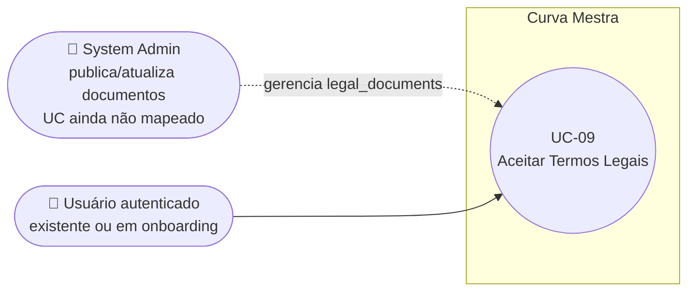

# UC-09: Aceitar Termos Legais

**Projeto:** Curva Mestra
**Data de Criação:** 13/07/2026
**Autor:** Guilherme Scandelari (via uml-use-case-writer)
**Status:** Aprovado
**Módulo/Contexto:** Autenticação
**Versão:** 1.0

> Um usuário autenticado — seja um usuário existente notificado de um novo termo obrigatório publicado (`/accept-terms`), seja um usuário em onboarding de uma nova clínica aceitando termos pela primeira vez (`/clinic/setup/terms`) — deve aceitar todos os documentos legais ativos e obrigatórios antes de continuar usando o sistema. Um componente global (`TermsInterceptor`) decide, em toda navegação, se há termos pendentes e redireciona automaticamente para a variante correta.

---

## 1. Diagrama UML (Mermaid)

---

## 2. Atores

### 2.1 Ator Primário
**Usuário autenticado** (qualquer role) com pelo menos um documento legal ativo e obrigatório ainda não aceito, ou aceito em uma versão desatualizada.

### 2.2 Atores Secundários / Sistemas Externos
**System Admin** — publica/atualiza documentos na coleção `legal_documents` através de `admin/legal-documents/*` (candidato a UC próprio — "Gerenciar Documentos Legais" — ainda não mapeado formalmente nesta documentação).

---

## 3. Pré-condições
- Usuário autenticado (claims carregadas).
- Existe pelo menos um documento em `legal_documents` com `status: "ativo"` e (`required_for_registration === true` **ou** `required_for_existing_users === true`).
- O usuário não possui, em `user_document_acceptances`, um registro para esse `document_id` com `document_version` igual à versão atual do documento (ver RN-01 — este é o critério *correto*, usado pelo mecanismo que decide redirecionar; as próprias telas de aceite usam um critério diferente, ver RN-02).

---

## 4. Pós-condições

### 4.1 Sucesso (Garantias de Sucesso)
- Para cada documento aceito, um novo documento é criado em `user_document_acceptances` (`user_id`, `document_id`, `document_version`, `accepted_at`, `ip_address: null`, `user_agent`).
- Usuário é redirecionado: para `/` (Variante A — usuário existente) ou para `/clinic/setup` (Variante B — onboarding).

### 4.2 Falha (Garantias Mínimas)
- Nenhum registro de aceite é criado.
- Usuário permanece na tela de aceite, vendo o erro ou o aviso específico.

---

## 5. Gatilho (Trigger)
O `TermsInterceptor` (componente global, montado em `ClientProviders`) detecta, em qualquer navegação autenticada, que `usePendingTerms()` retorna `hasPendingTerms === true`, e redireciona automaticamente:
- para `/clinic/setup/terms`, se o role é `clinic_admin`/`clinic_user` **e** o caminho atual já começa com `/clinic/setup` (Variante B — onboarding);
- para `/accept-terms` em qualquer outro caso (Variante A — usuário existente).

---

## 6. Fluxo Principal (Basic Flow)

### Variante A — Usuário existente (`/accept-terms`)
1. `TermsInterceptor` detecta `hasPendingTerms` e redireciona para `/accept-terms`.
2. Página verifica `auth.currentUser`; se ausente, redireciona para `/login`.
3. Página consulta `legal_documents` (`status: "ativo"`, `required_for_existing_users: true`, ordenado por `order`).
4. Página consulta `user_document_acceptances` do usuário e monta um `Set` dos `document_id` já aceitos, **de qualquer versão** (ver RN-02 — divergência confirmada em relação ao critério do passo 1).
5. Página filtra `pendingDocs` = documentos cujo `id` não está nesse `Set`.
6. Se `pendingDocs` estiver vazio, a página redireciona para `/` (ver Fluxo de Exceção 8a para o cenário em que isso diverge do que o `TermsInterceptor` calculou).
7. Página exibe cada documento (título, versão, conteúdo completo em Markdown, com scroll) e um checkbox "Li e aceito {título}".
8. Usuário marca os checkboxes de todos os documentos.
9. Usuário clica em "Aceitar Todos os Documentos" (habilitado somente quando todos os checkboxes estão marcados).
10. Sistema cria, em paralelo, um documento em `user_document_acceptances` para cada documento pendente exibido (`user_id`, `document_id`, `document_version` = versão do documento no momento, `accepted_at`, `ip_address: null`, `user_agent: navigator.userAgent`).
11. Sistema exibe um toast de sucesso e redireciona para `/`.
12. Caso de uso é concluído com sucesso.

### Variante B — Onboarding de nova clínica (`/clinic/setup/terms`)
1. `TermsInterceptor` detecta `hasPendingTerms` e, como o role é `clinic_admin`/`clinic_user` e o caminho já começa com `/clinic/setup`, redireciona para `/clinic/setup/terms`.
2. Página aguarda `useAuth()` resolver o usuário.
3. Página consulta `legal_documents` (`status: "ativo"`, `required_for_registration: true`, ordenado por `order`).
4. Página consulta `user_document_acceptances` e monta o mesmo tipo de `Set` (qualquer versão — mesma divergência da Variante A, RN-02).
5. Página filtra `pendingDocs`.
6. Se `pendingDocs` estiver vazio, a página redireciona para `/clinic/setup` (não `/`, diferença em relação à Variante A).
7. Página exibe cada documento com um preview truncado (500 caracteres, com "...") e um botão "Ler {título} Completo" que abre um Dialog com o conteúdo integral rolável, além do checkbox "Li e concordo com {título}".
8. Usuário marca os checkboxes de todos os documentos — **não é obrigatório** abrir o Dialog de leitura completa antes de marcar (ver RN-06).
9. Usuário clica em "Aceitar e Continuar".
10. Sistema cria os registros de aceite (mesma lógica do passo 10 da Variante A).
11. Sistema exibe um toast de sucesso e redireciona para `/clinic/setup`.
12. Caso de uso é concluído com sucesso.

---

## 7. Fluxos Alternativos

### 7a. Usuário sem termos pendentes navega para qualquer rota (a partir do Gatilho)
1. `usePendingTerms` calcula `hasPendingTerms = false`.
2. `TermsInterceptor` não faz nada; a navegação prossegue normalmente.
3. Caso de uso não se inicia.

---

## 8. Fluxos de Exceção

### 8a. [Bug confirmado] Loop de redirecionamento por divergência de critério de versão (a partir do passo 4 de qualquer variante)
1. `usePendingTerms` (que alimenta o `TermsInterceptor`) considera um documento pendente comparando **versão**: `acceptedVersion !== doc.version`.
2. As páginas `/accept-terms` e `/clinic/setup/terms`, ao carregar, usam um critério **diferente e mais simples**: apenas verificam se existe **qualquer** registro de aceite para aquele `document_id`, independentemente da versão aceita (`acceptedDocs.has(doc.id)`).
3. Cenário confirmado: um System Admin edita um documento "ativo" já aceito por um usuário (`LegalDocumentForm`, modo "edit", usa `updateDoc` sobre o **mesmo ID** do Firestore e permite alterar o campo `version` livremente, sem nenhum versionamento automático), mantendo `required_for_existing_users: true`. O usuário já possui um registro de aceite para aquele `document_id` (da versão antiga).
4. `TermsInterceptor` detecta a pendência (versão divergente) e redireciona para `/accept-terms`.
5. `/accept-terms` carrega, encontra o `document_id` já presente no seu `Set` de aceites (independente da versão) e considera `pendingDocs` vazio.
6. A página redireciona para `/` — o `TermsInterceptor` roda novamente, ainda detecta a mesma pendência (a versão continua divergente) e redireciona de volta para `/accept-terms`.
7. **Resultado: loop de redirecionamento entre `/` e `/accept-terms`**, sem nunca exibir o documento atualizado para reaceite. Não foi confirmado se isso já foi observado em produção, mas a lógica do código garante que ocorreria sempre que um documento "ativo" já aceito tiver sua versão alterada.

### 8b. [Bug confirmado] Divergência de filtro `required_for_registration` vs. `required_for_existing_users` (a partir do passo 3 de qualquer variante)
1. `usePendingTerms` considera um documento pendente se `required_for_registration` **ou** `required_for_existing_users` for `true`.
2. `/accept-terms` só busca documentos com `required_for_existing_users == true`; `/clinic/setup/terms` só busca documentos com `required_for_registration == true`.
3. Cenário confirmado: um documento com `required_for_registration: true` e `required_for_existing_users: false`, pendente para um `clinic_admin` que já passou do onboarding e está fora do caminho `/clinic/setup` — o `TermsInterceptor` o envia para `/accept-terms` (regra padrão), mas essa página nunca vai listar esse documento, pois sua query exige `required_for_existing_users == true`.
4. `pendingDocs` fica vazio mesmo com o documento genuinamente pendente — mesmo resultado de loop do Fluxo 8a.

### 8c. Nem todos os documentos marcados (a partir do passo 9 de qualquer variante)
1. Usuário tenta confirmar sem marcar todos os checkboxes (o botão fica desabilitado nesse caso, mas o handler também revalida).
2. Sistema exibe toast: "Atenção" / "Você precisa aceitar todos os documentos para continuar".
3. Nenhum registro é criado; caso de uso retorna à marcação dos checkboxes.

### 8d. Usuário não autenticado (a partir do passo 2 da Variante A, ou implicitamente na Variante B)
1. `auth.currentUser` (Variante A) ou `user` de `useAuth()` (Variante B) está ausente.
2. A Variante A redireciona explicitamente para `/login`. A Variante B simplesmente não carrega nada (`loadDocuments` só roda se `user` existir) — **a tela ficaria "carregando" indefinidamente**, sem nenhum redirecionamento explícito para usuário deslogado (ver seção 14).
3. Caso de uso é encerrado (Variante A) ou fica bloqueado indefinidamente (Variante B).

### 8e. Erro ao carregar documentos ou salvar aceites
1. Exceção lançada durante a leitura (`getDocs`) ou a gravação (`addDoc`) no Firestore.
2. Sistema exibe um toast destructive com a mensagem crua do Firestore (`error.message`), sem tradução — ver RNF-03.
3. Caso de uso retorna à etapa anterior (carregamento) ou permanece no formulário (gravação).

---

## 9. Regras de Negócio Relacionadas

| ID | Regra | Justificativa |
|----|-------|----------------|
| RN-01 | Um documento legal é considerado "pendente" para um usuário quando não existe nenhum registro em `user_document_acceptances` com `document_id` igual ao dele **e** `document_version` igual à versão atual do documento — segundo o cálculo correto usado por `usePendingTerms`/`TermsInterceptor`. | Permite forçar o reaceite quando o conteúdo de um termo é revisado (nova versão), não apenas na primeira vez. |
| RN-02 | **[Bug confirmado]** As duas páginas de aceite (`/accept-terms`, `/clinic/setup/terms`) usam um critério mais simples e incorreto: qualquer aceite pré-existente para o mesmo `document_id` (independente da versão) já é suficiente para considerar o documento "não pendente". Isso diverge do critério de RN-01 e gera um loop de redirecionamento confirmado (Fluxo de Exceção 8a). | Bug confirmado por leitura e comparação direta de `usePendingTerms.ts`, `accept-terms/page.tsx` e `clinic/setup/terms/page.tsx` — não corrigido nesta rodada, apenas documentado. |
| RN-03 | **[Bug confirmado]** `usePendingTerms` considera um documento pendente se `required_for_registration` **ou** `required_for_existing_users` for `true`; já `/accept-terms` filtra apenas por `required_for_existing_users` e `/clinic/setup/terms` filtra apenas por `required_for_registration`. Um documento pendente por um critério, mas buscado pela página "errada" para o contexto do usuário, nunca aparece na lista. | Bug confirmado por comparação direta das três queries — mesmo efeito de loop do RN-02 (Fluxo de Exceção 8b); não corrigido nesta rodada. |
| RN-04 | O aceite é tudo-ou-nada por tela: o botão de confirmação só é habilitado quando todos os documentos pendentes exibidos estão marcados; não é possível aceitar parcialmente. | Confirmado pelo `disabled={... || !documents.every((doc) => acceptances[doc.id])}`, presente em ambas as páginas. |
| RN-05 | Registros em `user_document_acceptances` são imutáveis por regra do Firestore (`allow update, delete: if false`) — cada aceite é permanente; um novo aceite (nova versão) sempre cria um novo documento, nunca sobrescreve o anterior. | Confirmado em `firestore.rules` — trilha de auditoria legal (rastreabilidade de quem aceitou qual versão e quando). |
| RN-06 | A Variante B exige clicar em "Ler {título} Completo" para ver o documento por inteiro (o conteúdo inline é truncado em 500 caracteres), mas não impede marcar o checkbox e aceitar sem nunca ter aberto esse Dialog — não há nenhuma trava técnica que force a leitura completa. A Variante A já exibe o conteúdo completo inline (com scroll, sem truncamento). | Confirmado por leitura de ambos os componentes — diferença real de UX entre as duas variantes, sem exigência técnica de leitura integral em nenhuma delas. |
| RN-07 | O campo `ip_address` é sempre gravado como `null` nos dois pontos de entrada (comentário no próprio código: "Pode ser capturado via API") — o endereço IP de quem aceitou nunca é registrado, apesar do campo existir no schema. | Confirmado por leitura direta — campo presente mas nunca preenchido, em ambas as páginas. |

---

## 10. Requisitos Especiais / Não Funcionais

| ID | Descrição | Categoria |
|----|-----------|-----------|
| RNF-01 | `TermsInterceptor` é montado globalmente (`ClientProviders`) e roda a cada mudança de `pathname`/usuário/claims — toda navegação autenticada passa por essa checagem, exceto as rotas em `PUBLIC_ROUTES` (`/login`, `/register`, `/accept-terms`, `/clinic/setup/terms`, `/`). | Segurança / Compliance |
| RNF-02 | Toda a leitura de `legal_documents`/`user_document_acceptances` e a escrita do aceite ocorrem client-side, direto no Firestore (sem API route própria) — a segurança depende inteiramente das regras do Firestore (RN-05, e leitura de `legal_documents` liberada a qualquer usuário autenticado). | Segurança |
| RNF-03 | Mensagens de erro do Firestore são exibidas cruas ao usuário (`error.message`), sem tradução para português — diferente do padrão de outras telas do sistema (ex.: UC-04, UC-06). | Usabilidade |

---

## 11. Frequência de Uso
Ocasional — ocorre uma vez por documento legal obrigatório novo/atualizado, por usuário, e uma vez, obrigatoriamente, durante o onboarding de cada nova clínica (Variante B).

---

## 12. Casos de Uso Relacionados
- **"Gerenciar Documentos Legais" (System Admin, `admin/legal-documents/*`)** é o UC ainda não mapeado que cria/edita os documentos consumidos aqui — candidato ao módulo de Administração do Sistema.
- **UC-02 (Aprovar Solicitação de Acesso)** é pré-condição indireta da Variante B — só existe um `clinic_admin` em onboarding depois que UC-02 cria o tenant e o usuário.

---

## 13. Referências
- `src/app/(auth)/accept-terms/page.tsx`
- `src/app/(clinic)/clinic/setup/terms/page.tsx`
- `src/components/auth/TermsInterceptor.tsx`
- `src/hooks/usePendingTerms.ts`
- `src/components/admin/LegalDocumentForm.tsx` (confirma que "editar" reutiliza o mesmo ID do documento e permite alterar `version` livremente, sem versionamento automático)
- `src/app/(clinic)/clinic/profile/page.tsx` (exibição somente-leitura do histórico de aceites do próprio usuário — fora do escopo deste UC)
- `src/types/index.ts` (`LegalDocument`, `UserDocumentAcceptance`)
- `firestore.rules` (regras de `legal_documents` e `user_document_acceptances`)

---

## 14. Perguntas em Aberto / Decisões Pendentes

1. **[Bug confirmado — sugerido como prioridade alta]** RN-02/Fluxo 8a — loop de redirecionamento quando um documento "ativo" já aceito tem sua versão alterada por um System Admin. Não confirmado pelo usuário como escopo de correção.
2. **[Bug confirmado]** RN-03/Fluxo 8b — divergência de filtro `required_for_registration`/`required_for_existing_users` entre `usePendingTerms` e as páginas de aceite, com o mesmo efeito de loop.
3. **[Observação]** RN-07 — `ip_address` nunca é de fato capturado, apesar de existir no schema; pode ser relevante dependendo do requisito legal/de compliance real por trás desse campo.
4. **[Nota de rastreabilidade]** "Gerenciar Documentos Legais" (System Admin) ainda não foi mapeado como UC formal nesta documentação.

---

## 15. Histórico de Versões

| Versão | Data | Autor | O que mudou |
|--------|------|-------|--------------|
| 1.0 | 13/07/2026 | Guilherme Scandelari | Versão inicial. Documenta as duas variantes do mesmo UC (usuário existente via `/accept-terms`; onboarding via `/clinic/setup/terms`), o mecanismo de decisão global (`TermsInterceptor` + `usePendingTerms`), e dois bugs confirmados de divergência de critério entre esse mecanismo e as páginas de aceite, que juntos podem causar um loop de redirecionamento em cenários de revisão de documento (RN-02, RN-03). |
