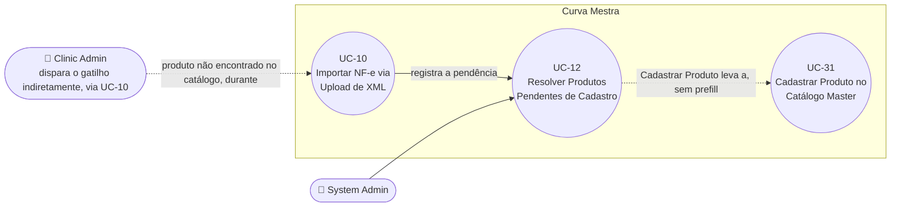

# UC-12: Resolver Produtos Pendentes de Cadastro

**Projeto:** Curva Mestra
**Data de Criação:** 14/07/2026
**Autor:** Guilherme Scandelari (via uml-use-case-writer)
**Status:** Aprovado
**Módulo/Contexto:** Inventário
**Versão:** 1.1

> Quando um produto de uma NF-e importada via XML (UC-10) não existe no catálogo master, ele vira uma pendência visível ao System Admin em `/admin/pending-products`. Resolver a pendência hoje é uma ação puramente manual e desacoplada: o admin cadastra o produto em outra tela (sem nenhum vínculo automático com a pendência) e depois remove a pendência da fila — a remoção **não verifica** se o produto foi de fato cadastrado.

---

## 1. Diagrama UML (Mermaid)

---

## 2. Atores

### 2.1 Ator Primário
**System Admin** — único role com acesso a `/admin/pending-products` (`ProtectedRoute allowedRoles: ['system_admin']`, confirmado no layout do grupo de rotas `(admin)` — sem a divergência de escopo encontrada em UC-11 para `/clinic/add-products`).

### 2.2 Atores Secundários / Sistemas Externos
**Clinic Admin** — não interage com esta tela, mas é quem, ao confirmar uma importação de XML (UC-10) contendo um produto de código desconhecido, dispara indiretamente a criação da pendência que o System Admin vê aqui.

---

## 3. Pré-condições
- System Admin autenticado (`is_system_admin === true`).
- Existe pelo menos um documento em `pending_master_products`, criado por UC-10 (RN-07 daquele UC) quando um produto do XML não foi encontrado no catálogo master.

---

## 4. Pós-condições

### 4.1 Sucesso — "Marcar Resolvido"
- O documento em `pending_master_products` é deletado (`resolvePendingMasterProduct`); a linha desaparece da tela.
- Isso **não garante**, por si só, que o produto exista no catálogo master (RN-02) — é uma ação de limpeza de fila, não uma validação.

### 4.1b Sucesso — "Cadastrar Produto"
- Admin é redirecionado para `/admin/products/new`, a tela de cadastro de produto do catálogo master (UC-31 — Cadastrar Produto no Catálogo Master), **sem nenhum dado pré-preenchido** (nem código, nem nome) — precisa digitar tudo manualmente, inclusive reescrever o código exibido na fila (RN-01).
- O cadastro em si (UC-31) **não remove automaticamente** a pendência correspondente.

### 4.2 Falha (Garantias Mínimas)
- Nenhuma alteração é feita; um toast de erro é exibido.

---

## 5. Gatilho (Trigger)
Duplo, dependendo do ator:
- **(Indireto, Clinic Admin)** Durante UC-10, um produto do XML não é encontrado no catálogo master.
- **(Direto, System Admin)** Acessa `/admin/pending-products` e clica em "Cadastrar Produto" ou "Marcar Resolvido" numa linha da fila.

---

## 6. Fluxo Principal (Basic Flow)

1. **(Pré-requisito, ocorre dentro de UC-10)** Durante `processNFAndAddToInventory`, um produto do XML tem código que não corresponde a nenhum documento em `master_products`. `registerPendingMasterProducts` verifica se já existe uma pendência para exatamente esse (`tenant_id`, `nf_id`, `codigo`); se não existir, cria um novo documento em `pending_master_products` (coleção **top-level**, fora de `tenants/{tenantId}/...`) com `tenant_id`, `numero_nf`, `nf_id`, `codigo`, `nome_produto` (como veio do XML) e `created_at`.
2. System Admin acessa `/admin/pending-products`.
3. Sistema chama `listPendingMasterProducts()` — busca **todos** os documentos da coleção (cross-tenant, sem filtro), ordenados por `created_at` decrescente.
4. Para cada pendência, sistema resolve o nome do tenant via `getTenant(tenant_id)` (com cache em memória por execução, evitando repetir a mesma consulta para tenants com múltiplas pendências) — se a busca falhar, usa o próprio `tenant_id` como texto de exibição (ver Fluxo Alternativo 7a).
5. Sistema exibe uma tabela: Clínica, NF-e, Código, Produto (nome no XML), Data, e duas ações por linha.
6. Se não houver pendências, exibe o estado vazio: "Nenhuma pendência" / "Todos os produtos das NFs importadas estão cadastrados no catálogo master".

**7a. System Admin clica em "Cadastrar Produto":**
   1. Sistema navega para `/admin/products/new` — tela de cadastro de produto do catálogo master (UC-31), sem nenhum parâmetro/prefill vindo da pendência.
   2. Admin digita manualmente todos os campos do novo produto (incluindo reescrever o código, copiando-o visualmente da coluna "Código" da fila).
   3. (O cadastro em si é o UC-31 — Cadastrar Produto no Catálogo Master.)
   4. Ao concluir (ou desistir), o admin normalmente volta para `/admin/pending-products` manualmente e prossegue no passo 7b para tirar a pendência da fila.

**7b. System Admin clica em "Marcar Resolvido":**
   1. Sistema chama `resolvePendingMasterProduct(pendingId)` — um `deleteDoc` direto do documento em `pending_master_products`, **sem nenhuma verificação prévia** de que o produto foi de fato cadastrado no catálogo master (RN-02).
   2. Sistema exibe o toast "Pendência removida" e remove a linha da tabela local (sem novo fetch).

8. **(Fora deste UC, fecha o ciclo)** Quando o Clinic Admin reenvia o mesmo XML (UC-10, Fluxo Alternativo 7a — "reenvio para completar"), o produto antes pendente é buscado novamente no catálogo master: se agora existir, é importado normalmente; se ainda não existir — inclusive se a pendência já tiver sido removida manualmente sem o cadastro real ter sido feito (RN-02) — `registerPendingMasterProducts` cria uma **pendência nova** (a antiga foi deletada, não há mais nada para deduplicar) — ver RN-03/seção 14.

---

## 7. Fluxos Alternativos

### 7a. Falha ao resolver o nome de um tenant (a partir do passo 4)
1. `getTenant(tenant_id)` lança exceção (ex.: tenant não existe mais, foi removido).
2. Sistema usa o próprio `tenant_id` (string bruta) como texto de exibição na coluna "Clínica", sem interromper o carregamento das demais pendências.
3. Segue o fluxo normalmente.

---

## 8. Fluxos de Exceção

### 8a. Erro ao carregar a fila (a partir do passo 3)
1. `listPendingMasterProducts()` lança exceção (Firestore indisponível, etc.).
2. Sistema exibe toast: "Erro" / "Não foi possível carregar os produtos pendentes".
3. A tabela permanece vazia/no estado anterior; usuário pode clicar em "Atualizar" para tentar novamente.

### 8b. Erro ao remover uma pendência (a partir do passo 7b)
1. `resolvePendingMasterProduct()` lança exceção.
2. Sistema exibe toast: "Erro" / "Não foi possível remover a pendência".
3. A linha permanece na tabela.

---

## 9. Regras de Negócio Relacionadas

| ID | Regra | Justificativa |
|----|-------|----------------|
| RN-01 | O botão "Cadastrar Produto" não carrega nenhum dado da pendência na tela de cadastro (`/admin/products/new`, UC-31) — nenhum parâmetro de URL, nenhum prefill de código ou nome. O admin precisa copiar manualmente o código (e demais dados) exibidos na fila. | Confirmado por leitura do handler (`router.push('/admin/products/new')` sem argumentos) e da própria tela de cadastro (sem leitura de `searchParams`) — reconfirmado durante o mapeamento de UC-31 (RN-04 daquele UC). |
| RN-02 | **[Sinalizado explicitamente pelo usuário]** "Marcar Resolvido" é uma ação de limpeza de fila, não uma validação — `resolvePendingMasterProduct` apenas deleta o documento da pendência, sem consultar `master_products` para confirmar que o produto com aquele código de fato existe. Um admin pode marcar como resolvido por engano (ou antes de terminar o cadastro), e a pendência desaparece da fila mesmo que o produto continue inexistente no catálogo. | Confirmado por leitura direta de `pendingMasterProductService.resolvePendingMasterProduct` — `deleteDoc` puro, nenhuma leitura prévia de `master_products`. |
| RN-03 | **[Consequência confirmada da combinação RN-02 + UC-10]** Se uma pendência for removida manualmente sem o produto ter sido de fato cadastrado, e o Clinic Admin reenviar o mesmo XML depois, `registerPendingMasterProducts` não encontra mais nenhuma pendência prévia para aquele (`tenant_id`, `nf_id`, `codigo`) — logo, cria uma pendência **nova** em vez de perceber que já houve uma tentativa anterior. Não há nenhum histórico do que já esteve pendente e foi removido sem resolução real. | Consequência lógica confirmada pela combinação do comportamento de `resolvePendingMasterProduct` (RN-02) com a deduplicação de `registerPendingMasterProducts` (que só evita duplicar pendências que **ainda existem**, não as já deletadas). |
| RN-04 | A dedução de "pendência já existe" em `registerPendingMasterProducts` (usada em UC-10) é por igualdade exata de (`tenant_id`, `nf_id`, `codigo`) — a mesma NF reenviada várias vezes com o mesmo produto ausente não cria pendências duplicadas, mas o mesmo produto ausente em NFs diferentes (`nf_id` diferente) do mesmo tenant gera uma pendência por NF. | Confirmado por leitura de `registerPendingMasterProducts` (query com os três campos). |
| RN-05 | A coleção `pending_master_products` é top-level (fora do padrão `tenants/{tenantId}/...`), com regra de segurança própria: qualquer usuário do próprio tenant pode criar uma pendência para si mesmo (`belongsToTenant(tenant_id)`), mas só o `system_admin` pode ler, atualizar ou deletar — nenhum `clinic_admin`/`clinic_user` consegue ver a fila de pendências, nem a própria, através das regras do Firestore (a única forma de um `clinic_admin` saber que há uma pendência é pela mensagem de erro exibida em UC-10, na própria tela de upload). | Confirmado em `firestore.rules` — isolamento deliberado: a fila de pendências é uma ferramenta exclusiva do System Admin. |
| RN-06 | A listagem é sempre cross-tenant e sem paginação (`listPendingMasterProducts` busca a coleção inteira, ordenada por `created_at`) — não há filtro por clínica, por NF, nem por período na tela. | Confirmado pela ausência de qualquer campo de filtro/busca ou parâmetro de paginação no componente. |

---

## 10. Requisitos Especiais / Não Funcionais

| ID | Descrição | Categoria |
|----|-----------|-----------|
| RNF-01 | O nome do tenant é resolvido com um cache em memória por execução do carregamento (evita repetir `getTenant` para tenants com múltiplas pendências na mesma leva), mas não é persistido nem reaproveitado entre reloads. | Performance |
| RNF-02 | Acesso restrito a `system_admin` pelo layout do grupo de rotas `(admin)` — sem divergência de escopo encontrada aqui (diferente do que foi confirmado em UC-11 para `/clinic/add-products`). | Segurança |
| RNF-03 | Sem realtime listener — a lista só é atualizada ao carregar a página ou clicar manualmente em "Atualizar"; múltiplos admins resolvendo pendências simultaneamente podem ver dados momentaneamente desatualizados. | Confiabilidade |

---

## 11. Frequência de Uso
Ocasional — depende de quantos produtos novos (ainda não cadastrados no catálogo master) aparecem nas NF-e importadas via XML pelas clínicas.

---

## 12. Casos de Uso Relacionados
- **UC-10 (Importar NF-e via Upload de XML)** é pré-condição — é onde a pendência nasce (RN-07 daquele UC), e é para onde o ciclo retorna quando o Clinic Admin reenvia o XML após o cadastro.
- **UC-31 (Cadastrar Produto no Catálogo Master)** é o passo intermediário real (fora deste UC) entre ver a pendência e resolvê-la de fato — sem nenhuma integração/vínculo automático com este UC-12 (RN-01).
- **UC-32 (Editar, Ativar e Desativar Produto no Catálogo Master)** — se o produto pendente já existir no catálogo mas desativado, ou precisar de correção antes de "casar" com o XML na reimportação, é resolvido por aquele UC, não por este.

---

## 13. Referências
- `src/app/(admin)/admin/pending-products/page.tsx`
- `src/lib/services/pendingMasterProductService.ts`
- `src/app/(admin)/layout.tsx` (`ProtectedRoute allowedRoles`)
- `src/lib/services/tenantServiceDirect.ts` (`getTenant`)
- `src/types/pendingMasterProduct.ts`
- `firestore.rules` (regra de `pending_master_products`)
- `src/app/(admin)/admin/products/new/page.tsx` (destino do botão "Cadastrar Produto" — confirmado sem prefill; ver UC-31)

---

## 14. Perguntas em Aberto / Decisões Pendentes

1. **[Confirmado, sinalizado explicitamente pelo usuário]** RN-02 — "Marcar Resolvido" não valida o cadastro real do produto; é uma limpeza de fila manual, não uma verificação.
2. **[Consequência confirmada]** RN-03 — remover uma pendência sem o produto ter sido cadastrado leva à criação de uma pendência nova (não reaproveitada) no próximo reenvio do XML, sem histórico do que já ocorreu.
3. **[Observação]** RN-01 — nenhum prefill entre a fila de pendências e a tela de cadastro (UC-31); poderia reduzir erro de digitação de código se implementado, mas não foi pedido para corrigir nesta rodada.

---

## 15. Histórico de Versões

| Versão | Data | Autor | O que mudou |
|--------|------|-------|--------------|
| 1.0 | 14/07/2026 | Guilherme Scandelari | Versão inicial, mapeada a partir de contexto detalhado fornecido pelo usuário e confirmada por leitura direta e completa de `pending-products/page.tsx`, `pendingMasterProductService.ts`, `firestore.rules` (regra de `pending_master_products`), `admin/products/new/page.tsx` (confirmado sem prefill) e do layout do grupo `(admin)`. |
| 1.1 | 15/07/2026 | Guilherme Scandelari | Seção 1 (diagrama), 4.1b, 6 (passo 7a) e 12 atualizadas para referenciar o UC-31 (Cadastrar Produto no Catálogo Master), recém-mapeado — antes citado apenas como "UC não mapeado". Seção 12 também passou a referenciar o UC-32 (Editar/Ativar/Desativar Produto). Nenhuma mudança de escopo ou de conteúdo investigativo — apenas rastreabilidade entre documentos. |
