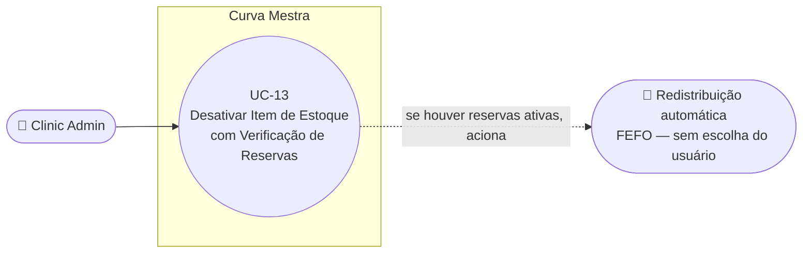

# UC-13: Desativar Item de Estoque com Verificação de Reservas Ativas

**Projeto:** Curva Mestra
**Data de Criação:** 14/07/2026
**Autor:** Guilherme Scandelari (via uml-use-case-writer)
**Status:** Aprovado
**Módulo/Contexto:** Inventário
**Versão:** 1.0

> Um Clinic Admin desativa (soft delete) um lote de produto do inventário. Se o lote não tem nenhuma reserva ativa em procedimentos agendados, a desativação é simples e imediata. Se tem, o sistema oferece "Forçar exclusão": redistribui automaticamente as reservas para outros lotes do mesmo produto (critério FEFO — validade mais próxima primeiro), removendo o produto de procedimentos sem alternativa suficiente, e cancelando automaticamente procedimentos que ficarem sem nenhum produto. A desativação do item em si nunca é bloqueada — o pior cenário é procedimentos perderem produtos ou serem cancelados.

---

## 1. Diagrama UML (Mermaid)

---

## 2. Atores

### 2.1 Ator Primário
**Clinic Admin** — o botão "Desativar" só é exibido quando `claims.role === "clinic_admin"` (`isAdmin`). **Esta é uma restrição apenas de interface:** a regra do Firestore para subcoleções do tenant (`belongsToTenant(tenantId)`) permite leitura e escrita a qualquer usuário do tenant — incluindo `clinic_user` — não havendo *enforcement* de role a nível de dados para `deactivateInventoryItem`/`forceDeactivateInventoryItem` (ver RN-09/seção 14).

### 2.2 Atores Secundários / Sistemas Externos
Nenhum ator humano — a redistribuição de reservas é inteiramente automática (algoritmo FEFO), sem intervenção de outro usuário. Indiretamente, os responsáveis pelos procedimentos agendados impactados são afetados pela ação, mas não participam dela nem são notificados (RN-08).

---

## 3. Pré-condições
- Usuário autenticado com `tenant_id` definido (role `clinic_admin` para que o botão apareça na UI — ver 2.1).
- O item de inventário (`tenants/{tenantId}/inventory/{itemId}`) existe e está `active: true` (o botão "Desativar" só aparece para itens ativos).

---

## 4. Pós-condições

### 4.1 Sucesso — sem reservas ativas
- Item marcado `active: false`, `updated_at` atualizado. Nenhum outro documento é alterado.

### 4.1b Sucesso — com reservas ativas, via "Forçar exclusão"
- Item original marcado `active: false`; sua `quantidade_reservada` é reduzida e `quantidade_disponivel` aumentada pelo total liberado (mesmo o item ficando inativo).
- Cada lote alternativo que recebeu parte da redistribuição tem `quantidade_reservada` aumentada e `quantidade_disponivel` reduzida na mesma proporção.
- Cada solicitação impactada é atualizada (`produtos_solicitados` substituído/mesclado, com avisos anexados a `observacoes`) ou cancelada (`status: "cancelada"`, com entrada em `status_history` atribuída ao sistema).
- Tudo gravado em uma única operação atômica (`writeBatch`).

### 4.2 Falha (Garantias Mínimas)
- Nenhuma alteração é feita; um erro é exibido no próprio diálogo.

---

## 5. Gatilho (Trigger)
Clinic Admin clica em "Desativar" na página de detalhe de um item de inventário (`/clinic/inventory/[id]`).

---

## 6. Fluxo Principal (Basic Flow)

1. Clinic Admin acessa `/clinic/inventory/[id]` e visualiza os detalhes do lote (produto, lote, quantidades, validade, valores, NF de origem).
2. Clinic Admin clica em "Desativar" (visível apenas para `clinic_admin`, com `item.active === true`).
3. Sistema abre um Dialog "Desativar produto do estoque" e chama `checkInventoryItemReservations(tenantId, itemId)`, que consulta todas as `solicitacoes` com `status: "agendada"` do tenant e filtra as que têm este `itemId` em `produtos_solicitados`, retornando descrição, data do procedimento e quantidade reservada de cada uma.
4. Enquanto carrega, exibe um spinner.
5. **Se não houver nenhum procedimento impactado** (lista vazia): sistema exibe "Este produto não possui reservas ativas. Ele será removido do estoque e não poderá ser usado em procedimentos." e mostra apenas o botão "Confirmar desativação".
6. **Se houver procedimentos impactados:** sistema exibe um Alert destrutivo ("Produto com reservas ativas — Este lote está reservado em N procedimento(s) agendado(s). Use 'Forçar exclusão' para redistribuir automaticamente para outros lotes disponíveis.") e a lista dos procedimentos afetados (data, descrição, quantidade reservada); mostra apenas o botão "Forçar exclusão" (não há opção de desativação simples quando há reservas).
7. **[Sem reservas] Clinic Admin clica em "Confirmar desativação":** sistema chama `deactivateInventoryItem(tenantId, itemId)` — um `updateDoc` simples (`active: false`, `updated_at`) — e redireciona para `/clinic/inventory`.
8. **[Com reservas] Clinic Admin clica em "Forçar exclusão":** sistema chama `forceDeactivateInventoryItem(tenantId, itemId)`, que:
   - a. Recarrega o item e todas as `solicitacoes` "agendada" que o referenciam.
   - b. Busca lotes alternativos do **mesmo** `codigo_produto`, `active: true`, com `dt_validade` no futuro, ordenados por `dt_validade` ascendente (FEFO).
   - c. Para cada solicitação impactada (na ordem em que a consulta do Firestore as retornou — não necessariamente pela data do procedimento, ver RN-04), tenta alocar a quantidade necessária a partir dos lotes alternativos, em ordem de validade, consumindo um contador de disponibilidade **compartilhado** entre todas as solicitações processadas no mesmo laço (a primeira solicitação processada tem prioridade sobre o estoque alternativo).
   - d. Classifica o resultado por solicitação: substituição total (sem aviso), substituição parcial (aviso "Produtos alterados - revisar antes de concluir"), ou remoção total do produto (aviso "{nome} (lote {X}) removido - revisar antes de concluir") quando não sobra nenhum lote alternativo com saldo.
   - e. Se, após a remoção, a solicitação ficar sem nenhum produto, ela é cancelada automaticamente (`status: "cancelada"`, nova entrada em `status_history` com `changed_by: "system"`/`"Sistema"` e observação "Cancelado automaticamente: todos os produtos foram removidos do estoque"), em vez de apenas ficar com a lista de produtos vazia.
   - f. Grava tudo — desativação do item original, ajustes de quantidade nos lotes alternativos, e atualização/cancelamento das solicitações — em um único `writeBatch` atômico.
   - g. Retorna `{ procedimentosAlterados, procedimentosCancelados }`.
9. Sistema redireciona para `/clinic/inventory`.
10. Caso de uso é concluído com sucesso — o item está sempre desativado ao final; procedimentos impactados podem ter sido silenciosamente ajustados ou cancelados (RN-08).

---

## 7. Fluxos Alternativos

### 7a. Clinic Admin cancela o diálogo (a partir de qualquer momento antes de confirmar)
1. Clinic Admin clica em "Cancelar".
2. Diálogo fecha; nenhuma alteração é feita; item permanece ativo.

---

## 8. Fluxos de Exceção

### 8a. [Confirmado, potencialmente perigoso] Erro ao verificar reservas (a partir do passo 3)
1. `checkInventoryItemReservations` lança exceção.
2. Sistema trata como lista vazia (`catch { setImpactedProcedimentos([]); }`, sem exibir esse erro específico ao usuário) — ou seja, um erro de rede/consulta faz o sistema assumir "sem reservas" e oferecer apenas "Confirmar desativação" simples, **mesmo que existam reservas reais não verificadas**.
3. Segue o fluxo a partir do passo 5. Ver RN-07/seção 14.

### 8b. Erro ao desativar (sem reservas) (a partir do passo 7)
1. `deactivateInventoryItem` lança exceção.
2. Sistema exibe "Erro ao desativar produto. Tente novamente." no próprio diálogo; item permanece ativo.

### 8c. Erro ao forçar exclusão (a partir do passo 8)
1. `forceDeactivateInventoryItem` lança exceção em qualquer ponto antes do commit do batch (o batch é atômico — se falhar, nada é gravado).
2. Sistema exibe "Erro ao processar desativação. Tente novamente." no próprio diálogo; item permanece ativo, nenhuma solicitação é alterada.

---

## 9. Regras de Negócio Relacionadas

| ID | Regra | Justificativa |
|----|-------|----------------|
| RN-01 | A redistribuição de reservas ("Forçar exclusão") é **inteiramente automática** — o sistema escolhe os lotes alternativos por FEFO (lotes ativos do mesmo código de produto, não vencidos, ordenados por data de validade crescente); o usuário **não** escolhe manualmente para qual lote a reserva vai. | Confirmado por leitura direta de `forceDeactivateInventoryItem` (query com `orderBy('dt_validade', 'asc')` e comentário explícito "FEFO" no código). |
| RN-02 | Somente solicitações com `status: "agendada"` são consideradas "reservas ativas" — tanto para a checagem prévia (`checkInventoryItemReservations`) quanto para a redistribuição em si. | Confirmado — a reserva de estoque (`quantidade_reservada`) é feita no momento da criação da solicitação, que já nasce com `status: "agendada"` (comentário no código de criação: "Toda solicitação inicia como 'agendada' → RESERVAR estoque"). |
| RN-03 | Um procedimento agendado pode ter, para o item desativado, um de três desfechos automáticos: substituição total (sem aviso visível na tela de desativação), substituição parcial (aviso anexado às observações), ou remoção total do produto daquele procedimento (aviso anexado); se a remoção zerar a lista de produtos da solicitação, ela é **cancelada automaticamente**. | Confirmado por leitura completa de `forceDeactivateInventoryItem` — três ramos de `warnings` + lógica de cancelamento explícita (`cancel = newProdutos.length === 0`). |
| RN-04 | **[Observação relevante]** A ordem de alocação entre múltiplas solicitações impactadas segue a ordem em que a consulta do Firestore as retorna — não há ordenação explícita por `dt_procedimento`. Se o estoque alternativo for insuficiente para cobrir todas as solicitações impactadas, não há garantia de que o procedimento mais próximo (ou mais antigo) tenha prioridade sobre um procedimento mais distante no tempo. | Confirmado por leitura do código — a query de `solicitacoes` não usa `orderBy`; a ordem de processamento no laço é a ordem de retorno do snapshot. Ver seção 14. |
| RN-05 | A desativação do item em si **nunca é bloqueada**, mesmo quando não há nenhum lote alternativo disponível para nenhuma das solicitações impactadas — o item é sempre marcado `active: false` no mesmo batch; o pior cenário possível é todas as solicitações impactadas perderem o produto (ou serem canceladas), não a impossibilidade de desativar. | Confirmado — `batch.update(itemRef, {active: false, ...})` é incondicional dentro de `forceDeactivateInventoryItem`, não depende do resultado da alocação. Responde diretamente à pergunta sobre "desativação impossível": **não existe esse caso**. |
| RN-06 | Mesmo lotes de outras marcas ou produtos com código diferente nunca são considerados como alternativa — a busca por lotes alternativos é estritamente por `codigo_produto` igual ao do item desativado. | Confirmado pela query `where('codigo_produto', '==', codigoProduto)`. |
| RN-07 | **[Confirmado, potencialmente perigoso]** Se `checkInventoryItemReservations` falhar (exceção de rede/Firestore), a interface trata isso como "nenhuma reserva encontrada" — oferecendo ao usuário apenas o botão de desativação simples (sem redistribuição), mesmo que o item possa de fato ter reservas ativas não verificadas por causa do erro. | Bug/comportamento de risco confirmado por leitura literal de `handleOpenDeactivate` — não corrigido nesta rodada. |
| RN-08 | Nenhuma notificação é enviada a quem criou ou é responsável pelo procedimento impactado (alterado ou cancelado automaticamente) — a única forma de descobrir a alteração é abrir a solicitação depois e ler o campo `observacoes` (para alterações) ou notar que o `status` virou `"cancelada"` (para cancelamentos). | Confirmado pela ausência de qualquer chamada a serviço de notificação/e-mail dentro de `forceDeactivateInventoryItem`. |
| RN-09 | A restrição "apenas `clinic_admin` pode desativar" é aplicada somente na interface (`isAdmin && ...`); a regra do Firestore para subcoleções do tenant (`belongsToTenant(tenantId)`) permite leitura e escrita a qualquer usuário do tenant (inclusive `clinic_user`) nessas mesmas coleções — não há *enforcement* de role a nível de dados para esta ação específica. | Confirmado por leitura de `firestore.rules` (regra genérica de `tenants/{tenantId}/{document=**}`) — mesmo padrão de restrição "só na UI" já observado em outras partes do sistema nesta sessão (ex.: UC-11). |

---

## 10. Requisitos Especiais / Não Funcionais

| ID | Descrição | Categoria |
|----|-----------|-----------|
| RNF-01 | A redistribuição (passo 8) é executada em um único `writeBatch` do Firestore — atomicidade garantida entre a desativação do item, os ajustes nos lotes alternativos e as atualizações/cancelamentos das solicitações. | Confiabilidade |
| RNF-02 | O cálculo de "lotes alternativos" e a alocação entre múltiplas solicitações são recalculados do zero a cada chamada de `forceDeactivateInventoryItem` — não há *lock*/transação otimista contra chamadas concorrentes (ex.: dois admins desativando lotes diferentes do mesmo produto ao mesmo tempo poderiam, em teoria, gerar leituras desatualizadas de `quantidade_disponivel` entre a leitura e o commit do batch). | Confiabilidade |
| RNF-03 | O diálogo de desativação é sempre montado com uma nova checagem de reservas (sem cache) toda vez que é aberto. | Confiabilidade |

---

## 11. Frequência de Uso
Ocasional — ocorre quando um lote precisa ser removido do estoque (ex.: erro de cadastro, produto danificado, correção manual), não é uma operação de rotina.

---

## 12. Casos de Uso Relacionados
- Um eventual **"Agendar Procedimento com Reserva de Estoque"** (UC ainda não mapeado, `solicitacaoService.ts`) é pré-condição indireta — é o que cria as reservas que este UC pode ter que redistribuir ou cancelar.
- **UC-10/UC-11 (Importar/Inserir Nota Fiscal)** são os UCs que criam os itens de inventário que, eventualmente, podem vir a ser desativados aqui.

---

## 13. Referências
- `src/app/(clinic)/clinic/inventory/[id]/page.tsx`
- `src/lib/services/inventoryService.ts` (`deactivateInventoryItem`, `checkInventoryItemReservations`, `forceDeactivateInventoryItem`)
- `src/lib/services/solicitacaoService.ts` (criação de solicitação e reserva inicial — contexto de RN-02)
- `firestore.rules` (regra genérica de `tenants/{tenantId}/{document=**}` — RN-09)

---

## 14. Perguntas em Aberto / Decisões Pendentes

1. **[Observação relevante, não confirmada como bug intencional]** RN-04 — a ordem de alocação entre solicitações concorrentes não é por data do procedimento; pode não ser a priorização mais justa/esperada pelo negócio.
2. **[Confirmado, potencialmente perigoso]** RN-07 — falha ao verificar reservas é tratada como "sem reservas", podendo levar à desativação simples de um item que na verdade tem reservas não verificadas.
3. **[Observação]** RN-08 — nenhuma notificação para os responsáveis pelos procedimentos alterados/cancelados automaticamente.
4. **[Observação]** RN-09 — restrição de role só na interface, não nas regras do Firestore (mesmo padrão já visto em outras partes do sistema nesta sessão).
5. **[Nota de rastreabilidade]** "Agendar Procedimento com Reserva de Estoque" ainda não foi mapeado como UC formal.

---

## 15. Histórico de Versões

| Versão | Data | Autor | O que mudou |
|--------|------|-------|--------------|
| 1.0 | 14/07/2026 | Guilherme Scandelari | Versão inicial, investigada do zero e confirmada por leitura completa de `inventory/[id]/page.tsx`, das três funções relevantes em `inventoryService.ts`, do trecho de criação de solicitação em `solicitacaoService.ts` (RN-02), e da regra genérica de `tenants/{tenantId}/{document=**}` em `firestore.rules` (RN-09). Respondidas as três perguntas específicas do levantamento: a redistribuição é automática por FEFO, sem escolha do usuário (RN-01); os procedimentos impactados podem ser substituídos total/parcialmente, ter o produto removido, ou ser cancelados automaticamente se ficarem sem nenhum produto (RN-03); e a desativação do item nunca é impossível — o pior cenário é a perda/cancelamento de procedimentos, não o bloqueio da desativação (RN-05). |
