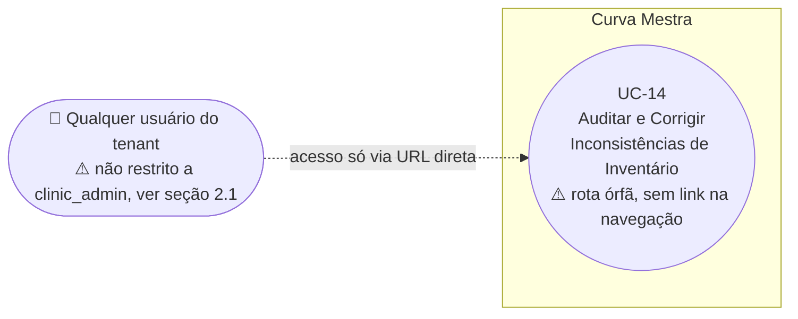

# UC-14: Auditar e Corrigir Inconsistências de Inventário

**Projeto:** Curva Mestra
**Data de Criação:** 14/07/2026
**Autor:** Guilherme Scandelari (via uml-use-case-writer)
**Status:** Aprovado
**Módulo/Contexto:** Inventário
**Versão:** 1.0

> Uma ferramenta de correção em lote que compara os valores reais de `quantidade_reservada`/`quantidade_disponivel` de cada item do inventário contra valores "esperados", recalculados a partir do histórico de solicitações (`agendada`/`aprovada` = reservado; `concluida` = consumido). A correção só é aplicada mediante um clique explícito e uma confirmação — nunca automaticamente. **Esta tela não está linkada em nenhum lugar da navegação do sistema** (rota órfã, só acessível digitando a URL diretamente) **e não tem nenhuma restrição de role** — qualquer usuário do tenant (não só `clinic_admin`) pode acessá-la e executar a correção em lote.

---

## 1. Diagrama UML (Mermaid)

---

## 2. Atores

### 2.1 Ator Primário
**[Divergência confirmada em relação ao contexto recebido]** O contexto inicial indicava `clinic_admin`, mas `/clinic/inventory/audit/page.tsx` **não tem nenhuma checagem de role** — nem mesmo para ocultar um botão, como acontece em UC-13. Qualquer usuário autenticado do tenant (`clinic_admin` **ou** `clinic_user`, pela regra do layout `(clinic)`) pode acessar a tela e executar tanto a auditoria quanto a correção em lote. **Além disso, esta rota não está referenciada em nenhum lugar da navegação/UI do sistema** — uma busca em todo o código-fonte não encontrou nenhum link, botão ou item de menu apontando para `/clinic/inventory/audit`; é acessível apenas por quem souber (ou digitar) a URL diretamente. Documentado como está; ver seção 14.

### 2.2 Atores Secundários / Sistemas Externos
Nenhum.

---

## 3. Pré-condições
- Usuário autenticado com `tenant_id` definido (qualquer role do tenant — ver 2.1).
- Existem itens de inventário ativos (`active: true`) no tenant.

---

## 4. Pós-condições

### 4.1 Sucesso — apenas executar auditoria (sem corrigir)
- Nenhum dado é alterado; o resultado (lista de itens com divergência, contadores de itens corretos/com problema) é exibido na tela.

### 4.1b Sucesso — corrigir
- Os itens que estavam com `problemaReserva` e/ou `problemaDisponivel` têm `quantidade_reservada` e `quantidade_disponivel` sobrescritos com os valores esperados **calculados na execução da auditoria** (não uma nova leitura no momento da correção — ver RN-05/seção 14), em um único `writeBatch`.
- A lista de resultados é limpa, e uma nova auditoria é disparada automaticamente 1 segundo depois, para conferência.

### 4.2 Falha (Garantias Mínimas)
- Nenhuma alteração é feita; um `alert()` nativo do navegador exibe uma mensagem genérica de erro.

---

## 5. Gatilho (Trigger)
Usuário acessa diretamente a URL `/clinic/inventory/audit` (não há nenhum ponto de entrada na navegação) e clica em "Executar Auditoria".

---

## 6. Fluxo Principal (Basic Flow)

1. Usuário acessa `/clinic/inventory/audit` diretamente pela URL.
2. Usuário clica em "Executar Auditoria".
3. Sistema busca todos os itens de inventário ativos (`active: true`) do tenant.
4. Sistema busca, em paralelo, três conjuntos de solicitações do tenant: `status: "agendada"`, `status: "aprovada"` (legado) e `status: "concluida"`.
5. Sistema soma, por `inventory_item_id`, a quantidade de cada produto em `produtos_solicitados` das solicitações "agendada" + "aprovada" → mapa de reservas esperadas.
6. Sistema soma, por `inventory_item_id`, a quantidade de cada produto em `produtos_solicitados` das solicitações "concluida" → mapa de quantidades consumidas.
7. Para cada item de inventário ativo: calcula `reservadaEsperada` (do mapa, ou 0) e `disponivelEsperado = max(0, quantidade_inicial − consumido − reservadaEsperada)`; compara com os valores atuais (`quantidade_reservada`, `quantidade_disponivel`) gravados no documento.
8. Itens onde o valor atual difere do esperado (em reserva e/ou em disponível) entram na lista de resultados, com badges indicando qual dos dois campos diverge.
9. Sistema exibe: total de itens analisados, contagem de itens corretos vs. com problema, e um cartão por item com problema mostrando nome, lote, quantidade inicial, e os valores atual vs. esperado lado a lado para cada campo divergente.
10. Se não houver nenhum item com problema, exibe "Tudo Certo! Nenhum problema encontrado no inventário." (sem botão de correção).
11. Se houver itens com problema, exibe o botão "Corrigir Todos os Itens".
12. Usuário clica em "Corrigir Todos os Itens".
13. Sistema exibe um `confirm()` nativo do navegador: "⚠️ ATENÇÃO: Isso irá atualizar {N} itens no inventário.\n\nDeseja continuar?".
14. Usuário confirma.
15. Sistema monta um `writeBatch` atualizando, para cada item da lista de resultados **já calculada** (sem reler o estado atual do Firestore neste momento — ver RN-05/seção 14), `quantidade_reservada` e `quantidade_disponivel` para os valores esperados computados no passo 7, e `updated_at`.
16. Sistema executa `batch.commit()` (atômico entre todos os itens corrigidos).
17. Sistema exibe "Correção Aplicada! Os itens foram corrigidos com sucesso.", limpa a lista de resultados, e após 1 segundo dispara automaticamente uma nova execução da auditoria (passos 3-9) para conferência.
18. Caso de uso é concluído com sucesso.

---

## 7. Fluxos Alternativos

### 7a. Usuário cancela o confirm() nativo (a partir do passo 13)
1. Usuário clica em "Cancelar" no diálogo nativo do navegador.
2. Nenhuma alteração é feita; a lista de resultados permanece visível, inalterada.

### 7b. Nenhum item com problema encontrado (a partir do passo 8)
1. Todos os itens ativos têm `quantidade_reservada` e `quantidade_disponivel` batendo com o esperado.
2. Sistema exibe "Tudo Certo!"; não há botão de correção disponível.
3. Caso de uso é encerrado sem ação de correção necessária.

---

## 8. Fluxos de Exceção

### 8a. Erro ao executar a auditoria (a partir dos passos 3-9)
1. Qualquer exceção durante as leituras (Firestore indisponível, etc.).
2. Sistema exibe um `alert()` nativo: "Erro ao auditar inventário".
3. Nenhum resultado é exibido; usuário pode tentar novamente clicando em "Executar Auditoria".

### 8b. Erro ao aplicar a correção (a partir dos passos 15-16)
1. `batch.commit()` lança exceção (ex.: um dos itens foi deletado entre a auditoria e a correção, regra do Firestore, rede).
2. Sistema exibe `alert()` nativo: "Erro ao corrigir inventário". Como o batch é atômico, nenhum item é parcialmente corrigido — ou todos os itens da leva são gravados, ou nenhum.
3. A lista de resultados permanece (não é limpa neste caminho de erro); usuário pode tentar novamente.

### 8c. [Risco confirmado de condição de corrida] Dados mudam entre a auditoria e a correção (a partir de qualquer momento entre os passos 9 e 15)
1. Entre a execução da auditoria (leitura) e o clique em "Corrigir Todos os Itens" (escrita), não há nenhum mecanismo de bloqueio, transação ou nova verificação — o intervalo pode ser de segundos a minutos, dependendo de quanto tempo o usuário leva para revisar a lista antes de confirmar.
2. Se, nesse intervalo, outro usuário criar uma nova solicitação (reservando parte do mesmo item), mudar o status de uma solicitação existente (liberando ou consumindo uma reserva), ou qualquer outra operação alterar `quantidade_reservada`/`quantidade_disponivel` do item diretamente, os valores "esperados" calculados na auditoria ficam desatualizados.
3. A correção (passo 15) sobrescreve `quantidade_reservada`/`quantidade_disponivel` com esses valores já obsoletos, **sem verificar se ainda correspondem à realidade** — na prática, isso pode desfazer silenciosamente uma reserva legítima feita nesse intervalo, ou criar uma nova divergência (subvertendo o próprio propósito da ferramenta).
4. A auditoria automática disparada 1 segundo após a correção (passo 17) pode detectar essa nova divergência se ela já tiver se manifestado a tempo — mas não previne o problema, apenas o revela depois de já ter ocorrido.

---

## 9. Regras de Negócio Relacionadas

| ID | Regra | Justificativa |
|----|-------|----------------|
| RN-01 | "Reserva esperada" = soma da quantidade em `produtos_solicitados` de todas as solicitações do tenant com `status: "agendada"` ou `status: "aprovada"` (este último um status legado, mantido para compatibilidade histórica) que referenciam aquele `inventory_item_id`. | Confirmado por leitura direta do código — reflete o modelo real de reserva usado por `solicitacaoService.ts`, onde `agendada` e `aprovada` (legado) são tratados de forma idêntica nas transições de status. |
| RN-02 | "Quantidade consumida" = soma da quantidade em `produtos_solicitados` de todas as solicitações do tenant com `status: "concluida"` — inclui tanto solicitações que passaram por `agendada → concluida` quanto procedimentos "efetuados" (criados e concluídos automaticamente na mesma transação, sem nunca passar por reserva). | Confirmado por leitura cruzada de `solicitacaoService.ts` — ambos os caminhos deixam `produtos_solicitados` apontando para o item consumido, e ambos terminam com `status: "concluida"` persistido. |
| RN-03 | "Disponível esperado" = `max(0, quantidade_inicial − consumido − reservaEsperada)`. O uso de `Math.max(0, ...)` impede que o valor esperado fique negativo, mas isso também pode mascarar a real gravidade de uma inconsistência (se consumido + reservado excedem o inicial por algum outro problema de dados, a ferramenta simplesmente mostra "esperado: 0" em vez de sinalizar um valor negativo, que seria um indício de um problema mais sério). | Confirmado por leitura literal da fórmula no código. Ver seção 14. |
| RN-04 | **[Inconsistência cross-UC confirmada]** O critério de "reserva ativa" usado aqui (`status` "agendada" **ou** "aprovada") é mais amplo do que o usado em UC-13 (`checkInventoryItemReservations`), que considera apenas `status: "agendada"`. Se existir alguma solicitação legada com `status: "aprovada"` ainda referenciando um item, UC-13 não a detectaria como reserva ativa (permitindo desativação simples, sem redistribuição), mas esta auditoria passaria a apontar uma divergência logo em seguida, já que o valor real de `quantidade_reservada` não bateria mais com o esperado (que ainda inclui essa reserva legada). | Inconsistência confirmada por comparação direta do código dos dois UCs — não corrigida em nenhum dos dois nesta sessão. |
| RN-05 | **[Risco confirmado, o mais relevante deste UC]** A correção (`fixInventory`) usa os valores "esperados" calculados no momento em que a auditoria foi executada (armazenados em estado local do componente React) — não relê o estado atual do Firestore, nem usa uma transação, no momento em que de fato grava a correção. Não há nenhum controle de versão/timestamp para detectar se os dados mudaram entre a auditoria e a correção. | Bug/risco de condição de corrida confirmado por leitura literal de `fixInventory` — não corrigido nesta rodada; ver Fluxo de Exceção 8c e seção 14. |
| RN-06 | A correção é sempre tudo-ou-nada: o botão "Corrigir Todos os Itens" aplica a correção a **todos** os itens divergentes de uma vez (em um único `writeBatch`), sem nenhuma opção de selecionar individualmente quais itens corrigir. | Confirmado pela ausência de qualquer checkbox/seleção por item na interface. |
| RN-07 | A ferramenta nunca audita nem corrige `quantidade_inicial` — esse valor é sempre tratado como correto/imutável na fórmula, servindo de base para o cálculo do disponível esperado. | Confirmado pela ausência de qualquer leitura/comparação envolvendo `quantidade_inicial` além de usá-la como constante na fórmula. |
| RN-08 | Somente itens ativos (`active: true`) são auditados; itens desativados nunca entram na análise, mesmo que tenham valores de reserva/disponível tecnicamente inconsistentes. | Confirmado pela query `where('active', '==', true)`. |

---

## 10. Requisitos Especiais / Não Funcionais

| ID | Descrição | Categoria |
|----|-----------|-----------|
| RNF-01 | Esta rota não está referenciada em nenhum ponto de navegação do sistema (menus, botões, links) — busca em todo o código-fonte não encontrou nenhuma referência a `/clinic/inventory/audit` fora do próprio arquivo da página. É uma rota órfã, acessível apenas por URL direta. | Usabilidade / Descoberta |
| RNF-02 | Não há nenhuma restrição de role nesta tela — nem checagem de `clinic_admin` (diferente de UC-10/UC-13), nem sequer ocultação condicional de botões. Qualquer usuário do tenant com acesso ao grupo de rotas `(clinic)` (`clinic_admin` ou `clinic_user`) pode executar a correção em lote, uma operação potencialmente destrutiva. | Segurança |
| RNF-03 | A correção (`fixInventory`) é atômica entre os itens corrigidos na mesma leva (`writeBatch`), mas não é atômica em relação ao momento da leitura original (RN-05) — a atomicidade cobre apenas a escrita, não o par leitura-então-escrita como um todo. | Confiabilidade |
| RNF-04 | Erros são reportados via `alert()` nativo do navegador, não pelo padrão de toast usado no restante do sistema. | Consistência de UI |

---

## 11. Frequência de Uso
Rara/eventual — ferramenta de manutenção/correção de dados, não uma operação do dia a dia da clínica; presumivelmente usada em resposta a um problema já percebido (ex.: números de estoque que não batem), não de forma preventiva rotineira (reforçado pela ausência de qualquer link de navegação até ela).

---

## 12. Casos de Uso Relacionados
- **UC-13 (Desativar Item de Estoque com Verificação de Reservas Ativas)** usa uma definição de "reserva ativa" mais restrita (só `"agendada"`) do que esta auditoria (RN-04) — divergência cross-UC confirmada.
- Um eventual **"Agendar/Concluir Procedimento" (UC ainda não mapeado, `solicitacaoService.ts`)** é a fonte de todos os dados usados para calcular os valores esperados aqui.

---

## 13. Referências
- `src/app/(clinic)/clinic/inventory/audit/page.tsx` (toda a lógica está neste único arquivo — não há service dedicado)
- `src/lib/services/solicitacaoService.ts` (transições de status e efeitos no estoque, usados para validar RN-01 a RN-04)
- `src/app/(clinic)/layout.tsx` (`ProtectedRoute allowedRoles` — origem da divergência de ator, seção 2.1)

---

## 14. Perguntas em Aberto / Decisões Pendentes

1. **[Divergência confirmada, mais grave que em UC-11]** O ator real inclui qualquer usuário do tenant (`clinic_admin` ou `clinic_user`), sem nenhuma restrição, nem mesmo de interface — diferente do que foi informado inicialmente, e diferente de UC-10/UC-13, que ao menos ocultam botões para não-admins.
2. **[Confirmado]** Esta rota não está linkada em nenhum lugar da navegação do sistema — rota órfã, mesmo padrão do antigo `/activate` (já removido, ver Histórico de UC-01). Não confirmado se deveria ganhar um link (ex.: em `/clinic/inventory`) ou se deve continuar como ferramenta de acesso restrito/manual.
3. **[Bug/risco confirmado — sugerido como prioridade]** RN-05 — condição de corrida real entre a leitura (auditoria) e a escrita (correção), sem transação nem revalidação. Pode sobrescrever silenciosamente reservas legítimas feitas nesse intervalo.
4. **[Inconsistência cross-UC confirmada]** RN-04 — a definição de "reserva ativa" diverge entre este UC e UC-13.
5. **[Observação]** RN-03 — o uso de `Math.max(0, ...)` pode mascarar inconsistências mais graves (valores que deveriam ser negativos).

---

## 15. Histórico de Versões

| Versão | Data | Autor | O que mudou |
|--------|------|-------|--------------|
| 1.0 | 14/07/2026 | Guilherme Scandelari | Versão inicial, investigada do zero por leitura completa de `inventory/audit/page.tsx` (única fonte de toda a lógica, sem service dedicado) e de `solicitacaoService.ts` (para validar as regras de cálculo do "esperado" contra o modelo real de transição de status). Respondidas as quatro perguntas do levantamento: o "valor esperado" considera `agendada`+`aprovada` como reservado e `concluida` como consumido (RN-01/RN-02); a correção só ocorre mediante clique explícito em "Corrigir Todos os Itens", nunca automaticamente; há confirmação via `confirm()` nativo antes de aplicar; e existe um risco real e confirmado de condição de corrida, já que a correção usa valores calculados no momento da auditoria sem revalidar contra o estado atual do Firestore (RN-05). Identificados também, fora do escopo das perguntas originais: ausência total de restrição de role (mais grave que em UC-11) e ausência de qualquer link de navegação até esta tela (rota órfã). |
