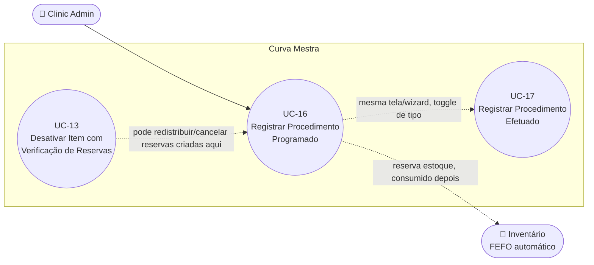

# UC-16: Registrar Procedimento Programado

**Projeto:** Curva Mestra
**Data de Criação:** 14/07/2026
**Autor:** Guilherme Scandelari (via uml-use-case-writer)
**Status:** Aprovado
**Módulo/Contexto:** Procedimentos
**Versão:** 1.0

> Um Clinic Admin registra um procedimento agendado para o futuro, reservando automaticamente os produtos necessários do inventário (alocação FEFO — validade mais próxima primeiro), sem consumir o estoque imediatamente. É uma das duas variantes de um mesmo wizard compartilhado (`/clinic/requests/new`) — a outra é **UC-17 (Registrar Procedimento Efetuado)**, que consome o estoque na hora. As duas compartilham a mesma tela, o mesmo mecanismo de aplicação de protocolo, e divergem principalmente a partir da confirmação: `createSolicitacaoWithConsumption` (aqui) reserva; `createSolicitacaoEfetuada` (UC-17) debita direto.

---

## 1. Diagrama UML (Mermaid)

---

## 2. Atores

### 2.1 Ator Primário
**Clinic Admin** — a página redireciona (via `useEffect`) para `/clinic/requests` quem não for `clinic_admin` (`claims.role !== 'clinic_admin'`) — checagem real de UI aqui, ao contrário de vários UCs anteriores do módulo de Inventário (UC-11, UC-14).

### 2.2 Atores Secundários / Sistemas Externos
Nenhum.

---

## 3. Pré-condições
- Usuário autenticado com role `clinic_admin`.
- Existem itens de inventário ativos, com `quantidade_disponivel > 0` e não vencidos (`dt_validade > agora`) — só esses entram na lista de seleção.
- (Opcional) Existem protocolos ativos cadastrados no tenant, para uso do atalho de pré-preenchimento.

---

## 4. Pós-condições

### 4.1 Sucesso (Garantias de Sucesso)
- Um documento é criado em `tenants/{tenantId}/solicitacoes` com `status: "agendada"` e `produtos_solicitados` detalhado por item.
- Para cada produto, `quantidade_reservada` é incrementada e `quantidade_disponivel` é decrementada na mesma quantidade (reserva, não consumo).
- Um log de auditoria (`inventory_activity`, tipo `"reserva"`) é gravado por produto.
- Tudo em uma única transação atômica (`runTransaction`).

### 4.2 Falha (Garantias Mínimas)
- Nenhuma alteração é feita.
- Se a causa for estoque insuficiente detectado na pré-validação, os erros específicos por produto são exibidos na tela de revisão.
- Se detectado dentro da transação (condição de corrida), a transação inteira é abortada e nada é gravado.

---

## 5. Gatilho (Trigger)
Clinic Admin acessa `/clinic/requests/new`, mantém (ou seleciona) "Procedimento Programado" como tipo, adiciona produtos e confirma.

---

## 6. Fluxo Principal (Basic Flow)

1. Clinic Admin acessa `/clinic/requests/new`. Sistema redireciona quem não é `clinic_admin`.
2. Sistema carrega, em paralelo, o inventário ativo, não vencido e com saldo (`quantidade_disponivel > 0`) do tenant, agrupado por código de produto, e a lista de protocolos ativos do tenant.
3. Sistema exibe o Passo 1 ("Adicionar Produtos"), com "Procedimento Programado" pré-selecionado (é o padrão do toggle).
4. Clinic Admin preenche descrição (opcional), data do procedimento (obrigatória, não pode ser no passado) e observações (opcional).
5. Clinic Admin seleciona um produto (por código, agregando todos os lotes) e informa a quantidade desejada; clica no botão "+".
6. Sistema valida: produto selecionado, quantidade válida (> 0), quantidade ≤ soma disponível de todos os lotes daquele código, e que o produto ainda não foi adicionado à lista (um código por vez — RN-05).
7. Sistema aloca a quantidade automaticamente entre os lotes existentes daquele produto por FEFO (First Expired, First Out): percorre os lotes já ordenados por validade crescente (herdado do agrupamento feito ao carregar o inventário) e consome de cada lote até completar a quantidade desejada, podendo gerar múltiplas linhas (uma por lote) se um único lote não for suficiente.
8. Sistema adiciona a(s) linha(s) resultante(s) à lista de produtos selecionados e mostra um toast confirmando quais lotes foram usados.
9. Clinic Admin repete os passos 5-8 para os demais produtos do procedimento (ou usa um protocolo — Fluxo Alternativo 7a).
10. Clinic Admin clica em "Revisar Procedimento" (exige data preenchida e ao menos 1 produto).
11. Sistema exibe o Passo 2 ("Revisão"): dados do procedimento, lista de produtos com lotes/quantidades/valores, valor total, e um aviso: "Ao confirmar, os produtos serão RESERVADOS no inventário e o procedimento será criado com status 'Agendado'. Os produtos só serão consumidos quando o procedimento for concluído."
12. Clinic Admin clica em "Confirmar e Reservar Produtos".
13. Sistema chama `createSolicitacaoWithConsumption(tenantId, uid, userName, { descricao, dt_procedimento, produtos, observacoes, protocolo_id?, protocolo_nome? })`.
14. Service revalida a disponibilidade de cada produto (nova leitura, fora da transação) — se algo já não estiver mais disponível, retorna erros específicos sem gravar nada (Fluxo de Exceção 8a).
15. Service monta os dados detalhados de cada produto (nome, lote, quantidade, valor, `quantidade_disponivel_antes`) a partir de uma nova leitura do inventário.
16. Service determina o status inicial como `"agendada"` (sempre, para este fluxo).
17. Dentro de uma transação atômica (`runTransaction`): relê cada item do inventário envolvido e **revalida novamente** que há saldo suficiente (proteção contra condição de corrida entre os passos 14 e este ponto); cria o documento da solicitação (`status: "agendada"`, com uma entrada em `status_history` "Solicitação criada e produtos reservados"); para cada produto, incrementa `quantidade_reservada` e decrementa `quantidade_disponivel` na mesma quantidade; registra um log de auditoria por produto (`inventory_activity`, tipo `"reserva"`).
18. Sistema exibe toast de sucesso: "Procedimento criado com sucesso! Os produtos foram reservados no inventário." e navega para a página de detalhe do procedimento criado (`/clinic/requests/{id}`).
19. Caso de uso é concluído com sucesso.

---

## 7. Fluxos Alternativos

### 7a. Aplicar um protocolo pré-definido (a partir do passo 5 — opcional, também disponível no modo Efetuado, UC-17)
1. Antes de adicionar produtos manualmente, Clinic Admin seleciona um protocolo no seletor "Usar Protocolo (opcional)".
2. Para cada item do protocolo (código de produto + quantidade sugerida), sistema aplica a mesma alocação automática FEFO do passo 7.
3. Sistema **substitui inteiramente** a lista de produtos selecionados atual pelo resultado (não mescla com produtos já adicionados manualmente antes) — ver RN-08/seção 14.
4. Sistema exibe um toast "Protocolo '{nome}' aplicado. Produtos pré-carregados. Ajuste as quantidades se necessário." e guarda a referência do protocolo (`protocolo_id`/`protocolo_nome`, gravados na solicitação ao final).
5. Clinic Admin pode, a partir daqui, adicionar mais produtos manualmente ou remover itens vindos do protocolo livremente (não é tudo-ou-nada) — mas trocar para outro protocolo, ou limpar a seleção (botão "X"), substitui/apaga a lista novamente.
6. Retorna ao passo 9 do fluxo principal.

### 7b. Clinic Admin remove um produto já adicionado (a partir do passo 9)
1. Clica no ícone de lixeira na linha do produto.
2. Sistema remove a linha (e, se era um dos vários lotes de uma alocação FEFO em múltiplos lotes, remove só aquele lote específico, não o produto inteiro).

### 7c. Clinic Admin volta do Passo 2 para o Passo 1 (a partir do passo 11)
1. Clica em "Voltar".
2. Sistema retorna ao Passo 1 com todos os dados/produtos preservados.

---

## 8. Fluxos de Exceção

### 8a. Estoque insuficiente detectado na revalidação (a partir do passo 14)
1. Entre a montagem da lista (passos 6-9) e a confirmação (passo 12), o saldo de algum item mudou (outra solicitação consumiu, item foi desativado — UC-13, etc.) e não é mais suficiente para a quantidade selecionada, ou o item ficou inativo.
2. Service retorna `{ success: false, validationErrors: [...mensagens específicas por produto...] }`, sem gravar nada.
3. Sistema exibe os erros em destaque na própria tela de revisão (Passo 2, onde o usuário já está) e um toast "Erro ao criar procedimento".
4. Clinic Admin pode voltar ao Passo 1 para ajustar as quantidades/lotes.

### 8b. Condição de corrida detectada dentro da transação (a partir do passo 17)
1. Mesmo após passar pela revalidação do passo 14, o saldo muda novamente entre esse momento e a leitura feita dentro da transação (janela muito mais estreita, mas ainda existente).
2. A transação lança uma exceção ("Estoque insuficiente para {produto}. Disponível: X, Solicitado: Y") e é abortada — nada é gravado (nem a solicitação, nem os ajustes de inventário).
3. Sistema captura a exceção e retorna `{ success: false, error: mensagem }` — exibido como toast genérico "Erro ao criar procedimento" (sem necessariamente popular `validationErrors`, já que essa falha vem de dentro da transação, não da pré-validação).

### 8c. Data do procedimento no passado (a partir do passo 4)
1. Clinic Admin informa uma data anterior a hoje, com "Procedimento Programado" selecionado.
2. Sistema bloqueia no frontend: "Data do procedimento não pode ser no passado" (`validateStep1`) — não avança para a revisão.

### 8d. Nenhum produto adicionado (a partir do passo 10)
1. Clinic Admin tenta avançar para a revisão sem ter adicionado nenhum produto.
2. Sistema exibe toast "Adicione produtos" / "Adicione pelo menos um produto ao procedimento" e não avança.

---

## 9. Regras de Negócio Relacionadas

| ID | Regra | Justificativa |
|----|-------|----------------|
| RN-01 | A alocação de lotes é sempre automática por FEFO (First Expired, First Out) — a lista de lotes de um produto já vem ordenada por `dt_validade` crescente (herdada do agrupamento feito ao carregar o inventário), e a função de alocação consome do primeiro lote (o que vence primeiro) até completar a quantidade, avançando para o próximo lote só se o atual não for suficiente. O usuário não escolhe manualmente o lote neste modo (diferente de UC-17). | Confirmado por leitura de `alocarProdutoFEFO` e do agrupamento (`agruparProdutosPorCodigo`, que ordena os lotes por validade). |
| RN-02 | **[Confirmado, mesmo conceito de UC-13, mas implementação própria]** Este FEFO é uma função local da própria página (`alocarProdutoFEFO`, em `requests/new/page.tsx`) — não reutiliza nem chama a mesma lógica de `forceDeactivateInventoryItem` (UC-13). São duas implementações independentes do mesmo conceito, em arquivos diferentes, sem nenhum código compartilhado entre elas. | Confirmado por comparação direta dos dois algoritmos — mesma estratégia, implementações fisicamente distintas. |
| RN-03 | Estoque insuficiente **nunca** é permitido parcialmente nem negativamente — é bloqueado em até três camadas: (a) no frontend, ao tentar adicionar um produto manualmente (quantidade > soma disponível do código); (b) na pré-validação do service, antes da transação (`validateInventoryAvailability`); (c) dentro da própria transação atômica, relendo o saldo mais uma vez antes de gravar (`readInventoryInTransaction`). Se qualquer uma dessas camadas detectar insuficiência, a operação inteira é bloqueada — não há reserva parcial de uma quantidade menor que a solicitada. | Confirmado pelas três checagens encontradas no código, nos três pontos citados. |
| RN-04 | A criação da solicitação e a atualização do inventário (reserva) ocorrem na mesma transação atômica do Firestore (`runTransaction`) — ou tudo é gravado (solicitação + reservas de todos os produtos), ou nada é. | Confirmado pelo uso de `runTransaction` envolvendo tanto `transaction.set` da solicitação quanto `transaction.update` de cada item de inventário. |
| RN-05 | Não é possível adicionar o mesmo código de produto duas vezes na lista manualmente neste modo (`validateProductSelection` bloqueia com "Produto já adicionado") — para aumentar a quantidade de um produto já na lista, o usuário precisa remover a linha e adicionar novamente com a nova quantidade total (a nova alocação FEFO é recalculada do zero, podendo escolher lotes diferentes dos da primeira tentativa). | Confirmado pela checagem `produtosSelecionados.some((p) => p.produto_codigo === code)`. |
| RN-06 | A data do procedimento não pode ser uma data passada neste modo (`validateStep1`) — deve ser hoje ou futura. | Confirmado pela validação `dtProcedimento < dataHojeString` (bloqueia) quando `tipoProcedimento !== 'efetuado'`. |
| RN-07 | O protocolo aplicado (`protocolo_id`/`protocolo_nome`) é gravado na solicitação mesmo que o usuário tenha editado manualmente a lista de produtos depois de aplicá-lo — não há verificação de que a lista final ainda corresponde ao protocolo original. | Confirmado — o payload de criação sempre inclui `protocolo_id`/`protocolo_nome` se um protocolo foi selecionado em algum momento, independente de edições posteriores à lista. |
| RN-08 | **[Confirmado, risco relevante]** Aplicar um protocolo (Fluxo Alternativo 7a) **substitui** inteiramente a lista de produtos já selecionados (`setProdutosSelecionados(alocados)`) — produtos adicionados manualmente antes de aplicar o protocolo são perdidos sem aviso. | Confirmado por leitura literal de `handleAplicarProtocolo` — não há confirmação nem *merge*, é uma sobrescrita direta do estado. |
| RN-09 | **[Confirmado, gap relevante]** A aplicação de um protocolo **não** usa a mesma validação de estoque insuficiente do fluxo manual (`validateProductSelection`) — se a soma disponível de um produto do protocolo for menor que a `quantidade_sugerida`, `alocarProdutoFEFO` simplesmente aloca o que houver disponível (silenciosamente, sem nenhum aviso); se o produto não tiver **nenhum** estoque disponível, o item do protocolo é simplesmente omitido da lista, também sem aviso. O usuário só perceberia isso conferindo manualmente as quantidades na tela de revisão contra o que o protocolo originalmente definia. | Bug/gap confirmado por leitura literal de `handleAplicarProtocolo` — nenhuma chamada a `validateProductSelection` nem exibição de aviso nesse caminho. |

---

## 10. Requisitos Especiais / Não Funcionais

| ID | Descrição | Categoria |
|----|-----------|-----------|
| RNF-01 | A leitura do inventário para popular a tela (passo 2) já filtra `active`, `quantidade_disponivel > 0` e `dt_validade > agora` no cliente — produtos vencidos ou esgotados nunca aparecem como opção, mesmo que existam no Firestore. | Usabilidade |
| RNF-02 | Há dupla leitura do estado de cada item de inventário entre a montagem da lista na tela e a gravação final: uma leitura ao carregar a página (passo 2), uma revalidação fora de transação (passo 14), e uma terceira leitura dentro da transação (passo 17) — mais camadas de proteção contra condição de corrida do que a maioria dos outros fluxos já documentados (ex.: UC-14). | Confiabilidade |
| RNF-03 | Um log de auditoria (`inventory_activity`) é gravado por produto reservado, dentro da mesma transação, com quantidade anterior/posterior e o ID da solicitação — permite rastrear a movimentação depois. | Auditoria |

---

## 11. Frequência de Uso
Alta — é o principal ponto de entrada para registrar o consumo planejado de produtos por procedimento, núcleo do negócio.

---

## 12. Casos de Uso Relacionados
- **UC-17 (Registrar Procedimento Efetuado)** é a variante irmã deste UC, compartilhando a mesma tela/wizard (`/clinic/requests/new`) e a mesma mecânica de aplicação de protocolo — diverge a partir da confirmação (consumo imediato em vez de reserva).
- **UC-13 (Desativar Item de Estoque com Verificação de Reservas Ativas)** pode, mais tarde, redistribuir ou cancelar as reservas criadas por este UC, caso o lote reservado precise ser desativado.
- Um eventual **"Concluir Procedimento Agendado"** e **"Editar Procedimento Agendado"** (ambos UCs ainda não mapeados, também presentes nesta mesma página via `isEditMode` e em `updateSolicitacaoStatus`) dão continuidade ao ciclo de vida da solicitação criada aqui.
- Um eventual **"Gerenciar Protocolos"** (UC ainda não mapeado, `protocoloService.ts`) é quem cria os protocolos consumidos no Fluxo Alternativo 7a.

---

## 13. Referências
- `src/app/(clinic)/clinic/requests/new/page.tsx`
- `src/lib/services/solicitacaoService.ts` (`createSolicitacaoWithConsumption`, `validateInventoryAvailability`, `buildProdutosDetalhados`, `readInventoryInTransaction`, `determineInitialStatus`)
- `src/lib/services/protocoloService.ts` (`listProtocolos`)
- `src/lib/services/inventoryService.ts` (`listInventory`)
- `src/lib/inventoryUtils.ts` (`agruparProdutosPorCodigo`)
- `src/types/index.ts` (`Solicitacao`, `ProdutoSolicitado`, `Protocolo`, `ProtocoloItem`)

---

## 14. Perguntas em Aberto / Decisões Pendentes

1. **[Confirmado, risco relevante]** RN-08 — aplicar um protocolo substitui a lista de produtos sem aviso, podendo descartar silenciosamente produtos já adicionados manualmente.
2. **[Bug/gap confirmado]** RN-09 — a aplicação de protocolo não valida nem avisa sobre estoque insuficiente, ao contrário da adição manual.
3. **[Observação]** RN-02 — o FEFO deste fluxo e o de UC-13 são duas implementações independentes do mesmo conceito, sem código compartilhado; qualquer ajuste futuro no algoritmo precisaria ser replicado manualmente nos dois lugares.
4. **[Nota de rastreabilidade]** "Concluir Procedimento Agendado", "Editar Procedimento Agendado" e "Gerenciar Protocolos" ainda não foram mapeados como UCs formais.

---

## 15. Histórico de Versões

| Versão | Data | Autor | O que mudou |
|--------|------|-------|--------------|
| 1.0 | 14/07/2026 | Guilherme Scandelari | Versão inicial. Investigado do zero — confirmado que `/clinic/requests/new` é um wizard único compartilhado entre este UC e UC-17 (Registrar Procedimento Efetuado), com um toggle "Programado/Efetuado" que altera a função de serviço chamada, a validação de data, e se a seleção de lote é automática (FEFO) ou manual. Decidido documentar como dois UCs separados (UC-16/UC-17), dado que a partir da confirmação os dois seguem caminhos de código, regras de negócio e consequências de dados genuinamente diferentes (reserva vs. consumo imediato) — mesmo critério de UC-07/UC-08. A aplicação de protocolo (RN-07 a RN-09) foi documentada como Fluxo Alternativo comum às duas variantes. |
