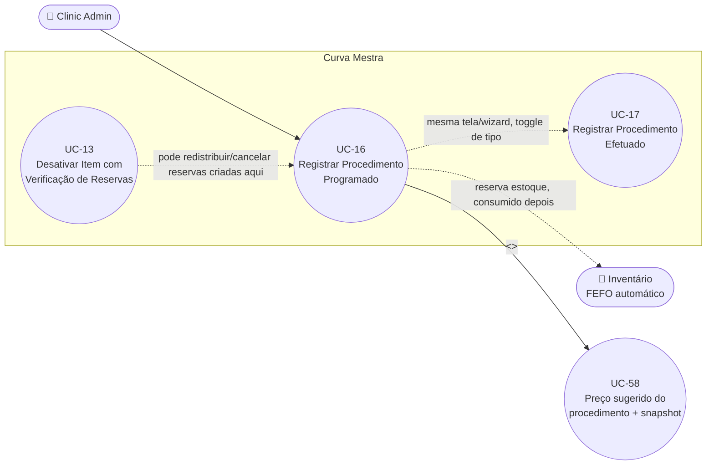

# UC-16: Registrar Procedimento Programado

**Projeto:** Curva Mestra
**Data de Criação:** 14/07/2026
**Autor:** Guilherme Scandelari (via uml-use-case-writer)
**Status:** Aprovado
**Módulo/Contexto:** Procedimentos
**Versão:** 1.3.1

> Um Clinic Admin registra um procedimento agendado para o futuro, reservando automaticamente os produtos necessários do inventário (alocação FEFO — validade mais próxima primeiro), sem consumir o estoque imediatamente. É uma das duas variantes de um mesmo wizard compartilhado (`/clinic/requests/new`) — a outra é **UC-17 (Registrar Procedimento Efetuado)**, que consome o estoque na hora. As duas compartilham a mesma tela, o mesmo mecanismo de aplicação de protocolo, e divergem principalmente a partir da confirmação: `createSolicitacaoWithConsumption` (aqui) reserva; `createSolicitacaoEfetuada` (UC-17) debita direto. **[Novo em v1.3 — UC-58]** O wizard também registra a **duração** (min) e a **forma de pagamento** (Pix/Dinheiro, Débito, Crédito — apenas informativa) do procedimento e mostra ao Clinic Admin o **preço sugerido** pela hora clínica (custo de material + hora clínica, nas três formas de pagamento); ao confirmar, grava um snapshot dessa precificação numa subcoleção legível só por `clinic_admin`. Regras e fórmulas completas em **UC-58 (Precificar Protocolos pela Hora Clínica)**.

---

## 1. Diagrama UML (Mermaid)

```mermaid
flowchart LR
    ClinicAdmin([👤 Clinic Admin])
    Inventario([🔧 Inventário\nFEFO automático])

    subgraph Sistema["Curva Mestra"]
        UC16(("UC-16\nRegistrar Procedimento\nProgramado"))
        UC17(("UC-17\nRegistrar Procedimento\nEfetuado"))
        UC13(("UC-13\nDesativar Item com\nVerificação de Reservas"))
    end

    UC58(("UC-58\nPreço sugerido do\nprocedimento + snapshot"))

    ClinicAdmin --> UC16
    UC16 -->|"<<include>>"| UC58
    UC16 -.->|mesma tela/wizard, toggle de tipo| UC17
    UC16 -.->|reserva estoque, consumido depois| Inventario
    UC13 -.->|pode redistribuir/cancelar reservas criadas aqui| UC16
```

---

## 2. Atores

### 2.1 Ator Primário
**Clinic Admin** — a página redireciona (via `useEffect`) para `/clinic/requests` quem não for `clinic_admin` (`claims.role !== 'clinic_admin'`) — checagem real de UI aqui, ao contrário de vários UCs anteriores do módulo de Inventário (UC-11, UC-14). **[CORRIGIDO — PR #344, ver RN-10]** Até o PR #344, essa restrição era aplicada só na interface: a regra do Firestore para `tenants/{tenantId}/solicitacoes` caía na regra genérica de subcoleção do tenant, que permitia escrita a qualquer usuário do tenant, incluindo `clinic_user`. Hoje, a escrita em `tenants/{tenantId}/solicitacoes/{solicitacaoId}` exige, também no Firestore, `belongsToTenant(tenantId) && hasRole('clinic_admin')`.

### 2.2 Atores Secundários / Sistemas Externos
Nenhum.

---

## 3. Pré-condições
- Usuário autenticado com role `clinic_admin`.
- Existem itens de inventário ativos, com `quantidade_disponivel > 0` e não vencidos (`dt_validade > agora`) — só esses entram na lista de seleção.
- (Opcional) Existem protocolos ativos cadastrados no tenant, para uso do atalho de pré-preenchimento.

---

## 4. Pós-condições

### 4.1 Sucesso (Garantias de Sucesso)
- Um documento é criado em `tenants/{tenantId}/solicitacoes` com `status: "agendada"` e `produtos_solicitados` detalhado por item.
- Para cada produto, `quantidade_reservada` é incrementada e `quantidade_disponivel` é decrementada na mesma quantidade (reserva, não consumo).
- Um log de auditoria (`inventory_activity`, tipo `"reserva"`) é gravado por produto.
- Tudo em uma única transação atômica (`runTransaction`).
- **[Novo em v1.3 — UC-58]** A solicitação grava também `forma_pagamento` (`pix_dinheiro` padrão, `debito` ou `credito`) e `duracao_minutos` — este **somente** quando o campo "Duração (min)" estiver preenchido (digitado ou vindo do protocolo); nenhum valor derivado dos custos fixos é gravado na solicitação.
- **[Novo em v1.3 — UC-58]** Depois do sucesso da transação, fora dela, se a configuração de custos fixos (`tenants/{tenantId}/financeiro/custo_hora`) foi lida com sucesso e existe, um snapshot da precificação é gravado em `tenants/{tenantId}/precificacao_procedimentos/{solicitacaoId}` (`origem: 'criacao'`).

### 4.2 Falha (Garantias Mínimas)
- Nenhuma alteração é feita.
- **[Novo em v1.3]** Exceção: se a transação da solicitação já foi concluída e só a gravação do snapshot de precificação falhar, a solicitação e as reservas **permanecem** gravadas (best-effort — Fluxo de Exceção 8f).
- Se a causa for estoque insuficiente detectado na pré-validação, os erros específicos por produto são exibidos na tela de revisão.
- Se detectado dentro da transação (condição de corrida), a transação inteira é abortada e nada é gravado.

---

## 5. Gatilho (Trigger)
Clinic Admin acessa `/clinic/requests/new`, mantém (ou seleciona) "Procedimento Programado" como tipo, adiciona produtos e confirma.

---

## 6. Fluxo Principal (Basic Flow)

1. Clinic Admin acessa `/clinic/requests/new`. Sistema redireciona quem não é `clinic_admin`.
2. Sistema carrega, em paralelo, o inventário ativo, não vencido e com saldo (`quantidade_disponivel > 0`) do tenant, agrupado por código de produto, a lista de protocolos ativos do tenant e **[novo em v1.3]** a configuração de custos fixos (`getCustoHoraConfig`, usada só para o preço sugerido — UC-58).
3. Sistema exibe o Passo 1 ("Adicionar Produtos"), com "Procedimento Programado" pré-selecionado (é o padrão do toggle).
4. Clinic Admin preenche descrição (opcional), data do procedimento (obrigatória, não pode ser no passado), **[novo em v1.3]** "Duração (min)" (opcional, inteiro 1..1440; ajuda "Usada para calcular o custo da hora clínica. Em branco, considera 1 hora."), **[novo em v1.3]** "Forma de pagamento" (três botões — Pix/Dinheiro pré-selecionado, Débito, Crédito; "Informativa: o preço sugerido mostra as três formas.") e observações (opcional).
5. Clinic Admin seleciona um produto (por código, agregando todos os lotes) e informa a quantidade desejada; clica no botão "+".
6. Sistema valida: produto selecionado, quantidade válida (> 0), quantidade ≤ soma disponível de todos os lotes daquele código, e que o produto ainda não foi adicionado à lista (um código por vez — RN-05).
7. Sistema aloca a quantidade automaticamente entre os lotes existentes daquele produto por FEFO (First Expired, First Out): percorre os lotes já ordenados por validade crescente (herdado do agrupamento feito ao carregar o inventário) e consome de cada lote até completar a quantidade desejada, podendo gerar múltiplas linhas (uma por lote) se um único lote não for suficiente.
8. Sistema adiciona a(s) linha(s) resultante(s) à lista de produtos selecionados e mostra um toast confirmando quais lotes foram usados.
9. Clinic Admin repete os passos 5-8 para os demais produtos do procedimento (ou usa um protocolo — Fluxo Alternativo 7a). **[Novo em v1.3]** Com ao menos um produto na lista, abaixo da tabela de produtos aparece o card "Preço sugerido", recalculado a cada mudança (Fluxo Alternativo 7d).
10. Clinic Admin clica em "Revisar Procedimento" (exige data preenchida e ao menos 1 produto).
11. Sistema exibe o Passo 2 ("Revisão"): dados do procedimento (incluindo **[novo em v1.3]** "Duração" — "{n} min", com "(padrão — duração não informada)" quando o cálculo usa a hora padrão — e "Forma de pagamento"), lista de produtos com lotes/quantidades/valores, valor total, **[novo em v1.3]** o card "Preço sugerido" (somente leitura), e um aviso: "Ao confirmar, os produtos serão RESERVADOS no inventário e o procedimento será criado com status 'Agendado'. Os produtos só serão consumidos quando o procedimento for concluído."
12. Clinic Admin clica em "Confirmar e Reservar Produtos".
13. Sistema chama `createSolicitacaoWithConsumption(tenantId, uid, userName, { descricao, dt_procedimento, produtos, observacoes, protocolo_id?, protocolo_nome?, duracao_minutos?, forma_pagamento })` — **[novo em v1.3]** `duracao_minutos` só é enviado quando o campo está preenchido; a hora padrão (60 min) nunca é gravada na solicitação.
14. Service revalida a disponibilidade de cada produto (nova leitura, fora da transação) — se algo já não estiver mais disponível, retorna erros específicos sem gravar nada (Fluxo de Exceção 8a).
15. Service monta os dados detalhados de cada produto (nome, lote, quantidade, valor, `quantidade_disponivel_antes`) a partir de uma nova leitura do inventário.
16. Service determina o status inicial como `"agendada"` (sempre, para este fluxo).
17. Dentro de uma transação atômica (`runTransaction`): relê cada item do inventário envolvido e **revalida novamente** que há saldo suficiente (proteção contra condição de corrida entre os passos 14 e este ponto); cria o documento da solicitação (`status: "agendada"`, com uma entrada em `status_history` "Solicitação criada e produtos reservados"); para cada produto, incrementa `quantidade_reservada` e decrementa `quantidade_disponivel` na mesma quantidade; registra um log de auditoria por produto (`inventory_activity`, tipo `"reserva"`).
18. **[Novo em v1.3 — UC-58]** Se a transação teve sucesso e a configuração de custos foi lida e existe, sistema grava o snapshot da precificação (`salvarPrecificacaoProcedimento`, `origem: 'criacao'`), usando os `produtos_solicitados` devolvidos pelo service (os mesmos gravados na transação). Sem configuração, nenhum snapshot é gravado. Falha nesta etapa não desfaz nada (Fluxo de Exceção 8f).
19. Sistema exibe toast de sucesso: "Procedimento criado com sucesso! Os produtos foram reservados no inventário." e navega para a página de detalhe do procedimento criado (`/clinic/requests/{id}`).
20. Caso de uso é concluído com sucesso.

---

## 7. Fluxos Alternativos

### 7a. Aplicar um protocolo pré-definido (a partir do passo 5 — opcional, também disponível no modo Efetuado, UC-17)
1. Antes de adicionar produtos manualmente, Clinic Admin seleciona um protocolo no seletor "Usar Protocolo (opcional)".
2. **[Corrigido no commit `6dea748`]** Sistema identifica, via um `Set` de códigos (`codigosJaSelecionados`), quais itens do protocolo já estão presentes na lista atual de produtos selecionados (adicionados manualmente antes, ou vindos de um protocolo aplicado anteriormente) — esses itens **não são realocados**, permanecem exatamente como estavam.
3. Para cada item do protocolo que **ainda não** está na lista, sistema aplica a mesma alocação automática FEFO do passo 7 (`alocarProdutoFEFO`) e soma a quantidade efetivamente alocada; se essa quantidade for menor que a `quantidade_sugerida` do item, o código/nome do produto entra numa lista de itens deficitários (RN-09).
4. **[Corrigido no commit `6dea748`]** Sistema **acrescenta** (`[...produtosSelecionados, ...novosAlocados]`) apenas os itens novos à lista existente — deixou de **substituir inteiramente** a lista de produtos selecionados (comportamento anterior, ver RN-08/seção 14, histórico).
5. Sistema exibe um toast cujo conteúdo varia conforme o resultado: se algum item ficou com estoque insuficiente, um toast `destructive` "Protocolo aplicado com estoque insuficiente" listando os itens deficitários (sugerido vs. disponível), orientando ajuste manual; senão, se algum item já estava na lista antes, um toast informando quais produtos foram mantidos como estavam e quais foram adicionados; senão, o toast padrão "Protocolo '{nome}' aplicado. Produtos adicionados à lista. Ajuste as quantidades se necessário." Em qualquer caso, a referência do protocolo (`protocolo_id`/`protocolo_nome`) é guardada e gravada na solicitação ao final.
5a. **[Novo em v1.3 — UC-58, RN-11]** Duração: se o protocolo tem `duracao_minutos` e o campo "Duração (min)" está vazio, o campo é preenchido com a duração do protocolo; se o campo já tinha valor, ele é mantido. Se o protocolo **não** tem duração, sistema abre o diálogo "Protocolo sem duração" ("O protocolo "{nome}" não tem duração cadastrada. Será considerada 1 hora de procedimento, a menos que você informe a duração neste procedimento.", botão único "Entendi"); o campo **não** é preenchido e o preço é calculado com 60 min, com o aviso "Duração não informada — considerada 1 hora", mesmo que outros produtos sejam adicionados depois. O botão "X" (limpar protocolo) não altera a duração.
6. Clinic Admin pode, a partir daqui, adicionar mais produtos manualmente ou remover itens vindos do protocolo livremente (não é tudo-ou-nada). **[Nuance revista após o commit `6dea748`]** Selecionar um segundo protocolo (ou reselecionar o mesmo) não substitui mais a lista — passa pelo mesmo mecanismo de mesclagem do passo 2-4, mantendo o que já estava selecionado e só adicionando os itens novos. Já o botão "X" (limpar seleção de protocolo) continua com o comportamento anterior, inalterado por esta correção: apaga a lista de produtos selecionados por completo (`setProdutosSelecionados([])`).
7. Retorna ao passo 9 do fluxo principal.

### 7b. Clinic Admin remove um produto já adicionado (a partir do passo 9)
1. Clica no ícone de lixeira na linha do produto.
2. Sistema remove a linha (e, se era um dos vários lotes de uma alocação FEFO em múltiplos lotes, remove só aquele lote específico, não o produto inteiro).

### 7c. Clinic Admin volta do Passo 2 para o Passo 1 (a partir do passo 11)
1. Clica em "Voltar".
2. Sistema retorna ao Passo 1 com todos os dados/produtos preservados.

### 7d. [Novo em v1.3] Consultar o preço sugerido durante o cadastro (a partir do passo 9 — `<<include>>` de UC-58)
1. O card "Preço sugerido" mostra Duração (efetiva, com "(padrão)" quando 60 min por falta de duração) · Material (Σ quantidade × `valor_unitario` dos **lotes alocados**, não o custo médio do protocolo) · Hora clínica · Custo real e **sempre os três preços** — "Pix/Dinheiro (sem taxa de cartão)", "Débito (taxa {x}%)", "Crédito (taxa {y}%)" —, com a forma escolhida em destaque ("Forma escolhida").
2. Trocar a forma de pagamento só muda o destaque, nunca os valores. Mudar produtos, duração ou data recalcula na hora, sem salvar. O mês de referência dos custos é o da **data do procedimento**; sem data, usa o mês corrente com o aviso "Informe a data para calcular com os custos do mês do procedimento."
3. Sem configuração de custos (ou custo/hora indefinido), o card mostra só o material e o botão "Configurar custos fixos" (`/clinic/my-clinic?tab=fixed_costs`); se a leitura da configuração falhou, "Não foi possível carregar os custos fixos. Material: R$ {x}". Em ambos os casos o cadastro segue normalmente, sem snapshot. Detalhes, fórmulas e textos: UC-58, Fluxos Alternativos 7g/7h e Fluxos de Exceção 8c/8d.

---

## 8. Fluxos de Exceção

### 8a. Estoque insuficiente detectado na revalidação (a partir do passo 14)
1. Entre a montagem da lista (passos 6-9) e a confirmação (passo 12), o saldo de algum item mudou (outra solicitação consumiu, item foi desativado — UC-13, etc.) e não é mais suficiente para a quantidade selecionada, ou o item ficou inativo.
2. Service retorna `{ success: false, validationErrors: [...mensagens específicas por produto...] }`, sem gravar nada.
3. Sistema exibe os erros em destaque na própria tela de revisão (Passo 2, onde o usuário já está) e um toast "Erro ao criar procedimento".
4. Clinic Admin pode voltar ao Passo 1 para ajustar as quantidades/lotes.

### 8b. Condição de corrida detectada dentro da transação (a partir do passo 17)
1. Mesmo após passar pela revalidação do passo 14, o saldo muda novamente entre esse momento e a leitura feita dentro da transação (janela muito mais estreita, mas ainda existente).
2. A transação lança uma exceção ("Estoque insuficiente para {produto}. Disponível: X, Solicitado: Y") e é abortada — nada é gravado (nem a solicitação, nem os ajustes de inventário).
3. Sistema captura a exceção e retorna `{ success: false, error: mensagem }` — exibido como toast genérico "Erro ao criar procedimento" (sem necessariamente popular `validationErrors`, já que essa falha vem de dentro da transação, não da pré-validação).

### 8c. Data do procedimento no passado (a partir do passo 4)
1. Clinic Admin informa uma data anterior a hoje, com "Procedimento Programado" selecionado.
2. Sistema bloqueia no frontend: "Data do procedimento não pode ser no passado" (`validateStep1`) — não avança para a revisão.

### 8d. Nenhum produto adicionado (a partir do passo 10)
1. Clinic Admin tenta avançar para a revisão sem ter adicionado nenhum produto.
2. Sistema exibe toast "Adicione produtos" / "Adicione pelo menos um produto ao procedimento" e não avança.

### 8e. [Novo em v1.3] Duração inválida (a partir do passo 10)
1. O campo "Duração (min)" está preenchido com um valor que não é inteiro entre 1 e 1440 (ex.: 0).
2. Sistema exibe toast "Informe uma duração entre 1 e 1440 minutos" e não avança para a revisão. Campo vazio é válido (hora padrão).

### 8f. [Novo em v1.3] Falha ao gravar o snapshot de precificação (a partir do passo 18)
1. A transação da solicitação já foi concluída, mas a gravação de `precificacao_procedimentos/{id}` falha (rede, rule).
2. Sistema registra o erro no console e exibe o toast "Procedimento salvo, mas a precificação não foi registrada" — "O detalhe mostrará uma estimativa com os custos atuais."; segue para o toast de sucesso e a navegação ao detalhe. A solicitação e as reservas **não** são desfeitas. O detalhe passará a mostrar a "Estimativa atual" (UC-58, 7j); editar o procedimento (UC-18) grava o snapshot de novo.

---

## 9. Regras de Negócio Relacionadas

| ID | Regra | Justificativa |
|----|-------|----------------|
| RN-01 | A alocação de lotes é sempre automática por FEFO (First Expired, First Out) — a lista de lotes de um produto já vem ordenada por `dt_validade` crescente (herdada do agrupamento feito ao carregar o inventário), e a função de alocação consome do primeiro lote (o que vence primeiro) até completar a quantidade, avançando para o próximo lote só se o atual não for suficiente. O usuário não escolhe manualmente o lote neste modo (diferente de UC-17). | Confirmado por leitura de `alocarProdutoFEFO` e do agrupamento (`agruparProdutosPorCodigo`, que ordena os lotes por validade). |
| RN-02 | **[Confirmado, mesmo conceito de UC-13, mas implementação própria]** Este FEFO é uma função local da própria página (`alocarProdutoFEFO`, em `requests/new/page.tsx`) — não reutiliza nem chama a mesma lógica de `forceDeactivateInventoryItem` (UC-13). São duas implementações independentes do mesmo conceito, em arquivos diferentes, sem nenhum código compartilhado entre elas. | Confirmado por comparação direta dos dois algoritmos — mesma estratégia, implementações fisicamente distintas. |
| RN-03 | Estoque insuficiente **nunca** é permitido parcialmente nem negativamente — é bloqueado em até três camadas: (a) no frontend, ao tentar adicionar um produto manualmente (quantidade > soma disponível do código); (b) na pré-validação do service, antes da transação (`validateInventoryAvailability`); (c) dentro da própria transação atômica, relendo o saldo mais uma vez antes de gravar (`readInventoryInTransaction`). Se qualquer uma dessas camadas detectar insuficiência, a operação inteira é bloqueada — não há reserva parcial de uma quantidade menor que a solicitada. | Confirmado pelas três checagens encontradas no código, nos três pontos citados. |
| RN-04 | A criação da solicitação e a atualização do inventário (reserva) ocorrem na mesma transação atômica do Firestore (`runTransaction`) — ou tudo é gravado (solicitação + reservas de todos os produtos), ou nada é. | Confirmado pelo uso de `runTransaction` envolvendo tanto `transaction.set` da solicitação quanto `transaction.update` de cada item de inventário. |
| RN-05 | Não é possível adicionar o mesmo código de produto duas vezes na lista manualmente neste modo (`validateProductSelection` bloqueia com "Produto já adicionado") — para aumentar a quantidade de um produto já na lista, o usuário precisa remover a linha e adicionar novamente com a nova quantidade total (a nova alocação FEFO é recalculada do zero, podendo escolher lotes diferentes dos da primeira tentativa). | Confirmado pela checagem `produtosSelecionados.some((p) => p.produto_codigo === code)`. |
| RN-06 | A data do procedimento não pode ser uma data passada neste modo (`validateStep1`) — deve ser hoje ou futura. | Confirmado pela validação `dtProcedimento < dataHojeString` (bloqueia) quando `tipoProcedimento !== 'efetuado'`. |
| RN-07 | O protocolo aplicado (`protocolo_id`/`protocolo_nome`) é gravado na solicitação mesmo que o usuário tenha editado manualmente a lista de produtos depois de aplicá-lo — não há verificação de que a lista final ainda corresponde ao protocolo original. | Confirmado — o payload de criação sempre inclui `protocolo_id`/`protocolo_nome` se um protocolo foi selecionado em algum momento, independente de edições posteriores à lista. |
| RN-08 | **[CORRIGIDO — commit `6dea748`]** Antes, aplicar um protocolo (Fluxo Alternativo 7a) **substituía** inteiramente a lista de produtos já selecionados (`setProdutosSelecionados(alocados)`) — produtos adicionados manualmente antes de aplicar o protocolo eram perdidos sem aviso. Corrigido: `handleAplicarProtocolo` agora identifica, via `codigosJaSelecionados` (um `Set` dos `produto_codigo` já presentes na lista), os itens do protocolo que já estão selecionados — esses são **mantidos como estavam**, sem realocação; apenas os itens do protocolo ainda não presentes são alocados via `alocarProdutoFEFO` e **acrescentados** à lista existente (`[...produtosSelecionados, ...novosAlocados]`), não mais uma sobrescrita. | Corrigido por leitura direta de `handleAplicarProtocolo` (`src/app/(clinic)/clinic/requests/new/page.tsx`), commit `6dea748`. |
| RN-09 | **[CORRIGIDO — commit `6dea748`]** Antes, a aplicação de um protocolo **não** usava a mesma validação de estoque insuficiente do fluxo manual (`validateProductSelection`) — se a soma disponível de um produto do protocolo fosse menor que a `quantidade_sugerida`, `alocarProdutoFEFO` simplesmente alocava o que houvesse disponível, silenciosamente, sem nenhum aviso. Corrigido: para cada item do protocolo que é de fato alocado (ou seja, que não estava já na lista — RN-08), a quantidade efetivamente alocada é comparada com a `quantidade_sugerida`; se menor, o item entra numa lista de itens deficitários e, ao final, um toast `variant: 'destructive'` — "Protocolo aplicado com estoque insuficiente" — lista os itens e orienta ajuste manual, no mesmo espírito do aviso já usado na adição manual de produtos. A aplicação do protocolo **não é bloqueada** por esse aviso — o que já foi alocado permanece pré-carregado na lista, cabendo ao usuário ajustar manualmente. | Corrigido por leitura direta de `handleAplicarProtocolo` (`src/app/(clinic)/clinic/requests/new/page.tsx`), commit `6dea748`. |
| RN-10 | **[NOVO — CORRIGIDO/REFORÇADO — PR #344, commits `f3ce046` (restrição inicial) + `94cbe2e` (correção de regressão em `list`/query), branch `bugfix/firestore-rules-tenant-role-enforcement`, mergeado em `gscandelari_setup`, deploy confirmado em `curva-mestra-dev`]** A restrição de que apenas `clinic_admin` pode criar/editar/concluir/cancelar uma solicitação de procedimento (coleção `tenants/{tenantId}/solicitacoes`, usada por este UC e pelo grupo UC-17/UC-18/UC-19), antes aplicada só na interface (redirecionamento de quem não é `clinic_admin`), agora também é reforçada no Firestore: um novo bloco dedicado — `match /tenants/{tenantId}/solicitacoes/{solicitacaoId} { allow write: if belongsToTenant(tenantId) && hasRole('clinic_admin'); }` — passou a ser o único caminho de escrita possível, já que a regra genérica de subcoleção do tenant deixou de conceder `write` para qualquer subcoleção (leitura continua ampla, visível também a `clinic_user`, consistente com `/clinic/requests` ser uma tela de leitura compartilhada). Antes desta correção, a regra genérica `tenants/{tenantId}/{document=**}` concedia escrita irrestrita a qualquer usuário do tenant para `solicitacoes` como para qualquer outra subcoleção — mesmo achado estrutural documentado em UC-13/RN-09 e UC-15/RN-07, corrigido em conjunto no mesmo PR. Documentado aqui (UC-16, criação de procedimento programado) como "dono" conceitual da subcoleção `solicitacoes` por ser o primeiro ponto do ciclo de vida da solicitação; não duplicado integralmente em UC-17/UC-18/UC-19, que compartilham a mesma coleção e a mesma regra. | Confirmado por leitura de `firestore.rules` pós-deploy — bloco dedicado `tenants/{tenantId}/solicitacoes/{solicitacaoId}` com `allow write` restrito a `hasRole('clinic_admin')`; cross-referência com UC-13/RN-09 (detalhamento técnico completo da história do fix em duas etapas). |
| RN-11 | **[Novo em v1.3 — UC-58]** Duração e forma de pagamento: a duração efetiva do procedimento é (a) a do campo, se preenchida e válida (sempre prevalece); (b) senão, a do protocolo aplicado; (c) senão, **60 min** (padrão, com o aviso "Duração não informada — considerada 1 hora") — vale também sem protocolo. A solicitação grava `duracao_minutos` só quando o campo está preenchido e grava `forma_pagamento` (padrão `pix_dinheiro`). A forma de pagamento é **apenas informativa** — define só qual dos três preços fica em destaque. Ambos os campos são dados não sensíveis (legíveis por `clinic_user` e pelo consultor, como o restante da solicitação). | Decisões D9, D11 e D13 da spec `FEAT-precificacao-hora-clinica.md` (UC-58 RN-11/RN-21). Confirmado por leitura de `requests/new/page.tsx` (`duracaoDoCampo`, `resolverDuracaoProcedimento`) e `solicitacaoService.ts` (`removeUndefined` no payload). |
| RN-12 | **[Novo em v1.3 — UC-58]** Snapshot da precificação: gravado **depois** da transação da solicitação, fora dela, best-effort, em `tenants/{tenantId}/precificacao_procedimentos/{solicitacaoId}` (leitura/escrita só `clinic_admin`), somente se a configuração de custos foi lida com sucesso e existe. Mês de referência = mês da data do procedimento; material = lotes efetivamente gravados pela transação. Nenhum valor derivado dos custos fixos vai para o documento da solicitação. | Decisão D10 da spec (UC-58 RN-17 a RN-20, RN-22). Confirmado por leitura de `registrarPrecificacao` (`requests/new/page.tsx`) e de `firestore.rules`. |
| RN-13 | **[Novo em v1.3 — registro de comportamento, sem mudança na gravação]** A data do procedimento é gravada como `new Date('YYYY-MM-DD')`, isto é, **meia-noite UTC** da data escolhida (21:00 do dia anterior em Brasília). Desde o commit `34a4c73` (`fix(clinic): show procedure dates without shifting to the previous day`), a lista `/clinic/requests` e o detalhe `/clinic/requests/{id}` exibem o dia escolhido — antes, a formatação no fuso do navegador exibia o **dia anterior** no Brasil. **[v1.3.1 — commit `50a8a69`]** A leitura passou a ser feita pela função pura `dataCalendarioDoProcedimento` (`src/lib/precificacao.ts`): data gravada **exatamente à meia-noite UTC** (cadastro/edição — `new Date('YYYY-MM-DD')`) é lida em UTC; qualquer outro horário (ex.: `Timestamp.now()` gravado na conclusão antecipada, UC-19 RN-07) é lido no fuso `America/Sao_Paulo`; a exibição usa `formatarDataProcedimento` (lista, detalhe, relatório de histórico de lote) e o mês de referência do preço sugerido, `mesReferenciaDoProcedimento` (UC-58 RN-20). Para datas gravadas por este UC (sempre meia-noite UTC) o resultado é o dia escolhido. | Confirmado por leitura de `submitCreateMode` (`new Date(dtProcedimento)`), do diff do commit `34a4c73` e de `dataCalendarioDoProcedimento`/`formatarDataProcedimento` (`src/lib/precificacao.ts`, commit `50a8a69`). |

---

## 10. Requisitos Especiais / Não Funcionais

| ID | Descrição | Categoria |
|----|-----------|-----------|
| RNF-01 | A leitura do inventário para popular a tela (passo 2) já filtra `active`, `quantidade_disponivel > 0` e `dt_validade > agora` no cliente — produtos vencidos ou esgotados nunca aparecem como opção, mesmo que existam no Firestore. | Usabilidade |
| RNF-02 | Há dupla leitura do estado de cada item de inventário entre a montagem da lista na tela e a gravação final: uma leitura ao carregar a página (passo 2), uma revalidação fora de transação (passo 14), e uma terceira leitura dentro da transação (passo 17) — mais camadas de proteção contra condição de corrida do que a maioria dos outros fluxos já documentados (ex.: UC-14). | Confiabilidade |
| RNF-03 | Um log de auditoria (`inventory_activity`) é gravado por produto reservado, dentro da mesma transação, com quantidade anterior/posterior e o ID da solicitação — permite rastrear a movimentação depois. | Auditoria |

---

## 11. Frequência de Uso
Alta — é o principal ponto de entrada para registrar o consumo planejado de produtos por procedimento, núcleo do negócio.

---

## 12. Casos de Uso Relacionados
- **UC-17 (Registrar Procedimento Efetuado)** é a variante irmã deste UC, compartilhando a mesma tela/wizard (`/clinic/requests/new`) e a mesma mecânica de aplicação de protocolo — diverge a partir da confirmação (consumo imediato em vez de reserva). Também compartilha a mesma regra dedicada do Firestore para `solicitacoes` (RN-10).
- **UC-18 (Editar Procedimento Agendado)** e **UC-19 (Concluir ou Cancelar Procedimento Agendado)** dão continuidade ao ciclo de vida da solicitação criada aqui, sobre a mesma coleção `tenants/{tenantId}/solicitacoes` e a mesma regra dedicada (RN-10).
- **UC-13 (Desativar Item de Estoque com Verificação de Reservas Ativas)** pode, mais tarde, redistribuir ou cancelar as reservas criadas por este UC, caso o lote reservado precise ser desativado. Também origem do achado estrutural de regra genérica inefetiva corrigido em conjunto com RN-10 deste UC no PR #344.
- **UC-20 (Gerenciar Protocolos)** é quem cria os protocolos consumidos no Fluxo Alternativo 7a — **[v1.3]** inclusive a `duracao_minutos` que pré-preenche o campo "Duração (min)".
- **UC-58 (Precificar Protocolos pela Hora Clínica)** — **[Novo em v1.3]** `<<include>>`: o preço sugerido do procedimento, a duração, a forma de pagamento e o snapshot (Fluxo Alternativo 7d, RN-11/RN-12) são definidos lá; a configuração de custos fixos que alimenta o cálculo é feita em Minha Clínica → Custos Fixos.

---

## 13. Referências
- `src/app/(clinic)/clinic/requests/new/page.tsx`
- `src/lib/services/solicitacaoService.ts` (`createSolicitacaoWithConsumption`, `validateInventoryAvailability`, `buildProdutosDetalhados`, `readInventoryInTransaction`, `determineInitialStatus`)
- `src/lib/services/protocoloService.ts` (`listProtocolos`)
- `src/lib/services/inventoryService.ts` (`listInventory`)
- `src/lib/inventoryUtils.ts` (`agruparProdutosPorCodigo`)
- `src/types/index.ts` (`Solicitacao`, `ProdutoSolicitado`, `Protocolo`, `ProtocoloItem`)
- `firestore.rules` (bloco dedicado `tenants/{tenantId}/solicitacoes/{solicitacaoId}` exigindo `hasRole('clinic_admin')` para `write` — RN-10, corrigido/reforçado no PR #344, commits `f3ce046`/`94cbe2e`; **[v1.3]** bloco `precificacao_procedimentos/{solicitacaoId}` — RN-12)
- **[v1.3]** `src/lib/precificacao.ts` (`resolverDuracaoProcedimento`, `parseDuracaoMinutos`, `calcularPrecificacaoProcedimento`, `montarSnapshotPrecificacao`, `mesReferenciaDoProcedimento`); `src/lib/services/custoHoraService.ts` (`getCustoHoraConfig`); `src/lib/services/precificacaoProcedimentoService.ts` (`salvarPrecificacaoProcedimento`); `src/components/pricing/ProcedimentoPrecificacao.tsx`, `FormaPagamentoSelector.tsx`
- **[v1.3]** Spec `ONLY_FOR_DEVS/TASK_COMPLETED/FEAT-precificacao-hora-clinica.md` (v1.7) — PRs #383/#384; commit `34a4c73` (exibição da data — RN-13)

---

## 14. Perguntas em Aberto / Decisões Pendentes

1. **[RESOLVIDO — commit `6dea748`]** RN-08 — aplicar um protocolo deixou de substituir a lista de produtos sem aviso; produtos com o mesmo `produto_codigo` já presentes na lista (manuais ou de um protocolo anterior) agora são preservados, e apenas os itens novos do protocolo são adicionados.
2. **[RESOLVIDO — commit `6dea748`]** RN-09 — a aplicação de protocolo agora avisa (toast destrutivo) quando o estoque disponível é menor que a quantidade sugerida de algum item, em vez de descartar o déficit silenciosamente — mesmo padrão de aviso já usado na adição manual, sem bloquear a aplicação do protocolo.
3. **[Observação]** RN-02 — o FEFO deste fluxo e o de UC-13 são duas implementações independentes do mesmo conceito, sem código compartilhado; qualquer ajuste futuro no algoritmo precisaria ser replicado manualmente nos dois lugares.
4. ~~**[Nota de rastreabilidade]** "Gerenciar Protocolos" ainda não foi mapeado como UC formal.~~ **[RESOLVIDO — mapeado como UC-20]** (nota: "Concluir Procedimento Agendado" e "Editar Procedimento Agendado" já foram mapeados como UC-19 e UC-18, respectivamente).
5. **[RESOLVIDO em v1.2 — PR #344, commits `f3ce046`/`94cbe2e`]** RN-10 — a restrição de role para criar/editar/concluir/cancelar uma solicitação, antes só de interface, agora também é reforçada no Firestore: a regra genérica de subcoleção do tenant deixou de conceder `write`, e um bloco dedicado para `solicitacoes` exige `hasRole('clinic_admin')`. Documentado aqui, como "dono" conceitual da subcoleção; não duplicado integralmente em UC-17/UC-18/UC-19, que compartilham a mesma coleção e a mesma regra. Mesma correção estrutural aplicada em conjunto a UC-13/RN-09 e UC-15/RN-07.
6. **[RESOLVIDO em v1.3.1]** As duas questões de precificação herdadas de UC-58 (card do detalhe sem configuração; data após conclusão antecipada) foram corrigidas nos commits `9dba044` e `50a8a69` — ver UC-58, Seção 14.

---

## 15. Histórico de Versões

| Versão | Data | Autor | O que mudou |
|--------|------|-------|--------------|
| 1.0 | 14/07/2026 | Guilherme Scandelari | Versão inicial. Investigado do zero — confirmado que `/clinic/requests/new` é um wizard único compartilhado entre este UC e UC-17 (Registrar Procedimento Efetuado), com um toggle "Programado/Efetuado" que altera a função de serviço chamada, a validação de data, e se a seleção de lote é automática (FEFO) ou manual. Decidido documentar como dois UCs separados (UC-16/UC-17), dado que a partir da confirmação os dois seguem caminhos de código, regras de negócio e consequências de dados genuinamente diferentes (reserva vs. consumo imediato) — mesmo critério de UC-07/UC-08. A aplicação de protocolo (RN-07 a RN-09) foi documentada como Fluxo Alternativo comum às duas variantes. |
| 1.1 | 25/07/2026 | Guilherme Scandelari (via uml-use-case-writer) | **Correção de dois bugs de severidade Média (commit `6dea748`)**: RN-08 corrigida — `handleAplicarProtocolo` deixou de sobrescrever (`setProdutosSelecionados(alocados)`) a lista de produtos já selecionados; agora identifica os itens do protocolo já presentes na lista (via `codigosJaSelecionados`), mantém-nos inalterados, e apenas acrescenta (append) os itens novos alocados por FEFO. RN-09 corrigida — a aplicação de protocolo agora compara a quantidade alocada de cada item novo com a `quantidade_sugerida` e, se houver déficit, exibe um toast `destructive` "Protocolo aplicado com estoque insuficiente" listando os itens afetados, sem bloquear a aplicação. Fluxo Alternativo 7a reescrito (passos 2-6) para refletir o novo comportamento de mesclagem, incluindo a nuance de que trocar de protocolo agora também mescla (só o botão "X" continua limpando a lista por completo). Seções 9 (RN-08/RN-09) e 14 (itens 1-2) atualizadas de "confirmado/bug" para "[CORRIGIDO]". |
| 1.2 | 02/10/2026 | Guilherme Scandelari (via uml-use-case-writer) | **Correção de segurança real implementada e mergeada (PR #344, branch `bugfix/firestore-rules-tenant-role-enforcement`, commits `f3ce046` + `94cbe2e`, deploy confirmado em `curva-mestra-dev`)**: nova regra RN-10 — a subcoleção `tenants/{tenantId}/solicitacoes` (usada por este UC e pelo grupo UC-17/UC-18/UC-19) ganhou um bloco dedicado no Firestore com `write` restrito a `clinic_admin`, reforçando no banco de dados a restrição de role que antes só existia na UI; leitura permanece ampla (visível também a `clinic_user`). Documentado em UC-16 por ser o UC "dono" conceitual da criação da solicitação — não duplicado integralmente em UC-17/UC-18/UC-19. Seção 2.1, RN-10 (seção 9), item 5 da seção 14, e seções 12/13 atualizados de acordo. Mesma correção estrutural aplicada em conjunto a UC-13/RN-09 e UC-15/RN-07 (achado original). |
| 1.3 | 10/10/2026 | Guilherme Scandelari (via uml-use-case-writer) | **Feature "Precificação pela Hora Clínica" (spec `FEAT-precificacao-hora-clinica.md` v1.7, PRs #383/#384) — as-is.** O wizard ganhou os campos "Duração (min)" e "Forma de pagamento" (informativa), o card "Preço sugerido" (três preços, recalculado ao vivo) no passo 1 e na revisão, e a gravação best-effort do snapshot em `precificacao_procedimentos` após a transação. Novas RN-11 (duração/forma), RN-12 (snapshot) e RN-13 (data gravada em meia-noite UTC e exibida em UTC desde o commit `34a4c73`, que corrigiu a exibição do dia anterior); novo Fluxo Alternativo 7d e passo 5a em 7a (duração do protocolo e diálogo "Protocolo sem duração"); novos Fluxos de Exceção 8e (duração inválida) e 8f (falha do snapshot); resumo, diagrama (`<<include>>` UC-58), pós-condições 4.1/4.2, Fluxo Principal (passos 2, 4, 9, 11, 13, 18 novo, renumeração até 20), seções 12, 13 e 14 atualizados. Seção 12: a nota "Gerenciar Protocolos (UC ainda não mapeado)" foi corrigida para UC-20. Regras e textos completos ficam centralizados em UC-58. |
| 1.3.1 | 10/10/2026 | Guilherme Scandelari (via uml-use-case-writer) | RN-13 atualizada para o as-is do commit `50a8a69`: a data do procedimento é lida por `dataCalendarioDoProcedimento` (meia-noite UTC exata → UTC; outro horário → `America/Sao_Paulo`) na exibição (`formatarDataProcedimento`) e no mês de referência. Item 6 da Seção 14 marcado como resolvido (commits `9dba044`/`50a8a69`). |
