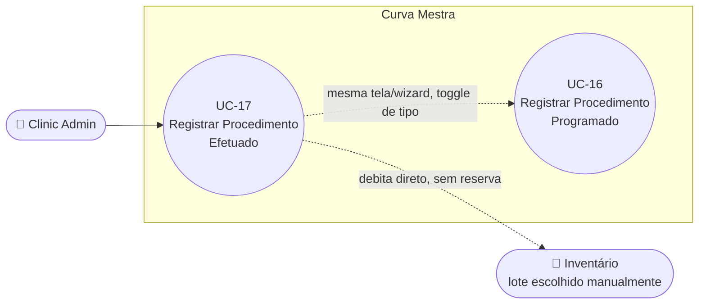

# UC-17: Registrar Procedimento Efetuado

**Projeto:** Curva Mestra
**Data de Criação:** 14/07/2026
**Autor:** Guilherme Scandelari (via uml-use-case-writer)
**Status:** Aprovado
**Módulo/Contexto:** Procedimentos
**Versão:** 1.0

> Um Clinic Admin registra um procedimento que já foi realizado, debitando imediatamente os produtos do inventário (sem reserva) e exigindo que o próprio usuário escolha manualmente o lote de cada produto utilizado (sem alocação automática). A solicitação já nasce com o status final (`"concluida"`), com uma entrada de histórico `"efetuada"` registrando que foi um lançamento retroativo. É a variante irmã de **UC-16 (Registrar Procedimento Programado)**, compartilhando a mesma tela/wizard (`/clinic/requests/new`).

---

## 1. Diagrama UML (Mermaid)

---

## 2. Atores

### 2.1 Ator Primário
**Clinic Admin** — mesma restrição de UC-16 (`useEffect` redireciona para `/clinic/requests` quem não for `clinic_admin`).

### 2.2 Atores Secundários / Sistemas Externos
Nenhum.

---

## 3. Pré-condições
- Usuário autenticado com role `clinic_admin`.
- Existem itens de inventário ativos, com `quantidade_disponivel > 0` e não vencidos — só esses entram na lista de seleção.
- (Opcional) Existem protocolos ativos cadastrados no tenant.

---

## 4. Pós-condições

### 4.1 Sucesso (Garantias de Sucesso)
- Um documento é criado em `tenants/{tenantId}/solicitacoes` com `tipo: "efetuado"`, `status_history` com duas entradas seguidas (`"efetuada"` seguida de `"concluida"`, ambas no mesmo instante, mesmo usuário) e `status: "concluida"` já persistido diretamente (o status `"efetuada"` nunca chega a ser de fato o valor do campo `status` do documento).
- Para cada produto, `quantidade_disponivel` é decrementada diretamente (sem nunca passar por `quantidade_reservada`).
- Um log de auditoria (`inventory_activity`, tipo `"consumo_imediato"`) é gravado por produto.
- Tudo em uma única transação atômica.

### 4.2 Falha (Garantias Mínimas)
Mesmo padrão de UC-16: bloqueio total, nada parcial.

---

## 5. Gatilho (Trigger)
Clinic Admin acessa `/clinic/requests/new`, seleciona "Procedimento Efetuado", escolhe produto + lote manualmente para cada item, e confirma.

---

## 6. Fluxo Principal (Basic Flow)

1. Clinic Admin acessa `/clinic/requests/new` e seleciona "Procedimento Efetuado" no toggle do Passo 1 ("Programado" é o padrão pré-selecionado; "Efetuado" precisa ser escolhido explicitamente).
2. Sistema ajusta o texto de ajuda: "Procedimento já realizado. Os produtos serão consumidos imediatamente do inventário." e passa a exigir seleção manual de lote (aparece um segundo Select "Lote Utilizado", habilitado assim que um produto é escolhido).
3. Clinic Admin preenche descrição (opcional), data do procedimento (obrigatória, **não pode ser no futuro** — RN-04) e observações (opcional).
4. Clinic Admin seleciona um produto (por código) — sistema então exibe a lista de lotes especificamente daquele código, cada um mostrando quantidade disponível e data de validade.
5. Clinic Admin seleciona manualmente o lote utilizado e informa a quantidade.
6. Sistema valida: produto e lote selecionados, quantidade válida, quantidade ≤ disponível **naquele lote específico** (não a soma de todos os lotes, diferente de UC-16 — RN-01), e que aquele lote específico ainda não foi adicionado.
7. Sistema adiciona a linha à lista de produtos selecionados (um item por lote escolhido, sem nenhuma alocação automática entre lotes).
8. Clinic Admin repete os passos 4-7 para os demais produtos/lotes utilizados no procedimento (ou usa um protocolo — Fluxo Alternativo 7a, que ainda assim aloca via FEFO automático, mesmo neste modo — RN-05).
9. Clinic Admin clica em "Revisar Procedimento".
10. Sistema exibe o Passo 2: dados do procedimento, produtos/lotes/quantidades/valores, valor total, e um aviso: "Ao confirmar, os produtos serão CONSUMIDOS IMEDIATAMENTE do inventário. O procedimento será registrado como já realizado."
11. Clinic Admin clica em "Confirmar e Consumir Produtos".
12. Sistema chama `createSolicitacaoEfetuada(tenantId, uid, userName, { descricao, dt_procedimento, produtos, observacoes, protocolo_id?, protocolo_nome? })`.
13. Service revalida a disponibilidade de cada lote específico (mesma função `validateInventoryAvailability` de UC-16, reutilizada) — se insuficiente, retorna erros sem gravar nada.
14. Service monta os detalhes de cada produto a partir de uma nova leitura.
15. Dentro de uma transação atômica: relê cada item; cria o documento da solicitação com `tipo: "efetuado"`, `status_history` com duas entradas simultâneas (`"efetuada"` → "Procedimento registrado como já realizado"; `"concluida"` → "Conclusão automática — procedimento efetuado revisado") e `status: "concluida"` já persistido diretamente; para cada produto, decrementa `quantidade_disponivel` diretamente (sem tocar `quantidade_reservada`, já que nunca houve reserva); registra um log de auditoria por produto (`inventory_activity`, tipo `"consumo_imediato"`).
16. Sistema exibe toast "Procedimento criado com sucesso! Os produtos foram consumidos do inventário." e navega para `/clinic/requests/{id}`.
17. Caso de uso é concluído com sucesso.

---

## 7. Fluxos Alternativos

### 7a. Aplicar um protocolo pré-definido (mesmo mecanismo de UC-16, Fluxo Alternativo 7a)
1. Idêntico ao descrito em UC-16 — a aplicação usa alocação automática FEFO, mesmo estando em modo "Efetuado" (a exigência de seleção manual de lote do passo 6 só se aplica a produtos adicionados manualmente depois; os itens vindos do protocolo já chegam com lote(s) definido(s) automaticamente).
2. Isso significa que, num mesmo procedimento "efetuado", pode haver uma mistura de itens com lote escolhido automaticamente (via protocolo) e itens com lote escolhido manualmente (adicionados à parte) — RN-05/seção 14.

### 7b. Clinic Admin remove um produto/lote já adicionado (a partir do passo 8)
1. Mesmo comportamento de UC-16, Fluxo Alternativo 7b.

---

## 8. Fluxos de Exceção

### 8a. Estoque insuficiente no lote específico detectado na revalidação (a partir do passo 13)
1. Mesmo padrão de UC-16, Fluxo de Exceção 8a — mas aqui a checagem é sempre contra a `quantidade_disponivel` do **lote específico** escolhido, não a soma de todos os lotes do produto.

### 8b. Condição de corrida dentro da transação (a partir do passo 15)
1. Mesmo padrão de UC-16, Fluxo de Exceção 8b.

### 8c. Data do procedimento no futuro (a partir do passo 3)
1. Clinic Admin informa uma data posterior a hoje, com "Procedimento Efetuado" selecionado.
2. Sistema bloqueia no frontend: "Procedimento efetuado não pode ter data futura" (`validateStep1`) — não avança para a revisão.

### 8d. Produto selecionado sem lote escolhido (a partir do passo 5)
1. Clinic Admin seleciona um produto mas tenta adicionar sem escolher um lote.
2. Sistema exibe toast "Selecione o lote" / "Informe o lote utilizado no procedimento" e não adiciona.

---

## 9. Regras de Negócio Relacionadas

| ID | Regra | Justificativa |
|----|-------|----------------|
| RN-01 | A seleção de lote é sempre **manual** neste modo (exceto quando o produto vem de um protocolo, RN-05) — o usuário escolhe explicitamente qual lote foi de fato utilizado no procedimento já realizado, e a checagem de estoque suficiente é feita contra a `quantidade_disponivel` daquele lote específico, não a soma de todos os lotes do produto (diferente de UC-16). | Confirmado pela existência do Select "Lote Utilizado" exclusivo deste modo, e pela checagem `quantidade > loteItem.quantidade_disponivel` (item específico, não agrupado). |
| RN-02 | O consumo é imediato e direto: `quantidade_disponivel` é decrementada diretamente na transação, sem nunca incrementar `quantidade_reservada` — diferente de UC-16, aqui não existe uma etapa intermediária de "reserva". | Confirmado por leitura de `createSolicitacaoEfetuada` — `transaction.update(item.ref, { quantidade_disponivel: ... - quantidade })`, sem nenhuma menção a `quantidade_reservada`. |
| RN-03 | A solicitação nasce com `tipo: "efetuado"` e `status: "concluida"` já persistido diretamente desde a criação — o status `"efetuada"` existe apenas como uma entrada no histórico (`status_history`), nunca é de fato o valor do campo `status` do documento. | Confirmado por leitura literal do objeto `solicitacaoData` criado — `status: 'concluida'` fixo, com `'efetuada'` aparecendo só dentro de `statusHistory`. |
| RN-04 | A data do procedimento não pode ser uma data futura neste modo (`validateStep1`) — deve ser hoje ou passada, já que representa um procedimento que já ocorreu. | Confirmado pela validação `dtProcedimento > dataHojeString` (bloqueia) quando `tipoProcedimento === 'efetuado'`. |
| RN-05 | **[Confirmado, mesmo padrão de UC-16]** A aplicação de um protocolo (Fluxo Alternativo 7a) usa alocação automática FEFO mesmo neste modo — os itens vindos do protocolo não passam pela exigência de seleção manual de lote (RN-01), diferente dos itens adicionados manualmente à parte no mesmo procedimento. Isso pode resultar em uma mistura, no mesmo procedimento "efetuado", de itens com lote escolhido automaticamente (protocolo) e itens com lote escolhido manualmente. | Confirmado — `handleAplicarProtocolo` chama `alocarProdutoFEFO` incondicionalmente, sem checar `tipoProcedimento`. |
| RN-06 | Mesma regra de bloqueio total por estoque insuficiente de UC-16 (RN-03) — sem parcial, sem negativo, em três camadas (frontend, pré-validação, transação). | Confirmado — `validateInventoryAvailability` e a checagem dentro de `readInventoryInTransaction` são as **mesmas** funções reutilizadas por ambos os fluxos (UC-16 e UC-17). |
| RN-07 | O protocolo aplicado (`protocolo_id`/`protocolo_nome`) também é gravado neste modo, com a mesma ressalva de UC-16 RN-07 (não há verificação de que a lista final ainda corresponde ao protocolo original após edições manuais). | Confirmado — mesmo padrão de payload em `createSolicitacaoEfetuada`. |

---

## 10. Requisitos Especiais / Não Funcionais

| ID | Descrição | Categoria |
|----|-----------|-----------|
| RNF-01 | `validateInventoryAvailability`, `buildProdutosDetalhados` e `readInventoryInTransaction` são funções inteiramente compartilhadas entre este UC e UC-16 — a única diferença real de código entre os dois fluxos, dentro do service, está na função de nível superior (`createSolicitacaoEfetuada` vs. `createSolicitacaoWithConsumption`) e no que cada uma escreve na transação. | Confiabilidade / Manutenibilidade |
| RNF-02 | Mesmo nível de proteção contra condição de corrida de UC-16 (revalidação fora da transação + releitura dentro da transação). | Confiabilidade |
| RNF-03 | Um log de auditoria (`inventory_activity`, tipo `"consumo_imediato"`) é gravado por produto, dentro da mesma transação. | Auditoria |

---

## 11. Frequência de Uso
Alta — usado sempre que um procedimento é lançado retroativamente (ex.: atendimento sem agendamento prévio no sistema), lado a lado com UC-16 como principal ponto de entrada de consumo do módulo.

---

## 12. Casos de Uso Relacionados
- **UC-16 (Registrar Procedimento Programado)** é a variante irmã, mesma tela/wizard, mesma mecânica de protocolo.
- **UC-13 (Desativar Item de Estoque com Verificação de Reservas Ativas)** **não** se aplica a procedimentos criados por este UC — como o consumo é imediato e não passa por `quantidade_reservada`, não há "reserva ativa" para `checkInventoryItemReservations` detectar (esse UC só considera solicitações `status: "agendada"`; solicitações criadas aqui já nascem `"concluida"`).
- Um eventual **"Gerenciar Protocolos"** (UC ainda não mapeado) é quem cria os protocolos consumidos no Fluxo Alternativo 7a.

---

## 13. Referências
- `src/app/(clinic)/clinic/requests/new/page.tsx`
- `src/lib/services/solicitacaoService.ts` (`createSolicitacaoEfetuada` e as funções compartilhadas com UC-16)
- `src/lib/services/protocoloService.ts` (`listProtocolos`)
- `src/lib/services/inventoryService.ts` (`listInventory`)
- `src/types/index.ts` (`Solicitacao`, `ProdutoSolicitado`)

---

## 14. Perguntas em Aberto / Decisões Pendentes

1. **[Observação relevante]** RN-05 — a aplicação de protocolo bypassa a exigência de seleção manual de lote deste modo, gerando uma possível mistura de critérios de seleção de lote no mesmo procedimento.
2. **[Herdado de UC-16]** As mesmas pendências RN-08/RN-09 de UC-16 (substituição da lista ao aplicar protocolo; ausência de aviso de estoque insuficiente na aplicação de protocolo) também se aplicam aqui, já que é exatamente o mesmo código (`handleAplicarProtocolo`).
3. **[Nota de rastreabilidade]** "Gerenciar Protocolos" ainda não foi mapeado como UC formal.

---

## 15. Histórico de Versões

| Versão | Data | Autor | O que mudou |
|--------|------|-------|--------------|
| 1.0 | 14/07/2026 | Guilherme Scandelari | Versão inicial. Documentado como a variante irmã de UC-16, a partir da mesma investigação de código (mesma página/wizard, mesmo arquivo de service). Divergências centrais confirmadas: seleção de lote manual e por lote específico (RN-01), consumo imediato de `quantidade_disponivel` sem nunca usar `quantidade_reservada` (RN-02), status `"concluida"` persistido diretamente desde a criação (RN-03), e validação de data invertida (não pode ser futura, RN-04). Confirmado que a aplicação de protocolo (Fluxo Alternativo 7a) usa o mesmo mecanismo de UC-16, inclusive as mesmas pendências (RN-08/RN-09 de UC-16), mesmo estando em modo "Efetuado". |
