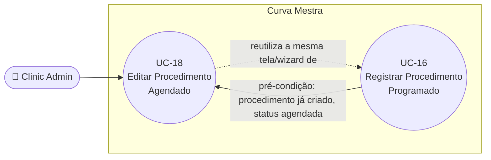

# UC-18: Editar Procedimento Agendado

**Projeto:** Curva Mestra
**Data de Criação:** 14/07/2026
**Autor:** Guilherme Scandelari (via uml-use-case-writer)
**Status:** Aprovado
**Módulo/Contexto:** Procedimentos
**Versão:** 1.0

> Um Clinic Admin edita um procedimento ainda no status `"agendada"` (descrição, data, observações e/ou lista de produtos), reajustando as reservas de estoque automaticamente. A edição reutiliza a mesma tela de criação (UC-16), pré-carregada via redirecionamento a partir de um wrapper dedicado (`/clinic/requests/{id}/edit`). O ajuste de reservas usa um algoritmo diferente do FEFO de criação: libera **todas** as reservas antigas e recria **todas** as reservas novas do zero, mesmo para produtos que não mudaram.

---

## 1. Diagrama UML (Mermaid)

---

## 2. Atores

### 2.1 Ator Primário
**Clinic Admin** — checagem dupla: o wrapper `/clinic/requests/{id}/edit` bloqueia não-admins com uma mensagem própria; e a tela reaproveitada (`new/page.tsx`) também redireciona não-admins.

### 2.2 Atores Secundários / Sistemas Externos
Nenhum.

---

## 3. Pré-condições
- Usuário autenticado com role `clinic_admin`.
- Existe uma solicitação com status **exatamente** `"agendada"` (qualquer outro status bloqueia a edição, com mensagem específica).

---

## 4. Pós-condições

### 4.1 Sucesso (Garantias de Sucesso)
- `produtos_solicitados` é totalmente substituído pela nova lista (se produtos foram alterados).
- **Todas** as reservas antigas (por item da lista antiga) são liberadas (`quantidade_reservada -=`, `quantidade_disponivel +=`) e **todas** as reservas novas (por item da lista nova) são criadas (`quantidade_reservada +=`, `quantidade_disponivel -=`) — mesmo itens que permanecem iguais entre a lista antiga e nova passam por esse ciclo liberar+reservar (RN-02).
- Campos `descricao`/`dt_procedimento`/`observacoes` são atualizados se informados.
- **Nada** é adicionado a `status_history` nem a `inventory_activity` (RN-04/seção 14).
- Tudo em uma única transação atômica.

### 4.2 Falha (Garantias Mínimas)
- Nenhuma alteração é feita; um erro específico é exibido.

---

## 5. Gatilho (Trigger)
Clinic Admin clica em "Editar Procedimento" na página de detalhe (UC-19) de uma solicitação `"agendada"`.

---

## 6. Fluxo Principal (Basic Flow)

1. Clinic Admin, na página de detalhe de um procedimento `"agendada"` (UC-19), clica em "Editar Procedimento".
2. Sistema navega para `/clinic/requests/{id}/edit` — um wrapper que não renderiza formulário próprio.
3. Wrapper busca a solicitação; se não estiver mais em status `"agendada"`, exibe erro ("Apenas procedimentos no status 'Agendado' podem ser editados") e um botão "Voltar", sem prosseguir (Fluxo de Exceção 8a).
4. Se ainda `"agendada"`, wrapper monta uma URL com todos os dados atuais como query params (descrição, data, observações, lista de produtos com `inventory_item_id`/quantidade/código/nome/lote/valor) e redireciona para `/clinic/requests/new?edit={id}&...`.
5. A tela de criação (UC-16) detecta o parâmetro `edit` e entra em modo edição: pré-preenche descrição, data, observações e a lista de produtos a partir dos query params; **não** oferece o toggle "Programado/Efetuado" nem o seletor de protocolo neste modo (ambos ficam ocultos quando `isEditMode`).
6. Assim que o inventário termina de carregar, sistema atualiza a `quantidade_disponivel` exibida para cada produto já na lista (os query params não trazem esse dado atualizado).
7. Clinic Admin altera o que for necessário: descrição, data, observações, e/ou a lista de produtos (adicionando via o mesmo fluxo de seleção + FEFO automático de UC-16, ou removendo linhas existentes).
8. Clinic Admin clica em "Revisar Procedimento".
9. Sistema exibe a tela de revisão com o aviso: "Ao confirmar, as reservas de produtos serão ajustadas automaticamente no inventário. Produtos removidos terão suas reservas liberadas, e novos produtos serão reservados."
10. Clinic Admin clica em "Confirmar Alterações".
11. Sistema chama `updateSolicitacaoAgendada(tenantId, id, uid, userName, { descricao?, dt_procedimento?, produtos?, observacoes? })`.
12. Dentro de uma transação atômica: relê a solicitação e confirma que o status ainda é `"agendada"` (proteção contra condição de corrida — RN-01); se `produtos` foi informado: relê todos os itens de inventário envolvidos (tanto os da lista antiga quanto os da lista nova); calcula, **antes** de gravar, o saldo disponível de cada item após liberar hipoteticamente as reservas antigas, e valida que esse saldo cobre as novas quantidades solicitadas (RN-03); libera **todas** as reservas antigas (devolve ao disponível) e cria **todas** as reservas novas (retira do disponível) — mesmo para itens que aparecem em ambas as listas com a mesma quantidade (RN-02); substitui `produtos_solicitados` pela nova lista detalhada; grava também os campos `descricao`/`dt_procedimento`/`observacoes` informados.
13. Sistema exibe toast "Procedimento atualizado com sucesso! As reservas de produtos foram ajustadas" e navega para `/clinic/requests/{id}`.
14. Caso de uso é concluído com sucesso.

---

## 7. Fluxos Alternativos

### 7a. Edição sem alterar produtos (a partir do passo 7)
1. Clinic Admin altera apenas descrição/data/observações, sem tocar na lista de produtos.
2. No payload enviado, `produtos` ainda é preenchido com a lista atual (inalterada) — `updateSolicitacaoAgendada`, ao receber `updates.produtos`, sempre executa o ciclo completo de liberar+reservar (passo 12), mesmo que a lista seja idêntica à anterior (RN-02).

---

## 8. Fluxos de Exceção

### 8a. Procedimento não está mais "agendada" ao abrir a tela de edição (a partir do passo 3)
1. Entre o clique em "Editar Procedimento" (na página de detalhe) e o carregamento do wrapper, o status mudou (ex.: outro usuário concluiu ou cancelou — UC-19).
2. Wrapper exibe: "Apenas procedimentos no status 'Agendado' podem ser editados" e um botão para voltar; a tela de criação nunca chega a ser carregada.

### 8b. Procedimento deixou de estar "agendada" entre abrir a edição e confirmar (a partir do passo 12)
1. Situação mais rara: o wrapper validou como `"agendada"`, mas antes da confirmação final (passos 10-11) outro usuário concluiu/cancelou o procedimento (UC-19).
2. A transação relê o status e lança "Só é possível editar solicitações no status 'Agendada'" — nada é gravado.
3. Sistema exibe toast "Erro ao atualizar procedimento" com essa mensagem.

### 8c. Estoque insuficiente para os novos produtos após liberar os antigos (a partir do passo 12)
1. Mesmo somando de volta o que seria liberado das reservas antigas, o saldo não cobre a nova quantidade solicitada de algum produto.
2. A transação lança um erro específico ("Estoque insuficiente para {produto}. Disponível (após liberar produtos antigos): X, Solicitado: Y") — nada é gravado.
3. Sistema exibe toast "Erro ao atualizar procedimento" com essa mensagem.

---

## 9. Regras de Negócio Relacionadas

| ID | Regra | Justificativa |
|----|-------|----------------|
| RN-01 | A edição só é permitida enquanto o status for exatamente `"agendada"` — verificado tanto no wrapper (leitura simples, fora de transação) quanto dentro da transação de `updateSolicitacaoAgendada` (releitura, proteção contra condição de corrida). Nenhum outro status permite edição por este caminho. | Confirmado nos dois pontos de checagem (`[id]/edit/page.tsx` e dentro da transação). |
| RN-02 | **[Confirmado, algoritmo diferente do FEFO de criação]** O ajuste de reservas na edição **não** é incremental/diferencial — libera 100% das reservas associadas aos produtos da lista antiga e recria 100% das reservas da lista nova, mesmo para itens que permanecem exatamente iguais entre as duas listas (mesmo `inventory_item_id`, mesma quantidade). Não há nenhuma comparação item a item para aplicar só a diferença. | Confirmado por leitura literal de `updateSolicitacaoAgendada` — os laços "Liberar produtos antigos" e "Reservar novos produtos" são incondicionais, sem checar se o item também está na lista nova. |
| RN-03 | Antes de validar/gravar, o cálculo de disponibilidade para os novos produtos já considera a devolução das reservas antigas ("disponível após liberar produtos antigos") — reduzir a quantidade de um produto já reservado, ou trocar de lote, não gera um falso "estoque insuficiente" só porque a reserva antiga ainda não foi formalmente liberada no momento da checagem. | Confirmado pela lógica explícita de `disponivelAposLiberar` no código. |
| RN-04 | **[Confirmado, gap de auditoria]** Diferente de toda criação de solicitação (UC-16/UC-17) e de toda mudança de status (UC-19), a edição de uma solicitação agendada **não** grava nenhuma entrada em `status_history` nem nenhum log em `inventory_activity` — apenas `updated_by`/`updated_at` são atualizados. Não há, portanto, nenhum rastro de auditoria de que os produtos de um procedimento foram alterados, nem de qual era a composição anterior. | Confirmado pela ausência de qualquer `transaction.set` em `inventory_activity` ou qualquer atualização de `status_history` dentro de `updateSolicitacaoAgendada` — bug/gap confirmado, não corrigido nesta rodada. |
| RN-05 | O toggle "Tipo de Procedimento" e o seletor de protocolo não são exibidos em modo de edição (`!isEditMode` controla a renderização de ambos) — uma vez criado, um procedimento não pode ser convertido de "programado" para "efetuado" (nem vice-versa) por este caminho, nem um protocolo pode ser (re)aplicado após a criação. | Confirmado pela condição `!isEditMode` nos dois blocos de UI. |

---

## 10. Requisitos Especiais / Não Funcionais

| ID | Descrição | Categoria |
|----|-----------|-----------|
| RNF-01 | O wrapper `/clinic/requests/{id}/edit` não renderiza nenhum formulário próprio — sempre redireciona (ou mostra um erro/skeleton) para `/clinic/requests/new` com os dados codificados na própria URL como query params (incluindo a lista completa de produtos em JSON). | Arquitetura / Usabilidade |
| RNF-02 | Como os dados da edição trafegam via query string (incluindo `produtos_solicitados` serializado em JSON), há um limite prático de tamanho de URL que poderia, em tese, ser atingido por procedimentos com um número muito grande de produtos distintos — não foi encontrado nenhum tratamento explícito para esse cenário. | Confiabilidade (risco teórico, não confirmado como problema real) |
| RNF-03 | A mesma transação atômica garante que a liberação das reservas antigas e a criação das novas ocorrem de forma tudo-ou-nada. | Confiabilidade |

---

## 11. Frequência de Uso
Ocasional — usado quando os detalhes de um procedimento já agendado precisam ser corrigidos antes de sua conclusão.

---

## 12. Casos de Uso Relacionados
- **UC-16 (Registrar Procedimento Programado)** é pré-condição (só se edita o que já foi criado) e fornece a própria tela reutilizada por este UC.
- **UC-19 (Concluir ou Cancelar Procedimento Agendado)** é onde o botão "Editar Procedimento" está disponível, e é a ação concorrente que pode tornar uma edição em andamento inválida (Fluxo de Exceção 8b).
- **UC-13 (Desativar Item de Estoque com Verificação de Reservas Ativas)** pode alterar `produtos_solicitados` de uma solicitação "agendada" por fora deste UC (redistribuição forçada) — a interação entre uma edição concorrente e uma desativação forçada não foi especificamente investigada nesta rodada.

---

## 13. Referências
- `src/app/(clinic)/clinic/requests/[id]/edit/page.tsx`
- `src/app/(clinic)/clinic/requests/new/page.tsx` (modo `isEditMode`)
- `src/lib/services/solicitacaoService.ts` (`updateSolicitacaoAgendada`, `getSolicitacao`)

---

## 14. Perguntas em Aberto / Decisões Pendentes

1. **[Confirmado, gap relevante]** RN-04 — nenhuma auditoria (`status_history`/`inventory_activity`) é gerada ao editar produtos de uma solicitação agendada.
2. **[Observação]** RN-02 — o algoritmo de ajuste é "liberar tudo e recriar tudo", não incremental; funcionalmente correto mas potencialmente confuso se alguém for auditar manualmente os dados brutos do Firestore (o `updated_at` de itens não realmente afetados também muda).
3. **[Observação]** RNF-02 — uso de query string para transportar a lista completa de produtos é um risco teórico de limite de URL, não confirmado como problema real em uso normal.
4. **[Nota de rastreabilidade]** A interação entre uma edição concorrente (este UC) e uma desativação forçada (UC-13) sobre o mesmo procedimento não foi investigada em profundidade.

---

## 15. Histórico de Versões

| Versão | Data | Autor | O que mudou |
|--------|------|-------|--------------|
| 1.0 | 14/07/2026 | Guilherme Scandelari | Versão inicial, investigada do zero. Confirmado que a edição reutiliza inteiramente a tela de criação (UC-16) via um wrapper de redirecionamento, e que o algoritmo de ajuste de reservas (`updateSolicitacaoAgendada`) é "liberar tudo, recriar tudo" — não incremental, e diferente do FEFO usado na criação. Identificado um gap de auditoria confirmado: nenhuma entrada é gravada em `status_history` nem `inventory_activity` ao editar produtos (RN-04). |
