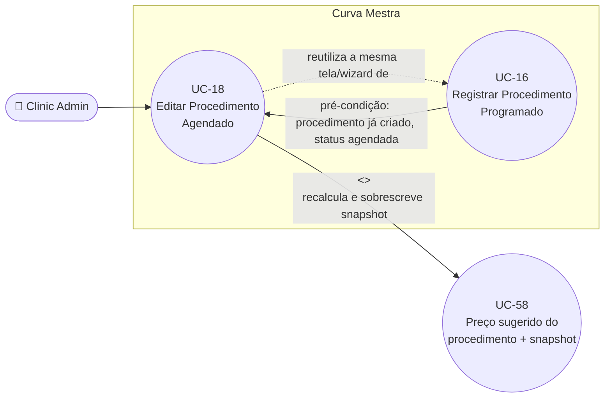

# UC-18: Editar Procedimento Agendado

**Projeto:** Curva Mestra
**Data de Criação:** 14/07/2026
**Autor:** Guilherme Scandelari (via uml-use-case-writer)
**Status:** Aprovado
**Módulo/Contexto:** Procedimentos
**Versão:** 1.2.1

> Um Clinic Admin edita um procedimento ainda no status `"agendada"` (descrição, data, observações e/ou lista de produtos), reajustando as reservas de estoque automaticamente. A edição reutiliza a mesma tela de criação (UC-16), pré-carregada via redirecionamento a partir de um wrapper dedicado (`/clinic/requests/{id}/edit`). O ajuste de reservas usa um algoritmo diferente do FEFO de criação: libera **todas** as reservas antigas e recria **todas** as reservas novas do zero, mesmo para produtos que não mudaram. **[Novo em v1.2 — UC-58]** A edição também permite alterar a **duração** e a **forma de pagamento** (pré-preenchidas a partir da solicitação), recalcula o **preço sugerido** com a configuração de custos atual e, ao confirmar, **sobrescreve** o snapshot da precificação (`origem: 'edicao'`).

---

## 1. Diagrama UML (Mermaid)

```mermaid
flowchart LR
    ClinicAdmin([👤 Clinic Admin])

    subgraph Sistema["Curva Mestra"]
        UC16(("UC-16\nRegistrar Procedimento\nProgramado"))
        UC18(("UC-18\nEditar Procedimento\nAgendado"))
    end

    UC58(("UC-58\nPreço sugerido do\nprocedimento + snapshot"))

    ClinicAdmin --> UC18
    UC18 -->|"<<include>>\nrecalcula e sobrescreve snapshot"| UC58
    UC16 -->|pré-condição: procedimento já criado, status agendada| UC18
    UC18 -.->|reutiliza a mesma tela/wizard de| UC16
```

---

## 2. Atores

### 2.1 Ator Primário
**Clinic Admin** — checagem dupla: o wrapper `/clinic/requests/{id}/edit` bloqueia não-admins com uma mensagem própria; e a tela reaproveitada (`new/page.tsx`) também redireciona não-admins.

### 2.2 Atores Secundários / Sistemas Externos
Nenhum.

---

## 3. Pré-condições
- Usuário autenticado com role `clinic_admin`.
- Existe uma solicitação com status **exatamente** `"agendada"` (qualquer outro status bloqueia a edição, com mensagem específica).

---

## 4. Pós-condições

### 4.1 Sucesso (Garantias de Sucesso)
- `produtos_solicitados` é totalmente substituído pela nova lista (se produtos foram alterados).
- **Todas** as reservas antigas (por item da lista antiga) são liberadas (`quantidade_reservada -=`, `quantidade_disponivel +=`) e **todas** as reservas novas (por item da lista nova) são criadas (`quantidade_reservada +=`, `quantidade_disponivel -=`) — mesmo itens que permanecem iguais entre a lista antiga e nova passam por esse ciclo liberar+reservar (RN-02).
- Campos `descricao`/`dt_procedimento`/`observacoes` são atualizados se informados.
- **[Novo em v1.2 — UC-58]** `forma_pagamento` é regravada; `duracao_minutos` é atualizada com o valor do campo ou **removida** (`deleteField()`) se o campo ficou vazio — nesse caso o preço passa a usar a hora padrão (60 min).
- **[Novo em v1.2 — UC-58]** Depois da transação, fora dela, se a configuração de custos foi lida e existe, o snapshot `tenants/{tenantId}/precificacao_procedimentos/{id}` é **sobrescrito** (`origem: 'edicao'`, novo `gravado_em`/`gravado_por`), recalculado com a configuração vigente na edição e o mês da data do procedimento. Não há histórico de versões do snapshot.
- **[CORRIGIDO no commit `6dea748`]** Uma nova entrada é adicionada a `status_history` (mantendo o `status` atual da solicitação, com `observacao: "Produtos do procedimento agendado editados"`), e dois conjuntos de logs são gravados em `inventory_activity` — um para os produtos antigos liberados (`tipo: "liberacao_edicao"`), outro para os produtos novos reservados (`tipo: "reserva_edicao"`) — fechando o gap de auditoria anterior (RN-04).
- Tudo em uma única transação atômica.

### 4.2 Falha (Garantias Mínimas)
- Nenhuma alteração é feita; um erro específico é exibido.
- **[Novo em v1.2]** Exceção: se a transação já foi concluída e só a regravação do snapshot falhar, a edição permanece gravada e o snapshot anterior (se havia) continua como estava (Fluxo de Exceção 8d).

---

## 5. Gatilho (Trigger)
Clinic Admin clica em "Editar Procedimento" na página de detalhe (UC-19) de uma solicitação `"agendada"`.

---

## 6. Fluxo Principal (Basic Flow)

1. Clinic Admin, na página de detalhe de um procedimento `"agendada"` (UC-19), clica em "Editar Procedimento".
2. Sistema navega para `/clinic/requests/{id}/edit` — um wrapper que não renderiza formulário próprio.
3. Wrapper busca a solicitação; se não estiver mais em status `"agendada"`, exibe erro ("Apenas procedimentos no status 'Agendado' podem ser editados") e um botão "Voltar", sem prosseguir (Fluxo de Exceção 8a).
4. Se ainda `"agendada"`, wrapper monta uma URL com todos os dados atuais como query params (descrição, data — `toISOString().split('T')[0]`, ou seja, a data em UTC —, observações, **[novo em v1.2]** `duracaoMinutos` (vazio se a solicitação não tem duração) e `formaPagamento` (vazio se legado), lista de produtos com `inventory_item_id`/quantidade/código/nome/lote/valor) e redireciona para `/clinic/requests/new?edit={id}&...`.
5. A tela de criação (UC-16) detecta o parâmetro `edit` e entra em modo edição: pré-preenche descrição, data, observações, **[novo em v1.2]** "Duração (min)" (vazio quando a solicitação não tinha duração — inclusive quando foi usada a hora padrão) e "Forma de pagamento" (legado sem forma → Pix/Dinheiro), e a lista de produtos a partir dos query params; **não** oferece o toggle "Programado/Efetuado" nem o seletor de protocolo neste modo (ambos ficam ocultos quando `isEditMode`).
6. Assim que o inventário termina de carregar, sistema atualiza a `quantidade_disponivel` exibida para cada produto já na lista (os query params não trazem esse dado atualizado).
7. Clinic Admin altera o que for necessário: descrição, data, observações, **[novo em v1.2]** duração, forma de pagamento, e/ou a lista de produtos (adicionando via o mesmo fluxo de seleção + FEFO automático de UC-16, ou removendo linhas existentes). O card "Preço sugerido" é recalculado ao vivo com a configuração de custos **atual** (Fluxo Alternativo 7b).
8. Clinic Admin clica em "Revisar Procedimento".
9. Sistema exibe a tela de revisão (com Duração, Forma de pagamento e o card "Preço sugerido" — **[novo em v1.2]**) e o aviso: "Ao confirmar, as reservas de produtos serão ajustadas automaticamente no inventário. Produtos removidos terão suas reservas liberadas, e novos produtos serão reservados."
10. Clinic Admin clica em "Confirmar Alterações".
11. Sistema chama `updateSolicitacaoAgendada(tenantId, id, uid, userName, { descricao?, dt_procedimento?, produtos?, observacoes?, duracao_minutos, forma_pagamento })` — **[novo em v1.2]** `duracao_minutos` = valor do campo ou `null` (remove o campo) quando vazio.
12. Dentro de uma transação atômica: relê a solicitação e confirma que o status ainda é `"agendada"` (proteção contra condição de corrida — RN-01); se `produtos` foi informado: relê todos os itens de inventário envolvidos (tanto os da lista antiga quanto os da lista nova); calcula, **antes** de gravar, o saldo disponível de cada item após liberar hipoteticamente as reservas antigas, e valida que esse saldo cobre as novas quantidades solicitadas (RN-03); libera **todas** as reservas antigas (devolve ao disponível) e cria **todas** as reservas novas (retira do disponível) — mesmo para itens que aparecem em ambas as listas com a mesma quantidade (RN-02); substitui `produtos_solicitados` pela nova lista detalhada; grava também os campos `descricao`/`dt_procedimento`/`observacoes` informados; **[CORRIGIDO no commit `6dea748`]** adiciona uma nova entrada a `status_history` (mantendo o `status` atual, com `observacao: "Produtos do procedimento agendado editados"`) e grava dois conjuntos de logs em `inventory_activity` via `writeActivityLogs` — um para os produtos antigos liberados (`tipo: "liberacao_edicao"`, quantidade anterior recalculada a partir da leitura antiga do item) e outro para os produtos novos reservados (`tipo: "reserva_edicao"`), ambos usando o saldo final já totalmente ajustado como `quantidade_posterior` (RN-04).
13. **[Novo em v1.2 — UC-58]** Se a transação teve sucesso e a configuração de custos foi lida e existe, sistema sobrescreve o snapshot (`salvarPrecificacaoProcedimento`, `origem: 'edicao'`) com os `produtos_solicitados` devolvidos pelo service. Falha aqui não desfaz a edição (Fluxo de Exceção 8d).
14. Sistema exibe toast "Procedimento atualizado com sucesso! As reservas de produtos foram ajustadas" e navega para `/clinic/requests/{id}`.
15. Caso de uso é concluído com sucesso.

---

## 7. Fluxos Alternativos

### 7a. Edição sem alterar produtos (a partir do passo 7)
1. Clinic Admin altera apenas descrição/data/observações, sem tocar na lista de produtos.
2. No payload enviado, `produtos` ainda é preenchido com a lista atual (inalterada) — `updateSolicitacaoAgendada`, ao receber `updates.produtos`, sempre executa o ciclo completo de liberar+reservar (passo 12), mesmo que a lista seja idêntica à anterior (RN-02) — e, por consequência, também sempre grava a entrada de auditoria e os logs de `inventory_activity` (RN-04), mesmo quando nenhum produto de fato mudou. **[v1.2]** O mesmo vale quando só a duração ou a forma de pagamento mudam; e, a cada confirmação, o snapshot de precificação também é regravado com a configuração de custos vigente naquele momento.

### 7b. [Novo em v1.2] Preço sugerido na edição (a partir do passo 7 — `<<include>>` de UC-58)
1. O card "Preço sugerido" usa as mesmas regras de UC-16, Fluxo Alternativo 7d, com a configuração de custos **atual** e o mês da data do procedimento — portanto, se os custos fixos mudaram desde o cadastro, os valores exibidos na edição diferem do snapshot gravado.
2. Como o seletor de protocolo fica oculto na edição, a duração efetiva vem só do campo (origem "informada") ou, com o campo vazio, da hora padrão de 60 min com o aviso "Duração não informada — considerada 1 hora". Um procedimento cuja duração veio do protocolo na criação reabre com o campo preenchido (a duração do protocolo foi gravada na solicitação).
3. Trocar a forma de pagamento só muda o destaque; a forma escolhida é regravada na solicitação e no snapshot.

---

## 8. Fluxos de Exceção

### 8a. Procedimento não está mais "agendada" ao abrir a tela de edição (a partir do passo 3)
1. Entre o clique em "Editar Procedimento" (na página de detalhe) e o carregamento do wrapper, o status mudou (ex.: outro usuário concluiu ou cancelou — UC-19).
2. Wrapper exibe: "Apenas procedimentos no status 'Agendado' podem ser editados" e um botão para voltar; a tela de criação nunca chega a ser carregada.

### 8b. Procedimento deixou de estar "agendada" entre abrir a edição e confirmar (a partir do passo 12)
1. Situação mais rara: o wrapper validou como `"agendada"`, mas antes da confirmação final (passos 10-11) outro usuário concluiu/cancelou o procedimento (UC-19).
2. A transação relê o status e lança "Só é possível editar solicitações no status 'Agendada'" — nada é gravado.
3. Sistema exibe toast "Erro ao atualizar procedimento" com essa mensagem.

### 8c. Estoque insuficiente para os novos produtos após liberar os antigos (a partir do passo 12)
1. Mesmo somando de volta o que seria liberado das reservas antigas, o saldo não cobre a nova quantidade solicitada de algum produto.
2. A transação lança um erro específico ("Estoque insuficiente para {produto}. Disponível (após liberar produtos antigos): X, Solicitado: Y") — nada é gravado.
3. Sistema exibe toast "Erro ao atualizar procedimento" com essa mensagem.

### 8d. [Novo em v1.2] Falha ao regravar o snapshot (a partir do passo 13)
1. A edição já foi gravada, mas o `setDoc` do snapshot falha.
2. Toast "Procedimento salvo, mas a precificação não foi registrada" (console registra o erro); a navegação continua. O snapshot anterior, se existia, permanece com os valores da última confirmação bem-sucedida; se não existia, o detalhe mostra a "Estimativa atual".

### 8e. [Novo em v1.2] Duração inválida (a partir do passo 8)
1. Mesmo comportamento de UC-16, Fluxo de Exceção 8e: toast "Informe uma duração entre 1 e 1440 minutos" e não avança.

---

## 9. Regras de Negócio Relacionadas

| ID | Regra | Justificativa |
|----|-------|----------------|
| RN-01 | A edição só é permitida enquanto o status for exatamente `"agendada"` — verificado tanto no wrapper (leitura simples, fora de transação) quanto dentro da transação de `updateSolicitacaoAgendada` (releitura, proteção contra condição de corrida). Nenhum outro status permite edição por este caminho. | Confirmado nos dois pontos de checagem (`[id]/edit/page.tsx` e dentro da transação). |
| RN-02 | **[Confirmado, algoritmo diferente do FEFO de criação]** O ajuste de reservas na edição **não** é incremental/diferencial — libera 100% das reservas associadas aos produtos da lista antiga e recria 100% das reservas da lista nova, mesmo para itens que permanecem exatamente iguais entre as duas listas (mesmo `inventory_item_id`, mesma quantidade). Não há nenhuma comparação item a item para aplicar só a diferença. | Confirmado por leitura literal de `updateSolicitacaoAgendada` — os laços "Liberar produtos antigos" e "Reservar novos produtos" são incondicionais, sem checar se o item também está na lista nova. |
| RN-03 | Antes de validar/gravar, o cálculo de disponibilidade para os novos produtos já considera a devolução das reservas antigas ("disponível após liberar produtos antigos") — reduzir a quantidade de um produto já reservado, ou trocar de lote, não gera um falso "estoque insuficiente" só porque a reserva antiga ainda não foi formalmente liberada no momento da checagem. | Confirmado pela lógica explícita de `disponivelAposLiberar` no código. |
| RN-04 | **[CORRIGIDO — commit `6dea748`]** Antes, diferente de toda criação de solicitação (UC-16/UC-17) e de toda mudança de status (UC-19), a edição de uma solicitação agendada **não** gravava nenhuma entrada em `status_history` nem nenhum log em `inventory_activity` — apenas `updated_by`/`updated_at` eram atualizados, sem nenhum rastro de auditoria de que os produtos de um procedimento foram alterados. Corrigido, dentro do mesmo ramo `if (updates.produtos)` de `updateSolicitacaoAgendada`: (a) uma nova entrada é adicionada a `status_history` (mantendo o `status` atual da solicitação — não é uma transição de status, é só o registro da edição — com `changed_by`, `changed_by_name`, `changed_at` e `observacao: "Produtos do procedimento agendado editados"`); (b) duas chamadas ao helper já existente `writeActivityLogs` (mesmo usado na criação de solicitações) gravam os logs de `inventory_activity` — uma para os produtos antigos liberados (`tipo: "liberacao_edicao"`, usando `produtosLiberados`, os produtos antigos com `quantidade_disponivel_antes` recalculado a partir da leitura antiga do inventário), outra para os novos produtos reservados (`tipo: "reserva_edicao"`, usando `produtosDetalhados`, já existente na função). Ambas as chamadas usam `disponiveisAjustados.get(...)` como `quantidade_posterior` — o mapa de ajuste final já calculado antes na mesma função. | Corrigido por leitura direta de `updateSolicitacaoAgendada` (`src/lib/services/solicitacaoService.ts`), commit `6dea748`. |
| RN-05 | O toggle "Tipo de Procedimento" e o seletor de protocolo não são exibidos em modo de edição (`!isEditMode` controla a renderização de ambos) — uma vez criado, um procedimento não pode ser convertido de "programado" para "efetuado" (nem vice-versa) por este caminho, nem um protocolo pode ser (re)aplicado após a criação. | Confirmado pela condição `!isEditMode` nos dois blocos de UI. |
| RN-06 | **[Novo em v1.2 — UC-58]** Duração e forma de pagamento editáveis: pré-preenchidas pela query string do wrapper (`duracaoMinutos`, `formaPagamento`); campo de duração vazio na confirmação **remove** `duracao_minutos` da solicitação (`deleteField()`), e o preço usa 60 min. Cada confirmação de edição **sobrescreve** o snapshot de precificação (`origem: 'edicao'`), recalculado com a configuração de custos vigente na edição e o mês da data do procedimento; não há histórico de versões. Nenhum valor derivado dos custos fixos é gravado na solicitação. | Decisões D10/D12/D13 e premissas P13/P16 da spec `FEAT-precificacao-hora-clinica.md`. Confirmado por leitura de `submitEditMode`/`registrarPrecificacao` (`requests/new/page.tsx`), `aplicarCamposPrecificacao` (`solicitacaoService.ts`) e `requests/[id]/edit/page.tsx`. |

---

## 10. Requisitos Especiais / Não Funcionais

| ID | Descrição | Categoria |
|----|-----------|-----------|
| RNF-01 | O wrapper `/clinic/requests/{id}/edit` não renderiza nenhum formulário próprio — sempre redireciona (ou mostra um erro/skeleton) para `/clinic/requests/new` com os dados codificados na própria URL como query params (incluindo a lista completa de produtos em JSON). | Arquitetura / Usabilidade |
| RNF-02 | Como os dados da edição trafegam via query string (incluindo `produtos_solicitados` serializado em JSON), há um limite prático de tamanho de URL que poderia, em tese, ser atingido por procedimentos com um número muito grande de produtos distintos — não foi encontrado nenhum tratamento explícito para esse cenário. | Confiabilidade (risco teórico, não confirmado como problema real) |
| RNF-03 | A mesma transação atômica garante que a liberação das reservas antigas e a criação das novas ocorrem de forma tudo-ou-nada — desde o commit `6dea748`, isso também vale para os dois novos conjuntos de logs de `inventory_activity` e a entrada de `status_history` (RN-04), gravados dentro da mesma transação. | Confiabilidade |

---

## 11. Frequência de Uso
Ocasional — usado quando os detalhes de um procedimento já agendado precisam ser corrigidos antes de sua conclusão.

---

## 12. Casos de Uso Relacionados
- **UC-16 (Registrar Procedimento Programado)** é pré-condição (só se edita o que já foi criado) e fornece a própria tela reutilizada por este UC.
- **UC-19 (Concluir ou Cancelar Procedimento Agendado)** é onde o botão "Editar Procedimento" está disponível, e é a ação concorrente que pode tornar uma edição em andamento inválida (Fluxo de Exceção 8b).
- **UC-13 (Desativar Item de Estoque com Verificação de Reservas Ativas)** pode alterar `produtos_solicitados` de uma solicitação "agendada" por fora deste UC (redistribuição forçada) — a interação entre uma edição concorrente e uma desativação forçada não foi especificamente investigada nesta rodada.
- **UC-58 (Precificar Protocolos pela Hora Clínica)** — **[Novo em v1.2]** `<<include>>`: recálculo do preço sugerido e regravação do snapshot (RN-06, Fluxo Alternativo 7b).

---

## 13. Referências
- `src/app/(clinic)/clinic/requests/[id]/edit/page.tsx`
- `src/app/(clinic)/clinic/requests/new/page.tsx` (modo `isEditMode`)
- `src/lib/services/solicitacaoService.ts` (`updateSolicitacaoAgendada`, `getSolicitacao`, `writeActivityLogs` — reutilizado desde o commit `6dea748` também dentro de `updateSolicitacaoAgendada`, RN-04; **[v1.2]** `aplicarCamposPrecificacao`, retorno `produtosSolicitados`)
- **[v1.2]** `src/lib/services/precificacaoProcedimentoService.ts` (`salvarPrecificacaoProcedimento`); `src/lib/precificacao.ts`; spec `ONLY_FOR_DEVS/TASK_COMPLETED/FEAT-precificacao-hora-clinica.md` (v1.7)

---

## 14. Perguntas em Aberto / Decisões Pendentes

1. **[RESOLVIDO — commit `6dea748`]** RN-04 — editar produtos de uma solicitação agendada passou a gravar auditoria: uma nova entrada em `status_history` (mantendo o status atual) e dois conjuntos de logs em `inventory_activity` (`liberacao_edicao` para os produtos antigos, `reserva_edicao` para os novos).
2. **[Observação técnica, simplificação consciente — não é um bug]** Para um item que é ao mesmo tempo "antigo" e "novo" na mesma edição (mesmo `inventory_item_id`, quantidade apenas ajustada, não trocado por outro lote), os dois logs gerados pela correção da RN-04 (`liberacao_edicao` e `reserva_edicao`) registram o **mesmo** valor final de `quantidade_posterior` — o estado já totalmente ajustado ao fim de todo o cálculo (`disponiveisAjustados`), não um estado intermediário real entre a liberação e a reserva daquele item específico. Isso é aceitável para fins de auditoria (o valor final está correto), mas quem ler os dois logs brutos no Firestore pode estranhar não ver dois valores diferentes de "posterior" para o mesmo item.
3. **[Observação]** RN-02 — o algoritmo de ajuste é "liberar tudo e recriar tudo", não incremental; funcionalmente correto mas potencialmente confuso se alguém for auditar manualmente os dados brutos do Firestore (o `updated_at` de itens não realmente afetados também muda) — e, desde a correção da RN-04, isso também significa que uma edição sem nenhuma mudança real de produtos (Fluxo Alternativo 7a) ainda gera uma entrada de `status_history` e logs de `inventory_activity` a cada confirmação.
4. **[Observação]** RNF-02 — uso de query string para transportar a lista completa de produtos é um risco teórico de limite de URL, não confirmado como problema real em uso normal.
5. **[Nota de rastreabilidade]** A interação entre uma edição concorrente (este UC) e uma desativação forçada (UC-13) sobre o mesmo procedimento não foi investigada em profundidade.
6. **[Achado verificado em código nesta revisão — preexistente, não introduzido pela precificação; recomenda-se registrar no `_MAPA-DE-BUGS-E-MELHORIAS.md` via `uc-issues-tracker`]** O wrapper `requests/[id]/edit/page.tsx` serializa cada produto com as chaves `produto_codigo`/`produto_nome`, mas `requests/new/page.tsx` (modo edição) lê `p.codigo_produto`/`p.nome_produto` — o código e o nome chegam vazios e só são recompostos pelo `useEffect` que cruza com o inventário **carregado com saldo** (`quantidade_disponivel > 0`, ativo, não vencido). Se o lote reservado não aparecer nessa lista (ex.: todo o saldo do lote está reservado por este próprio procedimento), a linha fica sem código/nome na tela de edição. O cálculo de preço não é afetado (o material usa `valor_unitario`, que chega correto). Registrado também na spec da precificação (Seção 10, Riscos) como fora de escopo.
7. **[RESOLVIDO em v1.2.1]** As questões de precificação registradas em UC-58, Seção 14 (card do detalhe sem configuração; data após conclusão antecipada) foram corrigidas nos commits `9dba044` e `50a8a69`. Nenhum impacto no fluxo de edição: o wrapper continua enviando a data como `toISOString().split('T')[0]`, correto para procedimentos `agendada` (data sempre gravada à meia-noite UTC).

---

## 15. Histórico de Versões

| Versão | Data | Autor | O que mudou |
|--------|------|-------|--------------|
| 1.0 | 14/07/2026 | Guilherme Scandelari | Versão inicial, investigada do zero. Confirmado que a edição reutiliza inteiramente a tela de criação (UC-16) via um wrapper de redirecionamento, e que o algoritmo de ajuste de reservas (`updateSolicitacaoAgendada`) é "liberar tudo, recriar tudo" — não incremental, e diferente do FEFO usado na criação. Identificado um gap de auditoria confirmado: nenhuma entrada é gravada em `status_history` nem `inventory_activity` ao editar produtos (RN-04). |
| 1.1 | 25/07/2026 | Guilherme Scandelari (via uml-use-case-writer) | **Correção de gap de auditoria de severidade Média (commit `6dea748`)**: RN-04 corrigida — dentro do ramo `if (updates.produtos)` de `updateSolicitacaoAgendada`, uma nova entrada passa a ser adicionada a `status_history` (mantendo o status "agendada", com observação da edição) e dois conjuntos de logs de `inventory_activity` são gravados via o helper já existente `writeActivityLogs` (`tipo: "liberacao_edicao"` para os produtos antigos, `tipo: "reserva_edicao"` para os novos), ambos usando o saldo final já ajustado como `quantidade_posterior`. Seções 4.1, 6 (passo 12), 9 (RN-04), 10 (RNF-03) e 13 atualizadas. Fluxo Alternativo 7a complementado com a observação de que uma edição sem mudança real de produtos também passa a gerar auditoria. Adicionada observação técnica (nova seção 14, item 2) sobre a simplificação consciente de `quantidade_posterior` ser idêntica nos dois logs para um item que é ao mesmo tempo antigo e novo — não é um bug, mas vale documentar. |
| 1.2 | 10/10/2026 | Guilherme Scandelari (via uml-use-case-writer) | **Feature "Precificação pela Hora Clínica" (spec `FEAT-precificacao-hora-clinica.md` v1.7, PRs #383/#384) — as-is.** O wrapper passa `duracaoMinutos`/`formaPagamento` na query string; a edição pré-preenche duração (vazia quando não gravada) e forma de pagamento, recalcula o card "Preço sugerido" com a configuração de custos atual e, ao confirmar, regrava `forma_pagamento`, atualiza ou remove `duracao_minutos` e sobrescreve o snapshot (`origem: 'edicao'`). Nova RN-06; novo Fluxo Alternativo 7b; novos Fluxos de Exceção 8d (falha do snapshot) e 8e (duração inválida); resumo, diagrama (`<<include>>` UC-58), pós-condições, Fluxo Principal (passos 4, 5, 7, 9, 11, 13 novo, renumeração até 15), 7a, seções 12 e 13 atualizados. Seção 14: novo item 6 — achado preexistente verificado em código (chaves `produto_codigo`/`codigo_produto` divergentes entre o wrapper e a tela de edição), recomendado registro no mapa de bugs; item 7 remete a UC-58. |
| 1.2.1 | 10/10/2026 | Guilherme Scandelari (via uml-use-case-writer) | Item 7 da Seção 14 marcado como resolvido: as questões de precificação de UC-58 foram corrigidas nos commits `9dba044`/`50a8a69`; registrado que a data enviada pelo wrapper de edição continua correta para procedimentos agendados. |
