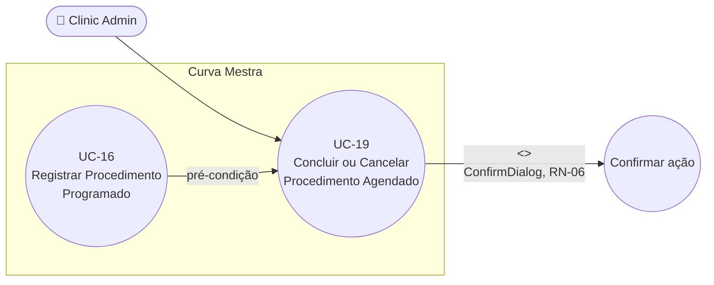

# UC-19: Concluir ou Cancelar Procedimento Agendado

**Projeto:** Curva Mestra
**Data de Criação:** 14/07/2026
**Autor:** Guilherme Scandelari (via uml-use-case-writer)
**Status:** Aprovado
**Módulo/Contexto:** Procedimentos
**Versão:** 1.1.3

> Um Clinic Admin conclui ou cancela um procedimento agendado (ou, em casos legados, um procedimento com status `"efetuada"`/`"aprovada"`), usando a **mesma** função de serviço (`updateSolicitacaoStatus`) para as duas ações — a única diferença é o status de destino informado. Concluir libera a reserva sem devolver ao estoque disponível (o consumo já é considerado efetivado); cancelar libera a reserva **e** devolve integralmente ao disponível. Documentado como um único UC, mesmo critério usado para UC-03 (`clinic_admin` como ator secundário) nesta sessão — não há dois caminhos de código distintos. **[CORRIGIDO no commit `12cc326` — RN-06]** Desde a introdução do componente reutilizável `ConfirmDialog`, tanto Concluir quanto Cancelar passaram a exigir confirmação explícita antes de executar a ação.

---

## 1. Diagrama UML (Mermaid)

```mermaid
flowchart LR
    ClinicAdmin([👤 Clinic Admin])

    subgraph Sistema["Curva Mestra"]
        UC16(("UC-16\nRegistrar Procedimento\nProgramado"))
        UC19(("UC-19\nConcluir ou Cancelar\nProcedimento Agendado"))
    end

    ClinicAdmin --> UC19
    UC16 -->|pré-condição| UC19
    UC19 -->|"<<include>>\nConfirmDialog, RN-06"| Confirm(("Confirmar ação"))
```

---

## 2. Atores

### 2.1 Ator Primário
**Clinic Admin** — os botões só aparecem para `isAdmin && status` não finalizado (`concluida`/`reprovada`/`cancelada`).

### 2.2 Atores Secundários / Sistemas Externos
Nenhum.

---

## 3. Pré-condições
- Usuário `clinic_admin` autenticado.
- Existe uma solicitação cujo status permite a transição desejada, conforme a tabela de transições válidas: `agendada → [concluida, cancelada]`; `efetuada → [concluida]` (legado); `aprovada → [concluida, cancelada]` (legado). Qualquer status já finalizado (`concluida`, `cancelada`, `reprovada`) bloqueia qualquer nova transição.

---

## 4. Pós-condições

### 4.1 Sucesso — Concluir
- Status muda para `"concluida"`.
- Para `agendada`/`aprovada` → `concluida`: `quantidade_reservada` é decrementada exatamente pela quantidade de cada produto (liberação da reserva), **sem** devolver nada a `quantidade_disponivel` (o consumo já havia sido descontado do disponível no momento da criação/reserva).
- Para `efetuada` → `concluida` (legado): nenhuma alteração no estoque (já debitado direto na criação).
- Uma nova entrada é adicionada a `status_history`.

### 4.1b Sucesso — Cancelar
- Status muda para `"cancelada"`.
- `quantidade_reservada` é decrementada e `quantidade_disponivel` é incrementada, ambas exatamente pela quantidade de cada produto (reversão completa da reserva).
- Uma nova entrada é adicionada a `status_history`.

### 4.2 Falha (Garantias Mínimas)
- Nenhuma alteração é feita; um toast de erro exibe a mensagem específica (ex.: transição inválida, solicitação não encontrada).
- **[CORRIGIDO no commit `12cc326` — UC-19-RN-06]** Se o Clinic Admin cancelar o diálogo de confirmação (`ConfirmDialog`): nenhuma chamada a `updateSolicitacaoStatus` é feita; a tela permanece como estava, sem nenhuma alteração.

---

## 5. Gatilho (Trigger)
Clinic Admin clica em "Concluir Procedimento" ou "Cancelar Procedimento" na página de detalhe de uma solicitação (`/clinic/requests/{id}`).

---

## 6. Fluxo Principal (Basic Flow) — Concluir

1. Clinic Admin acessa `/clinic/requests/{id}` de uma solicitação com status `"agendada"` (ou, em casos legados, `"efetuada"`/`"aprovada"`).
2. Sistema exibe os botões de ação disponíveis para aquele status específico — para `"agendada"`: Editar (UC-18), Concluir, Cancelar; para `"efetuada"` (legado): apenas Concluir; para `"aprovada"` (legado): Concluir e Cancelar.
3. Clinic Admin clica em "Concluir Procedimento".
4. **[CORRIGIDO no commit `12cc326` — UC-19-RN-06]** Sistema chama `requestStatusUpdate('concluida')`, que abre o `ConfirmDialog` compartilhado (`src/components/ui/confirm-dialog.tsx`) com o título/descrição apropriados e aguarda a confirmação do Clinic Admin — ver Fluxo de Exceção 8d para o cenário de cancelamento do diálogo.
5. Clinic Admin confirma no diálogo (botão "Concluir"). Sistema chama `updateSolicitacaoStatus(tenantId, id, uid, userName, 'concluida', 'Procedimento concluído')`.
6. Dentro de uma transação: relê a solicitação; valida que o status atual permite a transição para `"concluida"` (tabela de transições válidas — RN-02); relê cada item de inventário envolvido; para cada produto, se o status anterior era `"agendada"` ou `"aprovada"`, decrementa `quantidade_reservada` pela quantidade do produto, sem alterar `quantidade_disponivel` (RN-03); se o status anterior era `"efetuada"`, não faz nenhuma alteração no estoque; grava o novo status e uma nova entrada em `status_history` (status, `changed_by`, `changed_at`, `observacao`).
7. Se a data do procedimento ainda estiver no futuro, o sistema atualiza `dt_procedimento` para a data/hora atual (RN-07).
8. Sistema exibe toast "Status atualizado — Procedimento concluído com sucesso." e recarrega os dados da solicitação na própria tela.
9. Caso de uso é concluído com sucesso.

---

## 7. Fluxos Alternativos

### 7a. Cancelar em vez de concluir (a partir do passo 3, mutuamente exclusivo com o Fluxo Principal)
1. Clinic Admin clica em "Cancelar Procedimento" em vez de "Concluir".
2. **[CORRIGIDO no commit `12cc326` — UC-19-RN-06]** Sistema chama `requestStatusUpdate('cancelada')`, abrindo o mesmo `ConfirmDialog` compartilhado, com título/descrição e estilo destrutivo (botão vermelho) apropriados para esta ação.
3. Clinic Admin confirma no diálogo (botão "Cancelar Procedimento"). Sistema chama `updateSolicitacaoStatus(..., 'cancelada', 'Cancelado pelo administrador')` — mesma função usada para concluir.
4. Dentro da transação: valida a transição (`agendada` ou `aprovada` → `cancelada` — `"efetuada"` **não** pode ser cancelada, RN-02); para cada produto, decrementa `quantidade_reservada` **e** incrementa `quantidade_disponivel` pela quantidade do produto (reversão completa, RN-04); grava `status: "cancelada"` e nova entrada em `status_history`.
5. Sistema exibe toast "Status atualizado — Procedimento cancelado com sucesso." e recarrega a tela.
6. Caso de uso é concluído com sucesso (resultado: cancelado).

---

## 8. Fluxos de Exceção

### 8a. Transição inválida (a partir do passo 6, ou do passo 4 do Fluxo Alternativo)
1. O status atual da solicitação (relido dentro da transação) não permite a transição solicitada — ex.: já está `"concluida"`/`"cancelada"`/`"reprovada"` (nenhuma transição permitida a partir desses), ou é `"efetuada"` e o destino pedido é `"cancelada"` (não permitido).
2. A transação lança um erro específico ("Não é possível alterar uma solicitação {status}" ou "Transição inválida: '{de}' → '{para}'. Permitido: {lista}") — nada é gravado.
3. Sistema exibe toast "Erro" com a mensagem retornada.

### 8b. Tentar aplicar o mesmo status já vigente (a partir do passo 6)
1. O status atual já é exatamente o status de destino (cenário de corrida: dois cliques quase simultâneos, ou duas abas abertas).
2. A transação lança "A solicitação já está neste status" — nada é gravado.
3. Sistema exibe toast "Erro" com a mensagem.

### 8c. Solicitação não encontrada (a partir do passo 5/passo 3 do Fluxo Alternativo)
1. O documento foi removido entre o carregamento da tela e o clique no botão (cenário raro).
2. A transação lança "Solicitação não encontrada".
3. Sistema exibe toast "Erro".

### 8d. [CORRIGIDO no commit `12cc326`] Clinic Admin cancela o diálogo de confirmação (a partir do passo 4 do Fluxo Principal, ou do passo 2 do Fluxo Alternativo 7a)
1. Clinic Admin clica em "Cancelar" no `ConfirmDialog`, ou fecha o diálogo sem confirmar.
2. Sistema fecha o diálogo (`setConfirmAction(null)`); **nenhuma chamada** a `updateSolicitacaoStatus` é feita; nenhuma alteração é persistida.
3. A tela permanece exatamente como estava antes do clique no botão "Concluir Procedimento"/"Cancelar Procedimento".

---

## 9. Regras de Negócio Relacionadas

| ID | Regra | Justificativa |
|----|-------|----------------|
| RN-01 | Concluir e Cancelar são a **mesma** função de serviço (`updateSolicitacaoStatus`), parametrizada apenas pelo status de destino (`'concluida'` ou `'cancelada'`) — não existem dois caminhos de código distintos. | Confirmado por leitura de `[id]/page.tsx`: `handleStatusUpdate(newStatus: 'concluida' | 'cancelada', observacao?)` chama sempre a mesma função. |
| RN-02 | As transições válidas são definidas por uma tabela fixa: `agendada → [concluida, cancelada]`; `efetuada → [concluida]` (legado — não pode ser cancelada); `aprovada → [concluida, cancelada]` (legado); `criada → [agendada, cancelada]` (legado, não exposto nesta tela). Qualquer solicitação já em `concluida`, `cancelada` ou `reprovada` é terminal — nenhuma transição posterior é permitida. | Confirmado pela constante `VALID_TRANSITIONS` e pela checagem prévia de status terminais dentro de `updateSolicitacaoStatus`. |
| RN-03 | Concluir uma solicitação `"agendada"` ou `"aprovada"` libera a reserva (`quantidade_reservada -= quantidade`) **sem** devolver nada a `quantidade_disponivel` — o raciocínio é que o disponível já foi decrementado no momento da criação/reserva, e concluir apenas "efetiva" esse consumo que já estava contabilizado. | Confirmado pelo comentário explícito no código ("AGENDADA → CONCLUÍDA: libera reserva (consumo efetivo já ocorreu na criação)") e pela ausência de qualquer alteração em `quantidade_disponivel` nesse ramo. |
| RN-04 | Cancelar uma solicitação `"agendada"` ou `"aprovada"` libera a reserva **e** devolve integralmente a quantidade a `quantidade_disponivel` — reversão completa, como se a solicitação nunca tivesse reservado nada. | Confirmado pelo código do ramo "AGENDADA → CANCELADA". |
| RN-05 | A quantidade liberada/devolvida é sempre exatamente `produto.quantidade`, o valor gravado em `produtos_solicitados` no momento da criação (ou da última edição — UC-18) — não é recalculada nem relida de nenhuma outra fonte no momento da conclusão/cancelamento. | Confirmado pela leitura direta de `produto.quantidade` (do documento da solicitação) em todo o laço de atualização de estoque de `updateSolicitacaoStatus`. |
| RN-06 | **[CORRIGIDO no commit `12cc326`, PR #355 (branch `chore/patch-10-correcoes-baixa-severidade-2`), release v1.11.0 — UC-19-RN-06]** Concluir e Cancelar agora exigem confirmação explícita antes de executar: `[id]/page.tsx` passou a usar o componente reutilizável `ConfirmDialog` (`src/components/ui/confirm-dialog.tsx`, extraído neste mesmo commit), abrindo o diálogo via `requestStatusUpdate(status, observacao?)` em vez de chamar `handleStatusUpdate` diretamente a partir do clique no botão. Um follow-up (commit `53bd781`) marcou a chamada assíncrona dentro do `onConfirm` com `void`, para alinhar com o lint do SonarCloud sem alterar o comportamento. **Nota histórica:** até esta correção, ao contrário de UC-13 (desativação de item), o clique no botão já disparava a chamada ao service diretamente, sem nenhuma confirmação adicional (dialog, "tem certeza?"). | Confirmado por leitura de `[id]/page.tsx` pós-correção — novo estado `confirmAction`, nova função `requestStatusUpdate`, e `ConfirmDialog` renderizado ao final do componente, com `onConfirm` chamando `handleStatusUpdate(confirmAction.status, confirmAction.observacao)`. |
| RN-07 | Ao concluir (não ao cancelar), se a data do procedimento (`dt_procedimento`) ainda estiver no futuro, ela é automaticamente atualizada para a data/hora da conclusão — a lógica assume que, se o procedimento está sendo marcado como concluído antes da data originalmente agendada, a data "real" passa a ser agora. | Confirmado pelo bloco de código específico para `newStatus === 'concluida'` que compara `dt_procedimento` com "hoje". |
| RN-08 | **[Decisão de produto tomada, implementação pendente]** O identificador exibido no título da página de detalhe (`h2`, hoje `Procedimento #{solicitacaoId.substring(0, 8)}` — os 8 primeiros caracteres brutos do ID do documento Firestore, sem nenhuma formatação amigável) será substituído por um identificador de sessão mais legível, no padrão `SES-XXXXXX`. É **puramente uma mudança de formatação de exibição**: o código gerado deve ser derivado deterministicamente do próprio `id` do documento já existente (ex.: prefixo `SES-` + parte do ID em maiúsculas, ou hash curto determinístico do ID) — explicitamente **não** é um contador sequencial/incremental por ano ou por clínica, para não exigir transação Firestore adicional de controle de colisão. Não precisa ser pesquisável nem aparecer como chave em relatórios/exportações — serve apenas para tornar a tela de detalhe mais amigável do que o ID bruto do Firestore. A listagem (`/clinic/requests`) não exibe nenhum identificador hoje (nem bruto, nem formatado) — não há inconsistência a corrigir lá. | Decisão tomada com o usuário durante a elicitação do que originalmente seria um UC novo (UC-51, "Módulo Procedimentos", motivado por uma promessa da landing page de um "identificador anônimo de sessão"). O escopo foi reduzido, após esclarecimento, a esta única mudança de apresentação — sem tipo de procedimento categorizado (descartado) e sem painel de "histórico do lote" (remanejado para UC-51). Por não introduzir ator, gatilho, entidade ou fluxo novo, foi absorvida como nova regra de negócio aqui, na tela de detalhe que este UC já documenta (Seção 5, Gatilho). Nenhum documento UC-51 próprio foi criado. |

---

## 10. Requisitos Especiais / Não Funcionais

| ID | Descrição | Categoria |
|----|-----------|-----------|
| RNF-01 | Toda a lógica de transição, ajuste de estoque e gravação de histórico ocorre em uma única transação atômica (`runTransaction`), incluindo a releitura do status atual — protege contra condição de corrida entre múltiplos cliques/abas. | Confiabilidade |
| RNF-02 | O histórico de status (`status_history`) acumula todas as transições, incluindo a mensagem de observação fixa passada pelo botão ("Procedimento concluído" / "Cancelado pelo administrador") — não há campo livre para o admin personalizar essa observação no momento da ação, nem no diálogo de confirmação introduzido pela RN-06. | Usabilidade |
| RNF-03 | A UI oferece diferentes conjuntos de botões conforme o status atual (`agendada`: 3 botões; `efetuada`: 1 botão; `aprovada`: 2 botões) — refletindo diretamente a tabela `VALID_TRANSITIONS`, mas de forma duplicada (a UI decide o que mostrar de um jeito, o service valida de outro). Nenhuma inconsistência encontrada entre os dois, mas são duas fontes de verdade distintas para a mesma regra. | Manutenibilidade |

---

## 11. Frequência de Uso
Alta — junto com UC-16/UC-17, é uma das ações mais recorrentes do módulo (todo procedimento agendado eventualmente precisa ser concluído ou cancelado).

---

## 12. Casos de Uso Relacionados
- **UC-16 (Registrar Procedimento Programado)** é pré-condição — cria a solicitação `"agendada"` que este UC conclui/cancela.
- **UC-18 (Editar Procedimento Agendado)** é acessível a partir da mesma tela, para o mesmo status `"agendada"` — as duas ações competem pelo mesmo objeto (ver UC-18, Fluxo de Exceção 8b).
- **UC-13 (Desativar Item de Estoque com Verificação de Reservas Ativas)** já documentou que só considera "reserva ativa" solicitações com status `"agendada"` (não `"aprovada"`) — este UC é quem efetivamente tira uma solicitação desse estado, encerrando a janela em que UC-13 precisaria se preocupar com ela. Até a correção de RN-06, era também a referência usada para contrastar a ausência de confirmação neste UC — a partir do commit `12cc326`, as duas ações (desativar item, concluir/cancelar procedimento) passaram a compartilhar o mesmo padrão de confirmação explícita.
- **UC-26 (Aprovar Pedido de Transferência de Clínica)** e **UC-27 (Rejeitar Pedido de Transferência de Clínica)** — **[Novo, v1.1.3]** receberam, no mesmo commit `12cc326`/PR #355, a extração do componente `ConfirmDialog` reutilizado por este UC; UC-26 em particular passou a exigir confirmação para "Aprovar" (RN-01 daquele UC), mesma correção de severidade conceitual aplicada aqui.
- **UC-51 (Gerar Relatórios Gerenciais Avançados e Custeio por Procedimento, reservado)** herdará o painel de "histórico de uso por lote" originalmente cogitado para um UC-51 próprio ("Módulo Procedimentos") — não implementado aqui.

---

## 13. Referências
- `src/app/(clinic)/clinic/requests/[id]/page.tsx` (`requestStatusUpdate`, `confirmAction`, `ConfirmDialog` — RN-06)
- `src/lib/services/solicitacaoService.ts` (`updateSolicitacaoStatus`)
- `src/components/ui/confirm-dialog.tsx` (componente reutilizável de confirmação, extraído no commit `12cc326` — usado também por UC-26/UC-27)
- Commit da correção: `12cc326` (`feat(ui): adiciona dialogo de confirmacao reutilizavel`), PR #355 (branch `chore/patch-10-correcoes-baixa-severidade-2`), release v1.11.0 — introduz `ConfirmDialog` e o aplica a Concluir/Cancelar (RN-06)
- Commit de ajuste: `53bd781` (`fix(ui): marca promises soltas dos dialogos de confirmacao com void`) — ajuste de lint sobre a chamada assíncrona dentro de `onConfirm`, sem alteração de comportamento

---

## 14. Perguntas em Aberto / Decisões Pendentes

1. ~~**[Observação]** RN-06 — ausência de confirmação antes de concluir/cancelar, diferente do padrão usado em UC-13 para uma ação também irreversível.~~ **[RESOLVIDO no commit `12cc326` — UC-19-RN-06]** Ambas as ações agora exigem confirmação explícita via `ConfirmDialog`, alinhadas ao padrão de UC-13.
2. **[Nota de rastreabilidade]** Os status legados `"efetuada"` (como estado persistente) e `"aprovada"` ainda são suportados por esta tela/função, mas não são mais gerados por nenhum fluxo de criação atual (UC-16 sempre cria `"agendada"`; UC-17 já nasce `"concluida"`). Relevantes apenas para dados históricos.
3. **[Decisão tomada, código pendente]** RN-08 — identificador de sessão `SES-XXXXXX` ainda não implementado em `[id]/page.tsx` (hoje exibe `Procedimento #{id.substring(0,8)}`); decisão de formato já fechada com o usuário, cabendo a implementação a uma execução futura do `dev-task-manager`.

---

## 15. Histórico de Versões

| Versão | Data | Autor | O que mudou |
|--------|------|-------|--------------|
| 1.0 | 14/07/2026 | Guilherme Scandelari | Versão inicial. Confirmado que Concluir e Cancelar são a mesma função de serviço (`updateSolicitacaoStatus`), parametrizada pelo status de destino — documentados como um único UC, mesmo critério usado para UC-03 (`clinic_admin` como ator secundário) nesta sessão, já que não há dois caminhos de código distintos. Confirmadas as regras de transição válida (RN-02), a diferença semântica entre concluir (libera reserva sem devolver ao disponível) e cancelar (libera e devolve integralmente) (RN-03/RN-04), e a ausência de qualquer diálogo de confirmação antes da ação (RN-06). |
| 1.1 | 20/07/2026 | Guilherme Scandelari (via uml-use-case-writer) | Adicionada RN-08, absorvendo o que originalmente seria um UC novo (UC-51, "Módulo Procedimentos", motivado por gap de landing page — ver `_MAPA-DE-BUGS-E-MELHORIAS.md`, Seção 7.1). Após elicitação com o usuário, o escopo de UC-51 foi reduzido de um módulo novo a uma única mudança de apresentação (identificador de sessão amigável `SES-XXXXXX`, não sequencial, derivado do ID do Firestore) — sem ator, gatilho ou entidade novos, cabendo como regra de negócio nesta tela de detalhe já documentada por este UC. Categorização de tipo de procedimento (full face, mid face, etc.) foi descartada pelo usuário; o painel "histórico do lote" foi remanejado para UC-53 (Seção 12 atualizada). Nenhum arquivo `UC-51-*.md` foi criado. |
| 1.1.1 | 20/07/2026 | Guilherme Scandelari (via uml-use-case-writer) | Correção pontual de referência cruzada: a coluna "Justificativa" da RN-08 (Seção 9) e a Seção 12 (Casos de Uso Relacionados) citavam "remanejado para UC-53" / "UC-53 (Expansão de Relatórios Gerenciais, reservado)" para o painel de "histórico do lote"; após renumeração da reserva de UCs em `_MAPA-DE-BUGS-E-MELHORIAS.md` (v3.9), o que era UC-53 (Expansão de Relatórios Gerenciais) passou a ser UC-52 — texto atualizado de "UC-53" para "UC-52" nas duas ocorrências (Seção 9 e Seção 12). Nenhuma mudança de conteúdo substantivo do achado. |
| 1.1.2 | 20/07/2026 | Guilherme Scandelari (via uml-use-case-writer) | Nova correção pontual de referência cruzada, mesma causa raiz de antes: uma segunda reserva "UC-51" (desta vez "Investimentos & ROI", motor de custeio) também foi cogitada, investigada e descartada como UC próprio — absorvida dentro do que era "UC-52" (Expansão de Relatórios Gerenciais), que por sua vez foi renumerado para **UC-51** em `_MAPA-DE-BUGS-E-MELHORIAS.md` (v3.10). Texto atualizado de "UC-52" para "UC-51" nas duas ocorrências restantes (Seção 9, Justificativa da RN-08; e Seção 12, Casos de Uso Relacionados). Nenhuma mudança de conteúdo substantivo do achado — apenas a segunda correção consecutiva de referência cruzada causada por renumeração no mapa. |
| 1.1.3 | 04/10/2026 | Guilherme Scandelari (via uml-use-case-writer) | **Fechamento de RN-06 (severidade Baixa), commit `12cc326` (+ ajuste de lint `53bd781`), PR #355 (branch `chore/patch-10-correcoes-baixa-severidade-2`), release v1.11.0.** `[id]/page.tsx` passou a usar o novo componente reutilizável `ConfirmDialog` (`src/components/ui/confirm-dialog.tsx`) antes de executar Concluir ou Cancelar — ambas as ações, antes disparadas diretamente pelo clique no botão, agora exigem confirmação explícita em um diálogo modal, alinhando-se ao padrão já usado em UC-13. Atualizados resumo do cabeçalho, diagrama (Seção 1, novo nó "Confirmar ação"), Pós-condição 4.2, Fluxo Principal (novo passo 4, renumeração), Fluxo Alternativo 7a (passos 2-3 reescritos), novo Fluxo de Exceção 8d, RN-06 (marcada `[CORRIGIDO]`), RNF-02 (nota sobre o diálogo), Casos de Uso Relacionados (Seção 12, novo vínculo com UC-26/UC-27), Referências (Seção 13) e item 1 da Seção 14 (marcado `[RESOLVIDO]`). |
