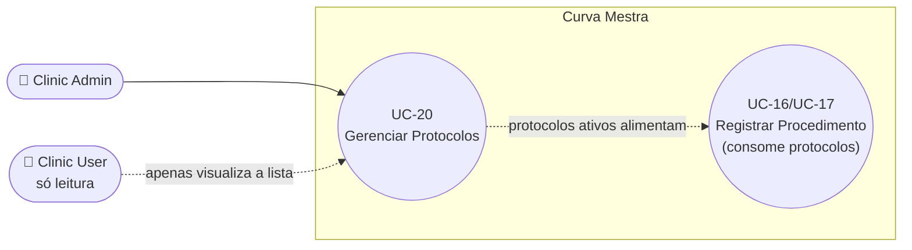

# UC-20: Gerenciar Protocolos (Criar, Editar e Remover)

**Projeto:** Curva Mestra
**Data de Criação:** 14/07/2026
**Autor:** Guilherme Scandelari (via uml-use-case-writer)
**Status:** Aprovado
**Módulo/Contexto:** Procedimentos
**Versão:** 1.0

> Um Clinic Admin cria, edita e remove (soft delete) protocolos — combinações pré-definidas de produtos e quantidades sugeridas, reutilizadas em UC-16/UC-17 para pré-preencher procedimentos recorrentes. As três ações compartilham o mesmo componente de formulário (`ProtocoloForm`) e o mesmo catálogo de sugestão de produtos (`getHistoricalProducts`, que lista **todo** produto já visto no inventário do tenant, independente de estar ativo ou com estoque disponível). Remover é sempre soft delete (`active: false`); protocolos já usados em procedimentos anteriores não são afetados, pois cada procedimento guarda apenas o nome/id do protocolo, não uma referência viva aos seus itens.

---

## 1. Diagrama UML (Mermaid)

---

## 2. Atores

### 2.1 Ator Primário
**Clinic Admin** — únicos que veem os botões "Novo Protocolo", editar e remover; as páginas de criação/edição redirecionam explicitamente quem não é `clinic_admin`.

### 2.2 Atores Secundários / Sistemas Externos
**Clinic User** — pode acessar `/clinic/protocolos` e ver a lista de protocolos ativos (somente leitura, os botões de ação não aparecem), já que a página de listagem não tem nenhum bloqueio de acesso, só oculta controles.

---

## 3. Pré-condições
- Usuário autenticado com `tenant_id` definido.
- Para criar/editar/remover: role `clinic_admin`.
- Para ter produtos disponíveis para compor um protocolo: precisa haver ao menos um item (de qualquer status) já lançado alguma vez no inventário do tenant (`getHistoricalProducts` não depende de estoque atual).

---

## 4. Pós-condições

### 4.1 Sucesso — Criar
- Um novo documento é criado em `tenants/{tenantId}/protocolos`, com `nome`, `descricao` (opcional), `itens` (array de `{codigo_produto, nome_produto, quantidade_sugerida}`), `active: true`, `created_by`, timestamps.

### 4.1b Sucesso — Editar
- O documento existente é atualizado (`updateDoc` parcial — só os campos informados: `nome`, `descricao`, `itens`) e `updated_at`; `active` não é alterado por esta ação.

### 4.1c Sucesso — Remover
- O documento é marcado `active: false` (soft delete) e `updated_at` é atualizado; o documento em si nunca é excluído do Firestore.
- Protocolos removidos somem da listagem (que só busca `active: true`) e do seletor "Usar Protocolo" de UC-16/17, mas quaisquer procedimentos já criados anteriormente referenciando `protocolo_id`/`protocolo_nome` permanecem intactos e legíveis.

### 4.2 Falha (Garantias Mínimas)
- Nenhuma alteração é feita; um toast de erro é exibido.

---

## 5. Gatilho (Trigger)
Clinic Admin acessa `/clinic/protocolos` e clica em "Novo Protocolo", no ícone de lápis de um protocolo existente, ou no ícone de lixeira.

---

## 6. Fluxo Principal (Basic Flow) — Criar

1. Clinic Admin acessa `/clinic/protocolos`. Sistema carrega e exibe todos os protocolos ativos do tenant (visível também a `clinic_user`, sem os botões de ação).
2. Clinic Admin clica em "Novo Protocolo" (ou "Criar primeiro protocolo", no estado vazio).
3. Sistema redireciona quem não é `clinic_admin` de volta para `/clinic/protocolos`.
4. Sistema carrega a lista de produtos históricos do tenant (`getHistoricalProducts` — todo código+nome de produto já visto em `tenants/{tenantId}/inventory`, de qualquer status, deduplicado e ordenado por nome) e exibe o formulário vazio (`ProtocoloForm`).
5. Clinic Admin informa o nome (obrigatório) e uma descrição (opcional).
6. Clinic Admin seleciona um produto no dropdown "Selecione um produto do inventário" (a lista já exclui produtos já adicionados ao protocolo em edição) e informa a quantidade sugerida; clica no "+".
7. Sistema adiciona o item à lista local (sem gravar ainda); o produto escolhido some do dropdown de seleção (não pode ser adicionado duas vezes).
8. Clinic Admin repete os passos 6-7 para os demais produtos do protocolo; pode ajustar a quantidade de qualquer item já adicionado diretamente na lista, ou removê-lo.
9. Clinic Admin clica em "Criar Protocolo" (desabilitado enquanto não houver nome preenchido e ao menos 1 item).
10. Sistema valida novamente (nome não vazio, ao menos 1 item) e chama `createProtocolo(tenantId, uid, { nome, descricao, itens })`.
11. Sistema exibe toast "Protocolo criado com sucesso!" e navega de volta para `/clinic/protocolos`.
12. Caso de uso é concluído com sucesso.

---

## 7. Fluxos Alternativos

### 7a. Editar um protocolo existente (fluxo próprio, a partir do passo 1)
1. Clinic Admin clica no ícone de lápis no card de um protocolo.
2. Sistema navega para `/clinic/protocolos/{id}`; redireciona quem não é `clinic_admin`.
3. Sistema busca **todos** os protocolos ativos do tenant (`listProtocolos`) e localiza o de id correspondente no resultado — se não encontrado (id inválido, ou o protocolo já foi removido/desativado por outra ação), exibe toast "Protocolo não encontrado" e redireciona de volta à lista (Fluxo de Exceção 8a).
4. Sistema também recarrega a lista de produtos históricos e pré-preenche o formulário (`ProtocoloForm`) com nome, descrição e itens atuais do protocolo.
5. Clinic Admin altera nome, descrição e/ou a lista de produtos, da mesma forma que na criação (passos 6-8 do Fluxo Principal).
6. Clinic Admin clica em "Salvar Alterações".
7. Sistema chama `updateProtocolo(tenantId, id, { nome, descricao, itens })` — uma atualização parcial (`updateDoc`), sem tocar em `active`.
8. Sistema exibe toast "Protocolo atualizado com sucesso!" e navega de volta para a lista.
9. A partir deste momento, qualquer aplicação futura do protocolo (UC-16/UC-17) usará a versão editada — procedimentos já criados anteriormente com este protocolo **não** são retroativamente alterados, pois armazenam apenas `protocolo_id`/`protocolo_nome` no momento da criação, não uma referência viva aos itens (RN-04/seção 14).

### 7b. Remover (desativar) um protocolo (fluxo próprio, a partir do passo 1)
1. Clinic Admin clica no ícone de lixeira no card de um protocolo.
2. Sistema abre um `AlertDialog` de confirmação: "Remover protocolo? O protocolo será desativado. Procedimentos já criados com este protocolo não serão afetados."
3. Clinic Admin confirma clicando em "Remover".
4. Sistema chama `deleteProtocolo(tenantId, id)` — que na verdade faz `updateDoc({ active: false, updated_at })`, não um delete real (RN-02).
5. Sistema exibe toast "Protocolo removido com sucesso" e remove o card da lista local (sem novo fetch).
6. O protocolo deixa de aparecer em `listProtocolos` (usada tanto pela própria listagem quanto pelo seletor "Usar Protocolo" de UC-16/17) — mas o documento permanece no Firestore, e poderia em tese ser reativado manualmente por alguém com acesso direto ao banco (não há nenhuma tela de "reativar protocolo" na UI).

### 7c. Clinic Admin cancela a confirmação de remoção (a partir do passo 2 de 7b)
1. Clica em "Cancelar" no `AlertDialog`.
2. Nada acontece; protocolo permanece ativo e visível.

---

## 8. Fluxos de Exceção

### 8a. Protocolo não encontrado ao tentar editar (a partir do passo 3 de 7a)
1. O id da URL não corresponde a nenhum protocolo ativo (id inválido, ou já foi removido por outra ação/aba).
2. Sistema exibe toast "Protocolo não encontrado" e redireciona para `/clinic/protocolos` automaticamente.

### 8b. Nome vazio ou nenhum produto adicionado (a partir dos passos 9 do Fluxo Principal / 6 de 7a)
1. Clinic Admin tenta salvar sem nome ou sem nenhum item — o próprio botão já vem desabilitado nesse caso (`disabled={saving || !nome.trim() || itens.length === 0}`), mas o handler também revalida com toasts específicos ("Informe o nome do protocolo" / "Adicione ao menos um produto").
2. Nada é gravado; formulário permanece na tela.

### 8c. Erro ao salvar/remover no Firestore (a partir de qualquer chamada de serviço)
1. `createProtocolo`, `updateProtocolo` ou `deleteProtocolo` lançam exceção.
2. Sistema exibe um toast destructive genérico ("Erro ao criar protocolo" / "Erro ao atualizar protocolo" / "Erro ao remover protocolo"), sem detalhar a causa.

---

## 9. Regras de Negócio Relacionadas

| ID | Regra | Justificativa |
|----|-------|----------------|
| RN-01 | Um protocolo é composto por um nome, uma descrição opcional, e uma lista de itens (`codigo_produto`, `nome_produto`, `quantidade_sugerida`) — cada código de produto só pode aparecer uma vez por protocolo (a UI impede duplicatas removendo produtos já adicionados do dropdown de seleção). | Confirmado por `ProtocoloForm` (`availableProdutos` filtra itens já presentes). |
| RN-02 | Remover um protocolo é sempre soft delete (`active: false` via `updateDoc`) — nunca um `deleteDoc` real. O documento permanece no Firestore indefinidamente, apenas oculto das consultas que filtram `active: true` (`listProtocolos`). | Confirmado por leitura literal de `deleteProtocolo`. |
| RN-03 | **[Confirmado]** Procedimentos que já usaram um protocolo no passado (UC-16/UC-17) não ficam com nenhuma referência quebrada quando esse protocolo é editado ou removido — porque a solicitação armazena apenas `protocolo_id` e `protocolo_nome` (uma cópia estática de texto/id), nunca uma referência viva aos itens do protocolo. Editar ou remover um protocolo não altera, de forma alguma, nenhum procedimento já criado. | Confirmado pela ausência de qualquer leitura de `protocolos` a partir de uma solicitação já criada, e pelo payload de criação de solicitação (`CreateSolicitacaoInput` só grava `protocolo_id`/`protocolo_nome`, nunca os itens do protocolo). |
| RN-04 | **[Confirmado]** Editar um protocolo só afeta aplicações **futuras** dele (a partir de UC-16/UC-17, Fluxo Alternativo "Aplicar um protocolo pré-definido" daqueles UCs) — como a aplicação lê `protocolo.itens` diretamente do documento no momento em que o usuário seleciona o protocolo na tela de criação de procedimento, qualquer edição feita antes dessa seleção já vale; qualquer edição feita depois de um procedimento já criado não tem efeito retroativo nenhum sobre ele (RN-03). | Confirmado pela ausência de qualquer mecanismo de versionamento ou snapshot — a aplicação sempre lê o estado atual do documento `protocolos`. |
| RN-05 | **[Confirmado, nuance relevante]** `getHistoricalProducts` não filtra por `active` nem por `quantidade_disponivel > 0` — retorna todo código de produto que **já esteve** no inventário do tenant em algum momento, incluindo produtos hoje inativos, esgotados ou vencidos. Um protocolo pode, portanto, ser criado ou editado incluindo um produto que hoje não tem nenhum estoque disponível — nesse caso, ao ser aplicado (UC-16/UC-17), esse item específico do protocolo é silenciosamente omitido ou alocado parcialmente (mesmo comportamento já documentado em UC-16, RN-09). | Confirmado por leitura literal de `getHistoricalProducts` — nenhum filtro de status é aplicado à consulta. |
| RN-06 | Não há validação de nome duplicado entre protocolos — dois (ou mais) protocolos do mesmo tenant podem ter exatamente o mesmo nome. | Confirmado pela ausência de qualquer checagem de unicidade em `createProtocolo`. |
| RN-07 | **[Mesmo padrão já visto em UC-11/13/14/15]** A restrição de que só `clinic_admin` cria/edita/remove protocolos é aplicada somente na interface (`useEffect` de redirecionamento nas páginas `novo`/`[id]`, e ocultação condicional de botões na listagem) — não existe uma regra dedicada do Firestore para a coleção `protocolos`; ela cai na regra genérica de `tenants/{tenantId}/{document=**}` (`belongsToTenant`), que permite leitura e escrita a qualquer usuário do tenant, incluindo `clinic_user`. | Confirmado pela ausência de qualquer `match /protocolos/` em `firestore.rules`. |

---

## 10. Requisitos Especiais / Não Funcionais

| ID | Descrição | Categoria |
|----|-----------|-----------|
| RNF-01 | A tela de edição busca **todos** os protocolos ativos do tenant (`listProtocolos`) e filtra pelo id no cliente, em vez de buscar diretamente o documento por id (`getDoc`) — uma consulta mais cara do que o necessário, mas sem impacto funcional perceptível para o volume esperado de protocolos por clínica. | Performance |
| RNF-02 | A lista de produtos históricos (`getHistoricalProducts`) é recarregada do zero a cada visita às telas de criar/editar — sem cache entre navegações. | Performance |
| RNF-03 | A remoção de um item da lista local após "Remover" (na tela de listagem) não recarrega os dados do servidor — a UI apenas filtra o card localmente, assumindo que a operação foi bem-sucedida. | Confiabilidade (menor) |

---

## 11. Frequência de Uso
Ocasional — protocolos são criados/ajustados esporadicamente; o uso frequente ocorre na aplicação deles (UC-16/UC-17), não na sua gestão.

---

## 12. Casos de Uso Relacionados
- **UC-16 (Registrar Procedimento Programado)** e **UC-17 (Registrar Procedimento Efetuado)** são os consumidores reais dos protocolos criados/editados aqui — via o Fluxo Alternativo "Aplicar um protocolo pré-definido" de ambos.
- Nenhuma dependência inversa: UC-16/17 nunca modificam um protocolo, apenas o leem.

---

## 13. Referências
- `src/app/(clinic)/clinic/protocolos/page.tsx`
- `src/app/(clinic)/clinic/protocolos/novo/page.tsx`
- `src/app/(clinic)/clinic/protocolos/[id]/page.tsx`
- `src/components/protocolos/ProtocoloForm.tsx`
- `src/lib/services/protocoloService.ts` (`getHistoricalProducts`, `listProtocolos`, `createProtocolo`, `updateProtocolo`, `deleteProtocolo`)
- `src/types/index.ts` (`Protocolo`, `ProtocoloItem`)
- `firestore.rules` (ausência de regra dedicada para `protocolos` — RN-07)

---

## 14. Perguntas em Aberto / Decisões Pendentes

1. **[Observação]** RN-05 — protocolos podem incluir produtos sem nenhum estoque disponível hoje, resultando em omissão silenciosa ao aplicar (mesmo gap já documentado em UC-16/RN-09).
2. **[Observação]** RN-06 — não há validação de nome duplicado entre protocolos.
3. **[Observação, mesmo padrão de UC-11/13/14/15]** RN-07 — Firestore não tem regra dedicada para `protocolos`; restrição de role é só na UI.
4. Nenhuma pendência bloqueante identificada — a mecânica de soft delete e a ausência de impacto retroativo em procedimentos já criados (RN-02 a RN-04) estão claramente confirmadas e consistentes com a própria mensagem exibida ao usuário no diálogo de remoção.

---

## 15. Histórico de Versões

| Versão | Data | Autor | O que mudou |
|--------|------|-------|--------------|
| 1.0 | 14/07/2026 | Guilherme Scandelari | Versão inicial, investigada do zero. Confirmado que Criar, Editar e Remover formam um único UC (mesmo critério já aplicado nesta sessão) — três ações simples compartilhando o mesmo componente de formulário e o mesmo catálogo de sugestão de produtos. Respondidas as quatro perguntas do levantamento: `getHistoricalProducts` é uma lista deduplicada de todo produto já visto no inventário (qualquer status), não um ranking de uso (RN-05); remover é sempre soft delete, sem impacto em procedimentos já criados, pois estes armazenam apenas `protocolo_id`/nome (RN-02/RN-03); editar só afeta aplicações futuras, nunca retroativamente (RN-04); e a restrição de role é só de interface, sem regra dedicada no Firestore (RN-07). |
