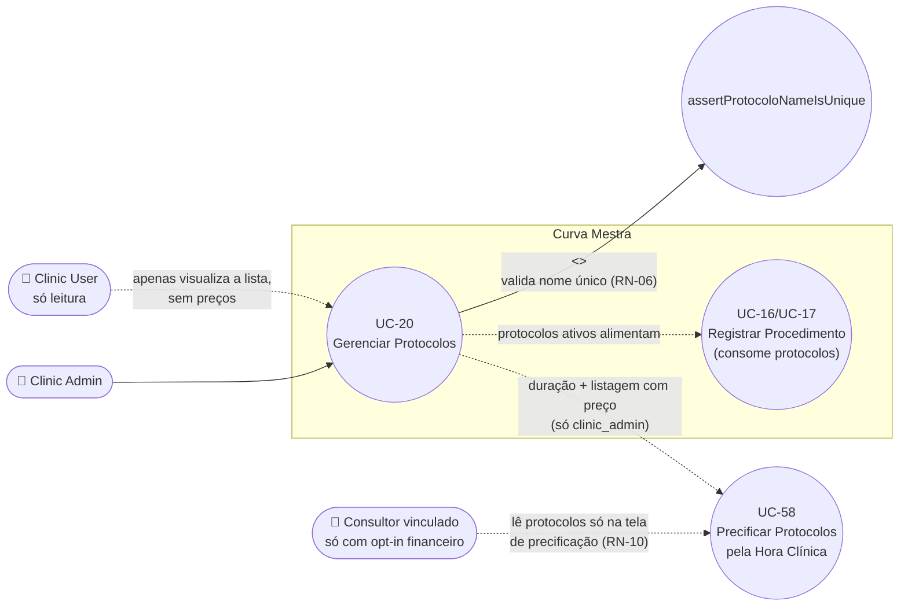

# UC-20: Gerenciar Protocolos (Criar, Editar e Remover)

**Projeto:** Curva Mestra
**Data de Criação:** 14/07/2026
**Autor:** Guilherme Scandelari (via uml-use-case-writer)
**Status:** Aprovado
**Módulo/Contexto:** Procedimentos
**Versão:** 1.2

> Um Clinic Admin cria, edita e remove (soft delete) protocolos — combinações pré-definidas de produtos e quantidades sugeridas, reutilizadas em UC-16/UC-17 para pré-preencher procedimentos recorrentes. As três ações compartilham o mesmo componente de formulário (`ProtocoloForm`) e o mesmo catálogo de sugestão de produtos (`getHistoricalProducts`, que lista **todo** produto já visto no inventário do tenant, independente de estar ativo ou com estoque disponível). Remover é sempre soft delete (`active: false`); protocolos já usados em procedimentos anteriores não são afetados, pois cada procedimento guarda apenas o nome/id do protocolo, não uma referência viva aos seus itens. **[CORRIGIDO no commit `de4b0e6` — RN-06]** Criar ou editar um protocolo com um nome já usado por outro protocolo ativo do mesmo tenant agora é bloqueado, com mensagem explicativa. **[Novo em v1.2 — UC-58]** O protocolo ganhou o campo opcional **"Duração (minutos)"** (inteiro 1..1440), usado para precificar pela hora clínica; a listagem passou a mostrar ao `clinic_admin`, em cada card, Duração · Material · Hora clínica · Custo real · Preço Pix/Dinheiro · Preço Crédito (protocolo sem duração é precificado com 1 hora). O consultor vinculado só deve ler protocolos com o compartilhamento financeiro ativo para ele (RN-10).

---

## 1. Diagrama UML (Mermaid)

```mermaid
flowchart LR
    ClinicAdmin([👤 Clinic Admin])
    ClinicUser([👤 Clinic User\nsó leitura])

    subgraph Sistema["Curva Mestra"]
        UC20(("UC-20\nGerenciar Protocolos"))
        UC1617(("UC-16/UC-17\nRegistrar Procedimento\n(consome protocolos)"))
    end

    Consultor([👤 Consultor vinculado\nsó com opt-in financeiro])
    UC58(("UC-58\nPrecificar Protocolos\npela Hora Clínica"))

    ClinicAdmin --> UC20
    ClinicUser -.->|apenas visualiza a lista,\nsem preços| UC20
    UC20 -.->|"duração + listagem com preço\n(só clinic_admin)"| UC58
    Consultor -.->|"lê protocolos só na tela\nde precificação (RN-10)"| UC58
    UC20 -.->|protocolos ativos alimentam| UC1617
    UC20 -->|"<<include>>\nvalida nome único (RN-06)"| Dup(("assertProtocoloNameIsUnique"))
```

---

## 2. Atores

### 2.1 Ator Primário
**Clinic Admin** — únicos que veem os botões "Novo Protocolo", editar e remover; as páginas de criação/edição redirecionam explicitamente quem não é `clinic_admin`.

### 2.2 Atores Secundários / Sistemas Externos
**Clinic User** — pode acessar `/clinic/protocolos` e ver a lista de protocolos ativos (somente leitura, os botões de ação não aparecem), já que a página de listagem não tem nenhum bloqueio de acesso, só oculta controles. **[v1.2]** Não vê o bloco de precificação nem o alerta de custos fixos; a tela nem tenta ler `financeiro` para ele.

**Consultor vinculado** — **[Novo em v1.2]** não acessa nenhuma tela de protocolos do Portal Clinic; lê os protocolos da clínica apenas na tela `/consultant/clinics/{tenantId}/pricing` (UC-58, Fluxo Alternativo 7f), quando o `clinic_admin` ativou o compartilhamento de dados financeiros para ele (RN-10).

---

## 3. Pré-condições
- Usuário autenticado com `tenant_id` definido.
- Para criar/editar/remover: role `clinic_admin`.
- Para ter produtos disponíveis para compor um protocolo: precisa haver ao menos um item (de qualquer status) já lançado alguma vez no inventário do tenant (`getHistoricalProducts` não depende de estoque atual).
- **[CORRIGIDO no commit `de4b0e6`]** Para criar/editar com sucesso: o nome informado não pode já estar em uso por outro protocolo ativo do mesmo tenant (ver RN-06).

---

## 4. Pós-condições

### 4.1 Sucesso — Criar
- Um novo documento é criado em `tenants/{tenantId}/protocolos`, com `nome`, `descricao` (opcional), `itens` (array de `{codigo_produto, nome_produto, quantidade_sugerida}`), **[v1.2]** `duracao_minutos` (somente se informada), `active: true`, `created_by`, timestamps.

### 4.1b Sucesso — Editar
- O documento existente é atualizado (`updateDoc` parcial — só os campos informados: `nome`, `descricao`, `itens`, **[v1.2]** `duracao_minutos`) e `updated_at`; `active` não é alterado por esta ação. **[v1.2]** Apagar a duração de um protocolo que tinha duração remove o campo (`deleteField()`); protocolo legado sem duração, salvo com o campo vazio, fica sem o campo.

### 4.1c Sucesso — Remover
- O documento é marcado `active: false` (soft delete) e `updated_at` é atualizado; o documento em si nunca é excluído do Firestore.
- Protocolos removidos somem da listagem (que só busca `active: true`) e do seletor "Usar Protocolo" de UC-16/17, mas quaisquer procedimentos já criados anteriormente referenciando `protocolo_id`/`protocolo_nome` permanecem intactos e legíveis.

### 4.2 Falha (Garantias Mínimas)
- Nenhuma alteração é feita; um toast de erro é exibido.
- **[CORRIGIDO no commit `de4b0e6` — UC-20-RN-06]** Se o nome informado (criar ou editar) já pertencer a outro protocolo ativo do mesmo tenant: nenhum documento é criado/atualizado; toast de erro específico ("Já existe um protocolo com este nome") é exibido.

---

## 5. Gatilho (Trigger)
Clinic Admin acessa `/clinic/protocolos` e clica em "Novo Protocolo", no ícone de lápis de um protocolo existente, ou no ícone de lixeira.

---

## 6. Fluxo Principal (Basic Flow) — Criar

1. Clinic Admin acessa `/clinic/protocolos`. Sistema carrega e exibe todos os protocolos ativos do tenant (visível também a `clinic_user`, sem os botões de ação). **[Novo em v1.2 — UC-58]** Só para `clinic_admin`, sistema também carrega a configuração de custos fixos e o inventário do tenant e exibe em cada card o bloco de precificação (Fluxo Alternativo 7d).
2. Clinic Admin clica em "Novo Protocolo" (ou "Criar primeiro protocolo", no estado vazio).
3. Sistema redireciona quem não é `clinic_admin` de volta para `/clinic/protocolos`.
4. Sistema carrega a lista de produtos históricos do tenant (`getHistoricalProducts` — todo código+nome de produto já visto em `tenants/{tenantId}/inventory`, de qualquer status, deduplicado e ordenado por nome) e exibe o formulário vazio (`ProtocoloForm`).
5. Clinic Admin informa o nome (obrigatório), uma descrição (opcional) e **[novo em v1.2]** a "Duração (minutos)" (opcional; `type="number"`, 1..1440, placeholder "Ex: 60", ajuda "Usada para calcular o custo da hora clínica do procedimento").
6. Clinic Admin seleciona um produto no dropdown "Selecione um produto do inventário" (a lista já exclui produtos já adicionados ao protocolo em edição) e informa a quantidade sugerida; clica no "+".
7. Sistema adiciona o item à lista local (sem gravar ainda); o produto escolhido some do dropdown de seleção (não pode ser adicionado duas vezes).
8. Clinic Admin repete os passos 6-7 para os demais produtos do protocolo; pode ajustar a quantidade de qualquer item já adicionado diretamente na lista, ou removê-lo.
9. Clinic Admin clica em "Criar Protocolo" (desabilitado enquanto não houver nome preenchido e ao menos 1 item).
10. Sistema valida novamente (nome não vazio, ao menos 1 item, **[v1.2]** duração vazia ou inteiro 1..1440 — Fluxo de Exceção 8e) e chama `createProtocolo(tenantId, uid, { nome, descricao, itens, duracao_minutos? })`.
11. **[CORRIGIDO no commit `de4b0e6` — UC-20-RN-06]** `createProtocolo` chama `assertProtocoloNameIsUnique(tenantId, nome)`, que busca todos os protocolos do tenant (`listProtocolos`) e usa o helper genérico `isDuplicateValue` (`src/lib/duplicateValidation.ts`, mesmo helper extraído para UC-33) para checar se o nome já pertence a outro protocolo; se sim, lança `DUPLICATE_PROTOCOLO_NAME_ERROR` ("Já existe um protocolo com este nome") **antes** de qualquer `addDoc` — ver Fluxo de Exceção 8d.
12. Sistema exibe toast "Protocolo criado com sucesso!" e navega de volta para `/clinic/protocolos`.
13. Caso de uso é concluído com sucesso.

---

## 7. Fluxos Alternativos

### 7a. Editar um protocolo existente (fluxo próprio, a partir do passo 1)
1. Clinic Admin clica no ícone de lápis no card de um protocolo.
2. Sistema navega para `/clinic/protocolos/{id}`; redireciona quem não é `clinic_admin`.
3. Sistema busca **todos** os protocolos ativos do tenant (`listProtocolos`) e localiza o de id correspondente no resultado — se não encontrado (id inválido, ou o protocolo já foi removido/desativado por outra ação), exibe toast "Protocolo não encontrado" e redireciona de volta à lista (Fluxo de Exceção 8a).
4. Sistema também recarrega a lista de produtos históricos e pré-preenche o formulário (`ProtocoloForm`) com nome, descrição, **[v1.2]** duração (vazia se o protocolo não tem) e itens atuais do protocolo.
5. Clinic Admin altera nome, descrição e/ou a lista de produtos, da mesma forma que na criação (passos 6-8 do Fluxo Principal).
6. Clinic Admin clica em "Salvar Alterações".
7. Sistema valida a duração (8e) e chama `updateProtocolo(tenantId, id, { nome, descricao, itens, duracao_minutos })` (**[v1.2]** `duracao_minutos: null` remove a duração de um protocolo que tinha) — uma atualização parcial (`updateDoc`), sem tocar em `active`. **[CORRIGIDO no commit `de4b0e6` — UC-20-RN-06]** Se o `nome` foi informado, `updateProtocolo` também chama `assertProtocoloNameIsUnique(tenantId, nome, id)` — passando o próprio `id` como `excludeId`, de forma que o protocolo não colida com o próprio nome atual ao salvar sem alterá-lo; bloqueia apenas se o nome passar a coincidir com o de **outro** protocolo.
8. Sistema exibe toast "Protocolo atualizado com sucesso!" e navega de volta para a lista.
9. A partir deste momento, qualquer aplicação futura do protocolo (UC-16/UC-17) usará a versão editada — procedimentos já criados anteriormente com este protocolo **não** são retroativamente alterados, pois armazenam apenas `protocolo_id`/`protocolo_nome` no momento da criação, não uma referência viva aos itens (RN-04/seção 14).

### 7b. Remover (desativar) um protocolo (fluxo próprio, a partir do passo 1)
1. Clinic Admin clica no ícone de lixeira no card de um protocolo.
2. Sistema abre um `AlertDialog` de confirmação: "Remover protocolo? O protocolo será desativado. Procedimentos já criados com este protocolo não serão afetados."
3. Clinic Admin confirma clicando em "Remover".
4. Sistema chama `deleteProtocolo(tenantId, id)` — que na verdade faz `updateDoc({ active: false, updated_at })`, não um delete real (RN-02); esta ação não envolve nome, então não passa pela validação de unicidade da RN-06.
5. Sistema exibe toast "Protocolo removido com sucesso" e remove o card da lista local (sem novo fetch).
6. O protocolo deixa de aparecer em `listProtocolos` (usada tanto pela própria listagem quanto pelo seletor "Usar Protocolo" de UC-16/17) — mas o documento permanece no Firestore, e poderia em tese ser reativado manualmente por alguém com acesso direto ao banco (não há nenhuma tela de "reativar protocolo" na UI).

### 7c. Clinic Admin cancela a confirmação de remoção (a partir do passo 2 de 7b)
1. Clica em "Cancelar" no `AlertDialog`.
2. Nada acontece; protocolo permanece ativo e visível.

### 7d. [Novo em v1.2] Ver o preço sugerido dos protocolos (a partir do passo 1 — `clinic_admin`)
1. Sistema lê, uma vez por carregamento, `tenants/{tenantId}/financeiro/custo_hora` e todos os lotes de `tenants/{tenantId}/inventory`; calcula o custo da hora do **mês corrente** e o custo médio de material por produto (UC-58 RN-09).
2. Cada card mostra: Duração (com "(padrão)" e o aviso "Duração não informada — considerada 1 hora" quando o protocolo não tem duração — precificado com 60 min) · Material · Hora clínica · Custo real · **Preço Pix/Dinheiro** · **Preço Crédito**. Se algum produto do protocolo não tem lote com `valor_unitario` válido: "Custo de material incompleto: sem valor para {nomes}".
3. Rodapé: "Valores com base nos custos de {mês/ano} — estimativa de referência, não substitui a contabilidade."
4. Sem configuração de custos (ou custo/hora/divisor indefinidos): alerta "Configure seus custos fixos para ver o preço sugerido dos protocolos" com o botão "Configurar custos fixos" (`/clinic/my-clinic?tab=fixed_costs`); os cards continuam mostrando o material. Se a leitura da configuração/inventário falhar, o bloco não aparece (erro só no console).

---

## 8. Fluxos de Exceção

### 8a. Protocolo não encontrado ao tentar editar (a partir do passo 3 de 7a)
1. O id da URL não corresponde a nenhum protocolo ativo (id inválido, ou já foi removido por outra ação/aba).
2. Sistema exibe toast "Protocolo não encontrado" e redireciona para `/clinic/protocolos` automaticamente.

### 8b. Nome vazio ou nenhum produto adicionado (a partir dos passos 9 do Fluxo Principal / 6 de 7a)
1. Clinic Admin tenta salvar sem nome ou sem nenhum item — o próprio botão já vem desabilitado nesse caso (`disabled={saving || !nome.trim() || itens.length === 0}`), mas o handler também revalida com toasts específicos ("Informe o nome do protocolo" / "Adicione ao menos um produto").
2. Nada é gravado; formulário permanece na tela. Esta validação ocorre **antes** da checagem de nome duplicado (RN-06) — um formulário sem nome não chega a consultar `listProtocolos`.

### 8c. Erro ao salvar/remover no Firestore (a partir de qualquer chamada de serviço)
1. `createProtocolo`, `updateProtocolo` ou `deleteProtocolo` lançam exceção (incluindo uma eventual falha ao buscar `listProtocolos` dentro da validação de unicidade).
2. Sistema exibe um toast destructive genérico ("Erro ao criar protocolo" / "Erro ao atualizar protocolo" / "Erro ao remover protocolo"), sem detalhar a causa — exceto no cenário de nome duplicado (ver 8d), que tem mensagem específica.

### 8d. [CORRIGIDO no commit `de4b0e6`] Nome de protocolo já em uso (a partir do passo 11 do Fluxo Principal, ou do passo 7 de 7a)
1. `assertProtocoloNameIsUnique` encontra, entre os protocolos ativos do tenant, outro protocolo (diferente do próprio, em modo edição) com o mesmo nome (comparação case-insensitive, com trim, via `isDuplicateValue`).
2. A função lança `DUPLICATE_PROTOCOLO_NAME_ERROR` ("Já existe um protocolo com este nome"); `createProtocolo`/`updateProtocolo` propaga a exceção sem gravar nada.
3. A tela (`novo/page.tsx` ou `[id]/page.tsx`) captura o erro, compara `error.message` com `DUPLICATE_PROTOCOLO_NAME_ERROR` e exibe esse texto específico via toast destrutivo, em vez do fallback genérico "Erro ao criar/atualizar protocolo".
4. Nenhum documento é criado/atualizado; o formulário permanece na tela com os dados digitados.

### 8e. [Novo em v1.2] Duração inválida (a partir do passo 10 do Fluxo Principal, ou do passo 6 de 7a)
1. "Duração (minutos)" preenchida com valor que não é inteiro entre 1 e 1440 (ex.: 0).
2. Sistema exibe o toast "Informe uma duração entre 1 e 1440 minutos" e não grava nada. Esta validação ocorre depois das de nome/itens (8b) e antes da checagem de nome duplicado (8d).

---

## 9. Regras de Negócio Relacionadas

| ID | Regra | Justificativa |
|----|-------|----------------|
| RN-01 | Um protocolo é composto por um nome, uma descrição opcional, e uma lista de itens (`codigo_produto`, `nome_produto`, `quantidade_sugerida`) — cada código de produto só pode aparecer uma vez por protocolo (a UI impede duplicatas removendo produtos já adicionados do dropdown de seleção). | Confirmado por `ProtocoloForm` (`availableProdutos` filtra itens já presentes). |
| RN-02 | Remover um protocolo é sempre soft delete (`active: false` via `updateDoc`) — nunca um `deleteDoc` real. O documento permanece no Firestore indefinidamente, apenas oculto das consultas que filtram `active: true` (`listProtocolos`). | Confirmado por leitura literal de `deleteProtocolo`. |
| RN-03 | **[Confirmado]** Procedimentos que já usaram um protocolo no passado (UC-16/UC-17) não ficam com nenhuma referência quebrada quando esse protocolo é editado ou removido — porque a solicitação armazena apenas `protocolo_id` e `protocolo_nome` (uma cópia estática de texto/id), nunca uma referência viva aos itens do protocolo. Editar ou remover um protocolo não altera, de forma alguma, nenhum procedimento já criado. | Confirmado pela ausência de qualquer leitura de `protocolos` a partir de uma solicitação já criada, e pelo payload de criação de solicitação (`CreateSolicitacaoInput` só grava `protocolo_id`/`protocolo_nome`, nunca os itens do protocolo). |
| RN-04 | **[Confirmado]** Editar um protocolo só afeta aplicações **futuras** dele (a partir de UC-16/UC-17, Fluxo Alternativo "Aplicar um protocolo pré-definido" daqueles UCs) — como a aplicação lê `protocolo.itens` diretamente do documento no momento em que o usuário seleciona o protocolo na tela de criação de procedimento, qualquer edição feita antes dessa seleção já vale; qualquer edição feita depois de um procedimento já criado não tem efeito retroativo nenhum sobre ele (RN-03). | Confirmado pela ausência de qualquer mecanismo de versionamento ou snapshot — a aplicação sempre lê o estado atual do documento `protocolos`. |
| RN-05 | **[Confirmado, nuance relevante]** `getHistoricalProducts` não filtra por `active` nem por `quantidade_disponivel > 0` — retorna todo código de produto que **já esteve** no inventário do tenant em algum momento, incluindo produtos hoje inativos, esgotados ou vencidos. Um protocolo pode, portanto, ser criado ou editado incluindo um produto que hoje não tem nenhum estoque disponível — nesse caso, ao ser aplicado (UC-16/UC-17), esse item específico do protocolo é silenciosamente omitido ou alocado parcialmente (mesmo comportamento já documentado em UC-16, RN-09). | Confirmado por leitura literal de `getHistoricalProducts` — nenhum filtro de status é aplicado à consulta. |
| RN-06 | **[CORRIGIDO no commit `de4b0e6`, PR #355 (branch `chore/patch-10-correcoes-baixa-severidade-2`), release v1.11.0 — UC-20-RN-06]** Não é mais permitido criar ou editar um protocolo com um nome já usado por outro protocolo ativo do mesmo tenant — `protocoloService.ts` ganhou a função `assertProtocoloNameIsUnique(tenantId, nome, excludeId?)`, chamada no início de `createProtocolo` (sem `excludeId`) e de `updateProtocolo` (com o próprio `id` como `excludeId`, quando `nome` está presente no payload). A função busca `listProtocolos(tenantId)` e usa o helper genérico `isDuplicateValue` (`src/lib/duplicateValidation.ts`, comparação case-insensitive com trim) para detectar a colisão; se encontrada, lança `DUPLICATE_PROTOCOLO_NAME_ERROR`, impedindo qualquer escrita no Firestore. As telas (`novo/page.tsx`, `[id]/page.tsx`) capturam esse erro especificamente e exibem a mensagem "Já existe um protocolo com este nome" via toast. **Nota histórica:** até esta correção, não havia validação de unicidade de nome — dois (ou mais) protocolos do mesmo tenant podiam ter exatamente o mesmo nome. | Confirmado por leitura direta de `protocoloService.ts` (`assertProtocoloNameIsUnique`, `DUPLICATE_PROTOCOLO_NAME_ERROR`, chamadas em `createProtocolo`/`updateProtocolo`) e de `novo/page.tsx`/`[id]/page.tsx` (captura específica do erro por comparação de `error.message`). |
| RN-07 | **[CORRIGIDO — PR #344, commits `f3ce046` (restrição inicial) + `94cbe2e` (correção de regressão em `list`/query), branch `bugfix/firestore-rules-tenant-role-enforcement`, mergeado em `gscandelari_setup`, deploy confirmado em `curva-mestra-dev`]** Até esta correção, a restrição de que só `clinic_admin` cria/edita/remove protocolos era aplicada somente na interface (`useEffect` de redirecionamento nas páginas `novo`/`[id]`, e ocultação condicional de botões na listagem) — não existia uma regra dedicada do Firestore para a coleção `protocolos`; ela caía na regra genérica de `tenants/{tenantId}/{document=**}` (`belongsToTenant`), que permitia leitura e escrita a qualquer usuário do tenant, incluindo `clinic_user`. Mesmo se uma regra dedicada tivesse sido criada só para `protocolos` antes desta correção, ela seria inefetiva — a regra genérica concedia a mesma operação a qualquer usuário via semântica OR do Firestore. **Corrigido**: a regra genérica passou a usar `match /tenants/{tenantId}/{collectionId}/{document=**}` e deixou de conceder `write`; um novo bloco dedicado `match /tenants/{tenantId}/protocolos/{protocoloId} { allow write: if belongsToTenant(tenantId) && hasRole('clinic_admin'); }` agora é o único caminho de escrita — um `clinic_user` deixa de conseguir criar/editar/remover um protocolo chamando o Firestore diretamente. Mesma correção aplicada em conjunto com UC-13/RN-09, UC-15/RN-07, UC-42/RN-01, UC-43/RN-07 e UC-44/RN-02. | Confirmado por leitura de `firestore.rules` pós-deploy — bloco genérico de subcoleção sem `write`, bloco dedicado `tenants/{tenantId}/protocolos/{protocoloId}` exigindo `hasRole('clinic_admin')` para `write`; cross-referência com UC-13/RN-09 (detalhamento técnico completo da história do fix em duas etapas). |
| RN-08 | **[Novo em v1.2 — UC-58]** `duracao_minutos` é opcional; quando informada, inteiro entre 1 e 1440 (`parseDuracaoMinutos`). Protocolos legados sem o campo continuam válidos. Na precificação (listagem, visão do consultor), protocolo sem duração vale **60 min** com aviso; no cadastro de procedimento (UC-16/17), aplicar um protocolo com duração preenche o campo "Duração (min)" se vazio, e aplicar um protocolo sem duração abre o diálogo "Protocolo sem duração". | Decisões D9/D11 da spec `FEAT-precificacao-hora-clinica.md`. Confirmado por leitura de `ProtocoloForm.tsx`, `novo/page.tsx`, `[id]/page.tsx` e `protocoloService.ts` (`deleteField()` quando `duracao_minutos === null`). |
| RN-09 | **[Novo em v1.2 — UC-58]** A precificação na listagem é exclusiva de `clinic_admin` (o `clinic_user` nunca lê `financeiro` — bloqueado também nas rules). Usa o custo médio de material do inventário (não os lotes de um procedimento) e o mês corrente; nada é gravado. Máximo de 1 leitura de `financeiro/custo_hora` + 1 leitura de `inventory` por carregamento. | Spec RF-12/RF-13/RF-18, RNF-06. Confirmado por leitura de `protocolos/page.tsx` (`isAdmin`, `Promise.all`). |
| RN-10 | **[Novo em v1.2 — UC-58, decisão D6]** O consultor só deve ler `tenants/{tenantId}/protocolos` com o opt-in financeiro ativo **para o seu `consultant_id`**: o bloco dedicado de `protocolos` em `firestore.rules` tem `allow read: if consultantHasAccess(tenantId) && consultantHasFinancialOptIn(tenantId)` (`get()` em `financeiro/custo_hora`, exigindo `compartilhar_com_consultor == true` e `compartilhado_com_consultant_id == consultant_id` do token). **Estado atual (as-is):** a linha de leitura do consultor no bloco genérico de subcoleções ainda é uma blocklist (`!isRestrictedTenantCollection(collectionId)`, que não inclui `protocolos`), e por semântica OR ela ainda concede essa leitura **sem** opt-in — a restrição só vale de fato quando o `BUGFIX-consultor-allowlist-subcolecoes` (UC-48-RN-06) trocar essa linha por allowlist. Nenhuma tela do consultor lê protocolos fora da tela de precificação. Escrita continua só `clinic_admin` (RN-07). | Decisão D6 da spec (tomada como D1 = B do `BUGFIX-consultor-allowlist-subcolecoes.md`); convivência descrita na Seção 5.4.1 da spec. Verificado por leitura de `firestore.rules` nesta revisão. |
| RN-11 | **[Novo em v1.2]** Editar a duração de um protocolo não altera procedimentos já criados: a duração aplicada vai para o campo do procedimento e, se preenchida, é gravada na própria solicitação (`duracao_minutos`); o preço do procedimento fica congelado no snapshot (UC-58 RN-19). Mesmo princípio de RN-03/RN-04. | Confirmado por leitura de `handleAplicarProtocolo` (`requests/new/page.tsx`) — a duração é copiada no momento da aplicação, sem referência viva ao protocolo. |

---

## 10. Requisitos Especiais / Não Funcionais

| ID | Descrição | Categoria |
|----|-----------|-----------|
| RNF-01 | A tela de edição busca **todos** os protocolos ativos do tenant (`listProtocolos`) e filtra pelo id no cliente, em vez de buscar diretamente o documento por id (`getDoc`) — uma consulta mais cara do que o necessário, mas sem impacto funcional perceptível para o volume esperado de protocolos por clínica. **[Nota, v1.1.1]** Esta mesma consulta (`listProtocolos`) agora também alimenta a validação de unicidade de nome (RN-06), reaproveitando a chamada já existente em vez de uma consulta adicional. | Performance |
| RNF-02 | A lista de produtos históricos (`getHistoricalProducts`) é recarregada do zero a cada visita às telas de criar/editar — sem cache entre navegações. | Performance |
| RNF-03 | A remoção de um item da lista local após "Remover" (na tela de listagem) não recarrega os dados do servidor — a UI apenas filtra o card localmente, assumindo que a operação foi bem-sucedida. | Confiabilidade (menor) |

---

## 11. Frequência de Uso
Ocasional — protocolos são criados/ajustados esporadicamente; o uso frequente ocorre na aplicação deles (UC-16/UC-17), não na sua gestão.

---

## 12. Casos de Uso Relacionados
- **UC-16 (Registrar Procedimento Programado)** e **UC-17 (Registrar Procedimento Efetuado)** são os consumidores reais dos protocolos criados/editados aqui — via o Fluxo Alternativo "Aplicar um protocolo pré-definido" de ambos.
- Nenhuma dependência inversa: UC-16/17 nunca modificam um protocolo, apenas o leem.
- **UC-13 (Desativar Item de Estoque...) / UC-15 (Configurar Limite de Estoque Baixo por Produto)** — origem do achado de severidade Alta (regra genérica de subcoleção do tenant tornava inefetiva qualquer regra dedicada mais restrita) referenciado em RN-07 deste UC, corrigido em conjunto no PR #344.
- **UC-58 (Precificar Protocolos pela Hora Clínica)** — **[Novo, v1.2]** usa a duração e os itens do protocolo para o preço sugerido na listagem (Fluxo Alternativo 7d) e na visão do consultor; regras de cálculo, isolamento e compartilhamento estão lá.
- **UC-48 (Consultar Clínicas Vinculadas e Estoque)** — **[Novo, v1.2]** ponto de entrada do consultor para a tela de precificação, único lugar onde ele lê protocolos (RN-10).
- **UC-33 (Cadastrar Documento Legal)** — **[Novo, v1.1.1]** fonte do helper genérico `src/lib/duplicateValidation.ts` (`isDuplicateValue`), extraído no commit `89ec129` para validar slug/ordem de documentos legais e reaproveitado aqui, no mesmo commit `de4b0e6`, para validar nome de protocolo (RN-06).

---

## 13. Referências
- `src/app/(clinic)/clinic/protocolos/page.tsx`
- `src/app/(clinic)/clinic/protocolos/novo/page.tsx` (captura de `DUPLICATE_PROTOCOLO_NAME_ERROR`, RN-06)
- `src/app/(clinic)/clinic/protocolos/[id]/page.tsx` (captura de `DUPLICATE_PROTOCOLO_NAME_ERROR`, RN-06)
- `src/components/protocolos/ProtocoloForm.tsx`
- `src/lib/services/protocoloService.ts` (`getHistoricalProducts`, `listProtocolos`, `createProtocolo`, `updateProtocolo`, `deleteProtocolo`, `assertProtocoloNameIsUnique`, `DUPLICATE_PROTOCOLO_NAME_ERROR` — novos na correção RN-06)
- `src/lib/duplicateValidation.ts` (helper genérico `isDuplicateValue`, extraído no commit `89ec129` para UC-33, reaproveitado aqui)
- `src/types/index.ts` (`Protocolo`, `ProtocoloItem`)
- `firestore.rules` (regra genérica de subcoleção do tenant agora `tenants/{tenantId}/{collectionId}/{document=**}`, sem `write`; bloco dedicado `tenants/{tenantId}/protocolos/{protocoloId}` exigindo `hasRole('clinic_admin')` para `write` — RN-07, corrigido no PR #344, commits `f3ce046`/`94cbe2e`)
- Commit da correção: `de4b0e6` (`fix(requests): valida duplicidade de nome de protocolo`), PR #355 (branch `chore/patch-10-correcoes-baixa-severidade-2`), release v1.11.0 — bloqueia criação/edição de protocolo com nome duplicado (RN-06)
- **[v1.2]** `src/lib/precificacao.ts` (`parseDuracaoMinutos`, `calcularPrecificacaoProtocolo`, `calcularCustoMedioPorProduto`, `DURACAO_PADRAO_MINUTOS`); `src/lib/services/custoHoraService.ts` (`getCustoHoraConfig`, `listInventoryForCosting`); `src/components/pricing/ProtocoloPrecificacao.tsx`; `firestore.rules` (`consultantHasFinancialOptIn`, `allow read` do consultor em `protocolos/{protocoloId}` — RN-10); spec `ONLY_FOR_DEVS/TASK_COMPLETED/FEAT-precificacao-hora-clinica.md` (v1.7), PRs #382/#383

---

## 14. Perguntas em Aberto / Decisões Pendentes

1. **[Observação]** RN-05 — protocolos podem incluir produtos sem nenhum estoque disponível hoje, resultando em omissão silenciosa ao aplicar (mesmo gap já documentado em UC-16/RN-09).
2. ~~**[Observação]** RN-06 — não há validação de nome duplicado entre protocolos.~~ **[RESOLVIDO no commit `de4b0e6` — UC-20-RN-06]** Criar/editar um protocolo com nome já usado por outro protocolo ativo do mesmo tenant agora é bloqueado, via `assertProtocoloNameIsUnique`.
3. **[RESOLVIDO em v1.1 — PR #344, commits `f3ce046`/`94cbe2e`]** RN-07 — a restrição de role para gerenciar protocolos, antes só de interface, agora também é reforçada no Firestore: a regra genérica de subcoleção do tenant deixou de conceder `write`, e um bloco dedicado para `protocolos` exige `hasRole('clinic_admin')`. Mesma correção aplicada em conjunto a UC-13/RN-09, UC-15/RN-07, UC-42/RN-01, UC-43/RN-07 e UC-44/RN-02.
4. Nenhuma pendência bloqueante identificada — a mecânica de soft delete e a ausência de impacto retroativo em procedimentos já criados (RN-02 a RN-04) estão claramente confirmadas e consistentes com a própria mensagem exibida ao usuário no diálogo de remoção.
5. **[Observação, não bloqueante — v1.2]** RN-10: a leitura de protocolos pelo consultor só passa a exigir o opt-in financeiro quando o `BUGFIX-consultor-allowlist-subcolecoes` (UC-48-RN-06, Aberto no mapa de bugs) entrar em `develop`; até lá, as rules ainda permitem essa leitura pelo bloco genérico. Comportamento previsto pela spec (Seção 5.4.1), não uma decisão pendente.

---

## 15. Histórico de Versões

| Versão | Data | Autor | O que mudou |
|--------|------|-------|--------------|
| 1.0 | 14/07/2026 | Guilherme Scandelari | Versão inicial, investigada do zero. Confirmado que Criar, Editar e Remover formam um único UC (mesmo critério já aplicado nesta sessão) — três ações simples compartilhando o mesmo componente de formulário e o mesmo catálogo de sugestão de produtos. Respondidas as quatro perguntas do levantamento: `getHistoricalProducts` é uma lista deduplicada de todo produto já visto no inventário (qualquer status), não um ranking de uso (RN-05); remover é sempre soft delete, sem impacto em procedimentos já criados, pois estes armazenam apenas `protocolo_id`/nome (RN-02/RN-03); editar só afeta aplicações futuras, nunca retroativamente (RN-04); e a restrição de role é só de interface, sem regra dedicada no Firestore (RN-07). |
| 1.0.1 | 25/07/2026 | Guilherme Scandelari (via uml-use-case-writer) | **Ressalva de precisão factual, sem correção de código.** RN-07 (seção 9) passou a deixar explícito que, mesmo que uma regra dedicada do Firestore fosse criada para `protocolos`, ela seria hoje inefetiva na prática — a regra genérica de subcoleção do tenant (`tenants/{tenantId}/{document=**}`) já concede leitura e escrita irrestritas a qualquer usuário do tenant via semântica OR do Firestore, o mesmo achado estrutural já registrado com severidade Alta no mapa de bugs (`UC-13-RN-09 / UC-15-RN-07`). Nenhuma correção de código foi feita; nenhum status foi alterado. Adicionado item 4 na seção 14, atualizadas as referências (seção 13) e a seção 12 (cross-reference com UC-13/UC-15). Mesmo padrão já usado em UC-42 (RN-01), UC-43 (RN-07) e UC-44 (RN-02) nesta mesma janela de trabalho. |
| 1.1 | 02/10/2026 | Guilherme Scandelari (via uml-use-case-writer) | **Correção de segurança real implementada e mergeada (PR #344, branch `bugfix/firestore-rules-tenant-role-enforcement`, commits `f3ce046` + `94cbe2e`, deploy confirmado em `curva-mestra-dev`)**: RN-07 passou de "achado não corrigido" para **[CORRIGIDO]** — a regra genérica de subcoleção do tenant deixou de conceder `write` e mudou de `match /tenants/{tenantId}/{document=**}` para `match /tenants/{tenantId}/{collectionId}/{document=**}`; um novo bloco dedicado `match /tenants/{tenantId}/protocolos/{protocoloId}` agora exige `hasRole('clinic_admin')` para `write`. RN-07 (seção 9), item 3 da seção 14, e seções 12/13 atualizados de acordo. Mesma correção aplicada em conjunto a UC-13/RN-09, UC-15/RN-07, UC-42/RN-01, UC-43/RN-07 e UC-44/RN-02. |
| 1.1.1 | 07/10/2026 | Guilherme Scandelari (via uml-use-case-writer) | **Fechamento de RN-06 (severidade Baixa), commit `de4b0e6`, PR #355 (branch `chore/patch-10-correcoes-baixa-severidade-2`), release v1.11.0.** `protocoloService.ts` ganhou a função `assertProtocoloNameIsUnique` (chamada por `createProtocolo` e `updateProtocolo`, esta última excluindo o próprio id da comparação), usando o helper genérico `isDuplicateValue` (`src/lib/duplicateValidation.ts`, extraído junto com a correção equivalente de UC-33) para bloquear a criação/edição de um protocolo com nome já usado por outro protocolo ativo do mesmo tenant. Atualizados resumo do cabeçalho, diagrama (Seção 1, novo nó de validação), Pré-condições (Seção 3), Pós-condição de Falha (4.2), Fluxo Principal (novo passo 11, renumeração), Fluxo Alternativo 7a (passo 7 reescrito), Fluxo de Exceção 8b (nota de ordem) e novo 8d, RN-06 (marcada `[CORRIGIDO]`), RNF-01 (nota de reaproveitamento), Casos de Uso Relacionados (Seção 12, novo vínculo com UC-33), Referências (Seção 13) e item 2 da Seção 14 (marcado `[RESOLVIDO]`). |
| 1.2 | 10/10/2026 | Guilherme Scandelari (via uml-use-case-writer) | **Feature "Precificação pela Hora Clínica" (spec `FEAT-precificacao-hora-clinica.md` v1.7, PRs #382/#383) — as-is.** Novo campo opcional "Duração (minutos)" (1..1440) no formulário de criação/edição (apagar remove o campo); listagem com bloco de precificação só para `clinic_admin` (protocolo sem duração = 60 min com aviso; alerta "Configure seus custos fixos" sem configuração); regra de leitura de `protocolos` pelo consultor condicionada ao opt-in financeiro (D6), com a ressalva as-is de que só vale de fato após o bugfix da allowlist (UC-48-RN-06). Novas RN-08 a RN-11; novo Fluxo Alternativo 7d; novo Fluxo de Exceção 8e; resumo, diagrama (consultor e UC-58), atores (2.2), pós-condições 4.1/4.1b, Fluxo Principal (passos 1, 5, 10), seções 12, 13 e 14 (novo item 5) atualizados. |
