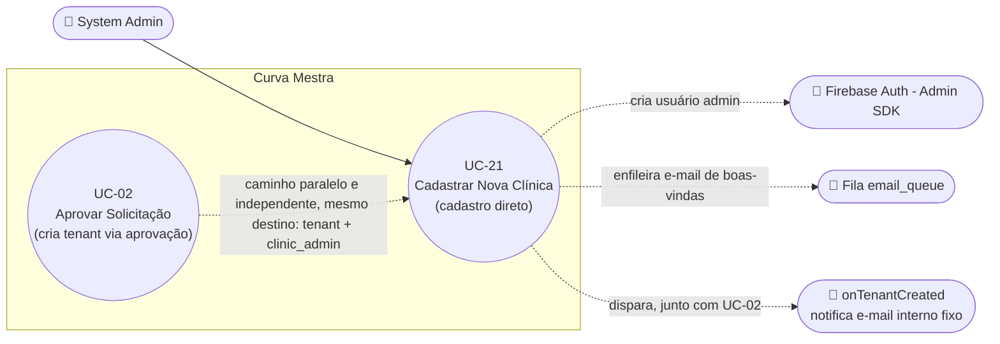

# UC-21: Cadastrar Nova Clínica (Cadastro Direto pelo System Admin)

**Projeto:** Curva Mestra
**Data de Criação:** 14/07/2026
**Autor:** Guilherme Scandelari (via uml-use-case-writer)
**Status:** Aprovado
**Módulo/Contexto:** Administração do Sistema (Gestão de Clínicas)
**Versão:** 1.1

> Um System Admin cadastra uma nova clínica diretamente, sem depender de uma solicitação de acesso prévia (UC-01/UC-02) — um wizard de 3 passos coleta os dados completos da clínica (incluindo documento e endereço reais, diferente do fallback vazio que UC-02 usa hoje), os dados do administrador inicial (incluindo uma senha temporária escolhida manualmente pelo próprio System Admin, não gerada automaticamente), e permite personalizar o e-mail de boas-vindas antes de enviar. É um caminho genuinamente paralelo e independente de UC-02, usando sua própria API route com autenticação Bearer real.

---

## 1. Diagrama UML (Mermaid)

---

## 2. Atores

### 2.1 Ator Primário
**System Admin** — acesso restrito por duas camadas: o layout do grupo `(admin)` (`ProtectedRoute allowedRoles: ['system_admin']`) e, adicionalmente, a própria API route (`/api/tenants/create`) exige um Bearer token válido com `is_system_admin === true` — diferente de UC-02 (rota de aprovação), que não valida Bearer token (RN-08, comparação direta).

### 2.2 Atores Secundários / Sistemas Externos
- **Firebase Auth (Admin SDK):** cria o usuário `clinic_admin` inicial.
- **Fila `email_queue`:** recebe o e-mail de boas-vindas personalizado.
- **Cloud Function `onTenantCreated`:** dispara uma notificação por e-mail para um endereço interno fixo, sempre que qualquer tenant é criado — inclusive pelos dois caminhos, UC-02 e este.

---

## 3. Pré-condições
- System Admin autenticado, `is_system_admin === true`.
- Nenhuma solicitação de acesso prévia é necessária — este é um caminho totalmente independente de UC-01/UC-02.

---

## 4. Pós-condições

### 4.1 Sucesso (Garantias de Sucesso)
- Um documento é criado em `tenants` (com `document_type`, `document_number`, `cnpj`, `max_users`, `email`, `phone`, `address`, `city`, `state`, `cep` — todos com dados **reais** informados no formulário, não fallback).
- Um usuário é criado no Firebase Auth com a senha exatamente como digitada pelo System Admin (`emailVerified: false`) e custom claims (`tenant_id`, `role: "clinic_admin"`, `is_system_admin: false`, `active: true`, **`requirePasswordChange: true`** — **[CORRIGIDO em v1.1, commit `91eb37e`]**).
- Um documento é criado em `users` (Firestore), também com **`requirePasswordChange: true`** (mesma correção, commit `91eb37e`).
- Um e-mail de boas-vindas — assunto e corpo totalmente customizáveis pelo System Admin, com a senha em texto plano substituída via template — é enfileirado em `email_queue`.
- A criação do tenant dispara também `onTenantCreated`, notificando um e-mail interno fixo da plataforma.

### 4.2 Falha (Garantias Mínimas)
- Se a criação do usuário Auth falhar, o tenant já criado é excluído (rollback).
- Se a criação do documento Firestore do usuário falhar, **tanto** o usuário Auth **quanto** o tenant são excluídos (rollback mais completo que UC-02).
- Se apenas a definição de custom claims falhar, não há rollback — o erro é apenas logado (usuário pode ficar sem claims corretas).

---

## 5. Gatilho (Trigger)
System Admin acessa `/admin/tenants/new` e preenche o wizard de 3 passos.

---

## 6. Fluxo Principal (Basic Flow)

1. System Admin acessa `/admin/tenants/new` (rota restrita a `system_admin` pelo layout do grupo `(admin)`).
2. **Passo 1 ("Dados da Clínica"):** System Admin informa nome, tipo de conta (CNPJ até 5 usuários / CPF 1 usuário — determina `max_users` no cliente), documento (com validação de dígitos verificadores e máscara conforme o tipo), e-mail da clínica, telefone, CEP, endereço, cidade e estado (todos opcionais exceto nome/documento/e-mail); clica em "Próximo" (valida nome preenchido, documento válido, e-mail com "@").
3. **Passo 2 ("Administrador"):** System Admin informa nome completo, e-mail e telefone do administrador inicial da clínica, e digita manualmente uma "Senha Temporária" (mínimo 6 caracteres, campo de texto simples, visível em tela) com o aviso "Esta senha será enviada por e-mail. O usuário deverá alterá-la no primeiro acesso." — aviso agora tecnicamente reforçado: o usuário criado é obrigado a trocar a senha no primeiro acesso (RN-05, `[CORRIGIDO]`); clica em "Próximo" (valida nome, e-mail e senha).
4. **Passo 3 ("E-mail de Boas-Vindas"):** sistema pré-preenche um assunto e um corpo de e-mail padrão, com placeholders `{{admin_name}}`, `{{clinic_name}}`, `{{admin_email}}`, `{{temp_password}}`; System Admin pode editar livremente o assunto e o corpo inteiro; pode clicar em "Visualizar Preview" a qualquer momento para ver o e-mail com os placeholders já substituídos pelos dados reais informados.
5. System Admin clica em "Criar Clínica e Enviar E-mail".
6. Sistema chama `createTenant({...dados da clínica, admin_name, admin_email, admin_phone, temp_password, welcome_email: {subject, body, send: true}})`.
7. Como há dados de administrador presentes, o service chama `POST /api/tenants/create` (com Bearer token do System Admin) em vez de gravar diretamente no Firestore (RN-10).
8. API valida o Bearer token e que o usuário é `system_admin`, e que os campos obrigatórios (nome/e-mail/documento da clínica; nome/e-mail/senha do admin) estão presentes.
9. API cria o documento em `tenants` (`active: true`, com todos os dados reais informados).
10. API cria o usuário no Firebase Auth com o e-mail e a senha exatamente como digitados pelo System Admin (`emailVerified: false`) — se falhar, deleta o tenant recém-criado e retorna erro (Fluxo de Exceção 8d).
11. API cria o documento do usuário em `users` (Firestore: `tenant_id`, `email`, `full_name`, `phone`, `role: "clinic_admin"`, `active: true`, **`requirePasswordChange: true`** — RN-05, `[CORRIGIDO]`) — se falhar, deleta tanto o usuário Auth quanto o tenant, e retorna erro (Fluxo de Exceção 8e).
12. API define os custom claims (`tenant_id`, `role: "clinic_admin"`, `is_system_admin: false`, `active: true`, **`requirePasswordChange: true`** — RN-05, `[CORRIGIDO]`) — se falhar, apenas registra o erro no log, sem desfazer nada já criado.
13. API adiciona um documento à fila `email_queue` (`to: admin_email`, `subject`, `body` — já com os placeholders substituídos no cliente antes do envio, `status: "pending"`), sem um campo `type` (diferente do `type: "welcome_approval"` usado por UC-02).
14. API retorna sucesso com `tenantId` e `userId`.
15. **(Assíncrono, fora do controle direto deste fluxo)** A Cloud Function `onTenantCreated` dispara ao detectar o novo documento em `tenants`, e envia uma notificação por e-mail para um endereço interno fixo da plataforma, informando nome/e-mail/plano da nova clínica.
16. Sistema navega para `/admin/tenants` (lista de clínicas).
17. Caso de uso é concluído com sucesso. No primeiro login do novo `clinic_admin`, a claim `requirePasswordChange: true` aciona UC-06 (Trocar Senha Obrigatória no Primeiro Acesso).

---

## 7. Fluxos Alternativos

### 7a. Impossibilidade de retroceder no wizard (aplica-se a qualquer passo 2-3)
1. Não há botão explícito de "Voltar" entre os passos — apenas "Cancelar" (volta para `/admin/tenants`, descartando tudo) e "Próximo"/"Criar Clínica". Uma vez avançado, não é possível retornar ao passo anterior para revisar/corrigir sem cancelar o processo inteiro (RN-07).

### 7b. Visualizar preview do e-mail antes de enviar (a partir do Passo 3)
1. System Admin clica em "Visualizar Preview".
2. Sistema abre um Dialog mostrando destinatário, assunto e corpo já com os placeholders substituídos.
3. System Admin fecha o preview e continua editando ou confirma o envio.

---

## 8. Fluxos de Exceção

### 8a. Validação de dados da clínica falha (a partir do Passo 1)
1. Nome vazio, documento com dígitos verificadores inválidos, ou e-mail sem "@".
2. Sistema exibe a mensagem de erro específica abaixo do formulário e não avança de passo.

### 8b. Validação de dados do administrador falha (a partir do Passo 2)
1. Nome vazio, e-mail sem "@", ou senha com menos de 6 caracteres.
2. Sistema exibe a mensagem de erro específica e não avança de passo.

### 8c. Token inválido ou usuário não é system_admin (a partir do passo 8)
1. O Bearer token está ausente/inválido, ou o usuário autenticado não tem `is_system_admin === true`.
2. API retorna 401 ou 403; nenhuma gravação ocorre.
3. Sistema exibe a mensagem de erro retornada na tela do wizard (permanece no Passo 3).

### 8d. E-mail do administrador já existe no Firebase Auth (a partir do passo 10)
1. `auth.createUser` lança erro (ex.: `auth/email-already-exists`).
2. API deleta o tenant recém-criado (rollback) e retorna erro.
3. Sistema exibe a mensagem de erro (contendo o erro literal do Firebase) na tela do wizard.

### 8e. Falha ao criar o documento do usuário no Firestore (a partir do passo 11)
1. Erro inesperado na gravação de `users/{userId}`.
2. API deleta o usuário recém-criado no Firebase Auth **e** o tenant recém-criado (rollback mais completo que UC-02, que só reverte o tenant).
3. Sistema exibe a mensagem de erro na tela do wizard.

---

## 9. Regras de Negócio Relacionadas

| ID | Regra | Justificativa |
|----|-------|----------------|
| RN-01 | **[Confirmado, caminho genuinamente paralelo a UC-02]** Este UC não depende, em nenhum momento, de uma solicitação de acesso (`access_requests`) prévia — é um caminho de criação de tenant totalmente independente, com sua própria API route (`/api/tenants/create`), separada da usada por UC-02 (`/api/access-requests/[id]/approve`). | Confirmado pela ausência de qualquer leitura/referência a `access_requests` neste fluxo. |
| RN-02 | **[Divergência confirmada em relação a UC-02]** Este cadastro coleta `document_type`, `document_number`, endereço completo (CEP, logradouro, cidade, estado) diretamente do formulário, com validação real de dígitos verificadores do documento — enquanto UC-02 (aprovação de solicitação) hoje grava `document_type: "cnpj"` fixo e `document_number: ""` vazio, por fallback de código, já que o formulário de UC-01 não coleta mais esses dados (ver UC-02, seção 14). Cadastrar uma clínica por este caminho resulta em um tenant com dados de documento/endereço muito mais completos e confiáveis do que o caminho de aprovação hoje. | Confirmado por comparação direta dos dois payloads de criação de tenant. |
| RN-03 | **[Divergência confirmada em relação a UC-02]** A senha inicial do administrador é escolhida manualmente pelo próprio System Admin (campo de texto livre, visível em tela, mínimo 6 caracteres) — diferente de UC-02, que gera uma senha temporária aleatória e opaca (`crypto.randomBytes`) e nunca a exibe para ninguém, exigindo redefinição via link do Firebase. Aqui, a senha escolhida é enviada por e-mail em texto plano dentro do corpo do e-mail de boas-vindas. | Confirmado por leitura do formulário (input de texto simples para a senha) e do payload enviado à API (`temp_password` literal). |
| RN-04 | `max_users` é definido no cliente, a partir do tipo de documento selecionado (CNPJ → 5, CPF → 1) — mesma regra de negócio de UC-01/UC-02, mas calculada aqui no frontend deste wizard, não no backend. | Confirmado pela linha `const maxUsers = clinicData.documentType === 'cpf' ? 1 : 5;` em `handleSubmit`. |
| RN-05 | **[CORRIGIDO em v1.1, commit `91eb37e`]** Apesar do aviso na tela ("O usuário deverá alterá-la no primeiro acesso") e no e-mail ("Por favor, altere sua senha no primeiro acesso"), até a v1.0 não existia nenhum mecanismo técnico que forçasse essa troca — a claim `requirePasswordChange` nunca era setada por este fluxo. O commit `91eb37e` adicionou `requirePasswordChange: true` tanto às custom claims quanto ao documento `users/{userId}`, alinhando este fluxo ao mesmo padrão já usado em UC-02/UC-28/UC-39. O novo `clinic_admin` agora é obrigado a trocar a senha temporária no primeiro acesso, acionando UC-06. | Corrigido conforme diff de `src/app/api/tenants/create/route.ts` no commit `91eb37e` — `requirePasswordChange: true` presente tanto em `auth.setCustomUserClaims` quanto em `users/{userId}.set`. |
| RN-06 | O e-mail de boas-vindas é inteiramente customizável pelo System Admin (assunto e corpo livres, com substituição de 4 placeholders) — diferente dos e-mails de UC-02/UC-08, que usam templates HTML fixos, não editáveis pelo usuário que aciona a ação. | Confirmado pela existência dos campos de edição de assunto/corpo no Passo 3 e pela função `getPreviewEmail`, que só faz substituição de placeholders, sem nenhuma restrição de conteúdo. |
| RN-07 | Uma vez avançado de um passo do wizard para o próximo, não há como retroceder para revisar/corrigir — apenas "Cancelar" (descarta tudo) está disponível. | Confirmado pela ausência de um botão "Voltar" na navegação do wizard (só "Cancelar" e "Próximo"/submissão final). |
| RN-08 | **[Contraste confirmado com UC-02]** A API deste UC (`/api/tenants/create`) exige e valida um Bearer token real (com `is_system_admin === true`) antes de qualquer gravação — diferente da rota de aprovação de UC-02 (`/api/access-requests/[id]/approve`), que não valida nenhum Bearer token (gap já registrado em UC-02, RNF-01). | Confirmado por leitura literal de ambas as rotas. |
| RN-09 | Toda criação de tenant — por este UC ou por UC-02 — dispara a Cloud Function `onTenantCreated`, que envia uma notificação por e-mail para um endereço fixo e *hardcoded* (`scandelari.guilherme@curvamestra.com.br`), sem nenhuma configuração de destinatário. O campo `plan_id`, referenciado pelo template dessa notificação, não é definido por nenhum dos dois fluxos hoje. | Confirmado por leitura de `functions/src/onTenantCreated.ts` e `emailService.sendNewTenantNotification`. |
| RN-10 | **[Resposta direta à pergunta do levantamento — sobre tenant "órfão"]** Esta tela **nunca** cria um tenant "órfão" sem usuário — o formulário sempre exige nome/e-mail/senha do administrador (Passo 2, validado antes de avançar), então o branch de `tenantServiceDirect.createTenant` que gravaria apenas o tenant via `addDoc` simples (sem nenhum usuário) nunca é alcançado a partir desta tela; esse branch existe no código apenas como "compatibilidade com fluxo antigo", mas está morto do ponto de vista desta UI. | Confirmado por leitura de `handleSubmit` (sempre envia `admin_name`/`admin_email`/`temp_password`) e da condicional em `createTenant` (`if (data.admin_email && data.admin_name && data.temp_password)`). |

---

## 10. Requisitos Especiais / Não Funcionais

| ID | Descrição | Categoria |
|----|-----------|-----------|
| RNF-01 | O rollback em cascata (deletar tenant se Auth falhar; deletar Auth+tenant se Firestore falhar) é mais completo do que o de UC-02 (que só reverte o tenant se a criação do usuário Auth falhar, sem tratar falhas em etapas posteriores). | Confiabilidade |
| RNF-02 | A falha ao definir custom claims não é revertida — apenas logada — podendo deixar um usuário criado sem os claims corretos (`tenant_id`/`role`/`requirePasswordChange`) em um cenário raro de falha parcial. | Confiabilidade |
| RNF-03 | Existe um segundo service (`tenantService.ts`, baseado em Cloud Functions `httpsCallable`) com uma função `createTenant` de mesmo nome, mas que chama uma Cloud Function chamada `"createTenant"` que não foi encontrada em `functions/src/` — aparenta ser código legado/não utilizado por esta tela, que usa exclusivamente `tenantServiceDirect`. | Observação de manutenibilidade |

---

## 11. Frequência de Uso
Ocasional — usado quando o System Admin cadastra uma clínica diretamente (parceria, migração, ou qualquer cenário fora do fluxo de auto-registro de UC-01), sem depender de uma solicitação prévia.

---

## 12. Casos de Uso Relacionados
- **UC-02 (Aprovar Solicitação de Acesso)** é o caminho paralelo e alternativo para o mesmo resultado final (tenant + `clinic_admin`) — os dois nunca se cruzam tecnicamente (rotas, funções e mecanismos de senha totalmente distintos), mas produzem o mesmo tipo de objeto no sistema.
- **UC-06 (Trocar Senha Obrigatória no Primeiro Acesso)** **agora se aplica** a usuários criados por este UC — desde o commit `91eb37e` (RN-05, `[CORRIGIDO]`), `requirePasswordChange` é setada por este fluxo, mesmo padrão de UC-02/UC-28/UC-39. Antes da correção (v1.0), este UC-21 era um caminho de criação de `clinic_admin` que nunca acionava UC-06.

---

## 13. Referências
- `src/app/(admin)/admin/tenants/new/page.tsx`
- `src/lib/services/tenantServiceDirect.ts` (`createTenant`)
- `src/app/api/tenants/create/route.ts` (linhas alteradas pelo commit `91eb37e` — `requirePasswordChange: true` nas custom claims e no documento `users/{userId}`, RN-05)
- `src/lib/utils/documentValidation.ts` (`validateDocument`, `maskDocument`)
- `functions/src/onTenantCreated.ts`, `functions/src/services/emailService.ts` (`sendNewTenantNotification`)
- `src/lib/services/tenantService.ts` (serviço alternativo, aparentemente não utilizado — RNF-03)

---

## 14. Perguntas em Aberto / Decisões Pendentes

1. **[RESOLVIDO em v1.1 — commit `91eb37e`]** RN-05 — implementado: `requirePasswordChange: true` agora é definido tanto nas custom claims quanto no documento `users/{userId}`, obrigando a troca da senha inicial no primeiro acesso do `clinic_admin` criado por este fluxo.
2. **[Observação]** RN-09 — e-mail de notificação interna *hardcoded*, sem configuração; `plan_id` nunca é definido por nenhum dos dois fluxos de criação de tenant.
3. **[Observação de manutenibilidade]** RNF-03 — `tenantService.ts` parece ser código legado apontando para uma Cloud Function que não existe no projeto.
4. **[Observação]** RN-07 — impossibilidade de retroceder no wizard sem cancelar tudo.

---

## 15. Histórico de Versões

| Versão | Data | Autor | O que mudou |
|--------|------|-------|--------------|
| 1.0 | 14/07/2026 | Guilherme Scandelari | Versão inicial, investigada do zero. Confirmado que este é um caminho de criação de tenant genuinamente paralelo e independente de UC-02 (RN-01), com diferenças substanciais de dados coletados (documento/endereço reais vs. fallback — RN-02) e de mecanismo de senha inicial (senha escolhida manualmente e enviada em texto plano, sem força de troca — RN-03/RN-05) em relação a UC-02. Confirmado que este cadastro sempre cria um usuário `clinic_admin` junto com o tenant, nunca um tenant "órfão" sem usuário (RN-10) — o branch de `tenantServiceDirect.createTenant` que criaria apenas o tenant sem admin é inalcançável a partir desta tela. Identificado, como achado adicional, que a API deste UC valida Bearer token corretamente (diferente do gap já registrado em UC-02, RN-08). |
| 1.1 | 19/07/2026 | Guilherme Scandelari | Correção de severidade Alta (commit `91eb37e`): `requirePasswordChange: true` agora é setada nas custom claims e no documento `users/{userId}` criados por `POST /api/tenants/create`, alinhando este fluxo ao padrão já usado em UC-02/UC-28/UC-39. RN-05 marcada como `[CORRIGIDO]`; seções 4.1, 6 (passos 11/12/17), 12 e 14 atualizadas para refletir que UC-06 agora é acionado no primeiro acesso do `clinic_admin` criado por este caminho. |
