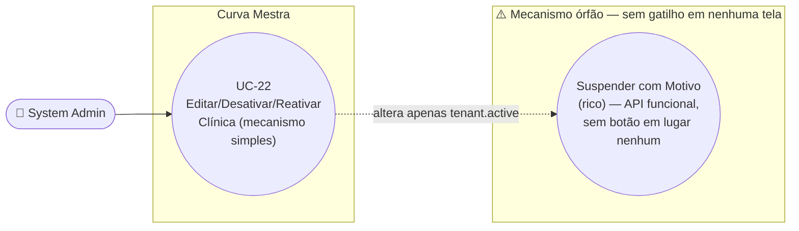

# UC-22: Editar, Desativar e Reativar Clínica

**Projeto:** Curva Mestra
**Data de Criação:** 14/07/2026
**Autor:** Guilherme Scandelari (via uml-use-case-writer)
**Status:** Aprovado
**Módulo/Contexto:** Administração do Sistema (Gestão de Clínicas)
**Versão:** 1.0

> Um System Admin edita os dados cadastrais de uma clínica e/ou ativa/desativa seu acesso, tudo na mesma tela (`admin/tenants/[id]/page.tsx`), usando um mecanismo **simples** (`tenantServiceDirect.updateTenant`/`deactivateTenant`/`reactivateTenant`, que só alterna um booleano `active` no tenant). **Achado crítico confirmado:** existe um segundo mecanismo de suspensão, muito mais completo (motivo formal, e-mail de contato, desativação em cascata de todos os usuários, telas dedicadas `/suspended/admin` e `/suspended/user`) — mas o componente que o aciona (`SuspendTenantDialog`/`ReactivateTenantDialog`) **nunca é importado por nenhuma tela do sistema**. É código morto do lado do "gatilho", mesmo com o lado da "detecção" (`useTenantSuspension`, `SuspensionInterceptor`) ativo e rodando em produção — documentado aqui com o mesmo rigor usado para o UC-05.

---

## 1. Diagrama UML (Mermaid)

---

## 2. Atores

### 2.1 Ator Primário
**System Admin** — acesso à tela restrito pelo layout do grupo `(admin)` (`ProtectedRoute allowedRoles: ['system_admin']`).

### 2.2 Atores Secundários / Sistemas Externos
Usuários da clínica afetada (`clinic_admin`/`clinic_user`) são impactados indiretamente pela desativação — via `SuspensionInterceptor` (em navegação) e via a checagem de clínica inativa no login (UC-04).

---

## 3. Pré-condições
- System Admin autenticado, `is_system_admin === true`.
- Existe um tenant com o id da URL.

---

## 4. Pós-condições

### 4.1 Sucesso — Editar
- O documento `tenants/{id}` é atualizado (`name`, `document_type`, `document_number`, `cnpj`, `max_users` recalculado, `email`, `phone`, `address`, `active`) via `updateDoc` direto (client-side, sem API route dedicada).

### 4.1b Sucesso — Desativar
- `tenants/{id}.active` passa para `false`. **Nada mais é alterado** — nenhum usuário individual é desativado, nenhum motivo é registrado (RN-03).

### 4.1c Sucesso — Reativar
- `tenants/{id}.active` volta para `true`. Idem — nenhum outro documento é tocado.

### 4.2 Falha (Garantias Mínimas)
- Nenhuma alteração é feita; mensagem de erro exibida na própria tela.

---

## 5. Gatilho (Trigger)
System Admin acessa `/admin/tenants/{id}` e edita o formulário e/ou clica em "Desativar Clínica" ou "Reativar Clínica".

---

## 6. Fluxo Principal (Basic Flow) — Editar

1. System Admin acessa `/admin/tenants/{id}`.
2. Sistema carrega o tenant (`getTenant`) e a lista de usuários da clínica (`listClinicUsers`), pré-preenchendo o formulário (nome, documento formatado, e-mail, telefone, endereço, status).
3. System Admin altera os campos desejados (nome, CPF/CNPJ, e-mail, telefone, endereço) e/ou alterna o seletor "Status" (Ativo/Inativo) dentro do próprio formulário — redundante com os botões dedicados da "Zona de Perigo" (RN-02).
4. System Admin clica em "Salvar Alterações".
5. Sistema valida: nome preenchido, documento com dígitos verificadores válidos, e-mail preenchido, tipo de documento determinável a partir do número informado.
6. Sistema chama `updateTenant(tenantId, { name, document_type, document_number, cnpj, max_users: docType === "cpf" ? 1 : 5, email, phone, address, active })` — um `updateDoc` direto no Firestore, sem passar por nenhuma API route (RN-01).
7. Sistema exibe "Clínica atualizada com sucesso!" e, após 1,5s, redireciona para `/admin/tenants`.
8. Caso de uso é concluído com sucesso.

---

## 7. Fluxos Alternativos

### 7a. Desativar clínica (a partir de qualquer momento, via "Zona de Perigo" — só visível se `tenant.active`)
1. System Admin clica em "Desativar Clínica".
2. Sistema exibe um `confirm()` nativo: `Tem certeza que deseja desativar "{nome}"?`.
3. System Admin confirma.
4. Sistema chama `deactivateTenant(tenantId)` — `updateDoc({ active: false, updated_at })` no documento do tenant, **sem** desativar nenhum usuário individualmente (RN-03).
5. Sistema exibe "Clínica desativada com sucesso!" e, após 1,5s, redireciona para `/admin/tenants`.

### 7b. Reativar clínica (a partir de qualquer momento, via seção "Reativar Clínica" — só visível se `!tenant.active`)
1. System Admin clica em "Reativar Clínica".
2. Sistema exibe um `confirm()` nativo: `Tem certeza que deseja reativar "{nome}"?`.
3. System Admin confirma.
4. Sistema chama `reactivateTenant(tenantId)` — `updateDoc({ active: true, updated_at })`.
5. Sistema exibe "Clínica reativada com sucesso!" e atualiza o estado local imediatamente (sem redirecionar).

---

## 8. Fluxos de Exceção

### 8a. Validação de dados falha (a partir do passo 5)
1. Nome vazio, documento com dígitos verificadores inválidos, e-mail vazio, ou tipo de documento não determinável a partir do número.
2. Sistema exibe a mensagem de erro específica; nada é gravado.

### 8b. Erro ao salvar/desativar/reativar
1. `updateTenant`/`deactivateTenant`/`reactivateTenant` lançam exceção (rede, permissão, etc.).
2. Sistema exibe a mensagem de erro retornada (ou uma genérica) na própria tela.

---

## 9. Regras de Negócio Relacionadas

| ID | Regra | Justificativa |
|----|-------|----------------|
| RN-01 | Edição, desativação e reativação usam `updateDoc` direto no Firestore (client-side) — sem nenhuma API route dedicada nem validação de Bearer token, diferente de UC-21 (criação), que passa pela API `/api/tenants/create`. | Confirmado por leitura de `updateTenant`/`deactivateTenant`/`reactivateTenant` em `tenantServiceDirect.ts`. |
| RN-02 | O campo "Status" dentro do formulário principal é redundante com os botões dedicados da "Zona de Perigo"/"Reativar Clínica" — os dois caminhos alteram o mesmo campo `active`, mas por funções diferentes (`updateTenant` genérico vs. `deactivateTenant`/`reactivateTenant` dedicados). | Confirmado pela coexistência dos dois mecanismos na mesma tela. |
| RN-03 | **[Confirmado — este é o único mecanismo realmente em uso]** Desativar/reativar por esta tela apenas alterna `tenants/{id}.active` — **não** desativa nenhum usuário individualmente (não altera `active` nos documentos `users` nem nos custom claims de ninguém). O bloqueio de acesso dos usuários da clínica depende inteiramente de outras camadas do sistema lerem `tenant.active` em tempo real (`SuspensionInterceptor`, e a checagem de clínica inativa no login — UC-04). | Confirmado por leitura literal de `deactivateTenant`/`reactivateTenant` — só um `updateDoc` no próprio documento do tenant. |
| RN-04 | Ambas as ações (desativar e reativar) exigem apenas uma confirmação nativa do navegador (`confirm()`), sem motivo, sem detalhes, sem e-mail de contato. | Confirmado pela ausência de qualquer formulário associado a esses botões. |
| RN-05 | **[Achado crítico — mecanismo órfão confirmado, mesmo padrão de clareza do UC-05]** Existe um segundo mecanismo de suspensão, mais completo, que **nunca é acionável** pela interface atual: • `SuspendTenantDialog` e `ReactivateTenantDialog` (`src/components/admin/SuspendTenantDialog.tsx`) — dois componentes completos, com formulário de motivo (5 opções: falha de pagamento, quebra de contrato, violação dos termos, fraude, outro), campo de detalhes obrigatório, e e-mail de contato — **não são importados por nenhum arquivo do projeto**, incluindo esta tela. • A API que eles chamariam (`POST`/`DELETE /api/tenants/[id]/suspend`) está implementada e é **mais completa** que o mecanismo simples: desativa em cascata os custom claims e o documento `users` de **todos** os usuários da clínica, além de gravar um objeto `suspension` estruturado no tenant — mas, sem o diálogo, essa rota nunca é chamada por ninguém. • Em contrapartida, o hook `useTenantSuspension` e o componente `SuspensionInterceptor` (que o usa) **estão ativos**, montados globalmente no layout `(clinic)` (`src/app/(clinic)/layout.tsx`) — rodam em tempo real (`onSnapshot`) para todo usuário de clínica, verificando `tenant.suspension?.suspended`. Como nada nunca escreve esse campo, `isSuspended` é sempre `false` na prática — as telas `/suspended/admin` e `/suspended/user` (que se autorredirecionam quando `!isSuspended`) são, hoje, inalcançáveis por qualquer caminho real do sistema. | Confirmado por busca em todo `src/` (nenhum import de `SuspendTenantDialog`/`ReactivateTenantDialog`), leitura completa de `useTenantSuspension.ts`/`SuspensionInterceptor.tsx`, e confirmação de que `SuspensionInterceptor` está montado em `src/app/(clinic)/layout.tsx`. |
| RN-06 | **[Confirmado, risco relevante]** A regra do Firestore para o documento `tenants/{tenantId}` permite `update` a qualquer usuário que `belongsToTenant(tenantId)` — não apenas `system_admin`. Ou seja, um `clinic_admin` (ou mesmo um `clinic_user`) da própria clínica poderia, em tese, editar diretamente os dados cadastrais do próprio tenant (nome, documento, endereço, e até o campo `active`) sem passar por esta tela administrativa, escrevendo diretamente via SDK do Firestore. A restrição de que só o System Admin usa esta tela é apenas de UI. | Confirmado por leitura de `firestore.rules` (`match /tenants/{tenantId}`, regra `allow read, update: if belongsToTenant(tenantId)`). |

---

## 10. Requisitos Especiais / Não Funcionais

| ID | Descrição | Categoria |
|----|-----------|-----------|
| RNF-01 | O mecanismo simples realmente em uso (RN-03) não registra motivo nem auditoria da desativação — apenas alterna um booleano, sem histórico de quem desativou, quando, ou por quê. | Auditoria |
| RNF-02 | Como `useTenantSuspension` usa `onSnapshot` (listener em tempo real), qualquer alteração futura no campo `suspension` de um tenant (ainda que feita manualmente, por exemplo, no console do Firebase) refletiria imediatamente na experiência de todos os usuários daquela clínica, sem precisar de novo login. | Observação técnica |
| RNF-03 | Diferente de UC-21, esta tela não usa nenhuma API route com Bearer token — depende inteiramente das regras do Firestore, que (RN-06) são mais permissivas do que a UI sugere. | Segurança |

---

## 11. Frequência de Uso
Ocasional — edição/desativação/reativação de clínicas não são operações do dia a dia do System Admin.

---

## 12. Casos de Uso Relacionados
- **UC-21 (Cadastrar Nova Clínica)** é pré-condição — só se edita/desativa uma clínica que já existe.
- **UC-04 (Fazer Login com Redirecionamento por Papel)** já documenta, de forma independente, o comportamento de `clinic_admin`/`clinic_user` ao tentar logar com uma clínica `active: false` — este UC é quem efetivamente altera esse campo.
- Esta mesma tela (`admin/tenants/[id]/page.tsx`) também permite "Adicionar Usuário" à clínica e "Configurar/Alterar/Remover Consultor Rennova" — ambas fora do escopo deste UC, candidatas a UCs próprios futuros.

---

## 13. Referências
- `src/app/(admin)/admin/tenants/[id]/page.tsx`
- `src/lib/services/tenantServiceDirect.ts` (`updateTenant`, `deactivateTenant`, `reactivateTenant`)
- `src/components/admin/SuspendTenantDialog.tsx` (`SuspendTenantDialog`, `ReactivateTenantDialog` — confirmado órfão, RN-05)
- `src/app/api/tenants/[id]/suspend/route.ts` (implementado, mas inacessível — RN-05)
- `src/hooks/useTenantSuspension.ts`, `src/components/auth/SuspensionInterceptor.tsx` (ativos, montados em `src/app/(clinic)/layout.tsx`)
- `src/app/suspended/admin/page.tsx`, `src/app/suspended/user/page.tsx` (inalcançáveis na prática — RN-05)
- `src/types/index.ts` (`SuspensionInfo`, `SuspensionReason`)
- `firestore.rules` (regra de `tenants/{tenantId}` — RN-06)

---

## 14. Perguntas em Aberto / Decisões Pendentes

1. **[Achado crítico, mesma clareza do UC-05 — decisão de produto necessária]** O mecanismo rico de suspensão (motivo formal, e-mail de contato, cascata de desativação de usuários, telas dedicadas) está tecnicamente implementado e funcional isoladamente, mas totalmente inacessível — nenhum botão em nenhuma tela abre `SuspendTenantDialog`/`ReactivateTenantDialog`. Duas alternativas, nenhuma decidida aqui:
   - **(a)** Conectar esses componentes a esta tela (ex.: substituir os botões simples "Desativar"/"Reativar" pelos diálogos ricos), tornando o mecanismo simples obsoleto;
   - **(b)** Remover o mecanismo rico inteiro (dialogs, API route, hook, telas `/suspended/*`, `SuspensionInterceptor`) e manter apenas o simples, já que ele nunca é de fato usado hoje.
2. **[Confirmado, risco relevante]** RN-06 — a regra do Firestore permite que o próprio `clinic_admin`/`clinic_user` edite os dados do próprio tenant diretamente, sem passar por esta tela administrativa.
3. **[Nota de rastreabilidade]** "Adicionar Usuário à Clínica" e "Gerenciar Consultor Rennova da Clínica" — ambos presentes na mesma tela — ainda não foram mapeados como UCs formais.

---

## 15. Histórico de Versões

| Versão | Data | Autor | O que mudou |
|--------|------|-------|--------------|
| 1.0 | 14/07/2026 | Guilherme Scandelari | Versão inicial, investigada do zero. Confirmado que `admin/tenants/[id]/page.tsx` usa exclusivamente o mecanismo simples (`deactivateTenant`/`reactivateTenant`, RN-03) — o mecanismo rico de suspensão (`SuspendTenantDialog`/`ReactivateTenantDialog`) é confirmadamente órfão (nenhum import em todo o projeto), apesar de sua API (`/api/tenants/[id]/suspend`) e seu lado de "detecção" (`useTenantSuspension`, `SuspensionInterceptor`, telas `/suspended/*`) estarem implementados e ativos em produção (RN-05) — documentado com o mesmo rigor do UC-05, sem assumir qual dos dois caminhos (implementar ou remover) é o correto. Identificado também um risco de segurança confirmado: a regra do Firestore para `tenants/{tenantId}` permite que o próprio tenant edite seus dados via `belongsToTenant`, não restrito a `system_admin` (RN-06). |
