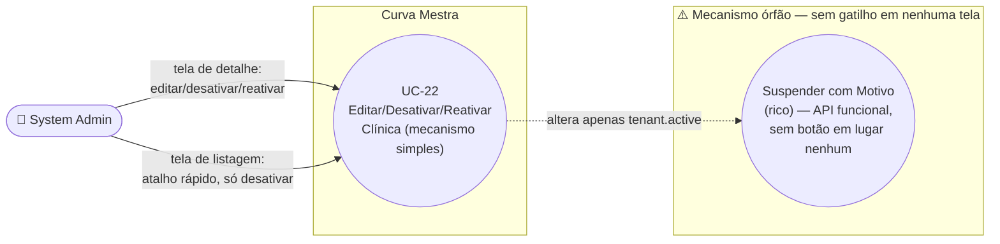

# UC-22: Editar, Desativar e Reativar Clínica

**Projeto:** Curva Mestra
**Data de Criação:** 14/07/2026
**Autor:** Guilherme Scandelari (via uml-use-case-writer)
**Status:** Aprovado
**Módulo/Contexto:** Administração do Sistema (Gestão de Clínicas)
**Versão:** 1.2.1

> Um System Admin edita os dados cadastrais de uma clínica e/ou ativa/desativa seu acesso, usando um mecanismo **simples** (`tenantServiceDirect.updateTenant`/`deactivateTenant`/`reactivateTenant`, que só alterna um booleano `active` no tenant), acionável a partir de **duas telas diferentes**: a tela de detalhe (`admin/tenants/[id]/page.tsx`, onde também é possível editar os dados cadastrais e reativar) e a própria listagem (`admin/tenants/page.tsx`, onde só é possível desativar, com um atalho rápido na linha da tabela). **Achado crítico confirmado:** existe um segundo mecanismo de suspensão, muito mais completo (motivo formal, e-mail de contato, desativação em cascata de todos os usuários, telas dedicadas `/suspended/admin` e `/suspended/user`) — mas o componente que o aciona (`SuspendTenantDialog`/`ReactivateTenantDialog`) **nunca é importado por nenhuma tela do sistema**. É código morto do lado do "gatilho", mesmo com o lado da "detecção" (`useTenantSuspension`, `SuspensionInterceptor`) ativo e rodando em produção — documentado aqui com o mesmo rigor usado para o UC-05.

---

## 1. Diagrama UML (Mermaid)

---

## 2. Atores

### 2.1 Ator Primário
**System Admin** — acesso às telas restrito pelo layout do grupo `(admin)` (`ProtectedRoute allowedRoles: ['system_admin']`).

### 2.2 Atores Secundários / Sistemas Externos
Usuários da clínica afetada (`clinic_admin`/`clinic_user`) são impactados indiretamente pela desativação — via `SuspensionInterceptor` (em navegação) e via a checagem de clínica inativa no login (UC-04).

---

## 3. Pré-condições
- System Admin autenticado, `is_system_admin === true`.
- Para a tela de detalhe: existe um tenant com o id da URL.
- Para o atalho da listagem (desativar): a listagem já carregou ao menos um tenant com `active === true` (o botão só é renderizado para tenants ativos).

---

## 4. Pós-condições

### 4.1 Sucesso — Editar (somente na tela de detalhe)
- O documento `tenants/{id}` é atualizado (`name`, `document_type`, `document_number`, `cnpj`, `max_users` recalculado, `email`, `phone`, `address`, `active`) via `updateDoc` direto (client-side, sem API route dedicada).

### 4.1b Sucesso — Desativar (tela de detalhe **ou** listagem)
- `tenants/{id}.active` passa para `false`. **Nada mais é alterado** — nenhum usuário individual é desativado, nenhum motivo é registrado (RN-03). O resultado no Firestore é idêntico independentemente de qual das duas telas disparou a ação (RN-07).

### 4.1c Sucesso — Reativar (somente na tela de detalhe)
- `tenants/{id}.active` volta para `true`. Idem — nenhum outro documento é tocado. **Não existe atalho de reativação na listagem** (RN-07) — apenas o botão de detalhe (`Edit`) fica disponível para tenants inativos.

### 4.2 Falha (Garantias Mínimas)
- Nenhuma alteração é feita; mensagem de erro exibida na própria tela, em ambas via bloco `error` inline (RN-08, corrigido — a listagem passou a usar o mesmo padrão da tela de detalhe).

---

## 5. Gatilho (Trigger)
- **Tela de detalhe:** System Admin acessa `/admin/tenants/{id}` e edita o formulário e/ou clica em "Desativar Clínica" ou "Reativar Clínica".
- **Tela de listagem:** System Admin, em `/admin/tenants`, clica no ícone de desativação (`XCircle`) na linha de um tenant ativo — sem precisar entrar na tela de detalhe (RN-07).

---

## 6. Fluxo Principal (Basic Flow) — Editar (tela de detalhe)

1. System Admin acessa `/admin/tenants/{id}`.
2. Sistema carrega o tenant (`getTenant`) e a lista de usuários da clínica (`listClinicUsers`), pré-preenchendo o formulário (nome, documento formatado, e-mail, telefone, endereço, status).
3. System Admin altera os campos desejados (nome, CPF/CNPJ, e-mail, telefone, endereço) e/ou alterna o seletor "Status" (Ativo/Inativo) dentro do próprio formulário — redundante com os botões dedicados da "Zona de Perigo" (RN-02).
4. System Admin clica em "Salvar Alterações".
5. Sistema valida: nome preenchido, documento com dígitos verificadores válidos, e-mail preenchido, tipo de documento determinável a partir do número informado.
6. Sistema chama `updateTenant(tenantId, { name, document_type, document_number, cnpj, max_users: docType === "cpf" ? 1 : 5, email, phone, address, active })` — um `updateDoc` direto no Firestore, sem passar por nenhuma API route (RN-01).
7. Sistema exibe "Clínica atualizada com sucesso!" e, após 1,5s, redireciona para `/admin/tenants`.
8. Caso de uso é concluído com sucesso.

---

## 7. Fluxos Alternativos

### 7a. Desativar clínica pela tela de detalhe (a partir de qualquer momento, via "Zona de Perigo" — só visível se `tenant.active`)
1. System Admin clica em "Desativar Clínica".
2. Sistema exibe um `confirm()` nativo: `Tem certeza que deseja desativar "{nome}"?`.
3. System Admin confirma.
4. Sistema chama `deactivateTenant(tenantId)` — `updateDoc({ active: false, updated_at })` no documento do tenant, **sem** desativar nenhum usuário individualmente (RN-03).
5. Sistema exibe "Clínica desativada com sucesso!" e, após 1,5s, redireciona para `/admin/tenants`.

### 7b. Reativar clínica pela tela de detalhe (a partir de qualquer momento, via seção "Reativar Clínica" — só visível se `!tenant.active`)
1. System Admin clica em "Reativar Clínica".
2. Sistema exibe um `confirm()` nativo: `Tem certeza que deseja reativar "{nome}"?`.
3. System Admin confirma.
4. Sistema chama `reactivateTenant(tenantId)` — `updateDoc({ active: true, updated_at })`.
5. Sistema exibe "Clínica reativada com sucesso!" e atualiza o estado local imediatamente (sem redirecionar).

### 7c. Desativar clínica diretamente pela listagem (`admin/tenants/page.tsx`) — atalho, sem passar pela tela de detalhe
1. System Admin, em `/admin/tenants`, localiza uma clínica ativa (badge "Ativo") e clica no ícone `XCircle` na coluna "Ações" da linha correspondente — visível apenas quando `tenant.active` é verdadeiro (não há um botão equivalente de reativação nesta tela, RN-07).
2. Sistema exibe um `confirm()` nativo: `Tem certeza que deseja desativar "{nome}"?` — mesma mensagem e mesmo padrão de confirmação da tela de detalhe (7a).
3. System Admin confirma.
4. Sistema chama exatamente a mesma função `deactivateTenant(tenantId)` da tela de detalhe — `updateDoc({ active: false, updated_at })`.
5. Sistema recarrega a listagem (`loadTenants()`) — **sem** mensagem de sucesso (nem toast, nem texto na página); o único feedback visual é o badge da linha mudar de "Ativo" para "Inativo" e o ícone de desativação desaparecer daquela linha (RN-08).
6. Caso de uso é concluído com sucesso.

---

## 8. Fluxos de Exceção

### 8a. Validação de dados falha (a partir do passo 5 do Fluxo Principal)
1. Nome vazio, documento com dígitos verificadores inválidos, e-mail vazio, ou tipo de documento não determinável a partir do número.
2. Sistema exibe a mensagem de erro específica; nada é gravado.

### 8b. Erro ao salvar/desativar/reativar (tela de detalhe)
1. `updateTenant`/`deactivateTenant`/`reactivateTenant` lançam exceção (rede, permissão, etc.).
2. Sistema exibe a mensagem de erro retornada (ou uma genérica) na própria tela.

### 8c. Erro ao desativar pela listagem (a partir do passo 4 de 7c)
1. `deactivateTenant` lança exceção.
2. Sistema chama `setError(err.message || 'Erro ao desativar clínica')`, exibindo a mensagem em um bloco de erro inline na própria listagem — **[Corrigido no commit `ec31c27` — UC-22-RN-08]**, mesmo padrão já usado na tela de detalhe. A função também chama `setError('')` no início, limpando qualquer erro anterior antes de tentar novamente. **Nota histórica:** até esta correção, o erro era exibido via `alert(err.message || 'Erro ao desativar clínica')`, um alerta nativo do navegador, diferente do bloco de erro inline usado na tela de detalhe.

---

## 9. Regras de Negócio Relacionadas

| ID | Regra | Justificativa |
|----|-------|----------------|
| RN-01 | Edição, desativação e reativação usam `updateDoc` direto no Firestore (client-side) — sem nenhuma API route dedicada nem validação de Bearer token, diferente de UC-21 (criação), que passa pela API `/api/tenants/create`. | Confirmado por leitura de `updateTenant`/`deactivateTenant`/`reactivateTenant` em `tenantServiceDirect.ts`. |
| RN-02 | O campo "Status" dentro do formulário principal (tela de detalhe) é redundante com os botões dedicados da "Zona de Perigo"/"Reativar Clínica" — os dois caminhos alteram o mesmo campo `active`, mas por funções diferentes (`updateTenant` genérico vs. `deactivateTenant`/`reactivateTenant` dedicados). | Confirmado pela coexistência dos dois mecanismos na mesma tela. |
| RN-03 | **[Confirmado — este é o único mecanismo realmente em uso]** Desativar/reativar por qualquer uma das duas telas apenas alterna `tenants/{id}.active` — **não** desativa nenhum usuário individualmente (não altera `active` nos documentos `users` nem nos custom claims de ninguém). O bloqueio de acesso dos usuários da clínica depende inteiramente de outras camadas do sistema lerem `tenant.active` em tempo real (`SuspensionInterceptor`, e a checagem de clínica inativa no login — UC-04). | Confirmado por leitura literal de `deactivateTenant`/`reactivateTenant` — só um `updateDoc` no próprio documento do tenant, chamado de forma idêntica pelas duas telas. |
| RN-04 | Todas as ações de desativar/reativar, em ambas as telas, exigem apenas uma confirmação nativa do navegador (`confirm()`), sem motivo, sem detalhes, sem e-mail de contato. | Confirmado pela ausência de qualquer formulário associado a esses botões, nas duas telas. |
| RN-05 | **[Achado crítico — mecanismo órfão confirmado, mesmo padrão de clareza do UC-05]** Existe um segundo mecanismo de suspensão, mais completo, que **nunca é acionável** por nenhuma das duas telas: • `SuspendTenantDialog` e `ReactivateTenantDialog` (`src/components/admin/SuspendTenantDialog.tsx`) — dois componentes completos, com formulário de motivo (5 opções: falha de pagamento, quebra de contrato, violação dos termos, fraude, outro), campo de detalhes obrigatório, e e-mail de contato — **não são importados por nenhum arquivo do projeto**, incluindo `admin/tenants/[id]/page.tsx` e `admin/tenants/page.tsx`. • A API que eles chamariam (`POST`/`DELETE /api/tenants/[id]/suspend`) está implementada e é **mais completa** que o mecanismo simples: desativa em cascata os custom claims e o documento `users` de **todos** os usuários da clínica, além de gravar um objeto `suspension` estruturado no tenant — mas, sem o diálogo, essa rota nunca é chamada por ninguém. • Em contrapartida, o hook `useTenantSuspension` e o componente `SuspensionInterceptor` (que o usa) **estão ativos**, montados globalmente no layout `(clinic)` (`src/app/(clinic)/layout.tsx`) — rodam em tempo real (`onSnapshot`) para todo usuário de clínica, verificando `tenant.suspension?.suspended`. Como nada nunca escreve esse campo, `isSuspended` é sempre `false` na prática — as telas `/suspended/admin` e `/suspended/user` (que se autorredirecionam quando `!isSuspended`) são, hoje, inalcançáveis por qualquer caminho real do sistema. | Confirmado por busca em todo `src/` (nenhum import de `SuspendTenantDialog`/`ReactivateTenantDialog`), leitura completa de `useTenantSuspension.ts`/`SuspensionInterceptor.tsx`, e confirmação de que `SuspensionInterceptor` está montado em `src/app/(clinic)/layout.tsx`. |
| RN-06 | **[Confirmado, risco relevante]** A regra do Firestore para o documento `tenants/{tenantId}` permite `update` a qualquer usuário que `belongsToTenant(tenantId)` — não apenas `system_admin`. Ou seja, um `clinic_admin` (ou mesmo um `clinic_user`) da própria clínica poderia, em tese, editar diretamente os dados cadastrais do próprio tenant (nome, documento, endereço, e até o campo `active`) sem passar por nenhuma destas telas administrativas, escrevendo diretamente via SDK do Firestore. A restrição de que só o System Admin usa estas telas é apenas de UI. | Confirmado por leitura de `firestore.rules` (`match /tenants/{tenantId}`, regra `allow read, update: if belongsToTenant(tenantId)`). |
| RN-07 | **[Achado, resolvido em v1.2 — cobertura da varredura final]** A ação "Desativar Clínica" tem **dois pontos de entrada distintos** na UI, que convergem na mesma função de serviço: a "Zona de Perigo" da tela de detalhe (`admin/tenants/[id]/page.tsx`, Fluxo Alternativo 7a) e um atalho na coluna "Ações" da listagem (`admin/tenants/page.tsx`, Fluxo Alternativo 7c). **Não existe**, porém, o atalho equivalente de "Reativar" na listagem — reativar só é possível entrando na tela de detalhe de uma clínica inativa. Essa assimetria não tem explicação de negócio documentada no código. | Confirmado por leitura completa de `admin/tenants/page.tsx` (`handleDeactivate`, ícone `XCircle` condicionado a `tenant.active`) comparada a `admin/tenants/[id]/page.tsx` — nenhuma função ou botão equivalente de reativação na listagem. |
| RN-08 | **[Parcialmente corrigido no commit `ec31c27` — UC-22-RN-08]** O feedback de sucesso/erro da desativação diferia entre as duas telas: na tela de detalhe, sucesso mostra uma mensagem inline ("Clínica desativada com sucesso!") e erro mostra um bloco de erro inline; na listagem, sucesso **ainda não mostra nenhuma mensagem** (o único feedback continua sendo a lista recarregar com o badge atualizado — parte não corrigida, permanece como achado aberto) e erro **agora usa o mesmo bloco `error` inline da tela de detalhe** (`setError(err.message || 'Erro ao desativar clínica')`, reaproveitando o state `error` que já existia no arquivo mas não era usado por essa função, com `setError('')` no início da função para limpar erro anterior) — antes usava `alert()` nativo do navegador. | Confirmado por leitura comparada de `handleDeactivate` em `admin/tenants/page.tsx` (agora usa `setError`) e do equivalente em `admin/tenants/[id]/page.tsx` (RN-04 original, mantida). |

---

## 10. Requisitos Especiais / Não Funcionais

| ID | Descrição | Categoria |
|----|-----------|-----------|
| RNF-01 | O mecanismo simples realmente em uso (RN-03) não registra motivo nem auditoria da desativação — apenas alterna um booleano, sem histórico de quem desativou, quando, ou por quê — em nenhuma das duas telas. | Auditoria |
| RNF-02 | Como `useTenantSuspension` usa `onSnapshot` (listener em tempo real), qualquer alteração futura no campo `suspension` de um tenant (ainda que feita manualmente, por exemplo, no console do Firebase) refletiria imediatamente na experiência de todos os usuários daquela clínica, sem precisar de novo login. | Observação técnica |
| RNF-03 | Diferente de UC-21, nenhuma das duas telas usa API route com Bearer token para estas ações — dependem inteiramente das regras do Firestore, que (RN-06) são mais permissivas do que a UI sugere. | Segurança |
| RNF-04 | **[Parcialmente resolvido no commit `ec31c27` — RN-08]** A listagem passou a usar bloco de mensagem inline (`setError`) para erro, alinhada à tela de detalhe — mas ainda não exibe nenhuma confirmação de sucesso ao desativar, permanecendo divergente nesse ponto específico. | Consistência de UI |

---

## 11. Frequência de Uso
Ocasional — edição/desativação/reativação de clínicas não são operações do dia a dia do System Admin.

---

## 12. Casos de Uso Relacionados
- **UC-21 (Cadastrar Nova Clínica)** é pré-condição — só se edita/desativa uma clínica que já existe.
- **UC-04 (Fazer Login com Redirecionamento por Papel)** já documenta, de forma independente, o comportamento de `clinic_admin`/`clinic_user` ao tentar logar com uma clínica `active: false` — este UC é quem efetivamente altera esse campo.
- A tela de detalhe (`admin/tenants/[id]/page.tsx`) também permite "Adicionar Usuário" à clínica e "Configurar/Alterar/Remover Consultor Rennova" — ambas ações já mapeadas como UCs próprios: **UC-23 (Vincular, Alterar e Remover Consultor de uma Clínica)** e **UC-39 (Criar Usuário Diretamente para uma Clínica via Painel Admin)**, resolvendo a pendência registrada na v1.0 deste documento.

---

## 13. Referências
- `src/app/(admin)/admin/tenants/[id]/page.tsx` (tela de detalhe — editar, desativar, reativar)
- `src/app/(admin)/admin/tenants/page.tsx` (listagem — atalho de desativação, `handleDeactivate`)
- `src/lib/services/tenantServiceDirect.ts` (`updateTenant`, `deactivateTenant`, `reactivateTenant`)
- `src/components/admin/SuspendTenantDialog.tsx` (`SuspendTenantDialog`, `ReactivateTenantDialog` — confirmado órfão, RN-05)
- `src/app/api/tenants/[id]/suspend/route.ts` (implementado, mas inacessível — RN-05)
- `src/hooks/useTenantSuspension.ts`, `src/components/auth/SuspensionInterceptor.tsx` (ativos, montados em `src/app/(clinic)/layout.tsx`)
- `src/app/suspended/admin/page.tsx`, `src/app/suspended/user/page.tsx` (inalcançáveis na prática — RN-05)
- `src/types/index.ts` (`SuspensionInfo`, `SuspensionReason`)
- `firestore.rules` (regra de `tenants/{tenantId}` — RN-06)
- Commit da correção: `ec31c27` (`fix: segundo lote de correções de baixa severidade (UC-22, UC-30, UC-37, UC-38, UC-41)`) — troca `alert()` por bloco de erro inline (`setError`) em `handleDeactivate` da listagem (RN-08)

---

## 14. Perguntas em Aberto / Decisões Pendentes

1. **[Achado crítico, mesma clareza do UC-05 — decisão de produto necessária]** O mecanismo rico de suspensão (motivo formal, e-mail de contato, cascata de desativação de usuários, telas dedicadas) está tecnicamente implementado e funcional isoladamente, mas totalmente inacessível — nenhum botão em nenhuma tela abre `SuspendTenantDialog`/`ReactivateTenantDialog`. Duas alternativas, nenhuma decidida aqui:
   - **(a)** Conectar esses componentes às telas existentes (ex.: substituir os botões simples "Desativar"/"Reativar" pelos diálogos ricos), tornando o mecanismo simples obsoleto;
   - **(b)** Remover o mecanismo rico inteiro (dialogs, API route, hook, telas `/suspended/*`, `SuspensionInterceptor`) e manter apenas o simples, já que ele nunca é de fato usado hoje.
2. **[Confirmado, risco relevante]** RN-06 — a regra do Firestore permite que o próprio `clinic_admin`/`clinic_user` edite os dados do próprio tenant diretamente, sem passar por nenhuma destas telas administrativas.
3. **[Resolvido em v1.1]** "Adicionar Usuário à Clínica" e "Gerenciar Consultor Rennova da Clínica" — ambos presentes na tela de detalhe — foram mapeados como UCs formais: **UC-39** e **UC-23**, respectivamente.
4. **[RN-07, não confirmado]** Não há justificativa de negócio documentada para a assimetria entre o atalho de "Desativar" (existente na listagem) e a ausência de um atalho equivalente de "Reativar" — avaliação de necessidade de correção/alinhamento de UX não solicitada até o momento.
5. ~~**[RN-08, não confirmado]** Inconsistência de feedback de UI (mensagem inline vs. `alert()`, presença vs. ausência de confirmação de sucesso) entre as duas telas — avaliação de necessidade de padronização não solicitada até o momento.~~ **[PARCIALMENTE RESOLVIDO no commit `ec31c27` — UC-22-RN-08]** A parte de tratamento de erro (`alert()` nativo → bloco inline `setError`) foi alinhada entre as duas telas. Permanece em aberto a parte de sucesso: a listagem ainda não exibe nenhuma mensagem de confirmação ao desativar uma clínica (diferente da tela de detalhe, que mostra "Clínica desativada com sucesso!") — avaliação de necessidade de adicionar essa mensagem não solicitada até o momento.

---

## 15. Histórico de Versões

| Versão | Data | Autor | O que mudou |
|--------|------|-------|--------------|
| 1.0 | 14/07/2026 | Guilherme Scandelari | Versão inicial, investigada do zero. Confirmado que `admin/tenants/[id]/page.tsx` usa exclusivamente o mecanismo simples (`deactivateTenant`/`reactivateTenant`, RN-03) — o mecanismo rico de suspensão (`SuspendTenantDialog`/`ReactivateTenantDialog`) é confirmadamente órfão (nenhum import em todo o projeto), apesar de sua API (`/api/tenants/[id]/suspend`) e seu lado de "detecção" (`useTenantSuspension`, `SuspensionInterceptor`, telas `/suspended/*`) estarem implementados e ativos em produção (RN-05) — documentado com o mesmo rigor do UC-05, sem assumir qual dos dois caminhos (implementar ou remover) é o correto. Identificado também um risco de segurança confirmado: a regra do Firestore para `tenants/{tenantId}` permite que o próprio tenant edite seus dados via `belongsToTenant`, não restrito a `system_admin` (RN-06). |
| 1.1 | 15/07/2026 | Guilherme Scandelari | Seção 12 e seção 14 (item 3) atualizadas: as duas ações citadas como "candidatas a UCs próprios futuros" na mesma tela — "Adicionar Usuário à Clínica" e "Gerenciar Consultor Rennova da Clínica" — foram mapeadas formalmente como **UC-39** e **UC-23**, respectivamente. Nenhuma alteração de conteúdo técnico deste UC (RN-01 a RN-06 permanecem inalteradas). |
| 1.2 | 15/07/2026 | Guilherme Scandelari | **Achado da varredura final de cobertura do Portal Admin:** confirmado que a ação "Desativar Clínica" também é acionável diretamente pela listagem (`admin/tenants/page.tsx`), não apenas pela tela de detalhe — um segundo ponto de entrada, até então não documentado, que chama exatamente a mesma função de serviço (`deactivateTenant`). Adicionado o Fluxo Alternativo 7c, a pré-condição correspondente, RN-07 (assimetria: não existe atalho equivalente de "Reativar" na listagem) e RN-08 (inconsistência de feedback de UI entre as duas telas — `alert()` vs. mensagem inline). Blockquote, diagrama, gatilho, pós-condições e referências atualizados para refletir as duas telas. Nenhuma mudança de comportamento foi feita — apenas documentação de um caminho de UI pré-existente e não mapeado. |
| 1.2.1 | 18/07/2026 | Guilherme Scandelari (via uml-use-case-writer) | Correção pontual (UC-22-RN-08, parte de tratamento de erro): `handleDeactivate` em `admin/tenants/page.tsx` deixou de usar `alert(err.message || 'Erro ao desativar clínica')` e passou a usar `setError(err.message || 'Erro ao desativar clínica')`, reaproveitando o state `error` já existente no arquivo mas até então não usado por essa função, com `setError('')` adicionado no início da função para limpar erro anterior — corrigido no commit `ec31c27`, alinhando esta tela ao padrão de feedback inline já usado na tela de detalhe. A parte de ausência de mensagem de sucesso na listagem **não foi alterada** e permanece como achado aberto. Atualizados Pós-condição 4.2, Fluxo de Exceção 8c, RN-08 (marcado `[Parcialmente corrigido]`), RNF-04 (marcado `[Parcialmente resolvido]`), referências (Seção 13) e item 5 da Seção 14 (marcado `[PARCIALMENTE RESOLVIDO]`). |
