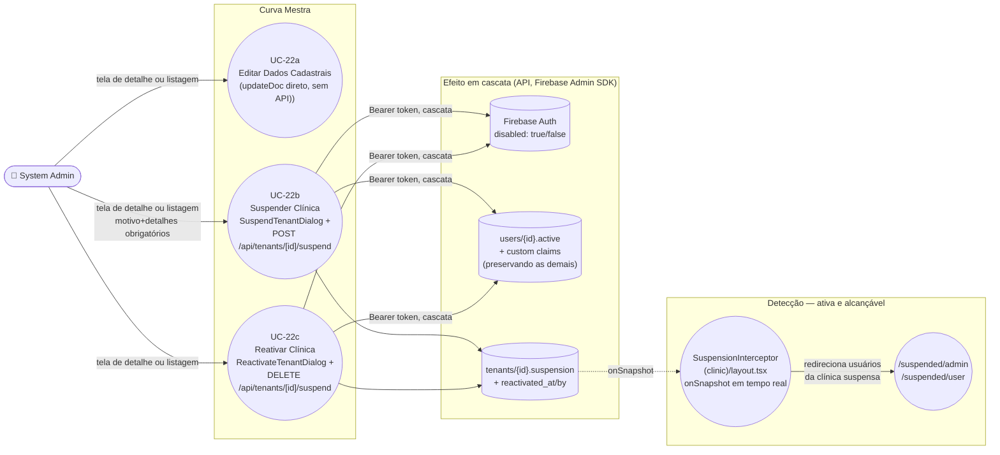

# UC-22: Editar, Desativar e Reativar Clínica

**Projeto:** Curva Mestra
**Data de Criação:** 14/07/2026
**Autor:** Guilherme Scandelari (via uml-use-case-writer)
**Status:** Aprovado
**Módulo/Contexto:** Administração do Sistema (Gestão de Clínicas)
**Versão:** 2.0.1

> Um System Admin edita os dados cadastrais de uma clínica (nome, documento, contato, endereço) e/ou suspende/reativa seu acesso, acionável a partir de **duas telas diferentes**: a tela de detalhe (`admin/tenants/[id]/page.tsx`) e a listagem (`admin/tenants/page.tsx`) — hoje com **paridade completa** entre as duas (suspender e reativar disponíveis em ambas). O commit `90b8a6f` ("fix: reconecta mecanismo completo de suspensao de clinica") **removeu** o mecanismo simples que só alternava `tenants/{id}.active` (`tenantServiceDirect.deactivateTenant`/`reactivateTenant` não existem mais) e reconectou o mecanismo rico que antes era código órfão: as duas telas usam exclusivamente `SuspendTenantDialog`/`ReactivateTenantDialog` (`POST`/`DELETE /api/tenants/[id]/suspend`), que exigem motivo formal, detalhes e e-mail de contato, e desativam/reativam em cascata **todos os usuários da clínica** (custom claims + `users/{id}.active`), com auditoria completa (`suspended_by`/`suspended_at`/`reason`/`details`/`contact_email`; `reactivated_by`/`reactivated_at`). **Correção nesta revisão (commit `529adc3`):** as duas lacunas residuais apontadas na revisão da v2.0 foram fechadas — (1) o campo "Status" redundante do formulário de edição cadastral, que permitia ao próprio system_admin alternar `tenants/{id}.active` diretamente sem passar pelo mecanismo rico, foi **removido**; (2) a cascata de suspensão/reativação passou a chamar `adminAuth.updateUser(userId, { disabled })`, bloqueando de fato a conta no Firebase Auth (mesmo padrão de UC-29/UC-36). O mecanismo rico agora é, na prática, o único caminho de UI para alterar o status de uma clínica.

---

## 1. Diagrama UML (Mermaid)

---

## 2. Atores

### 2.1 Ator Primário
**System Admin** — acesso às telas restrito pelo layout do grupo `(admin)` (`ProtectedRoute allowedRoles: ['system_admin']`).

### 2.2 Atores Secundários / Sistemas Externos
- Usuários da clínica afetada (`clinic_admin`/`clinic_user`) são impactados diretamente pela suspensão/reativação: desde o commit `90b8a6f`, seus documentos `users/{id}.active` e suas custom claims (`active`) são alterados em cascata pela API, e o `SuspensionInterceptor` (montado em `src/app/(clinic)/layout.tsx`) os redireciona em tempo real para `/suspended/admin`/`/suspended/user`.
- Firebase Auth / Admin SDK (`adminAuth.getUser`, `adminAuth.setCustomUserClaims`, `adminAuth.updateUser`) — usado pela API `/api/tenants/[id]/suspend` para atualizar as claims de cada usuário da clínica (preservando as demais claims existentes) e, desde o commit `529adc3`, para bloquear/desbloquear efetivamente a conta no Firebase Auth (`disabled: true`/`false`).

---

## 3. Pré-condições
- System Admin autenticado, `is_system_admin === true`.
- Para a tela de detalhe: existe um tenant com o id da URL.
- Para o atalho de suspender na listagem: a listagem já carregou ao menos um tenant com `active === true` (o ícone `XCircle`/`SuspendTenantDialog` só é renderizado para tenants ativos).
- Para o atalho de reativar na listagem: a listagem já carregou ao menos um tenant com `active === false` (o ícone `CheckCircle`/`ReactivateTenantDialog` só é renderizado para tenants inativos).
- Para suspender: System Admin deve fornecer um motivo válido (`payment_failure`/`contract_breach`/`terms_violation`/`fraud_detected`/`other`) e um texto de detalhes não vazio — validados tanto no client (`SuspendTenantDialog`, botão desabilitado) quanto no servidor (`POST /api/tenants/[id]/suspend`).

---

## 4. Pós-condições

### 4.1 Sucesso — Editar dados cadastrais (somente na tela de detalhe)
- O documento `tenants/{id}` é atualizado (`name`, `document_type`, `document_number`, `cnpj`, `max_users` recalculado, `email`, `phone`, `address`) via `updateDoc` direto (client-side, sem API route dedicada) — RN-01.
- **Corrigido no commit `529adc3`:** o formulário de edição não possui mais campo "Status"; o payload enviado a `updateTenant` nunca inclui `active`. O status da clínica (`tenants/{id}.active`) só é alterado pelos fluxos 4.1b/4.1c (`SuspendTenantDialog`/`ReactivateTenantDialog`). O badge de status exibido no topo da página e no card de resumo continua somente leitura.

### 4.1b Sucesso — Suspender clínica (tela de detalhe **ou** listagem, via `SuspendTenantDialog`)
- `tenants/{id}.active` passa para `false`.
- `tenants/{id}.suspension` é gravado com `{ suspended: true, reason, details, suspended_at, suspended_by: uid do system_admin, contact_email }`.
- **Cascata sobre usuários (corrige RN-03/RN-05):** todos os documentos em `users` com `tenant_id` igual ao da clínica têm `active` setado para `false`, e suas custom claims são atualizadas para `{ ...currentClaims, active: false }` — preservando as demais claims (`role`, `tenant_id`, `is_system_admin`, `requirePasswordChange`, etc.), buscadas via `adminAuth.getUser(userId).customClaims` antes da sobrescrita.
- **Corrigido no commit `529adc3` (RNF-05):** a API agora também chama `adminAuth.updateUser(userId, { disabled: true })` para cada usuário da clínica, bloqueando de fato o Firebase Auth — não apenas a claim e o documento Firestore.
- Resultado idêntico independentemente de qual das duas telas disparou a ação — ambas usam o mesmo componente (RN-07, RN-08).

### 4.1c Sucesso — Reativar clínica (tela de detalhe **ou** listagem, via `ReactivateTenantDialog`)
- `tenants/{id}.active` volta para `true`; `tenants/{id}.suspension` é removido (`FieldValue.delete()`); `tenants/{id}.reactivated_at`/`reactivated_by` são gravados.
- Cascata sobre usuários: todos os `users` do tenant voltam a `active: true`, com as claims restauradas preservando as demais (mesmo padrão de 4.1b).
- **Corrigido no commit `529adc3`:** a API também chama `adminAuth.updateUser(userId, { disabled: false })` para cada usuário, restaurando o acesso ao Firebase Auth (mesma correção de 4.1b).
- Este fluxo é acionável tanto pela tela de detalhe quanto pela listagem (RN-07).

### 4.2 Falha (Garantias Mínimas)
- Nenhuma alteração é feita.
- Para edição cadastral: mensagem de erro exibida no bloco inline do formulário (`error` state).
- Para suspender/reativar (ambas as telas, mesmo componente): mensagem de erro exibida via `toast` destrutivo (`useToast`).

---

## 5. Gatilho (Trigger)
- **Tela de detalhe:** System Admin acessa `/admin/tenants/{id}` e edita o formulário e/ou clica em "Desativar Clínica" (abre `SuspendTenantDialog`) ou "Reativar Clínica" (abre `ReactivateTenantDialog`).
- **Tela de listagem:** System Admin, em `/admin/tenants`, clica no ícone `XCircle` (linha de um tenant ativo, abre `SuspendTenantDialog`) ou no ícone `CheckCircle` verde (linha de um tenant inativo, abre `ReactivateTenantDialog`) — sem precisar entrar na tela de detalhe.

---

## 6. Fluxo Principal (Basic Flow) — Editar dados cadastrais (tela de detalhe)

1. System Admin acessa `/admin/tenants/{id}`.
2. Sistema carrega o tenant (`getTenant`) e a lista de usuários da clínica (`listClinicUsers`), pré-preenchendo o formulário (nome, documento formatado, e-mail, telefone, endereço). O status da clínica é exibido apenas como badge somente leitura, fora do formulário.
3. System Admin altera os campos desejados (nome, CPF/CNPJ, e-mail, telefone, endereço). **Corrigido no commit `529adc3`:** o formulário não possui mais nenhum campo/toggle para alternar o status da clínica.
4. System Admin clica em "Salvar Alterações".
5. Sistema valida: nome preenchido, documento com dígitos verificadores válidos, e-mail preenchido, tipo de documento determinável a partir do número informado.
6. Sistema chama `updateTenant(tenantId, { name, document_type, document_number, cnpj, max_users: docType === "cpf" ? 1 : 5, email, phone, address })` — um `updateDoc` direto no Firestore, sem passar por nenhuma API route (RN-01). O payload nunca inclui `active` — a edição cadastral não tem mais nenhum caminho capaz de alterar o status da clínica.
7. Sistema exibe "Clínica atualizada com sucesso!" e, após 1,5s, redireciona para `/admin/tenants`.
8. Caso de uso é concluído com sucesso.

---

## 7. Fluxos Alternativos

### 7a. Suspender clínica pela tela de detalhe (via "Zona de Perigo" — só visível se `tenant.active`)
1. System Admin clica em "Desativar Clínica".
2. Sistema abre `SuspendTenantDialog` (não mais `confirm()` nativo — corrige RN-04), exibindo nome/e-mail da clínica, um campo obrigatório "Motivo da Suspensão" (`Select` com 5 opções: Falha no Pagamento, Quebra de Contrato, Violação dos Termos de Uso, Fraude Detectada, Outro Motivo), um campo obrigatório "Detalhes Adicionais" (`Textarea`) e um campo "E-mail de Contato para Suporte" (pré-preenchido, editável).
3. System Admin seleciona um motivo, preenche os detalhes e, opcionalmente, ajusta o e-mail de contato. O botão "Suspender Clínica" permanece desabilitado até `reason` e `details` estarem preenchidos.
4. System Admin clica em "Suspender Clínica".
5. Sistema chama `POST /api/tenants/{id}/suspend` com `Authorization: Bearer {idToken}` do System Admin autenticado, enviando `{ reason, details, contact_email }`.
6. API verifica autenticação (401 se ausente/inválida) e `is_system_admin` (403 caso contrário); valida `reason` (obrigatório, dentre os 5 valores válidos) e `details` (obrigatório, não vazio após `trim()`).
7. API grava em `tenants/{id}`: `active: false`, `suspension: { suspended: true, reason, details, suspended_at, suspended_by: uid, contact_email }`, `updated_at`.
8. API busca todos os documentos `users` com `tenant_id` igual ao da clínica.
9. Para cada usuário: busca as claims atuais via `adminAuth.getUser(userId).customClaims`, chama `setCustomUserClaims(userId, { ...currentClaims, active: false })`, chama `adminAuth.updateUser(userId, { disabled: true })` (bloqueia a conta no Firebase Auth — corrige RNF-05), e atualiza `users/{id}.active = false`.
10. API responde com sucesso e `users_affected` (contagem de usuários impactados).
11. Sistema exibe `toast` "Clínica suspensa com sucesso" com a contagem de usuários desativados, fecha o dialog, limpa `reason`/`details`, e recarrega os dados via `onSuccess` (`loadTenant`).

### 7b. Reativar clínica pela tela de detalhe (via "Reativar Clínica" — só visível se `!tenant.active`)
1. System Admin clica em "Reativar Clínica".
2. Sistema abre `ReactivateTenantDialog`, exibindo nome/e-mail da clínica e, se existir, um resumo da suspensão atual (`tenant.suspension.details`).
3. System Admin clica em "Confirmar Reativação".
4. Sistema chama `DELETE /api/tenants/{id}/suspend` com `Authorization: Bearer {idToken}`.
5. API verifica autenticação e `is_system_admin`; busca o tenant (404 se não existir).
6. API grava em `tenants/{id}`: `active: true`, `suspension` removido (`FieldValue.delete()`), `reactivated_at`, `reactivated_by: uid`, `updated_at`.
7. API busca todos os `users` do tenant e, para cada um, preserva as claims atuais (mesmo padrão do passo 9 de 7a), seta `active: true`, chama `adminAuth.updateUser(userId, { disabled: false })` (restaura o acesso ao Firebase Auth — corrige RNF-05), e atualiza `users/{id}.active = true`.
8. Sistema exibe `toast` "Clínica reativada com sucesso" com a contagem de usuários reativados, fecha o dialog, recarrega os dados via `onSuccess` (`loadTenant`).

### 7c. Suspender clínica diretamente pela listagem (`admin/tenants/page.tsx`) — atalho, sem passar pela tela de detalhe
1. System Admin, em `/admin/tenants`, localiza uma clínica ativa (badge "Ativo") e clica no ícone `XCircle` na coluna "Ações" da linha correspondente.
2. Sistema abre exatamente o mesmo `SuspendTenantDialog` do fluxo 7a (componente único, reutilizado — não há duas implementações).
3-5. Mesmos passos de 7a (passos 3-10).
6. Sistema recarrega a listagem (`loadTenants`) via `onSuccess`; o feedback de sucesso é o mesmo `toast` de 7a.

### 7d. Reativar clínica diretamente pela listagem
1. System Admin, em `/admin/tenants`, localiza uma clínica inativa (badge "Inativo") e clica no ícone `CheckCircle` verde na coluna "Ações".
2. Sistema abre exatamente o mesmo `ReactivateTenantDialog` do fluxo 7b.
3-4. Mesmos passos de 7b (passos 3-7).
5. Sistema recarrega a listagem (`loadTenants`) via `onSuccess`.

---

## 8. Fluxos de Exceção

### 8a. Validação de dados cadastrais falha (a partir do passo 5 do Fluxo Principal)
1. Nome vazio, documento com dígitos verificadores inválidos, e-mail vazio, ou tipo de documento não determinável a partir do número.
2. Sistema exibe a mensagem de erro específica; nada é gravado.

### 8b. Erro ao salvar dados cadastrais (tela de detalhe)
1. `updateTenant` lança exceção (rede, permissão, etc.) ao salvar nome/documento/e-mail/telefone/endereço.
2. Sistema exibe a mensagem de erro retornada (ou uma genérica) no bloco inline do formulário.

### 8c. Erro ao suspender/reativar (qualquer uma das duas telas, via `SuspendTenantDialog`/`ReactivateTenantDialog`)
1. A API `/api/tenants/[id]/suspend` retorna erro: 401 (token ausente/inválido), 403 (usuário não é `is_system_admin`), 400 (`reason` ausente/inválido ou `details` vazio, apenas no `POST`), 404 (tenant não encontrado), ou 500 (erro inesperado, ex.: falha ao atualizar um usuário na cascata — incluindo a chamada a `adminAuth.updateUser`).
2. Sistema exibe `toast` destrutivo com `data.error` (ou uma mensagem genérica: "Erro ao suspender clínica"/"Erro ao reativar clínica"); o dialog permanece aberto para nova tentativa. Aplica-se identicamente às quatro entradas (7a-7d), já que usam os mesmos componentes.

---

## 9. Regras de Negócio Relacionadas

| ID | Regra | Justificativa |
|----|-------|----------------|
| RN-01 | **[Atualizado em v2.0.1]** Edição de dados cadastrais (nome, documento, e-mail, telefone, endereço) continua usando `updateDoc` direto no Firestore (client-side), sem API route dedicada nem Bearer token. Desde o commit `529adc3`, esse caminho não inclui mais `active` no payload — a edição cadastral não é mais capaz de alterar o status da clínica sob nenhuma circunstância. Suspender e reativar clínica continuam usando `POST`/`DELETE /api/tenants/[id]/suspend`, com verificação de Bearer token e `is_system_admin` no servidor — o mesmo padrão de segurança já usado por UC-21 (criação). | Confirmado por leitura de `updateTenant`/`handleSubmit` em `admin/tenants/[id]/page.tsx` (payload sem `active`) e de `SuspendTenantDialog`/`ReactivateTenantDialog`, que chamam `fetch('/api/tenants/{id}/suspend', ...)` com header `Authorization: Bearer {token}`. |
| RN-02 | **[CORRIGIDO em v2.0.1 — commit `529adc3`]** Antes: o campo "Status" dentro do formulário principal (tela de detalhe) permitia ao próprio system_admin alternar `tenants/{id}.active` diretamente via `updateTenant`, contornando por completo o mecanismo rico reconectado em v2.0 (sem motivo, sem `suspension`, sem cascata sobre usuários, sem auditoria) — porque a regra do Firestore introduzida para RN-06 só restringe usuários que satisfazem `belongsToTenant(tenantId)`, não `isSystemAdmin()`. Agora: o campo "Status" (toggle "Ativo"/"Inativo") foi removido inteiramente do formulário — estado local (`active`/`setActive`), pré-preenchimento a partir de `loadTenant` e envio no payload de `updateTenant` não existem mais. O badge de status no topo/card de resumo permanece somente leitura. O único caminho de UI capaz de alterar `tenants/{id}.active` é, agora sim, o mecanismo rico (`SuspendTenantDialog`/`ReactivateTenantDialog`). | Confirmado por leitura de `admin/tenants/[id]/page.tsx` após o commit `529adc3` — ausência de qualquer estado/campo/payload relacionado a `active` no formulário de edição. |
| RN-03 | **[CORRIGIDO em v2.0 — commit `90b8a6f`]** Antes: desativar/reativar por qualquer uma das duas telas apenas alternava `tenants/{id}.active` — nenhum usuário individual era tocado. Agora: `POST`/`DELETE /api/tenants/[id]/suspend` desativam/reativam em cascata todos os usuários da clínica — para cada `users` com `tenant_id` igual ao da clínica, a API busca as claims atuais (`adminAuth.getUser(userId).customClaims`) e sobrescreve apenas `active`, preservando as demais (`role`, `tenant_id`, `is_system_admin`, `requirePasswordChange`, etc.), além de atualizar `users/{id}.active` no Firestore. Desde o commit `529adc3`, a cascata também bloqueia/restaura a conta no Firebase Auth (ver RNF-05). | Confirmado por leitura completa de `src/app/api/tenants/[id]/suspend/route.ts` (`POST` e `DELETE`). |
| RN-04 | **[CORRIGIDO em v2.0 — commit `90b8a6f`]** Antes: todas as ações de desativar/reativar, em ambas as telas, exigiam apenas uma confirmação nativa do navegador (`confirm()`), sem motivo, sem detalhes, sem e-mail de contato. Agora: `SuspendTenantDialog` exige a seleção de um motivo formal (5 opções) e um campo de detalhes obrigatório (não vazio), além de um e-mail de contato editável (pré-preenchido); o botão de confirmação permanece desabilitado até `reason` e `details` estarem preenchidos. `ReactivateTenantDialog` não exige motivo (reversão simples), mas exibe o resumo da suspensão atual quando existir. | Confirmado por leitura completa de `SuspendTenantDialog`/`ReactivateTenantDialog` (`src/components/admin/SuspendTenantDialog.tsx`). |
| RN-05 | **[CORRIGIDO em v2.0 — commit `90b8a6f`, achado crítico da v1.0; reforçado em v2.0.1]** Antes: `SuspendTenantDialog`/`ReactivateTenantDialog` eram código órfão, nunca importados por nenhuma tela; a API `/api/tenants/[id]/suspend` existia, mas nunca era chamada. Agora: `admin/tenants/page.tsx` e `admin/tenants/[id]/page.tsx` importam e usam ambos os diálogos. Desde o commit `529adc3` (RN-02), o mecanismo rico deixou de ser apenas o caminho *preferencial* e passou a ser o **único** caminho de UI capaz de alterar o status de uma clínica — o toggle redundante que o contornava foi removido. | Confirmado por leitura completa de ambos os arquivos de tela e do componente após os commits `90b8a6f` e `529adc3`. |
| RN-06 | **[CORRIGIDO em v2.0 — commit `90b8a6f`; ressalva fechada na prática em v2.0.1]** Antes: a regra do Firestore para `tenants/{tenantId}` permitia `update` a qualquer usuário que `belongsToTenant(tenantId)`, incluindo os campos `active`/`suspension` — um `clinic_admin`/`clinic_user` da própria clínica poderia, em tese, reativar a própria clínica escrevendo diretamente via SDK. Agora: a regra ganhou uma cláusula adicional — `allow update: if belongsToTenant(tenantId) && !request.resource.data.diff(resource.data).affectedKeys().hasAny(['active', 'suspension', 'reactivated_at', 'reactivated_by'])` — bloqueando escrita nesses quatro campos para quem só satisfaz `belongsToTenant`. Essa restrição continua não se aplicando ao `system_admin`, coberto pela regra separada e irrestrita `allow read, write: if isSystemAdmin()` (`firestore.rules`, linha 43) — isso é o modelo de privilégio administrativo do projeto, não um bug específico deste UC. Antes do commit `529adc3`, essa lacuna era explorável por um caminho de UI concreto (o toggle "Status", RN-02); com sua remoção, não há mais nenhuma tela que use esse acesso irrestrito do system_admin para alterar `active` fora do mecanismo rico — a exposição residual (acesso via console/script direto) é inerente ao papel `system_admin` em qualquer campo de qualquer documento, não específica deste caso de uso. | Confirmado por leitura de `firestore.rules` (`match /tenants/{tenantId}`, regra `allow update`, linha 43) e da ausência de UI que explore esse acesso após o commit `529adc3`. |
| RN-07 | **[CORRIGIDO em v2.0 — commit `90b8a6f`]** Antes: a ação "Desativar" tinha atalho na listagem, mas não havia atalho equivalente de "Reativar" — só era possível reativar entrando na tela de detalhe. Agora: `admin/tenants/page.tsx` renderiza condicionalmente `SuspendTenantDialog` (ícone `XCircle`, quando `tenant.active`) ou `ReactivateTenantDialog` (ícone `CheckCircle` verde, quando `!tenant.active`) na coluna "Ações" — a listagem tem paridade completa com a tela de detalhe para as duas ações. | Confirmado por leitura de `admin/tenants/page.tsx` (renderização condicional dos dois diálogos na coluna "Ações"). |
| RN-08 | **[CORRIGIDO em v2.0.1]** Antes (v1.x): a listagem usava `alert()` nativo para erro e não exibia nenhuma confirmação de sucesso na desativação, enquanto a tela de detalhe usava blocos de mensagem inline para ambos os casos. Em v2.0, o feedback de suspender/reativar foi unificado (`toast` em ambas as telas), mas restava um terceiro padrão de feedback residual: o toggle "Status" do formulário de edição, ao ser salvo, usava o feedback inline do formulário para o mesmo efeito (`active`). Com a remoção do toggle no commit `529adc3`, esse terceiro caminho deixou de existir — o feedback de alterar o status de uma clínica é, hoje, sempre via `toast` (`SuspendTenantDialog`/`ReactivateTenantDialog`), em qualquer uma das quatro entradas (7a-7d). A edição cadastral (nome, documento, e-mail, telefone, endereço) continua com feedback inline próprio, mas essa é uma ação distinta (não altera `active`), fora do escopo desta regra. | Confirmado por leitura comparada de `admin/tenants/page.tsx`, `admin/tenants/[id]/page.tsx` e `SuspendTenantDialog.tsx` após os commits `90b8a6f` e `529adc3`. |

---

## 10. Requisitos Especiais / Não Funcionais

| ID | Descrição | Categoria |
|----|-----------|-----------|
| RNF-01 | **[CORRIGIDO em v2.0.1]** Antes: o mecanismo simples não registrava motivo nem auditoria da desativação. Em v2.0 a suspensão/reativação via API passou a gravar `suspended_by`/`suspended_at`/`reason`/`details`/`contact_email`/`reactivated_by`/`reactivated_at`, mas restava a ressalva de que o toggle "Status" do formulário de edição alterava `active` sem qualquer registro de auditoria. Com a remoção do toggle no commit `529adc3`, `active` só é alterado pela API, que sempre grava a auditoria completa — não há mais nenhum caminho de alteração de status sem auditoria. | Auditoria |
| RNF-02 | `useTenantSuspension` usa `onSnapshot` (listener em tempo real no documento `tenants/{id}`) — o campo `suspension` é gravado pela API, e o bloqueio de acesso via `SuspensionInterceptor` é imediato para qualquer usuário de clínica já navegando dentro do grupo `(clinic)`, sem depender de refresh de token. | Observação técnica |
| RNF-03 | **[CORRIGIDO em v2.0.1]** Suspender/reativar usa API route com Bearer token (mesmo padrão de UC-21). Em v2.0 restava a ressalva de que o toggle "Status" redundante no formulário de edição alterava `active` via `updateDoc` direto, sem Bearer token. Com sua remoção (commit `529adc3`), o campo `active` só é alterável pela rota autenticada. A edição de dados puramente cadastrais (nome, documento, e-mail, telefone, endereço) continua usando `updateDoc` direto sem Bearer token (RN-01) — comportamento aceito, já que não toca em campos de status/segurança, e protegido pela regra do Firestore (`isSystemAdmin()`). | Segurança |
| RNF-04 | **[CORRIGIDO em v2.0 — commit `90b8a6f`; nuance de RN-08 fechada em v2.0.1]** Ambas as telas usam exatamente os mesmos componentes de suspender/reativar, com feedback padronizado via `toast`. Cadastro/edição cadastral continua com mensagens inline distintas (ação diferente, fora do escopo desta regra); o terceiro padrão de feedback que existia para o toggle "Status" foi eliminado junto com sua remoção. | Consistência de UI |
| RNF-05 | **[CORRIGIDO em v2.0.1 — commit `529adc3`]** Antes: a cascata de desativação/reativação (`POST`/`DELETE /api/tenants/[id]/suspend`) atualizava a claim `active` e o documento `users/{id}.active` de cada usuário da clínica, mas não chamava `adminAuth.updateUser(userId, { disabled })` — a conta do Firebase Auth em si não era desabilitada, diferente do padrão análogo usado em UC-29. Agora: o handler `POST` chama `adminAuth.updateUser(userId, { disabled: true })` logo após `setCustomUserClaims` (linha 113); o handler `DELETE` chama `adminAuth.updateUser(userId, { disabled: false })` na mesma posição relativa (linha 202). A suspensão bloqueia de fato o Firebase Auth, consistente com UC-29/UC-36. O bloqueio de acesso para quem já está navegando no grupo `(clinic)` continua dependendo do listener em tempo real (`SuspensionInterceptor`); a diferença é que, agora, mesmo um usuário que tente logar novamente ou obter um novo ID token é bloqueado diretamente pelo Firebase Auth, sem depender só da claim/documento Firestore. | Segurança |

---

## 11. Frequência de Uso
Ocasional — edição/suspensão/reativação de clínicas não são operações do dia a dia do System Admin.

---

## 12. Casos de Uso Relacionados
- **UC-21 (Cadastrar Nova Clínica)** é pré-condição — só se edita/suspende uma clínica que já existe. Suspender/reativar seguem o mesmo padrão de API com Bearer token já usado por UC-21 (RN-01).
- **UC-04 (Fazer Login com Redirecionamento por Papel)** já documenta, de forma independente, o comportamento de `clinic_admin`/`clinic_user` ao tentar logar com uma clínica `active: false` — este UC é quem efetivamente altera esse campo.
- A tela de detalhe (`admin/tenants/[id]/page.tsx`) também permite "Adicionar Usuário" à clínica e "Configurar/Alterar/Remover Consultor Rennova" — ambas ações já mapeadas como UCs próprios: **UC-23 (Vincular, Alterar e Remover Consultor de uma Clínica)** e **UC-39 (Criar Usuário Diretamente para uma Clínica via Painel Admin)**.
- Este UC compartilha o mesmo padrão de correção (reconectar mecanismo rico órfão + corrigir bug de reconstrução de custom claims do zero) documentado para consultores em `ONLY_FOR_DEVS/TASK_COMPLETED/BUGFIX-suspend-consultant-reconnect-delete.md` (UC-29). **Desde o commit `529adc3`, a rota de tenant (`/api/tenants/[id]/suspend`) também desabilita a conta no Firebase Auth (`disabled: true`/`false`), alinhada ao padrão de UC-29 — a diferença documentada em revisões anteriores (RNF-05) foi eliminada.**

---

## 13. Referências
- `src/app/(admin)/admin/tenants/[id]/page.tsx` (tela de detalhe — editar, suspender via `SuspendTenantDialog`, reativar via `ReactivateTenantDialog`; toggle "Status" removido no commit `529adc3`)
- `src/app/(admin)/admin/tenants/page.tsx` (listagem — atalhos de suspender e reativar, ambos via os mesmos diálogos)
- `src/lib/services/tenantServiceDirect.ts` (`updateTenant`, `getTenant`, `listTenants`, `createTenant` — `deactivateTenant`/`reactivateTenant` **removidos** no commit `90b8a6f`)
- `src/components/admin/SuspendTenantDialog.tsx` (`SuspendTenantDialog`, `ReactivateTenantDialog` — usados por ambas as telas desde v2.0)
- `src/app/api/tenants/[id]/suspend/route.ts` (`POST`/`DELETE` — cascata de usuários, auditoria; `adminAuth.updateUser({ disabled })` adicionado no commit `529adc3`)
- `src/hooks/useTenantSuspension.ts`, `src/components/auth/SuspensionInterceptor.tsx`, montados em `src/app/(clinic)/layout.tsx`
- `src/app/suspended/admin/page.tsx`, `src/app/suspended/user/page.tsx`
- `src/types/index.ts` (`SuspensionInfo`, `SuspensionReason`, `Tenant.reactivated_at`/`reactivated_by`)
- `firestore.rules` (regra de `tenants/{tenantId}` — cláusula `affectedKeys().hasAny([...])`, RN-06; regra `allow read, write: if isSystemAdmin()` na linha 43)
- Commit `90b8a6f` — `fix: reconecta mecanismo completo de suspensao de clinica (UC-22)`
- Commit `529adc3` — `fix: fecha as duas lacunas remanescentes do UC-22 apontadas na revisao`
- `ONLY_FOR_DEVS/TASK_COMPLETED/BUGFIX-suspend-consultant-reconnect-delete.md` — precedente análogo (UC-29), usado como referência de estilo para esta correção
- `ONLY_FOR_DEVS/PO_BA_Docs/_MAPA-DE-BUGS-E-MELHORIAS.md` — ainda lista `UC-22-RN-05`, `UC-22-RN-06`, `UC-22-RN-07`, `UC-22-RN-08`, `UC-22-RNF-01` e `UC-22-Decisão` como "Aberto"/pendentes; precisa de sincronização (recomendado acionar o agente `uc-issues-tracker`, Modo B, após esta atualização) — agora inclui também o fechamento de RN-02 e RNF-05

---

## 14. Perguntas em Aberto / Decisões Pendentes

1. **[RESOLVIDO em v2.0]** A decisão de produto pendente na v1.0/v1.1 (conectar o mecanismo rico vs. remover o mecanismo rico) foi tomada: **Opção (a), conectar** — implementada no commit `90b8a6f`. O mecanismo simples (`deactivateTenant`/`reactivateTenant`) foi removido. Mantido aqui apenas como registro histórico da decisão.
2. **[RESOLVIDO em v2.0.1 — commit `529adc3`]** O toggle "Status" redundante no formulário de edição (RN-02) permitia ao próprio system_admin alternar `tenants/{id}.active` diretamente, sem motivo, sem cascata sobre usuários e sem qualquer auditoria, contornando o mecanismo rico. **Decisão tomada:** remover o toggle do formulário principal — suspender/reativar ficam exclusivamente nos diálogos dedicados (`SuspendTenantDialog`/`ReactivateTenantDialog`). Confirmado por leitura de `admin/tenants/[id]/page.tsx`: nenhum estado, campo ou payload relacionado a `active` restou no formulário de edição.
3. **[Resolvido em v1.1]** "Adicionar Usuário à Clínica" e "Gerenciar Consultor Rennova da Clínica" — ambos presentes na tela de detalhe — foram mapeados como UCs formais: **UC-39** e **UC-23**, respectivamente.
4. **[RESOLVIDO em v2.0]** A assimetria de RN-07 (atalho de "Desativar" existia na listagem, sem equivalente de "Reativar") foi corrigida no commit `90b8a6f` — a listagem agora tem paridade completa.
5. **[RESOLVIDO em v2.0.1]** A inconsistência de feedback de UI de RN-08 (mensagem inline vs. `alert()`) foi corrigida para a ação de suspender/reativar em si na v2.0 (ambas as telas usam o mesmo `toast`). A inconsistência residual apontada em v2.0 — o terceiro padrão de feedback do toggle "Status" — deixou de existir junto com a remoção do próprio toggle no commit `529adc3`.
6. **[RESOLVIDO em v2.0.1 — commit `529adc3`]** RNF-05: a cascata de suspensão/reativação não chamava `adminAuth.updateUser(userId, { disabled })`, diferente do padrão análogo de UC-29. Corrigido — `disabled: true` no `POST`, `disabled: false` no `DELETE`, confirmado por leitura literal de `src/app/api/tenants/[id]/suspend/route.ts`.

Não restam pendências conhecidas sobre o mecanismo de editar/suspender/reativar clínica neste UC. A única observação estrutural remanescente (nota de RN-06/RNF-03) é que a regra do Firestore concede ao `system_admin` acesso de leitura/escrita irrestrito a qualquer campo de `tenants/{tenantId}` — um traço do modelo de privilégio administrativo do projeto como um todo, não um achado específico deste caso de uso, e sem nenhum caminho de UI que o explore após esta correção.

---

## 15. Histórico de Versões

| Versão | Data | Autor | O que mudou |
|--------|------|-------|--------------|
| 1.0 | 14/07/2026 | Guilherme Scandelari | Versão inicial, investigada do zero. Confirmado que `admin/tenants/[id]/page.tsx` usa exclusivamente o mecanismo simples (`deactivateTenant`/`reactivateTenant`, RN-03) — o mecanismo rico de suspensão (`SuspendTenantDialog`/`ReactivateTenantDialog`) é confirmadamente órfão (nenhum import em todo o projeto), apesar de sua API (`/api/tenants/[id]/suspend`) e seu lado de "detecção" (`useTenantSuspension`, `SuspensionInterceptor`, telas `/suspended/*`) estarem implementados e ativos em produção (RN-05) — documentado com o mesmo rigor do UC-05, sem assumir qual dos dois caminhos (implementar ou remover) é o correto. Identificado também um risco de segurança confirmado: a regra do Firestore para `tenants/{tenantId}` permite que o próprio tenant edite seus dados via `belongsToTenant`, não restrito a `system_admin` (RN-06). |
| 1.1 | 15/07/2026 | Guilherme Scandelari | Seção 12 e seção 14 (item 3) atualizadas: as duas ações citadas como "candidatas a UCs próprios futuros" na mesma tela — "Adicionar Usuário à Clínica" e "Gerenciar Consultor Rennova da Clínica" — foram mapeadas formalmente como **UC-39** e **UC-23**, respectivamente. Nenhuma alteração de conteúdo técnico deste UC (RN-01 a RN-06 permanecem inalteradas). |
| 1.2 | 15/07/2026 | Guilherme Scandelari | **Achado da varredura final de cobertura do Portal Admin:** confirmado que a ação "Desativar Clínica" também é acionável diretamente pela listagem (`admin/tenants/page.tsx`), não apenas pela tela de detalhe — um segundo ponto de entrada, até então não documentado, que chama exatamente a mesma função de serviço (`deactivateTenant`). Adicionado o Fluxo Alternativo 7c, a pré-condição correspondente, RN-07 (assimetria: não existe atalho equivalente de "Reativar" na listagem) e RN-08 (inconsistência de feedback de UI entre as duas telas — `alert()` vs. mensagem inline). Blockquote, diagrama, gatilho, pós-condições e referências atualizados para refletir as duas telas. Nenhuma mudança de comportamento foi feita — apenas documentação de um caminho de UI pré-existente e não mapeado. |
| 2.0 | 18/07/2026 | Guilherme Scandelari | **Mudança de mecanismo inteiro (não pontual) — commit `90b8a6f`.** Decisão de produto: reconectar o mecanismo rico de suspensão em vez de manter o simples (resolve a Decisão pendente desde v1.0). `deactivateTenant`/`reactivateTenant` foram removidos de `tenantServiceDirect.ts`; as duas telas passam a usar exclusivamente `SuspendTenantDialog`/`ReactivateTenantDialog` (`POST`/`DELETE /api/tenants/[id]/suspend`), com motivo formal, detalhes obrigatórios, e-mail de contato, e cascata real sobre todos os usuários da clínica (claims + `users/{id}.active`), corrigindo também um bug de reconstrução de claims do zero que existia mesmo antes da rota ser reconectada. Auditoria completa adicionada (`reactivated_at`/`reactivated_by`, novos campos em `Tenant`). Regra do Firestore (`tenants/{tenantId}`) restringe `belongsToTenant` de alterar `active`/`suspension`/`reactivated_at`/`reactivated_by` diretamente. Listagem ganha atalho de reativar (`CheckCircle`), alcançando paridade com a tela de detalhe. **RN-03, RN-04, RN-05, RN-06 e RN-07 marcados como corrigidos; RN-08 e RNF-01 marcados como corrigidos (RN-08 parcialmente); RNF-03 parcialmente corrigido.** Diagrama, pós-condições, gatilho, fluxos principal/alternativos/exceção e seção 14 reescritos por completo. **Achado residual novo (RN-02, elevado):** o toggle "Status" redundante no formulário de edição continua contornando o mecanismo rico para o próprio system_admin, já que a regra do Firestore introduzida para RN-06 não se aplica a `isSystemAdmin()` — registrado como nova pergunta em aberto (Seção 14, item 2). **Achado técnico novo (RNF-05):** a cascata de desativação não desabilita a conta no Firebase Auth (`disabled`), diferente do padrão análogo usado em UC-29. |
| 2.0.1 | 18/07/2026 | Guilherme Scandelari | **Fechamento das duas lacunas residuais apontadas na revisão da v2.0 — commit `529adc3`.** (1) RN-02: o toggle "Status" foi removido inteiramente do formulário de edição em `admin/tenants/[id]/page.tsx` (estado `active`/`setActive` eliminado, sem pré-preenchimento a partir de `loadTenant`, sem envio no payload de `updateTenant`) — o mecanismo rico passa a ser o único caminho de UI capaz de alterar o status de uma clínica; badge de status permanece somente leitura. (2) RNF-05: `POST`/`DELETE /api/tenants/[id]/suspend` passam a chamar `adminAuth.updateUser(userId, { disabled: true/false })`, bloqueando/restaurando de fato a conta no Firebase Auth, alinhado ao padrão de UC-29/UC-36. **RN-02, RN-08 (integralmente, não mais parcial), RNF-01, RNF-03 e RNF-05 marcados como corrigidos; RN-06 com ressalva fechada na prática (sem caminho de UI residual).** Seção 14: itens 2 e 6 marcados como resolvidos; item 5 atualizado para refletir a correção integral de RN-08. Blockquote, diagrama (nó `Auth` adicionado à cascata), pós-condições, fluxo principal e fluxos alternativos atualizados. Nenhuma pendência conhecida resta sobre este mecanismo. |
