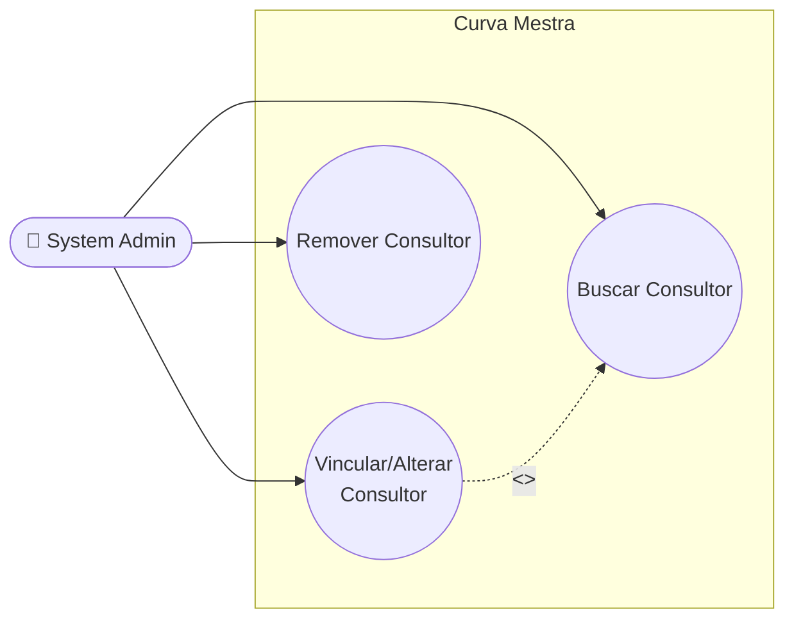

# UC-23: Vincular, Alterar e Remover Consultor de uma Clínica (via Painel Admin)

**Projeto:** Curva Mestra
**Data de Criação:** 14/07/2026
**Autor:** Guilherme Scandelari (via uml-use-case-writer)
**Status:** Aprovado
**Módulo/Contexto:** Administração do Sistema (Gestão de Clínicas)
**Versão:** 1.1

> Um System Admin busca um Consultor Rennova (por nome, código de 6 dígitos, telefone ou e-mail) e o vincula a uma clínica, na mesma tela do UC-21/UC-22 (`admin/tenants/[id]/page.tsx`). A mesma ação serve tanto para o primeiro vínculo quanto para trocar o consultor de uma clínica que já tem um — não há um fluxo de "transferência" com aviso especial sobre o consultor anterior. A remoção do vínculo não apaga nenhum dado histórico, pois nenhuma coleção de procedimentos/relatórios armazena referência ao consultor — o vínculo existe apenas nos documentos `tenants/{id}` e `consultants/{id}`.

---

## 1. Diagrama UML (Mermaid)

---

## 2. Atores

### 2.1 Ator Primário
**System Admin** — tela restrita por `ProtectedRoute allowedRoles: ['system_admin']`.

### 2.2 Atores Secundários / Sistemas Externos
- **Consultor Rennova** (registro em `consultants`, usuário Firebase Auth próprio, com custom claim `is_consultant: true` e `authorized_tenants: string[]`) — afetado indiretamente: seus custom claims são atualizados como consequência da ação do admin.
- **Firebase Auth** — via `adminAuth.getUser`/`adminAuth.setCustomUserClaims`, para sincronizar `authorized_tenants` nos claims do(s) consultor(es) envolvido(s).

---

## 3. Pré-condições
- System Admin autenticado, `is_system_admin === true`.
- Existe um tenant com o id da URL.
- Para vincular/alterar: existe ao menos um consultor com `status === 'active'` cujo nome, código, telefone ou e-mail corresponda ao termo buscado.
- Para remover: o tenant já possui `consultant_id` preenchido (o botão de remoção só é exibido quando isso é verdade).

---

## 4. Pós-condições

### 4.1 Sucesso — Vincular/Alterar (POST)
- `tenants/{id}.consultant_id`, `consultant_code` e `consultant_name` passam a refletir o novo consultor.
- `consultants/{novo_id}.authorized_tenants` passa a incluir o `tenantId`.
- Se havia um consultor anterior: `consultants/{antigo_id}.authorized_tenants` deixa de incluir o `tenantId`.
- Custom claims do novo consultor (`authorized_tenants`) e, se houver, do consultor antigo, são atualizados para refletir a mudança (ver RN-03 sobre a janela de inconsistência entre esta etapa e a anterior).

### 4.1b Sucesso — Remover (DELETE)
- `tenants/{id}.consultant_id`, `consultant_code` e `consultant_name` são apagados (`FieldValue.delete()`).
- `consultants/{id}.authorized_tenants` deixa de incluir o `tenantId`.
- Custom claims do consultor removido são atualizados para não incluir mais o `tenantId`.
- **Nenhum outro documento é alterado** — não existe, em nenhuma coleção de procedimentos, protocolos ou relatórios, referência denormalizada ao consultor (RN-05); logo, remover o vínculo não afeta retroativamente nenhum dado histórico.

### 4.2 Falha (Garantias Mínimas)
- Se a validação falhar antes do batch (tenant/consultor não encontrado, novo consultor inativo, ausência de consultor vinculado ao tentar remover): nenhuma alteração é feita.
- Se o batch já tiver sido commitado mas a atualização de custom claims falhar depois: **estado parcialmente inconsistente é possível** (RN-03) — os documentos Firestore refletem a mudança, mas os custom claims do(s) consultor(es) podem ficar desatualizados até uma nova tentativa bem-sucedida.

---

## 5. Gatilho (Trigger)
System Admin, na tela `/admin/tenants/{id}`, clica em "Configurar Consultor" (se a clínica não tiver nenhum) ou "Alterar" (se já tiver um), ou clica no ícone "X" ao lado do consultor atual para removê-lo.

---

## 6. Fluxo Principal (Basic Flow) — Vincular/Alterar Consultor

1. System Admin acessa `/admin/tenants/{id}` (mesma tela do UC-21/UC-22).
2. Na seção "Consultor Rennova": se `tenant.consultant_id` não existir, sistema exibe um estado vazio ("Esta clínica não possui consultor vinculado") com botão "Configurar Consultor"; se existir, exibe nome, código de 6 dígitos (com botão de copiar) e um botão "Alterar".
3. System Admin clica em "Configurar Consultor" ou "Alterar" — **ambos abrem exatamente o mesmo diálogo de busca** (RN-01).
4. System Admin digita um termo de busca (nome, código, telefone ou e-mail) e pressiona Enter ou clica no botão de busca.
5. Sistema chama `GET /api/consultants/search?q={termo}` com o Bearer token do admin.
6. API valida o token, exige `q` com pelo menos 2 caracteres, busca todos os documentos de `consultants` com `status === 'active'` e filtra em memória: `code.includes(q)` (literal), `name`/`email` (substring, case-insensitive), `phone.includes(q)` (literal).
7. Sistema exibe a lista de resultados (nome, código, e-mail); qualquer resultado com `status !== 'active'` apareceria visualmente desabilitado no client, mas isso é apenas defensivo, já que a API só retorna consultores `active` (RN-04).
8. System Admin clica em um consultor da lista.
9. Sistema exibe `confirm()` nativo: `Deseja vincular o consultor "{nome}" a esta clínica?` — **mesma mensagem genérica, tanto para o primeiro vínculo quanto para trocar um consultor já existente** (RN-01); o nome do consultor atual que será substituído não é mencionado.
10. System Admin confirma.
11. Sistema chama `POST /api/tenants/{id}/consultant` com `{ new_consultant_id }` e o Bearer token do admin.
12. API valida o token e a permissão (`is_system_admin === true` OU o chamador ser o próprio consultor autorizado ao tenant — RN-02); busca o tenant e o novo consultor; valida que o novo consultor tem `status === 'active'`.
13. API executa um `batch` atômico: remove o `tenantId` de `authorized_tenants` do consultor antigo (se havia), adiciona o `tenantId` a `authorized_tenants` do novo consultor, e atualiza `consultant_id`/`consultant_code`/`consultant_name` no tenant.
14. **Após** o commit do batch (fora dele, sequencialmente), a API busca o `user_id` do novo consultor via `adminAuth.getUser` e chama `adminAuth.setCustomUserClaims` para incluir o `tenantId` em seus `authorized_tenants`; se havia consultor antigo, repete o processo para removê-lo dos claims dele (RN-03).
15. Sistema exibe "Consultor vinculado com sucesso!", fecha o diálogo, limpa a busca e recarrega os dados do tenant.
16. Caso de uso é concluído com sucesso.

---

## 7. Fluxos Alternativos

### 7a. Remover consultor (só exibido quando `tenant.consultant_id` existe)
1. System Admin clica no ícone "X" ao lado dos dados do consultor atual.
2. Sistema exibe `confirm()`: `Tem certeza que deseja remover o consultor desta clínica?`.
3. System Admin confirma.
4. Sistema chama `DELETE /api/tenants/{id}/consultant` com o Bearer token do admin.
5. API valida token e permissão (mesma regra do passo 12 do fluxo principal — RN-02); busca o tenant; se `consultant_id` não existir, retorna erro 400.
6. API executa `batch` atômico: remove o `tenantId` de `authorized_tenants` do consultor, e apaga (`FieldValue.delete()`) `consultant_id`/`consultant_code`/`consultant_name` do tenant.
7. Após o commit (sequencialmente, fora do batch), API atualiza os custom claims do consultor removendo o `tenantId` de `authorized_tenants` (RN-03).
8. Sistema exibe "Consultor removido com sucesso!" e recarrega os dados do tenant (sem redirecionar).

---

## 8. Fluxos de Exceção

### 8a. Termo de busca muito curto
1. `q` tem menos de 2 caracteres.
2. API retorna 400 ("Termo de busca deve ter pelo menos 2 caracteres"); sistema exibe a mensagem de erro.

### 8b. Novo consultor não está mais ativo (condição de corrida)
1. Entre a busca (que já filtra por `active`) e o clique de confirmação, o consultor é suspenso por outra ação administrativa.
2. API retorna 400 ("Novo consultor não está ativo"); sistema exibe a mensagem de erro; nada é alterado.

### 8c. Remover consultor de clínica sem vínculo
1. Só alcançável via chamada direta à API (a UI só exibe o botão de remoção quando `tenant.consultant_id` existe).
2. API retorna 400 ("Clínica não possui consultor vinculado").

### 8d. Falha ao sincronizar custom claims após o batch já commitado
1. `adminAuth.getUser`/`adminAuth.setCustomUserClaims` falha (ex.: `user_id` inválido, indisponibilidade do Firebase Auth, erro de rede).
2. API retorna 500 ao cliente, mas os documentos Firestore (`tenants`, `consultants`) **já foram alterados** pelo `batch` do passo anterior — estado inconsistente entre dados e claims até nova tentativa (RN-03).

### 8e. Token ausente ou inválido
1. Sistema retorna 401; nenhuma alteração é feita.

### 8f. Chamador sem permissão
1. Chamador não é `system_admin` nem consultor autorizado ao tenant (`is_consultant && authorized_tenants` inclui o `tenantId`).
2. Sistema retorna 403; nenhuma alteração é feita.

---

## 9. Regras de Negócio Relacionadas

| ID | Regra | Justificativa |
|----|-------|----------------|
| RN-01 | **[Confirmado — responde à pergunta do coordenador sobre "transferência"]** Não existe distinção entre "vincular pela primeira vez" e "trocar/transferir consultor" nesta tela: ambos os botões ("Configurar Consultor" e "Alterar") abrem o mesmo diálogo, chamam a mesma função (`handleAssignConsultant`) e o mesmo endpoint (`POST /api/tenants/{id}/consultant`). O `confirm()` exibido é genérico e **não menciona** o nome do consultor que está sendo substituído — o sistema simplesmente sobrescreve o vínculo direto, sem uma etapa de confirmação de "transferência" com aviso especial. | Confirmado por leitura de `handleAssignConsultant`/`handleSearchConsultant` na tela e da API `POST /api/tenants/[id]/consultant`. |
| RN-02 | A API `POST`/`DELETE /api/tenants/[id]/consultant` aceita chamadas não apenas de `system_admin`, mas também do **próprio consultor vinculado** (`is_consultant === true` e `authorized_tenants` do token inclui o `tenantId`). Ou seja, embora esta tela seja exclusiva do painel admin, o mesmo endpoint é compartilhado com pelo menos outra tela fora do escopo deste UC: `src/app/(clinic)/clinic/consultant/transfer/page.tsx`. | Confirmado por leitura da checagem de permissão nas duas rotas e por grep confirmando que essa página do lado clínica também chama o mesmo endpoint. |
| RN-03 | **[Achado relevante de atomicidade]** A atualização dos documentos Firestore (`tenants`, `consultants`) ocorre em um `batch` atômico, mas a sincronização dos **custom claims** do(s) consultor(es) (via `adminAuth.setCustomUserClaims`) acontece **depois**, fora dessa transação, de forma sequencial. Se essa etapa falhar (ex.: `user_id` inválido, erro de rede com o Firebase Auth), os documentos já foram alterados, mas os claims do consultor podem ficar desatualizados — uma inconsistência que só seria corrigida numa nova tentativa da mesma operação. | Confirmado por leitura literal de `POST`/`DELETE /api/tenants/[id]/consultant/route.ts` — passos 4-5 (POST) e passo 3 (DELETE) ocorrem após `await batch.commit()`. |
| RN-04 | A busca de consultores (`GET /api/consultants/search`) já filtra por `status === 'active'` no servidor — a checagem `isActive` feita novamente no client é redundante/defensiva, nunca encontrará um resultado inativo na prática (a menos que o status mude entre a busca e a renderização). | Confirmado por leitura de `api/consultants/search/route.ts` e do trecho de renderização dos resultados na tela. |
| RN-05 | **[Confirmado — responde à pergunta do coordenador sobre efeito colateral em dados históricos]** Nenhuma coleção de procedimentos, protocolos ou relatórios armazena `consultant_id`/`consultant_name`/`consultant_code`. O vínculo consultor-clínica existe **apenas** nos documentos `tenants/{id}` (campos `consultant_id`/`consultant_code`/`consultant_name`) e `consultants/{id}.authorized_tenants`. Portanto, remover ou trocar o consultor de uma clínica **não afeta retroativamente** nenhum dado histórico de procedimentos/relatórios, simplesmente porque não existe tal denormalização hoje. | Confirmado por busca exaustiva de `consultant_id`/`consultant_name`/`consultant_code` em todo `src/` — nenhuma ocorrência em services de inventário, procedimentos ou protocolos. |
| RN-06 | **[Achado de duplicação de código morto]** As funções `transferConsultant`, `removeConsultant` e `searchConsultants` existem em `src/lib/services/consultantService.ts`, reimplementando (client-side, com `runTransaction`) exatamente a mesma lógica das rotas de API usadas de fato pela tela — mas **nunca são chamadas em nenhum lugar do código-fonte**. A tela e as duas páginas que usam este fluxo (`admin/tenants/[id]` e `clinic/consultant/transfer`) sempre chamam a API route diretamente via `fetch`, não essas funções. | Confirmado por grep — zero ocorrências de chamada a essas três funções em todo `src/`. |
| RN-07 | Existe, em outras partes do sistema (fora do escopo desta tela), um mecanismo **totalmente diferente e não relacionado** de vínculo consultor-clínica: um fluxo de "solicitação de transferência" com aprovação (`consultant_claims`, `ConsultantTransferRequest` com status `pending`/`approved`/`rejected`, rotas `api/consultants/transfer-requests/*` e `api/consultants/claims/*`). Esse mecanismo não deve ser confundido com o vínculo direto e imediato documentado neste UC — são dois caminhos paralelos e independentes para o mesmo resultado final (`tenant.consultant_id` alterado). | Confirmado por grep de `consultant_claims`/`ConsultantTransferRequest` em `firestore.rules` e `src/types/index.ts`, e pela existência das rotas/páginas correspondentes — não investigado a fundo por estar fora do escopo definido pelo coordenador para este UC. |

---

## 10. Requisitos Especiais / Não Funcionais

| ID | Descrição | Categoria |
|----|-----------|-----------|
| RNF-01 | A validação de Bearer token nas três operações (GET/POST/DELETE) segue o mesmo padrão correto já validado no UC-21: header `Authorization: Bearer {token}` obrigatório, `adminAuth.verifyIdToken` explícito, e checagem de claims específica por operação — **não há gap de segurança aqui**, ao contrário do que foi encontrado em outras rotas administrativas anteriores (ex.: UC-02). | Segurança |
| RNF-02 | A busca de consultores (`GET /api/consultants/search`) carrega **todos** os consultores `active` do banco e filtra em memória (sem paginação nem índice de busca) — pode se tornar um gargalo de performance conforme o número de consultores cadastrados crescer. | Performance |

---

## 11. Frequência de Uso
Ocasional — vínculo/troca/remoção de consultor não é uma operação do dia a dia do System Admin.

---

## 12. Casos de Uso Relacionados
- **UC-21 (Cadastrar Nova Clínica)** e **UC-22 (Editar, Desativar e Reativar Clínica)** — mesma tela (`admin/tenants/[id]/page.tsx`); este é o terceiro e último UC mapeado desta tela, completando o módulo Admin/Gestão de Clínicas.
- **UC-46 (Visualizar Consultor Vinculado à Clínica)** — investigação aprofundada confirmou o que este UC já suspeitava: `clinic/consultant/transfer/page.tsx` está **de fato quebrada** (sempre 403 para qualquer usuário de clínica) — não era apenas uma suspeita, é um bug confirmado (UC-46/RN-03).
- **[Não mapeado, fora de escopo]** Fluxo de "Solicitação de Transferência" com aprovação (`consultant_claims`, `ConsultantTransferRequest`, rotas `api/consultants/transfer-requests/*` e `api/consultants/claims/*`) — mecanismo paralelo e independente, não investigado (RN-07).
- **[Não mapeado, fora de escopo]** Cadastro/gestão de consultores em si (criação, suspensão, edição) — via `consultantService.ts` (`createConsultant`, `toggleConsultantStatus`, `updateConsultant`) e prováveis rotas `api/consultants/*` — não mapeado.

---

## 13. Referências
- `src/app/(admin)/admin/tenants/[id]/page.tsx` (seção "Consultor Rennova", linhas ~274-374 e ~525-605, e diálogo de busca ~870-970)
- `src/app/api/tenants/[id]/consultant/route.ts` (GET/POST/DELETE)
- `src/app/api/consultants/search/route.ts`
- `src/lib/services/consultantService.ts` (funções órfãs — RN-06)
- `src/types/index.ts` (`Consultant`, `ConsultantTransferRequest`, `ConsultantTransferRequestStatus`)
- `firestore.rules` (`consultants/{consultantId}`, `consultant_claims/{claimId}`)
- `src/app/(clinic)/clinic/consultant/transfer/page.tsx` (uso paralelo do mesmo endpoint — RN-02)

---

## 14. Perguntas em Aberto / Decisões Pendentes

1. **[RN-03]** A atualização de custom claims fora da transação atômica do Firestore pode gerar inconsistência entre dados e claims em caso de falha parcial — não há mecanismo de retry ou de reconciliação automática confirmado no código.
2. **[RN-06]** As funções client-side `transferConsultant`/`removeConsultant`/`searchConsultants` em `consultantService.ts` são código morto (nunca chamadas) — decisão de produto pendente: remover ou eventualmente usar em algum outro fluxo futuro.
3. **[Resolvido em UC-46]** `clinic/consultant/transfer/page.tsx` — confirmado como funcionalidade quebrada (sempre 403), com um gate de role invertido adicional (bloqueia `clinic_admin`, permite `clinic_user` acessar o formulário inútil). Ver UC-46/RN-03/RN-04 para os detalhes completos e a decisão de produto pendente (remover ou corrigir).
4. **[RN-07]** O mecanismo de "solicitação de transferência com aprovação" não foi investigado a fundo — se for relevante ao produto, merece seu próprio UC.

---

## 15. Histórico de Versões

| Versão | Data | Autor | O que mudou |
|--------|------|-------|--------------|
| 1.0 | 14/07/2026 | Guilherme Scandelari | Versão inicial, investigada do zero. Confirmado que a busca de consultor usa autocomplete por nome/código/telefone/e-mail via `GET /api/consultants/search` (RN-04); que vincular e trocar consultor são a mesma ação, sem fluxo de "transferência" distinto ou aviso especial (RN-01); que a remoção não tem efeito colateral em dados históricos por não haver denormalização do consultor em nenhuma coleção de procedimentos/relatórios (RN-05); que a validação de Bearer token está correta nas três rotas (RNF-01); e identificados dois achados adicionais não solicitados: janela de inconsistência entre o batch do Firestore e a sincronização de custom claims (RN-03), e duplicação de código morto em `consultantService.ts` (RN-06). Módulo Admin — Gestão de Clínicas (UC-21, UC-22, UC-23) concluído. |
| 1.1 | 15/07/2026 | Guilherme Scandelari | Cross-reference: a suspeita registrada na v1.0 sobre `clinic/consultant/transfer/page.tsx` foi investigada a fundo e confirmada como bug real em UC-46 (Visualizar Consultor Vinculado à Clínica) — seções 12 e 14 atualizadas de "não mapeado, fora de escopo" para referência direta a UC-46/RN-03/RN-04. |
