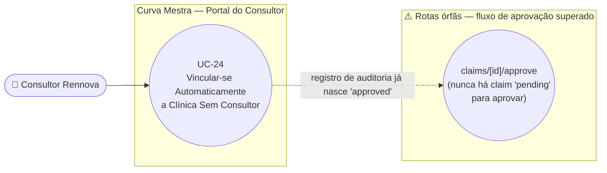

# UC-24: Vincular-se Automaticamente a uma Clínica Sem Consultor (Auto-Link)

**Projeto:** Curva Mestra
**Data de Criação:** 14/07/2026
**Autor:** Guilherme Scandelari (via uml-use-case-writer)
**Status:** Aprovado
**Módulo/Contexto:** Portal do Consultor (Vínculo com Clínicas)
**Versão:** 1.0

> Um Consultor Rennova busca uma clínica pelo CNPJ/CPF no Portal do Consultor e, se ela ainda não tiver nenhum consultor vinculado, estabelece o vínculo imediatamente com um único clique — sem aprovação de ninguém (nem da clínica, nem de um system_admin). **Achado confirmado:** existe um par de rotas de API (`api/consultants/claims/[id]/approve` e `[id]/reject`) que implementa um fluxo antigo de aprovação manual por `system_admin` — mas o próprio código-fonte confirma, em comentário, que foi substituído por este auto-link, e nenhuma tela do sistema as chama (código morto).

---

## 1. Diagrama UML (Mermaid)

---

## 2. Atores

### 2.1 Ator Primário
**Consultor Rennova** — usuário Firebase Auth próprio (não pertence a nenhum `tenant_id`; `tenant_id: null` nos custom claims), com `is_consultant: true` e `consultant_id` apontando para seu documento em `consultants/{id}`. Acessa o Portal do Consultor, grupo de rotas `(consultant)`.

### 2.2 Atores Secundários / Sistemas Externos
- **Clínica (tenant)** afetada — recebe uma notificação informativa (`tenants/{tenant_id}/notifications`), mas não participa da decisão.
- **Firebase Auth** — via `adminAuth.setCustomUserClaims`, para sincronizar `authorized_tenants` no token do consultor.

---

## 3. Pré-condições
- Consultor autenticado, com `is_consultant === true` e `consultant_id` presente no token.
- A clínica buscada existe em `tenants` e **não possui** `consultant_id` preenchido.
- O consultor buscando não é já o consultor vinculado a essa clínica (checagem redundante, dado que `consultant_id` está vazio, mas existe explicitamente no código).

---

## 4. Pós-condições

### 4.1 Sucesso
- `consultants/{consultantId}.authorized_tenants` passa a incluir o `tenant_id`.
- `tenants/{tenant_id}.consultant_id`, `consultant_code` e `consultant_name` são preenchidos com os dados do consultor.
- Um documento é criado em `consultant_claims` **já com `status: 'approved'`** — funciona como registro de auditoria da ação, não como uma etapa de aprovação pendente (RN-01).
- Uma notificação informativa é criada em `tenants/{tenant_id}/notifications` (`type: 'consultant_linked'`), visível para o `clinic_admin`.
- Os custom claims do consultor (`authorized_tenants`) são atualizados para incluir o `tenant_id` (etapa sequencial, fora da transação — RN-02).

### 4.2 Falha (Garantias Mínimas)
- Se a validação falhar antes do `batch` (clínica não encontrada, consultor já vinculado, claim pendente duplicada): nenhuma alteração é feita.
- Se o `batch` for commitado mas a sincronização de custom claims falhar depois: o vínculo já está gravado no Firestore (`tenants`/`consultants`), mas o token do consultor pode ficar temporariamente desatualizado até novo login ou nova tentativa (mesmo padrão de RN-03 do UC-23).

---

## 5. Gatilho (Trigger)
Consultor, na tela `/consultant/clinics/search`, busca uma clínica por CNPJ/CPF e clica em "Vincular Agora" num resultado que não possui consultor vinculado.

---

## 6. Fluxo Principal (Basic Flow)

1. Consultor acessa `/consultant/clinics/search` (Portal do Consultor).
2. Informa o CNPJ ou CPF da clínica no campo de busca e clica no botão de busca.
3. Sistema chama `GET /api/tenants/search?document={documento}` com o Bearer token do consultor.
4. Sistema exibe os resultados: nome da clínica, tipo/número do documento, e-mail, e o consultor atual (se houver).
5. Para uma clínica **sem** `consultant_id`, o sistema exibe um botão "Vincular Agora"; para uma clínica que já tem consultor, exibe apenas uma mensagem informativa, sem nenhum botão de ação (ver UC-25 para o que acontece nesse segundo caso).
6. Consultor clica em "Vincular Agora".
7. Sistema chama `POST /api/consultants/claims` com `{ tenant_id }` e o Bearer token do consultor.
8. API valida o token, exige `is_consultant === true` e `consultant_id` presentes no token; busca os dados do consultor e da clínica; retorna erro se o consultor já for o vinculado a essa clínica.
9. Como `tenantData.consultant_id` está vazio, a API entra no ramo de auto-link: verifica se já existe uma claim com `status === 'pending'` para este par consultor/clínica (RN-04 — checagem hoje inatingível na prática).
10. API executa um `batch` atômico: cria o documento em `consultant_claims` já com `status: 'approved'`; adiciona `tenant_id` a `authorized_tenants` do consultor; atualiza `tenants/{tenant_id}` com `consultant_id`/`consultant_code`/`consultant_name`; cria a notificação informativa em `tenants/{tenant_id}/notifications`.
11. Após o commit do `batch` (fora dele, sequencialmente), API atualiza os custom claims do consultor via `adminAuth.setCustomUserClaims` para incluir o `tenant_id` em `authorized_tenants` (RN-02).
12. Sistema exibe "Vínculo estabelecido com sucesso!" e marca visualmente o resultado como "Vinculado com sucesso".
13. Caso de uso é concluído com sucesso.

---

## 7. Fluxos Alternativos
Nenhum identificado além do fluxo principal — a ação é única e direta (buscar → clicar → vincular).

---

## 8. Fluxos de Exceção

### 8a. Consultor já é o vinculado a esta clínica
1. API retorna 400 ("Você já é o consultor vinculado a esta clínica").
2. Sistema exibe a mensagem de erro; nada é alterado.

### 8b. Clínica não encontrada
1. `tenant_id` recebido não corresponde a nenhum documento existente.
2. API retorna 404; sistema exibe a mensagem de erro.

### 8c. Token ausente/inválido ou usuário não é consultor
1. Sistema retorna 401 (token ausente) ou 403 (`is_consultant`/`consultant_id` ausentes no token).
2. Nenhuma alteração é feita.

### 8d. Falha ao sincronizar custom claims após o batch já commitado
1. `adminAuth.getUser`/`adminAuth.setCustomUserClaims` falha.
2. A API captura o erro com `try/catch` e **não propaga como falha da requisição** — retorna sucesso ao cliente mesmo assim, apenas registrando um `console.warn`. Isso significa que o usuário vê "Vínculo estabelecido com sucesso!" mesmo que os custom claims não tenham sido sincronizados (diferente do padrão de outras rotas deste módulo, onde essa etapa não é envolvida em `try/catch`) — ver RN-02.

---

## 9. Regras de Negócio Relacionadas

| ID | Regra | Justificativa |
|----|-------|----------------|
| RN-01 | O auto-link é **imediato e sem aprovação de ninguém** — nem do `clinic_admin` da clínica, nem de um `system_admin`. O documento criado em `consultant_claims` já nasce com `status: 'approved'`, servindo apenas como registro de auditoria da ação, não como uma etapa de aprovação real. A clínica só é informada **depois do fato consumado**, via notificação. | Confirmado por leitura literal do ramo "CASO 1" de `POST /api/consultants/claims`. |
| RN-02 | A sincronização dos custom claims do consultor ocorre fora do `batch` atômico do Firestore, e — diferente das rotas equivalentes em UC-23 — está envolvida em `try/catch` que **absorve o erro silenciosamente** (`console.warn`), retornando sucesso ao cliente mesmo que essa etapa falhe. Ou seja, o risco de inconsistência entre dados e claims (já presente no UC-23) é ainda mais silencioso aqui, pois nem o próprio usuário é avisado de uma falha parcial. | Confirmado por leitura literal do bloco `try { ... adminAuth.setCustomUserClaims ... } catch (claimsError) { console.warn(...) }` em `POST /api/consultants/claims`. |
| RN-03 | A busca de clínicas usa `GET /api/tenants/search?document=...` (rota compartilhada, não documentada neste UC) — exige o documento completo (mínimo 11 dígitos), não busca por nome. | Confirmado por leitura da tela de busca. |
| RN-04 | **[Achado — checagem hoje inatingível]** O ramo de auto-link verifica se já existe uma `consultant_claims` com `status === 'pending'` para o mesmo par consultor/clínica antes de prosseguir — mas, como nenhum fluxo atual do sistema cria uma claim com esse status (o auto-link cria direto como `'approved'`, e o fluxo de transferência usa a coleção `consultant_transfer_requests`, não `consultant_claims`), essa checagem de duplicidade é hoje código efetivamente inatingível, a menos que existam registros legados de antes da migração para o fluxo atual. | Confirmado por leitura completa de `POST /api/consultants/claims` e por grep confirmando que nenhum outro caminho do código cria `consultant_claims` com `status: 'pending'`. |
| RN-05 | **[Achado crítico — mesma clareza do UC-05/UC-22, rotas órfãs confirmadas]** As rotas `POST /api/consultants/claims/[id]/approve` e `POST /api/consultants/claims/[id]/reject` implementam um fluxo antigo em que um `system_admin` aprovava/rejeitava manualmente uma claim pendente — o próprio código-fonte confirma isso em comentário: *"Apenas system_admin pode aprovar claims diretamente (o novo fluxo usa auto-link)"* e *"...o novo fluxo usa transfer requests"*. Confirmado por grep exaustivo que **nenhuma tela do sistema chama essas duas rotas**, e que, como estabelecido em RN-04, nenhum fluxo atual sequer cria uma claim `pending` para elas processarem. São código morto duplo: sem gatilho de UI e sem dado de entrada possível. | Confirmado por leitura completa das duas rotas e grep de `consultants/claims` em `src/app`. |
| RN-06 | **[Achado adicional de regra Firestore]** A regra do Firestore para `consultant_claims` permite que o `clinic_admin` do tenant faça `read, update` diretamente nos documentos de claim do seu tenant (`belongsToTenant(resource.data.tenant_id) && hasRole('clinic_admin')`) — ou seja, mesmo que as rotas de API de aprovação/rejeição (RN-05) estejam mortas, um `clinic_admin` poderia, em tese, escrever diretamente no Firestore para alterar o `status` de uma claim, sem qualquer tela ou validação de negócio server-side. Como nenhuma claim `pending` chega a existir hoje (RN-04), esse é um risco teórico, não ativo. | Confirmado por leitura de `firestore.rules`, `match /consultant_claims/{claimId}`. |

---

## 10. Requisitos Especiais / Não Funcionais

| ID | Descrição | Categoria |
|----|-----------|-----------|
| RNF-01 | Diferente das rotas administrativas de UC-21/UC-23, a falha de sincronização de custom claims aqui é **absorvida silenciosamente** (RN-02) — não é reportada nem ao usuário nem de forma diferenciada nos logs (mesmo nível de severidade que um aviso comum). | Observabilidade |
| RNF-02 | A validação de Bearer token e de claims (`is_consultant`/`consultant_id`) segue o mesmo padrão correto encontrado em outras rotas administrativas do sistema. | Segurança |

---

## 11. Frequência de Uso
Ocasional a frequente — depende do ritmo de expansão da carteira de clínicas de cada consultor; presumivelmente mais comum no onboarding inicial de um novo consultor.

---

## 12. Casos de Uso Relacionados
- **UC-25 (Solicitar Transferência de Clínica Já Vinculada)** — mesma tela, mesma API (`POST /api/consultants/claims`), mas ramo "CASO 2" (clínica já tem consultor); ver achado crítico sobre ausência de gatilho de UI documentado lá.
- **UC-23 (Vincular/Alterar/Remover Consultor de uma Clínica via Painel Admin)** — mecanismo equivalente do lado do `system_admin`, com o mesmo padrão de sincronização de custom claims fora da transação (lá sem `try/catch` silencioso).
- **UC-21/UC-22** — tela `admin/tenants/[id]/page.tsx`, onde `tenant.consultant_id` também pode ser gerenciado.

---

## 13. Referências
- `src/app/(consultant)/consultant/clinics/search/page.tsx`
- `src/app/api/consultants/claims/route.ts` (ramo "CASO 1")
- `src/app/api/consultants/claims/[id]/approve/route.ts` (órfão — RN-05)
- `src/app/api/consultants/claims/[id]/reject/route.ts` (órfão — RN-05)
- `src/app/api/tenants/search/route.ts`
- `src/types/index.ts` (`Consultant`, `CustomClaims`)
- `firestore.rules` (`consultants/{consultantId}`, `consultant_claims/{claimId}`)

---

## 14. Perguntas em Aberto / Decisões Pendentes

1. **[RN-05]** As rotas `claims/[id]/approve` e `claims/[id]/reject` são código morto duplamente confirmado — decisão de produto pendente: remover, ou mantê-las como estão (sem risco ativo, já que nunca são alcançadas).
2. **[RN-02]** A falha silenciosa na sincronização de custom claims pode causar um estado onde o Firestore já reflete o vínculo, mas o token do consultor (até novo login) ainda não enxerga a clínica — vale avaliar se deveria haver alguma notificação/retry.
3. **[RN-06]** Risco teórico de escrita direta por `clinic_admin` na coleção `consultant_claims` via regra Firestore permissiva — hoje não explorável na prática (RN-04), mas vale revisão futura da regra.

---

## 15. Histórico de Versões

| Versão | Data | Autor | O que mudou |
|--------|------|-------|--------------|
| 1.0 | 14/07/2026 | Guilherme Scandelari | Versão inicial, investigada do zero. Confirmado que o auto-link é imediato e sem aprovação de ninguém (RN-01); identificadas as rotas órfãs `claims/[id]/approve`/`reject`, confirmadas como código morto duplo tanto por ausência de chamada na UI quanto por ausência de dado de entrada (`status: 'pending'`) desde a migração para este fluxo (RN-04, RN-05); e uma falha silenciosa na sincronização de custom claims não presente nas rotas administrativas equivalentes (RN-02). Primeiro de 4 UCs do módulo "Consultor — vínculo com clínicas" (UC-24 a UC-27). |
