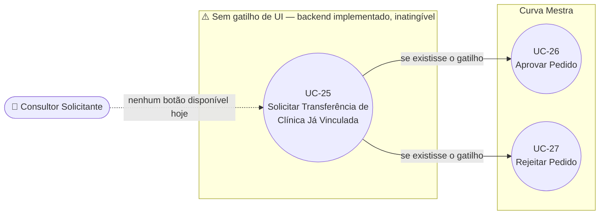

# UC-25: Solicitar Transferência de Clínica Já Vinculada

**Projeto:** Curva Mestra
**Data de Criação:** 14/07/2026
**Autor:** Guilherme Scandelari (via uml-use-case-writer)
**Status:** Aprovado
**Módulo/Contexto:** Portal do Consultor (Vínculo com Clínicas)
**Versão:** 1.0

> **Achado crítico — sem gatilho de UI confirmado.** O backend deste caso de uso está totalmente implementado (`POST /api/consultants/claims`, ramo "CASO 2": cria um documento em `consultant_transfer_requests` com `status: 'pending'` e enfileira um e-mail para o consultor atual), mas **nenhuma tela do sistema expõe um botão ou ação que o dispare**. A única tela que chama esse endpoint (`consultant/clinics/search/page.tsx`) explicitamente **não** renderiza nenhum controle de ação quando a clínica buscada já tem consultor vinculado — mostra apenas uma mensagem informativa. Documentado aqui com o mesmo rigor usado para o UC-05 e para o mecanismo de suspensão órfão do UC-22: o fluxo existe e é tecnicamente correto, mas é inatingível por qualquer usuário hoje.

---

## 1. Diagrama UML (Mermaid)

---

## 2. Atores

### 2.1 Ator Primário
**Consultor Rennova (solicitante)** — o consultor que deseja assumir uma clínica já vinculada a outro consultor.

### 2.2 Atores Secundários / Sistemas Externos
- **Consultor Rennova (atual)** — recebe uma notificação por e-mail e decide (UC-26/UC-27); não é notificado por nenhum outro canal (ver RN-03).
- **Sistema de fila de e-mails** (`email_queue`) — mecanismo de envio assíncrono já usado em outras partes do sistema (ex.: UC-08).

---

## 3. Pré-condições
- Consultor solicitante autenticado, `is_consultant === true`, `consultant_id` presente no token.
- A clínica buscada existe e **já possui** `consultant_id` preenchido (diferente do consultor solicitante).
- **[Bloqueante confirmado]** Não existe, hoje, nenhuma pré-condição de UI alcançável — ver o destaque no topo deste documento.

---

## 4. Pós-condições

### 4.1 Sucesso (fluxo desenhado, não alcançável pela UI hoje)
- Um documento é criado em `consultant_transfer_requests` com `status: 'pending'`, contendo dados do consultor solicitante, do consultor atual e da clínica.
- Um e-mail é enfileirado em `email_queue` para o consultor atual, com um link genérico ao Portal do Consultor (não um link direto para o pedido específico).
- **O vínculo atual não é alterado de forma alguma neste momento** — `tenants/{id}.consultant_id` continua apontando para o consultor atual, que mantém acesso total e normal à clínica durante todo o período em que o pedido ficar pendente (RN-01).
- **Não há prazo de expiração** — o pedido permanece com `status: 'pending'` indefinidamente até uma ação manual do consultor atual (UC-26/UC-27) ou de um `system_admin` (RN-02).

### 4.2 Falha
- Se já existir um pedido `pending` do mesmo consultor solicitante para a mesma clínica: nenhuma alteração é feita, API retorna 400.
- Se o consultor solicitante já for o vinculado à clínica: erro 400 antes mesmo de entrar neste ramo (checagem comum aos dois casos da API).

---

## 5. Gatilho (Trigger)
**[Não implementado na UI]** Presumivelmente, seria: consultor solicitante busca uma clínica já vinculada a outro consultor e clica em algum botão de "Solicitar Transferência". Esse botão não existe hoje em nenhuma tela.

---

## 6. Fluxo Principal (Basic Flow) — conforme implementado no backend, sem gatilho de UI

1. *(Gatilho ausente — ver destaque acima.)* Presumindo que um consultor solicitante conseguisse, de alguma forma, disparar `POST /api/consultants/claims` com `{ tenant_id }` de uma clínica que já tem `consultant_id`:
2. API valida token e permissão (`is_consultant` + `consultant_id`); busca dados do consultor solicitante e da clínica; retorna erro se o solicitante já for o consultor vinculado.
3. Como `tenantData.consultant_id` já está preenchido, a API entra no ramo "CASO 2": verifica se já existe um pedido `pending` do mesmo solicitante para a mesma clínica em `consultant_transfer_requests` (impede duplicidade).
4. API busca os dados do consultor atual (`tenantData.consultant_id`).
5. API cria um documento em `consultant_transfer_requests` com `status: 'pending'`, `requesting_consultant_id/name/code`, `current_consultant_id/name`, `tenant_id/name/document`.
6. API enfileira um e-mail em `email_queue` para o consultor atual (`type: 'consultant_transfer_request'`), com corpo HTML descrevendo o pedido e um link genérico ao Portal do Consultor (não um deep-link para o pedido específico — RN-04).
7. API retorna `{ success: true, auto_linked: false, transfer_requested: true, message: 'Pedido de transferência enviado ao consultor atual' }`.
8. *(Sem tela para exibir esse retorno, pois nenhuma tela chama a API neste ramo.)*

---

## 7. Fluxos Alternativos
Nenhum identificado — o próprio fluxo principal já é hipotético (backend sem gatilho de UI).

---

## 8. Fluxos de Exceção

### 8a. Pedido duplicado
1. Já existe um pedido `pending` do mesmo consultor solicitante para a mesma clínica.
2. API retorna 400 ("Já existe um pedido de transferência pendente para esta clínica").

### 8b. Consultor solicitante já é o vinculado
1. Checagem comum aos dois ramos da API (compartilhada com UC-24).
2. API retorna 400 ("Você já é o consultor vinculado a esta clínica").

### 8c. Falha ao enfileirar e-mail
1. `adminDb.collection('email_queue').add(...)` falha.
2. Erro é capturado por `try/catch` e apenas logado (`console.warn`) — a criação do pedido de transferência **não é revertida**; a API retorna sucesso normalmente mesmo que o consultor atual nunca seja notificado por e-mail (RN-04).

---

## 9. Regras de Negócio Relacionadas

| ID | Regra | Justificativa |
|----|-------|----------------|
| RN-00 | **[Achado crítico — repetido do destaque do cabeçalho]** Não existe, em nenhuma tela do sistema, um botão ou fluxo que dispare este ramo da API. A única tela candidata (`consultant/clinics/search/page.tsx`) exibe apenas uma mensagem informativa sem ação quando a clínica já tem consultor vinculado. | Confirmado por leitura completa da tela e por grep confirmando que `POST /api/consultants/claims` só é chamado a partir dela, uma única vez, sempre para o mesmo `handleLink`. |
| RN-01 | **[Confirmado — responde à pergunta do coordenador]** Enquanto o pedido de transferência está pendente, o vínculo atual **não é alterado de forma alguma**: `tenants/{id}.consultant_id` permanece apontando para o consultor atual, que continua enxergando e operando a clínica normalmente (mesmo acesso de sempre) durante todo o período de pendência. | Confirmado por leitura de `POST /api/consultants/claims` — o ramo "CASO 2" apenas cria o documento de pedido e envia e-mail; nenhuma escrita em `tenants` ou `consultants` ocorre nesta etapa. |
| RN-02 | **[Confirmado — responde à pergunta do coordenador]** Não existe nenhum prazo de expiração para o pedido de transferência. Não há campo `expires_at`, nem Cloud Function agendada, nem qualquer lógica de expiração em todo o código-fonte. Um pedido `pending` permanece pendente indefinidamente até uma ação manual (aprovar/rejeitar). | Confirmado por grep exaustivo de termos relacionados a expiração em todas as rotas de `api/consultants/*` e por ausência de Cloud Functions relacionadas em `functions/src`. |
| RN-03 | A notificação ao consultor atual é feita **exclusivamente por e-mail** (fila `email_queue`) — não há notificação in-app (diferente do que ocorre com o `clinic_admin` no UC-24, que recebe uma notificação em `tenants/{tenant_id}/notifications`). Não existe também nenhum indicador visual (badge, contador) fora da tela `/consultant/transfer-requests`, que o consultor atual precisaria acessar proativamente para descobrir o pedido. | Confirmado por leitura completa de `POST /api/consultants/claims`, ramo "CASO 2" — nenhuma escrita em subcoleção de notificações do consultor. |
| RN-04 | O e-mail enfileirado para o consultor atual contém um link genérico ("Acesse o Portal do Consultor"), não um deep-link direto para `/consultant/transfer-requests` ou para o pedido específico. A falha no envio do e-mail é silenciosamente absorvida (`try/catch` com `console.warn`) e não impede a criação do pedido. | Confirmado por leitura literal do corpo do e-mail e do bloco `try/catch` em `POST /api/consultants/claims`. |

---

## 10. Requisitos Especiais / Não Funcionais

| ID | Descrição | Categoria |
|----|-----------|-----------|
| RNF-01 | Como não há prazo de expiração (RN-02), pedidos de transferência esquecidos/abandonados podem se acumular indefinidamente na coleção `consultant_transfer_requests` sem nenhuma rotina de limpeza. | Manutenibilidade |
| RNF-02 | Não existe rota Firestore dedicada para `consultant_transfer_requests` em `firestore.rules` — como todo o acesso hoje passa pelas rotas de API (via Firebase Admin SDK, que ignora as regras), isso não é um problema em produção, mas significa que qualquer tentativa de leitura direta via SDK cliente seria negada por padrão. | Observação técnica |

---

## 11. Frequência de Uso
**Nula hoje** — por não haver gatilho de UI (RN-00). Se o gatilho for implementado no futuro, a frequência esperada dependeria da rotatividade de consultores por clínica.

---

## 12. Casos de Uso Relacionados
- **UC-24 (Vincular-se Automaticamente a uma Clínica Sem Consultor)** — mesma tela, mesma API, ramo "CASO 1" (esse sim com gatilho de UI funcional).
- **UC-26 (Aprovar Pedido de Transferência de Clínica)** e **UC-27 (Rejeitar Pedido de Transferência de Clínica)** — consomem o documento `consultant_transfer_requests` que este UC deveria criar; ambos estão implementados corretamente do lado "consumidor", mas dependem de um gatilho que não existe (RN-00).
- **UC-23 (Vincular/Alterar/Remover Consultor via Painel Admin)** — mecanismo paralelo e totalmente funcional para o `system_admin` trocar o consultor de qualquer clínica a qualquer momento, sem depender deste fluxo de solicitação.

---

## 13. Referências
- `src/app/(consultant)/consultant/clinics/search/page.tsx` (única tela candidata — sem botão para este ramo)
- `src/app/api/consultants/claims/route.ts` (ramo "CASO 2")
- `src/types/index.ts` (`ConsultantTransferRequest`, `ConsultantTransferRequestStatus`)
- `firestore.rules` (ausência de regra dedicada para `consultant_transfer_requests`)

---

## 14. Perguntas em Aberto / Decisões Pendentes

1. **[RN-00, decisão de produto necessária]** O backend deste caso de uso está pronto, mas sem gatilho de UI. Decisão pendente: implementar o botão/fluxo que falta (ex.: um botão "Solicitar Transferência" na tela de busca, quando a clínica já tem consultor), ou remover o ramo "CASO 2" da API e as rotas de aprovação/rejeição associadas (UC-26/UC-27), já que hoje são inalcançáveis.
2. **[RN-02]** Ausência de prazo de expiração — vale definir um TTL de negócio (ex.: pedido expira em 15 dias) caso o gatilho de UI seja implementado no futuro.
3. **[RN-03]** Ausência de notificação in-app para o consultor atual — hoje ele só descobre o pedido acessando `/consultant/transfer-requests` manualmente ou lendo o e-mail.

---

## 15. Histórico de Versões

| Versão | Data | Autor | O que mudou |
|--------|------|-------|--------------|
| 1.0 | 14/07/2026 | Guilherme Scandelari | Versão inicial, investigada do zero. Confirmado o achado crítico de que este ramo da API (`POST /api/consultants/claims`, "CASO 2") não possui nenhum gatilho de UI em nenhuma tela do sistema (RN-00) — documentado com o mesmo rigor do UC-05/UC-22. Confirmadas as duas perguntas específicas do coordenador: o vínculo atual não muda durante a pendência (RN-01) e não há prazo de expiração (RN-02). Segundo de 4 UCs do módulo "Consultor — vínculo com clínicas" (UC-24 a UC-27). |
