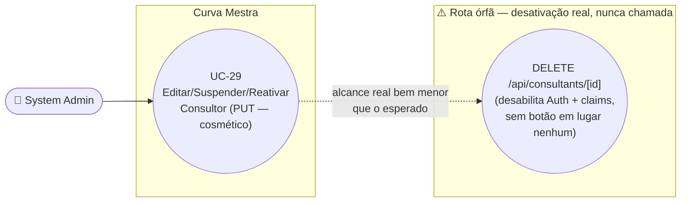

# UC-29: Editar, Suspender e Reativar Consultor

**Projeto:** Curva Mestra
**Data de Criação:** 14/07/2026
**Autor:** Guilherme Scandelari (via uml-use-case-writer)
**Status:** Aprovado
**Módulo/Contexto:** Administração do Sistema (Gestão de Consultores)
**Versão:** 1.0

> Um System Admin edita os dados de um consultor (`admin/consultants/[id]/page.tsx`) e/ou alterna seu status entre "Ativo" e "Suspenso" na listagem (`admin/consultants/page.tsx`) — ambas as ações usam o mesmo endpoint, `PUT /api/consultants/[id]`, mesmo padrão de mesclagem já usado no UC-22. **Achado crítico confirmado:** "Suspender" um consultor, como implementado hoje, **não bloqueia login nem revoga acesso a nenhuma clínica** — é uma alteração puramente cosmética no documento Firestore, sem qualquer efeito sobre a conta no Firebase Auth, os custom claims (`active`, `authorized_tenants`), ou a regra de acesso do Firestore. Existe uma rota (`DELETE`) que faz a desativação "de verdade" (desabilita a conta no Auth e zera `active` nos claims) — mas ela é código morto, nunca chamada por nenhuma tela.

---

## 1. Diagrama UML (Mermaid)

---

## 2. Atores

### 2.1 Ator Primário
**System Admin** — telas restritas por `ProtectedRoute allowedRoles: ['system_admin']`.

### 2.2 Atores Secundários / Sistemas Externos
- **Consultor Rennova** afetado — impactado (ou, no caso da suspensão, na prática **não** impactado) pela ação.
- **Firebase Auth** — atualizado apenas na edição de e-mail (`adminAuth.updateUser`), não na suspensão/reativação via `PUT`.

---

## 3. Pré-condições
- System Admin autenticado, `is_system_admin === true`.
- Existe um consultor com o id informado.

---

## 4. Pós-condições

### 4.1 Sucesso — Editar (tela de detalhe)
- `consultants/{id}.name`/`phone` são atualizados se informados.
- Se `email` for informado (o formulário sempre reenvia o e-mail atual, mesmo sem alteração — RN-05): `consultants/{id}.email` é atualizado **e** `adminAuth.updateUser(user_id, { email })` é chamado, alterando o e-mail de login no Firebase Auth. **Nenhuma notificação é enviada** ao consultor (nem para o e-mail antigo, nem para o novo) avisando da mudança (RN-03).

### 4.1b Sucesso — Suspender/Reativar (tela de listagem)
- `consultants/{id}.status` alterna entre `'active'` e `'suspended'`.
- **Nada mais é alterado.** Especificamente: a conta no Firebase Auth continua habilitada (`disabled` nunca é tocado); os custom claims do consultor (`active`, `authorized_tenants`) permanecem exatamente como estavam; `authorized_tenants` no documento do consultor também não é tocado (RN-01 — achado crítico).

### 4.2 Falha (Garantias Mínimas)
- Se a validação de e-mail duplicado falhar (em `consultants` ou no Firebase Auth): nenhuma alteração é feita.
- Demais falhas: nenhuma alteração parcial identificada nestas duas operações (ambas são atualizações diretas de documento, sem múltiplas etapas encadeadas como em outros UCs deste módulo).

---

## 5. Gatilho (Trigger)
- **Editar:** System Admin acessa `/admin/consultants/{id}`, altera nome/e-mail/telefone e clica em "Salvar Alterações".
- **Suspender/Reativar:** System Admin, na listagem `/admin/consultants`, clica no ícone de "Suspender" (⊘) ou "Reativar" (✓) na linha do consultor.

---

## 6. Fluxo Principal (Basic Flow) — Editar

1. System Admin acessa `/admin/consultants/{id}`.
2. Sistema carrega o consultor via `GET /api/consultants/{id}` e pré-preenche o formulário (nome, e-mail, telefone).
3. System Admin altera os campos desejados.
4. System Admin clica em "Salvar Alterações".
5. Sistema chama `PUT /api/consultants/{id}` com `{ name, email (sempre enviado, minúsculo), phone }`.
6. API valida token e `is_system_admin`; busca o consultor; monta o objeto de atualização (`name`/`phone` só se preenchidos).
7. Como `email` está sempre presente no payload (o formulário sempre reenvia o valor atual do campo — RN-05), a API **sempre** entra no ramo de verificação de e-mail: consulta duplicidade em `consultants` (ignorando o próprio documento) e, se diferente, chama `adminAuth.updateUser(user_id, { email })` — que pode falhar com `auth/email-already-exists` se o e-mail já pertencer a outra conta Auth (ex.: um `clinic_admin`).
8. API grava as alterações em `consultants/{id}`.
9. Sistema exibe "Consultor atualizado com sucesso!" e recarrega os dados.
10. Caso de uso é concluído com sucesso.

---

## 7. Fluxos Alternativos

### 7a. Suspender consultor (listagem, `status === 'active'`)
1. System Admin clica no ícone "Suspender" na linha do consultor.
2. Sistema exibe `confirm()`: `Tem certeza que deseja suspender o consultor "{nome}"?`.
3. Confirma.
4. Sistema chama `PUT /api/consultants/{id}` com `{ status: 'suspended' }`.
5. API valida token/permissão; atualiza **apenas** o campo `status` do documento (RN-01).
6. Sistema exibe "Consultor suspenso com sucesso" e recarrega a lista.

### 7b. Reativar consultor (listagem, `status !== 'active'`)
1. System Admin clica no ícone "Reativar".
2. Sistema exibe `confirm()`: `Tem certeza que deseja reativar o consultor "{nome}"?`.
3. Confirma.
4. Sistema chama `PUT /api/consultants/{id}` com `{ status: 'active' }`.
5. API atualiza o campo `status`.
6. Sistema exibe "Consultor reativado com sucesso" e recarrega a lista.

---

## 8. Fluxos de Exceção

### 8a. E-mail já em uso por outro consultor
1. API encontra outro documento em `consultants` com o mesmo e-mail.
2. API retorna 400 ("Email já está em uso"); nenhuma alteração é feita.

### 8b. E-mail já em uso no Firebase Auth (por outro tipo de usuário)
1. `adminAuth.updateUser` lança `auth/email-already-exists`.
2. API retorna 400 ("Email já está em uso no sistema"); o documento `consultants` **ainda não foi alterado** neste ponto (a checagem/tentativa no Auth ocorre antes da escrita no Firestore, no passo 7 do fluxo principal) — sem risco de inconsistência aqui.

### 8c. Consultor não encontrado
1. `id` não corresponde a nenhum documento.
2. API retorna 404.

### 8d. Token ausente/inválido ou sem permissão
1. 401 (token ausente) ou 403 (não é `system_admin`).

---

## 9. Regras de Negócio Relacionadas

| ID | Regra | Justificativa |
|----|-------|----------------|
| RN-01 | **[Achado crítico — responde à pergunta do coordenador]** "Suspender" um consultor, via `PUT /api/consultants/{id}` com `{ status: 'suspended' }` (o único caminho de suspensão realmente exposto na UI), **não bloqueia login futuro nem revoga acesso imediato às clínicas vinculadas**. A rota só atualiza o campo `status` do documento em `consultants` — não desabilita a conta no Firebase Auth (`adminAuth.updateUser({ disabled: true })` nunca é chamado neste caminho), não altera os custom claims (`active` permanece `true`, `authorized_tenants` permanece intacto), e a regra do Firestore que concede acesso do consultor às clínicas (`consultantHasAccess`) verifica apenas `is_consultant` e `authorized_tenants` — nunca o campo `status` do documento `consultants`. Na prática, um consultor "suspenso" continua conseguindo logar normalmente e acessando todas as clínicas às quais já tinha acesso, exatamente como antes. O único efeito real observável é que ele deixa de aparecer nas buscas para **novos** vínculos (`GET /api/consultants/search`, que filtra `status === 'active'` — usado no UC-23 e no UC-24). | Confirmado por leitura literal do handler `PUT` em `api/consultants/[id]/route.ts` (ramo `status`, sem qualquer chamada a `adminAuth`), da função `consultantHasAccess` em `firestore.rules`, e de `ProtectedRoute.tsx` (só verifica `claims.active`, nunca lê `consultants/{id}.status`). |
| RN-02 | **[Achado crítico — confirma a existência de um mecanismo "correto" órfão]** A rota `DELETE /api/consultants/[id]` implementa a desativação "de verdade": marca `status: 'inactive'`, desabilita a conta no Firebase Auth (`adminAuth.updateUser({ disabled: true })`) **e** zera o custom claim `active: false`. Essa é a única rota deste recurso que efetivamente bloquearia o login do consultor. Porém, confirmado por grep exaustivo, **nenhuma tela do sistema a chama** — nem a listagem, nem a tela de detalhe. O botão "Suspender" da UI usa exclusivamente `PUT` (RN-01), nunca `DELETE`. | Confirmado por leitura completa do handler `DELETE` e por grep de `method: 'DELETE'` em todo `src/app/(admin)/admin/consultants`, sem nenhuma ocorrência. |
| RN-03 | **[Confirmado — responde à pergunta do coordenador]** Editar o e-mail de um consultor já vinculado a clínicas **não quebra estruturalmente** o vínculo — `authorized_tenants` não referencia e-mail, então o acesso às clínicas permanece intacto. O risco real é de UX/suporte: a API atualiza o e-mail tanto no Firestore quanto no Firebase Auth (login passa a exigir o **novo** e-mail), mas **nenhuma notificação é enviada** ao consultor — nem para o e-mail antigo, nem para o novo — avisando da mudança. Um consultor que não seja informado manualmente por outro canal pode ficar impossibilitado de logar, sem entender o motivo, e sem nenhum e-mail de aviso a consultar (diferente do que ocorre, por exemplo, no fluxo de redefinição de senha, que sempre notifica). | Confirmado por leitura completa de `PUT /api/consultants/[id]/route.ts` — ausência de qualquer escrita em `email_queue` no ramo de alteração de e-mail. |
| RN-04 | A validação de Bearer token e permissão está correta nas três rotas (GET/PUT/DELETE) — mesmo padrão já validado em UC-21/UC-23/UC-28, sem gap identificado aqui. | Confirmado por leitura completa das três funções. |
| RN-05 | **[Achado de UX]** O formulário de edição sempre reenvia o campo `email` no payload do `PUT`, mesmo quando o admin não alterou esse campo — fazendo a API sempre entrar no ramo de verificação de duplicidade e tentativa de atualização no Firebase Auth, mesmo sem mudança real. Não é um bug funcional (a atualização para o mesmo valor é inofensiva), mas é uma chamada desnecessária ao Firebase Auth a cada "Salvar Alterações". | Confirmado por leitura do `handleSave` da tela de detalhe — `formData.email` sempre populado a partir dos dados carregados. |
| RN-06 | A regra do Firestore para `consultants/{consultantId}` restringe escrita a `isSystemAdmin()` — corretamente alinhada com a checagem da API, sem o tipo de gap encontrado em outras coleções (ex.: `tenants` no UC-22/UC-23). | Confirmado por leitura de `firestore.rules`. |

---

## 10. Requisitos Especiais / Não Funcionais

| ID | Descrição | Categoria |
|----|-----------|-----------|
| RNF-01 | A ausência de efeito real da suspensão (RN-01) é um risco de segurança/produto relevante: um `system_admin` que suspenda um consultor por um motivo urgente (ex.: comportamento indevido, encerramento de contrato) pode acreditar erroneamente que o acesso foi cortado. | Segurança |
| RNF-02 | Não há confirmação por e-mail nem qualquer outro canal quando o e-mail de login de um consultor é alterado (RN-03) — risco de suporte. | UX / Suporte |

---

## 11. Frequência de Uso
Ocasional — edição/suspensão de consultores não é uma operação do dia a dia.

---

## 12. Casos de Uso Relacionados
- **UC-28 (Cadastrar Consultor)** — pré-condição.
- **UC-22 (Editar, Desativar e Reativar Clínica)** — mesmo padrão de mesclagem de edição+status em um único UC, e achado estruturalmente similar (mecanismo "fraco" é o realmente usado; o mecanismo "forte"/correto está implementado, mas órfão).
- **UC-23/UC-24 a UC-27** — a filtragem por `status === 'active'` usada na busca de consultores (RN-01) afeta diretamente esses fluxos: um consultor "suspenso" por este UC deixa de ser encontrável para **novos** vínculos, mesmo mantendo os vínculos já existentes intactos.
- **[Não mapeado, fora de escopo]** "Redefinir Senha do Consultor via Link" e "Definir Senha do Consultor Manualmente" — ambos presentes na mesma tela de detalhe (`admin/consultants/[id]/page.tsx`, seção "Gerenciamento de Senha"), usando rotas próprias (`api/consultants/[id]/reset-password`, `api/consultants/[id]/set-password`) — candidatos a UCs futuros.

---

## 13. Referências
- `src/app/(admin)/admin/consultants/[id]/page.tsx` (edição)
- `src/app/(admin)/admin/consultants/page.tsx` (listagem, suspender/reativar)
- `src/app/api/consultants/[id]/route.ts` (GET/PUT/DELETE)
- `src/components/auth/ProtectedRoute.tsx`
- `firestore.rules` (`consultants/{consultantId}`, função `consultantHasAccess`)
- `src/types/index.ts` (`Consultant`, `ConsultantStatus`)

---

## 14. Perguntas em Aberto / Decisões Pendentes

1. **[RN-01, decisão de produto urgente]** "Suspender" um consultor hoje não tem efeito prático sobre login ou acesso a clínicas — apenas remove o consultor das buscas para novos vínculos. Decisão pendente: trocar o botão "Suspender" da listagem para usar a rota `DELETE` (que já implementa a desativação real) ou reforçar o handler `PUT` para também desabilitar a conta Auth e zerar os claims quando `status` muda para `'suspended'`.
2. **[RN-02]** A rota `DELETE /api/consultants/[id]` é código morto — decisão de produto pendente sobre reconectá-la (ver item 1) ou removê-la.
3. **[RN-03]** Falta de notificação ao consultor quando seu e-mail de login é alterado pelo admin — risco de suporte a ser avaliado.

---

## 15. Histórico de Versões

| Versão | Data | Autor | O que mudou |
|--------|------|-------|--------------|
| 1.0 | 14/07/2026 | Guilherme Scandelari | Versão inicial, investigada do zero. Confirmado 1 UC (mesmo padrão do UC-22), mesclando Editar (tela de detalhe) e Suspender/Reativar (tela de listagem), ambos usando `PUT /api/consultants/[id]`. Achado crítico: a suspensão real do consultor (`status: 'suspended'`) não bloqueia login nem revoga acesso a clínicas — não toca em Firebase Auth, custom claims nem `authorized_tenants` (RN-01); a rota `DELETE`, que implementaria a desativação real, está confirmadamente órfã (RN-02). Confirmado também que editar o e-mail não quebra vínculos existentes, mas não envia nenhuma notificação ao consultor (RN-03). Validação de Bearer token confirmada correta nas três rotas (RN-04), sem exceção ao padrão observado desde o UC-21. |
