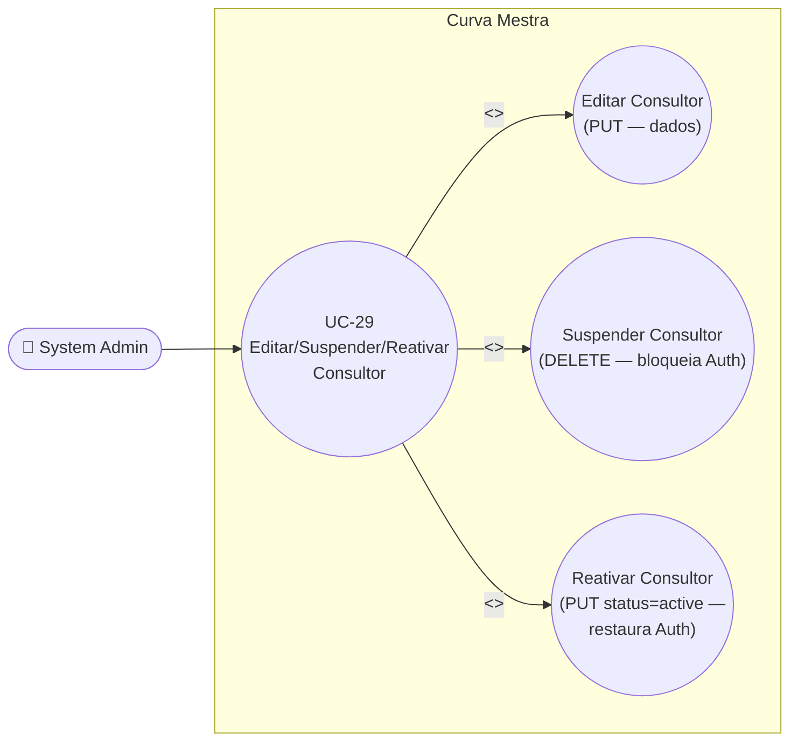

# UC-29: Editar, Suspender e Reativar Consultor

**Projeto:** Curva Mestra
**Data de Criação:** 14/07/2026
**Autor:** Guilherme Scandelari (via uml-use-case-writer)
**Status:** Aprovado
**Módulo/Contexto:** Administração do Sistema (Gestão de Consultores)
**Versão:** 1.2.2

> Um System Admin edita os dados de um consultor (`admin/consultants/[id]/page.tsx`) e/ou altera seu status na listagem (`admin/consultants/page.tsx`). Editar usa `PUT /api/consultants/[id]` (mesmo padrão de mesclagem já usado no UC-22). **Suspender** e **Reativar**, que até 16/07/2026 eram uma única função cosmética (`handleToggleStatus`, que só trocava o campo `status` no Firestore sem tocar em Auth/claims), agora são duas funções distintas: **Suspender** (`handleSuspend`) chama `DELETE /api/consultants/[id]`, que desabilita de fato a conta no Firebase Auth e zera o custom claim `active`, preservando as demais claims reais do usuário (`is_consultant`, `role`, `tenant_id`, `consultant_id`, `authorized_tenants`, etc.) buscadas via `adminAuth.getUser`; **Reativar** (`handleReactivate`) chama `PUT /api/consultants/[id]` com `{ status: 'active' }`, que agora também restaura o acesso real — reabilita a conta (`disabled: false`) e o claim `active: true`, preservando igualmente as demais claims. **Nota histórica:** até 16/07/2026, "Suspender" era puramente cosmético (RN-01) e a rota `DELETE`, que implementava a desativação real, era código morto (RN-02) — ambos corrigidos nos commits `b08fdeb`, `dbf128f` e `d167883`.

---

## 1. Diagrama UML (Mermaid)

---

## 2. Atores

### 2.1 Ator Primário
**System Admin** — telas restritas por `ProtectedRoute allowedRoles: ['system_admin']`.

### 2.2 Atores Secundários / Sistemas Externos
- **Consultor Rennova** afetado — agora efetivamente impactado pela ação: login bloqueado ao ser suspenso, restaurado ao ser reativado (antes da correção de 16/07/2026, a suspensão não tinha nenhum efeito real sobre o acesso dele — RN-01).
- **Firebase Auth** — atualizado em três pontos distintos: (1) edição de e-mail (`adminAuth.updateUser({ email })`); (2) suspensão, via `DELETE` (`adminAuth.updateUser({ disabled: true })` + claim `active: false`); (3) reativação, via `PUT` com `status: 'active'` (`adminAuth.updateUser({ disabled: false })` + claim `active: true`).

---

## 3. Pré-condições
- System Admin autenticado, `is_system_admin === true`.
- Existe um consultor com o id informado.
- `consultants/{id}.user_id` aponta para uma conta existente no Firebase Auth — necessário para os efeitos reais de suspender/reativar (`adminAuth.getUser` falha se a conta não existir mais, ver RN-08).

---

## 4. Pós-condições

### 4.1 Sucesso — Editar (tela de detalhe)
- `consultants/{id}.name`/`phone` são atualizados se informados.
- Se `email` for informado (o formulário sempre reenvia o e-mail atual, mesmo sem alteração — RN-05): `consultants/{id}.email` é atualizado **e** `adminAuth.updateUser(user_id, { email })` é chamado, alterando o e-mail de login no Firebase Auth. **Nenhuma notificação é enviada** ao consultor (nem para o e-mail antigo, nem para o novo) avisando da mudança (RN-03).

### 4.1b Sucesso — Suspender (listagem, `handleSuspend`)
- `consultants/{id}.status` passa a `'inactive'` — **não** `'suspended'` (RN-07). **Corrigido em 16/07/2026:** a aba "Suspensos" da listagem continua encontrando esse consultor normalmente, pois `GET /api/consultants` passou a tratar o filtro `status=suspended` como `where('status', 'in', ['suspended', 'inactive'])` (commit `3ab00b6`).
- A conta do consultor no Firebase Auth é desabilitada (`disabled: true`).
- O custom claim `active` do consultor passa a `false`; as demais claims (`is_consultant`, `role`, `tenant_id`, `consultant_id`, `authorized_tenants` etc.) são preservadas, pois a rota `DELETE` agora busca as claims reais via `adminAuth.getUser` antes de sobrescrever (RN-02, corrigida).
- **Efeito real (corrigido):** o consultor não consegue mais logar (`active: false` bloqueia acesso, verificado por `ProtectedRoute`) nem acessar nenhuma clínica à qual tinha acesso — a suspensão agora bloqueia acesso de fato, ao contrário do comportamento anterior a 16/07/2026 (RN-01, corrigida). **Achado novo, ainda aberto:** ao tentar logar com a conta suspensa, o consultor vê a mensagem crua e em inglês do SDK do Firebase Auth em vez de uma mensagem amigável em PT-BR (RN-09).

### 4.1c Sucesso — Reativar (listagem, `handleReactivate`)
- `consultants/{id}.status` volta a `'active'`.
- A conta do consultor no Firebase Auth é reabilitada (`disabled: false`).
- O custom claim `active` volta a `true`; as demais claims são preservadas, buscadas da mesma forma via `adminAuth.getUser`.
- **Efeito real:** o consultor volta a conseguir logar e recupera acesso às clínicas já presentes em `authorized_tenants` (esse campo nunca é alterado por suspender/reativar).

### 4.2 Falha (Garantias Mínimas)
- Se a validação de e-mail duplicado falhar (em `consultants` ou no Firebase Auth, fluxo de Editar): nenhuma alteração é feita — comportamento inalterado.
- **Suspender (`DELETE`):** o documento é atualizado (`status: 'inactive'`) **antes** das chamadas ao Firebase Auth (`adminAuth.getUser`, `setCustomUserClaims`, `updateUser`). Se qualquer uma dessas chamadas falhar depois (ex.: a conta Auth não existe mais), a API retorna 500, mas o documento já ficou marcado como `'inactive'` — uma inconsistência parcial possível, introduzida pela ordem de execução da correção (RN-08, achado novo, ainda não corrigido).
- **Reativar (`PUT`):** a ordem é invertida — as chamadas ao Firebase Auth (restaurar claim `active: true` e `disabled: false`) ocorrem **antes** da escrita final no Firestore. Se a escrita final falhar depois de o Auth já ter sido restaurado, o consultor recupera acesso real, mas o documento pode continuar refletindo o status antigo até uma nova tentativa (RN-08, achado novo, ainda não corrigido).

---

## 5. Gatilho (Trigger)
- **Editar:** System Admin acessa `/admin/consultants/{id}`, altera nome/e-mail/telefone e clica em "Salvar Alterações".
- **Suspender:** System Admin, na listagem `/admin/consultants`, clica no ícone "Suspender" (⊘) na linha do consultor (`status === 'active'`).
- **Reativar:** System Admin, na listagem `/admin/consultants`, clica no ícone "Reativar" (✓) na linha do consultor (`status !== 'active'`).

---

## 6. Fluxo Principal (Basic Flow) — Editar

1. System Admin acessa `/admin/consultants/{id}`.
2. Sistema carrega o consultor via `GET /api/consultants/{id}` e pré-preenche o formulário (nome, e-mail, telefone).
3. System Admin altera os campos desejados.
4. System Admin clica em "Salvar Alterações".
5. Sistema chama `PUT /api/consultants/{id}` com `{ name, email (sempre enviado, minúsculo), phone }`.
6. API valida token e `is_system_admin`; busca o consultor; monta o objeto de atualização (`name`/`phone` só se preenchidos).
7. Como `email` está sempre presente no payload (o formulário sempre reenvia o valor atual do campo — RN-05), a API **sempre** entra no ramo de verificação de e-mail: consulta duplicidade em `consultants` (ignorando o próprio documento) e, se diferente, chama `adminAuth.updateUser(user_id, { email })` — que pode falhar com `auth/email-already-exists` se o e-mail já pertencer a outra conta Auth (ex.: um `clinic_admin`).
8. API grava as alterações em `consultants/{id}`.
9. Sistema exibe "Consultor atualizado com sucesso!" e recarrega os dados.
10. Caso de uso é concluído com sucesso.

---

## 7. Fluxos Alternativos

### 7a. Suspender consultor (listagem, `status === 'active'`, função `handleSuspend`)
1. System Admin clica no ícone "Suspender" na linha do consultor.
2. Sistema exibe `confirm()`: `Tem certeza que deseja suspender o consultor "{nome}"? O acesso dele ao sistema será bloqueado imediatamente.`
3. Confirma.
4. Sistema chama `DELETE /api/consultants/{id}` (sem corpo).
5. API valida token e `is_system_admin`; busca o consultor; grava `status: 'inactive'` no documento (RN-07); busca as claims reais do usuário via `adminAuth.getUser(user_id)` e sobrescreve preservando-as, alterando apenas `active` para `false`; desabilita a conta no Firebase Auth (`disabled: true`).
6. Sistema exibe "Consultor suspenso com sucesso" e recarrega a lista.

### 7b. Reativar consultor (listagem, `status !== 'active'`, função `handleReactivate`)
1. System Admin clica no ícone "Reativar".
2. Sistema exibe `confirm()`: `Tem certeza que deseja reativar o consultor "{nome}"?`.
3. Confirma.
4. Sistema chama `PUT /api/consultants/{id}` com `{ status: 'active' }`.
5. API detecta que o status atual do documento é diferente de `'active'`; busca as claims reais via `adminAuth.getUser(user_id)` e restaura `active: true` preservando as demais; reabilita a conta no Firebase Auth (`disabled: false`); em seguida grava `status: 'active'` no documento.
6. Sistema exibe "Consultor reativado com sucesso" e recarrega a lista.

---

## 8. Fluxos de Exceção

### 8a. E-mail já em uso por outro consultor
1. API encontra outro documento em `consultants` com o mesmo e-mail.
2. API retorna 400 ("Email já está em uso"); nenhuma alteração é feita.

### 8b. E-mail já em uso no Firebase Auth (por outro tipo de usuário)
1. `adminAuth.updateUser` lança `auth/email-already-exists`.
2. API retorna 400 ("Email já está em uso no sistema"); o documento `consultants` **ainda não foi alterado** neste ponto (a checagem/tentativa no Auth ocorre antes da escrita no Firestore, no passo 7 do fluxo principal) — sem risco de inconsistência aqui.

### 8c. Consultor não encontrado
1. `id` não corresponde a nenhum documento.
2. API retorna 404.

### 8d. Token ausente/inválido ou sem permissão
1. 401 (token ausente) ou 403 (não é `system_admin`).

### 8e. Falha ao (des)habilitar a conta no Firebase Auth durante Suspender/Reativar
1. `adminAuth.getUser(user_id)`, `adminAuth.setCustomUserClaims` ou `adminAuth.updateUser` lançam exceção (ex.: a conta foi removida diretamente no console Firebase, fora do fluxo do sistema).
2. API retorna 500 (mensagem genérica do SDK).
3. O estado parcial resultante difere entre as duas operações — ver RN-08: em Suspender, o documento já foi alterado antes da falha; em Reativar, o Auth já foi restaurado antes da falha.

### 8f. Consultor suspenso tenta logar (`/login`) — mensagem de erro não traduzida
1. Consultor com conta desabilitada (`disabled: true`, ver 4.1b) tenta logar em `/login` com e-mail e senha corretos.
2. `signInWithEmailAndPassword` (Firebase Auth SDK) rejeita a tentativa com o código `auth/user-disabled`.
3. `signIn` (`src/hooks/useAuth.ts:75-82`) captura a exceção e retorna `{ success: false, error: error.message }` — a mensagem bruta do SDK, não `error.code`.
4. `translateFirebaseError` (`src/app/(auth)/login/page.tsx:136-153`) não tem nenhum tratamento para `user-disabled` (só trata `wrong-password`/`invalid-credential`, `user-not-found`, `too-many-requests`, `network-request-failed`, `invalid-email`) e cai no `default: return error || 'Erro ao fazer login. Tente novamente'`.
5. Sistema exibe ao consultor a mensagem crua e em inglês do SDK (ex.: `Firebase: The user account has been disabled by an administrator. (auth/user-disabled)`) em vez de uma mensagem amigável em PT-BR orientando a contatar o administrador (RN-09, achado novo, ainda não corrigido). Mesmo achado documentado em UC-36 (RN-10), pois a causa raiz é compartilhada pela mesma tela de login.

---

## 9. Regras de Negócio Relacionadas

| ID | Regra | Justificativa |
|----|-------|----------------|
| RN-01 | **[Corrigido em 16/07/2026 — antes era um achado crítico]** "Suspender" um consultor, via o ícone da listagem (`handleSuspend`), agora chama `DELETE /api/consultants/{id}`, que efetivamente bloqueia o acesso: desabilita a conta no Firebase Auth (`adminAuth.updateUser({ disabled: true })`) e zera o custom claim `active` (`active: false`), preservando as demais claims reais do usuário (buscadas via `adminAuth.getUser`, não mais espalhadas a partir do documento Firestore — ver RN-02). Um consultor suspenso deixa de conseguir logar e perde acesso a todas as clínicas às quais tinha acesso, imediatamente. **Histórico do bug original:** até 16/07/2026, "Suspender" chamava `PUT` e só alterava o campo `status` do documento Firestore, sem qualquer efeito sobre Firebase Auth, custom claims ou a regra de acesso do Firestore — puramente cosmético. Corrigido no commit `dbf128f` (troca do botão de `PUT` para `DELETE`), condicionado à correção de `b08fdeb` (ver RN-02). | Confirmado por leitura literal de `handleSuspend` (chama `DELETE`) e do handler `DELETE` atual em `api/consultants/[id]/route.ts`, e por diff dos commits `b08fdeb`/`dbf128f`. |
| RN-02 | **[Corrigido em 16/07/2026 — antes era um achado crítico]** A rota `DELETE /api/consultants/{id}` deixou de ser código morto: passou a ser chamada pelo botão "Suspender" da listagem (RN-01). Antes de ser reconectada, ela também tinha um bug próprio nunca observável em produção: ao zerar o custom claim `active`, espalhava o **documento Firestore do consultor** (`...consultantData`) como se fossem as claims atuais do usuário — o documento não contém `is_consultant`, `role`, `tenant_id` nem `consultant_id`, então a primeira desativação real destruiria essas claims funcionais. Corrigido no commit `b08fdeb`, que passou a buscar as claims reais via `adminAuth.getUser(user_id).customClaims` antes de sobrescrever, alterando apenas `active`. O mesmo padrão de preservação de claims foi replicado na reativação (`PUT`, commit `d167883` — decisão do PO pela Opção A: reforçar simetricamente também a reativação, e não só a suspensão). | Confirmado por diff do commit `b08fdeb`, leitura do handler `DELETE` atual (linhas 199-210) e do bloco de reativação em `PUT` (linhas 131-145). |
| RN-03 | **[Confirmado — ainda aberto]** Editar o e-mail de um consultor já vinculado a clínicas **não quebra estruturalmente** o vínculo — `authorized_tenants` não referencia e-mail, então o acesso às clínicas permanece intacto. O risco real é de UX/suporte: a API atualiza o e-mail tanto no Firestore quanto no Firebase Auth (login passa a exigir o **novo** e-mail), mas **nenhuma notificação é enviada** ao consultor — nem para o e-mail antigo, nem para o novo — avisando da mudança. Um consultor que não seja informado manualmente por outro canal pode ficar impossibilitado de logar, sem entender o motivo, e sem nenhum e-mail de aviso a consultar (diferente do que ocorre, por exemplo, no fluxo de redefinição de senha, que sempre notifica). | Confirmado por leitura completa de `PUT /api/consultants/[id]/route.ts` — ausência de qualquer escrita em `email_queue` no ramo de alteração de e-mail. |
| RN-04 | A validação de Bearer token e permissão está correta nas três rotas (GET/PUT/DELETE) — mesmo padrão já validado em UC-21/UC-23/UC-28, sem gap identificado aqui. | Confirmado por leitura completa das três funções. |
| RN-05 | **[Achado de UX — ainda aberto]** O formulário de edição sempre reenvia o campo `email` no payload do `PUT`, mesmo quando o admin não alterou esse campo — fazendo a API sempre entrar no ramo de verificação de duplicidade e tentativa de atualização no Firebase Auth, mesmo sem mudança real. Não é um bug funcional (a atualização para o mesmo valor é inofensiva), mas é uma chamada desnecessária ao Firebase Auth a cada "Salvar Alterações". | Confirmado por leitura do `handleSave` da tela de detalhe — `formData.email` sempre populado a partir dos dados carregados. |
| RN-06 | A regra do Firestore para `consultants/{consultantId}` restringe escrita a `isSystemAdmin()` — corretamente alinhada com a checagem da API, sem o tipo de gap encontrado em outras coleções (ex.: `tenants` no UC-22/UC-23). | Confirmado por leitura de `firestore.rules`. |
| RN-07 | **[Corrigido em 16/07/2026 — antes era um achado novo]** A suspensão real (`DELETE`) grava `status: 'inactive'` no documento do consultor — não `'suspended'`. `GET /api/consultants` agora trata o filtro `status=suspended`, usado pela aba "Suspensos" da listagem (`admin/consultants/page.tsx`, `statusFilter === 'suspended'`), como `where('status', 'in', ['suspended', 'inactive'])`: a consulta encontra tanto o valor legado `'suspended'` (gravado pelo antigo fluxo cosmético, anterior à correção de RN-01/RN-02) quanto o valor real atual `'inactive'` (gravado pelo `DELETE` desde a correção de RN-01/RN-02). Corrigido no commit `3ab00b6`. Nota: o badge de status da listagem (`getStatusBadge`) não foi alterado por esta correção — continua exibindo "Suspenso" (vermelho) apenas para `status === 'suspended'` e "Inativo" (cinza) para `'inactive'`; ou seja, um consultor suspenso pelo fluxo atual volta a aparecer normalmente na aba "Suspensos", mas com o badge "Inativo", não "Suspenso". **Histórico do achado original:** ao corrigir RN-01/RN-02, a suspensão passou a gravar `'inactive'`, mas a aba "Suspensos" ainda filtrava apenas por `'suspended'` (`where('status', '==', 'suspended')`), fazendo com que nenhum consultor suspenso pelo fluxo real aparecesse mais nessa aba. | Confirmado por leitura literal de `GET /api/consultants/route.ts` (linhas 140-144, commit `3ab00b6`) comparada ao handler `DELETE` (`status: 'inactive'`, hardcoded) e a `getStatusBadge`/filtro em `admin/consultants/page.tsx`. |
| RN-08 | **[Achado novo, decorrente da correção de RN-01/RN-02]** As duas operações que agora têm efeito real (`DELETE` e `PUT` com `status: 'active'`) gravam o Firestore e chamam o Firebase Auth em ordens opostas, criando um risco de inconsistência parcial em caso de falha no meio do caminho: em `DELETE`, o documento é atualizado (`status: 'inactive'`) **antes** das chamadas ao Auth — se `adminAuth.getUser`/`setCustomUserClaims`/`updateUser` falharem depois, o documento já mostra "inativo", mas a conta continua habilitada no Auth. Em `PUT` (reativação), a ordem é invertida — o Auth é restaurado **antes** da escrita final no Firestore — se essa escrita falhar depois, o consultor recupera acesso real, mas o documento pode continuar desatualizado. Nenhuma das duas rotas usa transação ou rollback para este cenário. | Confirmado por leitura sequencial de ambos os handlers em `api/consultants/[id]/route.ts` (`DELETE`: linhas 192-210; `PUT`: linhas 131-147). |
| RN-09 | **[Achado novo, decorrente da correção de RN-01 — ainda aberto]** Desde que "Suspender" passou a desabilitar de fato a conta do consultor no Firebase Auth (`disabled: true`, RN-01), o código de erro `auth/user-disabled`, lançado por `signInWithEmailAndPassword` ao tentar logar com essa conta, passou a ser efetivamente alcançável em `/login` — e não é tratado. `signIn` (`src/hooks/useAuth.ts:75-82`) retorna `{ success: false, error: error.message }` (a mensagem bruta do SDK, não `error.code`); `translateFirebaseError` (`src/app/(auth)/login/page.tsx:136-153`) trata `wrong-password`/`invalid-credential`, `user-not-found`, `too-many-requests`, `network-request-failed` e `invalid-email`, mas não tem nenhum tratamento para `user-disabled`, caindo no `default: return error \|\| 'Erro ao fazer login. Tente novamente'`. Resultado: o consultor suspenso vê a mensagem crua e em inglês do SDK (`Firebase: The user account has been disabled by an administrator. (auth/user-disabled)`) em vez de uma mensagem amigável em PT-BR orientando-o a contatar o administrador. **Antes da correção de RN-01 (16/07/2026), este code path nunca era alcançado**, pois a suspensão era só cosmética e a conta nunca era realmente desabilitada no Firebase Auth. Correção sugerida (ainda não implementada): adicionar um `case`/verificação para `user-disabled` em `translateFirebaseError`. Mesmo achado documentado em UC-36 (RN-10), pois a causa raiz é compartilhada — a mesma tela de login trata os erros de login para qualquer conta desabilitada, seja consultor (este UC) ou usuário de clínica (UC-36). | Confirmado por leitura literal de `signIn` (`src/hooks/useAuth.ts:75-82`, retorna `error.message` em vez de `error.code`) e de `translateFirebaseError` (`src/app/(auth)/login/page.tsx:97-133` e `136-153`) — ausência de tratamento para `user-disabled`. |

---

## 10. Requisitos Especiais / Não Funcionais

| ID | Descrição | Categoria |
|----|-----------|-----------|
| RNF-01 | **[Resolvido em 16/07/2026]** Até esta correção, a ausência de efeito real da suspensão (RN-01 original) era um risco de segurança/produto relevante: um `system_admin` que suspendesse um consultor por um motivo urgente (ex.: comportamento indevido, encerramento de contrato) podia acreditar erroneamente que o acesso havia sido cortado. Corrigido — ver RN-01/RN-02. | Segurança |
| RNF-02 | Não há confirmação por e-mail nem qualquer outro canal quando o e-mail de login de um consultor é alterado (RN-03) — risco de suporte, ainda aberto. | UX / Suporte |

---

## 11. Frequência de Uso
Ocasional — edição/suspensão de consultores não é uma operação do dia a dia.

---

## 12. Casos de Uso Relacionados
- **UC-28 (Cadastrar Consultor)** — pré-condição.
- **UC-22 (Editar, Desativar e Reativar Clínica)** — mesmo padrão de mesclagem de edição+status em um único UC. Na v1.0 deste documento, um achado estruturalmente similar havia sido identificado (mecanismo "fraco" era o realmente usado; o mecanismo "forte"/correto estava implementado, mas órfão) — esse achado foi corrigido aqui em UC-29 (v1.2); permanece a ser confirmado se um achado equivalente em UC-22 também foi corrigido.
- **UC-23/UC-24 a UC-27** — a filtragem por `status === 'active'` usada na busca de consultores (RN-01) afeta diretamente esses fluxos: um consultor suspenso por este UC deixa de ser encontrável para **novos** vínculos, mesmo mantendo os vínculos já existentes intactos (que agora ficam de fato bloqueados, e não apenas "escondidos", como antes da correção).
- **UC-08 (System Admin Envia Link de Redefinição de Senha)** — cobre integralmente a funcionalidade "Redefinir Senha via Link" da mesma tela de detalhe (`admin/consultants/[id]/page.tsx`, seção "Gerenciamento de Senha"), incluindo a rota `api/consultants/[id]/reset-password`. Não recebeu UC dedicado (decisão confirmada: criar um UC exclusivo para consultores duplicaria o conteúdo já coberto ali, já que UC-08 documenta o mecanismo genericamente para usuários e consultores).
- **UC-30 (Definir Senha do Consultor Manualmente)** — cobre a segunda ação da mesma seção "Gerenciamento de Senha" (`api/consultants/[id]/set-password`): define uma nova senha diretamente, sem e-mail.
- **UC-36 (Editar Usuário e Alterar Status Cross-Tenant)** — achado de UX compartilhado (RN-09 aqui / RN-10 lá): a tela de login (`login/page.tsx`) não trata o código `auth/user-disabled` do Firebase Auth para nenhuma conta desabilitada, seja consultor (suspenso por este UC) ou usuário de clínica (status "Inativo" por UC-36) — mesma causa raiz, mesma correção sugerida, achado descoberto na validação manual pós-fix de ambos os UCs (16-17/07/2026).
- **UC-04 (Fazer Login com Redirecionamento por Papel)** — dono da tela `/login` onde o achado RN-09 ocorre; não documentado formalmente lá nesta rodada (achado registrado apenas em UC-29/UC-36, por ter sido descoberto no contexto da validação pós-fix destes dois UCs).

---

## 13. Referências
- `src/app/(admin)/admin/consultants/[id]/page.tsx` (edição)
- `src/app/(admin)/admin/consultants/page.tsx` (listagem, `handleSuspend`/`handleReactivate`, `getStatusBadge`)
- `src/app/api/consultants/route.ts` (GET — listagem/filtro `status=suspended`)
- `src/app/api/consultants/[id]/route.ts` (GET/PUT/DELETE)
- `src/components/auth/ProtectedRoute.tsx`
- `firestore.rules` (`consultants/{consultantId}`, função `consultantHasAccess`)
- `src/types/index.ts` (`Consultant`, `ConsultantStatus`)
- `src/hooks/useAuth.ts` (`signIn`, linhas 75-82 — retorna `error.message` bruto, não `error.code`, ver RN-09)
- `src/app/(auth)/login/page.tsx` (`translateFirebaseError`, linhas 136-153 — sem tratamento para `user-disabled`, ver RN-09)
- Commits da correção: `b08fdeb` (preserva claims reais na desativação), `dbf128f` (reconecta "Suspender" à rota `DELETE`), `d167883` (restaura acesso/claims na reativação), `3ab00b6` (filtro "Suspensos" passa a incluir `'inactive'`)

---

## 14. Perguntas em Aberto / Decisões Pendentes

1. ~~**[RN-01, decisão de produto urgente]** "Suspender" um consultor hoje não tem efeito prático sobre login ou acesso a clínicas — apenas remove o consultor das buscas para novos vínculos. Decisão pendente: trocar o botão "Suspender" da listagem para usar a rota `DELETE` (que já implementa a desativação real) ou reforçar o handler `PUT` para também desabilitar a conta Auth e zerar os claims quando `status` muda para `'suspended'`.~~ **[RESOLVIDO em 16/07/2026]** Decisão do PO: Opção A — reforçar simetricamente tanto a suspensão (via `DELETE`, RN-01) quanto a reativação (via `PUT`, RN-02), em vez de restringir a correção apenas à suspensão. Implementado nos commits `b08fdeb`, `dbf128f` e `d167883`.
2. ~~**[RN-02]** A rota `DELETE /api/consultants/[id]` é código morto — decisão de produto pendente sobre reconectá-la (ver item 1) ou removê-la.~~ **[RESOLVIDO em 16/07/2026]** Reconectada ao botão "Suspender" (ver item 1), com seu próprio bug de claims corrigido no mesmo ciclo (commit `b08fdeb`).
3. **[RN-03]** Falta de notificação ao consultor quando seu e-mail de login é alterado pelo admin — risco de suporte a ser avaliado. Ainda aberto.
4. ~~**[RN-07, achado novo]** O status gravado por "Suspender" agora é `'inactive'`, não `'suspended'` — o filtro rápido "Suspensos" e o badge "Suspenso" da listagem ficaram órfãos/incorretos após a correção. Decisão de produto pendente: (a) ajustar `DELETE`/`handleSuspend` para gravar `status: 'suspended'` em vez de `'inactive'`, ou (b) atualizar o filtro e o badge da listagem para tratar `'inactive'` como o status real de um consultor suspenso.~~ **[RESOLVIDO em 16/07/2026]** Decisão do PO: Opção (b) — o filtro "Suspensos" (`GET /api/consultants`, parâmetro `status=suspended`) passou a tratar `'suspended'` e `'inactive'` como equivalentes (`where('status', 'in', ['suspended', 'inactive'])`), commit `3ab00b6`. O badge de status (`getStatusBadge`) não foi alterado nesta correção e continua exibindo "Inativo" (não "Suspenso") para `status === 'inactive'` — se essa distinção visual precisar ser unificada, é uma decisão de produto separada, ainda não levantada formalmente.
5. **[RN-08, achado novo]** Ordem de escrita assimétrica entre `DELETE` (Firestore antes do Auth) e `PUT`-reativação (Auth antes do Firestore) cria risco de inconsistência parcial em falhas intermediárias. Decisão pendente: avaliar se vale a pena unificar a ordem ou envolver as duas rotas em alguma forma de compensação/retry, dado o baixo volume de uso deste UC (Seção 11).
6. **[RN-09, achado novo]** A tela de login (`login/page.tsx`) não traduz o código `auth/user-disabled` para uma mensagem amigável em PT-BR — um consultor suspenso vê a mensagem crua e em inglês do SDK do Firebase ao tentar logar. Correção sugerida (ainda não implementada): adicionar tratamento de `user-disabled` em `translateFirebaseError`. Achado só se tornou alcançável na prática após a correção de RN-01 (16/07/2026), que passou a desabilitar a conta de verdade no Firebase Auth. Mesmo achado documentado em UC-36 (RN-10) — correção, se priorizada, deve ser feita uma única vez (mesma tela de login serve os dois fluxos).

---

## 15. Histórico de Versões

| Versão | Data | Autor | O que mudou |
|--------|------|-------|--------------|
| 1.0 | 14/07/2026 | Guilherme Scandelari | Versão inicial, investigada do zero. Confirmado 1 UC (mesmo padrão do UC-22), mesclando Editar (tela de detalhe) e Suspender/Reativar (tela de listagem), ambos usando `PUT /api/consultants/[id]`. Achado crítico: a suspensão real do consultor (`status: 'suspended'`) não bloqueia login nem revoga acesso a clínicas — não toca em Firebase Auth, custom claims nem `authorized_tenants` (RN-01); a rota `DELETE`, que implementaria a desativação real, está confirmadamente órfã (RN-02). Confirmado também que editar o e-mail não quebra vínculos existentes, mas não envia nenhuma notificação ao consultor (RN-03). Validação de Bearer token confirmada correta nas três rotas (RN-04), sem exceção ao padrão observado desde o UC-21. |
| 1.1 | 14/07/2026 | Guilherme Scandelari | Seção 12 atualizada: removida a referência genérica "[Não mapeado, fora de escopo]" para "Redefinir Senha via Link" e "Definir Senha Manualmente" — a primeira passou a apontar para UC-08 (decisão confirmada de não criar um UC-30 dedicado, por duplicar conteúdo já coberto ali), e a segunda passou a apontar para o novo UC-30, recém-mapeado. |
| 1.2 | 16/07/2026 | Guilherme Scandelari | RN-01 e RN-02 deixam de ser achados críticos: "Suspender" (`handleSuspend`) passou a chamar `DELETE /api/consultants/{id}`, que agora desabilita de fato a conta no Firebase Auth e zera o claim `active`, preservando as demais claims reais via `adminAuth.getUser` (commits `b08fdeb`, `dbf128f`); "Reativar" (`handleReactivate`), via `PUT`, passou a restaurar Auth/claims simetricamente (commit `d167883`, decisão do PO pela Opção A). Fluxo principal/alternativos e diagrama Mermaid atualizados para refletir duas funções distintas (antes: `handleToggleStatus` único). Itens 1 e 2 da Seção 14 marcados como resolvidos. Dois achados novos registrados como decorrência direta da correção: RN-07 (status real gravado passa a ser `'inactive'`, não `'suspended'` — quebra o filtro rápido e o badge "Suspensos"/"Suspenso" da listagem) e RN-08 (ordem de escrita assimétrica entre Firestore e Firebase Auth nas duas rotas, risco de inconsistência parcial em falhas intermediárias) — ambos registrados como novas pendências na Seção 14. |
| 1.2.1 | 16/07/2026 | Guilherme Scandelari | Correção pontual: RN-07 marcado como resolvido (commit `3ab00b6`) — `GET /api/consultants` passou a tratar o filtro `status=suspended` da aba "Suspensos" como `where('status', 'in', ['suspended', 'inactive'])`, voltando a encontrar consultores suspensos pelo fluxo real (`status: 'inactive'`), além do valor legado (`'suspended'`); nota preservada de que o badge de status (`getStatusBadge`) não foi alterado e ainda exibe "Inativo" (não "Suspenso") para esses casos. Item 4 da Seção 14 marcado como resolvido. RN-08 permanece inalterado, sem correção nesta rodada. |
| 1.2.2 | 17/07/2026 | Guilherme Scandelari (via uml-use-case-writer) | Achado novo registrado pelo `uc-issues-tracker` na validação manual pós-fix de RN-01/RN-02 e do achado equivalente em UC-36: a tela de login (`login/page.tsx`) não trata o código `auth/user-disabled` do Firebase Auth — `signIn` (`useAuth.ts:75-82`) retorna `error.message` bruto em vez de `error.code`, e `translateFirebaseError` (`login/page.tsx:136-153`) não tem tratamento para `user-disabled`, caindo no `default` e exibindo a mensagem crua em inglês do SDK ao consultor suspenso. Adicionado RN-09 (Seção 9), Fluxo de Exceção 8f, nota em 4.1b, referências a `useAuth.ts`/`login/page.tsx` na Seção 13, cross-reference a UC-36 (RN-10, mesma causa raiz) e a UC-04 (dono da tela de login, não alterado nesta rodada) na Seção 12, e novo item 6 na Seção 14. Nenhuma correção de código foi feita — apenas documentação do achado, ainda em aberto. |
