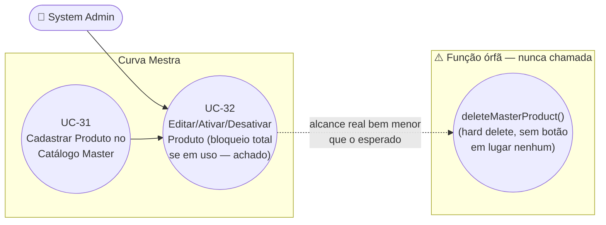

# UC-32: Editar, Ativar e Desativar Produto no Catálogo Master

**Projeto:** Curva Mestra
**Data de Criação:** 15/07/2026
**Autor:** Guilherme Scandelari (via uml-use-case-writer)
**Status:** Aprovado
**Módulo/Contexto:** Administração do Sistema (Catálogo de Produtos Master — Rennova)
**Versão:** 1.0

> Um System Admin edita os dados de um produto do catálogo master (`admin/products/[id]`) e/ou alterna seu status entre "Ativo" e "Inativo" diretamente na listagem (`admin/products`, sem confirmação). **Achado crítico confirmado:** quando o produto já está em uso no inventário de alguma clínica, o formulário de edição bloqueia **toda** a operação de salvar — inclusive alterações que nada têm a ver com fragmentação (nome, categoria, status) — porque o campo `fragmentavel` é sempre reenviado no payload, disparando incondicionalmente a checagem de bloqueio pensada apenas para os campos de fragmentação. Um `deleteMasterProduct` (hard delete) existe no serviço, mas é código morto, nunca chamado por nenhuma tela.

---

## 1. Diagrama UML (Mermaid)

---

## 2. Atores

### 2.1 Ator Primário
**System Admin** — telas restritas por `ProtectedRoute allowedRoles: ['system_admin']` (`src/app/(admin)/layout.tsx`).

### 2.2 Atores Secundários / Sistemas Externos
- **Clínicas (indiretamente)** — o status `active` de um produto master afeta se ele aparece como sugestão na inserção manual de NF-e (UC-11), e um produto "em uso" (`isMasterProductInUse`) é aquele referenciado em `inventory` de pelo menos uma clínica.
- Nenhum sistema externo (Firebase Auth, e-mail) envolvido — mesmo padrão "sem API/Function" já descrito em UC-31.

---

## 3. Pré-condições
- System Admin autenticado, `is_system_admin === true`, `active === true`.
- Existe um produto com o id informado em `master_products`.

---

## 4. Pós-condições

### 4.1 Sucesso — Editar (produto não está em uso)
- `master_products/{id}` é atualizado com os campos informados (`code`, `name`, `active`, `category`, `fragmentavel`, `unidades_por_embalagem`) e `updated_at`.
- Sistema exibe "Produto atualizado com sucesso!" e, após 1,5s, redireciona para `/admin/products`.

### 4.1b Sucesso — Ativar/Desativar (listagem)
- `master_products/{id}.active` alterna instantaneamente, **sem diálogo de confirmação** e **sem checar se o produto está em uso** (RN-02).
- A lista é recarregada (`loadProducts`) e a linha reflete o novo status.

### 4.2 Falha (Garantias Mínimas)
- **[Achado crítico]** Se o produto estiver em uso (`isMasterProductInUse === true`) e o admin salvar o formulário de edição: **nenhum campo é alterado**, mesmo que a intenção fosse apenas renomear o produto, trocar a categoria, ou reativá-lo/desativá-lo — o serviço aborta a operação inteira antes de gravar qualquer coisa (RN-01).
- Se a validação de código duplicado falhar: nenhuma alteração é feita.
- Demais falhas (rede, Firestore indisponível): nenhuma alteração parcial identificada — ambas as operações (`updateDoc` de edição, `updateDoc` de toggle) são escritas únicas.

---

## 5. Gatilho (Trigger)
- **Editar:** System Admin, na listagem `/admin/products`, clica no ícone de edição (lápis) de um produto, é levado a `/admin/products/{id}`, altera campos e clica em "Salvar Alterações".
- **Ativar/Desativar:** System Admin, na mesma listagem, clica diretamente no ícone Power (produto inativo → ativar) ou PowerOff (produto ativo → desativar) na linha do produto.

---

## 6. Fluxo Principal (Basic Flow) — Editar

1. System Admin acessa `/admin/products/{id}`.
2. Sistema chama `getMasterProduct(id)` e `isMasterProductInUse(id)` em paralelo (`Promise.all`); pré-preenche o formulário (código, nome, categoria, ativo/inativo, fragmentável, unidades por embalagem) e guarda o resultado em `emUso`.
3. Se `emUso === true`, sistema exibe um banner de aviso (âmbar): "Este produto está em uso no inventário de clínicas. As configurações de fragmentação não podem ser alteradas." e desabilita apenas o switch "Produto Fragmentável" e o campo "Unidades por Embalagem" — **os demais campos (código, nome, categoria, status) permanecem visualmente editáveis**, sugerindo ao admin que só a fragmentação está bloqueada (ver RN-01 para o comportamento real).
4. System Admin altera os campos desejados.
5. Clica em "Salvar Alterações".
6. Sistema valida no client: código com 7 dígitos, nome não vazio, unidades ≥ 2 se fragmentável (mesmas regras do UC-31).
7. Sistema chama `updateMasterProduct(id, { code, name, active, category, fragmentavel, unidades_por_embalagem })` — o payload **sempre** inclui `fragmentavel` (booleano do state do formulário, nunca `undefined`), independentemente de o admin ter mexido nesse campo ou não.
8. O serviço calcula `tentandoAlterarFragmentacao = data.fragmentavel !== undefined || data.unidades_por_embalagem !== undefined` — como `fragmentavel` está sempre presente no payload vindo desta tela, essa condição é **sempre verdadeira** (RN-01 — achado crítico).
9. Como `tentandoAlterarFragmentacao === true`, o serviço chama `isMasterProductInUse(id)` **novamente** (segunda chamada, redundante com o passo 2) — se `true`, lança a exceção "Este produto já está em uso..." e **nenhum campo é gravado**, nem os que nada têm a ver com fragmentação (ver Fluxo de Exceção 8a).
10. Se o produto não estiver em uso, o serviço grava as alterações em `master_products/{id}` (`code.trim()`, `name.trim().toUpperCase()`, `active`, `category`, `fragmentavel`, `unidades_por_embalagem`, `updated_at: serverTimestamp()`).
11. Sistema exibe "Produto atualizado com sucesso!" e, após 1,5s, redireciona para `/admin/products`.
12. Caso de uso é concluído com sucesso.

---

## 7. Fluxos Alternativos

### 7a. Ativar/Desativar diretamente na listagem (sem passar pela tela de edição)
1. Na tela `/admin/products`, System Admin clica no ícone Power/PowerOff na linha de um produto.
2. Sistema chama `handleToggleActive(productId, currentActive)`, que executa diretamente `deactivateMasterProduct(id)` (se estava ativo) ou `reactivateMasterProduct(id)` (se estava inativo) — **sem nenhum diálogo de confirmação** (diferente do padrão `confirm()` usado no módulo de Consultores, UC-29, Fluxos Alternativos 7a/7b) e **sem chamar `isMasterProductInUse`** — um produto ativamente usado no inventário de uma ou mais clínicas pode ser desativado com um único clique, sem qualquer aviso (RN-02).
3. `deactivateMasterProduct`/`reactivateMasterProduct` grava apenas `{ active: true|false, updated_at }`.
4. Sistema recarrega a lista (`loadProducts`); a linha reflete o novo status e o ícone alterna.

---

## 8. Fluxos de Exceção

### 8a. Edição bloqueada por produto em uso (achado crítico, RN-01)
1. Produto está em uso (`isMasterProductInUse === true`) e o formulário de edição é submetido — o que, nesta tela, ocorre **sempre** que "Salvar Alterações" é clicado, já que `fragmentavel` é sempre enviado.
2. O serviço lança "Este produto já está em uso no inventário de clínicas. As configurações de fragmentação não podem ser alteradas."
3. Sistema exibe a mensagem de erro; **nenhum campo é salvo** — nem nome, categoria ou status, mesmo que o admin não tivesse intenção de alterar fragmentação.

### 8b. Código duplicado ao editar
1. Admin altera o campo "Código do Produto" para um valor já usado por outro produto (`getMasterProductByCode` encontra um documento com `id` diferente do produto sendo editado).
2. Serviço lança "Já existe um produto com o código {code}"; nenhuma alteração é feita.

### 8c. Validação client-side falha
1. Código fora do padrão de 7 dígitos, nome vazio, ou unidades por embalagem inválidas (< 2) quando fragmentável.
2. Sistema exibe a mensagem específica; nenhuma chamada ao Firestore é feita.

### 8d. Produto não encontrado
1. `getMasterProduct(id)` lança "Produto não encontrado" (id não corresponde a nenhum documento).
2. Sistema exibe "Produto não encontrado" com um botão "Voltar para Produtos".

### 8e. Falha ao ativar/desativar na listagem
1. `deactivateMasterProduct`/`reactivateMasterProduct` lança exceção (rede, permissão).
2. Sistema exibe a mensagem de erro em um bloco no topo da listagem; a linha do produto mantém o status anterior (sem otimistic update — só é atualizado após recarregar com sucesso).

---

## 9. Regras de Negócio Relacionadas

| ID | Regra | Justificativa |
|----|-------|----------------|
| RN-01 | **[Achado crítico]** O formulário de edição (`admin/products/[id]/page.tsx`) sempre envia o campo `fragmentavel` no payload de `updateMasterProduct`, mesmo quando o admin não alterou nada relacionado a fragmentação. Como `updateMasterProduct` interpreta a mera presença de `fragmentavel !== undefined` como "tentando alterar fragmentação", a checagem `isMasterProductInUse` é disparada em **toda** submissão do formulário — e, se o produto estiver em uso, a operação inteira é abortada **antes** de qualquer campo ser gravado. Na prática, um produto em uso no inventário de qualquer clínica **não pode ser editado de forma alguma** através desta tela — nem para corrigir um erro de digitação no nome, nem para trocar a categoria, nem para reativá-lo/desativá-lo — mesmo que a UI (banner + switch desabilitado) sugira que apenas os campos de fragmentação estão bloqueados. | Confirmado por leitura literal de `handleSubmit` em `admin/products/[id]/page.tsx` (sempre inclui `fragmentavel` no objeto passado a `updateMasterProduct`) e de `updateMasterProduct` em `masterProductService.ts` (a condição `tentandoAlterarFragmentacao` e o `throw` antes de qualquer `firestoreData` ser montado). |
| RN-02 | **[Achado]** Ativar/Desativar diretamente na listagem (`handleToggleActive`) não exibe nenhum diálogo de confirmação — diferente do padrão `window.confirm()` usado para suspender/reativar consultores (UC-29) — e não verifica `isMasterProductInUse` antes de desativar. Um produto em uso corrente no inventário de uma ou mais clínicas pode ser desativado com um único clique acidental. | Confirmado por leitura completa de `handleToggleActive` em `admin/products/page.tsx` — chamada direta a `deactivateMasterProduct`/`reactivateMasterProduct`, sem `confirm()` nem checagem prévia de uso. |
| RN-03 | **[Achado de inconsistência entre módulos]** Desativar um produto (`active: false`) tem efeito **parcial e inconsistente** entre os dois fluxos de entrada de produtos: (1) na inserção manual de NF-e (UC-11), `loadMasterProducts` filtra explicitamente `where('active', '==', true)` — um produto desativado **desaparece** das sugestões de autocomplete; (2) na importação de NF-e via XML (UC-10), `getMasterProductByCode` faz o matching **sem nenhum filtro de `active`** — um produto desativado continua sendo encontrado e importado normalmente se aparecer em um XML. Ou seja, "desativar" um produto no catálogo master bloqueia apenas um dos dois caminhos de entrada de estoque, não ambos. | Confirmado por leitura de `loadMasterProducts` em `clinic/add-products/page.tsx` (`where('active', '==', true)`) versus `getMasterProductByCode` em `masterProductService.ts` (usado por `nfImportService.ts`, sem filtro de `active`). |
| RN-04 | **[Achado de código morto]** `deleteMasterProduct` (hard delete, `deleteDoc`) existe em `masterProductService.ts`, mas **nenhuma tela do sistema o chama** — nem a listagem, nem a tela de edição. O único mecanismo de "remoção" exposto na UI é a desativação (`active: false`), que é reversível. Mesmo padrão de função órfã já observado em outros módulos (ex.: rota `DELETE` de consultores no UC-29 RN-02, `createConsultant` órfã no UC-28 RN-06). | Confirmado por grep — zero ocorrências de `deleteMasterProduct(` fora da própria definição. |
| RN-05 | Alterar o campo `code` de um produto **já em uso** nos inventários das clínicas não tem nenhuma checagem própria — o único motivo pelo qual essa edição fica bloqueada hoje é o efeito colateral do achado RN-01 (bloqueio total quando em uso). Se RN-01 for corrigido para checar `isMasterProductInUse` apenas quando `fragmentavel`/`unidades_por_embalagem` realmente mudam, ficará uma lacuna nova: o vínculo do inventário é por `master_product_id` (o id do documento, não o `code`), mas a importação de XML (UC-10) faz o matching por `code` — trocar o código de um produto em uso poderia fazer produtos futuros de NF-e pararem de "casar" com o catálogo, mesmo já existindo internamente sob outro código. | Consequência lógica confirmada pela combinação de `updateMasterProduct` (sem checagem específica para mudança de `code`) com o uso de `code` como chave de matching em `getMasterProductByCode` (UC-10, RN-08). |
| RN-06 | O `<Select>` de categoria não oferece nenhuma opção de "Nenhuma categoria" — uma vez selecionada uma categoria, o admin não consegue limpá-la de volta para "sem categoria" pela UI (precisaria editar diretamente no Firestore). | Confirmado por leitura de `MASTER_PRODUCT_CATEGORIES` (7 valores fixos) e da lista de `SelectItem` renderizada em ambas as telas — nenhum item vazio/"nenhuma". |
| RN-07 | Assim como no cadastro (UC-31, RN-02), a autorização desta operação depende inteiramente da regra `allow write: if isSystemAdmin()` do Firestore, sem nenhuma revalidação de formato de dados no backend (não há rota `/api/products/*`). | Confirmado por leitura completa de `masterProductService.ts` — nenhuma chamada a Admin SDK ou API route. |

---

## 10. Requisitos Especiais / Não Funcionais

| ID | Descrição | Categoria |
|----|-----------|-----------|
| RNF-01 | RN-01 é um bug funcional relevante: impede qualquer manutenção (mesmo cosmética) em produtos já usados por clínicas — que tendem a ser justamente os produtos mais importantes do catálogo. | Confiabilidade |
| RNF-02 | Ausência de confirmação ao ativar/desativar direto na listagem (RN-02) é uma divergência de padrão de UX/segurança operacional em relação ao módulo de Consultores (UC-29). | Usabilidade |
| RNF-03 | RN-03 (inconsistência do efeito de `active` entre UC-10 e UC-11) pode gerar confusão: um admin que desative um produto "para não ser mais usado" pode não perceber que ele continua entrando via importação de XML. | Confiabilidade / Comunicação |

---

## 11. Frequência de Uso
Ocasional — edição e ativação/desativação de produtos do catálogo não são operações do dia a dia.

---

## 12. Casos de Uso Relacionados
- **UC-31 (Cadastrar Produto no Catálogo Master)** — pré-condição; ciclo de vida do produto criado ali continua neste UC.
- **UC-10 (Importar NF-e via Upload de XML)** e **UC-11 (Inserir Nota Fiscal Manualmente)** — consumidores do campo `active` deste catálogo, com comportamento inconsistente entre si (RN-03).
- **UC-29 (Editar, Suspender e Reativar Consultor)** — mesmo padrão de agrupar edição + toggle de status em um único UC, e achado estruturalmente similar (mecanismo de "remoção definitiva" existe no serviço, mas está órfão — RN-04 aqui, RN-02 lá); porém, diferente daquele UC, o achado central aqui não é "o botão fraco não faz nada", e sim "o botão de edição bloqueia mais do que deveria" quando o produto está em uso.
- **UC-13 (Desativar Item de Estoque com Verificação de Reservas Ativas)** — mesmo padrão conceitual de "bloquear desativação quando há uso ativo", mas implementado de forma bem mais completa naquele UC (nível de item de inventário por tenant) do que aqui (nível de catálogo global, e apenas para os campos de fragmentação, por acidente — RN-01).

---

## 13. Referências
- `src/app/(admin)/admin/products/page.tsx` (listagem, ativar/desativar)
- `src/app/(admin)/admin/products/[id]/page.tsx` (edição)
- `src/lib/services/masterProductService.ts` (`updateMasterProduct`, `deactivateMasterProduct`, `reactivateMasterProduct`, `isMasterProductInUse`, `deleteMasterProduct` — órfã, RN-04)
- `src/lib/services/nfImportService.ts` (consumidor via `getMasterProductByCode`, sem filtro `active` — RN-03)
- `src/app/(clinic)/clinic/add-products/page.tsx` (consumidor via `loadMasterProducts`, com filtro `active === true` — RN-03)
- `src/types/masterProduct.ts`
- `firestore.rules` (`match /master_products/{productId}`)

---

## 14. Perguntas em Aberto / Decisões Pendentes

1. **[RN-01, decisão de produto urgente]** O bloqueio total de edição de produtos em uso (mesmo para campos não relacionados a fragmentação) parece um bug, não uma intenção de produto. Decisão pendente: corrigir `updateMasterProduct` para só disparar `isMasterProductInUse` quando os valores de `fragmentavel`/`unidades_por_embalagem` realmente mudarem em relação ao que já está salvo (comparação de valores, não apenas presença do campo no payload)?
2. **[RN-02]** Ausência de confirmação e de checagem de uso ao ativar/desativar direto na listagem — decisão de produto sobre adicionar `confirm()` (como no UC-29) e/ou um aviso quando o produto estiver em uso.
3. **[RN-03]** Inconsistência confirmada entre UC-10 (não filtra `active`) e UC-11 (filtra `active === true`) — decisão de produto sobre padronizar o comportamento entre os dois fluxos de entrada de estoque.
4. **[RN-04]** `deleteMasterProduct` é código morto — decisão de produto sobre remover a função ou expor algum fluxo de remoção definitiva (com as devidas checagens de uso).
5. **[RN-05]** Se RN-01 for corrigido, será necessário definir explicitamente a regra de negócio para alteração de `code` de um produto já em uso, dado o papel do `code` no matching de importação de XML (UC-10).
6. **[RN-06]** Falta de opção para limpar a categoria de um produto já categorizado — ajuste de UX menor, prioridade a definir.

---

## 15. Histórico de Versões

| Versão | Data | Autor | O que mudou |
|--------|------|-------|--------------|
| 1.0 | 15/07/2026 | Guilherme Scandelari | Versão inicial, investigada do zero. Confirmado 1 UC (mesmo padrão do UC-22/UC-29), mesclando Editar (tela de detalhe) e Ativar/Desativar (listagem). Achado crítico: o formulário de edição sempre reenvia `fragmentavel`, disparando incondicionalmente a checagem de "produto em uso" e bloqueando a operação inteira, mesmo para campos não relacionados a fragmentação (RN-01). Achados adicionais: toggle de status na listagem sem confirmação e sem checagem de uso (RN-02); efeito inconsistente da flag `active` entre UC-10 (ignorado) e UC-11 (filtrado) (RN-03); `deleteMasterProduct` confirmado como código morto (RN-04); risco futuro de alteração de `code` de produto em uso, caso RN-01 seja corrigido (RN-05); impossibilidade de limpar categoria via UI (RN-06). Segundo UC do módulo "Admin — Catálogo de Produtos Master". |
