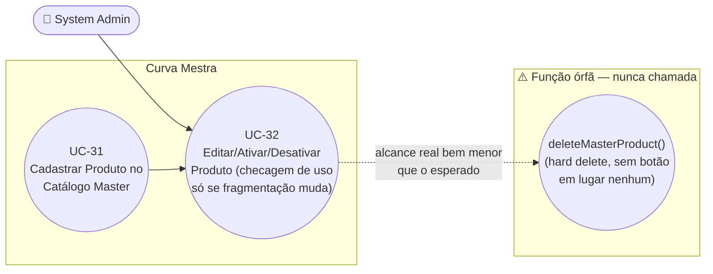

# UC-32: Editar, Ativar e Desativar Produto no Catálogo Master

**Projeto:** Curva Mestra
**Data de Criação:** 15/07/2026
**Autor:** Guilherme Scandelari (via uml-use-case-writer)
**Status:** Aprovado
**Módulo/Contexto:** Administração do Sistema (Catálogo de Produtos Master — Rennova)
**Versão:** 1.0.4

> Um System Admin edita os dados de um produto do catálogo master (`admin/products/[id]`) e/ou alterna seu status entre "Ativo" e "Inativo" diretamente na listagem (`admin/products`, **com confirmação, desde o commit `7c3cbb2`**). **Achado crítico [CORRIGIDO no commit `f6e9161`]:** quando o produto já estava em uso no inventário de alguma clínica, o formulário de edição bloqueava **toda** a operação de salvar — inclusive alterações que nada tinham a ver com fragmentação (nome, categoria, status) — porque o campo `fragmentavel` era sempre reenviado no payload, disparando incondicionalmente a checagem de bloqueio pensada apenas para os campos de fragmentação. Corrigido: o payload só inclui `fragmentavel`/`unidades_por_embalagem` quando esses campos realmente mudam em relação ao produto carregado, e a checagem de "produto em uso" só é disparada nesse caso (ver RN-01). **Achados adicionais corrigidos no commit `7c3cbb2`:** ativar/desativar produto na listagem agora exige confirmação explícita (`AlertDialog`) e, ao desativar, avisa (sem bloquear) se o produto está em uso no inventário de alguma clínica (RN-02); e a importação de NF-e via XML (UC-10) passa a tratar produto master inativo como pendente de cadastro, exatamente como já fazia para "código não encontrado", alinhando seu comportamento ao da inserção manual (UC-11) (RN-03). Um `deleteMasterProduct` (hard delete) existe no serviço, mas é código morto, nunca chamado por nenhuma tela.

---

## 1. Diagrama UML (Mermaid)

```mermaid
flowchart LR
    SystemAdmin([👤 System Admin])

    subgraph Sistema["Curva Mestra"]
        UC31(("UC-31\nCadastrar Produto no\nCatálogo Master"))
        UC32(("UC-32\nEditar/Ativar/Desativar\nProduto (checagem de uso\nsó se fragmentação muda)"))
    end

    subgraph Orfao["⚠️ Função órfã — nunca chamada"]
        DelFn(("deleteMasterProduct()\n(hard delete, sem botão\nem lugar nenhum)"))
    end

    SystemAdmin --> UC32
    UC31 --> UC32
    UC32 -.->|alcance real bem menor\nque o esperado| DelFn
```

---

## 2. Atores

### 2.1 Ator Primário
**System Admin** — telas restritas por `ProtectedRoute allowedRoles: ['system_admin']` (`src/app/(admin)/layout.tsx`).

### 2.2 Atores Secundários / Sistemas Externos
- **Clínicas (indiretamente)** — o status `active` de um produto master afeta se ele aparece como sugestão na inserção manual de NF-e (UC-11) e se ele é aceito pela importação via XML (UC-10, desde a correção da RN-03), e um produto "em uso" (`isMasterProductInUse`) é aquele referenciado em `inventory` de pelo menos uma clínica.
- Nenhum sistema externo (Firebase Auth, e-mail) envolvido — mesmo padrão "sem API/Function" já descrito em UC-31.

---

## 3. Pré-condições
- System Admin autenticado, `is_system_admin === true`, `active === true`.
- Existe um produto com o id informado em `master_products`.

---

## 4. Pós-condições

### 4.1 Sucesso — Editar (produto não está em uso)
- `master_products/{id}` é atualizado com os campos informados (`code`, `name`, `active`, `category`, e — desde o commit `f6e9161` — `fragmentavel`/`unidades_por_embalagem` apenas se esses dois campos realmente mudaram em relação ao produto carregado) e `updated_at`. **Desde o commit `2ddebd6` (RN-06):** se `category` for enviado como `null` (opção "Sem categoria" selecionada na UI), o campo `category` é removido do documento via `deleteField()`, em vez de apenas receber um valor vazio ou permanecer intocado.
- Sistema exibe "Produto atualizado com sucesso!" e, após 1,5s, redireciona para `/admin/products`.

### 4.1b Sucesso — Ativar/Desativar (listagem)
- **[CORRIGIDO no commit `7c3cbb2` — RN-02]** `master_products/{id}.active` só alterna após confirmação explícita em um `AlertDialog` (mesmo padrão de componente já usado em `admin/legal-documents/page.tsx` para exclusão, UC-34). Ao desativar (não ao reativar), o diálogo também consulta `isMasterProductInUse(productId)` e exibe um aviso não-bloqueante — "Este produto está em uso no inventário de alguma clínica. Desativar não afeta lotes já lançados, apenas impede novas entradas para este código." — caso o produto esteja em uso; a ação de desativar continua permitida mesmo com o aviso (é uma confirmação informada, não um bloqueio).
- A lista é recarregada (`loadProducts`) e a linha reflete o novo status.

### 4.2 Falha (Garantias Mínimas)
- **[Achado crítico, corrigido no commit `f6e9161`]** Se o produto estiver em uso (`isMasterProductInUse === true`) **e** o admin alterar `fragmentavel`/`unidades_por_embalagem` em relação ao valor já salvo: nenhum campo é alterado — o serviço aborta a operação inteira antes de gravar qualquer coisa (RN-01). Desde a correção, editar apenas nome, categoria ou status de um produto em uso **não** aciona mais esse bloqueio.
- Se a validação de código duplicado falhar: nenhuma alteração é feita.
- **[CORRIGIDO no commit `7c3cbb2`]** Se o System Admin cancelar o `AlertDialog` de ativar/desativar (ou fechar sem confirmar): nenhuma chamada a `deactivateMasterProduct`/`reactivateMasterProduct` é feita; o produto permanece com o status anterior.
- Demais falhas (rede, Firestore indisponível): nenhuma alteração parcial identificada — ambas as operações (`updateDoc` de edição, `updateDoc` de toggle) são escritas únicas.

---

## 5. Gatilho (Trigger)
- **Editar:** System Admin, na listagem `/admin/products`, clica no ícone de edição (lápis) de um produto, é levado a `/admin/products/{id}`, altera campos e clica em "Salvar Alterações".
- **Ativar/Desativar:** System Admin, na mesma listagem, clica diretamente no ícone Power (produto inativo → ativar) ou PowerOff (produto ativo → desativar) na linha do produto — desde o commit `7c3cbb2`, este clique abre um diálogo de confirmação em vez de alternar o status imediatamente (RN-02).

---

## 6. Fluxo Principal (Basic Flow) — Editar

1. System Admin acessa `/admin/products/{id}`.
2. Sistema chama `getMasterProduct(id)` e `isMasterProductInUse(id)` em paralelo (`Promise.all`); pré-preenche o formulário (código, nome, categoria, ativo/inativo, fragmentável, unidades por embalagem) e guarda o resultado em `emUso`.
3. Se `emUso === true`, sistema exibe um banner de aviso (âmbar): "Este produto está em uso no inventário de clínicas. As configurações de fragmentação não podem ser alteradas." e desabilita apenas o switch "Produto Fragmentável" e o campo "Unidades por Embalagem" — os demais campos (código, nome, categoria, status) permanecem editáveis e, desde a correção do commit `f6e9161`, realmente podem ser salvos sem bloqueio (ver RN-01).
4. System Admin altera os campos desejados — incluindo, no campo "Categoria", a opção "Sem categoria" (`<SelectItem value="none">`), disponível desde o commit `2ddebd6`, para limpar uma categoria já definida (RN-06).
5. Clica em "Salvar Alterações".
6. Sistema valida no client: código com 7 dígitos, nome não vazio, unidades ≥ 2 se fragmentável (mesmas regras do UC-31).
7. **[Corrigido no commit `f6e9161`]** Sistema calcula `fragmentacaoAlterada` — `true` somente se `fragmentavel` for diferente do `product.fragmentavel` carregado, ou se `fragmentavel === true` e `unidades_por_embalagem` for diferente do valor carregado. Sistema chama `updateMasterProduct(id, { code, name, active, category, ...(fragmentacaoAlterada && { fragmentavel, unidades_por_embalagem }) })` — o payload só inclui `fragmentavel`/`unidades_por_embalagem` quando `fragmentacaoAlterada === true`; caso contrário, esses dois campos ficam `undefined` e não são enviados. O campo `category` continua sendo enviado como `category || null` — `null` quando "Sem categoria" está selecionado.
8. O serviço calcula `tentandoAlterarFragmentacao = data.fragmentavel !== undefined || data.unidades_por_embalagem !== undefined` — agora essa condição só é verdadeira quando o formulário efetivamente enviou esses campos (passo 7), ou seja, apenas quando a fragmentação realmente mudou (RN-01, `[CORRIGIDO]`).
9. Se `tentandoAlterarFragmentacao === true`, o serviço chama `isMasterProductInUse(id)` **novamente** (segunda chamada, redundante com o passo 2) — se `true`, lança a exceção "Este produto já está em uso..." e nenhum campo é gravado (ver Fluxo de Exceção 8a). Se `tentandoAlterarFragmentacao === false` (fragmentação não mudou), essa checagem é pulada e a gravação segue normalmente, mesmo que o produto esteja em uso.
10. Se o produto não estiver em uso (ou se a fragmentação não mudou), o serviço grava as alterações em `master_products/{id}` (`code.trim()`, `name.trim().toUpperCase()`, `active`, `category` — `deleteField()` se `null`, ou o valor informado —, `fragmentavel`/`unidades_por_embalagem` quando enviados, `updated_at: serverTimestamp()`).
11. **[CORRIGIDO no commit `7c3cbb2` — herdado de UC-31 RN-02]** A regra de segurança de `master_products` (`allow update`) revalida no servidor que, se `code` estiver presente no payload, casa com `^[0-9]{7}$`, e que, se `name` estiver presente, é uma string não vazia — transparente no caminho feliz, já que o client já normaliza esses campos antes de enviar.
12. Sistema exibe "Produto atualizado com sucesso!" e, após 1,5s, redireciona para `/admin/products`.
13. Caso de uso é concluído com sucesso.

---

## 7. Fluxos Alternativos

### 7a. Ativar/Desativar diretamente na listagem (sem passar pela tela de edição)
1. Na tela `/admin/products`, System Admin clica no ícone Power/PowerOff na linha de um produto.
2. **[CORRIGIDO no commit `7c3cbb2` — RN-02]** Sistema chama `handleRequestToggleActive(product)` — nenhuma alteração é feita ainda; o sistema apenas abre um `AlertDialog` de confirmação, guardando o produto selecionado em `productToToggle`. Se o produto está atualmente ativo (ou seja, a ação em curso é desativar), o sistema também dispara `isMasterProductInUse(product.id)` em paralelo — enquanto a checagem está em andamento, um texto "Verificando uso em inventário..." é exibido no diálogo (`checkingUse`); o resultado é guardado em `productInUse`. Ao reativar um produto inativo, essa checagem não é disparada.
3. O diálogo exibe o título "Desativar produto?" ou "Reativar produto?" e o nome do produto; se a ação é desativar e `productInUse === true`, o diálogo acrescenta um aviso em destaque: "Este produto está em uso no inventário de alguma clínica. Desativar não afeta lotes já lançados, apenas impede novas entradas para este código." — este aviso é puramente informativo: o botão de confirmação continua habilitado (`disabled={checkingUse}`, não `disabled={productInUse}`) mesmo com o produto em uso — diferente do bloqueio real aplicado à edição de fragmentação (RN-01).
4. System Admin confirma clicando em "Desativar"/"Reativar" (ou clica em "Cancelar"/fecha o diálogo, encerrando o fluxo sem nenhuma alteração).
5. Sistema chama `handleConfirmToggleActive()`, que executa `deactivateMasterProduct(id)` (se o produto estava ativo) ou `reactivateMasterProduct(id)` (se estava inativo) — cada uma grava apenas `{ active: true|false, updated_at }`.
6. Sistema recarrega a lista (`loadProducts`); a linha reflete o novo status e o ícone alterna; o diálogo é fechado (`productToToggle` volta a `null`, no `finally`).

---

## 8. Fluxos de Exceção

### 8a. Edição bloqueada por produto em uso, com fragmentação alterada (RN-01)
1. Produto está em uso (`isMasterProductInUse === true`) e o admin altera `fragmentavel`/`unidades_por_embalagem` em relação ao valor carregado, e o formulário é submetido — desde o commit `f6e9161`, isso só ocorre quando `fragmentacaoAlterada === true` (passo 7 do Fluxo Principal); editar apenas outros campos não aciona mais este fluxo.
2. O serviço lança "Este produto já está em uso no inventário de clínicas. As configurações de fragmentação não podem ser alteradas."
3. Sistema exibe a mensagem de erro; nenhum campo é salvo.

### 8b. Código duplicado ao editar
1. Admin altera o campo "Código do Produto" para um valor já usado por outro produto (`getMasterProductByCode` encontra um documento com `id` diferente do produto sendo editado).
2. Serviço lança "Já existe um produto com o código {code}"; nenhuma alteração é feita.

### 8c. Validação client-side falha
1. Código fora do padrão de 7 dígitos, nome vazio, ou unidades por embalagem inválidas (< 2) quando fragmentável.
2. Sistema exibe a mensagem específica; nenhuma chamada ao Firestore é feita.

### 8d. Produto não encontrado
1. `getMasterProduct(id)` lança "Produto não encontrado" (id não corresponde a nenhum documento).
2. Sistema exibe "Produto não encontrado" com um botão "Voltar para Produtos".

### 8e. Falha ao ativar/desativar na listagem
1. Dentro de `handleConfirmToggleActive` (chamado após a confirmação do diálogo, ver Fluxo Alternativo 7a), `deactivateMasterProduct`/`reactivateMasterProduct` lança exceção (rede, permissão).
2. Sistema exibe a mensagem de erro em um bloco no topo da listagem; a linha do produto mantém o status anterior (sem otimistic update — só é atualizado após recarregar com sucesso); o diálogo é fechado (`finally`) independentemente do resultado.

---

## 9. Regras de Negócio Relacionadas

| ID | Regra | Justificativa |
|----|-------|----------------|
| RN-01 | **[CORRIGIDO no commit `f6e9161`]** Antes: o formulário de edição (`admin/products/[id]/page.tsx`) sempre enviava o campo `fragmentavel` no payload de `updateMasterProduct`, mesmo quando o admin não alterava nada relacionado a fragmentação. Como `updateMasterProduct` interpretava a mera presença de `fragmentavel !== undefined` como "tentando alterar fragmentação", a checagem `isMasterProductInUse` era disparada em **toda** submissão do formulário — e, se o produto estivesse em uso, a operação inteira era abortada **antes** de qualquer campo ser gravado. Na prática, um produto em uso no inventário de qualquer clínica não podia ser editado de forma alguma através desta tela — nem para corrigir um erro de digitação no nome, nem para trocar a categoria, nem para reativá-lo/desativá-lo — mesmo que a UI (banner + switch desabilitado) sugerisse que apenas os campos de fragmentação estavam bloqueados. Agora: em `handleSubmit` (`admin/products/[id]/page.tsx`), uma nova constante `fragmentacaoAlterada` compara `fragmentavel`/`unidadesPorEmbalagem` atuais contra os valores originais carregados em `product` (`product.fragmentavel`, `product.unidades_por_embalagem`); o payload enviado a `updateMasterProduct` só inclui `fragmentavel`/`unidades_por_embalagem` (via spread condicional `...(fragmentacaoAlterada && {...})`) quando esses campos realmente mudaram — caso contrário ficam `undefined`, e a checagem de bloqueio em `isMasterProductInUse` nunca é acionada para edições que não tocam fragmentação. | Confirmado por leitura literal de `handleSubmit` em `admin/products/[id]/page.tsx` (nova constante `fragmentacaoAlterada` e spread condicional) e de `updateMasterProduct` em `masterProductService.ts` (a condição `tentandoAlterarFragmentacao` agora só é verdadeira quando o payload efetivamente inclui os campos de fragmentação). Commit `f6e9161` (`fix: tres itens de alta severidade (UC-32, UC-04, UC-39)`). |
| RN-02 | **[CORRIGIDO no commit `7c3cbb2`]** Antes: ativar/desativar diretamente na listagem (`handleToggleActive`) não exibia nenhum diálogo de confirmação — diferente do padrão `window.confirm()` usado para suspender/reativar consultores (UC-29) — e não verificava `isMasterProductInUse` antes de desativar; um produto em uso corrente no inventário de uma ou mais clínicas podia ser desativado com um único clique acidental. Agora: o `onClick` do botão de toggle na listagem deixou de chamar `handleToggleActive` diretamente e passou a chamar `handleRequestToggleActive`, que abre um `AlertDialog` de confirmação (mesmo componente já usado em `admin/legal-documents/page.tsx` para exclusão, UC-34). Ao desativar (não ao reativar), o diálogo também chama `isMasterProductInUse(productId)` (função já existente, antes usada só dentro de `updateMasterProduct`, ver RN-01) e exibe um aviso não-bloqueante se o produto estiver em uso — a ação de desativar continua permitida mesmo com o aviso (é uma confirmação informada, não um bloqueio, diferente do comportamento de RN-01 para fragmentação). A gravação de fato só ocorre em `handleConfirmToggleActive`, disparada pela confirmação do diálogo. | Confirmado por leitura do diff do commit `7c3cbb2` em `admin/products/page.tsx` — novos estados `productToToggle`/`productInUse`/`checkingUse`, funções `handleRequestToggleActive`/`handleConfirmToggleActive`, e o `AlertDialog` renderizado ao final do componente. |
| RN-03 | **[CORRIGIDO no commit `7c3cbb2`]** Antes: desativar um produto (`active: false`) tinha efeito **parcial e inconsistente** entre os dois fluxos de entrada de produtos — (1) na inserção manual de NF-e (UC-11), `loadMasterProducts` filtra explicitamente `where('active', '==', true)`, então um produto desativado desaparecia das sugestões de autocomplete; (2) na importação de NF-e via XML (UC-10), `getMasterProductByCode` fazia o matching **sem nenhum filtro de `active`**, então um produto desativado continuava sendo encontrado e importado normalmente se aparecesse em um XML. Agora: em `processNFAndAddToInventory` (`nfImportService.ts`), a condição que enfileira um item em `produtosPendentes` mudou de `if (!masterProduct)` para `if (!masterProduct \|\| !masterProduct.active)` — um produto inativo passa a ser tratado exatamente como "código não encontrado" (ver UC-12), entrando na fila de pendências em vez de ser silenciosamente adicionado ao inventário. Os dois fluxos de entrada de estoque (UC-10 e UC-11) agora tratam `active: false` de forma consistente: nenhum dos dois permite que um produto inativo entre no inventário sem passar antes pela fila de resolução de pendências. | Confirmado por leitura do diff do commit `7c3cbb2` em `nfImportService.ts` — condição alterada de `if (!masterProduct)` para `if (!masterProduct \|\| !masterProduct.active)`, dentro de `processNFAndAddToInventory`. |
| RN-04 | **[Achado de código morto]** `deleteMasterProduct` (hard delete, `deleteDoc`) existe em `masterProductService.ts`, mas **nenhuma tela do sistema o chama** — nem a listagem, nem a tela de edição. O único mecanismo de "remoção" exposto na UI é a desativação (`active: false`), que é reversível. Mesmo padrão de função órfã já observado em outros módulos (ex.: rota `DELETE` de consultores no UC-29 RN-02, `createConsultant` órfã no UC-28 RN-06). | Confirmado por grep — zero ocorrências de `deleteMasterProduct(` fora da própria definição. |
| RN-05 | Alterar o campo `code` de um produto **já em uso** nos inventários das clínicas não tem nenhuma checagem própria — mesmo após a correção de RN-01, alterar apenas `code` (sem tocar fragmentação) não dispara `isMasterProductInUse`, já que `fragmentacaoAlterada` só considera `fragmentavel`/`unidades_por_embalagem`. O vínculo do inventário é por `master_product_id` (o id do documento, não o `code`), mas a importação de XML (UC-10) faz o matching por `code` — trocar o código de um produto em uso pode fazer produtos futuros de NF-e pararem de "casar" com o catálogo, mesmo já existindo internamente sob outro código. | Consequência lógica confirmada pela combinação de `updateMasterProduct` (sem checagem específica para mudança de `code`, mesmo após a correção de RN-01) com o uso de `code` como chave de matching em `getMasterProductByCode` (UC-10, RN-08). |
| RN-06 | **[Corrigido no commit `2ddebd6` — UC-32-RN-06]** O `<Select>` de categoria da tela de edição (`admin/products/[id]/page.tsx`) agora oferece a opção "Sem categoria" (`<SelectItem value="none">Sem categoria</SelectItem>`), com `value={category \|\| 'none'}` e `onValueChange={(v) => setCategory(v === 'none' ? '' : (v as MasterProductCategory))}` — o admin consegue limpar a categoria de um produto já categorizado diretamente pela UI. O payload enviado a `updateMasterProduct` mudou de `category: category \|\| undefined` para `category: category \|\| null`, usando `null` como sinal explícito de "limpar". **Bug adicional descoberto e corrigido no mesmo commit (causa raiz de por que a limpeza não funcionava de fato):** em `masterProductService.ts`, `updateMasterProduct` tinha `if (data.category !== undefined) firestoreData.category = data.category;` — como a UI antiga enviava `category: undefined` para "limpar", essa condição nunca disparava, e o campo `category` nunca era de fato removido no Firestore (o valor antigo permanecia intacto mesmo com a intenção de limpeza). Corrigido para `if (data.category !== undefined) { firestoreData.category = data.category === null ? deleteField() : data.category; }`, usando `deleteField()` do Firestore quando `category === null`. O tipo `UpdateMasterProductData.category` (`src/types/masterProduct.ts`) mudou de `MasterProductCategory` para `MasterProductCategory \| null` para suportar o novo contrato explícito de limpeza. **Achado adicional confirmado durante validação manual desta correção, já nascido corrigido no mesmo padrão (commit `199d09b`):** o `<Select>` de categoria da tela de **listagem** (`admin/products/page.tsx`) tinha a mesma lacuna original do RN-06 (a própria v1.0 deste UC já registrava a ausência de "Nenhuma categoria" em "ambas as telas" — edição e listagem) e não havia sido corrigida junto com o formulário de edição no commit `2ddebd6`: só oferecia "Todas as categorias" mais cada categoria específica, sem opção para filtrar produtos sem categoria definida. Corrigido no commit `199d09b`, no mesmo padrão do formulário de edição: o estado `categoryFilter` foi ampliado de `useState<MasterProductCategory | 'all'>('all')` para `useState<MasterProductCategory | 'all' | 'none'>('all')`; a função `filterProducts` ganhou o branch `if (categoryFilter === 'none') { filtered = filtered.filter((p) => !p.category); }` antes do `else if (categoryFilter !== 'all')`; e o `<Select>` ganhou `<SelectItem value="none">Sem categoria</SelectItem>` logo após "Todas as categorias". Diferente da correção do formulário de edição, este filtro é puramente client-side sobre os `products` já carregados em memória (sem escrita no Firestore), então não havia bug equivalente ao do `updateMasterProduct`/`deleteField()` a corrigir aqui. | Confirmado por leitura direta de `admin/products/[id]/page.tsx` (novo `SelectItem`, `onValueChange`, payload `category: category \|\| null`), `masterProductService.ts` (`updateMasterProduct`, uso de `deleteField()`) e `src/types/masterProduct.ts` (`category?: MasterProductCategory \| null`) para a correção do formulário de edição; e por leitura direta de `admin/products/page.tsx` (estado `categoryFilter`, branch `categoryFilter === 'none'` em `filterProducts`, novo `SelectItem value="none"`) para a correção do filtro da listagem. |
| RN-07 | Assim como no cadastro (UC-31, RN-02), a autorização desta operação depende da regra de segurança do Firestore (`master_products`, hoje dividida em `allow create`/`allow update`/`allow delete`, todas restritas a `isSystemAdmin()`). Desde o commit `7c3cbb2`, `allow update` também revalida no servidor o formato de `code`/`name` quando esses campos estão presentes no payload (herdado de UC-31, RN-02) — mas não existe rota `/api/products/*` revalidando o restante dos campos (`category`, `fragmentavel`, `unidades_por_embalagem`, `active`). | Confirmado por leitura completa de `masterProductService.ts` (nenhuma chamada a Admin SDK ou API route) e do diff do commit `7c3cbb2` em `firestore.rules`. |

---

## 10. Requisitos Especiais / Não Funcionais

| ID | Descrição | Categoria |
|----|-----------|-----------|
| RNF-01 | **[Mitigado no commit `f6e9161`]** RN-01 era um bug funcional relevante: impedia qualquer manutenção (mesmo cosmética) em produtos já usados por clínicas — que tendem a ser justamente os produtos mais importantes do catálogo. Corrigido: o bloqueio agora só ocorre quando a fragmentação realmente muda. | Confiabilidade |
| RNF-02 | **[Resolvido no commit `7c3cbb2`]** Ausência de confirmação ao ativar/desativar direto na listagem (RN-02) — divergência de padrão de UX/segurança operacional em relação ao módulo de Consultores (UC-29) — foi corrigida com a introdução do `AlertDialog` de confirmação e do aviso não-bloqueante de uso em inventário. | Usabilidade |
| RNF-03 | **[Resolvido no commit `7c3cbb2`]** RN-03 (inconsistência do efeito de `active` entre UC-10 e UC-11) foi corrigida — os dois fluxos de entrada de estoque agora tratam produto master inativo de forma consistente, ambos enviando o item para a fila de pendências (UC-12) em vez de permitir a entrada silenciosa no inventário. | Confiabilidade / Comunicação |

---

## 11. Frequência de Uso
Ocasional — edição e ativação/desativação de produtos do catálogo não são operações do dia a dia.

---

## 12. Casos de Uso Relacionados
- **UC-31 (Cadastrar Produto no Catálogo Master)** — pré-condição; ciclo de vida do produto criado ali continua neste UC.
- **UC-10 (Importar NF-e via Upload de XML)** e **UC-11 (Inserir Nota Fiscal Manualmente)** — consumidores do campo `active` deste catálogo; desde o commit `7c3cbb2` (RN-03), ambos tratam produto inativo de forma consistente, enviando-o para a fila de pendências.
- **UC-29 (Editar, Suspender e Reativar Consultor)** — mesmo padrão de agrupar edição + toggle de status em um único UC, e achado estruturalmente similar (mecanismo de "remoção definitiva" existe no serviço, mas está órfão — RN-04 aqui, RN-02 lá); porém, diferente daquele UC, o achado central aqui não era "o botão fraco não faz nada", e sim "o botão de edição bloqueava mais do que deveria" quando o produto estava em uso (corrigido, RN-01). Desde o commit `7c3cbb2` (RN-02), o toggle de ativar/desativar deste UC também passou a exigir confirmação explícita, alinhando-se ao padrão já usado em UC-29.
- **UC-13 (Desativar Item de Estoque com Verificação de Reservas Ativas)** — mesmo padrão conceitual de "bloquear desativação quando há uso ativo", mas implementado de forma bem mais completa naquele UC (nível de item de inventário por tenant) do que aqui (nível de catálogo global, e apenas para os campos de fragmentação, desde a correção de RN-01; o toggle de `active` na listagem continua sem bloquear, apenas avisando — RN-02).

---

## 13. Referências
- `src/app/(admin)/admin/products/page.tsx` (listagem, ativar/desativar — inclui filtro `SelectItem` "Sem categoria" (RN-06) e diálogo de confirmação `AlertDialog` (RN-02))
- `src/app/(admin)/admin/products/[id]/page.tsx` (edição — inclui `SelectItem` "Sem categoria", RN-06; constante `fragmentacaoAlterada`, RN-01)
- `src/lib/services/masterProductService.ts` (`updateMasterProduct`, `deactivateMasterProduct`, `reactivateMasterProduct`, `isMasterProductInUse`, `deleteMasterProduct` — órfã, RN-04)
- `src/lib/services/nfImportService.ts` (`processNFAndAddToInventory` — condição `if (!masterProduct \|\| !masterProduct.active)`, RN-03, `[CORRIGIDO]`)
- `src/app/(clinic)/clinic/add-products/page.tsx` (consumidor via `loadMasterProducts`, com filtro `active === true` — RN-03)
- `src/types/masterProduct.ts` (`UpdateMasterProductData.category: MasterProductCategory | null` — RN-06)
- `firestore.rules` (`match /master_products/{productId}` — `allow create`/`allow update`/`allow delete`, RN-07)
- Commit da correção: `2ddebd6` (`fix: terceiro lote de correções de baixa severidade (UC-32, UC-38, UC-41, UC-44)`) — opção "Sem categoria" na UI de edição e correção de `updateMasterProduct` para usar `deleteField()` (RN-06)
- Commit da correção: `199d09b` (`fix(admin): adiciona filtro "Sem categoria" na listagem de produtos master`) — achado adicional do RN-06, confirmado durante validação manual da correção anterior: mesma opção "Sem categoria" agora também no filtro de categoria da listagem
- Commit da correção: `f6e9161` (`fix: tres itens de alta severidade (UC-32, UC-04, UC-39)`) — `handleSubmit` em `admin/products/[id]/page.tsx` passa a calcular `fragmentacaoAlterada` e só reenviar `fragmentavel`/`unidades_por_embalagem` quando esses campos realmente mudam (RN-01)
- Commit da correção: `7c3cbb2` (`fix: seis itens de media severidade (UC-31, UC-32, UC-33, UC-34)`) — diálogo de confirmação + aviso de uso ao ativar/desativar na listagem (RN-02, `admin/products/page.tsx`); tratamento de produto master inativo como pendente na importação via XML (RN-03, `nfImportService.ts`); validação de formato `code`/`name` no servidor (RN-07, herdada de UC-31)

---

## 14. Perguntas em Aberto / Decisões Pendentes

1. ~~**[RN-01, decisão de produto urgente]** O bloqueio total de edição de produtos em uso (mesmo para campos não relacionados a fragmentação) parece um bug, não uma intenção de produto. Decisão pendente: corrigir `updateMasterProduct` para só disparar `isMasterProductInUse` quando os valores de `fragmentavel`/`unidades_por_embalagem` realmente mudarem em relação ao que já está salvo (comparação de valores, não apenas presença do campo no payload)?~~ **[RESOLVIDO no commit `f6e9161` — UC-32-RN-01]** `handleSubmit` agora compara os valores atuais contra os originais carregados (`fragmentacaoAlterada`) e só envia `fragmentavel`/`unidades_por_embalagem` no payload quando eles realmente mudaram — o serviço só dispara `isMasterProductInUse` nesse caso.
2. ~~**[RN-02]** Ausência de confirmação e de checagem de uso ao ativar/desativar direto na listagem — decisão de produto sobre adicionar `confirm()` (como no UC-29) e/ou um aviso quando o produto estiver em uso.~~ **[RESOLVIDO no commit `7c3cbb2` — UC-32-RN-02]** Decisão de produto adotada: confirmação via `AlertDialog` (não `window.confirm()`, para manter consistência visual com o restante do sistema) e aviso não-bloqueante quando o produto está em uso — desativar continua permitido, apenas informado.
3. ~~**[RN-03]** Inconsistência confirmada entre UC-10 (não filtra `active`) e UC-11 (filtra `active === true`) — decisão de produto sobre padronizar o comportamento entre os dois fluxos de entrada de estoque.~~ **[RESOLVIDO no commit `7c3cbb2` — UC-32-RN-03]** Decisão de produto adotada: padronizar tratando produto master inativo como pendente de cadastro (mesma fila usada para código não encontrado, UC-12) também na importação via XML, alinhando-a ao comportamento já existente na inserção manual.
4. **[RN-04]** `deleteMasterProduct` é código morto — decisão de produto sobre remover a função ou expor algum fluxo de remoção definitiva (com as devidas checagens de uso).
5. **[RN-05]** Mesmo após a correção de RN-01, não há nenhuma checagem específica para alteração de `code` de um produto já em uso, dado o papel do `code` no matching de importação de XML (UC-10) — decisão de produto pendente.
6. ~~**[RN-06]** Falta de opção para limpar a categoria de um produto já categorizado — ajuste de UX menor, prioridade a definir.~~ **[RESOLVIDO no commit `2ddebd6` — UC-32-RN-06]** Opção "Sem categoria" adicionada ao `<Select>` de edição; corrigido também, no mesmo commit, o bug de `updateMasterProduct` que impedia a limpeza real da categoria no Firestore (uso de `deleteField()`).
7. **[RN-07]** Validação server-side ainda cobre apenas `code` e `name` — decisão de produto pendente sobre estender a regra do Firestore (ou introduzir uma rota `/api/products/*`) para validar também `category`, `fragmentavel` e `unidades_por_embalagem` no servidor.

---

## 15. Histórico de Versões

| Versão | Data | Autor | O que mudou |
|--------|------|-------|--------------|
| 1.0 | 15/07/2026 | Guilherme Scandelari | Versão inicial, investigada do zero. Confirmado 1 UC (mesmo padrão do UC-22/UC-29), mesclando Editar (tela de detalhe) e Ativar/Desativar (listagem). Achado crítico: o formulário de edição sempre reenvia `fragmentavel`, disparando incondicionalmente a checagem de "produto em uso" e bloqueando a operação inteira, mesmo para campos não relacionados a fragmentação (RN-01). Achados adicionais: toggle de status na listagem sem confirmação e sem checagem de uso (RN-02); efeito inconsistente da flag `active` entre UC-10 (ignorado) e UC-11 (filtrado) (RN-03); `deleteMasterProduct` confirmado como código morto (RN-04); risco futuro de alteração de `code` de produto em uso, caso RN-01 seja corrigido (RN-05); impossibilidade de limpar categoria via UI (RN-06). Segundo UC do módulo "Admin — Catálogo de Produtos Master". |
| 1.0.1 | 18/07/2026 | Guilherme Scandelari (via uml-use-case-writer) | Correção pontual (UC-32-RN-06): adicionada a opção "Sem categoria" ao `<Select>` de categoria em `admin/products/[id]/page.tsx` (`SelectItem value="none"`, `value={category \|\| 'none'}`, `onValueChange` mapeando `'none'` de volta para string vazia), com o payload de `updateMasterProduct` passando a enviar `category: category \|\| null` — corrigido no commit `2ddebd6`. **Bug adicional descoberto e corrigido no mesmo commit:** `updateMasterProduct` (`masterProductService.ts`) ignorava `category === undefined`, então a categoria nunca era de fato removida no Firestore mesmo com a UI antiga tentando enviar `undefined` para limpeza; corrigido para usar `deleteField()` quando `category === null`, com o tipo `UpdateMasterProductData.category` ampliado para `MasterProductCategory \| null` (`src/types/masterProduct.ts`). Atualizados Pós-condição 4.1, Fluxo Principal (passos 4, 7 e 10), RN-06 (marcado `[Corrigido]`, com o bug adicional documentado como parte do mesmo achado), referências (Seção 13) e item 6 da Seção 14 (marcado `[RESOLVIDO]`). |
| 1.0.2 | 18/07/2026 | Guilherme Scandelari (via uml-use-case-writer) | Correção pontual, sub-achado do RN-06: confirmado por leitura de código que o filtro de categoria da tela de **listagem** (`admin/products/page.tsx`) tinha a mesma lacuna original do RN-06 (ausência de opção "Sem categoria"), não coberta pela correção anterior (v1.0.1), que tratou apenas o formulário de edição. Achado nasceu já corrigido, no mesmo padrão, durante validação manual do RN-06 (commit `199d09b`): estado `categoryFilter` ampliado para aceitar `'none'`, novo branch de filtro (`filtered.filter((p) => !p.category)`) e novo `SelectItem value="none"` no `<Select>` da listagem. Atualizados RN-06 (Seção 9, com o achado adicional e sua fonte de confirmação) e Referências (Seção 13, com o commit `199d09b`). |
| 1.0.3 | 20/07/2026 | Guilherme Scandelari (via uml-use-case-writer) | Correção pontual (UC-32-RN-01): o achado crítico registrado desde a v1.0 — o formulário de edição sempre reenviava `fragmentavel`, disparando incondicionalmente a checagem de "produto em uso" e bloqueando a edição inteira sempre que o produto já estava em uso — foi corrigido no commit `f6e9161`. `handleSubmit` (`admin/products/[id]/page.tsx`) agora calcula `fragmentacaoAlterada` comparando os valores atuais de `fragmentavel`/`unidadesPorEmbalagem` contra os originais carregados em `product`, e só inclui esses campos no payload de `updateMasterProduct` (via spread condicional) quando realmente mudaram. Atualizados resumo do cabeçalho, diagrama (Seção 1), Pós-condição 4.2, Fluxo Principal (passos 3 e 7-10), Fluxo de Exceção 8a, RN-01 (marcado `[CORRIGIDO]`), RN-05 (ajustado para refletir o novo comportamento), RNF-01, Casos de Uso Relacionados (Seção 12), Referências (Seção 13) e item 1 da Seção 14 (marcado `[RESOLVIDO]`). |
| 1.0.4 | 26/07/2026 | Guilherme Scandelari (via uml-use-case-writer) | Duas correções pontuais no mesmo commit (`7c3cbb2`): (1) UC-32-RN-02 — o toggle de ativar/desativar na listagem (`admin/products/page.tsx`) deixou de chamar `handleToggleActive` direto no `onClick` e passou a chamar `handleRequestToggleActive`, que abre um `AlertDialog` de confirmação; ao desativar, o diálogo também consulta `isMasterProductInUse` e exibe um aviso não-bloqueante se o produto estiver em uso; a gravação de fato ocorre apenas em `handleConfirmToggleActive`. (2) UC-32-RN-03 — em `nfImportService.ts` (`processNFAndAddToInventory`), a condição que enfileira um item em `produtosPendentes` mudou de `if (!masterProduct)` para `if (!masterProduct \|\| !masterProduct.active)`, alinhando o comportamento da importação via XML (UC-10) ao da inserção manual (UC-11), que já filtrava produtos inativos. Também incorporada a validação de formato server-side herdada de UC-31 (RN-02), aplicável a `allow update` de `master_products` (nova RN-07, e menção nos passos 11 do Fluxo Principal). Atualizados resumo do cabeçalho, diagrama textual do resumo, Pós-condições 4.1b/4.2, Gatilho (Seção 5), Fluxo Principal (novo passo 11), Fluxo Alternativo 7a (reescrito), Fluxo de Exceção 8e, RN-02/RN-03 (marcados `[CORRIGIDO]`), nova RN-07 (renumerada a partir da antiga RN-07 de autorização), RNF-02/RNF-03 (marcados `[Resolvido]`), Casos de Uso Relacionados (Seção 12), Referências (Seção 13), itens 2 e 3 da Seção 14 (marcados `[RESOLVIDO]`) e novo item 7. |
