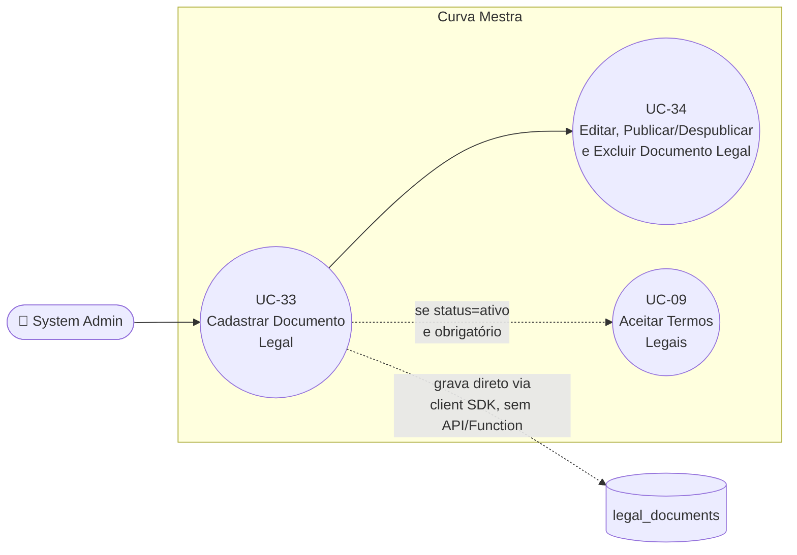

# UC-33: Cadastrar Documento Legal

**Projeto:** Curva Mestra
**Data de Criação:** 15/07/2026
**Autor:** Guilherme Scandelari (via uml-use-case-writer)
**Status:** Aprovado
**Módulo/Contexto:** Administração do Sistema (Documentos Legais)
**Versão:** 1.0

> Um System Admin cadastra um novo documento legal (título, versão, conteúdo em Markdown, status e flags de obrigatoriedade) diretamente em `/admin/legal-documents/new`. **Mesmo padrão arquitetural já confirmado no catálogo de produtos master (UC-31)**: não existe nenhuma rota `/api/*` nem Cloud Function intermediando esta operação — o formulário grava diretamente no Firestore via client SDK (`addDoc`), e a única barreira de autorização real é a regra de segurança do Firestore (`allow write: if isSystemAdmin()`), sem qualquer revalidação de formato de dados no backend. Um documento criado com `status: "ativo"` e algum switch de obrigatoriedade ligado passa a valer imediatamente como pendente de aceite para os usuários elegíveis (UC-09), sem nenhuma etapa de revisão ou aprovação adicional.

---

## 1. Diagrama UML (Mermaid)

---

## 2. Atores

### 2.1 Ator Primário
**System Admin** — tela restrita por `ProtectedRoute allowedRoles: ['system_admin']` (`src/app/(admin)/layout.tsx`).

### 2.2 Atores Secundários / Sistemas Externos
Nenhum sistema externo envolvido. Não há Firebase Auth adicional, e-mail, nem API route — a única "camada" de proteção é a regra de segurança do Firestore, avaliada no momento da escrita.

---

## 3. Pré-condições
- System Admin autenticado, com custom claim `is_system_admin === true` e `active === true` (exigido por `isSystemAdmin()` nas regras do Firestore).
- Não há nenhuma verificação de unicidade de `slug`, `title` ou `order` antes de criar (ver RN-01, RN-02).

---

## 4. Pós-condições

### 4.1 Sucesso
- Um documento é criado em `legal_documents` com: `title`, `slug` (auto-gerado a partir do título, ou customizado manualmente), `content` (Markdown), `version` (texto livre, ex: "1.0"), `status` (`rascunho` | `ativo` | `inativo`, padrão `rascunho`), `required_for_registration`/`required_for_existing_users` (booleanos, padrão `false` ambos), `order` (número, padrão `1`), `created_by` (uid do admin), `created_at`/`updated_at` (`serverTimestamp()`), `published_at` (`serverTimestamp()` se `status === 'ativo'` no momento da criação, senão `null`).
- System Admin é redirecionado para `/admin/legal-documents` (listagem).

### 4.2 Falha (Garantias Mínimas)
- Se qualquer validação de client falhar (título, conteúdo ou versão vazios): nenhum documento é criado; erro exibido via toast.
- Não há nenhuma escrita parcial possível — é uma única operação `addDoc`.

---

## 5. Gatilho (Trigger)
System Admin acessa `/admin/legal-documents` e clica em "Novo Documento" (ou em "Criar Primeiro Documento", variante exibida quando a listagem está vazia) — ambos navegam para `/admin/legal-documents/new`.

---

## 6. Fluxo Principal (Basic Flow)

1. System Admin acessa `/admin/legal-documents` e clica em "Novo Documento" (ou "Criar Primeiro Documento").
2. Sistema renderiza `LegalDocumentForm` em modo `create`, com valores padrão (`EMPTY_FORM`): título vazio, slug vazio, conteúdo vazio, versão `"1.0"`, status `"rascunho"`, `required_for_registration`/`required_for_existing_users` desligados, ordem `1`.
3. System Admin preenche "Título" — a cada alteração, o sistema recalcula automaticamente o campo "Slug" via `generateSlug(title)` (minúsculas, remoção de acentos via normalização NFD, substituição de caracteres não alfanuméricos por hífen, remoção de hífens nas pontas).
4. System Admin pode editar manualmente o campo "Slug" depois de gerado automaticamente (input livre, sem revalidação de formato).
5. System Admin preenche "Versão" (texto livre; pré-preenchido com `"1.0"`).
6. System Admin seleciona "Status" (Rascunho / Ativo / Inativo; pré-selecionado "Rascunho").
7. System Admin preenche "Ordem de Exibição" (número, mínimo 1; pré-preenchido com `1`).
8. System Admin preenche "Conteúdo" (textarea de 15 linhas, fonte monoespaçada, texto livre em Markdown).
9. System Admin opcionalmente ativa os switches "Obrigatório no cadastro" (`required_for_registration`) e/ou "Obrigatório para usuários existentes" (`required_for_existing_users`) — ambos desligados por padrão, ativáveis de forma independente.
10. System Admin clica em "Salvar Documento".
11. Sistema valida no client: usuário autenticado (`auth.currentUser`); título não vazio (trim); conteúdo não vazio (trim); versão não vazia (trim) — sem nenhuma validação de formato de versão, nem de duplicidade de slug ou de ordem.
12. Sistema executa `addDoc(collection(db, 'legal_documents'), { ...formData, slug: formData.slug || generateSlug(title), created_by: auth.currentUser.uid, created_at: serverTimestamp(), updated_at: serverTimestamp(), published_at: status === 'ativo' ? serverTimestamp() : null })`.
13. Sistema exibe toast "Sucesso" / "Documento criado com sucesso" e redireciona para `/admin/legal-documents`.
14. Caso de uso é concluído com sucesso.

---

## 7. Fluxos Alternativos

### 7a. Criar documento já como "Ativo" e "Obrigatório" (a partir do passo 6)
1. System Admin seleciona status "Ativo" e ativa um ou ambos os switches de obrigatoriedade já durante a criação.
2. Ao salvar, o documento entra imediatamente no critério de pendência avaliado por `usePendingTerms`/`TermsInterceptor` (UC-09) — não existe nenhuma etapa de revisão, aprovação ou "rascunho intermediário" obrigatória antes da publicação.
3. Todos os usuários elegíveis (existentes e/ou em onboarding, conforme os switches ligados) passam a ver o documento como pendente de aceite já na próxima navegação autenticada.

---

## 8. Fluxos de Exceção

### 8a. Usuário não autenticado
1. `auth.currentUser` ausente no momento de salvar (cenário defensivo — a tela já é protegida por `ProtectedRoute`, mas a checagem existe no client independentemente disso).
2. Sistema exibe toast "Erro" / "Você precisa estar autenticado"; nenhuma chamada ao Firestore é feita.

### 8b. Título vazio
1. Campo "Título" vazio ou só espaços.
2. Sistema exibe toast "Erro de validação" / "O título é obrigatório"; nenhuma chamada ao Firestore é feita.

### 8c. Conteúdo vazio
1. Campo "Conteúdo" vazio ou só espaços.
2. Sistema exibe toast "Erro de validação" / "O conteúdo é obrigatório"; nenhuma chamada ao Firestore é feita.

### 8d. Versão vazia
1. Campo "Versão" vazio ou só espaços.
2. Sistema exibe toast "Erro de validação" / "A versão é obrigatória"; nenhuma chamada ao Firestore é feita.

### 8e. Falha genérica do Firestore
1. `addDoc` falha (rede, permissão negada por token expirado, etc.).
2. Sistema exibe toast "Erro ao salvar" com a mensagem crua do erro (`error.message`); nenhum documento é criado.

---

## 9. Regras de Negócio Relacionadas

| ID | Regra | Justificativa |
|----|-------|----------------|
| RN-01 | Não há verificação de duplicidade de `slug` — dois documentos podem ser criados com slugs idênticos (inclusive gerados automaticamente do mesmo título). Como `slug` não é usado como chave por nenhuma rota ou consulta pública hoje (confirmado por busca — não existe rota por slug), o impacto atual é limitado à exibição ("Versão X • slug") na listagem e na tela de visualização. | Confirmado por leitura completa de `LegalDocumentForm.handleSave` — nenhuma checagem de slug existente antes do `addDoc`/`updateDoc`. |
| RN-02 | Não há verificação de duplicidade do campo "Ordem de Exibição" (`order`) — múltiplos documentos podem compartilhar o mesmo valor. As queries que dependem da ordem (listagem em `/admin/legal-documents`, e as telas de aceite consumidas em UC-09) usam `orderBy('order', 'asc')` sem nenhum critério de desempate definido, deixando a ordem relativa entre documentos com `order` igual sujeita ao comportamento não especificado do Firestore. | Confirmado por leitura de `loadDocuments` (`orderBy('order', 'asc')`) e ausência de validação de unicidade no formulário. |
| RN-03 | Toda a validação de formato (título, conteúdo, versão não vazios) ocorre exclusivamente no client (`LegalDocumentForm.handleSave`). Não existe rota `/api/legal-documents/*` nem Cloud Function revalidando esses dados — a única barreira real é a regra de segurança do Firestore (`allow write: if isSystemAdmin()`), que autoriza **quem** grava, mas nada sobre **o formato** do que é gravado. Mesmo padrão arquitetural já confirmado em UC-31 (RN-02) para o catálogo de produtos master. | Confirmado pela ausência de qualquer rota em `src/app/api/legal-documents/` (não existe) e por leitura completa de `LegalDocumentForm.tsx`, que roda no browser e grava direto no Firestore via client SDK. |
| RN-04 | **[Achado de segurança]** A regra do Firestore permite leitura de `legal_documents` a **qualquer usuário autenticado**, de qualquer role e tenant, **sem filtrar por `status`** (`allow read: if isAuthenticated()`). Um documento criado com `status: "rascunho"` (ainda não publicado) é tecnicamente legível por qualquer usuário autenticado do sistema que consulte a coleção diretamente — a proteção de "rascunho não é visível" existe apenas nas *queries* das telas de aceite (UC-09), que filtram explicitamente por `status == "ativo"`, e não na regra de segurança do Firestore em si. | Confirmado em `firestore.rules` (`match /legal_documents/{documentId}`, `allow read: if isAuthenticated()`, sem filtro por `status`). |
| RN-05 | Ao selecionar status "Ativo" já na criação, `published_at` é gravado com `serverTimestamp()` no mesmo instante do `addDoc` — não existe um fluxo de "publicação" distinto de "salvar com status ativo"; publicar é, na prática, apenas escolher o valor "Ativo" no campo Status durante o cadastro (ou, posteriormente, durante a edição — ver UC-34). | Confirmado por leitura de `handleSave`, modo `create`: `published_at: formData.status === 'ativo' ? serverTimestamp() : null`. |

---

## 10. Requisitos Especiais / Não Funcionais

| ID | Descrição | Categoria |
|----|-----------|-----------|
| RNF-01 | Ausência de validação server-side de formato de dados (RN-03) é uma lacuna de robustez consistente com o restante do módulo Admin sem API routes dedicadas (mesmo achado do UC-31/UC-32 para o catálogo de produtos). | Confiabilidade |
| RNF-02 | Leitura irrestrita de documentos em qualquer status, inclusive "rascunho" (RN-04), é uma exposição potencial de confidencialidade — o conteúdo de um documento legal ainda não publicado (ex.: mudança de termos comerciais em preparação) pode ser lido por qualquer usuário autenticado do sistema, de qualquer clínica ou role, via consulta direta ao Firestore. | Segurança / Confidencialidade |

---

## 11. Frequência de Uso
Ocasional — criação de documentos legais ocorre apenas quando a operação/jurídico decide publicar um novo termo, política ou aviso.

---

## 12. Casos de Uso Relacionados
- **UC-09 (Aceitar Termos Legais)** — consome documentos criados aqui com `status: "ativo"` e `required_for_registration`/`required_for_existing_users: true`.
- **UC-34 (Editar, Publicar/Despublicar e Excluir Documento Legal)** — ciclo de vida completo do documento criado por este UC.

---

## 13. Referências
- `src/app/(admin)/admin/legal-documents/new/page.tsx`
- `src/app/(admin)/admin/legal-documents/page.tsx` (ponto de entrada "Novo Documento" / "Criar Primeiro Documento")
- `src/components/admin/LegalDocumentForm.tsx` (`generateSlug`, `EMPTY_FORM`, `handleSave` — modo `create`)
- `src/types/index.ts` (`LegalDocument`, `DocumentStatus`)
- `src/app/(admin)/layout.tsx` (`ProtectedRoute allowedRoles`)
- `firestore.rules` (`match /legal_documents/{documentId}`)

---

## 14. Perguntas em Aberto / Decisões Pendentes

1. **[RN-01, RN-02]** Falta de unicidade de `slug` e de `order` — decisão de produto pendente sobre se vale a pena introduzir validação, dado que `slug` não é usado como chave hoje e `order` só afeta a ordem de exibição.
2. **[RN-04]** Leitura irrestrita de documentos em qualquer status (incluindo "rascunho") por qualquer usuário autenticado — decisão de produto/segurança pendente sobre se a regra do Firestore deveria restringir a leitura de documentos não-ativos a `system_admin`.
3. **[RN-03]** Mesma decisão já registrada em UC-31 sobre introduzir validação server-side (rota `/api/legal-documents/*` com Admin SDK) para este módulo.

---

## 15. Histórico de Versões

| Versão | Data | Autor | O que mudou |
|--------|------|-------|--------------|
| 1.0 | 15/07/2026 | Guilherme Scandelari | Versão inicial, investigada do zero a partir de `LegalDocumentForm.tsx` (modo `create`), `admin/legal-documents/page.tsx`, `admin/legal-documents/new/page.tsx` e `firestore.rules`. Confirmado que não há rota `/api/legal-documents/*` nem Cloud Function — toda a operação é client SDK direto, com validação de formato exclusivamente no client (RN-03), mesmo padrão do UC-31. Confirmado achado de segurança: leitura de `legal_documents` liberada a qualquer usuário autenticado, sem filtro de `status` (RN-04) — rascunhos são tecnicamente legíveis por qualquer usuário do sistema. Primeiro UC do módulo "Admin — Documentos Legais". |
