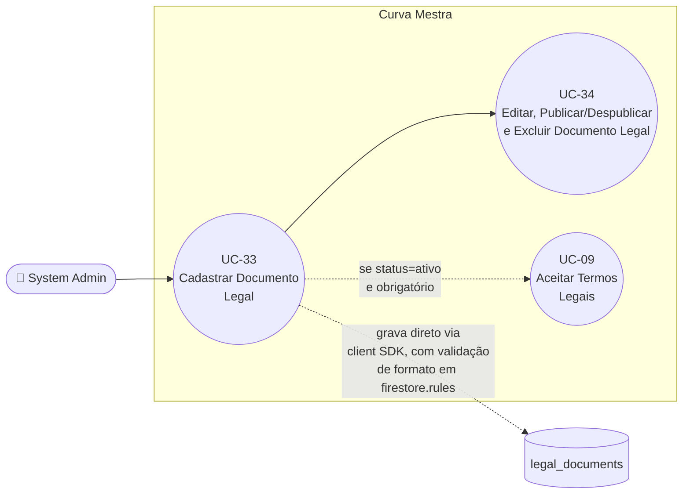

# UC-33: Cadastrar Documento Legal

**Projeto:** Curva Mestra
**Data de Criação:** 15/07/2026
**Autor:** Guilherme Scandelari (via uml-use-case-writer)
**Status:** Aprovado
**Módulo/Contexto:** Administração do Sistema (Documentos Legais)
**Versão:** 1.0.1

> Um System Admin cadastra um novo documento legal (título, versão, conteúdo em Markdown, status e flags de obrigatoriedade) diretamente em `/admin/legal-documents/new`. **Mesmo padrão arquitetural já confirmado no catálogo de produtos master (UC-31)**: não existe nenhuma rota `/api/*` nem Cloud Function intermediando esta operação — o formulário grava diretamente no Firestore via client SDK (`addDoc`), e a única barreira de autorização real é a regra de segurança do Firestore (`allow write: if isSystemAdmin()`, hoje dividida em `create`/`update`/`delete`/`read`). **[CORRIGIDO no commit `7c3cbb2` — RN-03]** A regra de `legal_documents` passou a validar também o **formato** dos dados no servidor — `slug` deve casar com o padrão kebab-case `^[a-z0-9]+(-[a-z0-9]+)*$`, `title`/`version` devem ser strings não vazias, e `status` deve estar em `['ativo', 'inativo', 'rascunho']`. Um documento criado com `status: "ativo"` e algum switch de obrigatoriedade ligado passa a valer imediatamente como pendente de aceite para os usuários elegíveis (UC-09), sem nenhuma etapa de revisão ou aprovação adicional.

---

## 1. Diagrama UML (Mermaid)

```mermaid
flowchart LR
    SystemAdmin([👤 System Admin])

    subgraph Sistema["Curva Mestra"]
        UC33(("UC-33\nCadastrar Documento\nLegal"))
        UC34(("UC-34\nEditar, Publicar/Despublicar\ne Excluir Documento Legal"))
        UC09(("UC-09\nAceitar Termos\nLegais"))
    end

    SystemAdmin --> UC33
    UC33 --> UC34
    UC33 -.->|se status=ativo\ne obrigatório| UC09
    UC33 -.->|grava direto via\nclient SDK, com validação\nde formato em firestore.rules| LegalDocs[(legal_documents)]
```

---

## 2. Atores

### 2.1 Ator Primário
**System Admin** — tela restrita por `ProtectedRoute allowedRoles: ['system_admin']` (`src/app/(admin)/layout.tsx`).

### 2.2 Atores Secundários / Sistemas Externos
Nenhum sistema externo envolvido. Não há Firebase Auth adicional, e-mail, nem API route — a única "camada" de proteção é a regra de segurança do Firestore, avaliada no momento da escrita (que, desde o commit `7c3cbb2`, também valida formato — ver RN-03).

---

## 3. Pré-condições
- System Admin autenticado, com custom claim `is_system_admin === true` e `active === true` (exigido por `isSystemAdmin()` nas regras do Firestore).
- Não há nenhuma verificação de unicidade de `slug`, `title` ou `order` antes de criar (ver RN-01, RN-02).

---

## 4. Pós-condições

### 4.1 Sucesso
- Um documento é criado em `legal_documents` com: `title`, `slug` (auto-gerado a partir do título, ou customizado manualmente e — desde o commit `7c3cbb2` — sempre normalizado via `generateSlug` antes de gravar, ver RN-03), `content` (Markdown), `version` (texto livre, ex: "1.0"), `status` (`rascunho` | `ativo` | `inativo`, padrão `rascunho`), `required_for_registration`/`required_for_existing_users` (booleanos, padrão `false` ambos), `order` (número, padrão `1`), `created_by` (uid do admin), `created_at`/`updated_at` (`serverTimestamp()`), `published_at` (`serverTimestamp()` se `status === 'ativo'` no momento da criação, senão `null`).
- System Admin é redirecionado para `/admin/legal-documents` (listagem).

### 4.2 Falha (Garantias Mínimas)
- Se qualquer validação de client falhar (título, conteúdo ou versão vazios): nenhum documento é criado; erro exibido via toast.
- **[CORRIGIDO no commit `7c3cbb2` — RN-03]** Se, apesar da validação de client, o payload enviado ao Firestore não satisfizer a validação de formato da regra de segurança (`slug` fora do padrão kebab-case, `title`/`version` vazios, ou `status` fora do enum permitido) — cenário só alcançável contornando a UI, já que o client agora sempre normaliza o slug — a escrita é rejeitada pelo próprio Firestore (`PERMISSION_DENIED`); nenhum documento é criado.
- Não há nenhuma escrita parcial possível — é uma única operação `addDoc`.

---

## 5. Gatilho (Trigger)
System Admin acessa `/admin/legal-documents` e clica em "Novo Documento" (ou em "Criar Primeiro Documento", variante exibida quando a listagem está vazia) — ambos navegam para `/admin/legal-documents/new`.

---

## 6. Fluxo Principal (Basic Flow)

1. System Admin acessa `/admin/legal-documents` e clica em "Novo Documento" (ou "Criar Primeiro Documento").
2. Sistema renderiza `LegalDocumentForm` em modo `create`, com valores padrão (`EMPTY_FORM`): título vazio, slug vazio, conteúdo vazio, versão `"1.0"`, status `"rascunho"`, `required_for_registration`/`required_for_existing_users` desligados, ordem `1`.
3. System Admin preenche "Título" — a cada alteração, o sistema recalcula automaticamente o campo "Slug" via `generateSlug(title)` (minúsculas, remoção de acentos via normalização NFD, substituição de caracteres não alfanuméricos por hífen, remoção de hífens nas pontas).
4. System Admin pode editar manualmente o campo "Slug" depois de gerado automaticamente (input livre no client, mas — desde o commit `7c3cbb2` — o valor digitado é sempre renormalizado via `generateSlug` no momento de salvar, ver passo 12 e RN-03).
5. System Admin preenche "Versão" (texto livre; pré-preenchido com `"1.0"`).
6. System Admin seleciona "Status" (Rascunho / Ativo / Inativo; pré-selecionado "Rascunho").
7. System Admin preenche "Ordem de Exibição" (número, mínimo 1; pré-preenchido com `1`).
8. System Admin preenche "Conteúdo" (textarea de 15 linhas, fonte monoespaçada, texto livre em Markdown).
9. System Admin opcionalmente ativa os switches "Obrigatório no cadastro" (`required_for_registration`) e/ou "Obrigatório para usuários existentes" (`required_for_existing_users`) — ambos desligados por padrão, ativáveis de forma independente.
10. System Admin clica em "Salvar Documento".
11. Sistema valida no client: usuário autenticado (`auth.currentUser`); título não vazio (trim); conteúdo não vazio (trim); versão não vazia (trim) — sem nenhuma validação de duplicidade de slug ou de ordem (RN-01, RN-02).
12. **[CORRIGIDO no commit `7c3cbb2` — RN-03]** Sistema calcula `slugNormalizado = generateSlug(formData.slug || formData.title!)` — diferente do comportamento anterior (`formData.slug || generateSlug(title)`), o valor do campo "Slug" passa sempre por `generateSlug()`, mesmo quando foi digitado manualmente pelo admin, garantindo que o resultado sempre satisfaça o padrão kebab-case exigido pela regra do Firestore.
13. Sistema executa `addDoc(collection(db, 'legal_documents'), { ...formData, slug: slugNormalizado, created_by: auth.currentUser!.uid, created_at: serverTimestamp(), updated_at: serverTimestamp(), published_at: status === 'ativo' ? serverTimestamp() : null })`.
14. **[CORRIGIDO no commit `7c3cbb2` — RN-03]** A regra de segurança de `legal_documents` (`allow create`) revalida no servidor que `slug` casa com `^[a-z0-9]+(-[a-z0-9]+)*$`, que `title`/`version` são strings não vazias, e que `status` está em `['ativo', 'inativo', 'rascunho']` — transparente no caminho feliz, já que o client normaliza esses campos antes de enviar (passo 12).
15. Sistema exibe toast "Sucesso" / "Documento criado com sucesso" e redireciona para `/admin/legal-documents`.
16. Caso de uso é concluído com sucesso.

---

## 7. Fluxos Alternativos

### 7a. Criar documento já como "Ativo" e "Obrigatório" (a partir do passo 6)
1. System Admin seleciona status "Ativo" e ativa um ou ambos os switches de obrigatoriedade já durante a criação.
2. Ao salvar, o documento entra imediatamente no critério de pendência avaliado por `usePendingTerms`/`TermsInterceptor` (UC-09) — não existe nenhuma etapa de revisão, aprovação ou "rascunho intermediário" obrigatória antes da publicação.
3. Todos os usuários elegíveis (existentes e/ou em onboarding, conforme os switches ligados) passam a ver o documento como pendente de aceite já na próxima navegação autenticada.

---

## 8. Fluxos de Exceção

### 8a. Usuário não autenticado
1. `auth.currentUser` ausente no momento de salvar (cenário defensivo — a tela já é protegida por `ProtectedRoute`, mas a checagem existe no client independentemente disso).
2. Sistema exibe toast "Erro" / "Você precisa estar autenticado"; nenhuma chamada ao Firestore é feita.

### 8b. Título vazio
1. Campo "Título" vazio ou só espaços.
2. Sistema exibe toast "Erro de validação" / "O título é obrigatório"; nenhuma chamada ao Firestore é feita.

### 8c. Conteúdo vazio
1. Campo "Conteúdo" vazio ou só espaços.
2. Sistema exibe toast "Erro de validação" / "O conteúdo é obrigatório"; nenhuma chamada ao Firestore é feita.

### 8d. Versão vazia
1. Campo "Versão" vazio ou só espaços.
2. Sistema exibe toast "Erro de validação" / "A versão é obrigatória"; nenhuma chamada ao Firestore é feita.

### 8e. Falha genérica do Firestore
1. `addDoc` falha (rede, permissão negada por token expirado, formato rejeitado pela regra de segurança desde `7c3cbb2` — RN-03 —, etc.).
2. Sistema exibe toast "Erro ao salvar" com a mensagem crua do erro (`error.message`); nenhum documento é criado.

---

## 9. Regras de Negócio Relacionadas

| ID | Regra | Justificativa |
|----|-------|----------------|
| RN-01 | Não há verificação de duplicidade de `slug` — dois documentos podem ser criados com slugs idênticos (inclusive gerados automaticamente do mesmo título). Como `slug` não é usado como chave por nenhuma rota ou consulta pública hoje (confirmado por busca — não existe rota por slug), o impacto atual é limitado à exibição ("Versão X • slug") na listagem e na tela de visualização. **A correção do RN-03 (commit `7c3cbb2`) não introduziu nenhuma checagem de unicidade** — apenas passou a normalizar/validar o *formato* do slug; dois documentos ainda podem ter o mesmo slug normalizado. | Confirmado por leitura completa de `LegalDocumentForm.handleSave`/`performSave` — nenhuma checagem de slug existente antes do `addDoc`/`updateDoc`, nem na regra do Firestore corrigida em `7c3cbb2`. |
| RN-02 | Não há verificação de duplicidade do campo "Ordem de Exibição" (`order`) — múltiplos documentos podem compartilhar o mesmo valor. As queries que dependem da ordem (listagem em `/admin/legal-documents`, e as telas de aceite consumidas em UC-09) usam `orderBy('order', 'asc')` sem nenhum critério de desempate definido, deixando a ordem relativa entre documentos com `order` igual sujeita ao comportamento não especificado do Firestore. | Confirmado por leitura de `loadDocuments` (`orderBy('order', 'asc')`) e ausência de validação de unicidade no formulário. |
| RN-03 | **[CORRIGIDO no commit `7c3cbb2`]** Antes: toda a validação de formato (título, conteúdo, versão não vazios) ocorria exclusivamente no client (`LegalDocumentForm.handleSave`) — pior ainda que o achado equivalente em UC-31 (RN-02), pois nem o client validava tudo (faltava qualquer validação de formato do campo `slug`, que podia ser digitado manualmente com caracteres inválidos). Não existia rota `/api/legal-documents/*` nem Cloud Function revalidando esses dados — a única barreira real era `allow write: if isSystemAdmin()`, que autorizava **quem** gravava, mas nada sobre **o formato** do que era gravado. Agora, dois pontos corrigidos: (1) em `firestore.rules`, a regra de `legal_documents` foi dividida em `allow create`/`allow update` (mesmo padrão do UC-31, RN-02), validando `request.resource.data.slug.matches('^[a-z0-9]+(-[a-z0-9]+)*$')`, `title`/`version` como string não vazia, e `status in ['ativo', 'inativo', 'rascunho']` — em `update`, cada validação só é exigida se o campo correspondente estiver de fato presente no payload; (2) em `LegalDocumentForm.tsx`, a função `handleSave` foi dividida em `handleSave` (validações + checagem de impacto, ver UC-34 RN-05) e `performSave` (gravação real), e o slug deixou de usar `formData.slug || generateSlug(formData.title!)` direto — agora sempre passa por `generateSlug()` (`const slugNormalizado = generateSlug(formData.slug || formData.title!)`), normalizando qualquer valor digitado manualmente no campo de slug para o formato kebab-case válido, mesmo que o usuário tenha digitado caracteres inválidos (espaços, acentos, maiúsculas, símbolos). | Confirmado por leitura do diff do commit `7c3cbb2` em `firestore.rules` (`match /legal_documents/{documentId}`, novas regras `allow create`/`allow update`) e em `LegalDocumentForm.tsx` (nova constante `slugNormalizado`, função `performSave` extraída de `handleSave`). |
| RN-04 | **[CORRIGIDO nos commits `7c3cbb2` e `ea5d265`]** Antes: a regra do Firestore permitia leitura de `legal_documents` a **qualquer usuário autenticado**, de qualquer role e tenant, **sem filtrar por `status`** (`allow read: if isAuthenticated()`) — um documento criado com `status: "rascunho"` era tecnicamente legível por qualquer usuário autenticado que consultasse a coleção diretamente, apesar do comentário no arquivo dizer "documentos ativos". **Primeira correção (commit `7c3cbb2`):** a regra passou a ser `allow read: if isSystemAdmin() || (isAuthenticated() && resource.data.status == 'ativo')` — restringindo a leitura de não-admins a documentos com `status === 'ativo'`. **Regressão introduzida por essa primeira correção, detectada e corrigida no commit seguinte (`ea5d265`):** restringir a leitura a `status == 'ativo'` quebrava um caso legítimo — `src/app/(clinic)/clinic/profile/page.tsx` busca o título de documentos legais já aceitos pelo usuário no passado (via `getDoc` direto por `document_id`), mesmo que o documento tenha sido desativado depois (substituído por uma versão mais nova, `status: 'inativo'`); com a regra restrita a `'ativo'`, essa consulta passava a falhar por `PERMISSION_DENIED` para qualquer documento já desativado. **Regra final (commit `ea5d265`):** `allow read: if isSystemAdmin() || (isAuthenticated() && resource.data.status != 'rascunho')` — o critério deixou de ser "permitir só `ativo`" e passou a ser "bloquear só `rascunho`" (o caso realmente sensível: conteúdo ainda não publicado/revisado). Com isso, `ativo` e `inativo` são ambos legíveis por qualquer usuário autenticado — preservando o histórico de aceites no perfil do usuário — e apenas `rascunho` permanece restrito a `system_admin`. | Confirmado por leitura dos dois diffs em sequência: commit `7c3cbb2` (`resource.data.status == 'ativo'`) e commit `ea5d265` (`resource.data.status != 'rascunho'`, com comentário explícito no `firestore.rules` sobre a dependência de `clinic/profile/page.tsx`). |
| RN-05 | Ao selecionar status "Ativo" já na criação, `published_at` é gravado com `serverTimestamp()` no mesmo instante do `addDoc` — não existe um fluxo de "publicação" distinto de "salvar com status ativo"; publicar é, na prática, apenas escolher o valor "Ativo" no campo Status durante o cadastro (ou, posteriormente, durante a edição — ver UC-34). | Confirmado por leitura de `handleSave`/`performSave`, modo `create`: `published_at: formData.status === 'ativo' ? serverTimestamp() : null`. |

---

## 10. Requisitos Especiais / Não Funcionais

| ID | Descrição | Categoria |
|----|-----------|-----------|
| RNF-01 | **[Mitigado no commit `7c3cbb2`]** Ausência de validação server-side de formato de dados (RN-03) foi parcialmente corrigida — `slug`, `title`, `version` e `status` agora são validados diretamente em `firestore.rules`. `content`, `order` e as flags de obrigatoriedade continuam sem validação server-side de formato, mantendo uma lacuna residual em relação ao restante do módulo Admin sem API routes dedicadas (mesmo achado do UC-31/UC-32 para o catálogo de produtos). | Confiabilidade |
| RNF-02 | **[Resolvido nos commits `7c3cbb2` e `ea5d265`]** Leitura irrestrita de documentos em qualquer status, inclusive "rascunho" (RN-04), era uma exposição potencial de confidencialidade — o conteúdo de um documento legal ainda não publicado podia ser lido por qualquer usuário autenticado do sistema, de qualquer clínica ou role, via consulta direta ao Firestore. Corrigido: apenas `system_admin` pode ler documentos com `status: 'rascunho'`; `ativo` e `inativo` permanecem legíveis por qualquer usuário autenticado (necessário para o histórico de aceites em `clinic/profile`). | Segurança / Confidencialidade |

---

## 11. Frequência de Uso
Ocasional — criação de documentos legais ocorre apenas quando a operação/jurídico decide publicar um novo termo, política ou aviso.

---

## 12. Casos de Uso Relacionados
- **UC-09 (Aceitar Termos Legais)** — consome documentos criados aqui com `status: "ativo"` e `required_for_registration`/`required_for_existing_users: true`.
- **UC-34 (Editar, Publicar/Despublicar e Excluir Documento Legal)** — ciclo de vida completo do documento criado por este UC.

---

## 13. Referências
- `src/app/(admin)/admin/legal-documents/new/page.tsx`
- `src/app/(admin)/admin/legal-documents/page.tsx` (ponto de entrada "Novo Documento" / "Criar Primeiro Documento")
- `src/components/admin/LegalDocumentForm.tsx` (`generateSlug`, `EMPTY_FORM`, `handleSave`/`performSave` — modo `create`; slug sempre normalizado via `generateSlug`, RN-03)
- `src/types/index.ts` (`LegalDocument`, `DocumentStatus`)
- `src/app/(admin)/layout.tsx` (`ProtectedRoute allowedRoles`)
- `src/app/(clinic)/clinic/profile/page.tsx` (consumidor que motivou a correção do commit `ea5d265` — busca título de documentos já aceitos, mesmo `inativo`)
- `firestore.rules` (`match /legal_documents/{documentId}` — `allow read`/`create`/`update`, RN-03/RN-04)
- Commit da correção: `7c3cbb2` (`fix: seis itens de media severidade (UC-31, UC-32, UC-33, UC-34)`) — validação de formato server-side (`slug`, `title`, `version`, `status`) em `firestore.rules` (RN-03); normalização do slug no client via `generateSlug` (RN-03); primeira versão da correção de leitura restrita a `status == 'ativo'` (RN-04)
- Commit da correção: `ea5d265` (`fix: nao bloquear leitura de legal_documents inativos por usuarios comuns`) — ajuste da regra de leitura de `status == 'ativo'` para `status != 'rascunho'`, corrigindo a regressão que a primeira correção do RN-04 havia introduzido em `clinic/profile/page.tsx`

---

## 14. Perguntas em Aberto / Decisões Pendentes

1. **[RN-01, RN-02]** Falta de unicidade de `slug` e de `order` — decisão de produto pendente sobre se vale a pena introduzir validação, dado que `slug` não é usado como chave hoje e `order` só afeta a ordem de exibição. **Nota:** a correção do RN-03 (commit `7c3cbb2`) validou apenas o *formato* do slug, não sua unicidade — este item continua em aberto sem alteração.
2. ~~**[RN-04]** Leitura irrestrita de documentos em qualquer status (incluindo "rascunho") por qualquer usuário autenticado — decisão de produto/segurança pendente sobre se a regra do Firestore deveria restringir a leitura de documentos não-ativos a `system_admin`.~~ **[RESOLVIDO nos commits `7c3cbb2` e `ea5d265` — UC-33-RN-04]** Decisão de produto adotada, em duas etapas: a regra do Firestore passou a restringir a leitura de `system_admin` apenas para documentos em `status: 'rascunho'` — `ativo` e `inativo` continuam legíveis por qualquer usuário autenticado, preservando o consumo de `clinic/profile/page.tsx` (histórico de aceites de documentos já desativados).
3. ~~**[RN-03]** Mesma decisão já registrada em UC-31 sobre introduzir validação server-side (rota `/api/legal-documents/*` com Admin SDK) para este módulo.~~ **[RESOLVIDO PARCIALMENTE no commit `7c3cbb2` — UC-33-RN-03]** A regra do Firestore (`legal_documents`) agora valida `slug`, `title`, `version` e `status` diretamente no servidor, em `create` e `update`. Decisão residual pendente: `content` e `order` continuam sem validação server-side, e ainda não existe rota `/api/legal-documents/*` dedicada.

---

## 15. Histórico de Versões

| Versão | Data | Autor | O que mudou |
|--------|------|-------|--------------|
| 1.0 | 15/07/2026 | Guilherme Scandelari | Versão inicial, investigada do zero a partir de `LegalDocumentForm.tsx` (modo `create`), `admin/legal-documents/page.tsx`, `admin/legal-documents/new/page.tsx` e `firestore.rules`. Confirmado que não há rota `/api/legal-documents/*` nem Cloud Function — toda a operação é client SDK direto, com validação de formato exclusivamente no client (RN-03), mesmo padrão do UC-31. Confirmado achado de segurança: leitura de `legal_documents` liberada a qualquer usuário autenticado, sem filtro de `status` (RN-04) — rascunhos são tecnicamente legíveis por qualquer usuário do sistema. Primeiro UC do módulo "Admin — Documentos Legais". |
| 1.0.1 | 26/07/2026 | Guilherme Scandelari (via uml-use-case-writer) | Duas correções pontuais no mesmo commit inicial (`7c3cbb2`), com um ajuste subsequente (`ea5d265`) em uma delas: (1) UC-33-RN-03 — `firestore.rules` (`legal_documents`) passou a validar `slug` (kebab-case), `title`/`version` (string não vazia) e `status` (enum) em `create`/`update`; `LegalDocumentForm.tsx` passou a normalizar sempre o slug via `generateSlug()` antes de gravar (nova constante `slugNormalizado`, `handleSave` dividido em `handleSave`+`performSave`). (2) UC-33-RN-04 — corrigido em duas etapas: a regra de leitura foi primeiro alterada para `resource.data.status == 'ativo'` (commit `7c3cbb2`), o que causou uma regressão em `clinic/profile/page.tsx` (busca de título de documentos já aceitos, mesmo que desativados depois); corrigido no commit seguinte (`ea5d265`) trocando o critério para `resource.data.status != 'rascunho'` — bloqueando apenas rascunhos (o caso realmente sensível) e mantendo `ativo`/`inativo` legíveis por qualquer usuário autenticado. Atualizados resumo do cabeçalho, diagrama (Seção 1), Pós-condições 4.1/4.2, Fluxo Principal (passos 4, 11-14), Fluxo de Exceção 8e, RN-03/RN-04 (marcados `[CORRIGIDO]`, com a nuance de duas etapas documentada em RN-04), RN-01 (nota sobre o que a correção não cobriu), RNF-01/RNF-02, Referências (Seção 13, com os dois commits) e itens 2 e 3 da Seção 14 (marcados `[RESOLVIDO]`/`[RESOLVIDO PARCIALMENTE]`). |
