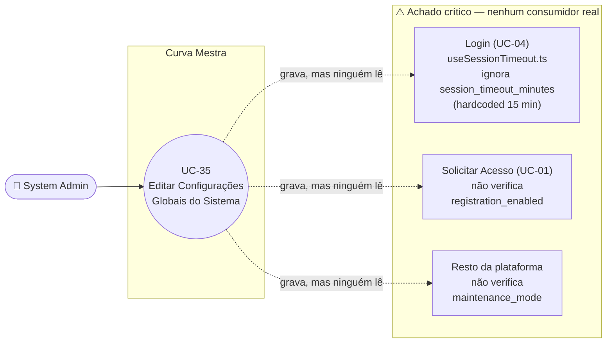

# UC-35: Editar Configurações Globais do Sistema

**Projeto:** Curva Mestra
**Data de Criação:** 15/07/2026
**Autor:** Guilherme Scandelari (via uml-use-case-writer)
**Status:** Aprovado
**Módulo/Contexto:** Administração do Sistema (Configurações Globais)
**Versão:** 1.0

> Um System Admin visualiza e edita três parâmetros globais da plataforma — tempo de expiração de sessão, modo de manutenção e permissão de novos registros — em um único formulário (`/admin/settings`), persistidos em um documento singleton `system_settings/global`. **Achado crítico confirmado por busca exaustiva em todo o código-fonte:** nenhum dos três parâmetros é efetivamente lido/aplicado em nenhum outro ponto do sistema. `maintenance_mode`, `maintenance_message` e `registration_enabled` não são consumidos por nenhuma tela, componente, rota de API ou regra do Firestore além desta própria página; e `session_timeout_minutes` é salvo aqui, mas o mecanismo real de timeout de sessão (`useSessionTimeout.ts`) usa um valor **fixo e hardcoded** de 15 minutos, ignorando totalmente o que está configurado neste formulário. Esta tela, hoje, não tem nenhum efeito observável sobre o comportamento do restante da plataforma.

---

## 1. Diagrama UML (Mermaid)

---

## 2. Atores

### 2.1 Ator Primário
**System Admin** — tela restrita por `ProtectedRoute allowedRoles: ['system_admin']` (`src/app/(admin)/layout.tsx`). Único tipo de usuário com acesso a esta tela.

### 2.2 Atores Secundários / Sistemas Externos
Nenhum sistema externo envolvido. Não há Firebase Auth adicional, e-mail, nem API route intermediando — a única "camada" de proteção é a regra de segurança do Firestore (`allow write: if isSystemAdmin()`), avaliada no momento da escrita.

---

## 3. Pré-condições
- System Admin autenticado, com custom claim `is_system_admin === true` e `active === true`.
- O documento `system_settings/global` pode ou não existir; se não existir, o formulário é preenchido com valores padrão embutidos no código (RN-01).

---

## 4. Pós-condições

### 4.1 Sucesso
- O documento `system_settings/global` é criado ou integralmente sobrescrito (`setDoc`, sem `merge: true`) com `session_timeout_minutes`, `maintenance_mode`, `maintenance_message`, `registration_enabled`, `updated_by` (uid do admin) e `updated_at` (`serverTimestamp()`).
- Sistema exibe toast "Sucesso" / "Configurações salvas com sucesso". Não há redirecionamento — o admin permanece na própria tela `/admin/settings`.
- **Nenhum efeito observável ocorre em nenhuma outra tela do sistema** — ver achado crítico RN-04, RN-05 e RN-06.

### 4.2 Falha (Garantias Mínimas)
- Se a validação de `session_timeout_minutes` falhar (fora do intervalo 1–1440): nenhuma alteração é persistida.
- Se `setDoc` falhar (rede, permissão): nenhuma alteração é persistida; o formulário permanece com os valores que o admin havia digitado (não reverte para os valores salvos anteriormente).

---

## 5. Gatilho (Trigger)
System Admin acessa `/admin/settings` (via navegação lateral do Admin Layout) com a intenção de consultar ou alterar os parâmetros globais da plataforma.

---

## 6. Fluxo Principal (Basic Flow)

1. System Admin acessa `/admin/settings`.
2. Sistema exibe um spinner de carregamento (`Loader2`) e chama `loadSettings()`: `getDoc(doc(db, 'system_settings', 'global'))`.
3. Se o documento existir, sistema preenche o formulário com os dados salvos (`setSettings(docSnap.data())`); se não existir, mantém os valores padrão do estado inicial: `session_timeout_minutes: 15`, `maintenance_mode: false`, `maintenance_message: ''`, `registration_enabled: true`.
4. Sistema exibe três cards: "Sessão de Usuários" (input numérico "Tempo de sessão (minutos)", com hint "Valor padrão: 15 minutos. Recomendado: entre 15 e 60 minutos."), "Modo de Manutenção" (switch "Ativar modo de manutenção") e "Registro de Novos Usuários" (switch "Permitir novos registros").
5. System Admin altera o campo "Tempo de sessão (minutos)" (input numérico, `min="1"`, `max="1440"`).
6. System Admin opcionalmente alterna o switch "Ativar modo de manutenção"; se ligado, um campo adicional "Mensagem de manutenção" aparece condicionalmente (ver Fluxo Alternativo 7a).
7. System Admin opcionalmente alterna o switch "Permitir novos registros".
8. System Admin clica em "Salvar Configurações".
9. Sistema verifica `auth.currentUser` presente (ver Fluxo de Exceção 8a).
10. Sistema valida `session_timeout_minutes` entre 1 e 1440 (ver Fluxo de Exceção 8b).
11. Sistema executa `setDoc(doc(db, 'system_settings', 'global'), { ...settings, updated_by: auth.currentUser.uid, updated_at: serverTimestamp() })` — sobrescrevendo o documento inteiro, sem `merge: true` (RN-01).
12. Sistema exibe toast "Sucesso" / "Configurações salvas com sucesso".
13. Caso de uso é concluído com sucesso; System Admin permanece em `/admin/settings`, sem nenhum outro ponto do sistema refletir a alteração (RN-04, RN-05, RN-06).

---

## 7. Fluxos Alternativos

### 7a. Ativar modo de manutenção e preencher mensagem (a partir do passo 6)
1. System Admin liga o switch "Ativar modo de manutenção" (`maintenance_mode: true`).
2. Sistema exibe o campo "Mensagem de manutenção" (input de linha única, placeholder "Ex: Sistema em manutenção. Retornaremos em breve.").
3. System Admin preenche (opcionalmente) a mensagem.
4. Se o admin desligar o switch novamente antes de salvar, o campo desaparece da tela, mas o valor digitado permanece no estado interno do formulário (não é limpo) — se salvo mais tarde com o switch ligado novamente, a mensagem antiga reaparece (RN-07).
5. Retorna ao passo 7 do Fluxo Principal.

### 7b. Cancelar sem salvar
1. Em qualquer momento antes de clicar em "Salvar Configurações", System Admin clica em "Cancelar".
2. Sistema navega para `/admin/dashboard` (`router.push`), sem nenhuma confirmação e sem persistir nenhuma alteração feita na tela.
3. Caso de uso é encerrado sem efeito.

---

## 8. Fluxos de Exceção

### 8a. Usuário não autenticado ao salvar (a partir do passo 9)
1. `auth.currentUser` ausente no momento de salvar (cenário defensivo — a tela já é protegida por `ProtectedRoute`, mas a checagem existe no client independentemente disso).
2. Sistema exibe toast "Erro" / "Você precisa estar autenticado"; nenhuma chamada ao Firestore é feita.

### 8b. Tempo de sessão fora do intervalo válido (a partir do passo 10)
1. `session_timeout_minutes` é menor que 1 ou maior que 1440.
2. Sistema exibe toast "Erro de validação" / "O timeout deve estar entre 1 e 1440 minutos (24 horas)"; nenhuma chamada ao Firestore é feita.
3. Caso de uso retorna ao passo 5.

### 8c. Falha ao carregar configurações (a partir do passo 2)
1. `getDoc` falha (rede, permissão).
2. Sistema exibe toast "Erro ao carregar configurações" com a mensagem crua do erro (`error.message`); `loading` é encerrado e o formulário é exibido com os valores padrão embutidos no código (mesmo comportamento do passo 3 quando o documento simplesmente não existe).

### 8d. Falha ao salvar (a partir do passo 11)
1. `setDoc` falha (rede, permissão negada por token expirado, etc.).
2. Sistema exibe toast "Erro ao salvar" com a mensagem crua do erro (`error.message`); nenhuma alteração é persistida no Firestore, e o formulário permanece com os valores que o admin havia digitado na tela (não há reversão para os últimos valores salvos).

---

## 9. Regras de Negócio Relacionadas

| ID | Regra | Justificativa |
|----|-------|----------------|
| RN-01 | O documento `system_settings/global` é um singleton — sempre o mesmo id fixo (`"global"`) — e é **sobrescrito por inteiro** a cada salvamento (`setDoc` sem `merge: true`), não apenas os campos alterados. Se dois System Admins tiverem a tela aberta simultaneamente, o último a salvar sobrescreve integralmente as mudanças do outro, sem nenhuma detecção de conflito (não há optimistic locking baseado em `updated_at`). | Confirmado por leitura de `handleSave` — `setDoc(docRef, { ...settings, updated_by, updated_at: serverTimestamp() })`, sem opção `merge`. |
| RN-02 | O campo "Tempo de sessão (minutos)" tem uma peculiaridade de UX: o `onChange` aplica `parseInt(e.target.value) || 15` a cada tecla digitada — como `0` é um valor falsy em JavaScript, digitar `"0"` no campo faz o próprio input exibir `15` imediatamente (antes mesmo de clicar em "Salvar" e passar pela validação do passo 10), diferente de qualquer outro valor inválido (ex.: negativo, ou maior que 1440), que só é barrado no momento do salvamento. | Confirmado por leitura de `onChange` do input `session_timeout`: `session_timeout_minutes: parseInt(e.target.value) || 15`. |
| RN-03 | O campo "Mensagem de manutenção" só é exibido na interface quando `maintenance_mode === true`, mas seu valor não é limpo ao desligar o switch — permanece no estado do formulário e é resalvo se o switch for religado antes de clicar em "Salvar" (ver Fluxo Alternativo 7a). | Confirmado por leitura de `LegalDocumentForm`-equivalente neste componente: `{settings.maintenance_mode && (<Input ... value={settings.maintenance_message} />)}`, sem reset do campo no `onCheckedChange` do switch. |
| RN-04 | **[Achado crítico]** `maintenance_mode` e `maintenance_message` não são lidos por nenhuma outra tela, componente, rota de API ou Cloud Function do sistema — confirmado por busca exaustiva em todo o código-fonte (`src/`, `firestore.rules`), que não retorna nenhuma outra ocorrência além de `admin/settings/page.tsx` e da definição de tipo em `types/index.ts`. Ativar o "Modo de Manutenção" nesta tela, hoje, não bloqueia o acesso de nenhum usuário a nenhuma parte da plataforma — apesar do texto da própria tela afirmar "Ative para bloquear o acesso ao sistema". | Confirmado por busca exaustiva (`grep`) por `maintenance_mode`/`maintenance_message` em todo o diretório `src/` (incluindo `(auth)/login`, `(auth)/register`, `components/auth/ProtectedRoute.tsx`) — nenhuma ocorrência fora da própria tela de configurações e da definição de tipo. |
| RN-05 | **[Achado crítico]** `registration_enabled` não é lido por nenhuma outra tela ou rota — confirmado por busca exaustiva, incluindo `src/app/(auth)/register/page.tsx` e `src/app/api/access-requests/route.ts` (UC-01), que não fazem nenhuma referência a este campo. Desligar "Permitir novos registros" nesta tela, hoje, não impede nenhum visitante de acessar `/register` nem de submeter uma solicitação de acesso — apesar do texto da própria tela afirmar "Controle se novos usuários podem se registrar". | Confirmado por busca exaustiva (`grep`) por `registration_enabled` em todo o diretório `src/` — nenhuma ocorrência fora da própria tela de configurações e da definição de tipo. Also confirmado por leitura direta de UC-01 (`register/page.tsx`, `api/access-requests/route.ts`), que não checa este campo em nenhum passo do fluxo de solicitação de acesso. |
| RN-06 | **[Achado crítico]** `session_timeout_minutes` é salvo neste formulário, mas o mecanismo real de expiração de sessão por inatividade (`useSessionTimeout.ts`, consumido em UC-04) usa uma constante fixa `sessionTimeoutMinutes = 15` no próprio código (comentário explícito: "Timeout fixo: 15 minutos"), sem nenhuma leitura de `system_settings/global`. Ou seja, alterar este campo para qualquer valor diferente de 15 (ex.: 30, 60) não tem nenhum efeito no comportamento real de timeout de sessão de nenhum usuário do sistema. | Confirmado por leitura completa de `src/hooks/useSessionTimeout.ts` — nenhuma chamada a `getDoc`/Firestore; `sessionTimeoutMinutes` é uma constante local (`const sessionTimeoutMinutes = 15;`), não um estado carregado de configuração alguma. |
| RN-07 | A regra de segurança do Firestore permite a **leitura** de `system_settings/{settingId}` a **qualquer usuário autenticado**, de qualquer role e tenant (`allow read: if isAuthenticated()`), não apenas ao `system_admin` — apenas a **escrita** é restrita (`allow write: if isSystemAdmin()`). Como nenhuma outra tela lê essa coleção hoje (RN-04, RN-05, RN-06), o impacto prático desta permissão ampla de leitura é limitado no momento, mas passaria a ser relevante caso qualquer um dos consumidores pretendidos (login, registro, gate de manutenção) venha a ser implementado sem revisão desta regra. | Confirmado em `firestore.rules`, bloco `match /system_settings/{settingId}` — `allow read: if isAuthenticated();` / `allow write: if isSystemAdmin();`. |
| RN-08 | Assim como em UC-31/UC-33, toda a validação de formato (intervalo de `session_timeout_minutes`) e a autorização desta operação dependem inteiramente do client (`admin/settings/page.tsx`) e da regra `allow write: if isSystemAdmin()` do Firestore — não há rota `/api/settings` nem Cloud Function revalidando os dados. | Confirmado pela ausência de qualquer rota em `src/app/api/settings/` (não existe) e por leitura completa de `admin/settings/page.tsx`, que grava direto no Firestore via client SDK. |

---

## 10. Requisitos Especiais / Não Funcionais

| ID | Descrição | Categoria |
|----|-----------|-----------|
| RNF-01 | RN-04, RN-05 e RN-06 descrevem uma funcionalidade inteira (a tela de Configurações do Sistema) que hoje não produz nenhum efeito observável na plataforma — um risco de confiança do produto: um System Admin que ative o "Modo de Manutenção" acreditando estar bloqueando o acesso de usuários, ou que altere o tempo de sessão acreditando alterar o timeout real, está operando sobre uma configuração que não é lida por nenhum outro ponto do sistema. | Confiabilidade / Risco de Produto |
| RNF-02 | Ausência de confirmação antes de alternar o switch "Ativar modo de manutenção" — mesmo que, no estado atual do código, essa ativação não tenha efeito real (RN-04), o texto da própria tela ("Ative para bloquear o acesso ao sistema") sinaliza uma operação de alto impacto que, se algum dia for de fato conectada, mereceria uma confirmação adicional. | Usabilidade |
| RNF-03 | Ausência de indicador de "alterações não salvas" — o botão "Cancelar" (Fluxo Alternativo 7b) descarta qualquer alteração feita na tela sem nenhuma confirmação. | Usabilidade |
| RNF-04 | Mensagens de erro do Firestore exibidas cruas (`error.message`), sem tradução — mesmo padrão já registrado em UC-09, UC-31/32 e UC-33/34. | Usabilidade |

---

## 11. Frequência de Uso
Rara — parâmetros globais da plataforma tendem a ser configurados uma única vez ou ajustados esporadicamente, não como parte do uso rotineiro do sistema.

---

## 12. Casos de Uso Relacionados
- **UC-04 (Fazer Login com Redirecionamento por Papel)** — cita `useSessionTimeout.ts` como mecanismo externo de timeout de sessão (não mapeado como UC dedicado). Este UC-35 confirma que o valor configurado aqui (`session_timeout_minutes`) **não é lido** por `useSessionTimeout.ts`, que usa um valor fixo de 15 minutos hardcoded no código (RN-06) — não há, hoje, uma relação funcional real entre este UC e o UC-04, apesar da intenção aparente da tela.
- **UC-01 (Solicitar Acesso ao Sistema)** — o campo `registration_enabled` desta tela sugere a intenção de bloquear o fluxo de solicitação de acesso mapeado em UC-01, mas essa verificação **não existe** em `register/page.tsx` nem em `POST /api/access-requests` (RN-05) — não há, hoje, uma relação funcional real entre este UC e o UC-01, apesar da intenção aparente da tela.
- Não há relação `<<include>>`/`<<extend>>` formal com nenhum outro UC já documentado — as três relações conceituais (sessão, manutenção, registro) existem apenas como intenção de produto, ainda não implementadas como dependência funcional real.

---

## 13. Referências
- `src/app/(admin)/admin/settings/page.tsx`
- `src/types/index.ts` (interface `SystemSettings`)
- `firestore.rules` (`match /system_settings/{settingId}`)
- `src/hooks/useSessionTimeout.ts` (RN-06 — não consome `system_settings/global`)
- `src/app/(auth)/register/page.tsx`, `src/app/api/access-requests/route.ts` (RN-05 — não consomem `registration_enabled`)
- `project_doc/admin/settings-documentation.md` — engenharia reversa anterior (08/02/2026); já registrava, na seção "13.3 Testes de Integração", os três itens de verificação como pendências não confirmadas ("Verificar que `maintenance_mode = true` bloqueia acesso...", "Verificar que `registration_enabled = false` bloqueia página de registro...", "Verificar que `session_timeout_minutes` é aplicado nas sessões ativas") — este UC confirma, por leitura direta do código, que nenhuma das três verificações passa: nenhum dos três mecanismos está implementado.

---

## 14. Perguntas em Aberto / Decisões Pendentes

1. **[RN-04, RN-05, RN-06 — decisão de produto urgente]** As três configurações desta tela (modo de manutenção, permissão de registro, tempo de sessão) não têm nenhum efeito real no sistema hoje. Decisão pendente sobre: (a) implementar os consumidores reais (gate de manutenção bloqueando acesso, checagem de `registration_enabled` em `/register`/`POST /api/access-requests`, leitura de `session_timeout_minutes` por `useSessionTimeout.ts`), ou (b) remover/ocultar a tela até que a decisão de implementar seja tomada, para evitar que um System Admin opere sobre uma configuração sem efeito, acreditando o contrário.
2. **[RN-01]** Sobrescrita total do documento (`setDoc` sem `merge`) sem detecção de conflito em escrita concorrente — decisão de produto pendente sobre se vale a pena introduzir `merge: true` ou um mecanismo de optimistic locking, dado que hoje "apenas um system_admin opera o sistema" na prática (conforme já registrado no `project_doc` anterior).
3. **[RN-07]** Regra de leitura do Firestore permite a qualquer usuário autenticado (não apenas `system_admin`) ler `system_settings/global` — decisão de produto/segurança pendente sobre se a leitura deveria ser restrita, especialmente se algum dos consumidores pendentes (item 1) vier a ser implementado no client de usuários não-admin (ex.: um gate de manutenção que precise ler `maintenance_mode` do lado do usuário comum exigiria mesmo essa leitura ampla — a decisão depende de como a funcionalidade for eventualmente implementada).
4. **[RN-08]** Mesma decisão já registrada em UC-31/UC-33 sobre introduzir validação server-side (rota `/api/settings` com Admin SDK) para este módulo.

---

## 15. Histórico de Versões

| Versão | Data | Autor | O que mudou |
|--------|------|-------|--------------|
| 1.0 | 15/07/2026 | Guilherme Scandelari | Versão inicial, investigada do zero a partir de `admin/settings/page.tsx`, `types/index.ts`, `firestore.rules` e `useSessionTimeout.ts`. Confirmado, por busca exaustiva em todo o código-fonte, que esta é uma funcionalidade inteiramente desconectada do restante do sistema: `maintenance_mode`/`maintenance_message` (RN-04), `registration_enabled` (RN-05) e `session_timeout_minutes` (RN-06, ignorado por `useSessionTimeout.ts` que usa valor fixo de 15 minutos) não são lidos por nenhuma outra tela, rota ou Cloud Function. Confirmado 1 único UC agrupando as três configurações, por serem editadas e salvas em um único formulário/ação. Primeiro UC do módulo "Admin — Configurações Globais do Sistema". |
