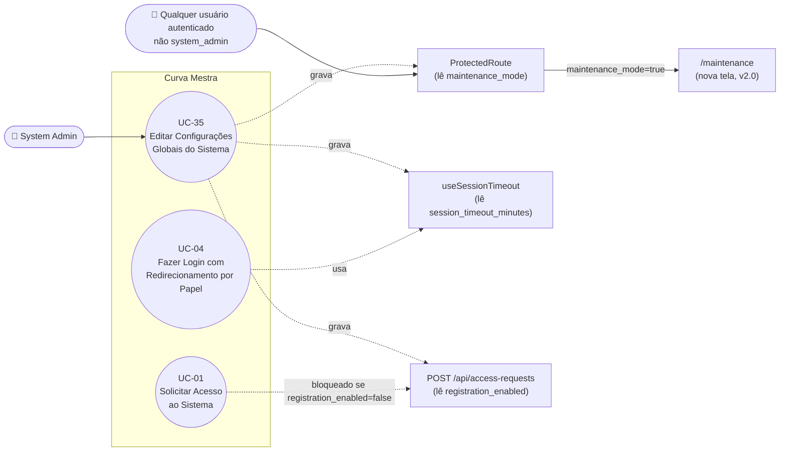

# UC-35: Editar Configurações Globais do Sistema

**Projeto:** Curva Mestra
**Data de Criação:** 15/07/2026
**Autor:** Guilherme Scandelari (via uml-use-case-writer)
**Status:** Aprovado
**Módulo/Contexto:** Administração do Sistema (Configurações Globais)
**Versão:** 2.0

> Um System Admin visualiza e edita três parâmetros globais da plataforma — tempo de expiração de sessão, modo de manutenção e permissão de novos registros — em um único formulário (`/admin/settings`), persistidos em um documento singleton `system_settings/global`. **Até a v1.0, nenhum dos três parâmetros era efetivamente lido/aplicado em nenhum outro ponto do sistema** (achado crítico confirmado por busca exaustiva). **A partir da v2.0 (commit `66c75fa`), os três parâmetros passaram a ter consumidores reais:** `maintenance_mode`/`maintenance_message` agora bloqueiam qualquer usuário não-`system_admin` via `ProtectedRoute` (redirecionamento para a nova tela `/maintenance`); `registration_enabled` agora é validado por `POST /api/access-requests`, bloqueando novas solicitações quando desativado; e `session_timeout_minutes` agora é lido por `useSessionTimeout.ts` uma vez por sessão, com fallback para 15 minutos caso o campo não exista ou seja inválido. Esta tela deixou de ser uma funcionalidade desconectada do restante da plataforma.

---

## 1. Diagrama UML (Mermaid)

---

## 2. Atores

### 2.1 Ator Primário
**System Admin** — tela restrita por `ProtectedRoute allowedRoles: ['system_admin']` (`src/app/(admin)/layout.tsx`). Único tipo de usuário com acesso a esta tela de edição.

### 2.2 Atores Secundários / Sistemas Externos
Nenhum sistema externo envolvido na própria tela de edição. Não há Firebase Auth adicional, e-mail, nem API route intermediando a gravação — a única "camada" de proteção é a regra de segurança do Firestore (`allow write: if isSystemAdmin()`), avaliada no momento da escrita. **A partir da v2.0**, os valores gravados por este UC passam a ser lidos, do lado do consumo, por: `ProtectedRoute` (qualquer usuário autenticado não-`system_admin`), `useSessionTimeout.ts` (qualquer usuário autenticado) e `POST /api/access-requests` (visitante não autenticado que solicita acesso, UC-01) — esses consumidores não são "atores" deste caso de uso (não interagem com esta tela), mas são apresentados no diagrama para refletir a relação funcional agora real com UC-04 e UC-01.

---

## 3. Pré-condições
- System Admin autenticado, com custom claim `is_system_admin === true` e `active === true`.
- O documento `system_settings/global` pode ou não existir; se não existir, o formulário é preenchido com valores padrão embutidos no código (RN-01).

---

## 4. Pós-condições

### 4.1 Sucesso
- O documento `system_settings/global` é criado ou integralmente sobrescrito (`setDoc`, sem `merge: true`) com `session_timeout_minutes`, `maintenance_mode`, `maintenance_message`, `registration_enabled`, `updated_by` (uid do admin) e `updated_at` (`serverTimestamp()`).
- Sistema exibe toast "Sucesso" / "Configurações salvas com sucesso". Não há redirecionamento — o admin permanece na própria tela `/admin/settings`.
- **[CORRIGIDO em v2.0, commit `66c75fa`]** Diferente das versões anteriores, a alteração salva aqui **agora produz efeito real e observável** em outras partes do sistema:
  - Se `maintenance_mode` for alterado para `true`, qualquer usuário autenticado com `role !== 'system_admin'` passa a ser redirecionado para `/maintenance` na próxima verificação de acesso feita por `ProtectedRoute` (RN-04).
  - Se `registration_enabled` for alterado para `false`, `POST /api/access-requests` passa a rejeitar novas solicitações com 403 (RN-05).
  - Se `session_timeout_minutes` for alterado, o novo valor passa a ser aplicado por `useSessionTimeout.ts` na próxima vez que cada usuário autenticado carregar a aplicação (o valor é lido uma única vez por sessão já em andamento — ver RN-06 para a limitação de propagação em tempo real).

### 4.2 Falha (Garantias Mínimas)
- Se a validação de `session_timeout_minutes` falhar (fora do intervalo 1–1440): nenhuma alteração é persistida.
- Se `setDoc` falhar (rede, permissão): nenhuma alteração é persistida; o formulário permanece com os valores que o admin havia digitado (não reverte para os valores salvos anteriormente).

---

## 5. Gatilho (Trigger)
System Admin acessa `/admin/settings` (via navegação lateral do Admin Layout) com a intenção de consultar ou alterar os parâmetros globais da plataforma.

---

## 6. Fluxo Principal (Basic Flow)

1. System Admin acessa `/admin/settings`.
2. Sistema exibe um spinner de carregamento (`Loader2`) e chama `loadSettings()`: `getDoc(doc(db, 'system_settings', 'global'))`.
3. Se o documento existir, sistema preenche o formulário com os dados salvos (`setSettings(docSnap.data())`); se não existir, mantém os valores padrão do estado inicial: `session_timeout_minutes: 15`, `maintenance_mode: false`, `maintenance_message: ''`, `registration_enabled: true`.
4. Sistema exibe três cards: "Sessão de Usuários" (input numérico "Tempo de sessão (minutos)", com hint "Valor padrão: 15 minutos. Recomendado: entre 15 e 60 minutos."), "Modo de Manutenção" (switch "Ativar modo de manutenção") e "Registro de Novos Usuários" (switch "Permitir novos registros").
5. System Admin altera o campo "Tempo de sessão (minutos)" (input numérico, `min="1"`, `max="1440"`).
6. System Admin opcionalmente alterna o switch "Ativar modo de manutenção"; se ligado, um campo adicional "Mensagem de manutenção" aparece condicionalmente (ver Fluxo Alternativo 7a).
7. System Admin opcionalmente alterna o switch "Permitir novos registros".
8. System Admin clica em "Salvar Configurações".
9. Sistema verifica `auth.currentUser` presente (ver Fluxo de Exceção 8a).
10. Sistema valida `session_timeout_minutes` entre 1 e 1440 (ver Fluxo de Exceção 8b).
11. Sistema executa `setDoc(doc(db, 'system_settings', 'global'), { ...settings, updated_by: auth.currentUser.uid, updated_at: serverTimestamp() })` — sobrescrevendo o documento inteiro, sem `merge: true` (RN-01).
12. Sistema exibe toast "Sucesso" / "Configurações salvas com sucesso".
13. Caso de uso é concluído com sucesso; System Admin permanece em `/admin/settings`. **[CORRIGIDO em v2.0]** A partir deste ponto, os três valores salvos passam a ser efetivamente consumidos: `maintenance_mode`/`maintenance_message` por `ProtectedRoute` (RN-04), `registration_enabled` por `POST /api/access-requests` (RN-05), e `session_timeout_minutes` por `useSessionTimeout.ts` na próxima carga de sessão de cada usuário (RN-06).

---

## 7. Fluxos Alternativos

### 7a. Ativar modo de manutenção e preencher mensagem (a partir do passo 6)
1. System Admin liga o switch "Ativar modo de manutenção" (`maintenance_mode: true`).
2. Sistema exibe o campo "Mensagem de manutenção" (input de linha única, placeholder "Ex: Sistema em manutenção. Retornaremos em breve.").
3. System Admin preenche (opcionalmente) a mensagem.
4. Se o admin desligar o switch novamente antes de salvar, o campo desaparece da tela, mas o valor digitado permanece no estado interno do formulário (não é limpo) — se salvo mais tarde com o switch ligado novamente, a mensagem antiga reaparece (RN-07 na v1.0; renumerada, ver RN-03).
5. Retorna ao passo 7 do Fluxo Principal.

### 7b. Cancelar sem salvar
1. Em qualquer momento antes de clicar em "Salvar Configurações", System Admin clica em "Cancelar".
2. Sistema navega para `/admin/dashboard` (`router.push`), sem nenhuma confirmação e sem persistir nenhuma alteração feita na tela.
3. Caso de uso é encerrado sem efeito.

---

## 8. Fluxos de Exceção

### 8a. Usuário não autenticado ao salvar (a partir do passo 9)
1. `auth.currentUser` ausente no momento de salvar (cenário defensivo — a tela já é protegida por `ProtectedRoute`, mas a checagem existe no client independentemente disso).
2. Sistema exibe toast "Erro" / "Você precisa estar autenticado"; nenhuma chamada ao Firestore é feita.

### 8b. Tempo de sessão fora do intervalo válido (a partir do passo 10)
1. `session_timeout_minutes` é menor que 1 ou maior que 1440.
2. Sistema exibe toast "Erro de validação" / "O timeout deve estar entre 1 e 1440 minutos (24 horas)"; nenhuma chamada ao Firestore é feita.
3. Caso de uso retorna ao passo 5.

### 8c. Falha ao carregar configurações (a partir do passo 2)
1. `getDoc` falha (rede, permissão).
2. Sistema exibe toast "Erro ao carregar configurações" com a mensagem crua do erro (`error.message`); `loading` é encerrado e o formulário é exibido com os valores padrão embutidos no código (mesmo comportamento do passo 3 quando o documento simplesmente não existe).

### 8d. Falha ao salvar (a partir do passo 11)
1. `setDoc` falha (rede, permissão negada por token expirado, etc.).
2. Sistema exibe toast "Erro ao salvar" com a mensagem crua do erro (`error.message`); nenhuma alteração é persistida no Firestore, e o formulário permanece com os valores que o admin havia digitado na tela (não há reversão para os últimos valores salvos).

---

## 9. Regras de Negócio Relacionadas

| ID | Regra | Justificativa |
|----|-------|----------------|
| RN-01 | O documento `system_settings/global` é um singleton — sempre o mesmo id fixo (`"global"`) — e é **sobrescrito por inteiro** a cada salvamento (`setDoc` sem `merge: true`), não apenas os campos alterados. Se dois System Admins tiverem a tela aberta simultaneamente, o último a salvar sobrescreve integralmente as mudanças do outro, sem nenhuma detecção de conflito (não há optimistic locking baseado em `updated_at`). | Confirmado por leitura de `handleSave` — `setDoc(docRef, { ...settings, updated_by, updated_at: serverTimestamp() })`, sem opção `merge`. |
| RN-02 | O campo "Tempo de sessão (minutos)" tem uma peculiaridade de UX: o `onChange` aplica `parseInt(e.target.value) || 15` a cada tecla digitada — como `0` é um valor falsy em JavaScript, digitar `"0"` no campo faz o próprio input exibir `15` imediatamente (antes mesmo de clicar em "Salvar" e passar pela validação do passo 10), diferente de qualquer outro valor inválido (ex.: negativo, ou maior que 1440), que só é barrado no momento do salvamento. | Confirmado por leitura de `onChange` do input `session_timeout`: `session_timeout_minutes: parseInt(e.target.value) || 15`. |
| RN-03 | O campo "Mensagem de manutenção" só é exibido na interface quando `maintenance_mode === true`, mas seu valor não é limpo ao desligar o switch — permanece no estado do formulário e é resalvo se o switch for religado antes de clicar em "Salvar" (ver Fluxo Alternativo 7a). | Confirmado por leitura do componente: `{settings.maintenance_mode && (<Input ... value={settings.maintenance_message} />)}`, sem reset do campo no `onCheckedChange` do switch. |
| RN-04 | **[CORRIGIDO em v2.0, commit `66c75fa`]** Até a v1.0, `maintenance_mode` e `maintenance_message` não eram lidos por nenhuma outra tela, componente, rota de API ou Cloud Function do sistema (achado crítico confirmado por busca exaustiva). O commit `66c75fa` adicionou, em `src/components/auth/ProtectedRoute.tsx`, um novo bloco no `useEffect`/`checkAccess`, logo após a checagem de `requirePasswordChange`: para qualquer usuário autenticado com `claims.role !== 'system_admin'`, busca `system_settings/global` via `getDoc`; se `maintenance_mode === true`, redireciona para a nova tela `/maintenance` (`src/app/maintenance/page.tsx`, que exibe `maintenance_message` — com fallback para uma mensagem padrão se vazia — e um botão "Sair da Conta", no mesmo padrão visual de `/suspended/admin`/`/suspended/user`). Um estado `maintenanceBlocked` (via `useState`) foi adicionado com guard de renderização espelhado (`if (maintenanceBlocked) return null`), já que a checagem é assíncrona (busca no Firestore) e não está disponível sincronamente em `claims` como as outras checagens do componente. **`system_admin` nunca é bloqueado pelo modo de manutenção** — pode continuar administrando o sistema mesmo com o modo ativo. Ativar o "Modo de Manutenção" nesta tela agora efetivamente bloqueia o acesso de qualquer usuário não-admin, conforme o texto da própria tela já afirmava. | Corrigido conforme diff de `src/components/auth/ProtectedRoute.tsx` (novo bloco de checagem de `maintenance_mode` e estado `maintenanceBlocked`) e novo arquivo `src/app/maintenance/page.tsx`, ambos no commit `66c75fa`. |
| RN-05 | **[CORRIGIDO em v2.0, commit `66c75fa`]** Até a v1.0, `registration_enabled` não era lido por nenhuma outra tela ou rota (achado crítico confirmado por busca exaustiva, incluindo `register/page.tsx` e `api/access-requests/route.ts`). O commit `66c75fa` adicionou, em `src/app/api/access-requests/route.ts`, antes da validação de campos obrigatórios, um novo bloco que busca `system_settings/global` via `getDoc` (client SDK, mesmo padrão já usado no resto do arquivo) e, se `registration_enabled === false`, retorna `403` com `{ error: 'O cadastro de novas solicitações está temporariamente desativado.' }`. **Nota de escopo:** a correção foi feita apenas no lado do servidor (validação real da regra de negócio); o formulário `/register` (client, UC-01) **não** recebeu uma checagem espelhada de UX — o visitante ainda pode preencher o formulário inteiro e só descobre que o cadastro está desativado ao submeter, recebendo o erro 403. Isso é registrado como uma melhoria de UX possível para o futuro (seção 14), não um gap de segurança, já que a regra de negócio real (impedir a criação do registro) está corretamente aplicada no servidor. | Corrigido conforme diff de `src/app/api/access-requests/route.ts` no commit `66c75fa` — novo bloco de checagem de `registration_enabled` antes da validação de campos obrigatórios. |
| RN-06 | **[CORRIGIDO em v2.0, commit `66c75fa`]** Até a v1.0, `session_timeout_minutes` era salvo neste formulário, mas o mecanismo real de expiração de sessão por inatividade (`useSessionTimeout.ts`, consumido em UC-04) usava uma constante fixa `sessionTimeoutMinutes = 15` no próprio código, sem nenhuma leitura de `system_settings/global` (achado crítico). O commit `66c75fa` substituiu essa constante fixa por um `useRef` (`sessionTimeoutMinutesRef`, inicializado com a constante `DEFAULT_SESSION_TIMEOUT_MINUTES = 15` como fallback), preenchido uma vez por sessão — dentro do `useEffect` que roda quando `currentUser` muda, antes de iniciar o timer — com o valor de `system_settings/global.session_timeout_minutes`; se o documento/campo não existir ou não for um número positivo (`typeof configured === 'number' && configured > 0`), mantém o fallback de 15. O `setTimeout` de `resetTimeout()` passou a usar `sessionTimeoutMinutesRef.current` em vez da constante fixa. **Limitação remanescente:** o valor é lido apenas uma vez, no início de cada sessão (quando `currentUser` muda) — se o System Admin alterar `session_timeout_minutes` enquanto um usuário já está com uma sessão ativa, essa sessão em andamento não é afetada; o novo valor só se aplica a partir da próxima vez que o usuário autenticar/recarregar a aplicação. **Cross-referência:** UC-04 (RN-07) documenta o mesmo hardcode como um achado — essa regra passa a estar desatualizada e **UC-04 precisa ser atualizado separadamente** para refletir que o valor agora é configurável (pendência registrada na seção 14, fora do escopo desta atualização). | Corrigido conforme diff de `src/hooks/useSessionTimeout.ts` no commit `66c75fa` — `sessionTimeoutMinutesRef` substituindo a constante fixa, leitura de `system_settings/global.session_timeout_minutes` dentro de `init()`, com fallback de 15 minutos. |
| RN-07 | A regra de segurança do Firestore permite a **leitura** de `system_settings/{settingId}` a **qualquer usuário autenticado**, de qualquer role e tenant (`allow read: if isAuthenticated()`), não apenas ao `system_admin` — apenas a **escrita** é restrita (`allow write: if isSystemAdmin()`). **[Relevância confirmada em v2.0]** Diferente da v1.0 (quando nenhum consumidor lia esta coleção e o impacto era apenas teórico), essa permissão ampla de leitura agora é **efetivamente exercida**: `ProtectedRoute` (RN-04) e `useSessionTimeout.ts` (RN-06) leem `system_settings/global` do lado do client para qualquer usuário autenticado, independentemente do role — exatamente o cenário que este UC já havia previsto como "passaria a ser relevante caso algum consumidor pretendido venha a ser implementado". A permissão de leitura ampla continua sendo a correta para esses dois consumidores (ambos precisam ler antes da autenticação de role ser avaliada). | Confirmado em `firestore.rules`, bloco `match /system_settings/{settingId}` — `allow read: if isAuthenticated();` / `allow write: if isSystemAdmin();` (regra não alterada pelo commit `66c75fa`, apenas seu uso real passou a existir). |
| RN-08 | Assim como em UC-31/UC-33, toda a validação de formato (intervalo de `session_timeout_minutes`) e a autorização desta operação de **edição** dependem inteiramente do client (`admin/settings/page.tsx`) e da regra `allow write: if isSystemAdmin()` do Firestore — não há rota `/api/settings` nem Cloud Function revalidando os dados de escrita. (Isso é distinto da leitura feita pelos novos consumidores de RN-04/RN-05/RN-06, que ocorre no server em `POST /api/access-requests`, e no client em `ProtectedRoute`/`useSessionTimeout`.) | Confirmado pela ausência de qualquer rota em `src/app/api/settings/` (não existe) e por leitura completa de `admin/settings/page.tsx`, que grava direto no Firestore via client SDK. |

---

## 10. Requisitos Especiais / Não Funcionais

| ID | Descrição | Categoria |
|----|-----------|-----------|
| RNF-01 | **[RESOLVIDO em v2.0, commit `66c75fa`]** RN-04, RN-05 e RN-06 descreviam, até a v1.0, uma funcionalidade inteira (a tela de Configurações do Sistema) que não produzia nenhum efeito observável na plataforma. Os três consumidores reais foram implementados; o risco de confiança do produto associado a essa desconexão está resolvido. Permanece como observação (seção 14) a limitação de propagação em tempo real de `session_timeout_minutes` para sessões já em andamento (RN-06) e a ausência de checagem espelhada de UX para `registration_enabled` no formulário `/register` (RN-05). | Confiabilidade / Risco de Produto |
| RNF-02 | Ausência de confirmação antes de alternar o switch "Ativar modo de manutenção" — **agora que essa ativação tem efeito real (RN-04, v2.0)**, o risco de uma ativação acidental bloquear o acesso de todos os usuários não-admin da plataforma é maior do que era na v1.0 (quando o switch não tinha efeito algum). Recomenda-se reavaliar a prioridade desta melhoria de UX. | Usabilidade |
| RNF-03 | Ausência de indicador de "alterações não salvas" — o botão "Cancelar" (Fluxo Alternativo 7b) descarta qualquer alteração feita na tela sem nenhuma confirmação. | Usabilidade |
| RNF-04 | Mensagens de erro do Firestore exibidas cruas (`error.message`), sem tradução — mesmo padrão já registrado em UC-09, UC-31/32 e UC-33/34. | Usabilidade |

---

## 11. Frequência de Uso
Rara — parâmetros globais da plataforma tendem a ser configurados uma única vez ou ajustados esporadicamente, não como parte do uso rotineiro do sistema.

---

## 12. Casos de Uso Relacionados
- **UC-04 (Fazer Login com Redirecionamento por Papel)** — cita `useSessionTimeout.ts` como mecanismo externo de timeout de sessão. **[Relação agora real, v2.0]** O valor configurado aqui (`session_timeout_minutes`) passou a ser lido por `useSessionTimeout.ts` (RN-06, `[CORRIGIDO]`), com fallback de 15 minutos — diferente da v1.0, quando o valor era sempre fixo. **Pendência explícita:** UC-04 (RN-07 daquele documento) ainda descreve o timeout como hardcoded em 15 minutos e precisa ser atualizado separadamente para refletir esta correção — atualização fora do escopo desta tarefa.
- **UC-01 (Solicitar Acesso ao Sistema)** — o campo `registration_enabled` desta tela agora bloqueia efetivamente o fluxo de solicitação de acesso mapeado em UC-01 (RN-05, `[CORRIGIDO]`), via `POST /api/access-requests`, que passou a checar esse campo antes de qualquer validação de formulário. O formulário client `/register` não recebeu uma checagem espelhada de UX (nota de escopo em RN-05) — UC-01 pode se beneficiar de uma atualização futura descrevendo esse novo fluxo de exceção (403), mas isso não foi feito nesta tarefa.
- **[Novo, v2.0]** Uma tela `/maintenance` (`src/app/maintenance/page.tsx`) foi criada como consequência direta de RN-04 — não mapeada como UC dedicado nesta atualização, mas candidata a um UC próprio futuro (ex.: "Visualizar Tela de Manutenção").
- Não há relação `<<include>>`/`<<extend>>` formal com nenhum outro UC já documentado.

---

## 13. Referências
- `src/app/(admin)/admin/settings/page.tsx`
- `src/types/index.ts` (interface `SystemSettings`)
- `firestore.rules` (`match /system_settings/{settingId}`)
- `src/hooks/useSessionTimeout.ts` (RN-06, `[CORRIGIDO]` no commit `66c75fa` — passou a ler `system_settings/global.session_timeout_minutes`, com fallback de 15 minutos via `DEFAULT_SESSION_TIMEOUT_MINUTES`)
- `src/components/auth/ProtectedRoute.tsx` (RN-04, `[CORRIGIDO]` no commit `66c75fa` — novo bloco de checagem de `maintenance_mode` e estado `maintenanceBlocked`)
- `src/app/maintenance/page.tsx` (novo arquivo, commit `66c75fa` — tela exibida quando `maintenance_mode === true` para usuários não-`system_admin`)
- `src/app/(auth)/register/page.tsx`, `src/app/api/access-requests/route.ts` (RN-05, `[CORRIGIDO]` no commit `66c75fa` — a rota passou a checar `registration_enabled`; o formulário client não recebeu checagem espelhada, nota de escopo)
- `project_doc/admin/settings-documentation.md` — engenharia reversa anterior (08/02/2026); já registrava, na seção "13.3 Testes de Integração", os três itens de verificação como pendências não confirmadas — este UC confirmou, na v1.0, que nenhuma das três passava, e agora confirma, na v2.0, que as três passam a ter efeito real após o commit `66c75fa`.

---

## 14. Perguntas em Aberto / Decisões Pendentes

1. **[RESOLVIDO em v2.0 — commit `66c75fa`]** RN-04, RN-05 e RN-06 — os três consumidores reais foram implementados (`ProtectedRoute`/`/maintenance`, `POST /api/access-requests`, `useSessionTimeout.ts`). A decisão de produto pendente na v1.0 (implementar ou remover a tela) foi resolvida a favor de implementar.
2. **[Pendência explícita, fora do escopo desta tarefa]** UC-04 (RN-07 daquele documento) precisa ser atualizado separadamente para refletir que `session_timeout_minutes` deixou de ser hardcoded — o achado ali registrado não é mais válido após esta correção (RN-06 deste UC).
3. **[Nota de escopo, RN-05]** O formulário `/register` (UC-01) não recebeu uma checagem espelhada de UX para `registration_enabled` — o visitante só descobre que o cadastro está desativado ao submeter o formulário e receber 403. Não é um gap de segurança (a regra real está aplicada no servidor), mas é uma melhoria de UX possível para o futuro.
4. **[RN-06]** `session_timeout_minutes` é lido apenas uma vez por sessão (quando o usuário autentica/recarrega) — uma alteração feita pelo System Admin não afeta sessões já em andamento. Decisão de produto pendente sobre se vale a pena introduzir um mecanismo de propagação em tempo real (ex.: listener `onSnapshot`), dado o custo/benefício frente à baixa frequência de uso desta tela (seção 11).
5. **[RN-01]** Sobrescrita total do documento (`setDoc` sem `merge`) sem detecção de conflito em escrita concorrente — decisão de produto pendente sobre se vale a pena introduzir `merge: true` ou um mecanismo de optimistic locking, dado que hoje "apenas um system_admin opera o sistema" na prática (conforme já registrado no `project_doc` anterior).
6. **[RN-07]** Regra de leitura do Firestore permite a qualquer usuário autenticado (não apenas `system_admin`) ler `system_settings/global` — confirmado, em v2.0, que essa leitura ampla é necessária para os consumidores reais implementados (`ProtectedRoute`, `useSessionTimeout`); mantida sem alteração.
7. **[RN-08]** Mesma decisão já registrada em UC-31/UC-33 sobre introduzir validação server-side (rota `/api/settings` com Admin SDK) para a operação de **edição** deste módulo (distinta da leitura pelos consumidores de RN-04/RN-05/RN-06, já implementada).
8. **[RNF-02]** Ausência de confirmação ao ativar o "Modo de Manutenção" — recomenda-se reavaliar a prioridade desta melhoria de UX agora que a ativação tem efeito real e imediato sobre todos os usuários não-admin.

---

## 15. Histórico de Versões

| Versão | Data | Autor | O que mudou |
|--------|------|-------|--------------|
| 1.0 | 15/07/2026 | Guilherme Scandelari | Versão inicial, investigada do zero a partir de `admin/settings/page.tsx`, `types/index.ts`, `firestore.rules` e `useSessionTimeout.ts`. Confirmado, por busca exaustiva em todo o código-fonte, que esta é uma funcionalidade inteiramente desconectada do restante do sistema: `maintenance_mode`/`maintenance_message` (RN-04), `registration_enabled` (RN-05) e `session_timeout_minutes` (RN-06, ignorado por `useSessionTimeout.ts` que usa valor fixo de 15 minutos) não são lidos por nenhuma outra tela, rota ou Cloud Function. Confirmado 1 único UC agrupando as três configurações, por serem editadas e salvas em um único formulário/ação. Primeiro UC do módulo "Admin — Configurações Globais do Sistema". |
| 2.0 | 24/07/2026 | Guilherme Scandelari | Reestruturação de escopo — correção de três itens de severidade Alta no mesmo commit `66c75fa`: (1) RN-04, `maintenance_mode`/`maintenance_message` agora bloqueiam usuários não-`system_admin` via `ProtectedRoute` + nova tela `/maintenance`; (2) RN-05, `POST /api/access-requests` agora valida `registration_enabled` (com nota de escopo sobre a ausência de checagem espelhada de UX em `/register`); (3) RN-06, `useSessionTimeout.ts` agora lê `session_timeout_minutes` de `system_settings/global` uma vez por sessão, com fallback de 15 minutos, deixando de ser hardcoded. As três regras foram marcadas como `[CORRIGIDO]`; seções 1 (diagrama), 2.2, 4.1, 6 (passo 13), 9, 10 (RNF-01, RNF-02), 12, 13 e 14 foram reescritas para refletir que esta tela deixou de ser uma funcionalidade desconectada. Registrada a pendência explícita de atualizar UC-04 (RN-07 daquele documento) separadamente, já que o achado de hardcode ali documentado deixa de ser válido. |
