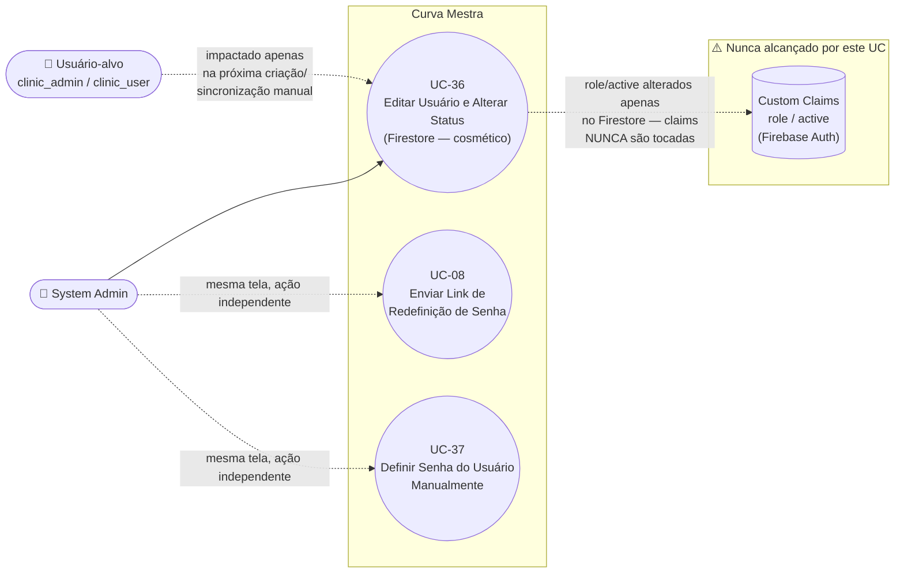

# UC-36: Editar Usuário e Alterar Status (Cross-Tenant)

**Projeto:** Curva Mestra
**Data de Criação:** 15/07/2026
**Autor:** Guilherme Scandelari (via uml-use-case-writer)
**Status:** Aprovado
**Módulo/Contexto:** Administração do Sistema (Gestão de Usuários)
**Versão:** 1.0

> Um System Admin, a partir da listagem cross-tenant `admin/users/page.tsx` (todos os usuários de todas as clínicas, exceto consultores e exceto outros `system_admin`), abre um diálogo de edição e altera nome, função (`clinic_admin`/`clinic_user`) e status (Ativo/Inativo) de um usuário, tudo em uma única submissão via `updateDoc` direto no Firestore — sem nenhuma API route dedicada. **Achado crítico confirmado:** nem a troca de função nem a alternância de status por esta tela têm qualquer efeito sobre os custom claims do usuário (`role`, `active`) nem sobre a conta no Firebase Auth — ambas as alterações são **puramente cosméticas** no documento `users/{uid}`, sem nenhum mecanismo (rota, trigger ou Cloud Function) que sincronize essas mudanças com o que efetivamente controla acesso e permissões no sistema.

---

## 1. Diagrama UML (Mermaid)

---

## 2. Atores

### 2.1 Ator Primário
**System Admin** (`is_system_admin === true`) — tela restrita por `ProtectedRoute allowedRoles: ['system_admin']` (`src/app/(admin)/layout.tsx`).

### 2.2 Atores Secundários / Sistemas Externos
- **Usuário-alvo** (`clinic_admin` ou `clinic_user`) — dono do documento editado; na prática, não é impactado pela troca de função nem pela desativação feitas por este UC (ver RN-02).
- **Firestore** — único sistema efetivamente escrito (`updateDoc` client-side em `users/{uid}`, e, se o usuário for um consultor — cenário hoje inalcançável, ver RN-04 — também em `consultants/{id}`).
- **Firebase Auth / Custom Claims** — não são tocados por nenhuma ação deste UC (achado central, RN-02/RN-03).

---

## 3. Pré-condições
- System Admin autenticado, `is_system_admin === true`.
- Existe pelo menos um usuário com `role !== 'system_admin'` cadastrado em `users` (qualquer tenant).
- O usuário-alvo não é um `clinic_consultant` — consultores nunca chegam a este diálogo (ver RN-04).

---

## 4. Pós-condições

### 4.1 Sucesso
- O documento `users/{uid}` é atualizado: `displayName`, `full_name` (espelhando `displayName`), `active` (booleano do seletor "Status"), `updated_at`; e, se o usuário não for consultor, também `role` (`clinic_admin` ou `clinic_user`, conforme o seletor "Função").
- **Nada mais é alterado.** Especificamente: os custom claims do usuário no Firebase Auth (`role`, `active`) permanecem exatamente como estavam; a conta no Firebase Auth não é desabilitada (`adminAuth.updateUser({ disabled: true })` nunca é chamado); nenhuma outra coleção é escrita (RN-02, RN-03 — achados críticos).
- Sistema exibe `alert('Usuário atualizado com sucesso!')`, fecha o diálogo e recarrega a listagem (`loadAllUsers()`).

### 4.2 Falha (Garantias Mínimas)
- Se `updateDoc` lançar exceção (rede, permissão da regra do Firestore, etc.): nenhuma alteração é persistida; sistema exibe `alert('Erro ao atualizar usuário: {mensagem}')`; o diálogo permanece aberto.

---

## 5. Gatilho (Trigger)
System Admin, na listagem `/admin/users`, clica em "Editar" na linha de um usuário (botão só visível para `role !== 'system_admin'`), altera nome/função/status no diálogo "Editar Usuário" e clica em "Salvar".

---

## 6. Fluxo Principal (Basic Flow)

1. System Admin acessa `/admin/users`.
2. Sistema carrega todos os documentos de `users` (`orderBy created_at desc`), descarta em memória os que têm `role === 'clinic_consultant'` (RN-04), e para cada um busca o nome do tenant correspondente (`tenants/{tenant_id}`) para exibição.
3. System Admin, opcionalmente, filtra a lista digitando em "Buscar por nome, email ou clínica..." (filtro em memória, client-side, sobre `displayName`/`email`/`tenantName`).
4. System Admin clica em "Editar" na linha do usuário desejado.
5. Sistema abre o diálogo "Editar Usuário", pré-preenchido com `displayName`, `phone`, `email`, `role` (mapeado para `clinic_admin` se o valor original for `system_admin` ou `clinic_consultant` — ramo teoricamente inalcançável, RN-04/RN-05) e `active`.
6. System Admin altera "Nome Completo" e/ou "Função" (`Select`: "Admin da Clínica" / "Usuário da Clínica") e/ou "Status" (`Select`: "Ativo" / "Inativo") — e-mail é exibido apenas como texto informativo, não editável (RN-06); telefone não é exibido nem editável para este tipo de usuário (RN-06).
7. System Admin clica em "Salvar".
8. Sistema monta o objeto de atualização (`displayName`, `full_name`, `active`, `updated_at`, e `role` — já que o usuário não é consultor) e chama `updateDoc(doc(db, 'users', uid), updateData)` diretamente via SDK client-side do Firestore — sem passar por nenhuma API route, sem envio de Bearer token explícito (RN-01).
9. A regra do Firestore para `users/{userId}` (`allow read, write: if isSystemAdmin()`) autoriza a escrita, já que o solicitante tem a custom claim `is_system_admin === true`.
10. Sistema exibe `alert('Usuário atualizado com sucesso!')`, fecha o diálogo e recarrega a listagem.
11. Caso de uso é concluído com sucesso — **mas os custom claims do usuário-alvo permanecem inalterados** (RN-02, RN-03): se a "Função" foi alterada, o usuário continua efetivamente com o role antigo (o que controla seu acesso, via `ProtectedRoute` e regras do Firestore de outras coleções, é a claim, não este documento); se o "Status" foi mudado para "Inativo", o usuário continua conseguindo logar e acessar o sistema normalmente.

---

## 7. Fluxos Alternativos

Nenhum identificado como caminho de UI genuinamente distinto — a troca de nome, função e status ocorrem na mesma submissão de formulário (passo 7-8), sem botões/confirmações dedicados para status como em UC-22/UC-29 (achado de UX, RN-09).

---

## 8. Fluxos de Exceção

### 8a. Falha ao salvar (a partir do passo 8)
1. `updateDoc` lança exceção (ex.: falha de rede, negação pela regra do Firestore caso a claim `is_system_admin` não esteja presente/válida no momento da chamada).
2. Sistema exibe `alert('Erro ao atualizar usuário: {error.message}')`.
3. Diálogo permanece aberto; nenhuma alteração é persistida.

### 8b. Tentativa de editar um usuário com role `system_admin`
1. Botão "Editar" não é renderizado para linhas com `role === 'system_admin'` — nenhuma chamada é possível pela UI.
2. Não há, portanto, um caminho de exceção server-side a documentar aqui: a restrição é inteiramente client-side/de UI (RN-05).

---

## 9. Regras de Negócio Relacionadas

| ID | Regra | Justificativa |
|----|-------|----------------|
| RN-01 | Assim como em UC-22 (edição de clínica), a edição usa `updateDoc` direto no Firestore (client-side) — sem nenhuma API route dedicada nem validação explícita de Bearer token; a única barreira é a regra do Firestore, avaliada a partir das custom claims da sessão atual do admin. | Confirmado por leitura de `handleSaveUser` em `admin/users/page.tsx` — nenhuma chamada `fetch`, apenas `updateDoc`. |
| RN-02 | **[Achado crítico]** Nem a troca de "Função" nem a alternância de "Status" (Ativo/Inativo) por este diálogo chamam `adminAuth.setCustomUserClaims` em nenhum momento — não existe, em todo o handler `handleSaveUser`, nenhuma chamada a uma API route que faria essa atualização no Firebase Admin SDK. Buscado exaustivamente em todo `src/`, o único trigger relacionado à coleção `users` é `onUserCreated` (`functions/src/onUserCreated.ts`), que dispara apenas em **criação** de documento (`onDocumentCreated`) e só envia um e-mail de boas-vindas — não existe nenhum `onDocumentUpdated`/`onDocumentWritten` que sincronize alterações de `role`/`active` do Firestore para as claims. Como `ProtectedRoute` (`src/components/auth/ProtectedRoute.tsx`) decide acesso e redirecionamento **exclusivamente** a partir de `claims.role`/`claims.active` (nunca lê o documento `users/{uid}`), e as regras do Firestore que dependem de role/tenant (ex.: `request.auth.token.role == 'clinic_admin'`, usada por outras coleções) também leem apenas o token — alterar "Função" ou "Status" nesta tela **não tem nenhum efeito prático** sobre o que o usuário-alvo pode fazer ou acessar. O usuário mantém integralmente o role e o acesso definidos originalmente na criação da conta (`/api/users/create` ou `/api/tenants/create`/`/api/access-requests/[id]/approve`), até que as claims sejam alteradas por outro mecanismo — nenhum dos quais é acionado por esta tela. | Confirmado por leitura completa de `handleSaveUser`, busca exaustiva por `setCustomUserClaims` em todo `src/app/api`, leitura de `onUserCreated.ts` (único trigger em `users/{userId}`), e leitura de `ProtectedRoute.tsx`/`useAuth.ts` (fonte de verdade é sempre `idTokenResult.claims`). |
| RN-03 | **[Achado crítico, decorrência de RN-02]** Definir "Status" como "Inativo" por esta tela também não desabilita a conta no Firebase Auth (`adminAuth.updateUser({ disabled: true })` nunca é chamado neste fluxo) — apenas grava `active: false` no documento Firestore. Diferente do achado análogo em UC-29 (RN-01/RN-02), aqui **não existe sequer uma rota alternativa "correta"** (como o `DELETE /api/consultants/[id]` órfão) que implemente a desativação real para usuários de clínica via `admin/users` — não há nenhuma rota `PUT`/`DELETE` para `users/{id}` no projeto (apenas `create`, `set-password` e `reset-password`). | Confirmado por listagem completa de `src/app/api/users/` — ausência de qualquer rota de atualização/exclusão genérica. |
| RN-04 | **[Achado]** Consultores (`role === 'clinic_consultant'`) são explicitamente excluídos da listagem em `loadAllUsers` (`if (userData.role === 'clinic_consultant') continue;`) — são geridos exclusivamente em `/admin/consultants` (UC-28/UC-29/UC-30/UC-08). Apesar disso, o diálogo "Editar Usuário" contém um ramo de UI inteiro dedicado a consultores (campos de e-mail e telefone editáveis, mais um bloco de sincronização com a coleção `consultants` dentro de `handleSaveUser`) que é **código morto** — nenhum consultor chega a alcançar este diálogo, já que é filtrado antes mesmo de compor a lista exibida. | Confirmado por leitura de `loadAllUsers` (filtro explícito) e por leitura completa do JSX do diálogo e de `handleSaveUser` (ramo `isConsultant`). |
| RN-05 | Usuários com `role === 'system_admin'` não exibem o botão "Editar" na listagem (`{user.role !== 'system_admin' && (...)}`) — não é possível, por esta tela, promover ninguém a `system_admin`, nem editar, desativar ou alterar a função de um `system_admin` existente (incluindo o próprio admin logado, que também aparece na listagem sem esse botão). O seletor "Função" no diálogo só oferece as opções "Admin da Clínica" (`clinic_admin`) e "Usuário da Clínica" (`clinic_user`). | Confirmado por leitura da renderização condicional do botão "Editar" e das `SelectItem` disponíveis no formulário. |
| RN-06 | Para usuários não-consultores (o único caso realmente alcançável), nem e-mail nem telefone são editáveis por este diálogo: o e-mail é exibido apenas como texto informativo (`<strong>Email:</strong> {editingUser?.email}`) e nunca incluído em `updateData`; o campo de telefone sequer é renderizado fora do ramo de consultor (RN-04). | Confirmado por leitura do JSX condicional (`editingUser?.role === 'clinic_consultant' ? (...) : (...)`) e de `handleSaveUser` (o `updateData.email`/`updateData.phone` só são setados quando `isConsultant === true`). |
| RN-07 | Não há nenhuma validação de negócio impedindo que o último `clinic_admin` de uma clínica seja rebaixado para `clinic_user` ou desativado (`active: false`) por esta tela — a clínica pode ficar sem nenhum administrador local ativo, sem qualquer alerta ou bloqueio. | Confirmado por leitura completa de `handleSaveUser` — nenhuma contagem/checagem de outros `clinic_admin` do mesmo `tenant_id` antes de salvar. |
| RN-08 | A regra do Firestore para `users/{userId}` restringe `write` a `isSystemAdmin()` — corretamente alinhada com a intenção da tela, sem o tipo de brecha encontrada em `tenants` (UC-22, RN-06), onde `belongsToTenant` também permite escrita ao próprio tenant. | Confirmado por leitura de `firestore.rules`, bloco `match /users/{userId}`. |
| RN-09 | **[Achado de UX]** Diferente de UC-22 (clínicas) e UC-29 (consultores) — que têm botões dedicados "Desativar"/"Reativar" na listagem, com `confirm()` de segurança separado da edição de dados — a alternância de status de um usuário aqui ocorre apenas através do seletor "Status" dentro do mesmo formulário de edição, submetida junto com nome/função no mesmo clique de "Salvar", sem nenhuma confirmação adicional específica para a mudança de status. | Confirmado pela ausência de qualquer botão de ação rápida de status na tabela da listagem — a única via é o diálogo de edição completo. |

---

## 10. Requisitos Especiais / Não Funcionais

| ID | Descrição | Categoria |
|----|-----------|-----------|
| RNF-01 | A ausência total de sincronização entre este formulário e os custom claims (RN-02/RN-03) é um risco de segurança e de produto significativo: um System Admin que "desative" ou "rebaixe" um usuário por aqui, acreditando estar revogando acesso ou permissões, na verdade não altera nada do que controla o acesso real do usuário ao sistema. | Segurança |
| RNF-02 | Não há auditoria de quem editou o quê nem quando neste fluxo — apenas `updated_at` é gravado, sem registrar o `uid` do admin que fez a alteração (diferente, por exemplo, de UC-37/UC-30, que gravam `passwordSetByAdmin`). | Auditoria |
| RNF-03 | Toda a interação usa `alert()`/`confirm()` nativos do navegador para mensagens de sucesso e erro, sem um componente de toast/notificação dedicado. | Consistência de UI |

---

## 11. Frequência de Uso
Ocasional — edição de dados/status de usuários cross-tenant não é uma operação recorrente do dia a dia do System Admin.

---

## 12. Casos de Uso Relacionados
- **UC-08 (System Admin Envia Link de Redefinição de Senha)** — cobre integralmente a seção "Redefinir Senha" do mesmo diálogo "Editar Usuário" (`handleResetPassword`, rota `api/users/{id}/reset-password`), incluída no fluxo principal daquele UC-08 (que já documenta explicitamente ambas as variantes, usuários e consultores). Não recebeu tratamento duplicado aqui.
- **UC-37 (Definir Senha do Usuário Manualmente)** — cobre a seção "Definir Senha Manualmente" do mesmo diálogo (`handleSetPassword`, rota `api/users/{id}/set-password`), mapeada como UC próprio nesta mesma sessão, mesmo padrão de UC-30 (equivalente para consultores).
- **UC-22 (Editar, Desativar e Reativar Clínica)** e **UC-29 (Editar, Suspender e Reativar Consultor)** — mesma família de achados: mecanismo de status "cosmético", que altera apenas um campo no Firestore sem efeito real sobre acesso. Este UC-36 é o achado mais severo dos três, pois aqui nem sequer existe uma rota "correta" alternativa (órfã ou não) que implemente a desativação/mudança de role de verdade.
- **UC-06 (Trocar Senha Obrigatória no Primeiro Acesso)** — menciona que a variante de "Definir Senha Manualmente" para usuários (`clinic_admin`/`clinic_user`) permanecia sem UC formal dedicado (pendência registrada em sua v1.2); esse UC agora fecha essa lacuna para a parte de edição/status, com UC-37 fechando a parte de senha.
- **UC-05 ("Aprovar Solicitação de Acesso" pela Própria Clínica)** menciona a criação de usuário via `clinic/users/page.tsx` + `POST /api/users/create` como o caminho real de criação de usuários de clínica — ainda sem UC formal dedicado; esse UC-36 cobre apenas a edição/status de usuários já existentes, cross-tenant, pelo System Admin.

---

## 13. Referências
- `src/app/(admin)/admin/users/page.tsx` (`loadAllUsers`, `handleEditUser`, `handleSaveUser`)
- `firestore.rules` (`match /users/{userId}`)
- `src/hooks/useAuth.ts`, `src/components/auth/ProtectedRoute.tsx` (fonte de verdade de acesso: custom claims, nunca o documento Firestore)
- `functions/src/onUserCreated.ts` (único trigger em `users/{userId}`, apenas `onDocumentCreated`, sem sincronização de claims)
- `src/app/api/users/create/route.ts`, `src/app/api/users/[id]/set-password/route.ts`, `src/app/api/users/[id]/reset-password/route.ts` (rotas existentes para `users` — confirmação de que não há `PUT`/`DELETE` genérico)
- `src/types/index.ts` (`User`, `UserRole`, `CustomClaims`)

---

## 14. Perguntas em Aberto / Decisões Pendentes

1. **[RN-02/RN-03, achado crítico — decisão de produto urgente]** Editar "Função" ou "Status" nesta tela não tem nenhum efeito real sobre o acesso do usuário — apenas altera um espelho no Firestore, desconectado das custom claims que efetivamente controlam permissões. Decisão pendente: (a) implementar uma API route dedicada (`PUT /api/users/[id]`) que também chame `adminAuth.setCustomUserClaims` (e, para desativação real, `adminAuth.updateUser({ disabled: true })`), migrando esta tela de `updateDoc` direto para essa rota; ou (b) manter o comportamento atual e deixar explícito na UI que estas alterações são apenas de registro/cadastro, sem efeito de acesso.
2. **[RN-07]** Ausência de validação que impeça uma clínica de ficar sem nenhum `clinic_admin` ativo — avaliação de necessidade de correção não solicitada até o momento.
3. **[RN-09]** Diferente de UC-22/UC-29, não há confirmação dedicada (`confirm()`) para a mudança de status — ela é submetida junto com os demais campos do formulário. Avaliação de necessidade de alinhamento de UX não solicitada até o momento.

---

## 15. Histórico de Versões

| Versão | Data | Autor | O que mudou |
|--------|------|-------|--------------|
| 1.0 | 15/07/2026 | Guilherme Scandelari | Versão inicial, investigada do zero a partir de `admin/users/page.tsx` (`loadAllUsers`, `handleEditUser`, `handleSaveUser`). Confirmado 1 UC cobrindo edição de nome/função + alternância de status, ambos via `updateDoc` direto no Firestore, sem API route dedicada (RN-01). Achado crítico central: nem a troca de "Função" nem a de "Status" atualizam os custom claims do usuário-alvo em nenhum momento — buscado exaustivamente, não existe rota nem Cloud Function trigger que sincronize essas alterações do Firestore para as claims que efetivamente controlam acesso (`ProtectedRoute`, regras do Firestore de outras coleções) — tornando ambas as ações puramente cosméticas (RN-02/RN-03), sem sequer uma rota "correta" alternativa (órfã ou não) como a encontrada em UC-29. Confirmado também que consultores são filtrados da listagem, tornando o ramo de UI/lógica de consultor deste mesmo diálogo código morto (RN-04), que `system_admin` nunca é editável por esta tela — nem mesmo o próprio admin logado (RN-05) — e que não há validação contra uma clínica ficar sem `clinic_admin` (RN-07). |
