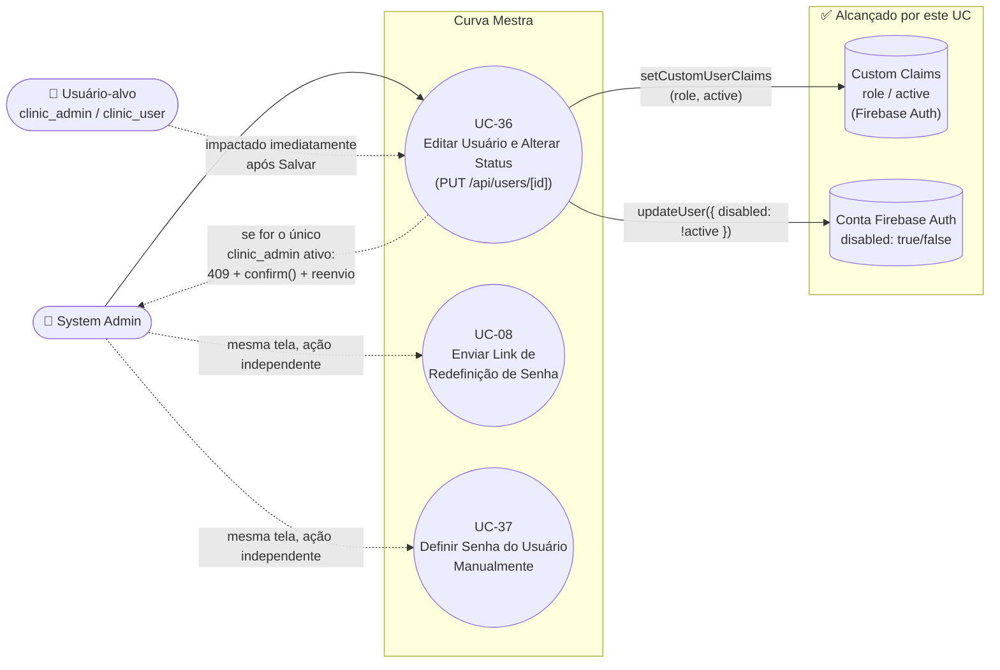

# UC-36: Editar Usuário e Alterar Status (Cross-Tenant)

**Projeto:** Curva Mestra
**Data de Criação:** 15/07/2026
**Autor:** Guilherme Scandelari (via uml-use-case-writer)
**Status:** Aprovado
**Módulo/Contexto:** Administração do Sistema (Gestão de Usuários)
**Versão:** 1.1.1

> Um System Admin, a partir da listagem cross-tenant `admin/users/page.tsx` (todos os usuários de todas as clínicas, exceto consultores e exceto outros `system_admin`), abre um diálogo de edição e altera nome, função (`clinic_admin`/`clinic_user`) e status (Ativo/Inativo) de um usuário. Desde a correção `bugfix/sync-user-claims-on-edit`, essa submissão passou a ser feita via `PUT /api/users/[id]` (rota nova, com Bearer token), que sincroniza de fato os custom claims (`role`, `active`) no Firebase Auth, desabilita/reabilita a conta (`adminAuth.updateUser({ disabled })`) e — antes de rebaixar ou desativar o único `clinic_admin` ativo de uma clínica — exige confirmação explícita do System Admin (HTTP 409 + `confirm()` + reenvio). Consultores continuam fora do escopo desta tela (RN-04) e usam um ramo legado próprio (`updateDoc` direto), não alterado por esta correção.

---

## 1. Diagrama UML (Mermaid)

---

## 2. Atores

### 2.1 Ator Primário
**System Admin** (`is_system_admin === true`) — tela restrita por `ProtectedRoute allowedRoles: ['system_admin']` (`src/app/(admin)/layout.tsx`).

### 2.2 Atores Secundários / Sistemas Externos
- **Usuário-alvo** (`clinic_admin` ou `clinic_user`) — dono do documento editado; agora é efetivamente impactado pela troca de função e pela desativação feitas por este UC (claims e conta Auth sincronizadas).
- **Firestore** — escrito através da rota API (`users/{uid}`, campos `displayName`, `full_name`, `role`, `active`, `updated_at`), e, se o usuário for um consultor (ramo legado inalcançável por esta tela, ver RN-04), ainda também em `consultants/{id}` via `updateDoc` direto.
- **Firebase Auth / Custom Claims** — sincronizados pela rota `PUT /api/users/[id]` via `adminAuth.setCustomUserClaims` (claims `role`/`active`) e `adminAuth.updateUser({ disabled: !active })` (habilita/desabilita a conta).
- **`PUT /api/users/[id]`** (`src/app/api/users/[id]/route.ts`) — nova API route, verifica Bearer token + claim `is_system_admin`, aplica defesa em profundidade contra edição de `system_admin`/`clinic_consultant`, checa "último admin ativo" e sincroniza Firestore + Auth em uma única operação.

---

## 3. Pré-condições
- System Admin autenticado, `is_system_admin === true`.
- Existe pelo menos um usuário com `role !== 'system_admin'` cadastrado em `users` (qualquer tenant).
- O usuário-alvo não é um `clinic_consultant` — consultores nunca chegam a este diálogo (ver RN-04); se o forem, a rota `PUT /api/users/[id]` também rejeita com 403 como defesa em profundidade.

---

## 4. Pós-condições

### 4.1 Sucesso
- O documento `users/{uid}` é atualizado (via `PUT /api/users/[id]`, usando `adminDb`): `displayName`, `full_name` (espelhando `displayName`), `role`, `active`, `updated_at` (`FieldValue.serverTimestamp()`).
- As custom claims do usuário no Firebase Auth são sincronizadas: `adminAuth.getUser(userId)` busca as claims atuais e `adminAuth.setCustomUserClaims(userId, { ...currentClaims, role, active })` sobrescreve apenas `role`/`active`, preservando `tenant_id` e demais claims (padrão correto — nunca espalha o documento Firestore inteiro).
- A conta no Firebase Auth é habilitada/desabilitada de fato: `adminAuth.updateUser(userId, { disabled: !active })` — se "Status" for "Inativo", `disabled: true` impede login imediatamente; se "Ativo", `disabled: false`.
- Se o usuário editado era o único `clinic_admin` ativo do seu tenant e a alteração o faria perder esse status (troca de função para `clinic_user` e/ou desativação), a operação só é persistida após confirmação explícita do System Admin (ver seção 8c).
- Sistema exibe `alert('Usuário atualizado com sucesso!')`, fecha o diálogo e recarrega a listagem (`loadAllUsers()`).
- **Nota histórica (bug corrigido):** até a correção `bugfix/sync-user-claims-on-edit` (commits `2c7b023`, `e0f0e74`, `69bc944`), nenhuma dessas sincronizações existia — ver RN-02, RN-03 e RN-07 para o registro completo do comportamento anterior e da correção aplicada.
- **Achado novo, ainda aberto:** ao desativar um usuário ("Status: Inativo", `disabled: true`), se esse usuário tentar logar depois, vê a mensagem crua e em inglês do SDK do Firebase Auth em vez de uma mensagem amigável em PT-BR (RN-10).

### 4.2 Falha (Garantias Mínimas)
- Se a rota `PUT /api/users/[id]` retornar erro (401 sem Bearer token, 403 se o alvo for `system_admin`/`clinic_consultant` ou o solicitante não for `is_system_admin`, 404 se o `userId` não existir, 400 por payload inválido, 409 se exigir confirmação de "último admin" e ela não tiver sido enviada, ou 500 por falha inesperada): nenhuma alteração é persistida (nem Firestore, nem claims, nem `disabled`); sistema exibe `alert('Erro ao atualizar usuário: {mensagem}')` (exceto no caso 409, tratado como fluxo de confirmação — ver 8c); o diálogo permanece aberto.

---

## 5. Gatilho (Trigger)
System Admin, na listagem `/admin/users`, clica em "Editar" na linha de um usuário (botão só visível para `role !== 'system_admin'`), altera nome/função/status no diálogo "Editar Usuário" e clica em "Salvar".

---

## 6. Fluxo Principal (Basic Flow)

1. System Admin acessa `/admin/users`.
2. Sistema carrega todos os documentos de `users` (`orderBy created_at desc`), descarta em memória os que têm `role === 'clinic_consultant'` (RN-04), e para cada um busca o nome do tenant correspondente (`tenants/{tenant_id}`) para exibição.
3. System Admin, opcionalmente, filtra a lista digitando em "Buscar por nome, email ou clínica..." (filtro em memória, client-side, sobre `displayName`/`email`/`tenantName`).
4. System Admin clica em "Editar" na linha do usuário desejado.
5. Sistema abre o diálogo "Editar Usuário", pré-preenchido com `displayName`, `phone`, `email`, `role` (mapeado para `clinic_admin` se o valor original for `system_admin` ou `clinic_consultant` — ramo teoricamente inalcançável, RN-04/RN-05) e `active`.
6. System Admin altera "Nome Completo" e/ou "Função" (`Select`: "Admin da Clínica" / "Usuário da Clínica") e/ou "Status" (`Select`: "Ativo" / "Inativo") — e-mail é exibido apenas como texto informativo, não editável (RN-06); telefone não é exibido nem editável para este tipo de usuário (RN-06).
7. System Admin clica em "Salvar" (`handleSaveUser()`, sem parâmetro na primeira chamada — `confirmLastAdmin = false` por padrão).
8. Como `editingUser.role !== 'clinic_consultant'`, sistema obtém o Bearer token do admin logado (`auth.currentUser.getIdToken()`) e chama `PUT /api/users/{uid}` com `{ displayName, role: editRole, active: editActive, confirmLastAdmin: false }`.
9. A rota valida o Bearer token (`adminAuth.verifyIdToken`) e a claim `is_system_admin` do solicitante; valida o payload (`displayName` obrigatório, `role` em `clinic_admin`/`clinic_user`, `active` booleano); busca `users/{userId}` e rejeita com 403 se o alvo for `system_admin` ou `clinic_consultant` (defesa em profundidade, RN-04/RN-05).
10. A rota verifica se o usuário-alvo era um `clinic_admin` ativo (`wasActiveClinicAdmin`) e se a alteração o faria perder esse status (`willLoseAdminStatus`); neste fluxo principal (caminho feliz), essa condição não se aplica — segue direto ao próximo passo (ver seção 8c para o fluxo de exceção quando se aplica).
11. A rota busca as claims atuais do usuário via `adminAuth.getUser(userId).customClaims`, e sobrescreve apenas `role`/`active` com `adminAuth.setCustomUserClaims(userId, { ...currentClaims, role, active })` — preservando `tenant_id` e demais claims.
12. A rota chama `adminAuth.updateUser(userId, { disabled: !active })`, habilitando ou desabilitando a conta no Firebase Auth conforme o "Status" escolhido.
13. A rota atualiza `users/{userId}` no Firestore (`displayName`, `full_name`, `role`, `active`, `updated_at`) via `adminDb` (Admin SDK, não sujeito às regras client-side do Firestore) e registra um log server-side (`console.log`) com o `uid` do admin que fez a alteração.
14. Rota retorna `200 { success: true }`; sistema exibe `alert('Usuário atualizado com sucesso!')`, fecha o diálogo e recarrega a listagem.
15. Caso de uso é concluído com sucesso — as custom claims e o estado `disabled` da conta do usuário-alvo agora refletem exatamente a função e o status escolhidos: se a "Função" foi alterada, o acesso do usuário (via `ProtectedRoute` e regras do Firestore de outras coleções, que leem a claim) muda imediatamente na próxima verificação do token; se o "Status" foi mudado para "Inativo", o usuário não consegue mais logar (conta `disabled: true` no Firebase Auth) — porém vê uma mensagem de erro não traduzida ao tentar (RN-10).

---

## 7. Fluxos Alternativos

Nenhum identificado como caminho de UI genuinamente distinto — a troca de nome, função e status ocorrem na mesma submissão de formulário (passo 7-8), sem botões/confirmações dedicados para status como em UC-22/UC-29 (achado de UX ainda em aberto, RN-09).

---

## 8. Fluxos de Exceção

### 8a. Falha ao salvar (a partir do passo 8)
1. A rota `PUT /api/users/[id]` retorna um erro não relacionado à confirmação de "último admin" (ex.: 401 sem Bearer token, 400 payload inválido, 404 usuário não encontrado, 500 falha inesperada).
2. Sistema exibe `alert('Erro ao atualizar usuário: {error.message}')`.
3. Diálogo permanece aberto; nenhuma alteração é persistida (nem Firestore, nem claims, nem `disabled`).

### 8b. Tentativa de editar um usuário com role `system_admin`
1. Botão "Editar" não é renderizado para linhas com `role === 'system_admin'` — nenhuma chamada é possível pela UI.
2. Como defesa em profundidade, se a rota `PUT /api/users/[id]` for chamada mesmo assim (ex.: requisição forjada) para um `userId` cujo documento tenha `role === 'system_admin'`, ela responde 403 (`'Não é permitido editar administradores do sistema'`) sem alterar nada.

### 8c. Usuário-alvo é o único `clinic_admin` ativo do tenant (a partir do passo 10)
1. A rota calcula `willLoseAdminStatus`: verdadeiro quando o usuário-alvo era um `clinic_admin` com `active === true` (`wasActiveClinicAdmin`) e a nova submissão o rebaixaria (`role !== 'clinic_admin'`) e/ou o desativaria (`active === false`).
2. Se `willLoseAdminStatus` for verdadeiro, a rota consulta `users` filtrando `tenant_id` igual ao do usuário-alvo e `role == 'clinic_admin'`, e verifica se existe algum outro documento (`doc.id !== userId`) com `active === true`.
3. Se não houver nenhum outro `clinic_admin` ativo no tenant **e** o payload não tiver enviado `confirmLastAdmin: true`, a rota responde `409` com `code: 'LAST_ADMIN_CONFIRMATION_REQUIRED'` e uma mensagem explicando que a clínica ficará sem administrador local — sem persistir nenhuma alteração (nem Firestore, nem claims, nem `disabled`).
4. No client, `handleSaveUser` detecta `response.status === 409` e `data.code === 'LAST_ADMIN_CONFIRMATION_REQUIRED'`: encerra o estado de "salvando" (`setUpdating(false)`) e exibe um `confirm()` nativo com a mensagem retornada pela API.
5. Se o System Admin confirmar (`confirm()` retorna `true`), `handleSaveUser(true)` é chamado novamente, reenviando a mesma requisição `PUT /api/users/{uid}` com `confirmLastAdmin: true` no corpo — desta vez a rota pula a checagem de "último admin" (passo 10 retoma o fluxo principal a partir da sincronização de claims, passo 11) e persiste normalmente.
6. Se o System Admin cancelar (`confirm()` retorna `false`), a função retorna sem reenviar nada; o diálogo permanece aberto com os valores ainda preenchidos, e nenhuma alteração foi persistida.

### 8d. Usuário desativado por este UC tenta logar (`/login`) — mensagem de erro não traduzida
1. Usuário (`clinic_admin` ou `clinic_user`) com conta desabilitada (`disabled: true`, ver 4.1) tenta logar em `/login` com e-mail e senha corretos.
2. `signInWithEmailAndPassword` (Firebase Auth SDK) rejeita a tentativa com o código `auth/user-disabled`.
3. `signIn` (`src/hooks/useAuth.ts:75-82`) captura a exceção e retorna `{ success: false, error: error.message }` — a mensagem bruta do SDK, não `error.code`.
4. `translateFirebaseError` (`src/app/(auth)/login/page.tsx:136-153`) não tem nenhum tratamento para `user-disabled` (só trata `wrong-password`/`invalid-credential`, `user-not-found`, `too-many-requests`, `network-request-failed`, `invalid-email`) e cai no `default: return error || 'Erro ao fazer login. Tente novamente'`.
5. Sistema exibe ao usuário a mensagem crua e em inglês do SDK (ex.: `Firebase: The user account has been disabled by an administrator. (auth/user-disabled)`) em vez de uma mensagem amigável em PT-BR orientando a contatar o administrador (RN-10, achado novo, ainda não corrigido). Mesmo achado documentado em UC-29 (RN-09), pois a causa raiz é compartilhada — a mesma tela de login trata os erros de login para qualquer conta desabilitada, seja usuário de clínica (este UC) ou consultor (UC-29).

---

## 9. Regras de Negócio Relacionadas

| ID | Regra | Justificativa |
|----|-------|----------------|
| RN-01 | Diferente de UC-22 (edição de clínica, que usa `updateDoc` direto client-side), a edição de usuários não-consultores agora passa por uma API route dedicada (`PUT /api/users/[id]`), com validação de Bearer token e da claim `is_system_admin` no servidor — não depende apenas da regra do Firestore avaliada a partir das claims da sessão do admin. O ramo de consultor (código morto, RN-04) permanece usando `updateDoc` direto, sem alteração. | Confirmado por leitura de `handleSaveUser` em `admin/users/page.tsx` (ramo `!isConsultant` monta `fetch('/api/users/{uid}', { method: 'PUT', ... })`) e de `src/app/api/users/[id]/route.ts` (`PUT`). |
| RN-02 | **[Corrigido — nota histórica]** Até a correção `bugfix/sync-user-claims-on-edit`, nem a troca de "Função" nem a alternância de "Status" (Ativo/Inativo) por este diálogo chamavam `adminAuth.setCustomUserClaims` em nenhum momento, tornando ambas as alterações puramente cosméticas no documento `users/{uid}`, sem qualquer efeito sobre o acesso real do usuário (`ProtectedRoute` e regras do Firestore de outras coleções leem apenas a claim, nunca o documento). O commit `2c7b023` ("fix(admin): add PUT /api/users/[id] to sync auth claims and disabled status") introduziu a rota `PUT /api/users/[id]`, que busca as claims atuais via `adminAuth.getUser(userId).customClaims` e as sobrescreve com `adminAuth.setCustomUserClaims(userId, { ...currentClaims, role, active })` — seguindo o padrão correto de nunca espalhar o documento Firestore inteiro nas claims, preservando `tenant_id` e demais campos. O commit `69bc944` ("fix(admin): migrate user edit dialog to sync claims via api route") migrou `handleSaveUser` (para o ramo não-consultor) de `updateDoc` direto para essa nova rota. Comportamento atual: alterar "Função" nesta tela agora sincroniza a claim `role` de fato (ver fluxo principal, passos 8-15). | Confirmado por leitura completa de `handleSaveUser` (branch `!isConsultant`, `fetch PUT /api/users/{uid}`) e de `src/app/api/users/[id]/route.ts` (`adminAuth.getUser`/`setCustomUserClaims`), e por `git log` dos commits `2c7b023`/`69bc944`. |
| RN-03 | **[Corrigido — nota histórica]** Até a correção, definir "Status" como "Inativo" por esta tela não desabilitava a conta no Firebase Auth (`adminAuth.updateUser({ disabled: true })` nunca era chamado) — apenas gravava `active: false` no Firestore, sem impedir login. O commit `2c7b023` adicionou, na mesma rota `PUT /api/users/[id]`, a chamada `adminAuth.updateUser(userId, { disabled: !active })`, que agora desabilita/reabilita a conta de fato, de forma sincronizada com o campo `active`. Diferente do achado análogo em UC-29 (que apontava uma rota "correta" órfã, o `DELETE /api/consultants/[id]`), aqui a correção não criou uma rota alternativa: ela corrigiu a própria rota usada pelo fluxo principal desta tela. | Confirmado por leitura de `src/app/api/users/[id]/route.ts`, linha `await adminAuth.updateUser(userId, { disabled: !active });`, dentro do mesmo handler que sincroniza as claims. |
| RN-04 | **[Achado, ainda válido]** Consultores (`role === 'clinic_consultant'`) são explicitamente excluídos da listagem em `loadAllUsers` (`if (userData.role === 'clinic_consultant') continue;`) — são geridos exclusivamente em `/admin/consultants` (UC-28/UC-29/UC-30/UC-08). Apesar disso, o diálogo "Editar Usuário" contém um ramo de UI inteiro dedicado a consultores (campos de e-mail e telefone editáveis, mais um bloco de sincronização com a coleção `consultants` dentro de `handleSaveUser`) que é **código morto** — nenhum consultor chega a alcançar este diálogo, já que é filtrado antes mesmo de compor a lista exibida. Esse ramo continua usando `updateDoc` direto no Firestore, sem passar pela nova rota `PUT /api/users/[id]` e sem sincronização de claims — não foi alterado pela correção, pois está fora do escopo do bug corrigido (usuários não-consultores). Como defesa em profundidade, a própria rota `PUT /api/users/[id]` também rejeita (403) qualquer tentativa de editar um usuário com `role === 'clinic_consultant'`. | Confirmado por leitura de `loadAllUsers` (filtro explícito), do JSX do diálogo e de `handleSaveUser` (ramo `isConsultant`, inalterado), e da checagem `userData?.role === 'clinic_consultant'` em `src/app/api/users/[id]/route.ts`. |
| RN-05 | Usuários com `role === 'system_admin'` não exibem o botão "Editar" na listagem (`{user.role !== 'system_admin' && (...)}`) — não é possível, por esta tela, promover ninguém a `system_admin`, nem editar, desativar ou alterar a função de um `system_admin` existente (incluindo o próprio admin logado, que também aparece na listagem sem esse botão). O seletor "Função" no diálogo só oferece as opções "Admin da Clínica" (`clinic_admin`) e "Usuário da Clínica" (`clinic_user`). A rota `PUT /api/users/[id]` reforça essa restrição no servidor (403 se o alvo for `system_admin`) e também só aceita `role` igual a `clinic_admin` ou `clinic_user` no payload (400 caso contrário). | Confirmado por leitura da renderização condicional do botão "Editar", das `SelectItem` disponíveis no formulário, e das validações de `role` em `src/app/api/users/[id]/route.ts`. |
| RN-06 | Para usuários não-consultores (o único caso realmente alcançável), nem e-mail nem telefone são editáveis por este diálogo: o e-mail é exibido apenas como texto informativo (`<strong>Email:</strong> {editingUser?.email}`) e nunca incluído no payload enviado a `PUT /api/users/[id]`; o campo de telefone sequer é renderizado fora do ramo de consultor (RN-04). | Confirmado por leitura do JSX condicional (`editingUser?.role === 'clinic_consultant' ? (...) : (...)`) e de `handleSaveUser` (o `fetch` para o ramo não-consultor só envia `displayName`, `role`, `active`, `confirmLastAdmin`). |
| RN-07 | **[Corrigido — nota histórica]** Até a correção, não havia nenhuma validação de negócio impedindo que o último `clinic_admin` ativo de uma clínica fosse rebaixado para `clinic_user` ou desativado por esta tela — a clínica podia ficar sem nenhum administrador local ativo, sem qualquer alerta ou bloqueio. O commit `e0f0e74` ("fix(admin): require confirmation before removing a clinic's last active admin") introduziu, na rota `PUT /api/users/[id]`, a checagem `willLoseAdminStatus` (usuário era `clinic_admin` ativo e a submissão o rebaixaria e/ou desativaria): se não houver nenhum outro `clinic_admin` ativo no mesmo `tenant_id`, a rota responde `409 LAST_ADMIN_CONFIRMATION_REQUIRED` em vez de bloquear automaticamente a operação. O comportamento é de **confirmação explícita**, não de bloqueio: o commit `69bc944` adaptou `handleSaveUser` para tratar esse 409 com um `confirm()` nativo e reenviar a requisição com `confirmLastAdmin: true` caso o System Admin confirme (ver fluxo de exceção 8c). Se confirmado, a clínica pode legitimamente ficar sem `clinic_admin` ativo — a regra apenas exige que essa consequência seja reconhecida explicitamente, não a impede. | Confirmado por leitura de `src/app/api/users/[id]/route.ts` (bloco `willLoseAdminStatus`/`otherActiveAdmins`/código `409`) e de `handleSaveUser` em `admin/users/page.tsx` (tratamento do `status === 409` com `confirm()` e reenvio `handleSaveUser(true)`). |
| RN-08 | A regra do Firestore para `users/{userId}` restringe `write` a `isSystemAdmin()` — corretamente alinhada com a intenção da tela, sem o tipo de brecha encontrada em `tenants` (UC-22, RN-06), onde `belongsToTenant` também permite escrita ao próprio tenant. A rota `PUT /api/users/[id]` escreve via Admin SDK (`adminDb`), que não é sujeito a essas regras client-side, mas replica a mesma checagem de autorização no servidor (Bearer token + claim `is_system_admin`). | Confirmado por leitura de `firestore.rules`, bloco `match /users/{userId}`, e da validação de autorização no início de `src/app/api/users/[id]/route.ts`. |
| RN-09 | **[Achado de UX, ainda em aberto]** Diferente de UC-22 (clínicas) e UC-29 (consultores) — que têm botões dedicados "Desativar"/"Reativar" na listagem, com `confirm()` de segurança separado da edição de dados — a alternância de status de um usuário aqui ainda ocorre apenas através do seletor "Status" dentro do mesmo formulário de edição, submetida junto com nome/função no mesmo clique de "Salvar", sem nenhuma confirmação adicional dedicada especificamente para a mudança de status (fora do caso específico de "último admin", RN-07, que já ganhou confirmação própria). Este achado está fora do escopo da correção `bugfix/sync-user-claims-on-edit` e permanece registrado como pendência de UX. | Confirmado pela ausência de qualquer botão de ação rápida de status na tabela da listagem — a única via é o diálogo de edição completo. |
| RN-10 | **[Achado novo, decorrente da correção de RN-02/RN-03 — ainda aberto]** Desde que definir "Status: Inativo" por este UC passou a desabilitar de fato a conta no Firebase Auth (`disabled: true`, RN-03), o código de erro `auth/user-disabled`, lançado por `signInWithEmailAndPassword` ao tentar logar com essa conta, passou a ser efetivamente alcançável em `/login` — e não é tratado. `signIn` (`src/hooks/useAuth.ts:75-82`) retorna `{ success: false, error: error.message }` (a mensagem bruta do SDK, não `error.code`); `translateFirebaseError` (`src/app/(auth)/login/page.tsx:136-153`) trata `wrong-password`/`invalid-credential`, `user-not-found`, `too-many-requests`, `network-request-failed` e `invalid-email`, mas não tem nenhum tratamento para `user-disabled`, caindo no `default: return error \|\| 'Erro ao fazer login. Tente novamente'`. Resultado: o usuário desativado vê a mensagem crua e em inglês do SDK (`Firebase: The user account has been disabled by an administrator. (auth/user-disabled)`) em vez de uma mensagem amigável em PT-BR orientando-o a contatar o administrador. **Antes da correção de RN-02/RN-03 (`bugfix/sync-user-claims-on-edit`), este code path nunca era alcançado**, pois "Status: Inativo" era só cosmético e a conta nunca era realmente desabilitada no Firebase Auth. Correção sugerida (ainda não implementada): adicionar um `case`/verificação para `user-disabled` em `translateFirebaseError`. Mesmo achado documentado em UC-29 (RN-09), pois a causa raiz é compartilhada — a mesma tela de login trata os erros de login para qualquer conta desabilitada, seja usuário de clínica (este UC) ou consultor (UC-29). | Confirmado por leitura literal de `signIn` (`src/hooks/useAuth.ts:75-82`, retorna `error.message` em vez de `error.code`) e de `translateFirebaseError` (`src/app/(auth)/login/page.tsx:97-133` e `136-153`) — ausência de tratamento para `user-disabled`. |

---

## 10. Requisitos Especiais / Não Funcionais

| ID | Descrição | Categoria |
|----|-----------|-----------|
| RNF-01 | **[Resolvido]** A ausência de sincronização entre este formulário e os custom claims (antigo RN-02/RN-03) foi corrigida em `bugfix/sync-user-claims-on-edit` — a rota `PUT /api/users/[id]` agora garante que "desativar" ou "rebaixar" um usuário por aqui produz o efeito real esperado sobre o acesso do usuário ao sistema. | Segurança |
| RNF-02 | Auditoria mínima foi adicionada: a rota `PUT /api/users/[id]` registra um `console.log` server-side com o `uid` do admin que fez a alteração (`decodedToken.uid`) a cada atualização bem-sucedida. Ainda não há, porém, um registro persistente (ex.: coleção de auditoria) nem o `uid` do admin é gravado no próprio documento `users/{uid}` — diferente de UC-37/UC-30, que gravam `passwordSetByAdmin` no documento. | Auditoria |
| RNF-03 | Toda a interação usa `alert()`/`confirm()` nativos do navegador para mensagens de sucesso, erro e para a confirmação de "último admin" (RN-07/8c), sem um componente de toast/modal dedicado. | Consistência de UI |

---

## 11. Frequência de Uso
Ocasional — edição de dados/status de usuários cross-tenant não é uma operação recorrente do dia a dia do System Admin.

---

## 12. Casos de Uso Relacionados
- **UC-08 (System Admin Envia Link de Redefinição de Senha)** — cobre integralmente a seção "Redefinir Senha" do mesmo diálogo "Editar Usuário" (`handleResetPassword`, rota `api/users/{id}/reset-password`), incluída no fluxo principal daquele UC-08 (que já documenta explicitamente ambas as variantes, usuários e consultores). Não recebeu tratamento duplicado aqui.
- **UC-37 (Definir Senha do Usuário Manualmente)** — cobre a seção "Definir Senha Manualmente" do mesmo diálogo (`handleSetPassword`, rota `api/users/{id}/set-password`), mapeada como UC próprio nesta mesma sessão, mesmo padrão de UC-30 (equivalente para consultores).
- **UC-22 (Editar, Desativar e Reativar Clínica)** e **UC-29 (Editar, Suspender e Reativar Consultor)** — mesma família de achados original (mecanismo de status "cosmético"). Este UC-36 foi o primeiro dos três a ser corrigido com uma rota dedicada que sincroniza claims e desabilita a conta de fato (`PUT /api/users/[id]`); UC-22 permanece com o comportamento cosmético documentado em sua versão, sem correção equivalente confirmada até o momento; UC-29 recebeu correção equivalente própria em 16/07/2026 (RN-01/RN-02 daquele UC).
- **UC-06 (Trocar Senha Obrigatória no Primeiro Acesso)** — menciona que a variante de "Definir Senha Manualmente" para usuários (`clinic_admin`/`clinic_user`) permanecia sem UC formal dedicado (pendência registrada em sua v1.2); esse UC agora fecha essa lacuna para a parte de edição/status, com UC-37 fechando a parte de senha.
- **UC-05 ("Aprovar Solicitação de Acesso" pela Própria Clínica)** menciona a criação de usuário via `clinic/users/page.tsx` + `POST /api/users/create` como o caminho real de criação de usuários de clínica — ainda sem UC formal dedicado; esse UC-36 cobre apenas a edição/status de usuários já existentes, cross-tenant, pelo System Admin.
- **UC-29 (Editar, Suspender e Reativar Consultor)** — achado de UX compartilhado (RN-10 aqui / RN-09 lá): a tela de login (`login/page.tsx`) não trata o código `auth/user-disabled` do Firebase Auth para nenhuma conta desabilitada, seja usuário de clínica (status "Inativo" por este UC) ou consultor (suspenso por UC-29) — mesma causa raiz, mesma correção sugerida, achado descoberto na validação manual pós-fix de ambos os UCs (16-17/07/2026).
- **UC-04 (Fazer Login com Redirecionamento por Papel)** — dono da tela `/login` onde o achado RN-10 ocorre; não documentado formalmente lá nesta rodada (achado registrado apenas em UC-29/UC-36, por ter sido descoberto no contexto da validação pós-fix destes dois UCs).

---

## 13. Referências
- `src/app/(admin)/admin/users/page.tsx` (`loadAllUsers`, `handleEditUser`, `handleSaveUser`)
- `src/app/api/users/[id]/route.ts` (`PUT` — nova rota, sincroniza Firestore, custom claims e estado `disabled` do Firebase Auth, com checagem de "último admin")
- `firestore.rules` (`match /users/{userId}`)
- `src/hooks/useAuth.ts` (`signIn`, linhas 75-82 — retorna `error.message` bruto, não `error.code`, ver RN-10), `src/components/auth/ProtectedRoute.tsx` (fonte de verdade de acesso: custom claims, nunca o documento Firestore)
- `src/app/(auth)/login/page.tsx` (`translateFirebaseError`, linhas 136-153 — sem tratamento para `user-disabled`, ver RN-10)
- `functions/src/onUserCreated.ts` (único trigger em `users/{userId}`, apenas `onDocumentCreated`, sem sincronização de claims — não afetado por esta correção, que atua na edição, não na criação)
- `src/app/api/users/create/route.ts`, `src/app/api/users/[id]/set-password/route.ts`, `src/app/api/users/[id]/reset-password/route.ts` (demais rotas existentes para `users`)
- Commits da correção (branch `bugfix/sync-user-claims-on-edit`): `2c7b023` (`fix(admin): add PUT /api/users/[id] to sync auth claims and disabled status`), `e0f0e74` (`fix(admin): require confirmation before removing a clinic's last active admin`), `69bc944` (`fix(admin): migrate user edit dialog to sync claims via api route`)
- `src/types/index.ts` (`User`, `UserRole`, `CustomClaims`)

---

## 14. Perguntas em Aberto / Decisões Pendentes

1. **[RN-02/RN-03, achado crítico original — RESOLVIDO]** Editar "Função" ou "Status" nesta tela agora sincroniza de fato as custom claims (`role`, `active`) e o estado `disabled` da conta no Firebase Auth, via `PUT /api/users/[id]` (commits `2c7b023`, `69bc944`). Sem pendências remanescentes sobre este ponto.
2. **[RN-07 — RESOLVIDO]** A ausência de validação que impedia uma clínica de ficar sem nenhum `clinic_admin` ativo foi corrigida com o mecanismo de confirmação explícita (409 `LAST_ADMIN_CONFIRMATION_REQUIRED` + `confirm()` + reenvio com `confirmLastAdmin: true`, commit `e0f0e74`). Sem pendências remanescentes sobre este ponto.
3. **[RN-09]** Diferente de UC-22/UC-29, não há confirmação dedicada (`confirm()`) para a mudança de status em si — ela continua sendo submetida junto com os demais campos do formulário (exceto no caso específico de "último admin", já coberto). Avaliação de necessidade de alinhamento de UX não solicitada até o momento — permanece em aberto, fora do escopo da correção `bugfix/sync-user-claims-on-edit`.
4. **[RN-10, achado novo]** A tela de login (`login/page.tsx`) não traduz o código `auth/user-disabled` para uma mensagem amigável em PT-BR — um usuário de clínica desativado vê a mensagem crua e em inglês do SDK do Firebase ao tentar logar. Correção sugerida (ainda não implementada): adicionar tratamento de `user-disabled` em `translateFirebaseError`. Achado só se tornou alcançável na prática após a correção de RN-02/RN-03 (`bugfix/sync-user-claims-on-edit`), que passou a desabilitar a conta de verdade no Firebase Auth. Mesmo achado documentado em UC-29 (RN-09) — correção, se priorizada, deve ser feita uma única vez (mesma tela de login serve os dois fluxos).

---

## 15. Histórico de Versões

| Versão | Data | Autor | O que mudou |
|--------|------|-------|--------------|
| 1.0 | 15/07/2026 | Guilherme Scandelari | Versão inicial, investigada do zero a partir de `admin/users/page.tsx` (`loadAllUsers`, `handleEditUser`, `handleSaveUser`). Confirmado 1 UC cobrindo edição de nome/função + alternância de status, ambos via `updateDoc` direto no Firestore, sem API route dedicada (RN-01). Achado crítico central: nem a troca de "Função" nem a de "Status" atualizavam os custom claims do usuário-alvo em nenhum momento — buscado exaustivamente, não existia rota nem Cloud Function trigger que sincronizasse essas alterações do Firestore para as claims que efetivamente controlam acesso (`ProtectedRoute`, regras do Firestore de outras coleções), tornando ambas as ações puramente cosméticas (RN-02/RN-03), sem sequer uma rota "correta" alternativa (órfã ou não) como a encontrada em UC-29. Confirmado também que consultores são filtrados da listagem, tornando o ramo de UI/lógica de consultor deste mesmo diálogo código morto (RN-04), que `system_admin` nunca é editável por esta tela — nem mesmo o próprio admin logado (RN-05) — e que não há validação contra uma clínica ficar sem `clinic_admin` (RN-07). |
| 1.1 | 17/07/2026 | Guilherme Scandelari (via uml-use-case-writer) | Atualização a partir da correção `bugfix/sync-user-claims-on-edit` (commits `2c7b023`, `e0f0e74`, `69bc944`). RN-02, RN-03 e RN-07 deixam de ser achados de bug e passam a descrever o comportamento correto atual (marcados `[Corrigido — nota histórica]`, preservando o registro do problema original e citando os 3 commits). Fluxo principal (seção 6) reescrito: `handleSaveUser` agora chama `PUT /api/users/[id]` (ramo não-consultor) em vez de `updateDoc` direto, sincronizando claims (`setCustomUserClaims`) e o estado `disabled` da conta (`updateUser`). Adicionado fluxo de exceção 8c documentando o mecanismo de confirmação de "último admin" (409 `LAST_ADMIN_CONFIRMATION_REQUIRED` → `confirm()` nativo → reenvio com `confirmLastAdmin: true`). Seção 14: itens 1 e 2 marcados como resolvidos; item 3 (RN-09, confirmação dedicada para status, fora deste escopo) permanece em aberto. Diagrama Mermaid (seção 1) atualizado para refletir a sincronização de claims e o fluxo de confirmação, em vez do `updateDoc` direto sem efeito sobre o Firebase Auth. RNF-01 marcado como resolvido; RNF-02 atualizado para refletir o novo log de auditoria server-side (`console.log` com `uid` do admin). |
| 1.1.1 | 17/07/2026 | Guilherme Scandelari (via uml-use-case-writer) | Achado novo registrado pelo `uc-issues-tracker` na validação manual pós-fix de RN-02/RN-03 e do achado equivalente em UC-29: a tela de login (`login/page.tsx`) não trata o código `auth/user-disabled` do Firebase Auth — `signIn` (`useAuth.ts:75-82`) retorna `error.message` bruto em vez de `error.code`, e `translateFirebaseError` (`login/page.tsx:136-153`) não tem tratamento para `user-disabled`, caindo no `default` e exibindo a mensagem crua em inglês do SDK ao usuário desativado. Adicionado RN-10 (Seção 9), Fluxo de Exceção 8d, nota em 4.1 e no passo 15 do fluxo principal, referências a `useAuth.ts`/`login/page.tsx` na Seção 13, cross-reference a UC-29 (RN-09, mesma causa raiz) e a UC-04 (dono da tela de login, não alterado nesta rodada) na Seção 12, e novo item 4 na Seção 14. Nenhuma correção de código foi feita — apenas documentação do achado, ainda em aberto. |
