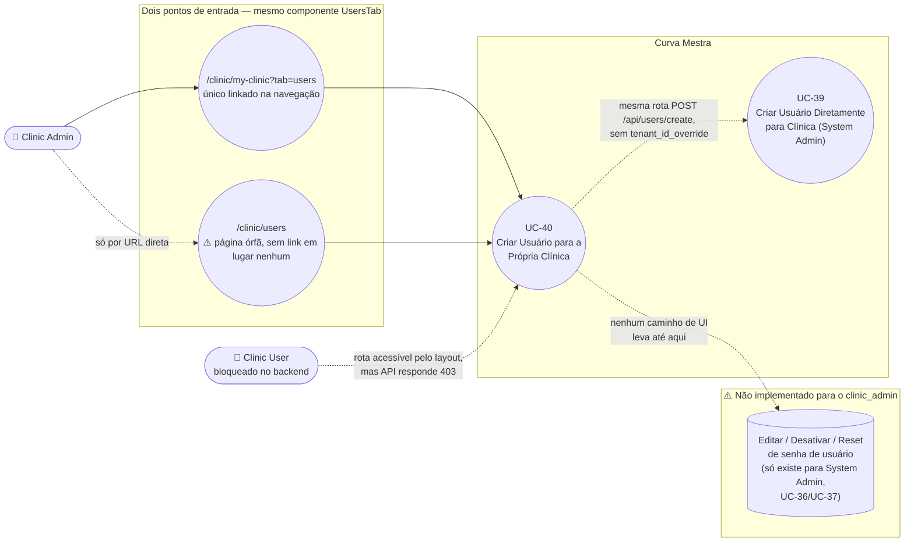

# UC-40: Criar Usuário para a Própria Clínica

**Projeto:** Curva Mestra
**Data de Criação:** 15/07/2026
**Autor:** Guilherme Scandelari (via uml-use-case-writer)
**Status:** Em Revisão
**Módulo/Contexto:** Administração da Clínica (Gestão de Usuários)
**Versão:** 1.0

> Um Clinic Admin, a partir do componente `UsersTab` (acessível pela aba "Usuários" de `/clinic/my-clinic` ou diretamente pela página órfã `/clinic/users`), lista os usuários da própria clínica e cria um novo usuário (`clinic_admin` ou `clinic_user`) para o próprio tenant — mesma rota de backend `POST /api/users/create` já documentada em UC-39, sem o parâmetro `tenant_id_override`. **Achado central confirmado:** este é o **único** ponto de gestão de usuários disponível para o `clinic_admin` sobre a própria clínica — não existe, em nenhum lugar do código, forma de editar, desativar/reativar ou redefinir/definir senha de um usuário já existente a partir do lado da clínica; as rotas que fariam isso (`reset-password`, `set-password`) existem, mas checam exclusivamente `is_system_admin`, bloqueando qualquer `clinic_admin` com 403.

---

## 1. Diagrama UML (Mermaid)

---

## 2. Atores

### 2.1 Ator Primário
**Clinic Admin** (`claims.role === 'clinic_admin'`, `claims.tenant_id` definido) — único ator que efetivamente consegue completar este caso de uso.

### 2.2 Atores Secundários / Sistemas Externos
- **Clinic User** (`claims.role === 'clinic_user'`) — tecnicamente consegue navegar até as telas (o layout `(clinic)` autoriza ambos os papéis, RN-03), mas é sempre bloqueado com 403 ao tentar submeter a criação, já que a API só aceita `clinic_admin` ou `system_admin`.
- **Firebase Auth (Admin SDK):** cria a conta (`adminAuth.createUser`) e define os custom claims (`adminAuth.setCustomUserClaims`), server-side — mesmo mecanismo de UC-39.
- **Cloud Function `onUserCreated`:** dispara na criação do documento `users/{uid}` e envia e-mail de boas-vindas genérico (sem senha) — mesmo comportamento de UC-39, RN-02 daquele UC.
- **Usuário-alvo recém-criado** — não recebe a senha por nenhum canal automático; depende do Clinic Admin comunicá-la por fora do sistema.

---

## 3. Pré-condições
- Clinic Admin autenticado, `claims.role === 'clinic_admin'`, `claims.tenant_id` definido.
- A quantidade de usuários já cadastrados para o tenant (coleção raiz `users`, `tenant_id === claims.tenant_id`, **incluindo inativos**) é menor que `tenants/{tenantId}.max_users` (padrão `5`, se o campo não existir) — senão o botão "Adicionar Usuário" fica desabilitado no client (RN-06).

---

## 4. Pós-condições

### 4.1 Sucesso
- Um novo usuário é criado no Firebase Auth (`adminAuth.createUser`) com o e-mail e a senha exatos informados pelo Clinic Admin no formulário, `emailVerified: false`.
- Custom claims definidas: `tenant_id` (sempre o próprio tenant do chamador, nunca outro — RN-01), `role` (`clinic_admin` ou `clinic_user`, escolhido no formulário, sem restrição adicional para criar outro `clinic_admin` — RN-07), `active: true`, `is_system_admin: false`. **Nunca é definida a claim `requirePasswordChange`** — o novo usuário nunca é obrigado a trocar a senha escolhida pelo admin (mesmo achado de UC-39, RN-03; UC-06 nunca é acionado por este caminho).
- Documento `users/{uid}` criado na coleção raiz do Firestore: `email`, `full_name`, `displayName`, `role`, `active: true`, `tenant_id`, `created_at`, `updated_at`.
- A criação do documento dispara `onUserCreated`, que envia um e-mail de boas-vindas genérico (nome, papel, botão "Acessar o Sistema") — **nunca a senha** (mesmo achado de UC-39, RN-02), apesar do texto do diálogo sugerir "o usuário receberá as credenciais para acessar o sistema".
- Sistema exibe a lista atualizada (`loadUsers()`), fecha o diálogo e limpa o formulário.

### 4.2 Falha (Garantias Mínimas)
- Validação client-side (RN-05) bloqueia a chamada à API se algum campo estiver vazio ou a senha tiver menos de 6 caracteres — nenhuma requisição é feita nesses casos.
- Se a API rejeitar (e-mail duplicado, senha fraca, limite de usuários atingido, token ausente/inválido, chamador sem permissão): nenhum usuário é criado, nenhum documento é escrito; mensagem de erro exibida em `Alert` no topo da tela; o diálogo permanece aberto.

---

## 5. Gatilho (Trigger)
Clinic Admin, na aba "Usuários" de `/clinic/my-clinic` (ou, alternativamente, na página órfã `/clinic/users`, RN-09), clica em "Adicionar Usuário" (desabilitado se `users.length >= maxUsers`), preenche o diálogo "Adicionar Novo Usuário" e clica em "Criar Usuário".

---

## 6. Fluxo Principal (Basic Flow)

1. Clinic Admin acessa a aba "Usuários" em `/clinic/my-clinic?tab=users` (única forma de chegar aqui a partir da navegação principal — `ClinicLayout.tsx` só lista o link "Minha Clínica") — ou, alternativamente, a URL direta `/clinic/users` (RN-09).
2. Sistema executa em paralelo `loadUsers()` — consulta `collection('users')` com `where('tenant_id', '==', tenantId)` e `orderBy('created_at', 'desc')`, autorizada pela regra `allow list` do Firestore (RN-04) — e `loadTenantInfo()` — lê `tenants/{tenantId}.max_users` (padrão `5`).
3. Sistema exibe três cards de contagem (Total de Usuários, Usuários Ativos, Administradores) e a tabela "Lista de Usuários" (nome, e-mail, badge de role, badge de status Ativo/Inativo, data de cadastro) — **somente leitura**: nenhuma linha da tabela possui ação de editar, desativar/reativar ou redefinir senha (RN-08 — achado central deste UC).
4. Clinic Admin clica em "Adicionar Usuário" (botão desabilitado quando `users.length >= maxUsers`, checagem client-side).
5. Sistema abre o diálogo "Adicionar Novo Usuário", com o texto "Crie um novo usuário para sua clínica. O usuário receberá as credenciais para acessar o sistema." (mesma promessa não cumprida documentada em UC-39, RN-02).
6. Clinic Admin preenche "Nome Completo", "Email", "Senha" e escolhe "Tipo de Usuário" (`Select`: "Usuário - Acesso básico" = `clinic_user`, padrão, ou "Administrador - Acesso completo" = `clinic_admin`).
7. Clinic Admin clica em "Criar Usuário".
8. Sistema valida no client (`handleCreateUser`): todos os três campos de texto obrigatórios; senha com no mínimo 6 caracteres (RN-05) — diferente de UC-39, que não tem nenhuma validação client-side equivalente.
9. Sistema obtém o Bearer token (`user.getIdToken()`) e chama `POST /api/users/create` com `{ email, displayName, password, role }` — **sem `tenant_id_override`**.
10. API valida o token; confirma `decodedToken.role === 'clinic_admin'`; como `tenant_id_override` está ausente, usa `tenantId = decodedToken.tenant_id` — o próprio tenant do chamador, nunca outro (RN-01).
11. API revalida campos obrigatórios e `role`; busca `tenants/{tenantId}`; conta usuários existentes (`users` filtrados por `tenant_id`, incluindo inativos) e compara com `max_users`; retorna 400 se o limite já foi atingido (mesma lógica correta documentada em UC-39, RN-04, RN-06).
12. API cria o usuário no Firebase Auth com a senha exata informada; define os custom claims (`tenant_id`, `role`, `active: true`, `is_system_admin: false`, sem `requirePasswordChange`); cria o documento `users/{uid}`.
13. A criação do documento dispara `onUserCreated`, que envia o e-mail de boas-vindas genérico (sem senha).
14. API retorna 201; sistema chama `loadUsers()` novamente, fecha o diálogo e limpa os campos do formulário (`newUser` volta ao estado inicial, `role` volta a `clinic_user`).
15. Caso de uso é concluído com sucesso.

---

## 7. Fluxos Alternativos

### 7a. Criar outro Clinic Admin para a própria clínica (a partir do passo 6)
1. Clinic Admin escolhe "Administrador - Acesso completo" no `Select` de "Tipo de Usuário" em vez de "Usuário".
2. Nenhuma checagem adicional ocorre — nem no client, nem na API — além da checagem de limite geral de usuários (RN-06): um `clinic_admin` pode criar quantos outros `clinic_admin` quiser para a própria clínica, sem confirmação extra e sem limite específico para esse papel (RN-07).
3. Retorna ao fluxo principal no passo 7.

---

## 8. Fluxos de Exceção

### 8a. Campos vazios ou senha curta (a partir do passo 8)
1. Algum campo de texto está vazio, ou a senha tem menos de 6 caracteres.
2. Sistema exibe "Todos os campos são obrigatórios" ou "A senha deve ter pelo menos 6 caracteres" em `Alert` destructive; nenhuma chamada à API é feita.

### 8b. E-mail já cadastrado no Firebase Auth (a partir do passo 12)
1. Firebase Auth retorna `auth/email-already-exists` (unicidade global, não por tenant — mesmo comportamento de UC-39, 8b).
2. API retorna 400 ("Este email já está cadastrado no sistema"); sistema exibe a mensagem no `Alert` da página.

### 8c. Senha rejeitada pelo Firebase Auth (a partir do passo 12)
1. Ainda que a validação client-side (RN-05) já exija 6+ caracteres, uma chamada direta à API (fora da UI) poderia disparar `auth/weak-password`.
2. API retorna 400 ("Senha muito fraca. Use pelo menos 6 caracteres").

### 8d. Limite de usuários atingido (a partir do passo 11)
1. `currentUserCount >= maxUsers` no momento da chamada à API (pode divergir do que a UI mostrava, se outro usuário foi criado entre o carregamento da tela e o clique).
2. API retorna 400 com `{ error, currentCount, maxUsers }`; sistema exibe a mensagem.

### 8e. Token ausente/inválido ou chamador sem permissão (a partir do passo 9)
1. Token ausente/inválido → API retorna 401.
2. `decodedToken.role !== 'clinic_admin'` e `is_system_admin !== true` (cenário do ator secundário `clinic_user`, RN-03) → API retorna 403 ("Apenas administradores podem criar usuários").

### 8f. Erro genérico não mapeado (a partir dos passos 12-13)
1. Qualquer outra exceção do Firebase Admin SDK.
2. API retorna 500 ("Erro ao criar usuário. Tente novamente.").

---

## 9. Regras de Negócio Relacionadas

| ID | Regra | Justificativa |
|----|-------|----------------|
| RN-01 | Este UC compartilha 100% da lógica de backend (`POST /api/users/create`) com UC-39, sem enviar `tenant_id_override` — a API sempre usa `decodedToken.tenant_id` como destino. Diferente do System Admin (UC-39, RN-07), um `clinic_admin` **nunca** consegue criar um usuário para outra clínica através deste fluxo, mesmo manipulando a chamada diretamente — o `tenant_id` vem do próprio token, não de um campo do formulário. | Confirmado por leitura da árvore de decisão de `tenantId` em `api/users/create/route.ts` (ramo `else if (isClinicAdmin)`). |
| RN-02 | **[Achado]** A variável `isAdmin` (`claims?.role === 'clinic_admin'`), declarada em `UsersTab.tsx` linha 69, nunca é referenciada em nenhum outro ponto do componente — não gate nem o botão "Adicionar Usuário", nem a tabela, nem nenhum outro elemento. Todo o gating de papel deste componente acontece **fora** dele: (a) `my-clinic/page.tsx` só renderiza a `TabsTrigger`/`TabsContent` de "Usuários" quando `isAdmin` é verdadeiro naquela página; (b) `clinic/users/page.tsx` usa um `useEffect` que redireciona um `clinic_user` para `/clinic/dashboard` — mas apenas **após** o primeiro render, deixando uma janela em que o `UsersTab` completo (incluindo "Adicionar Usuário") é renderizado antes do redirecionamento. | Confirmado por leitura completa de `UsersTab.tsx` (grep por `isAdmin` — uma única ocorrência, a declaração) e dos dois componentes wrapper. |
| RN-03 | Apesar do gap de RN-02, a submissão da criação por um `clinic_user` é bloqueada no backend: `POST /api/users/create` só aceita `role === 'clinic_admin'` ou `is_system_admin === true` — um `clinic_user` recebe 403, mesmo que consiga visualizar o diálogo momentaneamente. O layout `(clinic)` (`ProtectedRoute allowedRoles: ['clinic_admin', 'clinic_user']`) autoriza ambos os papéis a navegar até as rotas — a distinção de permissão específica desta ação é feita só pela API. | Confirmado por leitura de `src/app/(clinic)/layout.tsx` e do handler da API (mesmo trecho citado em UC-39). |
| RN-04 | **[Achado crítico de isolamento multi-tenant]** A regra do Firestore `allow list` para `users/{userId}` (`firestore.rules`, linhas 105-109) autoriza qualquer `clinic_admin` autenticado a executar uma consulta de listagem sobre **toda** a coleção `users`, exigindo apenas `request.auth.token.role == 'clinic_admin' && request.auth.token.tenant_id != null` — a condição não referencia `resource.data.tenant_id` em nenhum momento, apesar do comentário no próprio arquivo de regras dizer "A query deve ter where('tenant_id', '==', <seu_tenant_id>)". Esse filtro é hoje garantido **apenas por convenção no código-cliente** (é exatamente o `where('tenant_id', '==', tenantId)` que `loadUsers()` aplica em `UsersTab.tsx`), não pela regra em si. Uma consulta manual ao SDK do cliente sem esse filtro (ex.: via console do navegador, autenticado como `clinic_admin`) listaria, em tese, usuários de **qualquer** clínica do sistema. | Confirmado por leitura literal de `firestore.rules`, linhas 97-110 — ausência de qualquer cláusula equivalente a `resource.data.tenant_id == request.auth.token.tenant_id`. |
| RN-05 | Diferente de UC-39 (nenhuma validação client-side no diálogo equivalente), este diálogo valida no JavaScript (`handleCreateUser`) que os três campos de texto estão preenchidos e que a senha tem ao menos 6 caracteres, antes de chamar a API — ainda assim, nenhum `Input` usa atributos HTML nativos (`required`, `minLength`), a validação é inteiramente via JavaScript. | Confirmado por leitura completa de `handleCreateUser` e do JSX dos `Input`s. |
| RN-06 | A contagem de vagas (`canAddMoreUsers = users.length < maxUsers`) usa a mesma lista já carregada por `loadUsers()` — coleção raiz `users`, filtrada por `tenant_id`, **incluindo usuários inativos** — mesma fonte de verdade correta documentada em UC-39 (RN-04), sem o bug de `getTenantLimits()` descrito em UC-05 (RN-04, subcoleção `tenants/{id}/users` nunca escrita). O botão "Adicionar Usuário" é desabilitado no client quando o limite é atingido, mas a validação real é sempre revalidada no backend (passo 11). | Confirmado por leitura de `loadUsers`/`canAddMoreUsers` em `UsersTab.tsx` e da checagem equivalente e independente no backend. |
| RN-07 | **[Achado]** O `Select` "Tipo de Usuário" oferece tanto `clinic_user` quanto `clinic_admin`, sem nenhuma restrição adicional, confirmação extra, ou limite específico para a criação de outro `clinic_admin` — apenas o limite geral de `max_users` da clínica se aplica. | Confirmado por leitura das `SelectItem` disponíveis e da validação de `role` na API (aceita ambos os valores sem distinção de quem está criando). |
| RN-08 | **[Achado central deste UC]** Não existe, em nenhum componente do módulo `clinic`, nenhuma forma de editar, desativar/reativar, ou redefinir/definir senha de um usuário já existente da própria clínica — a tabela de `UsersTab.tsx` é somente leitura (nenhuma coluna de ações). As rotas que implementariam parte disso já existem no backend (`POST /api/users/[id]/reset-password`, `POST /api/users/[id]/set-password`), mas **ambas checam exclusivamente `decodedToken.is_system_admin === true`**, retornando 403 para qualquer `clinic_admin` que as chamasse — mesmo o próprio System Admin usa uma tela totalmente diferente (`admin/users`, UC-36/UC-37) para essas ações, nunca esta. A "gestão contínua" de usuários pelo `clinic_admin`, hoje, se resume a: listar (leitura) e criar. | Confirmado por leitura completa de `UsersTab.tsx` (nenhuma ação por linha) e dos dois handlers de senha (checagem `if (!decodedToken.is_system_admin)`, sem ramo alternativo para `clinic_admin`). |
| RN-09 | **[Achado]** A página `/clinic/users` não está referenciada em nenhum link de navegação do sistema — `ClinicLayout.tsx` só lista `/clinic/my-clinic` no menu — confirmada órfã por busca exaustiva por `"clinic/users"` em todo o `src/` (zero ocorrências fora do próprio arquivo da rota). Continua funcional se acessada diretamente pela URL, renderizando o mesmo `UsersTab`. | Confirmado por grep em `src/components/clinic/ClinicLayout.tsx` e busca exaustiva em `src/`. |
| RN-10 | Mesmo padrão dos demais fluxos de criação de usuário (UC-39): a claim `requirePasswordChange` nunca é definida, e o e-mail de boas-vindas (`onUserCreated`) nunca inclui a senha, apesar do texto do diálogo sugerir "o usuário receberá as credenciais para acessar o sistema" — mesma lacuna já registrada como achado crítico em UC-39 (RN-02, RN-03), reaplicada aqui por compartilharem a mesma rota de backend. | Consequência direta de RN-01 (mesma rota de UC-39) — sem verificação adicional necessária além da já feita naquele UC. |

---

## 10. Requisitos Especiais / Não Funcionais

| ID | Descrição | Categoria |
|----|-----------|-----------|
| RNF-01 | RN-04 é um risco de segurança/isolamento multi-tenant relevante: a regra do Firestore não impõe, por si só, que um `clinic_admin` só consiga listar usuários da própria clínica — depende inteiramente do código-cliente aplicar o filtro correto. | Segurança / Multi-tenant |
| RNF-02 | RN-02 (variável `isAdmin` não utilizada) é uma inconsistência defensiva: o único cenário em que ela importaria (a página órfã `/clinic/users`, acessada por um `clinic_user`) já é mitigado pelo backend (RN-03), mas a UI ainda pisca brevemente conteúdo destinado a administradores. | Segurança / Usabilidade |
| RNF-03 | RN-08 (ausência total de edição/desativação/reset de senha pelo lado do `clinic_admin`) limita a autonomia operacional da clínica: qualquer correção em um usuário já criado (nome errado, desativar um ex-funcionário, senha esquecida) depende de contato com o suporte/System Admin. | Usabilidade / Suporte |

---

## 11. Frequência de Uso
Ocasional — usado no onboarding de novos funcionários da clínica; mais frequente que operações administrativas do Portal Admin, mas não é uma ação do dia a dia.

---

## 12. Casos de Uso Relacionados
- **UC-39 (Criar Usuário Diretamente para uma Clínica via Painel Admin)** — mesma rota de backend (`POST /api/users/create`), mesmo comportamento de senha/e-mail (RN-10), distinguidos apenas por quem pode escolher o tenant-alvo (System Admin, via `tenant_id_override`, vs. Clinic Admin, sempre o próprio tenant — RN-01).
- **UC-05 ("Aprovar Solicitação de Acesso" pela Própria Clínica)** — já citava esta rota (`clinic/users/page.tsx` + `POST /api/users/create`) como o mecanismo real e válido para adicionar usuários à própria clínica, mas ainda sem UC formal dedicado; este UC-40 fecha essa lacuna (seção 12 de UC-05 atualizada nesta sessão para referenciar este documento).
- **UC-28 (Cadastrar Consultor)** — padrão comparável de "conta criada por um admin", mas com segurança mais completa (`requirePasswordChange: true` sempre) — este UC-40 não replica esse comportamento (RN-10), mesmo achado já documentado em UC-39.
- **UC-36 (Editar Usuário e Alterar Status Cross-Tenant)** e **UC-37 (Definir Senha do Usuário Manualmente)** — únicos lugares do sistema onde um usuário de clínica pode ser editado, ter o status alterado ou ter a senha redefinida/definida — e ambos são exclusivos do System Admin (`admin/users`), nunca acessíveis pelo `clinic_admin` (RN-08, achado central deste UC).
- **UC-06 (Trocar Senha Obrigatória no Primeiro Acesso)** — nunca é acionado por este fluxo (RN-10), mesmo achado de UC-39.

---

## 13. Referências
- `src/components/clinic/UsersTab.tsx` (listagem + criação, componente compartilhado pelos dois pontos de entrada)
- `src/app/(clinic)/clinic/users/page.tsx` (página órfã, RN-09)
- `src/app/(clinic)/clinic/my-clinic/page.tsx` (aba "Usuários", ponto de entrada real e único linkado na navegação)
- `src/app/(clinic)/layout.tsx` (`ProtectedRoute allowedRoles: ['clinic_admin', 'clinic_user']`)
- `src/components/clinic/ClinicLayout.tsx` (menu de navegação — só lista `/clinic/my-clinic`)
- `src/app/api/users/create/route.ts` (mesma rota documentada em UC-39)
- `src/app/api/users/[id]/reset-password/route.ts`, `src/app/api/users/[id]/set-password/route.ts` (confirmam ausência de acesso do `clinic_admin` — RN-08)
- `functions/src/onUserCreated.ts` (trigger `onDocumentCreated` em `users/{userId}`)
- `firestore.rules` (linhas 97-110, `match /users/{userId}`, RN-04)
- `src/types/index.ts` (`User`, `UserRole`, `CustomClaims`)

---

## 14. Perguntas em Aberto / Decisões Pendentes

1. **[RN-04, achado crítico de segurança — decisão de produto urgente]** A regra `allow list` de `users/{userId}` não impõe, na própria regra, que a consulta filtre por `tenant_id` — hoje isso é garantido só por convenção no código-cliente (`UsersTab.tsx`). Decisão pendente: corrigir a regra para exigir explicitamente esse filtro (ex.: usando restrições de `request.query` equivalentes ao padrão já usado em outras coleções do projeto) ou confirmar que este é um risco aceito, dado que nenhuma tela hoje monta essa consulta sem o filtro.
2. **[RN-08, achado de escopo — a pergunta mais importante deste documento]** Confirmado que o `clinic_admin` não tem nenhuma forma de editar, desativar/reativar ou redefinir/definir senha de um usuário já existente da própria clínica — apenas criar e listar. Isso contrasta com o padrão "criar separado; editar+status agrupado em um único UC" observado no Portal Admin (UC-29, UC-32, UC-36). Pergunta ao usuário: essa ausência é uma lacuna de produto genuína (deveria ser implementada uma tela análoga a UC-36/UC-37, mas escopada ao próprio tenant do `clinic_admin`) ou uma decisão consciente de produto (o `clinic_admin` deve contatar o suporte/System Admin para qualquer correção)? Sem essa resposta, não é possível mapear um "UC-41" de edição/status, porque não há nenhum código de referência para basear o documento — seria pura invenção de escopo, o que a regra fundamental deste processo proíbe.
3. **[RN-02]** A variável `isAdmin` em `UsersTab.tsx` é código morto — nunca usada para gating dentro do próprio componente. Hoje isso só importa na página órfã `/clinic/users` (RN-09), cujo redirect client-side pode deixar o botão "Adicionar Usuário" visível por um instante para um `clinic_user`, mesmo que a submissão real seja sempre bloqueada no backend (RN-03). Vale correção defensiva de UX/segurança?
4. **[RN-09]** A página `/clinic/users` está órfã (sem link de navegação). Decisão pendente: remover a rota (consolidando tudo na aba "Usuários" de `/clinic/my-clinic`) ou mantê-la como atalho direto documentado.
5. **[Herdado de UC-39, RN-02]** O texto do diálogo ("O usuário receberá as credenciais para acessar o sistema") não corresponde ao comportamento real (nenhuma senha é enviada por e-mail) — mesma decisão de produto pendente já registrada em UC-39, aplicável aqui por compartilhar a mesma rota de backend.

---

## 15. Histórico de Versões

| Versão | Data | Autor | O que mudou |
|--------|------|-------|--------------|
| 1.0 | 15/07/2026 | Guilherme Scandelari | Versão inicial, investigada do zero a partir de `UsersTab.tsx` e dos dois pontos de entrada (`clinic/users/page.tsx`, `my-clinic/page.tsx`). Confirmado que este é o único UC do módulo — diferente do padrão "criar separado + editar/status agrupado" do Portal Admin, porque a funcionalidade de editar/status/senha simplesmente **não existe** no código para o `clinic_admin` (RN-08, achado central, registrado como pendência em vez de UC inventado). Achados adicionais: `tenant_id` sempre o próprio do chamador, nunca alcançável para outra clínica (RN-01); variável `isAdmin` declarada mas nunca usada em `UsersTab.tsx` (RN-02), mitigada no backend pela checagem de role (RN-03); regra do Firestore `allow list` não impõe filtro de `tenant_id` na própria regra, dependendo só de convenção client-side — achado crítico de isolamento multi-tenant (RN-04); validação client-side presente aqui (diferente de UC-39, RN-05); contagem de limite de usuários correta, incluindo inativos (RN-06); nenhuma restrição para criar outro `clinic_admin` (RN-07); página `/clinic/users` confirmada órfã, sem link de navegação (RN-09); mesma lacuna de credenciais/senha de UC-39 (RN-10). |
