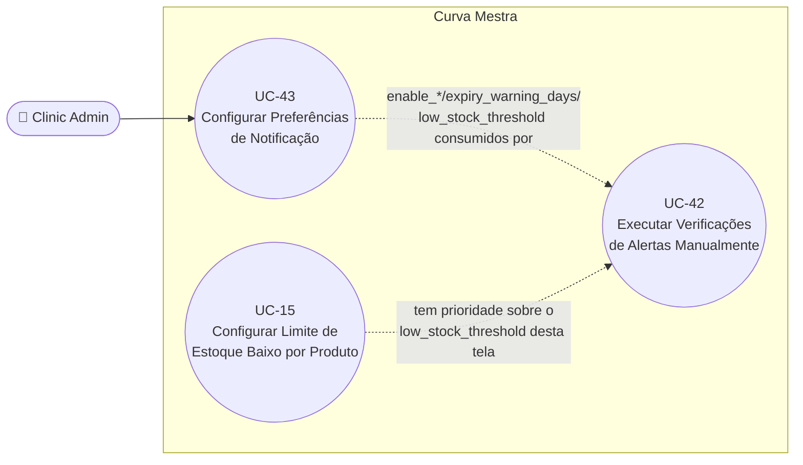

# UC-43: Configurar Preferências de Notificação

**Projeto:** Curva Mestra
**Data de Criação:** 15/07/2026
**Autor:** Guilherme Scandelari (via uml-use-case-writer)
**Status:** Rascunho
**Módulo/Contexto:** Notificações e Alertas
**Versão:** 1.1

> Um Clinic Admin define, em `/clinic/settings`, as preferências gerais de notificação do tenant: habilitar/desabilitar alertas de vencimento, estoque baixo e solicitações, os dias de antecedência para alerta de vencimento e o limite global (padrão) de estoque baixo. Essas preferências são o fallback usado pelas verificações automáticas de alerta (UC-42) quando não há um limite específico por produto (UC-15).

---

## 1. Diagrama UML (Mermaid)

---

## 2. Atores

### 2.1 Ator Primário
**Clinic Admin** — a página `ClinicSettingsPage` (`/clinic/settings`) verifica `claims?.role === 'clinic_admin'` e, se falso, renderiza apenas o `Alert` "Apenas administradores podem acessar as configurações", sem exibir nenhum formulário.

### 2.2 Atores Secundários / Sistemas Externos
Nenhum ator humano direto; indiretamente, as funções de verificação de alerta (`checkExpiringProducts`, `checkLowStock`, `checkExpiredProducts` em `alertTriggers.ts` — UC-42) leem essas configurações para decidir se e como gerar notificações.

---

## 3. Pré-condições
- Usuário autenticado com role `clinic_admin` e `tenant_id` definido.
- **Não há pré-condição de dado**: a própria tela tenta criar o documento de configurações se ele não existir (passo de inicialização), mas essa criação está quebrada (ver RN-01/RN-02 — bug confirmado).

---

## 4. Pós-condições

### 4.1 Sucesso (Garantias de Sucesso)
- O documento `tenants/{tenantId}/settings/notifications` é atualizado (`updateDoc`) com os campos: `enable_expiry_alerts`, `expiry_warning_days`, `enable_low_stock_alerts`, `low_stock_threshold`, `enable_request_alerts`, `notification_sound`, `email_notifications`, mais `tenant_id`, `updated_at`, `updated_by`.
- Um toast "Configurações salvas — Suas preferências foram atualizadas com sucesso." é exibido.
- Nenhum efeito colateral imediato: os novos valores só passam a valer na próxima execução de UC-42 (não há recálculo nem disparo automático de verificação).

### 4.2 Falha (Garantias Mínimas)
- Se `updateDoc` falhar (documento inexistente ou outro erro), um toast destrutivo "Erro ao salvar — Não foi possível salvar as configurações." é exibido e a mensagem de erro genérica "Erro ao salvar configurações" aparece no `Alert` da página. O estado em memória do formulário não é revertido — os valores editados permanecem visíveis, mas não persistidos.

---

## 5. Gatilho (Trigger)
Clinic Admin navega para `/clinic/settings` e altera um ou mais switches/campos numéricos, depois clica em "Salvar Configurações". **Assim como `/clinic/alerts` (UC-42), esta rota não é referenciada por nenhum link, item de menu ou botão em nenhuma outra tela do sistema** — nem no `ClinicLayout` (`navLinks`), nem nas abas de "Minha Clínica". O único caminho de acesso é a navegação direta de URL (RN-06).

---

## 6. Fluxo Principal (Basic Flow)

1. Clinic Admin acessa `/clinic/settings` diretamente pela URL.
2. Sistema confirma `claims.role === 'clinic_admin'` e chama `getNotificationSettings(tenantId)` (leitura de `tenants/{tenantId}/settings/notifications`).
3. Sistema exibe o formulário com os valores carregados, organizados em 4 blocos: "Alertas de Vencimento" (switch + dias de antecedência), "Alertas de Estoque Baixo" (switch + quantidade mínima padrão), "Alertas de Solicitações" (switch) e "Preferências de Notificação" (som; e-mail — desabilitado, "em breve").
4. Clinic Admin altera um ou mais campos: liga/desliga um switch, ou digita um novo valor numérico (dias de antecedência: 1-365; quantidade mínima: 1-1000, ambos via atributos HTML `min`/`max`, sem validação adicional no submit).
5. Clinic Admin clica em "Salvar Configurações".
6. Sistema chama `saveNotificationSettings(tenantId, settings, user.uid)`, que executa `updateDoc` em `tenants/{tenantId}/settings/notifications` com todos os campos do formulário mais `tenant_id`, `updated_at` (`Timestamp.now()`) e `updated_by` (uid do usuário).
7. Sistema exibe o toast de sucesso.
8. Caso de uso é concluído com sucesso.

---

## 7. Fluxos Alternativos

### 7a. Primeira configuração de um tenant sem documento existente (a partir do passo 2)
1. `getNotificationSettings` retorna `null` (documento `settings/notifications` ainda não existe para o tenant).
2. Sistema chama `initializeNotificationSettings(tenantId, user.uid)`, que tenta gravar `DEFAULT_NOTIFICATION_SETTINGS` (`enable_expiry_alerts: true`, `expiry_warning_days: 30`, `enable_low_stock_alerts: true`, `low_stock_threshold: 10`, `enable_request_alerts: true`, `notification_sound: true`, `email_notifications: false`) usando `updateDoc`.
3. **[Bug confirmado — ver RN-01]** `updateDoc` falha com erro `not-found`, pois o documento não existe e `updateDoc` nunca cria documentos (deveria ser `setDoc`). A exceção é capturada pelo `try/catch` de `loadSettings`, que exibe `setError('Erro ao carregar configurações')`.
4. A página nunca renderiza o formulário para este tenant — apenas o bloco de erro. Esse comportamento se repete em toda visita futura, pois `settings/notifications` continua inexistente.

### 7b. Switch desligado oculta o campo dependente (a partir do passo 4)
1. Clinic Admin desliga "Ativar alertas de vencimento" (ou "Ativar alertas de estoque baixo").
2. Sistema oculta imediatamente o campo numérico correspondente (`expiry_warning_days` ou `low_stock_threshold`) da UI, mas mantém o valor anterior em memória — se salvo, o campo oculto ainda é enviado com seu último valor (`settings` mantém o objeto completo).

---

## 8. Fluxos de Exceção

### 8a. Usuário não é Clinic Admin (a partir do passo 1)
1. `claims.role !== 'clinic_admin'`.
2. Sistema renderiza apenas o `Alert` "Apenas administradores podem acessar as configurações." — nenhum formulário é exibido, mesmo para leitura.

### 8b. Falha ao salvar em tenant já inicializado (a partir do passo 6)
1. `updateDoc` lança uma exceção diferente de `not-found` (rede, permissão, etc.) — ou até `not-found`, caso o documento nunca tenha sido criado com sucesso (ver 7a).
2. O `catch` de `handleSave` define `setError('Erro ao salvar configurações')` e exibe o toast destrutivo "Erro ao salvar".
3. **[Bug confirmado — ver RN-02]** Se o erro for `not-found`, o próprio `catch` interno de `saveNotificationSettings` tenta o fallback "criar com valores padrão" chamando `updateDoc` novamente (em vez de `setDoc`) — que falha pelo mesmo motivo, propagando a exceção normalmente para o `catch` de `handleSave` descrito acima.

---

## 9. Regras de Negócio Relacionadas

| ID | Regra | Justificativa |
|----|-------|----------------|
| RN-01 | **[Bug confirmado, potencialmente bloqueante]** `initializeNotificationSettings` usa `updateDoc` para criar o documento `tenants/{tenantId}/settings/notifications` quando ele não existe. `updateDoc` do Firestore Web SDK **exige que o documento já exista** — nunca cria um documento novo. Para um tenant cujo documento de configurações nunca foi criado por nenhum outro caminho do sistema (confirmado: não há nenhuma escrita desse documento fora de `notificationService.ts`, nem durante o cadastro de clínica em UC-21), a primeira visita a `/clinic/settings` falha permanentemente com erro "not-found", e a página nunca chega a exibir o formulário. | Confirmado por leitura literal de `initializeNotificationSettings` (usa `updateDoc`, não `setDoc`) e por busca em toda a base de código por outras escritas em `settings/notifications` — nenhuma encontrada fora deste arquivo. |
| RN-02 | **[Bug confirmado, mesma causa raiz de RN-01]** O fallback de `saveNotificationSettings` para o caso `error.code === 'not-found'` também usa `updateDoc` (em vez de `setDoc`) para tentar criar o documento — repetindo o mesmo erro e propagando a exceção sem sucesso. | Confirmado por leitura literal de `saveNotificationSettings` — o bloco `catch` que trata `not-found` chama `updateDoc` novamente. |
| RN-03 | O limite `low_stock_threshold` configurado aqui é o **segundo nível** do fallback de 3 níveis usado por `checkLowStock` (UC-42): limite específico do produto (`stock_limits`, UC-15) → `low_stock_threshold` (este UC) → 10 fixo. Ele **não** é usado pela UI de exibição de status de estoque (`getStatusEstoque`, badge — UC-13/UC-15), que usa um `?? 10` simples e nunca lê esta configuração. | Confirmado por leitura de `checkLowStock` (`stockLimitsMap.get(codigoProduto) ?? settings.low_stock_threshold ?? 10`) e de `inventoryUtils.getStatusEstoque` (não referencia `NotificationSettings`). |
| RN-04 | Salvar as preferências aqui **não** dispara nenhuma verificação, recálculo ou notificação imediata — os novos valores só têm efeito na próxima vez que UC-42 for executado manualmente. | Confirmado pela ausência de qualquer chamada a `alertTriggers.ts` dentro de `ClinicSettingsPage`/`notificationService.ts`. |
| RN-05 | O switch "Notificações por e-mail" é renderizado sempre desabilitado (`disabled`) com a legenda "em breve" — é um campo do tipo `NotificationSettings` (`email_notifications`) já persistido, mas sem nenhum efeito funcional confirmado em nenhuma outra parte do código (nenhum envio de e-mail de notificação foi encontrado consumindo esse campo). | Confirmado por leitura de `ClinicSettingsPage` (`disabled` no `Switch`) e por ausência de referências a `email_notifications` fora de `notification.ts`/`notificationService.ts`/`ClinicSettingsPage`. |
| RN-06 | **[Mesmo achado de UC-42/RN-06]** A rota `/clinic/settings` não é referenciada por nenhum link, `href` ou `router.push` em nenhuma outra tela do sistema. | Confirmado por busca textual em todo `src/` por `clinic/settings` e `/settings'` — a única outra ocorrência de um padrão parecido é `/admin/settings` (UC-35, rota diferente, módulo Admin). |
| RN-07 | Diferente de UC-15 (`stock_limits`, sem regra dedicada no Firestore), a coleção `tenants/{tenantId}/settings/notifications` **tem** regra dedicada: leitura permitida a qualquer usuário do tenant, mas escrita (`allow write`) restrita a `role == 'clinic_admin'` — consistente com o gate de UI desta tela. | Confirmado por leitura de `firestore.rules`, linhas 77-86. |

---

## 10. Requisitos Especiais / Não Funcionais

| ID | Descrição | Categoria |
|----|-----------|-----------|
| RNF-01 | O salvamento é feito em uma única chamada (`updateDoc` com todos os campos do formulário), não campo a campo. | Usabilidade |
| RNF-02 | Não há validação de erro visível para os campos numéricos além dos atributos HTML `min`/`max` do `<input type="number">` — não há checagem explícita de `NaN` ou de limites no `handleSave` (diferente de UC-15, que ao menos valida `isNaN`/`< 0` no frontend, ainda que sem feedback ao usuário). | Usabilidade |
| RNF-03 | Multi-tenant: leitura e escrita sempre escopadas por `tenants/{tenantId}/settings/notifications`, tanto no client (`tenantId` de `claims.tenant_id`) quanto na regra dedicada do Firestore. | Multi-tenant |

---

## 11. Frequência de Uso
Não determinável com confiança a partir do código — além de ser uma tela de configuração tipicamente ajustada com pouca frequência, o bug de RN-01 pode impedir que tenants novos sequer consigam usá-la na prática (ver seção 14).

---

## 12. Casos de Uso Relacionados
- **UC-42 (Executar Verificações de Alertas Manualmente)** — consome diretamente `enable_expiry_alerts`, `expiry_warning_days`, `enable_low_stock_alerts` e `low_stock_threshold` configurados aqui; se o documento de configurações não existir (RN-01), UC-42 trata a ausência exatamente como "tudo desabilitado" (fluxo 8b daquele UC).
- **UC-15 (Configurar Limite de Estoque Baixo por Produto)** — o limite `low_stock_threshold` definido aqui é apenas o *fallback* de segundo nível; um limite específico por produto configurado em UC-15 tem prioridade sobre ele em `checkLowStock`.
- **UC-13/UC-14 (Inventário)** — a exibição de status "Estoque Baixo" nessas telas **não** usa `low_stock_threshold`; usa apenas o limite por produto de UC-15 ou o fallback fixo 10, reforçando a divergência já documentada em UC-15/RN-03.
- **UC-44 (Consultar e Gerenciar Notificações Recebidas)** — o campo `notification_sound` configurado aqui **não** controla, na prática, o som tocado pelo `NotificationBell` (divergência confirmada em UC-44/RN-04, não relação funcional real).

---

## 13. Referências
- `src/app/(clinic)/clinic/settings/page.tsx` (`ClinicSettingsPage`)
- `src/lib/services/notificationService.ts` (`getNotificationSettings`, `saveNotificationSettings`, `initializeNotificationSettings`)
- `src/types/notification.ts` (`NotificationSettings`, `DEFAULT_NOTIFICATION_SETTINGS`)
- `src/lib/services/alertTriggers.ts` (consumidor real das configurações — UC-42)
- `firestore.rules` (linhas 77-86 — regra dedicada de `settings/notifications`)
- `src/components/clinic/ClinicLayout.tsx` (`navLinks` — ausência de link para `/clinic/settings`)

---

## 14. Perguntas em Aberto / Decisões Pendentes

⚠️ Os itens abaixo são achados confirmados por leitura de código que representam decisões de produto/bugs pendentes de confirmação — não foram decididos unilateralmente por este documento.

1. **[Bug confirmado, potencialmente bloqueante — requer decisão de prioridade]** RN-01/RN-02 — tanto `initializeNotificationSettings` quanto o fallback de `saveNotificationSettings` usam `updateDoc` em vez de `setDoc` para criar o documento de configurações. Para qualquer tenant cujo documento `settings/notifications` nunca foi criado por outro caminho, a tela `/clinic/settings` pode estar permanentemente quebrada (sempre cai em "Erro ao carregar configurações"). Isso deveria ser corrigido? Se sim, é prioritário, já que também bloqueia indiretamente UC-42 (fluxo 8b) para esses tenants.
2. **[Achado não solicitado, requer decisão]** RN-06 — assim como `/clinic/alerts` (UC-42), esta rota não é acessível por nenhum link da aplicação. É intencional ou um item de navegação esquecido?
3. **[Observação]** RN-05 — o campo "Notificações por e-mail" já é persistido no Firestore mas está sempre desabilitado na UI e sem nenhum consumidor funcional encontrado no código; é um recurso futuro conhecido (conforme o próprio texto "em breve" na tela) ou algo a ser removido/revisado?
4. **[Confirmado, sem impacto neste UC]** `session_timeout_minutes` e as demais configurações globais do sistema (UC-35, editadas por `system_admin` em `/admin/settings`) não têm nenhuma relação com este UC — são documentos e rotas completamente distintos (`admin/settings` vs. `clinic/settings`), confirmando a suposição do levantamento original.

---

## 15. Histórico de Versões

| Versão | Data | Autor | O que mudou |
|--------|------|-------|--------------|
| 1.0 | 15/07/2026 | Guilherme Scandelari | Versão inicial, investigada por leitura completa de `ClinicSettingsPage`, `notificationService.ts` (`getNotificationSettings`/`saveNotificationSettings`/`initializeNotificationSettings`), `notification.ts`, `firestore.rules` e busca em toda a base de código por outras escritas em `settings/notifications` e por links de navegação para `/clinic/settings`. Identificado bug confirmado e potencialmente bloqueante: tanto a inicialização quanto o fallback de salvamento usam `updateDoc` (que exige documento pré-existente) em vez de `setDoc`, o que pode impedir tenants novos de usar esta tela. Confirmado que `session_timeout_minutes`/UC-35 não têm nenhuma relação com este módulo. |
| 1.1 | 15/07/2026 | Guilherme Scandelari | Cross-reference: adicionada referência a UC-44 (Consultar e Gerenciar Notificações Recebidas) na seção 12, documentando que `notification_sound` não controla o som real do `NotificationBell`. |
