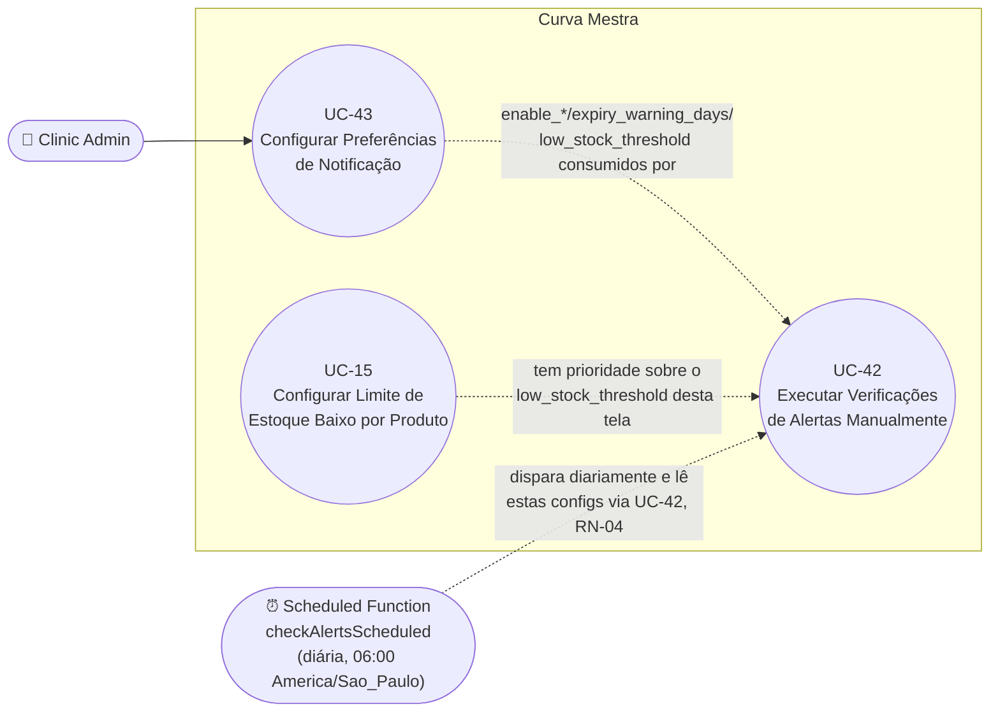

# UC-43: Configurar Preferências de Notificação

**Projeto:** Curva Mestra
**Data de Criação:** 15/07/2026
**Autor:** Guilherme Scandelari (via uml-use-case-writer)
**Status:** Rascunho
**Módulo/Contexto:** Notificações e Alertas
**Versão:** 1.4.0

> Um Clinic Admin define, em `/clinic/settings`, as preferências gerais de notificação do tenant: habilitar/desabilitar alertas de vencimento, estoque baixo e solicitações, os dias de antecedência para alerta de vencimento e o limite global (padrão) de estoque baixo. Essas preferências são o fallback usado pelas verificações de alerta (UC-42) — tanto o disparo manual quanto, desde o commit `0b647d8` (release v1.9.0), a execução automática diária às 06:00 (horário de Brasília) via a Scheduled Function `checkAlertsScheduled` (RN-04, **[ATUALIZADO]**) — quando não há um limite específico por produto (UC-15).

---

## 1. Diagrama UML (Mermaid)

```mermaid
flowchart LR
    ClinicAdmin([👤 Clinic Admin])
    Cron(["⏰ Scheduled Function\ncheckAlertsScheduled\n(diária, 06:00 America/Sao_Paulo)"])

    subgraph Sistema["Curva Mestra"]
        UC43(("UC-43\nConfigurar Preferências\nde Notificação"))
        UC42(("UC-42\nExecutar Verificações\nde Alertas Manualmente"))
        UC15(("UC-15\nConfigurar Limite de\nEstoque Baixo por Produto"))
    end

    ClinicAdmin --> UC43
    UC43 -.->|enable_*/expiry_warning_days/\nlow_stock_threshold consumidos por| UC42
    UC15 -.->|tem prioridade sobre o\nlow_stock_threshold desta tela| UC42
    Cron -.->|dispara diariamente e lê\nestas configs via UC-42, RN-04| UC42
```

---

## 2. Atores

### 2.1 Ator Primário
**Clinic Admin** — a página `ClinicSettingsPage` (`/clinic/settings`) verifica `claims?.role === 'clinic_admin'` e, se falso, renderiza apenas o `Alert` "Apenas administradores podem acessar as configurações", sem exibir nenhum formulário.

### 2.2 Atores Secundários / Sistemas Externos
Nenhum ator humano direto; indiretamente, as funções de verificação de alerta (`checkExpiringProducts`, `checkLowStock`, `checkExpiredProducts` em `alertTriggers.ts` — UC-42) leem essas configurações para decidir se e como gerar notificações — seja acionadas manualmente (UC-42) ou, desde o commit `0b647d8`, automaticamente pela Scheduled Function `checkAlertsScheduled` (RN-04, **[ATUALIZADO]**).

---

## 3. Pré-condições
- Usuário autenticado com role `clinic_admin` e `tenant_id` definido.
- **Não há pré-condição de dado**: a própria tela cria o documento de configurações com valores padrão se ele ainda não existir (passo de inicialização, ver fluxo 7a). Essa criação usa `setDoc` e tem sucesso mesmo para tenants novos (ver RN-01/RN-02 — corrigido em `a38e581`).

---

## 4. Pós-condições

### 4.1 Sucesso (Garantias de Sucesso)
- O documento `tenants/{tenantId}/settings/notifications` é atualizado (`updateDoc`) com os campos: `enable_expiry_alerts`, `expiry_warning_days`, `enable_low_stock_alerts`, `low_stock_threshold`, `enable_request_alerts`, `notification_sound`, `email_notifications`, mais `tenant_id`, `updated_at`, `updated_by`.
- Um toast "Configurações salvas — Suas preferências foram atualizadas com sucesso." é exibido.
- Nenhum efeito colateral imediato: salvar aqui não recalcula nem dispara nenhuma verificação instantânea. Os novos valores só passam a valer na próxima execução de UC-42 — seja o disparo manual (aba "Alertas"), seja a execução automática diária às 06:00 via a Scheduled Function `checkAlertsScheduled` (RN-04, **[ATUALIZADO]**) — ou seja, no pior caso, em até 24h mesmo sem nenhuma ação manual do Clinic Admin.

### 4.2 Falha (Garantias Mínimas)
- Se `updateDoc` falhar (documento inexistente ou outro erro), um toast destrutivo "Erro ao salvar — Não foi possível salvar as configurações." é exibido e a mensagem de erro genérica "Erro ao salvar configurações" aparece no `Alert` da página. O estado em memória do formulário não é revertido — os valores editados permanecem visíveis, mas não persistidos.

---

## 5. Gatilho (Trigger)
Clinic Admin navega para `/clinic/settings` e altera um ou mais switches/campos numéricos, depois clica em "Salvar Configurações". **Assim como `/clinic/alerts` (UC-42), esta rota não é referenciada por nenhum link, item de menu ou botão em nenhuma outra tela do sistema** — nem no `ClinicLayout` (`navLinks`), nem nas abas de "Minha Clínica". O único caminho de acesso é a navegação direta de URL (RN-06).

---

## 6. Fluxo Principal (Basic Flow)

1. Clinic Admin acessa `/clinic/settings` diretamente pela URL.
2. Sistema confirma `claims.role === 'clinic_admin'` e chama `getNotificationSettings(tenantId)` (leitura de `tenants/{tenantId}/settings/notifications`).
3. Sistema exibe o formulário com os valores carregados, organizados em 4 blocos: "Alertas de Vencimento" (switch + dias de antecedência), "Alertas de Estoque Baixo" (switch + quantidade mínima padrão), "Alertas de Solicitações" (switch) e "Preferências de Notificação" (som; e-mail — desabilitado, "em breve").
4. Clinic Admin altera um ou mais campos: liga/desliga um switch, ou digita um novo valor numérico (dias de antecedência: 1-365; quantidade mínima: 1-1000, ambos via atributos HTML `min`/`max`, sem validação adicional no submit).
5. Clinic Admin clica em "Salvar Configurações".
6. Sistema chama `saveNotificationSettings(tenantId, settings, user.uid)`, que executa `updateDoc` em `tenants/{tenantId}/settings/notifications` com todos os campos do formulário mais `tenant_id`, `updated_at` (`Timestamp.now()`) e `updated_by` (uid do usuário).
7. Sistema exibe o toast de sucesso.
8. Caso de uso é concluído com sucesso.

---

## 7. Fluxos Alternativos

### 7a. Primeira configuração de um tenant sem documento existente (a partir do passo 2)
1. `getNotificationSettings` retorna `null` (documento `settings/notifications` ainda não existe para o tenant).
2. Sistema chama `initializeNotificationSettings(tenantId, user.uid)`, que grava `DEFAULT_NOTIFICATION_SETTINGS` (`enable_expiry_alerts: true`, `expiry_warning_days: 30`, `enable_low_stock_alerts: true`, `low_stock_threshold: 10`, `enable_request_alerts: true`, `notification_sound: true`, `email_notifications: false`) usando `setDoc`, criando o documento com sucesso mesmo que ele nunca tenha existido antes.
3. A página renderiza o formulário normalmente, já preenchido com os valores padrão, permitindo que o Clinic Admin siga o fluxo principal a partir do passo 4.
4. **[Nota histórica — bug corrigido]** Até o commit `a38e581` (branch `bugfix/notification-settings-setdoc`), `initializeNotificationSettings` usava `updateDoc` em vez de `setDoc`. Como `updateDoc` exige que o documento já exista, a chamada falhava com erro `not-found` para qualquer tenant novo, era capturada pelo `try/catch` de `loadSettings`, que exibia `setError('Erro ao carregar configurações')`, e a página nunca chegava a renderizar o formulário — comportamento que se repetia em toda visita futura enquanto o documento não existisse. Ver RN-01.

### 7b. Switch desligado oculta o campo dependente (a partir do passo 4)
1. Clinic Admin desliga "Ativar alertas de vencimento" (ou "Ativar alertas de estoque baixo").
2. Sistema oculta imediatamente o campo numérico correspondente (`expiry_warning_days` ou `low_stock_threshold`) da UI, mas mantém o valor anterior em memória — se salvo, o campo oculto ainda é enviado com seu último valor (`settings` mantém o objeto completo).

---

## 8. Fluxos de Exceção

### 8a. Usuário não é Clinic Admin (a partir do passo 1)
1. `claims.role !== 'clinic_admin'`.
2. Sistema renderiza apenas o `Alert` "Apenas administradores podem acessar as configurações." — nenhum formulário é exibido, mesmo para leitura.

### 8b. Falha ao salvar (a partir do passo 6)
1. `updateDoc` lança uma exceção diferente de `not-found` (rede, permissão, etc.).
2. O `catch` de `handleSave` define `setError('Erro ao salvar configurações')` e exibe o toast destrutivo "Erro ao salvar".
3. **Caso especial (não é mais falha) — documento inexistente no momento do save:** se `updateDoc` falhar com `error.code === 'not-found'` (ex.: documento removido externamente entre o carregamento e o salvamento, ou qualquer cenário em que o passo 2 do fluxo principal não tenha sido precedido pela inicialização de 7a), o `catch` interno de `saveNotificationSettings` executa o fallback `setDoc`, criando o documento com `DEFAULT_NOTIFICATION_SETTINGS` combinado com os valores do formulário — o salvamento é concluído com sucesso e o fluxo segue para o passo 7 do fluxo principal, sem exibir o toast de erro.
4. **[Nota histórica — bug corrigido]** Até o commit `a38e581`, o fallback de `saveNotificationSettings` para `error.code === 'not-found'` também usava `updateDoc` em vez de `setDoc`, repetindo o mesmo erro e propagando a exceção para o `catch` de `handleSave` (passos 1-2 acima) em vez de recuperar com sucesso. Ver RN-02.

---

## 9. Regras de Negócio Relacionadas

| ID | Regra | Justificativa |
|----|-------|----------------|
| RN-01 | `initializeNotificationSettings` usa `setDoc` para criar o documento `tenants/{tenantId}/settings/notifications` quando ele ainda não existe, garantindo que a primeira visita a `/clinic/settings` sempre resulte na criação bem-sucedida do documento de configurações com os valores padrão, mesmo para tenants novos cujo documento nunca foi criado por nenhum outro caminho do sistema. **[Histórico]** Até o commit `a38e581` (branch `bugfix/notification-settings-setdoc`), esta função usava `updateDoc`, que exige que o documento já exista e nunca cria um documento novo — a primeira visita de qualquer tenant novo falhava permanentemente com erro `not-found`, e a página nunca chegava a exibir o formulário. Corrigido substituindo `updateDoc` por `setDoc`. | Confirmado por leitura literal de `initializeNotificationSettings` em `notificationService.ts` (linha 103, `setDoc`) na branch `bugfix/notification-settings-setdoc`, commit `a38e581`. |
| RN-02 | O fallback de `saveNotificationSettings` para o caso `error.code === 'not-found'` também usa `setDoc` (não mais `updateDoc`) para criar o documento combinando `DEFAULT_NOTIFICATION_SETTINGS` com os valores enviados pelo formulário — o salvamento é concluído com sucesso mesmo se o documento não existir no momento do save (ex.: documento removido externamente entre o carregamento e o salvamento). **[Histórico]** Mesma causa raiz de RN-01: até `a38e581`, este fallback também usava `updateDoc` e repetia o mesmo erro, propagando a exceção sem sucesso para quem chamou `saveNotificationSettings`. | Confirmado por leitura literal de `saveNotificationSettings` em `notificationService.ts` (linha 79, `setDoc` dentro do bloco `catch` que trata `not-found`). |
| RN-03 | O limite `low_stock_threshold` configurado aqui é o **segundo nível** do fallback de 3 níveis usado por `checkLowStock` (UC-42): limite específico do produto (`stock_limits`, UC-15) → `low_stock_threshold` (este UC) → 10 fixo. Ele **não** é usado pela UI de exibição de status de estoque (`getStatusEstoque`, badge — UC-13/UC-15), que usa um `?? 10` simples e nunca lê esta configuração. | Confirmado por leitura de `checkLowStock` (`stockLimitsMap.get(codigoProduto) ?? settings.low_stock_threshold ?? 10`) e de `inventoryUtils.getStatusEstoque` (não referencia `NotificationSettings`). |
| RN-04 | Salvar as preferências aqui **não** dispara nenhuma verificação, recálculo ou notificação imediata — não há chamada síncrona a `alertTriggers.ts` dentro de `ClinicSettingsPage`/`notificationService.ts`, e os novos valores não têm efeito instantâneo. **[Atualizado — antes descrito como "só efeito na próxima execução manual de UC-42"]** Desde o commit `0b647d8` (branch `feature/scheduled-alert-checks`, release v1.9.0), a Scheduled Function `checkAlertsScheduled` (`functions/src/checkAlertsScheduled.ts`, `onSchedule`, cron diário `'0 6 * * *'`, `timeZone: 'America/Sao_Paulo'`) chama `runChecksForAllTenants` (`functions/src/alertChecks.ts`) uma vez por dia para todos os tenants ativos, e essa execução lê exatamente o mesmo documento `tenants/{tenantId}/settings/notifications` escrito por este UC (via `getNotificationSettings`, espelho Admin SDK). Ou seja: os novos valores agora têm efeito automático, sem nenhuma ação manual do Clinic Admin — o efeito deixa de depender de alguém acionar `/clinic/alerts` manualmente, mas continua não sendo instantâneo: no pior caso, entra em vigor em até 24h, na próxima execução às 06:00. Mesma resolução documentada em UC-42/RN-05 e UC-15/RN-05. | Confirmado pela ausência de qualquer chamada síncrona a `alertTriggers.ts` dentro de `ClinicSettingsPage`/`notificationService.ts` (efeito imediato ao salvar) e por leitura de `functions/src/checkAlertsScheduled.ts`/`functions/src/alertChecks.ts` (`runChecksForAllTenants` chama `getNotificationSettings`, que lê `tenants/{tenantId}/settings/notifications`). |
| RN-05 | O switch "Notificações por e-mail" é renderizado sempre desabilitado (`disabled`) com a legenda "em breve" — é um campo do tipo `NotificationSettings` (`email_notifications`) já persistido, mas sem nenhum efeito funcional confirmado em nenhuma outra parte do código (nenhum envio de e-mail de notificação foi encontrado consumindo esse campo). | Confirmado por leitura de `ClinicSettingsPage` (`disabled` no `Switch`) e por ausência de referências a `email_notifications` fora de `notification.ts`/`notificationService.ts`/`ClinicSettingsPage`. |
| RN-06 | **[Mesmo achado de UC-42/RN-06]** A rota `/clinic/settings` não é referenciada por nenhum link, `href` ou `router.push` em nenhuma outra tela do sistema. Isso deixou de ser a única forma de as configurações aqui salvas serem consumidas desde a RN-04 passar a incluir a execução automática diária — mas a tela em si continua não linkada, e configurá-la pela primeira vez ainda depende de navegação direta por URL. | Confirmado por busca textual em todo `src/` por `clinic/settings` e `/settings'` — a única outra ocorrência de um padrão parecido é `/admin/settings` (UC-35, rota diferente, módulo Admin). |
| RN-07 | **[CORRIGIDO — PR #344, commits `f3ce046` (restrição inicial) + `94cbe2e` (correção de regressão em `list`/query), branch `bugfix/firestore-rules-tenant-role-enforcement`, mergeado em `gscandelari_setup`, deploy confirmado em `curva-mestra-dev`]** Diferente de UC-15 (`stock_limits`, sem regra dedicada no Firestore), a coleção `tenants/{tenantId}/settings/notifications` **tem** regra dedicada: leitura permitida a qualquer usuário do tenant, mas escrita (`allow write`) restrita a `role == 'clinic_admin'` — consistente com o gate de UI desta tela. Até o PR #344, essa regra dedicada era inefetiva na prática — a regra genérica de subcoleção do tenant (`tenants/{tenantId}/{document=**}`) concedia escrita a qualquer usuário do tenant via semântica OR do Firestore. **Corrigido**: a regra genérica passou a usar `match /tenants/{tenantId}/{collectionId}/{document=**}` e deixou de conceder `write` — a regra dedicada de `settings/notifications`, que já existia e não precisou de nenhuma alteração própria, passou a ser o único caminho de escrita efetivo: um `clinic_user` não consegue mais alterar as configurações de notificação chamando o Firestore diretamente. Não se aplica à execução automática (RN-04), que roda com credenciais Admin SDK (bypass de regras do Firestore) e apenas lê, nunca escreve, este documento. | Confirmado por leitura de `firestore.rules` pós-deploy — regra genérica de subcoleção do tenant (sem `write`) e regra dedicada de `settings/notifications` (escrita restrita a `clinic_admin`), agora efetiva; cross-referência com UC-13/RN-09 (detalhamento técnico completo da história do fix em duas etapas). |
| RN-08 | **[Divergência parcialmente resolvida — automação implementada, escalonamento ainda ausente]** A landing page (`ONLY_FOR_DEVS/new_landing_page/sections-product.jsx`, módulo `id: "inventario"` do array `MODULES`) promete, na `desc` do módulo (linha 96), "**Alertas automáticos de vencimento**" e, em um dos `bullets` (linha 99), "**Validade com alertas de 60/30/15 dias**". Das duas promessas: **(a) agora verdadeira** — desde o commit `0b647d8` (RN-04 deste UC, **[ATUALIZADO]**) existe de fato uma automação diária (`checkAlertsScheduled`, Scheduled Function às 06:00) que lê as configurações salvas nesta tela e gera alertas de vencimento sem nenhuma ação manual do Clinic Admin; **(b) continua falsa** — o que esta tela efetivamente permite configurar continua sendo um único campo `expiry_warning_days` (padrão `30`, ver fluxo 7a), não três estágios fixos de 60/30/15 dias; não existe nenhum mecanismo de escalonamento em múltiplos limiares nesta tela nem na verificação (manual ou automática). Ver também UC-42/RN-08 (mesma divergência, do ponto de vista da execução dos checks — cross-referenciada). | Confirmado por leitura literal de `sections-product.jsx` (linhas 96 e 99), releitura de `ClinicSettingsPage` e `notificationService.ts` (`DEFAULT_NOTIFICATION_SETTINGS.expiry_warning_days: 30`, campo único, sem estrutura de múltiplos limiares) e de `functions/src/checkAlertsScheduled.ts`/`functions/src/alertChecks.ts` (confirmando a automação real desde `0b647d8`, reconfirmando RN-04 deste UC). |

---

## 10. Requisitos Especiais / Não Funcionais

| ID | Descrição | Categoria |
|----|-----------|-----------|
| RNF-01 | O salvamento é feito em uma única chamada (`updateDoc` com todos os campos do formulário), não campo a campo. | Usabilidade |
| RNF-02 | Não há validação de erro visível para os campos numéricos além dos atributos HTML `min`/`max` do `<input type="number">` — não há checagem explícita de `NaN` ou de limites no `handleSave` (diferente de UC-15, que ao menos valida `isNaN`/`< 0` no frontend, ainda que sem feedback ao usuário). | Usabilidade |
| RNF-03 | Multi-tenant: leitura e escrita sempre escopadas por `tenants/{tenantId}/settings/notifications`, tanto no client (`tenantId` de `claims.tenant_id`) quanto na regra dedicada do Firestore. A execução automática (RN-04) usa o Admin SDK (bypass de regras), mas mantém o mesmo escopo lógico ao iterar `tenants/{tenantId}/...` explicitamente para cada tenant ativo. | Multi-tenant |

---

## 11. Frequência de Uso
Não determinável com confiança a partir do código — é uma tela de configuração tipicamente ajustada com pouca frequência, agora que a criação do documento de configurações (RN-01/RN-02) funciona corretamente para tenants novos. **[Nota adicionada nesta revisão]** O consumo das configurações aqui salvas, por outro lado, agora ocorre pelo menos uma vez por dia desde a RN-04 (**[ATUALIZADO]**) — a Scheduled Function `checkAlertsScheduled` lê estas mesmas preferências automaticamente às 06:00, além de qualquer execução manual via UC-42.

---

## 12. Casos de Uso Relacionados
- **UC-42 (Executar Verificações de Alertas Manualmente)** — consome diretamente `enable_expiry_alerts`, `expiry_warning_days`, `enable_low_stock_alerts` e `low_stock_threshold` configurados aqui, seja no disparo manual (aba "Alertas") ou na execução automática diária via `checkAlertsScheduled` (RN-04); se o documento de configurações não existir (RN-01), UC-42 trata a ausência exatamente como "tudo desabilitado" (fluxo 8b daquele UC), nos dois modos de disparo.
- **UC-15 (Configurar Limite de Estoque Baixo por Produto)** — o limite `low_stock_threshold` definido aqui é apenas o *fallback* de segundo nível; um limite específico por produto configurado em UC-15 tem prioridade sobre ele em `checkLowStock`, tanto na execução manual quanto na automática.
- **UC-13/UC-14 (Inventário)** — a exibição de status "Estoque Baixo" nessas telas **não** usa `low_stock_threshold`; usa apenas o limite por produto de UC-15 ou o fallback fixo 10, reforçando a divergência já documentada em UC-15/RN-03.
- **UC-44 (Consultar e Gerenciar Notificações Recebidas)** — o campo `notification_sound` configurado aqui **não** controla, na prática, o som tocado pelo `NotificationBell` (divergência confirmada em UC-44/RN-04, não relação funcional real). O mesmo achado estrutural de regra dedicada antes inefetiva por semântica OR (RN-07 deste UC) também se aplica à regra de `delete` de UC-44/RN-02 — ambas corrigidas em conjunto no PR #344.

---

## 13. Referências
- `src/app/(clinic)/clinic/settings/page.tsx` (`ClinicSettingsPage`)
- `src/lib/services/notificationService.ts` (`getNotificationSettings`, `saveNotificationSettings`, `initializeNotificationSettings`)
- `src/types/notification.ts` (`NotificationSettings`, `DEFAULT_NOTIFICATION_SETTINGS`)
- `src/lib/services/alertTriggers.ts` (consumidor real das configurações no disparo manual — UC-42)
- `functions/src/checkAlertsScheduled.ts` (Scheduled Function `onSchedule`, cron diário `'0 6 * * *'`, `timeZone: 'America/Sao_Paulo'`, commit `0b647d8` — consumidor real das configurações na execução automática, RN-04)
- `functions/src/alertChecks.ts` (espelho Admin SDK de `alertTriggers.ts`, usado pela Scheduled Function; chama `getNotificationSettings` para ler as configurações salvas neste UC)
- `firestore.rules` (regra genérica de subcoleção do tenant agora `tenants/{tenantId}/{collectionId}/{document=**}`, sem `write`; regra dedicada de `settings/notifications` (escrita restrita a `clinic_admin`) agora efetiva de verdade — RN-07, corrigido no PR #344, commits `f3ce046`/`94cbe2e`)
- `src/components/clinic/ClinicLayout.tsx` (`navLinks` — ausência de link para `/clinic/settings`)
- Commit `a38e581` (`fix(notifications): use setDoc to create tenant notification settings`, branch `bugfix/notification-settings-setdoc`) — correção de RN-01/RN-02
- Commit `0b647d8` (branch `feature/scheduled-alert-checks`, PR #299, release v1.9.0) — criação da Scheduled Function `checkAlertsScheduled`, que passou a consumir estas configurações automaticamente uma vez por dia (RN-04)

---

## 14. Perguntas em Aberto / Decisões Pendentes

⚠️ Os itens abaixo são achados confirmados por leitura de código que representam decisões de produto/bugs pendentes de confirmação — não foram decididos unilateralmente por este documento.

1. **[RESOLVIDO — corrigido em `a38e581`]** RN-01/RN-02 — tanto `initializeNotificationSettings` quanto o fallback de `saveNotificationSettings` usavam `updateDoc` em vez de `setDoc` para criar o documento de configurações, o que quebrava permanentemente `/clinic/settings` para qualquer tenant novo. Ambos os pontos foram corrigidos para usar `setDoc` no commit `a38e581` (branch `bugfix/notification-settings-setdoc`), confirmado por leitura direta de `notificationService.ts`. Não requer mais decisão.
2. **[Achado não solicitado, requer decisão]** RN-06 — assim como `/clinic/alerts` (UC-42), esta rota não é acessível por nenhum link da aplicação. É intencional ou um item de navegação esquecido? Permanece em aberto mesmo após a RN-04 (execução automática não depende dessa navegação para ler as configurações já salvas, mas configurá-las pela primeira vez ainda depende de acesso direto por URL).
3. **[Observação]** RN-05 — o campo "Notificações por e-mail" já é persistido no Firestore mas está sempre desabilitado na UI e sem nenhum consumidor funcional encontrado no código; é um recurso futuro conhecido (conforme o próprio texto "em breve" na tela) ou algo a ser removido/revisado?
4. **[Confirmado, sem impacto neste UC]** `session_timeout_minutes` e as demais configurações globais do sistema (UC-35, editadas por `system_admin` em `/admin/settings`) não têm nenhuma relação com este UC — são documentos e rotas completamente distintos (`admin/settings` vs. `clinic/settings`), confirmando a suposição do levantamento original.
5. **[RESOLVIDO nesta revisão — parte "automação" da divergência]** RN-08 — a landing page promete "alertas automáticos de vencimento" (`sections-product.jsx`, linha 96): isso deixou de ser uma decisão de produto em aberto, pois a Scheduled Function `checkAlertsScheduled` (commit `0b647d8`) já existe e já lê estas configurações automaticamente uma vez por dia (RN-04, **[ATUALIZADO]**) — mesmo fechamento documentado em UC-42/RN-05 e UC-15/RN-05. **Continua genuinamente em aberto**, sem relação com a automação: o escalonamento fixo de três estágios "60/30/15 dias" (`sections-product.jsx`, linha 99) nunca foi implementado — esta tela só permite configurar um único limiar (`expiry_warning_days`). Duas opções não excludentes entre si seguem identificadas, mas nenhuma foi escolhida por este documento: (a) evoluir este UC para suportar de fato três estágios configuráveis (60/30/15); ou (b) ajustar o texto da landing page para refletir o limiar único hoje existente. Decisão de produto pendente — não decidida aqui.
6. **[RESOLVIDO em v1.4.0 — PR #344, commits `f3ce046`/`94cbe2e`]** RN-07 — a regra dedicada de escrita em `settings/notifications` restrita a `clinic_admin`, antes inefetiva na prática, agora é o único caminho de escrita efetivo: a regra genérica de subcoleção do tenant deixou de conceder `write`. Este achado estava registrado com severidade Alta no mapa de bugs (`_MAPA-DE-BUGS-E-MELHORIAS.md`, UC-13-RN-09/UC-15-RN-07) e foi corrigido em conjunto com UC-13/RN-09, UC-15/RN-07, UC-20/RN-07, UC-42/RN-01 e UC-44/RN-02.

---

## 15. Histórico de Versões

| Versão | Data | Autor | O que mudou |
|--------|------|-------|--------------|
| 1.0 | 15/07/2026 | Guilherme Scandelari | Versão inicial, investigada por leitura completa de `ClinicSettingsPage`, `notificationService.ts` (`getNotificationSettings`/`saveNotificationSettings`/`initializeNotificationSettings`), `notification.ts`, `firestore.rules` e busca em toda a base de código por outras escritas em `settings/notifications` e por links de navegação para `/clinic/settings`. Identificado bug confirmado e potencialmente bloqueante: tanto a inicialização quanto o fallback de salvamento usam `updateDoc` (que exige documento pré-existente) em vez de `setDoc`, o que pode impedir tenants novos de usar esta tela. Confirmado que `session_timeout_minutes`/UC-35 não têm nenhuma relação com este módulo. |
| 1.1 | 15/07/2026 | Guilherme Scandelari | Cross-reference: adicionada referência a UC-44 (Consultar e Gerenciar Notificações Recebidas) na seção 12, documentando que `notification_sound` não controla o som real do `NotificationBell`. |
| 1.2 | 15/07/2026 | Guilherme Scandelari | Adicionada RN-08 documentando divergência confirmada entre a promessa da landing page (`sections-product.jsx`, módulo "Inventário inteligente", linhas 96 e 99 — "alertas automáticos de vencimento" e "60/30/15 dias") e o comportamento real (único limiar configurável `expiry_warning_days`, sem automação — RN-04), com referência cruzada a UC-42/RN-08. Adicionado item 5 na seção 14 registrando as duas opções de decisão de produto (evoluir a feature vs. ajustar a landing page), sem decidir entre elas. |
| 1.2.1 | 16/07/2026 | Guilherme Scandelari | Correção pontual: confirmado por leitura de `notificationService.ts` que o bug de RN-01/RN-02 (`updateDoc` em vez de `setDoc` na criação do documento de configurações) foi corrigido no commit `a38e581` (branch `bugfix/notification-settings-setdoc`) — ambos os pontos agora usam `setDoc`. Reescritas RN-01/RN-02 (seção 9) para descrever o comportamento correto atual, preservando o histórico do bug corrigido. Ajustados o fluxo alternativo 7a e o fluxo de exceção 8b (seção 8) para refletir que a inicialização e o fallback de salvamento agora têm sucesso em vez de falhar permanentemente; a nota sobre o bug antigo foi movida para observações históricas dentro desses próprios fluxos. Item 1 da seção 14 marcado como resolvido. Seção 11 (Frequência de Uso) ajustada para remover a ressalva de que o bug poderia impedir o uso da tela por tenants novos. Nenhuma alteração feita em UC-42 ou nas decisões de navegação/automação já registradas (fora do escopo desta correção). |
| 1.2.2 | 25/07/2026 | Guilherme Scandelari (via uml-use-case-writer) | **Ressalva de precisão factual, sem correção de código.** RN-07 (seção 9) passou a deixar explícito que a regra dedicada de escrita restrita a `clinic_admin` em `settings/notifications` (`firestore.rules`, linhas 77-86), embora exista no arquivo e não tenha sido alterada, é hoje **inefetiva na prática**: a regra genérica de subcoleção do tenant (`tenants/{tenantId}/{document=**}`, linhas 58-67) já concede a mesma escrita a qualquer usuário do tenant via semântica OR do Firestore (regras que casam o mesmo caminho são combinadas com OR, não com "mais específica vence") — um `clinic_user` poderia, tecnicamente, alterar as configurações de notificação chamando a API do Firestore diretamente. A proteção real hoje é apenas o gate de UI da tela. Achado cross-referenciado com o item de severidade Alta consolidado no mapa de bugs (UC-13-RN-09/UC-15-RN-07), com correção adiada. Adicionado item 6 na seção 14, atualizadas as referências (seção 13) e a seção 12 (cross-reference com UC-44/RN-02). |
| 1.3.0 | 29/09/2026 | Guilherme Scandelari (via uml-use-case-writer) | **Fechamento da metade "automação" de RN-04/RN-08 — mesma resolução já documentada em UC-42/RN-05 e UC-15/RN-05.** RN-04 (seção 9) reescrita: salvar as preferências continua sem efeito imediato/síncrono, mas desde o commit `0b647d8` (release v1.9.0) a Scheduled Function `checkAlertsScheduled` lê automaticamente estas mesmas configurações uma vez por dia (06:00, horário de Brasília) para todos os tenants ativos, sem depender de nenhuma execução manual de UC-42. RN-08 atualizada para refletir que a promessa de "alertas automáticos" da landing page é **agora verdadeira**; a promessa de escalonamento "60/30/15 dias" **continua falsa** — não há relação entre as duas metades da divergência. RN-06 e RN-07 receberam nota de que não são afetadas pela automação (RN-06: a tela continua não linkada para configuração inicial; RN-07: a execução automática usa Admin SDK e só lê, nunca escreve, o documento). Item 5 da seção 14 fechado quanto à automação (cross-ref UC-42/RN-05, UC-15/RN-05), mantendo em aberto apenas a decisão de produto sobre o escalonamento 60/30/15. Diagrama (seção 1), cabeçalho, seções 2.2, 4.1, 10 (RNF-03), 11, 12 e 13 atualizados de acordo. Nenhuma alteração de comportamento de código — apenas documentação passando a refletir a automação já existente e validada em produção (RN-11/RN-12 de UC-42/UC-15). |
| 1.4.0 | 02/10/2026 | Guilherme Scandelari (via uml-use-case-writer) | **Correção de segurança real implementada e mergeada (PR #344, branch `bugfix/firestore-rules-tenant-role-enforcement`, commits `f3ce046` + `94cbe2e`, deploy confirmado em `curva-mestra-dev`)**: RN-07 passou de "ressalva de inefetividade" para **[CORRIGIDO]** — a regra genérica de subcoleção do tenant deixou de conceder `write` e mudou de `match /tenants/{tenantId}/{document=**}` para `match /tenants/{tenantId}/{collectionId}/{document=**}`; a regra dedicada de `settings/notifications` (escrita restrita a `clinic_admin`), que já existia sem alteração própria, passou a ser o único caminho de escrita efetivo. RN-07 (seção 9), item 6 da seção 14, e seções 12/13 atualizados de acordo. Mesma correção aplicada em conjunto a UC-13/RN-09, UC-15/RN-07, UC-20/RN-07, UC-42/RN-01 e UC-44/RN-02. |
