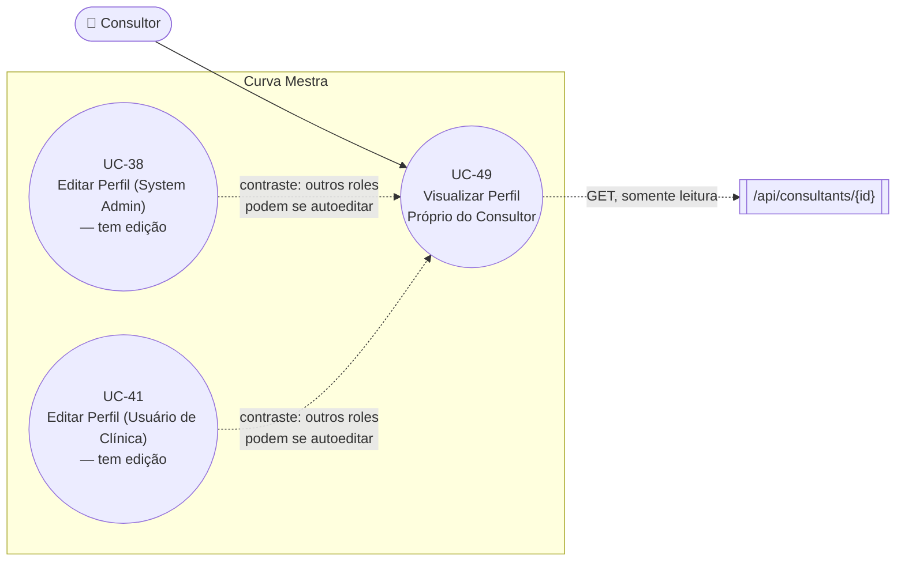

# UC-49: Visualizar Perfil Próprio do Consultor

**Projeto:** Curva Mestra
**Data de Criação:** 15/07/2026
**Autor:** Guilherme Scandelari (via uml-use-case-writer)
**Status:** Rascunho
**Módulo/Contexto:** Portal do Consultor

**Versão:** 1.0

> Um Consultor consulta, em `/consultant/profile`, os próprios dados cadastrais (código, nome, status, e-mail, telefone, data de cadastro) e um resumo do número de clínicas vinculadas. Diferente das telas de perfil dos demais roles (UC-38 para System Admin, UC-41 para usuários de clínica), esta tela é **inteiramente somente-leitura**: não há nenhum campo editável, nenhuma opção de trocar a própria senha, e o próprio texto da tela orienta o consultor a "entrar em contato com o suporte do sistema" para qualquer alteração cadastral.

---

## 1. Diagrama UML (Mermaid)

---

## 2. Atores

### 2.1 Ator Primário
**Consultor** — rota protegida do grupo `(consultant)`; nenhum outro role acessa esta tela.

### 2.2 Atores Secundários / Sistemas Externos
Nenhum.

---

## 3. Pré-condições
- Usuário autenticado com `is_consultant === true` e `consultant_id` definido nos custom claims (usado como `consultantId` pelo hook `useAuth`).

---

## 4. Pós-condições

### 4.1 Sucesso (Garantias de Sucesso)
- Nenhum dado é alterado — caso de uso puramente de consulta.
- Sistema exibe: código do consultor (destacado, com botão de copiar), nome, badge de status (Ativo/Inativo), e-mail, telefone, data de cadastro (`created_at`, formatada) e a contagem de `authorized_tenants` (clínicas vinculadas).

### 4.2 Falha (Garantias Mínimas)
- Se `GET /api/consultants/{consultantId}` falhar: erro apenas registrado via `console.error`; a tela permanece com `consultant: null`, exibindo campos vazios/undefined sem nenhuma mensagem de erro visível.

---

## 5. Gatilho (Trigger)
Consultor navega para `/consultant/profile` (menu "Meu Perfil" do Portal do Consultor).

---

## 6. Fluxo Principal (Basic Flow)

1. Consultor acessa `/consultant/profile`.
2. Sistema chama `GET /api/consultants/{consultantId}` (usando o `consultantId` do próprio usuário autenticado, vindo de `useAuth`).
3. API verifica autenticação e permissão: apenas `system_admin` ou o próprio consultor (`decodedToken.consultant_id === consultantId`) podem ler — garantindo que um consultor nunca visualize o perfil de outro.
4. Sistema exibe o card de código (destaque visual, com botão "Copiar" via `navigator.clipboard`), seguido do card "Informações Pessoais" (nome, badge de status, e-mail, telefone, data de cadastro) e do card "Clínicas Vinculadas" (contagem numérica de `authorized_tenants.length`).
5. Sistema exibe um card de ajuda fixo: "Para alterar seus dados cadastrais, entre em contato com o suporte do sistema" — não há nenhum link, botão ou formulário de edição na tela.
6. Caso de uso é concluído com sucesso.

---

## 7. Fluxos Alternativos
Nenhum identificado — a tela não tem parâmetros, filtros ou variações de estado além de carregando/carregado.

---

## 8. Fluxos de Exceção

### 8a. Falha ao carregar o perfil (a partir do passo 2)
1. `fetch` lança exceção, ou a API retorna erro (403/404/500).
2. Erro é apenas registrado via `console.error('Erro ao carregar perfil:', error)`; a tela renderiza os cards normalmente, mas com todos os campos de `consultant` como `undefined` (React renderiza como vazio) — sem nenhuma mensagem de erro visível ao usuário.

---

## 9. Regras de Negócio Relacionadas

| ID | Regra | Justificativa |
|----|-------|----------------|
| RN-01 | **[Achado — assimetria confirmada entre roles]** Diferente de UC-38 (System Admin) e UC-41 (Usuário de Clínica), que permitem autoedição de nome e senha, o Consultor **não tem nenhum mecanismo de autoatendimento** para alterar seus próprios dados cadastrais ou senha — a única orientação da própria tela é contatar o suporte. Não foi encontrada, em nenhum ponto do código, uma rota `PUT`/`PATCH` que um consultor possa chamar sobre seu próprio registro. | Confirmado por leitura completa de `ConsultantProfilePage` (nenhum formulário/botão de edição) e por busca em `src/app/api/consultants/` por rotas de atualização acessíveis ao próprio consultor — `PUT /api/consultants/[id]` (visto em UC-29) é restrita a `system_admin`. |
| RN-02 | A API restringe a leitura ao próprio consultor (`consultant_id` do token) ou a `system_admin` — nunca a outro consultor nem a usuários de clínica, mesmo que soubessem o ID. | Confirmado por leitura de `GET /api/consultants/[id]/route.ts`, linhas 31-37. |
| RN-03 | Falha de carregamento não é tratada com nenhum estado de erro — os campos apenas aparecem vazios, indistinguíveis de um consultor com dados genuinamente ausentes no cadastro. | Confirmado por leitura de `loadProfile` — `catch` apenas com `console.error`, sem `setError`. |

---

## 10. Requisitos Especiais / Não Funcionais

| ID | Descrição | Categoria |
|----|-----------|-----------|
| RNF-01 | Ausência total de autoatendimento (RN-01) — todo pedido de alteração cadastral do consultor depende de um canal de suporte fora do sistema, diferente do padrão dos outros dois roles. | Usabilidade / Suporte |
| RNF-02 | Nenhum feedback de erro visível em caso de falha de carregamento (RN-03). | Usabilidade |

---

## 11. Frequência de Uso
Ocasional — consulta pontual do próprio consultor para conferir ou compartilhar seu código.

---

## 12. Casos de Uso Relacionados
- **UC-38 (Editar Perfil e Trocar Senha do System Admin)** e **UC-41 (Editar Perfil e Trocar Senha do Usuário de Clínica)** — telas equivalentes de outros roles, mas com edição real; contraste direto com a ausência de autoedição aqui (RN-01).
- **UC-30 (Redefinir Senha do Consultor via Link)** e **UC-30-adjacente** — mecanismos de troca de senha do consultor, mas sempre iniciados pelo `system_admin`, nunca pelo próprio consultor.
- **UC-48 (Consultar Clínicas Vinculadas e Estoque)** — outra tela somente-leitura do mesmo portal; juntas, cobrem toda a navegação de consulta do Portal do Consultor.

---

## 13. Referências
- `src/app/(consultant)/consultant/profile/page.tsx`
- `src/app/api/consultants/[id]/route.ts` (`GET`)
- `src/types/index.ts` (`Consultant`)

---

## 14. Perguntas em Aberto / Decisões Pendentes

⚠️ Os itens abaixo são achados confirmados por leitura de código que representam decisões de produto pendentes de confirmação — não foram decididos unilateralmente por este documento.

1. **[Achado, requer decisão de produto]** RN-01 — é intencional que o Consultor nunca possa autoeditar nome/senha (delegando sempre ao suporte/System Admin), diferente dos outros dois roles? Se não for intencional, é uma lacuna de funcionalidade a implementar.
2. **[Observação]** RN-03 — vale conectar tratamento de erro visível, hoje silencioso?

---

## 15. Histórico de Versões

| Versão | Data | Autor | O que mudou |
|--------|------|-------|--------------|
| 1.0 | 15/07/2026 | Guilherme Scandelari | Versão inicial, investigada por leitura completa de `ConsultantProfilePage` e `GET /api/consultants/[id]/route.ts`. Identificado achado principal: diferente de UC-38/UC-41, o Consultor não tem nenhum mecanismo de autoatendimento para editar os próprios dados ou senha — a tela é inteiramente somente-leitura, orientando contato com o suporte para qualquer alteração (RN-01). |
