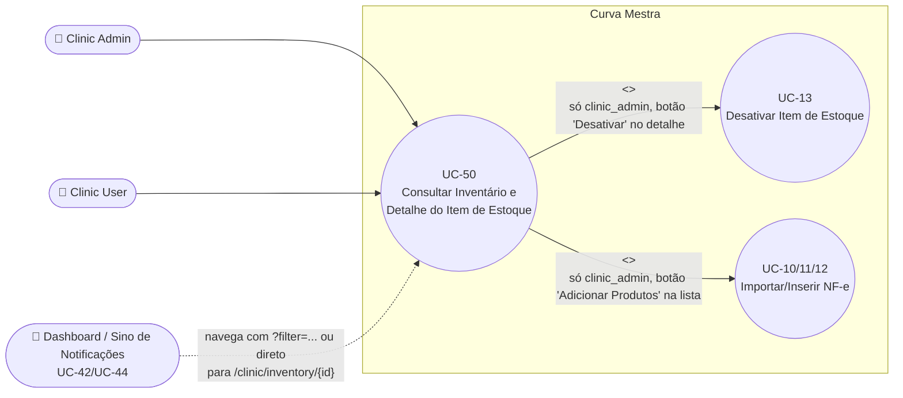

# UC-50: Consultar Inventário e Detalhe do Item de Estoque

**Projeto:** Curva Mestra
**Data de Criação:** 17/07/2026
**Autor:** Guilherme Scandelari (via uml-use-case-writer)
**Status:** Rascunho
**Módulo/Contexto:** Inventário
**Versão:** 1.2

> Clinic Admin e Clinic User consultam o inventário da própria clínica em duas telas encadeadas: `/clinic/inventory` (lista de lotes com cards de estatística, busca e filtros, em tempo real) e `/clinic/inventory/{id}` (detalhe de um único lote). Ambas são somente-leitura em si mesmas — as únicas ações de escrita alcançáveis a partir delas ("Adicionar Produtos" e "Desativar") já são cobertas por outros UCs (UC-10/UC-11/UC-12 e UC-13, respectivamente). Este UC documenta, junto com o fluxo de consulta, quatro divergências de dados/rótulos identificadas por leitura de código entre as duas telas (e entre elas e a tela de Relatórios, UC-47): três delas (RN-01, RN-02, RN-07) foram corrigidas na v1.2 (commit `216b3a0`), consolidando o cálculo entre lotes do mesmo produto via `agruparProdutosPorCodigo`; um bug de parâmetros de filtro incompatíveis vindos do Dashboard/notificações foi corrigido na v1.1 (commit `467f462`); e um texto de estado vazio desatualizado (RN-04) permanece em aberto.

---

## 1. Diagrama UML (Mermaid)

```mermaid
flowchart LR
    ClinicAdmin([👤 Clinic Admin])
    ClinicUser([👤 Clinic User])
    Dashboard([🔔 Dashboard / Sino de Notificações\nUC-42/UC-44])

    subgraph Sistema["Curva Mestra"]
        UC50(("UC-50\nConsultar Inventário e\nDetalhe do Item de Estoque"))
        UC13(("UC-13\nDesativar Item de Estoque"))
        UCAdd(("UC-10/11/12\nImportar/Inserir NF-e"))
    end

    ClinicAdmin --> UC50
    ClinicUser --> UC50
    Dashboard -.->|"navega com ?filter=... ou direto\npara /clinic/inventory/{id}"| UC50
    UC50 -->|"<<extend>>\nsó clinic_admin, botão 'Desativar' no detalhe"| UC13
    UC50 -->|"<<extend>>\nsó clinic_admin, botão 'Adicionar Produtos' na lista"| UCAdd
```

---

## 2. Atores

### 2.1 Ator Primário
**Clinic Admin** e **Clinic User** — ambas as telas ficam sob o grupo de rota `(clinic)`, protegido por `ProtectedRoute allowedRoles={['clinic_admin', 'clinic_user']}` (`src/app/(clinic)/layout.tsx`). Não há nenhuma diferença de acesso às telas em si entre os dois papéis; a única distinção de permissão dentro deste UC é a exibição condicional de dois botões que **levam a outros casos de uso**: "Adicionar Produtos" (lista) e "Desativar" (detalhe), ambos com `isAdmin = claims?.role === 'clinic_admin'` como condição.

### 2.2 Atores Secundários / Sistemas Externos
Nenhum sistema externo. Os dados consultados são os mesmos geridos pelos módulos de importação de NF-e (UC-10/UC-11), resolução de pendências (UC-12) e desativação (UC-13), todos sobre a mesma coleção `tenants/{tenantId}/inventory`.

---

## 3. Pré-condições
- Usuário autenticado com `tenant_id` definido nos custom claims, role `clinic_admin` ou `clinic_user`.
- **Lista:** nenhuma pré-condição de existência de dados — o inventário pode estar vazio.
- **Detalhe:** o `id` da URL deve corresponder a um documento existente em `tenants/{tenantId}/inventory`. **Não precisa estar `active: true`** — `getInventoryItem` busca o documento por ID sem filtrar por status, diferente da lista (RN-05).

---

## 4. Pós-condições

### 4.1 Sucesso (Garantias de Sucesso)
- Nenhum dado é alterado por este caso de uso em si (somente leitura).
- **Lista:** exibe todos os itens ativos (`active: true`) do tenant, atualizados em tempo real (listener `onSnapshot`, sem necessidade de recarregar a página quando outro usuário/dispositivo importa uma NF ou desativa um item), com quatro cards de estatística e uma tabela filtrável/pesquisável.
- **Detalhe:** exibe todos os campos do lote (identificação, quantidades, validade, valores, dados de fragmentação quando aplicável, histórico de criação/atualização, status ativo/inativo).
- **[CORRIGIDO no commit `216b3a0`]** O card "Total de Produtos" da lista agora conta produtos distintos, consistente com a tela de Relatórios/UC-47 (RN-01); o detalhe agora exibe tanto o valor do lote atual quanto o valor consolidado do produto entre todos os lotes ativos (RN-02); e o badge de status de estoque do detalhe agora é calculado de forma agregada entre todos os lotes ativos do produto, alinhado ao cálculo já usado na lista (RN-07).

### 4.2 Falha (Garantias Mínimas)
- **Lista:** se a consulta falhar, a tabela é substituída por uma mensagem de erro ("Erro ao carregar inventário"); os cards de estatística continuam sendo calculados sobre uma lista vazia (mostrando zeros), sem indicar que os números são inválidos por causa do erro.
- **Detalhe:** se o item não existir ou a consulta falhar, a tela inteira é substituída por uma mensagem de erro ("Produto não encontrado" ou "Erro ao carregar produto") com um botão para voltar à lista.

---

## 5. Gatilho (Trigger)
Clinic Admin/User clica em "Gerenciar Estoque" no menu lateral (`ClinicLayout`, rota `/clinic/inventory`); alternativamente, chega à lista já com um filtro na URL a partir dos cards de alerta ou do botão "Ver todos os alertas" **do Dashboard**, ou chega direto ao **detalhe** de um item a partir de uma notificação do sino que referencia `inventory_id` (`NotificationBell`, UC-44) — o sino de notificações nunca navega para a lista com filtro na URL, apenas direto ao detalhe do item (correção factual da v1.1 — ver RN-03).

---

## 6. Fluxo Principal (Basic Flow)

1. Clinic Admin/User clica em "Gerenciar Estoque"; sistema navega para `/clinic/inventory`.
2. Sistema lê `claims.tenant_id` e `claims.role` (`isAdmin = role === 'clinic_admin'`); se `tenant_id` ainda não estiver disponível, a página não renderiza nada (`return null`) até o hook `useAuth` resolver.
3. Sistema monta uma query em `tenants/{tenantId}/inventory` com `where('active','==',true)` e `orderBy('nome_produto','asc')`, e inscreve um listener em tempo real (`onSnapshot`) — a prop `realtime` é sempre `true` nesta rota.
4. Em paralelo, sistema busca `tenants/{tenantId}/stock_limits` para montar um mapa de limites de estoque baixo por `codigo_produto` (UC-15); falha nessa busca é silenciosa (`.catch(() => {})`) e não impede o carregamento da lista.
5. Enquanto carrega, sistema exibe skeletons no lugar da tabela.
6. Sistema calcula, sobre a lista carregada (`baseInventory` — sem filtro de marca nesta rota, diferente do Portal do Consultor em UC-48): **[CORRIGIDO no commit `216b3a0`]** "Total de Produtos" (agora conta **produtos distintos**, via `agruparProdutosPorCodigo(baseInventory).length` — antes contava documentos de lote, RN-01), "Produtos Disponíveis" (soma de `quantidade_disponivel` de todos os lotes, com "reservados" = soma de `quantidade_reservada`), "Próximos ao Vencimento" (lotes com validade em até 30 dias e `quantidade_disponivel > 0`), e "Estoque Baixo" (contagem de `codigo_produto` **distintos** cujo total agregado entre todos os lotes está no limite configurado, ou ≤10 se não configurado; o total agregado por código também é derivado de `agruparProdutosPorCodigo`, agora reaproveitada como fonte única de verdade compartilhada com `reportService.ts`).
7. Sistema exibe a tabela: uma linha por lote (Código, Produto, Lote, NF, Qtd. Total, Reservado, Disponível, Validade, Valor Unitário, badges de validade e de status de estoque).
8. Clinic Admin/User pode digitar um termo de busca (filtra localmente por nome, código, lote ou número de NF, sem nova consulta ao Firestore), selecionar uma categoria (`MASTER_PRODUCT_CATEGORIES`) e/ou clicar em um filtro rápido (Todos / Vencidos / Vencendo / Estoque Baixo / Esgotado) — todos combináveis entre si, aplicados em memória sobre os dados já carregados.
9. Se a URL contiver `?filter=...` ao carregar a página (vindo do Dashboard), o valor é usado como filtro inicial.
10. Clinic Admin/User clica em uma linha da tabela; sistema navega para `/clinic/inventory/{id}`.
11. Sistema busca o item (`getInventoryItem`, sem filtro por `active`) e o mapa de limites (`getStockLimitsMap`) em paralelo (`Promise.all`).
12. **[CORRIGIDO no commit `216b3a0`]** Sistema também busca os lotes-irmãos do mesmo produto via `getInventoryItemsByCodigo(tenantId, codigo_produto)` (nova função em `inventoryService.ts`) e computa `agruparProdutosPorCodigo` sobre eles — mesma função/fonte única de verdade já usada pela lista. Sistema exibe: nome e código do produto no cabeçalho, badge de validade e badge de status de estoque (agora calculado sobre a quantidade agregada de todos os lotes ativos do produto, `produtoConsolidado.quantidade_total` — antes usava apenas a quantidade deste lote, RN-07, alinhando-se ao cálculo já usado na lista); card "Informações do Produto" (código, nome, lote, e — se houver — número da NF de origem com badge de tipo de nota "Bonificação"/"Venda"/"Outro"); card "Estoque e Valores" (quantidade inicial, quantidade disponível, barra de "Utilizado", limite de estoque baixo configurado — ou 10 padrão —, valor unitário, "Valor Total deste Lote" — rótulo novo; antes se chamava "Valor Total em Estoque" mas só somava este lote, RN-02 — e "Valor Total em Estoque" — novo, valor consolidado somando todos os lotes ativos do produto, com indicação de quantos lotes quando houver mais de um); card "Informações de Fragmentação" (somente se `item.fragmentavel`); cards de "Datas Importantes" (validade, entrada) e "Informações do Sistema" (criado em, atualizado em, badge Ativo/Inativo).
13. Se `isAdmin` e `item.active === true`, sistema exibe o botão "Desativar" (fluxo detalhado em UC-13).
14. Clinic Admin/User clica em "Voltar"; sistema navega de volta para `/clinic/inventory`.
15. Caso de uso é concluído a qualquer momento em que o usuário navega para fora dessas duas telas.

---

## 7. Fluxos Alternativos

### 7a. Clinic Admin clica em "Adicionar Produtos" (a partir do passo 7, somente `isAdmin`)
1. Sistema navega para `/clinic/add-products`.
2. Fluxo continua em UC-10 (Importar NF-e via XML), UC-11 (Inserir Nota Fiscal Manualmente) ou UC-12 (Resolver Produtos Pendentes), fora do escopo deste UC.

### 7b. Usuário clica em "Exportar Excel" (a partir do passo 7)
1. Sistema gera um arquivo Excel a partir dos itens **atualmente filtrados** (`filteredInventory`, respeitando busca/categoria/filtro rápido em vigor no momento do clique), com colunas Código, Produto, Lote, Qtd. Total, Reservado, Disponível, Validade, Valor Unitário e NF.
2. Download é iniciado pelo navegador; nenhum dado do Firestore é alterado.

### 7c. Nenhum item encontrado após busca/filtro (a partir do passo 8)
1. `filteredInventory.length === 0` com `searchTerm` preenchido ou `filterBy !== 'all'`.
2. Sistema exibe "Nenhum produto encontrado" com "Tente ajustar os filtros ou busca".

### 7d. Inventário vazio, sem nenhum filtro aplicado (a partir do passo 7)
1. `filteredInventory.length === 0`, sem busca nem filtro ativo.
2. Sistema exibe "Nenhum produto encontrado" com **"Faça upload de uma DANFE para adicionar produtos"** — texto desatualizado, referente ao fluxo de importação por PDF/DANFE que foi removido do sistema (ver RN-04 e `CLAUDE.md`, seção "Funcionalidades Desabilitadas" — a importação atual é exclusivamente via XML).

### 7e. Acesso direto ao detalhe de um item desativado (a partir do passo 11)
1. `id` da URL corresponde a um item com `active: false` (não haveria como chegar a ele clicando em uma linha da lista, já que a lista só traz itens ativos — só é alcançável por URL direta, ex.: link salvo, ou notificação antiga referenciando um item já desativado depois).
2. Sistema exibe o detalhe normalmente, com badge "Status: Inativo" e **sem** o botão "Desativar" (mesmo para `clinic_admin` — a condição exige `item.active === true`). **[Nota]** Como o item está inativo, `getInventoryItemsByCodigo` (RN-02/RN-07) não o inclui entre os lotes-irmãos consultados (que filtram `active: true`); se não houver nenhum outro lote ativo do mesmo produto, o "Valor Total em Estoque" e o status agregado usam apenas os dados deste próprio item como fallback (ver seção 9, RN-02/RN-07).

---

## 8. Fluxos de Exceção

### 8a. Erro ao carregar a lista (a partir do passo 3)
1. O listener `onSnapshot` retorna erro (ex.: falha de rede/permissão).
2. Sistema exibe "Erro ao carregar inventário" no lugar da tabela; os quatro cards de estatística continuam visíveis, calculados sobre uma lista vazia (mostram zero), sem nenhuma indicação visual de que o erro os afeta.

### 8b. Item não encontrado ou erro ao carregar o detalhe (a partir do passo 11)
1. `getInventoryItem` retorna `null` (documento não existe, ou pertence a outro tenant — a leitura é sempre escopada a `tenants/{tenantId}/inventory/{itemId}`, então um `itemId` de outro tenant simplesmente não é encontrado) ou lança exceção.
2. Sistema exibe uma tela cheia com "Produto não encontrado" (não encontrado) ou "Erro ao carregar produto" (exceção), com um botão "Voltar ao Inventário".

### 8c. [CORRIGIDO em v1.1 — commit `467f462`] Filtro vindo do Dashboard não reconhecido pela tela (a partir do passo 9)
**Antes:** o Dashboard (`src/app/(clinic)/clinic/dashboard/page.tsx:375,403`) navegava para `/clinic/inventory` usando `?filter=expired` e `?filter=low-stock` (hífen) para os alertas de "vencidos" e "estoque baixo". `InventoryView` só reconhecia os valores `'expiring'`, `'low_stock'` (sublinhado) e `'out_of_stock'` nos filtros rápidos (`applyFilter`, linhas 117-128) — os valores `'expired'` e `'low-stock'` (hífen) não correspondiam a nenhum ramo do `if/else if`, e o filtro não era aplicado: a tela silenciosamente mostrava **todos** os itens (mesmo comportamento de `filter=all`), sem nenhum aviso de que o filtro pretendido (vencidos / estoque baixo) não foi respeitado; nenhum dos botões de filtro rápido aparecia selecionado, já que `filterBy` continha um valor que não batia com nenhum deles. Usuário precisava perceber sozinho que a lista não estava filtrada como esperado.

**Agora:** `applyFilter` ganhou um branch dedicado para `'expired'` (`dt_validade < now && quantidade_disponivel > 0`), semanticamente distinto de `'expiring'` — que continua com sua lógica original (`dt_validade <= now + 30 dias`, incluindo itens já vencidos; isso é um achado separado, já documentado em UC-47-RN-01, não alterado por esta correção). Os chips de filtro rápido da UI ganharam a opção "Vencidos" ao lado de "Vencendo". O link de estoque baixo do Dashboard foi corrigido de `?filter=low-stock` para `?filter=low_stock`.

**Correção factual adicional desta revisão (não relacionada ao commit acima):** a versão anterior deste fluxo também atribuía o uso de `?filter=` ao sino de notificações (`NotificationBell.tsx`) — não confirmado no código. `NotificationBell` (`handleNotificationClick`) nunca usa querystring de filtro: navega apenas diretamente para `/clinic/inventory/{notification.inventory_id}` (detalhe do item) ou `/clinic/requests/{notification.request_id}`. Ver RN-03 e Seção 13.

---

## 9. Regras de Negócio Relacionadas

| ID | Regra | Justificativa |
|----|-------|----------------|
| RN-01 | **[CORRIGIDO — commit `216b3a0`]** Até esta correção, o card "Total de Produtos" da lista (`InventoryView.tsx:332-335`) exibia `baseInventory.length` — contava **documentos de lote** (um por combinação produto+lote+NF importada); se o mesmo `codigo_produto` aparecia em 3 lotes, mostrava 3. Já o card "Total de Produtos" da tela de Relatórios (`ReportsView.tsx:271-272`, UC-47), alimentado por `reportService.ts:113` (`total_produtos: produtosMap.size`), conta **produtos distintos** consolidados por `codigo_produto` via `Map` — o mesmo cenário mostraria 1. O mesmo rótulo, para o mesmo estoque, mostrava números diferentes nas duas telas. Corrigido: `InventoryView.tsx` agora deriva `produtosAgrupados` de `agruparProdutosPorCodigo(baseInventory)` (mesma função já usada por `reportService.ts` internamente, agora reaproveitada como fonte única de verdade compartilhada) e o card "Total de Produtos" passa a exibir `produtosAgrupados.length` — produtos distintos, consistente com Relatórios. | Corrigido por leitura direta de `InventoryView.tsx` (commit `216b3a0`) — uso de `agruparProdutosPorCodigo` (`inventoryUtils.ts`), comparado a `reportService.ts:78-118`/`ReportsView.tsx:271-272`. |
| RN-02 | **[CORRIGIDO — commit `216b3a0`]** Até esta correção, no detalhe (`inventory/[id]/page.tsx:386-389`), `item.valor_unitario * item.quantidade_disponivel` era rotulado como "Valor Total em Estoque", mas era o valor apenas deste lote/documento — não do produto consolidado entre todos os lotes, sem deixar claro esse escopo. Corrigido: a tela agora busca os lotes-irmãos via `getInventoryItemsByCodigo(tenantId, codigo_produto)` (nova função em `inventoryService.ts`, que busca lotes `active: true` do mesmo `codigo_produto`) e computa `agruparProdutosPorCodigo` sobre eles. Passou a exibir dois valores distintos e claramente rotulados: "Valor Total deste Lote" (rótulo novo, o antigo cálculo por lote) e "Valor Total em Estoque" (novo, soma consolidada de todos os lotes ativos do produto, com indicação de quantos lotes quando houver mais de um). | Corrigido por leitura direta de `inventory/[id]/page.tsx` (commit `216b3a0`) — nova função `getInventoryItemsByCodigo` (`inventoryService.ts`) e reaproveitamento de `agruparProdutosPorCodigo` (`inventoryUtils.ts`), comparado à consolidação por produto em `reportService.ts`. |
| RN-03 | **[CORRIGIDO em v1.1 — commit `467f462`]** Antes: o Dashboard (`dashboard/page.tsx:375,403`) navegava para `/clinic/inventory` com `?filter=expired` e `?filter=low-stock`, mas `InventoryView` (`applyFilter`, linhas 117-128) só reconhecia `'expiring'`, `'low_stock'` (sublinhado) e `'out_of_stock'` — os valores `'expired'` e `'low-stock'` não correspondiam a nenhum filtro, e a lista era exibida sem filtro (equivalente a "Todos"), silenciosamente. Agora: `applyFilter` ganhou um branch dedicado para `'expired'` (`dt_validade < now && quantidade_disponivel > 0`, semanticamente distinto de `'expiring'`, cuja lógica original não foi alterada — ver UC-47-RN-01), com um novo chip "Vencidos" na UI ao lado de "Vencendo"; o link de estoque baixo do Dashboard foi corrigido para `?filter=low_stock` (underscore). **Correção factual adicional desta revisão:** a afirmação original de que o sino de notificações (`NotificationBell.tsx`) também navegava com `?filter=` não se confirma no código — o componente só navega diretamente para `/clinic/inventory/{notification.inventory_id}` (detalhe do item), nunca com querystring de filtro. Ver Fluxo de Exceção 8c (corrigido). | Correção confirmada por leitura do commit `467f462` (`InventoryView.tsx`, `dashboard/page.tsx`). Leitura completa de `NotificationBell.tsx` (`handleNotificationClick`, linhas 84-98) confirma que o componente nunca usa `?filter=` — apenas `router.push(\`/clinic/inventory/${notification.inventory_id}\`)` ou `router.push(\`/clinic/requests/${notification.request_id}\`)`. |
| RN-04 | **[Achado, texto desatualizado — não corrigido]** O estado vazio da lista, quando não há nenhum filtro/busca aplicado e o tenant não tem nenhum item ativo, exibe "Faça upload de uma DANFE para adicionar produtos" (`InventoryView.tsx:464`) — texto que se refere ao fluxo de importação por PDF/DANFE, removido definitivamente do sistema (ver `CLAUDE.md`, seção "Funcionalidades Desabilitadas — Importação via XML NF-e" — `src/app/api/parse-nf/route.ts` foi deletado). O fluxo atual de adição de produtos é via upload de XML (UC-10) ou inserção manual (UC-11), acessados por "Adicionar Produtos" → `/clinic/add-products`. | Confirmado por leitura de `InventoryView.tsx:464` comparada ao `CLAUDE.md` do projeto. Não corrigido no commit `216b3a0` — fora do escopo desta rodada. |
| RN-05 | A lista (`InventoryView`) só exibe itens com `active: true` (`where('active','==',true)`); o detalhe (`getInventoryItem`) não filtra por `active` — busca o documento por ID independentemente do status. Consequência: um item desativado nunca aparece na lista, mas seu detalhe continua acessível por URL direta (ver Fluxo Alternativo 7e). | Confirmado pela query de `InventoryView.tsx:236` comparada à ausência de filtro em `getInventoryItem` (`inventoryService.ts:337-386`). |
| RN-06 | Busca textual, filtro de categoria e filtro rápido (Todos/Vencidos/Vencendo/Estoque Baixo/Esgotado) são combinados com **E lógico** (todos aplicados em sequência sobre o mesmo array) — não são mutuamente exclusivos. | Confirmado por leitura de `applyFilter` (`InventoryView.tsx:101-146`), que aplica os filtros em sequência sobre a mesma variável `filtered`. |
| RN-07 | **[CORRIGIDO — commit `216b3a0`]** Até esta correção, o badge de status de estoque ("Normal"/"Baixo"/"Esgotado") era calculado de forma diferente nas duas telas para o **mesmo lote**: na lista, `getItemStatus` (`InventoryView.tsx:219-223`) usava o total **agregado** de `quantidade_disponivel` de **todos os lotes** do mesmo `codigo_produto` (`totalByCode`); no detalhe, o mesmo badge (`inventory/[id]/page.tsx:228-233`) usava apenas a `quantidade_disponivel` **deste lote específico**. Para um produto com múltiplos lotes, era possível que a linha da lista mostrasse "Normal" (soma de todos os lotes acima do limite) enquanto o detalhe desse mesmo lote mostrasse "Baixo" (isoladamente abaixo do limite), ou vice-versa. Corrigido: o detalhe agora usa `produtoConsolidado.quantidade_total` (derivado de `agruparProdutosPorCodigo` sobre os lotes-irmãos buscados via `getInventoryItemsByCodigo`) no lugar de `item.quantidade_disponivel`, alinhando-se ao cálculo já usado na lista. | Corrigido por leitura direta de `inventory/[id]/page.tsx` (commit `216b3a0`) — `stockStatus` agora deriva de `getStatusEstoque({ quantidade_disponivel: produtoConsolidado.quantidade_total, ... })`, comparado a `getItemStatus` (`InventoryView.tsx:219-223`). |
| RN-08 | O limite de estoque baixo usado em ambas as telas vem de `tenants/{tenantId}/stock_limits/{codigo_produto}` (UC-15); na ausência de configuração para o produto, o padrão é 10 unidades (`getStatusEstoque`, `inventoryUtils.ts:28`), o mesmo padrão usado por UC-42/UC-43/UC-48 (RN-03 de UC-48 já registra que esse valor "10" é coincidência de número entre mecanismos independentes, não relação de código). | Confirmado por leitura de `getStatusEstoque` (`inventoryUtils.ts:23-30`) e uso idêntico em `InventoryView.tsx` e `inventory/[id]/page.tsx`. |

---

## 10. Requisitos Especiais / Não Funcionais

| ID | Descrição | Categoria |
|----|-----------|-----------|
| RNF-01 | A lista usa um listener em tempo real (`onSnapshot`) sempre ativo enquanto a tela está aberta — qualquer alteração no inventário do tenant (por qualquer usuário/dispositivo) reflete automaticamente, sem necessidade de recarregar a página. O detalhe **não** usa realtime — é uma leitura única (`getDoc`/`getDocs`, incluindo a nova busca de lotes-irmãos via `getInventoryItemsByCodigo`) no carregamento da página. | Consistência de UI / Desempenho |
| RNF-02 | A lista carrega **todos** os itens ativos do tenant de uma vez (sem paginação no Firestore) e aplica busca/filtros inteiramente em memória no cliente — pode se tornar um ponto de atenção de desempenho para tenants com um volume muito grande de lotes ativos. O detalhe, desde o commit `216b3a0`, também carrega todos os lotes ativos do mesmo `codigo_produto` (via `getInventoryItemsByCodigo`) para consolidar valor/status — mesma característica de ausência de paginação. | Desempenho |
| RNF-03 | A exportação para Excel (`exportToExcel`) é inteiramente client-side, sobre os dados já carregados e filtrados — não há chamada adicional ao backend. | Desempenho |
| RNF-04 | Multi-tenant garantido pela query sempre escopada a `tenants/{tenantId}/inventory` (lista) e `tenants/{tenantId}/inventory/{itemId}` (detalhe) — um `itemId` de outro tenant nunca é encontrado (RN de 8b), reforçado pela regra genérica `tenants/{tenantId}/{document=**}` do Firestore. | Multi-tenant / Segurança |

---

## 11. Frequência de Uso
Alta — é a tela central de consulta diária do estoque da clínica, ponto de entrada mais comum tanto para navegação livre (menu "Gerenciar Estoque") quanto para investigação de alertas (Dashboard, notificações).

---

## 12. Casos de Uso Relacionados
- **UC-13 (Desativar Item de Estoque com Verificação de Reservas Ativas)** — `<<extend>>` a partir do botão "Desativar" no detalhe, visível apenas para `clinic_admin` em itens ativos.
- **UC-10 (Importar NF-e via Upload de XML)**, **UC-11 (Inserir Nota Fiscal Manualmente)** e **UC-12 (Resolver Produtos Pendentes de Cadastro)** — `<<extend>>` a partir do botão "Adicionar Produtos" na lista, visível apenas para `clinic_admin`.
- **UC-14 (Auditar e Corrigir Inconsistências de Inventário)** — opera sobre a mesma coleção `tenants/{tenantId}/inventory`, mas é uma rota órfã sem link a partir deste UC.
- **UC-15 (Configurar Limite de Estoque Baixo por Produto)** — fonte do limite usado pelo badge de status de estoque em ambas as telas deste UC (RN-08).
- **UC-42 (Executar Verificações de Alertas Manualmente)** e **UC-44 (Consultar e Gerenciar Notificações Recebidas)** — origem de dois pontos de entrada para este UC (cards de alerta do Dashboard e clique em notificação com `inventory_id`); o bug de parâmetros de filtro incompatíveis (RN-03) já foi corrigido (v1.1).
- **UC-47 (Gerar Relatórios de Estoque, Vencimento e Consumo)** — mesma fonte de dados (`tenants/{tenantId}/inventory`); o card "Total de Produtos" desta tela e o de UC-47 usavam cálculos diferentes (RN-01) — corrigido no commit `216b3a0`, ambos agora derivam de `agruparProdutosPorCodigo`.
- **UC-48 (Consultar Clínicas Vinculadas e Estoque)** — reaproveita o mesmo componente `InventoryView` documentado neste UC, em modo `readOnly`/`onlyBrand="Rennova"`, para o Portal do Consultor — incluindo a correção do card "Total de Produtos" (RN-01).

---

## 13. Referências
- `src/app/(clinic)/clinic/inventory/page.tsx`
- `src/app/(clinic)/clinic/inventory/[id]/page.tsx` (busca de lotes-irmãos via `getInventoryItemsByCodigo` e cálculo de `produtoConsolidado`, adicionados no commit `216b3a0` — RN-02/RN-07)
- `src/components/inventory/InventoryView.tsx` (linhas 101-146 `applyFilter` — inclui o branch `'expired'` adicionado no commit `467f462`, 219-223 `getItemStatus`, 275-288 `handleExport`, 329-383 cards de estatística — `produtosAgrupados`/`totalByCode` derivados de `agruparProdutosPorCodigo` desde o commit `216b3a0`, 464 texto de estado vazio)
- `src/lib/services/inventoryService.ts` (`getInventoryItem`, `getStockLimitsMap`, `getInventoryItemsByCodigo` — nova função, commit `216b3a0`)
- `src/lib/inventoryUtils.ts` (`getStatusEstoque`, `agruparProdutosPorCodigo` — reaproveitada em `InventoryView.tsx` e no detalhe do item desde o commit `216b3a0`)
- `src/lib/services/reportService.ts` (linhas 78-118, `total_produtos: produtosMap.size` — mesma lógica de consolidação agora compartilhada via `agruparProdutosPorCodigo`, RN-01)
- `src/app/(clinic)/clinic/dashboard/page.tsx` (linhas 375, 389, 403, 592 — origem dos parâmetros `?filter=`, corrigidos no commit `467f462`, RN-03)
- `src/components/notifications/NotificationBell.tsx` (`handleNotificationClick`, linha 92 — navegação direta a `/clinic/inventory/{inventory_id}`; nunca usa `?filter=` — correção factual da v1.1, ver RN-03)
- `src/components/clinic/ClinicLayout.tsx` (linha 36 — item de menu "Gerenciar Estoque")
- `src/app/(clinic)/layout.tsx` (`ProtectedRoute allowedRoles`)
- `CLAUDE.md` (seção "Funcionalidades Desabilitadas — Importação via XML NF-e", referenciada em RN-04)

---

## 14. Perguntas em Aberto / Decisões Pendentes

⚠️ Os itens abaixo são achados confirmados por leitura de código, registrados como decisões de produto pendentes — nenhum deles foi corrigido ou decidido unilateralmente por este documento, exceto os itens já marcados como resolvidos/corrigidos.

1. **[RESOLVIDO em v1.2 — commit `216b3a0`]** RN-01 — "Total de Produtos" agora conta produtos distintos na lista de inventário, consistente com Relatórios/UC-47 (antes contava documentos de lote). Corrigido via reaproveitamento de `agruparProdutosPorCodigo`.
2. **[RESOLVIDO em v1.2 — commit `216b3a0`]** RN-02 — o detalhe agora exibe dois valores distintos: "Valor Total deste Lote" e "Valor Total em Estoque" (consolidado entre todos os lotes ativos do produto).
3. **[RESOLVIDO em v1.1 — commit `467f462`]** RN-03 — os parâmetros `?filter=expired` e `?filter=low-stock` enviados pelo Dashboard não eram reconhecidos pela lista de inventário. Corrigido por ampliação de `applyFilter` (novo branch `'expired'`, distinto de `'expiring'`) e correção do link de estoque baixo do Dashboard (`low-stock` → `low_stock`). Ver Seção 8c e Seção 9 (RN-03).
4. **[Achado, texto desatualizado — não corrigido]** RN-04 — mensagem de estado vazio da lista ainda menciona "Faça upload de uma DANFE", fluxo removido do sistema (substituído por importação via XML). Atualizar o texto para refletir o fluxo atual?
5. **[RESOLVIDO em v1.2 — commit `216b3a0`]** RN-07 — o badge de status de estoque no detalhe agora usa a quantidade agregada de todos os lotes ativos do produto (mesmo cálculo da lista), eliminando a divergência entre as duas telas para o mesmo lote.
6. **[Observação]** RN-05 — um item desativado nunca aparece na lista, mas continua acessível por URL direta no detalhe (sem indicação de como o usuário chegaria a essa URL, exceto por link salvo ou notificação antiga). Comportamento aceitável como está, ou o detalhe de um item inativo deveria bloquear o acesso/redirecionar?

---

## 15. Histórico de Versões

| Versão | Data | Autor | O que mudou |
|--------|------|-------|--------------|
| 1.0 | 17/07/2026 | Guilherme Scandelari | Versão inicial. Investigado por leitura completa de `InventoryView.tsx`, `inventory/page.tsx`, `inventory/[id]/page.tsx`, `inventoryService.ts`, `inventoryUtils.ts`, `reportService.ts` (trecho de consolidação por produto), `dashboard/page.tsx` e `NotificationBell.tsx` (pontos de entrada com `?filter=`). Decisão de escopo: lista e detalhe foram documentados em um único UC (em vez de dois), seguindo o mesmo padrão já usado em UC-48 para telas encadeadas e somente-leitura — as únicas ações de escrita alcançáveis a partir daqui ("Adicionar Produtos", "Desativar") já têm UC próprio (UC-10/11/12, UC-13) e foram tratadas como `<<extend>>`. Registradas formalmente as duas divergências de rótulo apontadas no levantamento (RN-01, "Total de Produtos" lista vs. Relatórios; RN-02, "Valor Total em Estoque" por lote vs. por produto) e três achados adicionais confirmados nesta investigação: um bug de parâmetros de filtro incompatíveis entre Dashboard/notificações e a lista (RN-03), um texto de estado vazio desatualizado referenciando o fluxo de DANFE em PDF já removido (RN-04), e uma terceira divergência de cálculo (status de estoque agregado por produto na lista vs. por lote no detalhe, RN-07) — nenhuma delas corrigida, todas registradas como pendentes na seção 14. |
| 1.1 | 18/07/2026 | Guilherme Scandelari | RN-03 marcada como `[CORRIGIDO]`, citando o commit `467f462` ("fix: dois itens de alta severidade (UC-50, UC-39)") — `applyFilter` (`InventoryView.tsx`) ganhou um branch dedicado para `'expired'`, semanticamente distinto de `'expiring'` (lógica original não alterada), com um novo chip "Vencidos" na UI; o link de estoque baixo do Dashboard foi corrigido de `?filter=low-stock` para `?filter=low_stock`. Fluxo de Exceção 8c e item 3 da Seção 14 atualizados de acordo. Correção factual adicional (não relacionada ao commit): removida a afirmação incorreta de que `NotificationBell.tsx` também navega com `?filter=` — confirmado por leitura de `handleNotificationClick` que o componente só navega direto para `/clinic/inventory/{inventory_id}`, nunca com querystring de filtro; Seção 5 (Gatilho), Seção 9 (RN-03) e Seção 13 (Referências) corrigidas de acordo. |
| 1.2 | 25/07/2026 | Guilherme Scandelari | **Correção de três itens de severidade Média (commit `216b3a0`)**: RN-01, RN-02 e RN-07 corrigidas, todas usando `agruparProdutosPorCodigo` (`inventoryUtils.ts`) como fonte única de verdade. `InventoryView.tsx`: o card "Total de Produtos" agora conta produtos distintos (`produtosAgrupados.length`) em vez de documentos de lote (RN-01). `inventoryService.ts`: nova função `getInventoryItemsByCodigo(tenantId, codigoProduto)`, que busca todos os lotes ativos do mesmo produto. `inventory/[id]/page.tsx`: a tela de detalhe passou a buscar os lotes-irmãos via essa nova função e a exibir "Valor Total deste Lote" (renomeado) e "Valor Total em Estoque" (novo, consolidado entre todos os lotes ativos — RN-02); o badge de status de estoque passou a usar a quantidade agregada do produto em vez da quantidade do lote isolado (RN-07). Seções 1 (intro), 4.1, 6 (passos 6 e 12), 7e (nota adicional), 9 (RN-01/02/04/07), 10 (RNF-01/02), 12, 13 e 14 (itens 1, 2, 5) atualizadas de acordo. RN-04 (texto desatualizado "Faça upload de uma DANFE") e RN-05 (acesso direto ao detalhe de item inativo) permanecem em aberto, sem alteração de conteúdo além de referências cruzadas. |
